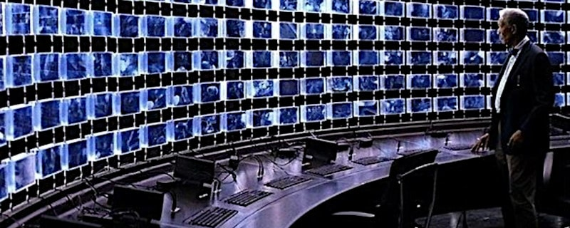
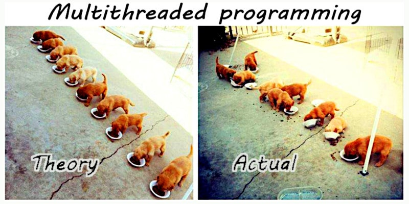
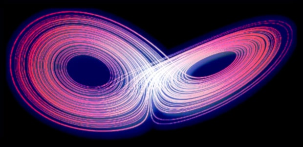

 

## L'illusione del controllo

* Published Apr 17, 2016 - origin [LinkedIn](https://www.linkedin.com/pulse/lillusione-del-controllo-roberto-a-foglietta)

Seconda edizione con attrattore di Lorenz e una più curata spiegazione della transizione di fase dei sistemi, anche in parte, intrinsecamente caotici.

---

### Premessa

Il 16 aprile sono stato al mini Italian Agile Day Savona 2016 e fra i tanti temi trattati mi è piaciuta in particolare un parte che comprendeva anche la categorizzazione dei sistemi in semplici, complicati, complessi e caotici.

Successivamente ho cercato di immaginare quali siano i meccanismi per i quali i sistemi possano transire da una categoria all'altra oppure sembrare appartenere ad una categoria ed invece avere proprietà miste.

Si tratta di un argomento veramente interessante perché trasversale a molti settori, a molti ruoli e soprattutto molto attuale perché allo svilupparsi delle competenze verticistiche (tecnici specialisti) si tende a perdere l'approccio sistemico alle soluzioni. 

Bisogna curare il malato nel suo complesso e non solo focalizzarsi sui sintomi della malattia. Ovviamente l'approccio olistico è fondamentale per l'innovazione altrimenti non sapremmo connettere due concetti distanti appartenenti ad ambiti differenti all'interno della stessa soluzione.

In particolare mi è venuto alla memoria un caso che sotto certi aspetti potremmo considerare esemplare che riguarda la validazione di sistemi informatici con elementi di criticità. Per i profani dell'informatica ha approntato una parentesi tecnica, qualora fossero anche dei curiosi, ma che non è strettamente necessaria alla comprensione e può essere saltata.

 

Per chi l'avesse saltata basta ricordare che esistono delle librerie che forniscono gli strumenti essenziali affinché un sistema multi-thread possa funzionare rispettando i criteri di atomicità, consistenza, isolamento e persistenza (ACID) ovvero possa essere complicato, eventualmente complesso, ma mai diventare caotico.

---

### Il vaso di pandora

In termini di ACID  (atomicity, consistency, isolation, and durability) questi criteri sono sempre verificati oppure non lo sono. 

Se non lo fossero si aprirebbe una porta d'accesso al caos. La memoria non è solo utilizzata per contenere informazioni ma anche puntatori e puntatori a funzione. In pratica, in un qualunque momento, il sistema potrebbe trovarsi a leggere dati corrotti, accedere ad indirizzi inattesi oppure eseguire codice inaspettato.

Quindi un sistema che dovrebbe essere prevedibile in realtà potrebbe contenere una sorgente nascosta di caos. Il nostro insieme di verifiche sul software ci dovrebbe permetterci di individuare anche queste problematiche, se fosse eseguito in modo esaustivo. Purtroppo nemmeno in questo caso possiamo avere una garanzia assoluta e ne vediamo il motivo qui sotto.

---

### Jitter, la variabilità del ritardo

Diciamo che esista una condizione che allunghi da 10ms a 30ms un certo ramo di elaborazione, un ramo che non capita spesso. Però questa differenza è sufficiente per far collidere il thread-A con il thread-B quindi ogni volta che la condizione si presenta, accade qualcosa di casuale.

Un pixel arancio invece che rosso, un "biep" invece che un "beep", un crash, un blocco e non è detto che capiti subito può darsi che la scrittura incorretta rimanga in memoria finché non venga richiamata e utilizzata in un qualsiasi altro momento.

Potrebbe persino essere salvata su flash e ripristinata alla prossima accensione. Se viene scritta su flash allora potrà presentarsi anche con una versione di software successiva, anche se quella fosse perfetta, i dati letti sarebbero errati. Quindi l'esito sarà imprevedibile in termini di effetti ma lo sarà anche in termini di tempi, un secondo, un minuto, un'ora, mai, non si sa.

---

### Miracoli al contrario

Perciò dal reparto dei test potrebbero arrivare segnalazioni sporadiche di eventi strani che risultino non ripetibili. Questi eventi potrebbero essere descritti e inseriti nella categoria: "*eventi inspiegabili di ragioni ignote*". Supponiamo di mettere tutti questi eventi nella categoria che simpaticamente chiameremo "UFO".

Allora vedremo che essa crescerà nel tempo. Un giorno potrebbe diventare statisticamente rilevante, ovvero potrebbe superare la soglia di frequenza oltre il quale un evento inatteso viene considerato un difetto da correggere ma considerata l'eterogeneità delle segnalazioni, tale categoria non sarebbe comunque significativa.

Cosa potremmo farcene di un insieme di eventi incomprensibili dalle cause ignote e dal manifestarsi irripetibile che per altro potrebbero essere tipici di una versione di sviluppo ma non di un altra?

La categoria degli eventi irripetibili è una categoria strana, da trattare con le pinze. Non può essere ignorata. Non può nemmeno essere considerata. Non può essere misurata in maniera
precisa perché non si conosce quanti di quegli eventi siano ancora attuali, quanti siano correlati al sistema attuale, quanti siano artefatti del sistema di verifica, etc.

Ma cosa ancora più imbarazzante: essa rimane inesorabilmente qualcosa al di fuori della nostra capacità di comprensione e di gestione. Salvo rifarsi alle teorie del caos, appunto!

Ritorniamo al nostro software: viene il giorno in cui si rilascia il prodotto collaudato e questo viene installato in milioni o decine di milioni di dispositivi. Sicuramente ha degli errori, pochi errori, essi sono noti, sono stati considerati rari, il loro impatto è complessivamente limitato, etc.

I dispositivi in campo affrontano situazioni molto diverse da quelle simulate nei test e le situazioni diverse implicano tempistiche diverse e dati diversi. Chi afferma il contrario è un ottimista.

Cominciano ad emergere degli errori e gli errori saranno amplificati dalla correlazione con la gestione dei processi multi-thread e se questa gestione è incorretta potrebbe iniettare elementi di caos nel sistema.

---

### Scovare questo problema

Riusciremo a scoprire questo problema almeno in produzione?

Non necessariamente, infatti tutti i sistemi sono fatti per interfacciarsi con un essere umano e gli esseri umani fanno errori in continuazione. Perciò non si riuscirà a distinguere statisticamente fra errori del software, irripetibili, ed errori umani. 

Inoltre non tutti gli errori potrebbero esserci riportati, ad esempio: 1000 errori impercepibili, 100 percepiti ma non segnalati, 10 segnalati, 1 critico. Agli sviluppatori arriva solo quello critico, tutto il resto viene filtrato dall'attenzione, dalla noia e dalla gestione clienti.

Pensiamo ad un secondo caso: l'errore A sia legato a una data specifica, quindi quel giorno, tutti i dispositivi, una decina di milioni di dispositivi, mostrerebbero comportamenti erratici, un comportamento statisticamente significativo.

Un errore ogni ogni ora oppure ogni minuto, non ha importanza, perché il giorno dopo tutto potrebbe sembrare essere tornato alla normalità. Potremmo mettere in relazione questa giornata con una tempesta magnetica di natura solare, un'interferenza non ben specificata, etc.

Pensiamo ad un terzo caso: ci sia un trattamento di un input che interferisca con un altro thread. Gli utenti che fanno variazioni rapide sperimenteranno eventi strani e quelli più pacati non avranno problemi ma apparentemente non esisterà mai un fattore comune facilmente identificabile.

Con il sig. Tizio il dispositivo presenta un problema ma lo stesso dispositivo dato alla sig.ra Caio non presenta quel problema, magari ne presenta altri. Eppure potrebbe essere sempre la stessa causa che si presenta con sintomi diversi.

---

### Questo è appunto il caos

In pratica quale che sia lo stadio di sviluppo di un prodotto, fintanto che qualcuno non scoprirà leggendo il codice sorgente, che c'è un problema che abbia come effetto l'introduzione di un elemento caotico nel funzionamento del sistema informatico molto difficilmente il problema potrà essere identificato dagli effetti, semplicemente avremo decine di milioni di dispositivi che in modo imprevedibile faranno cose impreviste e in momenti imprevedibili.

---

### Perché preoccuparsene?

Ci sono sette (oggi, otto) miliardi di persone in giro per il mondo, una sorgente di caos in più o in meno che differenza potrà mai fare?

1. Una è poco ma di più potrebbero essere troppo;

2. gli eventi hanno la tendenza a correlarsi;

3. i dispositivi comunicano con altri sistemi;

4. la non linearità delle transizioni di fase.

Riguardo all'ultimo punto, quando la densità delle sorgenti di caos superano un certo livello, un livello che a priori non conosciamo, il sistema farà una transizione a scalino.

 

Passando da uno stato (attrattore iniziale, comportamento atteso) ad un altro stato (altro attrattore, diverso comportamento). Una cosa comune sia nel meteo, sia nel clima e in generale in tutti i sistemi che ammettono, intrinsecamente, un certo livello di complessità.

---

### Conclusione

Un sistema complesso contenente elementi caotici può cambiare repentinamente di attrattore passando da un dominio stabile (risposta in uscita proporzionale al sollecitazione in ingresso) a un dominio instabile o caotico. Perciò il controllo rischia di essere una pia illusione ogni qualvolta un sistema contenga una sorgente di eventi caotici non adeguatamente isolata.

 

## Share alike

&copy; 2025, **Roberto A. Foglietta** &lt;roberto.foglietta@gmail.com&gt;, [CC BY-NC-ND 4.0](https://creativecommons.org/licenses/by-nc-nd/4.0/)

