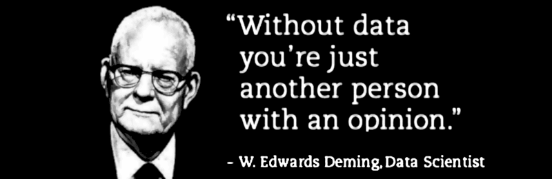

 

## Opinions, data and method

* Published Sep 3, 2016 - origin [LinkedIn](https://www.linkedin.com/pulse/opinions-data-method-roberto-a-foglietta)

---

The starting quote:

> Without data, you're just another person with an opinion &mdash; **W.E.Deming Data Scientist**.

Each quote meaning is going to change out of its original context and this is the main reason because we love quoting.

> A panel of opinions are the fuel of innovation.

Data will get into the scene when alternatives, options and opportunities have been explored then a feasibility analysis would take place.

A detailed analysis not necessarily is necessary if we initially focus on the right set of key performance indexes (KPI) and a reasonable worst scenario plus an exit strategy.

> It is better to have few main analysis and go in deep with the one more promising.

Moreover, data will change during the action plan, for this reason is more useful to have a good real-time data management rather than a single detailed initial analysis.

> Despite the complexity, each system have its own leverage points and intrinsic KPIs.

If we adapt our "business view" in terms of these new variables, then our actions and feedback reactions will be aligned with the system internals. This will allow us to act effectively.

> Without a method, data are just numbers.

We always could stretch and massage the numbers long and much enough to make them saying what we like.

A method is not like a box that prevent us to catch opportunities but it is something like ethics: it prevents we would be fooled by ourselves.

 

## Update from comments

Thanks to [Rohan Hine](https://www.linkedin.com/in/rohanhine):

> People with opinions, based on experience and skill, out perform data driven strategy every time.

Use caution when relying on pure data because the wise filtering and interpretation of data differentiates commercial success from failure.

Thanks to [Pamela Williams](https://www.bebee.com/bee/pamela-williams): 

> Moreover, data will change during the action plan, for this reason is more useful to have a good real-time data management rather than a single detailed initial analysis.

Getting decision makers to recognize this, is extremely difficult.

They don't understand data changes constantly, what is truth today is wrong tomorrow. 

I repeatedly point out that we have to watch trends as there is no single point "**right**" time.

 

## Share alike

&copy; 2025, **Roberto A. Foglietta** &lt;roberto.foglietta@gmail.com&gt;, [CC BY-NC-ND 4.0](https://creativecommons.org/licenses/by-nc-nd/4.0/)

