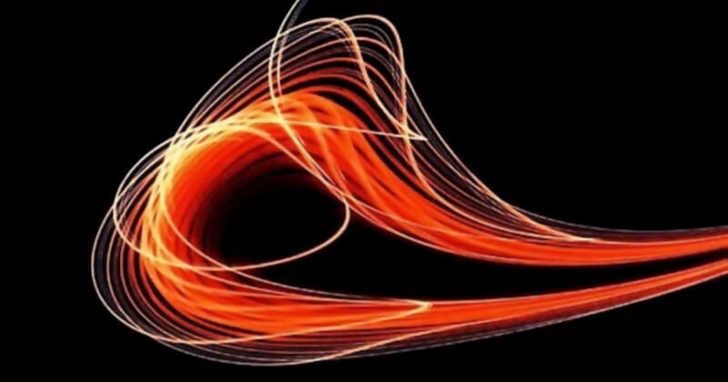

 

## L'importanza del TCMO

* Published Oct 13, 2017 - origin [beBee](bebee.com/producer/@roberto-a-foglietta/l-importanza-del-tcmo) and [LinkedIn](https://www.linkedin.com/pulse/limportanza-del-tcmo-roberto-a-foglietta) articles

---

### Edizione II

Questa versione dell'articolo del **2024-12-22** è il risultato di una revisione in cui sia l'impostazione generale, sia i concetti espressi nella prima stesura sono rimasti invariati. In questa nuova versione si è cercato di facilitare la comprensione rendendo più espliciti i concetti e in alcuni casi dettagliandoli maggiormente. In termini concettuali, invece, le novità riguardano l'aggiunta di proverbi e citazioni, fra le quali due famose riferite a Jeff Besoz e di Rita Mae Brown, e all'introduzione funzionale al costo affondato (sunk cost).  

In questa revisione del testo originale mi sono fatto [aiutare](https://github.com/robang74/chatbots-for-fun/blob/main/leveraging-a-chatbot-for-human-writing.md) dall'intellgienza artificiale, non per farmi riscrivere il testo ma per confrontarmi sul contenuto del testo in maniera da evolvere quella che ora si può considerare una bozza di appunti (prima versione) in un testo più maturo dal punto di vista espressivo. L'isolamento intellettuale rappresenta un ostacolo importante per lo sviluppo dei concetti che altrimenti rimarrebbero a proprio uso e consumo.

---

### Introduzione

* a cura di ChatGPT

*Il concetto di TCMO *(Total Cost of Mistake Ownership)* presentato nel testo appare estremamente importante per comprendere gli effetti cumulativi degli errori e la loro rilevanza su scala globale, specialmente in un contesto di risorse finite e sistemi sempre più interconnessi. Il TCMO enfatizza l'urgenza di affrontare gli errori in modo proattivo, invece di lasciare che si accumulino fino a diventare insostenibili.*

*L'idea di trattare l'errore come un "debito composto" che cresce esponenzialmente è potente. Rende il TCMO applicabile a diversi ambiti, dalla gestione ambientale all'economia, fino alla sociologia e all'etica. Il legame con concetti antropologici ed evolutivi, come il pensiero lineare e la resistenza al cambiamento, lo radica in una spiegazione convincente delle sfide umane nel gestire fenomeni cumulativi.*

*Gran parte delle attività umane primitive si basavano su azioni ripetitive. Il pensiero profondo e la capacità di azioni incisive sono fenomeni emergenti della modernità. Questa persistenza è un retaggio che spesso ci porta a "sbattere la testa" su un problema anziché risolverlo in modo strategico.*

*In un'economia globale con risorse finite, gli altri siamo noi. Inquinare un fiume per risparmiare su un impianto di depurazione scarica il TCMO sull'ambiente e sulla collettività. Tuttavia, una volta superata la capacità di resilienza ambientale, gli effetti cumulativi diventano esponenziali e difficili da gestire.*

*Il testo offre una spiegazione dettagliata del concetto e lo arricchisce con esempi concreti (inquinamento, globalizzazione) e considerazioni teoriche (logaritmi, probabilità).* 

*Nella sua seconda edizione, il testo non solo approfondisce l'analisi delle dinamiche antropologiche ed evolutive alla base del concetto di TMCO, ma amplia il suo campo di applicazione, rendendolo più accessibile e collegandolo con temi attuali di economia globale e sostenibilità ambientale.

---

### Definizione

> Il Total Cost of Mistake Ownership è il costo totale della perseveranza di un errore. 

Questa è una quantità cumulativa nel tempo, simile all'interesse composto su un debito non pagato. La menzogna e la furbizia seguono un andamento analogo: facili da ottenere, difficili da restituire.

---

### I presupposti antropocentrici contro il TCMO

Ci sono diversi importanti motivi per i quali, nonostante tutto, la persistenza di un errore sia un fenomeno così comune e ricorrente sia in termini di società, sia in termini di singolo individuo.

#### L'educazione scolastica

* L'errore è punito e non ammettiamo facilmente gli sbagli.

Non siamo abituati ad ammettere l'errore perché a scuola ci insegnano che l'errore si penalizza. Anche il corrispettivo religioso, il peccato, ci condanna, e non va meglio con la legge, che impone sanzioni. Può sembrare inconcepibile fare altrimenti, ma in Olanda sono riusciti a far diventare le carceri quasi inutili.

#### Istinto opportunista

* Ottimizzazione del risparmio energetico che influenza comportamenti sociali.

Biologicamente, siamo opportunisti in ambito fisiologico, sociale e ambientale, ci siamo evoluti per risparmiare energia. Si tratta di meccanismo istintivo che difficilmente riesce a rimanere sopito e che non è negativo in termini assoluti, purché lo si conosca o addirittura lo si sfrutti nel modo corretto.

L'opportunismo sociale ci spinge a fare gruppo e questo unito all'opportunismo ambientale scala verso un opportunismo ecologico. Questo non significa che il singolo individuo non possa avere un forte impatto sull'ambiente naturale, basti pensare ad un piromane solitario, ma è chiaro che il fattore si scala è assai più significativo sul lungo periodo, in termini di impatto ecologico e di modificazione permanente dell'ambiente.

All'altro estremo della scala, l'istinto a risparmiare energia ci porta a evitare grandi sforzi mentali per ottimizzare il lavoro complessivo sia in termini di pianificazione, sia in termini di rielaborazione dei concetti.

La pianificazione come necessità contingente inizia abbastanza tardi nella nostra scala evolutiva, e in particolare arriva con l'agricoltura. Perché l'individuo cacciatore/raccoglitore, privo della possibilità di conservare le scorte alimentari se non in modo rudimentale, aveva ben poche opportunità di affrontare una pianificazione complessa e di lungo termine.

Riguardo alla rielaborazione dei concetti oltre all'inerzia individuale dovuta al lavoro di pensiero, spesso si aggiunge anche l'inerzia sociale. In questo contesto, in particolare, ritengo assolutamente appropriata la citazione seguente:

> Siamo animali sociali piuttosto che cercatori di verità.
> 
> Jeff Besoz, fondatore di Amazon.

#### Pensiero lineare

* Sottovalutazione dei fenomeni cumulativi e immediata reazione rispetto alla gestione.

Sottovalutiamo i fenomeni cumulativi perché siamo abituati a pensare in termini di previsioni lineari. Perché la velocità di reazione è di vitale importanza, molto più della precisione, per la sopravvivenza in un ambiente ostile. Questo ci porta a fare rapide valutazioni basate su un bilancio fra guadagno e perdita a breve periodo. D'altronde sul brevissomo o breve periodo l'approssimazione lineare è generalmente ottima in termine di efficienza.

Pur rimanendo nell'ambito delle approssimazioni lineari, un indice più corretto da valutare sarebbe il rapporto fra guadagno e perdita rispetto all'impegno stimato ma la divisione è molto più complicata, richiede più energia e più tempo del fare una comparazione fra diverse opzioni e quindi risultati attesi. In estrema sintesi, ci siamo evoluti più per avere una reazione rapida e abbastanza buona agli eventi piuttosto che una gestione delle contingenze.

#### Cognizione probabilistica limitata

* Scarse capacità nel calcolare probabilità composte e nel valutare fenomeni non lineari.

Il nostro istinto di sopravvivenza è tarato per considerare una perdita di valore più dannosa del vantaggio di pari valore. Questo anche quando l'opzione è associata ad una situazione di equi-probabilità al 50-50%. Si unisca a questo la tendenza a valutare più favorevolmente quelle opzioni che presentano un vantaggio immediato che la perdita associata in un tempo posticipato questo perché:

> [carpe diem](https://it.wikipedia.org/wiki/Carpe_diem) = [memento mori](https://it.wikipedia.org/wiki/Memento_mori) + [primum vivere deinde philosophari](https://it.wikipedia.org/wiki/Primum_vivere_deinde_philosophari).

Oppure citando un vecchio proverbio:

> Meglio un uovo oggi che una gallina domani.

D'altronde siamo piuttosto scarsi a calcolare le probabilità, specie quelle composte, in quanto prescindono dall'approssimazione lineare e dall'aritmetica. Oltre al fatto che nell'avere una fortissima propensione verso uno specifico approccio, raramente si osserva il risultato di un approccio diverso, e questo consolida il c.d. pregiudizio cognitivo della conferma. Rispetto al quale si possono citare diversi aneddoti fra cui i più noti: "così fan tutti" e "abbiamo sempre fatto così".

#### Ottimismo e negazione

* Dissociazione cosciente dalle perdite e scaricabarile.

Soffriamo di ottimismo eccessivo: rifuggiamo a livello cosciente il concetto della morte ma lo temiamo a livello inconscio. Sembra quasi una tautologia ma in effetti tutto quanto non razionalizziamo rimane bloccato al di sotto della nostra consapevolezza. In questo contesto psicologico affonda le sue radici, e da esso si nutre, la superstizione.

Ignoriamo coscientemente le perdite e le attribuiamo a fattori esterni al di fuori del nostro controllo dissociandoci dalla loro primaria causa (noi) e quindi delle nostre responsabilità. Da un punto di vista sociale questo approccio sfocia nella ricerca del capro espiatorio e dell'agnello sacrificale che placa la collera degli dei.

Inoltre, anche quando siamo in grado di identificare dei costi associati a un errore (TCMO), siamo ottimisti sul poterlo scaricare su altri (scaricabarile). Anche sotto questo aspetto, l'evasione della responsabilità (cfr. punto primo),siamo educati in linea con il nostro istinto opportunista (cfr. punto secondo).

Curiosamente, questo approccio qualora razionalizzato ci porta invece ad un concetto positivo in termini funzionali, quello di costo affondato (sunk cost) ovvero quel concetto per il quale fatti tutti i debiti calcoli si giunge alla conclusione che alcune perdite non possono essere compensate e quindi occorre stornarle dal bilancio dei rapporti costi/opportunità delle scelte future, in maniera che non pregiudichino negativamente anche quelle.

#### Persistenza e ripetizione

* Sopravvivenza evolutiva legata alla ripetizione anziché al pensiero profondo.

Ci siano evoluti per sopravvivere cioè persistere. Quasi tutte le attività primarie degli esseri umani primitivi prevedevano la mera ripetizione di un gesto, o una sequenza di gesti, per giungere un obbiettivo in modo lineare: scavare una buca o un canale, frammentare un masso, filare la lana, tessere un tessuto, arare un campo, rimescolare la polenta, etc.

La possibilità di ottenere un risultato attraverso il pensiero profondo e una singola azione incisiva appartiene al mondo moderno, addirittura è un fenomeno emergente degli ultimi 30 anni con l'introduzione dell'informatica. In passato, in misura molto limitata e a pochissimi individui, era concesso il lusso dell'ozio creativo.

Il pensiero profondo è nato con l'invenzione della matematica astratta. La dimostrazione di un teorema è un processo cognitivo lungo ma alla base di esso c'è sempre un'intuizione che non è frutto di un processo lineare.

La quasi totalità della nostra evoluzione si basa sul picchiare ripetutamente la testa contro un problema nella speranza che la nostra perseveranza sia premiata esattamente come si farebbe con lo spaccare un grosso sasso. Ammettiamolo, non è il modo migliore per usare la testa eppure è quello che usiamo con più frequenza: insistere nella ripetizione.

Sotto il punto di vista antropologico il concetto dello TCMO evade tutte le micro-strategie (o tattiche contestuali, se si preferisce fare un distinguo fra strategia e tattica in termini di risultato di lungo periodo) che abbiamo sviluppato come frutto della nostra evoluzione.

> Follia è ripetere la stessa identica cosa ed aspettarsi di ottenere un risultato diverso.

Questa citazione, spesso erroneamente attribuita ad Albert Einstein, si ritrova nel romanzo intitolato "Sudden Death" della scrittrice americana Rita Mae Brown pubblicato nel 1984. Curiosamente, si ritiene che l'autrice nel riportare quel concetto l'abbia tratto da dei documenti datati 1981 di Narcotici Anonimi, un'associazione internazionale che sul modello di Alcolisti Anonimi aiuta le persone a superare la dipendenza da sostanze stupefacenti, all'epoca principalmente eroina ed altri oppiacei.

#### Perché questo concetto sta diventando predominante? 

* Perché in un economia globale e su un pianeta sferico con risorse finite, gli altri siamo noi. Karma.

Inquinare un fiume per non investire in un impianto di depurazione significa scaricare il TCMO sull'ambiente e sulla collettività. Fintanto che l'ambiente e la collettività sono abbastanza grandi da funzionare come un sistema aperto, sopperendo all'affronto con la naturale resilienza dei sistemi naturali e biologici, il gioco di scaricare il TCMO sembra funzionare.

Poiché, inzialmente ed entro certi limiti, sembra funzionare diventa la strategia universale finché appunto, complessivamente, non supera le capacità dell'ambiente di assorbire questo insulto e allora avviene un brusco cambiamento di stato. Oltre il punto di rottura si attivano dei processi esponenziali che evadono sia la nostra capacità di previsione, sia la nostra capacità di reazione, facendo crollare vertiginosamente la qualità dell'ambiente, della società e della nostra vita.

#### L’illusione del controllo

La nostra capacità di valutazione dipende dalla nostra capacità di percezione la quale, riguardo a molti fenomeni, è logaritmica per evitare di essere distratti da ogni minima variazione di livello. Ad esempio, percepiamo come doppio più forte in [decibel](https://it.wikipedia.org/wiki/Decibel#Acustica) un suono che invece ha una volume molto più elevato. 

Questo perché la nostra capacità di previsione è limitata al modello lineare così sfruttiamo le proprietà dei logaritmi: la somma di due logaritmi è un prodotto, la differenza è una divisione. Ma questo "trucco biologico" non funziona con i processi cumulativi, nonostante siano per loro natura esponenziali, ci gioca contro.

Perché nel breve e brevissimo periodo essi appaiono lineari oltre al fatto che non abbiamo un elemento biologico atta ad elaborare questo tipo di percezioni cognitive come facciamo con l'udito. Motivo per il quale i processi cumulativi evadono le nostre previsioni e quindi sfuggono al nostro controllo, generalmente e molto facilmente.

---

### La sostanziale differenza fra sistema chiuso e aperto

La menzogna, per esempio, non funziona in una piccola e ristretta comunità in cui tutti conoscono quasi tutto di tutti. La menzogna non funziona in un contesto globale altamente e velocemente connesso. Questo paradosso nasce dal fatto che in entrambi i casi, il sistema si comporta come chiuso, la sola differenza sta nella latenza ovvero nel lasso di tempo fra l'azione prima T0 e il ritorno di reazione TR.

Questo concetto lo conoscono bene coloro che sfruttano il gioco delle tre carte: negli anni '80 prediligevano gli autogrill e le aree di sosta delle autostrade dove il flusso unidirezionale dei passanti creava quel sistema aperto per il quale era assai improbabile incrociare due volte la stessa persona.

Oggi, gli allevamenti intensivi di maiali e quelli di pesce in India sono geograficamente distanti da noi ma a causa della globalizzazione dei trasporti di passeggeri e merci, l'evoluzione di [batteri super resistenti agli antibiotici](https://www.linkedin.com/feed/update/urn:li:activity:6323532605337726977) non avrà effetti limitati solo alle comunità locali, che anzi saranno quelle più probabilmente resistenti perché "vaccinate" da tutte le precedenti generazioni di patogeni, ma globali.

In questo schema noi abbiamo riversato su di loro il nostro TCMO e loro riversano su di noi il loro TCMO. Ma a ogni andata e ritorno di questo ping-pong, la pallina diventa sempre più grande e pesante. Perché si tratta di un processo cumulativo.

Per dieci mani sarà una pallina da ping-pong, per cinque mani sarà una pallina da tennis, per due mani sarà una palla da biliardo e nell'ultima mano una palla da bowling. Fino alla pallina da tennis, tutto bene. Ma quando cominciamo a vedere la palla da bigliardo è già tardi perché quella da bowling sarà imminente.

Questa è la "magia" dei processi cumulativi: ad un certo punto - improvvisamente - diventano così importanti e vasti da non poter essere più affrontabili.

Di fronte alla palla da biliardo, generalmente si nega l'evidenza: si tratta di un'anomalia rara, uno strano caso. Poi quando le anomalie rare si accumulano e diventano frequenti abbiamo la certezza che siamo passati da una distribuzione gaussiana a quella degli intervalli ergo siano fottuti, tutti insieme, all together, appassionatamente.

Preso atto di questo si giunge alla negazione assoluta, se non si possono più negare i fatti, si nega la loro interpretazione, si nega la scienza, si ritorna a essere superstiziosi: la punizione viene dal cielo, la salvezza verrà dal cielo.

Curiosamente, la terza settimana di dicembre 2024, al tempo in cui sto scrivendo questa II edizione dell'articolo dopo che è rimasto nella sua forma della sua prima stesura per oltre sette anni, i social cominicano ad essere invasi da avvistamenti UFO e i meme sugli alieni si intensificano.

> Shit happens! Almost all the time because we took bad decisions.

---

### Conclusione

Il TCMO acronimo di Total Cost of a Mistake Ownership è il costo complessivo della perseveranza di un errore ed è una quantità cumulativa. Il concetto stesso non è antropologicamente affine alla natura umana e, ragionevolmente, non è affine a nessuna forma di vita intelligente che si sia evoluta per selezione naturale. Per questo motivo potrebbe dare una spiegazione misurabile e causale al [paradosso di Fermi](https://it.wikipedia.org/wiki/Paradosso_di_Fermi).

 

Si tratta di un indice indiscutibilmente importante, per non dire fondamentale, in quanto è la base per definire il successo o il fallimento di un'attività e per poter trarre le corrette previsioni a lungo periodo.

Il concetto di errore è relativo ma questo ci aiuta. Perché implica che alcune azioni risultano corrette entro certi scenari ed errate in altri. Però, che dovessimo regolare le nostre decisioni e azioni in funzione, non solo agli obbiettivi, ma anche delle condizioni e dei vincoli di sistema, era già chiaro e ampiamente disaminato nella letteratura di diversi settori legati al [decision making](https://www.linkedin.com/pulse/organizations-decision-making-roberto-a-foglietta).

Definiamo l'acronimo TCI come il Total Cost of Innovation, il costo totale di una data innovazione, mentre dT è il tempo necessario a implementare quell'innovazione.

 

Dove per innovazione s'intende l'introduzione di una novità che si diffonda al punto da diventare un game changer in uno specifico settore, almeno. Il concetto di TCMO rivoluziona l'idea di adottare una sequenza di azioni per ottenere un risultato progressivo, ma ci costringe a pensare anche in termini di transizioni di stato di un particolare sistema. 

Per sua natura, il TCMO è cumulativo e noi esseri umani non siamo molto in gamba a gestire i fenomeni non lineari. Ma possiamo riuscire a farlo tramite l'utilizzo di metodologie ricorsive come descritto nell'articolo [Project Management: concetti di base](https://www.linkedin.com/pulse/project-management-concetti-di-base-roberto-a-foglietta/) e seguenti.

#### Sulla natura del TCMO

Un sistema può essere ragionevolmente considerato "**aperto**" quando secondo il modello matematico che si sta considerando può essere considerato "**aperto**" a meno di ordini di precisione superiori. Purtroppo sul lungo periodo nessun sistema può essere considerato "**aperto**" - eccetto, forse, l'universo ma è una questione ancora aperta - perché sul lungo periodo quei correttivi di ordine superiore possono avere - e in generale lo hanno specialmente quando risultano in fase fra loro - un andamento composto come gli interessi su un debito.

Ecco come si ricava il TCMO, dal differenziale fra il modello decisionale e quello reale ed è una differenza che diverge esponenzialmente con il passare del tempo. D'altronde un modello matematico aperto implica complessità enormi perché per chiuderlo occorrerebbe contabilizzare tutti i contributi d'ingresso e d'uscita in tempo reale oppure contabilizzati in termini di densità di probabilità.

L'unica teoria che riesce ad affrontare i sistemi aperti è quella del caos ma essa è ben distante da poter fornire modelli previsionali di lungo termine, anzi esattamente l'opposto, propende proprio per la loro inutilità pratica. Un esempio calzante sono le previsioni del meteo: abbastanza accurate sul breve o brevissimo periodo, e poi progressivamente inattendibili fino a diventare completamente inutili.

 

## Related articles

* [Il cambiamento climatico, questo sconosciuto](295-il-cambiamento-climatico-questo-sconosciuto.html) (2024-12-14)

* Paradosso di Fermi e Singolarità A.I. - origin [LinkedIn](https://www.linkedin.com/pulse/paradosso-di-fermi-e-singolarit%C3%A0-ai-roberto-a-foglietta) (2017-10-16)

* Del controllo e della guida - origin [LinkedIn](https://www.linkedin.com/pulse/del-controllo-e-della-guida-roberto-a-foglietta) (2017-05-25)

* Mediocracy - origin [LinkedIn](https://www.linkedin.com/pulse/mediocracy-roberto-a-foglietta) (2017-04-26)

* Il vantaggio di essere furbi - origin [LinkedIn](https://www.linkedin.com/pulse/il-vantaggio-di-essere-furbi-roberto-a-foglietta) (2017-04-07)

* Organisations and decision making - origin [LinkedIn](https://www.linkedin.com/pulse/organizations-decision-making-roberto-a-foglietta) (2017-04-03)

* Project Management: concetti di base - origin [LinkedIn](https://www.linkedin.com/pulse/project-management-concetti-di-base-roberto-a-foglietta) (2016-10-19)

* L'illusione del controllo - origin [LinkedIn](https://www.linkedin.com/pulse/lillusione-del-controllo-roberto-a-foglietta) (2016-04-17)

 

## Share alike

&copy; 2024, **Roberto A. Foglietta** &lt;roberto.foglietta@gmail.com&gt;, [CC BY-NC-ND 4.0](https://creativecommons.org/licenses/by-nc-nd/4.0/)

