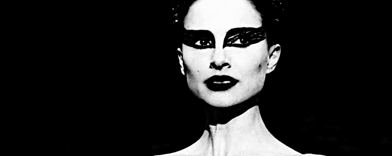

 

## The Black Swan is not as rare as we might think...

* Published Nov 11, 2017 - origin [LinkedIn](https://www.linkedin.com/pulse/black-swan-rare-we-might-think-roberto-a-foglietta)

> The Black Swan: The Impact of the Highly Improbable is a 2007 book by Nassim Nicholas Taleb, who is a former options trader. The book focuses on the extreme impact of rare and unpredictable outlier events, and the human tendency to find simplistic explanations for these events, retrospectively. Taleb calls this the Black Swan theory. <nobr>&mdash; [Wikipedia](https://en.wikipedia.org/wiki/The_Black_Swan:_The_Impact_of_the_Highly_Improbable)</nobr>

---

### Once upon a time

The word "**monster**" cames from latin **`monstrum`**:

* in italiano **`mostro`**, segno divino, prodigio, dal tema di **`monēre`**, avvisare, ammonire

An etymological root which means exceptional and/or advisor from above.

The negative declination comes later when it is related with misfortune signs and with negative exceptions. However, in the original form it did not have a specific negative declination like the word exceptional.

---

### The Black Swan, is the new monster

The same happens for the term "black swan", is a rare event and overlooked one for which the common declination is related to a great disaster. Also in this case our fear of loss wins in giving the term the negative connotation rather than a neutral one.

---

### Where the problem lies

Every solution is lying in the essence of what we call a problem. Once we understood the inner essence of the problem, the solution came straight from it.

Accepting the solution could be an issue because it would conflict with our interests (usually our fear of an immediate loss toward an uncertain long run advantage) or our belief (admitting that we were wrong or we did not understand a key point).

---

### To change, is the hard part

Sometimes, it requires much more effort to accept and adopt a solution rather than finding it. Such effort is not related to the solution itself but the resistance against the change it brings.

 

## Share alike

&copy; 2025, **Roberto A. Foglietta** &lt;roberto.foglietta@gmail.com&gt;, [CC BY-NC-ND 4.0](https://creativecommons.org/licenses/by-nc-nd/4.0/)

