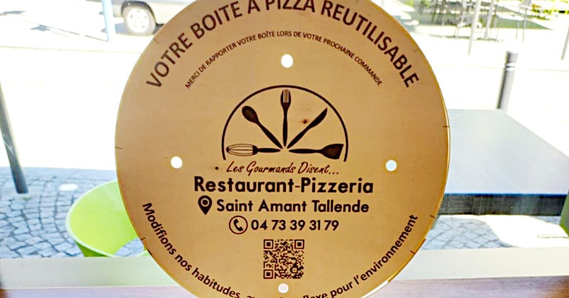
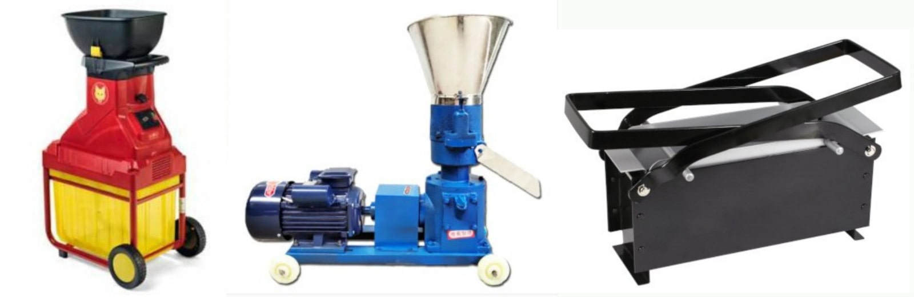
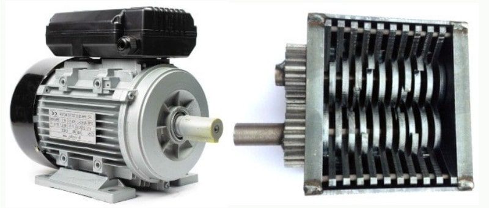

 

## Riciclo di rifuti pregiati

Published Jan 23, 2024 - origin [LinkedIn](https://www.linkedin.com/pulse/riciclo-di-rifiuti-pregiati-roberto-a-foglietta-b9pyf)

---

### Premessa

Stavo leggendo questo post, interessante:

* la scatola per pizza riutilizzabile di sébastien poulin

di cui mi piace condividere un paio di passaggi al fne di riassumerne il concetto:

> Un pizzaiolo (francese, NdR) ha progettato una scatola per pizza riutilizzabile Queste scatole sono già realizzate in cartone riciclabile, ma lui ha voluto fare un passo in più ricordandoci che il miglior rifuto è quello che non esiste `[...]` Come ogni progetto d'avanguardia, costa molto e,poiché l'ecologia è afare di tutti, ho deciso di vendere queste scatole a 5 euro (contributo alle spese). Quando compri una scatola, ti diamo un timbro sulla tua carta fedeltà. Poi, quando vieni a ritirare le pizze, ci riporti le scatole e noi ci mettiamo dentro le tue pizze, così limitiamo il consumo di cartone e i nostri rifuti.

Che io ho condiviso con le mie osservazioni:

* carta fedeltà sei tu? si, sei tu!

e anche di questo posto ne farò una breve sintesi:

> La carta anti-unto sotto la pizza e probabilmente anche sopra continua ad essere un rifuto e la scatola così progettata a €5 è solo una tessera fedeltà clienti mascherata. `[...]` Conclusione? Anche questo è green washing ma fatto bene.

Da questo punto in poi parte l'idea di una rete a KM0 ma scalabile di raccolta dei rifuti pregiati e loro riconversione in prodotti o di materie prime semilavorate per l'industria.Però prima di parlare di massimi sistemi facciamo un passo indietro e torniamo ad occuparci di come riciclare il cartone della piazza e fare in modo che il cliente torni a comprare in pizzeria.

---

### Ecologia e fedeltà

Un altro modo di fare la stessa cosa è ofrire €0.50 di sconto su una pizza al cliente che riporta il cartone in pizzeria e poi tritare il cartone anche sporco ma senza gli avanzi e pressare il tritato per farci tronchetti da fuoco per il forno a legna.

Il tritatore e pressatore possono essere uniti in una singola macchina e installati presso la pizzeria. Nelle pizzerie dove si consuma in loco, senza servizio, la pizza si prende al banco e le bibite dal frigo, usare il cartone evita di lavare i piatti e riciclandoli in questo modo probabilmente è pure più ecologico che usare la lavastoviglie (elettricità, sapone, acqua,anticalcare, etc.)

---

### Fare i tronchetti pressati

Lista dei componenti essenziali riportati con prezzi al consumatore fnale inclusi di IVA e foto esemplifcative:

 

- `€320` - bio trituratore agricolo da 60L con motore 3HP

- `€400` - pellettatrice elettrica 4KW

- `&nbsp;€30` - pressa per brichettatrice per tronchetti manuale

- **`€750`** - **Totale**

---

### Una macchina dedicata

Lista dei componenti essenziali riportati con prezzi al consumatore fnale inclusi di IVA e foto esemplifcative per costruire una macchina dedicata:

 

- `€300` - frantoio tritatutto per rifiuti senza motore

- `€120` - motore elettrico da 2HP per il frantoio

- `&nbsp;€70` - martinetto idraulico 20 Ton senza compressore

- `&nbsp;€50` - compressore a pistoni 60L/min 32W

- `&nbsp;€30` - pressa per brichettatrice per tronchetti (come sopra)

- **`€570`** - **Totale**

Utilizzando il motore elettrico per il compressore (solo meccanismo) e costruendo lo stampo della pressa in DIY si risparmiano 50 euro circa.

---

## Rete per l'economia circolare

Diciamo che il ritorno dei clienti e la loro maggiore frequenza di acquisto giustifchi questo investimento ed extra lavoro. Anche in questo caso perché non scalare verso un modello che serva a più pizzerie distribuendo gli investimenti, i costi e gli ammortamenti? Perchénon allargare l'oferta a tutti i potenziali clienti e concentrarsi sull'attività di recupero del cartone e del legno?

In fondo i due grandi vantaggi di costruire un macchinario specializzato sono:

- automazione e quindi velocizzazione del processo

- possibilità di tritare qualsiasi rifuto incluso legno e plastica

A questo punto diventa naturale chiedersi come organizzare la raccolta diferenziata e la trasformazione di certi scarti in modo scalabile attraverso una piccola rete di operatori locali che condividono tecnologia, brand, commercialista, sale & marketing, forniture, etc.

Il modello detto FRANCHISING è ormai maturo ed ampiamente utilizzato quindi vale la pena adottarlo. Quindi nella prosecuzione si presenta un modello sostenibile a KM0 di gestione della raccolta diferenziata di rifuti a base di materie prime pregiate e loro conversione in prodotti da vendere o semilavorati per l'industria.

Un'attività a relativamente bassa tecnologia che potrebbe ridurre notevolmente i costi di gestione della nettezza urbana, razionalizzando i processi - ovvero gestire la complessitàcon una rete di piccoli operatori locali (quartieri) organizzati su aree geografche estese (regioni) per attivare l'economia di scala.

---

### Riciclo di carta, cartone e legno

Fondo di 25 mq incluso bagno, 2 contatori da 3KW: uno per l'impianto e l'altro per il macchinario.

Scafalature e scrivania, riscaldamento con stufa a pellet ventilata nei climi freddi, pompa di calore nei c. temperati e condizionatore nei c. caldi. Thinkpad riciclato da €250 e connettività 4G.

Dalle 17 alle 19 si fa la raccolta di imballi di cartone, cassette di legno e altri scarti similari.Dalle 9.30 alle 11.30 si consegna il prodotto ai clienti. Dalle 15 alle 17 si fa contabilità,marketing e sales. Su sei giorni la settimana fanno 36 ore, una persona.

All'avviamento, ci si limita al quartiere usando un carrello della spesa con ruote maggiorate e dalle 13 alle 15 si produce pellet, tronchetti e si imballano nei sacchi a rete chiudendoli ed etichettandoli con la cucitrice a mano (48 ore alla settimana).

Quando il giro d'afari è cresciuto si passa a 45 mq carrabili con Apecar a 4 ruote e un piccolo muletto manuale idrodinamico per carico e scarico agevole. A quel punto si aggiunge una persona e si va a fare raccolta anche presso supermercati, centri commerciali o in altri quartieri dove i commercianti hanno raccolto quel tipo di rifuti per la presa in carico.

Rischi: contaminazione da plastica o vernici; polveri; tetano.

---

### Riciclo della plastica

In modo analogo si può organizzare la raccolta e la trasformazione in materia prima semilavorato con i materiali plastici tipo cassette della frutta e bottiglie di detersivi.

Per certi tipi di materiale, tipo le cassette della frutta in plastica, la raccolta avviene nei punti vendita come per il cartone e il legno da imballo. Per altri tipi, come le bottiglie di plastica, si può fare su base condominiale.

Con una fliera di lavorazione completamente separa - in altro luogo - da quella di cartone e legno, la plastica viene sminuzzata e poi trasformata in pellet, oppure piastrelle o mattoni compressi.

I pellet, vengono venduti in grandi sacchi di peso defnito 25, 50, 100 Kg come materia prima semilavorata per altre produzioni.

Piastrelle e mattoni vengono concentrati e poi consegnati Agli impianti industriali per ulteriore lavorazione. Ad es. possono essere scaldati in forni così da farne materiale per pavimentazione coibentante e/o consolidante di superfci commerciali su cui poi fare la posa di altri materiali quali il linoleum o indurenti superfciali da stesura.

Rischi: sacchi pensanti; crollo scafalature; polveri; emissioni di solventi.

 

## Conclusione

Il mondo è nel caos perché ... e in questi trattini ognuno ci mette quello che gli pare che ci calzi oppure no. Siamo alla ricerca di un colpevole, qualcuno della radice del problema e magari scopriamo invece che abbiamo dimenticato una lezione fondamentale alla base di ogni civiltà: come gestire la complessità.

La complessità NON si gestisce complicando le cose ma semplifcandole. Facile da dirsi ma poi per efcientare i processi si tende all'economia di scala dove industrializzazione e grandi numeri la fanno da padrone. Purtroppo ci siamo accorti che l'economia di scala porta inquinamento, non solo ambientale ma anche sociale e psicologico. In una parola ALIENAZIONE.

Alienazione dalle persone perché tutti svolgiamo un ruolo e siamo solo mediatori non piùdirettori, alienazione dai processi perché sappiamo cosa dobbiamo fare ma non sappiamo più perché lo facciamo, alienazione dalla realtà perché perdiamo la percezione dei dettagli

prediligendo il processo, alienazione psicologica perché fare tutto questo è privo di senso per un essere umano e se non dovesse provvedere al suo sostentamento non lo farebbe certamente.

Come fare a riportare l'uomo al centro e salvare il mondo? Non lo so, in generale. Ma nel caso della raccolta diferenziata e riciclo di rifuti pregiati, so come si può fare. Non solo -penso di saperlo - lo so, proprio.

Lo so perché a Genova lo fanno già gli immigrati sudamericani con gli elettrodomestici.Quindi non ho inventato niente, ho solo osservato e messo insieme l'iniziativa imprenditoriale dell'homo faber venuto da lontano con la mia preparazione.

Risultato? Si può innovare la raccolta diferenziata. A Genova è comparso un articolo in cui il sindaco si vantava di aver raggiunto l'81% della raccolta diferenziata. Falso! L'81% della raccolta avviene tramite cassonetti diferenziati, ma nei cassonetti c'è di tutto dentro e infatti spesso passa un camion solo e carica tutto. Ecco l'alienazione!

Penso sia venuto il tempo di riportare le decisioni nelle mani di coloro che fanno e si puòfare senza rinunciare ai fattori di scala.

---

### L'uomo liberato dal lavoro diventa inutile?

In questo video degli americani si chiedono cosa ne faremo di così tanti esseri umani quando essi saranno resi inutili dall'intelligenza artificiale e poi dai robot umanoidi.

- [Emine Fougner’s Post, about a WEF/DAVOS speech](https://www.linkedin.com/posts/emine-fougner-1416329_yuvalnoahharari-uselesshumans-activity-7156292353970819072--IlB)

Al momento la loro migliore proposta è di tenerli felici usando droga e videogames. **GULP!**

Non tanto perché la proposta sia oscena di per se stessa, in effetti è già così in parte e in alcuni paesi come gli USA in larga parte se nei video games ci inseriamo anche OnlyFans e i social network.

Invece il GULP mi assale quando leggo che è la MIGLIORE proposta che hanno saputo tirare fuori. In questo articolo, che non ha la pretesa di essere un pilastro di saggezza, c'è una risposta a questa domanda: cosa ne faremo di tutti questi esseri umani inutili?

Gli assegneremo dei compiti - ovvero dei ruoli - che hanno un ruolo sociale. Dei compiti per i quali l'essere umano è preferibile al robot. Infatti è molto più umano che nel quartiere giri a raccogliere i cartoni un essere umano che saluta le persone e le persone salutano lui perché riconoscono in lui un ruolo sociale.

 

## Share alike

&copy; 2025, **Roberto A. Foglietta** &lt;roberto.foglietta@gmail.com&gt;, [CC BY-NC-ND 4.0](https://creativecommons.org/licenses/by-nc-nd/4.0/)

