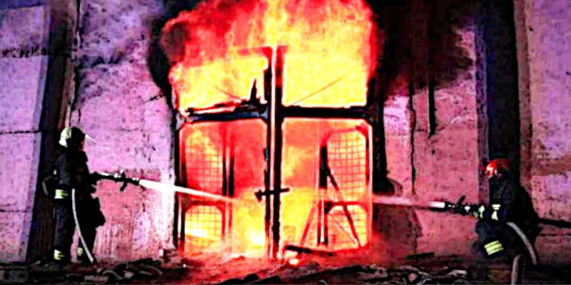

## LA GUERRA DEL DOLLARO CONTRO L'EURO

* Published May 18, 2024 - source [LinkedIn](https://www.linkedin.com/pulse/la-guerra-del-dollaro-contro-leuro-roberto-a-foglietta-fx6qf)

 

Questo articolo è stato scritto a partire da questo [post su LinedIn](https://www.linkedin.com/posts/robertofoglietta_la-guerra-del-dollaro-contro-leuro-anche-activity-7197428434082394112-HqBM?trk=article-ssr-frontend-pulse_little-text-block), pubblicato il 18
maggio 2024.

### Premessa

Il 5 di maggio 2024, Rai - Radiotelevisione Italiana online news pubblica questa notizia ripresa dal The Wall Street Journal di cui qui sotto uno screenshot:

 

Per coloro che leggeranno questo articolo tradotto in automatico, aggiungo anche il testo, nella sua parte essenziale, della notizia:

*Gli obbligazionisti stranieri vogliono che l'Ucraina riprenda il pagamento del debito dopo che il processo è stato sospeso nel 2022 a causa dell'inizio di un'invasione su vasta scala. Lo riferisce il Wall Street Journal con riferimento alle fonti. Gli interlocutori della pubblicazione affermano che un gruppo di obbligazionisti stranieri, tra cui BlackRock e Pimco, intendono fare pressione sull'Ucraina affinché ricominci a pagare gli interessi sul suo debito l'anno prossimo. Il gruppo, che detiene circa un quinto dei 20 miliardi di dollari in eurobond in circolazione dell'Ucraina, ha recentemente formato un comitato e ha assunto avvocati e banchieri per negoziare.*

---

### Cosa ne penso?

Che sono teneri di cuore e anche molto ottimisti. Ottimisti riguardo, non solo agli interessi che saranno pagati, ma al capitale stesso.

Ma poiché - servi loro sempre, ci inchiniamo al denaro - i russi lasceranno che Leopoli, a differenza del resto dell'Ucraina, finisca sotto il controllo delle truppe ONU guidate dalla Polonia e se la visita pagata da Macron, dopo la notizia che (forse) duemila soldati speciali sono stati inviati ad Odessa, all'incoronazione dello Zar è stata correttamente adoperata, allora Odessa e il controllo delle spedizioni di grano ucraino verso l'Africa sarà garantita sotto il controllo dei francesi.

Così Leopoli e Odessa, rimarranno a pagare gli interessi. Il capitale sarà tenuto "in gestione", invece, a tempo indeterminato ovvero fino al negoziato di pace che sancirà il nuovo status-quo, as usual.

---

### Zar significa Cesare

Qui sopra scritto "in gestione" e "as usual" sono da leggersi con tono sarcastico come se non sapessimo che le cose funzioni così o pensassimo che ad est siano usciti da un uovo di Pasqua ieri.

Evidentemente si sono dimenticati che Zar etimologicamente viene dalla parola latina Caesar che sopo la morte di Giulio Cesare (44 a.C) assurge a termine onorifico e generico per indicare l'imperatore romano. In particolare dall'ultima sillaba pronunciata con la S dura che suona come una Z.

Accidentalmente "ovest" in russo si scrive "запад" ma si pronuncia "zapad" quindi i mezzi e le truppe da inviare a ovest vengono contrassegnati con la lettera Z. Ma per coloro che non prestano attenzione alle parole, tutto questo può sembrare un esercizio di puramente intellettuale.

Allora, visto che ci siamo, facciamo un passo indietro. Quando Gesù nel Vangelo riguardo al non pagare le tasse agli invasori romani rispose che era giusto dare a Cesare quello che era di Cesare, e probabilmente su quella moneta vi era davvero l'effige di Giulio Cesare, non si riferiva a Giulio Cesare ma all'imperatore romano che a quel tempo era Tiberio.

Tante volte avere quattro nozioni di storia. Non si ripeterebbero gli stessi errori fatti da Napoleone o da Hitler. Chiusa la parentesi intellettuale, torniamo al dunque della questione o meglio alle truppe di terra, altra spina nel fianco, da inviare in Ucraina.

---

### Riscossione crediti

Così come impostata, il dispiegamento di forze di terra implica che si tratta fin dal principio di un'operazione di recupero crediti.

Di fatto suggerendo che i caschi blu dell'ONU e le truppe scelte francesi vadano in missione, pagati dai soldi dei contribuenti, a garantire la pacifica o meno, riscossione degli investitori americani ed internazionali, invece che a morire con onore per la Patria.

Considerando che il concetto di nazione omogenea in termini di mercato nasce appena dopo la scoperta dell'America (1492) e il relativo concetto di Patria utile nasce con la pubblicazione de "Il Principe" di Macchiavelli (1513) il quale a sua volta è considerato a ragione padre della politica moderna che egli stesso definì un'astuta truffa più economica dei rapporti di forza, mi sorprendo che per qualcuno sia una sorpresa.

Mi sorprendo perché dopo cinque secoli, le cose dovrebbero essere ormai state svelate o per lo meno istintivamente interiorizzate.

Perché non mi pare che il mainstream abbia mai nascosto molto bene che le guerre occidentali dalla dissoluzione dell'URSS in poi fossero condotte al solo scopo di "consolidare" l'ordine mondiale e quale "ordine" pensavate fosse?

---

### La guerra contro l'euro

Sotto questo punto di vista, anche la [dottrina Wolfowitz](https://it.wikipedia.org/wiki/Dottrina_Wolfowitz) (1992) che afferma la supremazia indiscutibile - whatever it takes - degli USA come unica super potenza mondiale, se calata nel contesto reale non significa altro che la supremazia del dollaro americano su tutte le altre monete a corso legale.

Il che spiega benissimo il continuo logoramento delle fondamenta d'Europa, in particolare dopo l'introduzione dell'Euro (2000) e infatti anche se con una certa sorpresa all'epoca abbiamo visto lo scoppio della bolla delle dotcom, l'ingresso della Cina nel WTO, le violenze del G8 di Genova e la tragedia del 9/11, tutto quanto l'anno dopo.

Con una certa sorpresa all'epoca perché non avremmo mai pensato che la dottrina Wolfwitz sarebbe stata declinata anche contro l'Europa e più in generale gli alleati storici.

Evidentemente non l'avevamo capita bene o non ci era stata spiegata bene o magari non ci era stata spiegata nella sua interezza, solo per la parte a cui dovevamo aderire, per esempio.

Però, nonostante il 2001, la nostra bilancia commerciale import/export con la Cina - sia nell'area Euro sia nella EU27 e anche entrambe queste aree andavano espandendosi - andava progressivamente migliorando e appena è diventata positiva, è scoppiata la bolla dei mutui sub-prime che ha invertito il trend a nostro svantaggio.

 Europe Cina import export balance sheet and charts, [click to enlarge](https://raw.githubusercontent.com/robang74/roberto-a-foglietta/refs/heads/main/img/261-la-guerra-del-dollaro-contro-l-euro-img-003.png)

Le tabelle e i grafici qui sopra sono stati creati a partire da dati forniti da ChatGPT 4o riportando Eurostat come fonte. Ciò non implica che questi dati siano oro colato, anzi.

Però a meno di errori, dovrebbero essere quelli ufficiali, quelli sui quali si prendono le decisioni data-driven.

Con ciò non sto nemmeno affermando che le decisioni data-driven godano di una qualche speciale o esclusiva bontà. D'altronde anche i numeri se torturati sufficientemente a lungo diranno quello che vogliamo che dicano.

Però, almeno, si può dire: questa è la zuppa che avete preparato per noi. Se non piace nemmeno a voi, perché diavolo dovrebbe piacere a noi?

- Chi ha fatto questo orrore?
- You, sir. (Picasso dixit)

Suona ragionevole o no? Infatti.

---

### Poteva andare diversamente?

Con il "SE" si possono scrivere tante storie diverse. Così anche come con il senno di poi si comprendono tante cose che non erano chiare, evidentemente.

Allora, restringiamo il campo di attenzione al nostro orticello italico e prendiamo questo scampolo di notizia dove il ministro Lollobrigida durante un'intervista del 17 maggio 2024 dice:

> Quante guerre non ci sarebbero state di fronte a cene ben organizzate?

Nostalgia canaglia, dei bunga-bunga, evidentemente. Così però sono bravi tutti, dice un altro. In effetti, si può dire che sia andata proprio così.

Se è così, allora non vi era alcun valore in Mr. B che non fosse il titolo di proprietario di un bordello. Perché già un direttore di bordello - colui che amministra una proprietà non sua - deve essere più capace.

Infatti, come minimo un direttore di bordello deve saper sfruttare le ragazze. Se poi, invece di sfruttarle, è anche capace di camminare a fianco a loro (è una metafora) allora, probabilmente, quel direttore ha più potere di un generale.

Chissà, forse Mr. B è morto il giorno in cui il direttore del suo bordello ha deciso che preferiva camminare a fianco a delle puttane che a dei puttanieri.

Succede che quando è ora di basta, basta.

D'altronde - come un altro ancora ha fatto correttamente notare - le persone più oneste intorno a Mr. B erano proprio le olgettine. Sotto questo punto di vista, quindi, non è nemmeno stata una scelta, ma una mera conseguenza.

Oltre ad un certo punto di alienazione dalla realtà, non è nemmeno più possibile organizzare il crimine, quando accade che due persone si accordano su A per B e poi dato B l'altra dice non intendevo A ma Ah!

Quel giorno è finita anche la pacchia. Quel giorno inizia a morire tanta gente. 

Poiché less is more, meglio partire dai vertici. Piuttosto che la WW3.

---

### Conclusione

Penso che in questo articolo ci siano abbastanza spunti affinché una persona di mondo - che non sia nata ieri e che non abbia la memoria di un pesce rosso, ne l'arroganza di pensare che le genti di altre nazioni siano dei bifolchi ignoranti e degli stupidi al limite del suicidio - possa ricostruire la trama della crisi Ucraina dal 1992 al 2022 e - con un po' di nozioni storiche unite alla consapevolezza di quali meccanismi si celino dietro a queste controversie - prevedere quali siano le evoluzioni più probabili a breve termine.

 

## Articoli correlati

- **22.02.2022** - source [LinkedIn](https://www.linkedin.com/pulse/22022022-roberto-a-foglietta?trk=article-ssr-frontend-pulse_little-text-block) (22 Feb 2022)

- **The Russia's advantage** - source [LinkedIn](https://www.linkedin.com/pulse/russias-advantage-roberto-a-foglietta/) (5 Nov 2017)

- **L'opinione dello Zar** - source [LinkedIn](https://www.linkedin.com/pulse/lopinione-dello-zar-roberto-a-foglietta/?trk=article-ssr-frontend-pulse_little-text-block) (2 Jan 2017)

- **Opinions, data and method** - source [LinkedIn](https://www.linkedin.com/pulse/opinions-data-method-roberto-a-foglietta/?trk=article-ssr-frontend-pulse_little-text-block) (3 Sep 2016)

 

## Share alike

&copy; 2024, **Roberto A. Foglietta** \<roberto.foglietta@gmail.com\>, [CC BY-NC-ND 4.0](https://creativecommons.org/licenses/by-nc-nd/4.0/)
