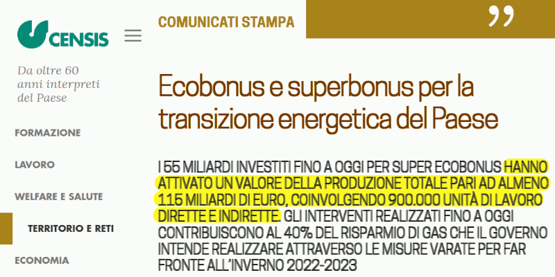

 

## L'abominevole truffa dei bonus edilizi

* Published May 22, 2024 - origin [LinkedIn](https://it.linkedin.com/pulse/labominevole-truffa-dei-bonus-edilizi-roberto-a-foglietta-72r5f)

---

### I dati del Censis

Secondo il CENSIS a fronte di €55 miliardi erogati - che sono solo una parte del Superbonus 110%, quella del primo anno che però è decollata a metà anno per via delle incertezze normative - si è generato €115 miliardi di PIL ma considerando che l'IRPEF sulle aziende è il 27% e l'IVA sull'edilizia è il 9% abbiamo che - facendo una somma lineare quindi ottimistica visto che il 27% si applica solo sull'utile e non sul volume - lo stato ha recuperato €38.5 miliardi, meno di quanto ne abbia dati.

 

Poi, il PIL aumenta ma solo per la durata dell'erogazione dei bonus mentre il debito resta quindi **almeno** €16.5 miliardi di quei €55 miliardi sono finiti ad incrementare il debito pubblico e a generare interessi passivi, potenzialmente **per sempre**, a meno di non prendere in considerazione di ripagare il debito pubblico.Ipotesi che al momento non è mai stata presa in considerazione anche se con cadenza ventennale una finanziaria lacrime e sangue capita.

Inoltre le truffe è ragionevole che abbiano cominciato a decollare solo l'anno dopo. Infatti, sei mesi per capire la normativa, sei mesi di boom degli ordini,a marzo dell'anno dopo con la seconda ondata di ordini, quando i prezzi dei materiali e dei ponteggi erano ormai saliti alle stelle e tutte le aziende serie rifiutavano di prendere altri lavori che non avrebbero potuto condurre o completare.

Quindi i dati sulle truffe presentati dal CENSIS sono decisamente sottostimati e di alcuni fattori, non di inezie. Le truffe sugli "*early birds*" sono ragionevolmente da riportarsi a casi in cui si è partiti con buone intenzioni e di fronte ad una mareggiata, in particolare quelle aziende già fragili e che sarebbero definitivamente fallire, hanno scelto la scorciatoia di una "*exit strategy*" fraudolenta.Hanno incassato i crediti e fallito, eventualmente nemmeno cominciato i lavori a parte mettere i ponteggi.

Quindi, il secondo round è stato molto peggio.

---

### La fornitura dei materiali

Ritornando a concentrarsi su quei €38.5 miliardi di extra-gettito a fronte di €55 miliardi erogati. Questo è vero nell'ottica che l'IRPEF sia calcolata su tutto il valore che non è fuori assurdo perché sul materiale, sul lavoro e sugli stipendi, l'IRPEF si paga.

Purtroppo è una stima realistica solo se **tutto** il materiale viene prodotto in Italia quindi tutta la filiera è locale. Ma facciamo finta che lo sia, ovvero che quei 115 miliardi si riferiscano **soltanto** a prodotto lordo italiano.

Con la scarsità e relativa difficoltà di reperibilità dei materiali, i prezzi almeno raddoppiati - nel caso delle tavole e dei tubi da ponteggi, più che raddoppiati - pensate che i prodotti cinesi non siano affluiti anche tramite intermediari poco trasparenti in particolar modo nella gestione fiscale?

Già perché le truffe che finiscono nelle statistiche sono quelle sui lavori edili, ma non tengono in considerazione di tutte le alterazioni e dell'evasione fiscale lungo tutta la catena di approvvigionamento che è stata pesantemente messa sotto stress, quella seria e solvibile anche fiscalmente, aprendo opportunità a tutti gli altri.

Perché se piazzi prodotti di infima qualità a prezzi esorbitanti, sfruttando una bolla estemporanea creata da un mercato pesantemente drogato, non pianifichi di rimanere sul mercato e quindi pagare le tassi. Fai il sacco e scappi, appena la pacchia finisce o la bolla scoppia.

Che un bonus del 110% sia un modo di drogare pesantemente il mercato, mi pare ovvio e basta fare un esempio: se dessero un bonus del 110% sul pane, ne comprerei subito 100 Kg anche se è letame, tanto finirebbe comunque a concimare il mio giardino, e in più oltre al letame gratis ottengo un cash-back del 10%. Non penso però che mettere letame sotto l'intonaco e per giunta da muratori improvvisati sia equivalente a concimare il giardino!

---

### Le certificazioni energetiche

Tralasciando gli immobili di lusso che hanno logiche di mercato tutte loro, in Italia,la rivalutazione del real-estate dipende dai servizi, infrastrutture, sanità, scuola,asili, verde, lavoro, diritti, opportunità, etc.

Invece, dove tutti questi aspetti, servizi e opportunità sono già garantiti, come negli altri paesi dell'Europa occidentale, è ovvio che a fare la differenza sia la classe energetica. Altrimenti la classe energetica è il minore dei problemi.

Purtroppo la bolla del superbonus non è solo di natura speculativa ma alla fine avrà prodotto una montagna di certificazioni false. Non che fossero false da principio, però quando i materiali messi nei preventivi sono andati esauriti a dicembre del primo anno del superbonus, con magazzini vuoti e forniture in panne, si è usato “la qualsiasi cosa”.

Questo non solo mancherà di ottenere il risultato sperato, il risparmio energetico,ma creerà tre tipi di problemi: bollette invariate, manutenzione straordinaria e imprevista se non anche incendi di proporzione e/o sviluppo epici.

**Cos'ha fatto il Governo?**

Ha alzato l'IVA sulle bollette al 22% e ha liberalizzato il mercato del gas togliendo i contratti di tutela tranne ai poveracci in canna tipo la famigliola del Conte Mascetti che vive in affitto nel seminterrato e che è assai improbabile che siano proprietari o che si siano impegnati in questi lavori visto che con quella ISEE appena campano.

---

### Super-bonus per super-ricchi

Se si ristruttura una villa con affreschi del '600 in mezzo ad un parco naturale,allora buon per loro porre in essere quelle coibentazioni ultra-tecnologiche che permettano di riscaldare 1.000 m² con un solo camino a pellet e un modernizzato impianto di distribuzione di aria calda.

Perché possano farlo gratis e con un 10% di cash-back in crediti fiscali però non se ne comprende il motivo quando quelli in fondo alla scala alimentare del real-estate non ottengono vantaggi neanche lontanamente paragonabili.

Purtroppo la quasi totalità del volume di mercato è costituito da condomini in periferia dove l'appartamento del sig. Rossi con i pannelli di polistirolo, invece che di lana di vetro come da capitolato, e l'intonaco tirato alla meno peggio degli ultimi saliti sui ponteggi, non verrà rivalutato.

Perché chiunque abbia soldi da spendere schifa di dover vivere in mezzo ai dei pezzenti, quando non anche piccola criminalità, spaccio e bullismo, zero alberi oppure dover guardare se ci sono siringhe sulle panchine prima di sedersi o debba pregare la Madonna che la figlia appena adolescente non rientri una mezz'ora in ritardo quando è già buio ma l'illuminazione pubblica è ancora spenta.

---

### I bonus edilizi in toto

Come anticipato, se consideriamo anche il secondo round, lo scenario diventa ancora più cupo. Infatti, considerando il loro costo complessivo - *ultimo dato consolidato di €120 miliardi* - è facile fare un conto veloce:

> `120E9 / 1E6 = 120E3` quindi `120E3 / 12 = 10 anni`

Si poteva distribuire €1.000 al mese ad un milione di persone per 10 anni, senza contare gli interessi, oppure €500 al mese per 20 anni. In pratica, invece del bonus casa, poteva essere un bonus bambini italiani. Il primo milione di bambini nati avrebbe ricevuto un vitalizio di €500 al mese per i primi 20 anni di vita. Denaro versato in valore netto ai genitori.

Si noti inoltre che di €120 miliardi, ben €15 miliardi sono risultati persi in truffe mentre il 10% sono interessi a pagare ai collettori dei crediti fiscali che li potevano acquistare al 90% del valore nominale. Quindi in gergo tecnico le "*attualizzazioni*" sono -25 mld, di costo. Con il bonus bebè €500/mo x 20 anni, €120 miliardi di erogazione complessiva sarebbero costati €81 miliardi, quindi con un risparmio di +39 mld, di sconto.

Infatti, depositare 120 mld in BCE fruttano il 4.5% annuo. Se sono debito pubblico -4.5% annuo. Risulta quindi ovvio che la gestione finanziaria sul lungo periodo sia un aspetto affatto trascurabile.

considerando di mantenere per 20 anni l'IVA sui prodotti per bimbi e quelli scolastici, la differenza con il 9% sull'edilizia porta ad un ulteriore attualizzazione di aggiuntivi 10.5 miliardi.

Se poi consideriamo che la manovra originale che ha generato un aumento del debito pubblico di 120 miliardi aveva come orizzonte temporale 4 anni e non 20anni, ma il debito generato perdura - *in eterno, in Italia* - diciamo per 20 anni allora:

> `120 × (1.045)^20 = 289`

Questo però solo nel caso di erogazione così detta "*helicopter money*" ovvero si stampa moneta a debito e la si getta da un elicottero sulla gente comune.

---

### Bonus madre vs edilizio

In pratica a vostro piacimento potete confrontare il bonus maternità €500/mo x 20anni di costo, ab origine, attualizzato a €70 miliardi contro quello dei bonus edilizi a €120 miliardi, sempre a costo attualizzato.

* Oppure potete proiettare queste cifre nel futuro di 20 anni e paragonare i costi come 120 - **60** (in 4 anni) + 44 (nei restanti 16 anni) quindi €64 miliardi di debito pubblico contro il bonus bambino da €70 miliardi di debito pubblico.

Si noti che recuperare il 50% di quanto erogato è una pia illusione infatti

> (`120 - 10%` interessi `- 15` truffe) × (`27% + 9%`) `= 22` e non `60`.

Ne consegue che quei €60 miliardi di cui sopra in realtà sono solo €22 miliardi,quindi rifacendo i conti con un importo recuperato assai diverso si ottiene quanto segue.

* Oppure potete proiettare queste cifre nel futuro di 20 anni e paragonare i costi come 120 - **22** (in 4 anni) + 121 (nei restanti 16 anni) pari a €219 il debito pubblico contro il bonus bambino da €70 miliardi di debito pubblico.

Se confrontate le due versioni comprendete qual è l'effettivo costo finanziario di un mancato recupero di valore a fronte quando realtà e teoria non sono allineate,cosa che in Italia succede spesso per non dire sempre.

---

### Tre volte tanto su 20 anni!

Se al governo ci fossero dei populisti conservatori con le competenze finanziarie di un masterizzato in una business school allora ad un terzo dell'impatto finanziario a lungo termine sul debito pubblico, ovvero con uno sconto di 2/3 sul debito pubblico aggiuntivo a lungo termine, avrebbero fatto il bonus bambino e non i bonus edilizi.

Sempre in un'ottica populista tradizionalista in cui il

- il marito-maschio-padre sia colui che gestisce l'attuale e la contingenza (caccia e raccolta), il bread-winner che porta a casa lo stipendio;

mentre

- la moglie-femmina-madre sia quella che pianifica il sostentamento della famiglia sul lungo periodo (agricoltura e allevamento), l'angelo del focolare.

Quella casalinga sposata facendo due figli avrebbe ottenuto un vitalizio di 20 anni da €1.000 al mese, partorendo due gemelli, altrimenti due fratelli a distanza di due anni: €500 x 2 anni + €1.000 x 18 anni + €500 x 2 anni.

Valori netti. Soldi sul conto. Cash al bancomat. Non crediti fiscali.

Al raggiungimento dei 20 anni di età quei due nuovi italiani avrebbero pesato ⅓ del bonus edilizio anche qualora a popolazione costante non avessero ridotto il debito pro-capite ma solo tenuto stabile l'età media della popolazione.

---

### Razzisti fino al midollo

Supponiamo che il bonus alla natalità non piaccia perché andrebbe a favorire gli immigrati senza reddito e quindi uno scenario di sussistenza contrario ad una linea politica razzista portata avanti da slogan del tipo:

- prima gli italiani

- l'Italia agli italiani

Perché poi alla fine sono 'ste robe che spostano il voto non il debito pubblico.

Se il problema era evitare che tali bonus finissero in tasca a degli immigrati appena arrivati bastava mettere un paletto contributivo.

Almeno un genitore con 5 anni di contribuzione fiscale complessiva oppure una coppia sposata con almeno 7 anni di contribuzione fiscale complessiva. Per essere ancora più razzisti, si alzerebbero quei valori a 10 e 14 anni, che sono grossomodo equivalenti ai tempi attuali di naturalizzazione e ottenimento della cittadinanza italiana. Con il rischio che valori troppo elevati siano considerati incostituzionali e quindi cancellati con effetto retroattivo.

Quindi, invece di 10 e 14 anni, la scelta più ragionevole di 5 e 7 anni che invece corrispondono a quei valori per i quali si presuppone che la coppia possa ragionevolmente risiedere in Italia per i prossimi 20 anni e che lo avrebbero potuto fare anche a meno del sussidio. Infine, erogazione del bonus in funzione dell'effettiva residenza e domiciliazione in Italia con eventuale aggiunta della cittadinanza europea.

Giusto per fare i populisti razzisti fino al midollo e al consentito dalle norme.

---

### Capre vs Pecore

Se l'Italia fosse una fattoria potremmo dire che al governo non ci siano dei lupi e tanto meno delle volpi. Piuttosto delle capre elette da delle pecore.

Quindi, stando all'intelligenza dell'elettorato indigeno che ha votato questi governanti che hanno fatto di questi disastri, l'IVA sui prodotti per bambini dovrebbe salire al 40% come sui prodotti di lusso per disincentivare la natalità indigena (basso QI) e quella immigrata (basso reddito).

Tutto chiaro?

 Due cose sono infinite l'universo e la stupidità umana. Non sono sicuro della prima. -- **Einstein**

---

### Analfabetismo funzionale

Il fatto che i calcoli sopra esposti intimidiscono o confondono l'Italiano medio, è **il problema** fondamentale e purtroppo è molto diffuso in Italia.

In questa incapacità di descrivere la realtà mediante modelli quantitativi siamo primi al mondo. In buona compagnia con gli USA dove alla fine del college fanno ancora fatica con le tabelline.

Eppure sono calcoli che - *in stime ragionevoli ottenute mediante approssimazioni lineari* - si possono fare agevolmente con una calcolatrice che in Italia si comprava persino in edicola negli anni '80 del XX secolo.

 Vintage 1980s Sharp electronic calculator Elsi Mate EL-230

---

### Stima sull'interesse

Per i calcoli sono state usate delle formule di approssimazione lineare per il calcolo composto degli interessi semplici che generalmente per tassi piccoli ovvero inferiori al 10% danno un'ottima approssimazione.

Se 100 è il debito o il deposito su cui si applicano interessi del 4% all'anno per un tempo di 10 anni ma in questo tempo una frazione del debito viene ripagata regolarmente o una frazione del credito viene erogata regolarmente allora si considera di usare il 2% come interesse semplice da calcolare in modo composto su base annuale.

Questo perché al tempo zero, il valore soggetto ad interesse è 100, mentre dopo 10 anni è zero. Nel mezzo questo valore scende linearmente quindi si stima che:

> `100 × 1.02^10 = 122`

> `100 × 0.98^10 = 82`

Siano due buone approssimazioni di attualizzazione o di maturazione di un capitale linearmente variabile nell'arco del tempo fra i due estremi del suo valore.A patto, ovviamente che l'intervallo temporale non sia troppo lungo.

Nel caso questo facesse storcere il naso ai puristi si tenga conto che nella realtà NON è sempre garantito che il tasso resti fisso a meno che non si negozi un'opzione specifica a riguardo. Quindi le approssimazioni, solitamente sono accettabili anche sui dati finanziari in termini di stime future.

---

### La ratio generale

I bonus o incentivi hanno lo scopo di far scavallare una barriera ad un mercato fragmento e lanciarlo nella sua naturale corsa fno alla maturazione di quel mercato e al suo naturale esaurimento.

Questo genera prodotto (PIL) perché attiva dei meccanismi di scala che altrimenti stenterebbero a partire. Ciò equivale ad un investimento che fa il pubblico perché manca un privato grande abbastanza per farlo.

Esempi di privati grandi abbastanza per azionare un'economia di scala:

- Italia on-Line (IoL) con Libero che ha lanciato internet gratis su numerazione locale che poi ha pagato tutto Telecom

oppure

- Beghelli con il "tetto d'oro", loro ci mettevano l'investimento e tu ci mettevi il tetto,quindi era un fifty-fifty.

Ma il privato innovativo a volte manca, quindi incentivi pubblici.

In teoria, i bonus edilizi nel loro insieme dovevano riqualificare e ripristinare il valore del real-estate ai livelli pre-2008, specialmente in Italia dove i prezzi non si sono ripresi dalla batosta, ovviamente da una prospettiva macro-sistemica e non campanilistica.

In questo contesto di macro-meccanismi di mercato, le mele, pere, ma anche cavoli e fave, sono il mercato ortofrutticolo. Il resto sono dettagli lasciati ai legislatori nazionali supponendo, a torto, che essi faranno del loro meglio per seguire le linee concordate unitariamente.

In Italia, i bonus edilizi non ottengono nulla di tutto questo piuttosto vanno a drogare un mercato esausto e senza prodotto che è spreco, debito e voti.

Il super-bonus è super in questo senso solamente, purtroppo.

Perché prima occorreva riqualificare il contesto, quindi i quartieri, il lavoro, i servizi, le infrastrutture, insomma l'intero sistema paese.

---

### L'Europa cattivissima

I bonus edilizi e in particolare il super-bonus sono arrivati in Italia come un'alluvione dirompente a causa delle normative europee che impongono l'impossibilità di vendere quegli immobili che non hanno certificazioni energetiche di grado elevato.

Un mostro legislativo della follia green dilagante in Europa all'assalto di diversi settori di mercato, non solo quello edilizio, e che l'Italia sperava di scampare ma sul quale invece è arrivata in terribile ritardo e completamente impreparata, as usual.

La cosa più saggia e semplice da fare era - *in sede europea* - spiegare che in Italia abbiamo, anche in ambito di riqualificazione di real-estate, ben altri problemi che la certificazione energetica.

Ma quando si è una delegazione europea di un paese governato da patrioti,orgogliosi di aver creato un Ministero del Made in Italy e di millantare la Venere di Milo per rilanciare il turismo, rode parecchio dover ammettere che nonostante trucchi e belletti, nonostante siamo stati uno dei sei paesi fondatori dell'Unione Europea, attualmente non siamo all'altezza degli altri membri di quell'esclusivo club.

---

## L'alternativa non sfizia

Sicché in sede di politica europea, l'alternativa era tagliarsi fuori dalla rivalutazione del real-estate con le certificazioni energetiche e puntare sul recupero dell'inverno demografico sostenendo che per il nostro paese e per il mandato ricevuto dall'elettorato populista-conservatore italiano era una priorità inderogabile, la natalità.

* **Ripopolare il patrio e sacro suolo con novella e fiera italianità!**

Ma per chi ha la fortuna di possedere delle ville storiche site in lussuosi o esclusivi contesti da riqualificare, la follia green europea cade a pennello.

Un po' meno invece gli sfizia la poraccia che vorrebbe figliare che se poi lo facesse davvero metterebbe in crisi i reparti di natalità negli ospedali, che ovviamente ormai non sarebbero più adeguati per affrontare un'ondata di nuovi nati, anche a causa dei tagli strutturali al bilancio della sanità, così come non lo sarebbero gli asili nido, gli asili comunali, le scuole materne, etc.

 

## Conclusione

Sappiamo benissimo di cosa abbiamo bisogno, in Italia:

- spiegare a Maria Antonietta dove se le può ficcare le sue brioches.

Ma non avendo gli attributi per farlo, preferiamo illuderci di partecipare al gran buffet di corte, dove invece vengono quotidianamente e allegramente servite le nostre chiappe, fritte, impanate, arrosto, stufate e pure al cartoccio condite con un filino d'olio EVO e una goccia di limone.

**BURP!**

 

## Share alike

&copy; 2024, **Roberto A. Foglietta** &lt;roberto.foglietta@gmail.com&gt;, [CC BY-NC-ND 4.0](https://creativecommons.org/licenses/by-nc-nd/4.0/)

