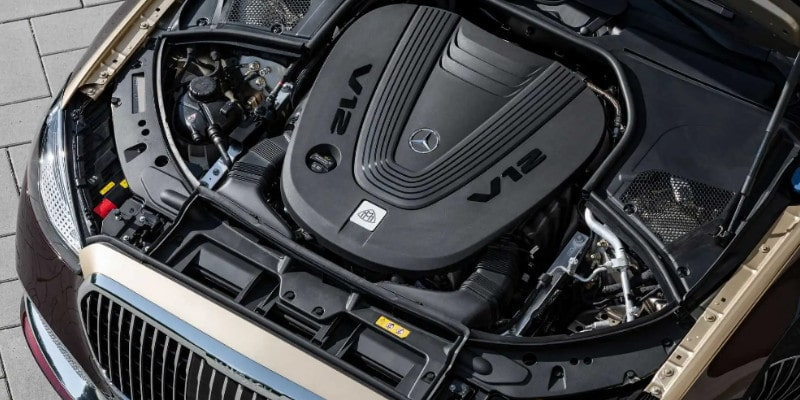
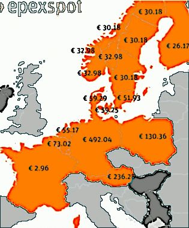
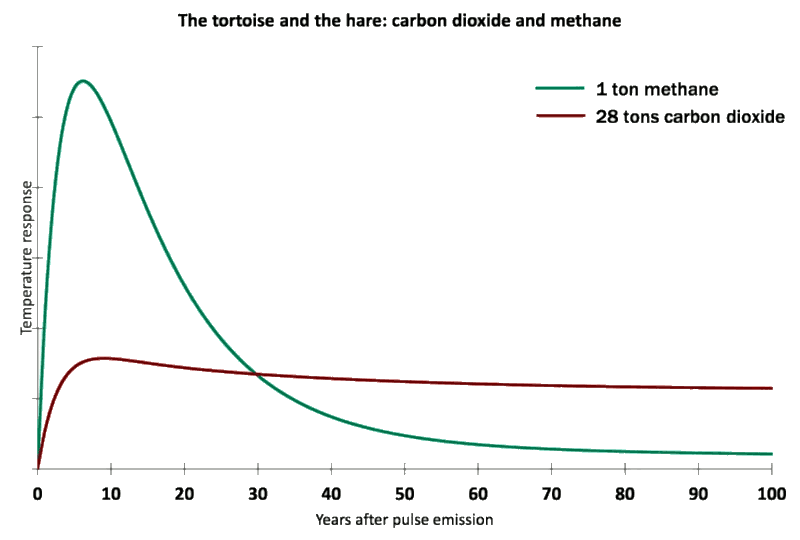
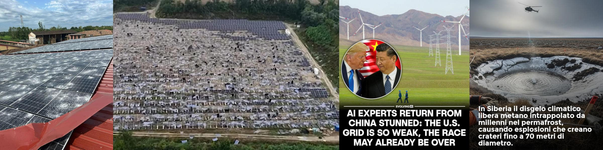
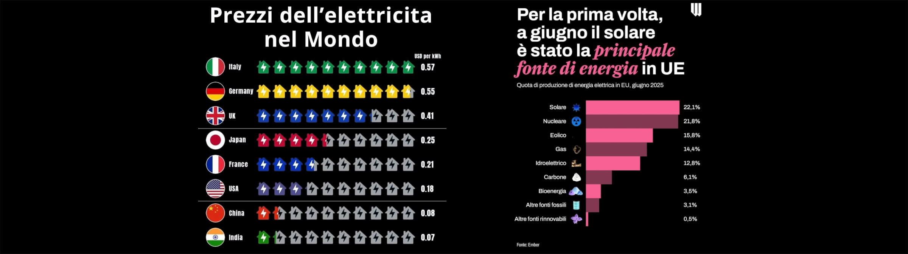

 

## Il futuro non è green ma mixed

* Published Jul 2, 2024 -- origin [Linkedin](https://www.linkedin.com/pulse/il-futuro-non-%25C3%25A8-green-ma-mixed-roberto-a-foglietta-bw5df) -- Articolo scritto a partire da un [post](https://www.linkedin.com/posts/robertofoglietta_il-futuro-non-%C3%A8-green-ma-mixed-28-giugno-activity-7213681543913889792-OgH8) pubblicato il 1° luglio 2024
* **2nd edition**, include una [sezione](#aggiornamento-3) riguardante gli impianti solari, e valutandone pros-vs-cons, ROI-vs-green.
* **3rd edition**, include una [sezione](#aggiornamento-4) sulla follia del greenwashing spiegata facile (e l'instabilità di rete).

---

### Introduzione

> **28 giugno 2024** -- Mercedes torna a investire molto sui motori a benzina e diesel.

> **28 giugno 2024** -- Reactions and analysis of Biden-Trump’s presidential debate.

La scelta di Mercedes di ritornare ad investire su migliori motori endotermici è comprensibile, hanno capito che presto la follia del greenwashing tipica dei democratici americani andrà a svanire per un approccio più realistico e meno ideologico.

Perché spegnere le ultime tre centrali nucleari in Germania non ha portato un grosso vantaggio alle vendite di oil & gas visto che i tedeschi sono tornati a sfruttare la lignite che hanno in casa per compensare sia il ridotto baseload sia il costo dell'energia. Ovviamente pagando il prezzo di una maggiore impronta ecologica.

Grosso modo il concetto è simile anche in altri contesti a parte forse la Francia. Dove l'energia costa relativamente poco, si produce e si consuma.Dove costa relativamente troppo cara, si de-industrializza con tutte le conseguenze sistemiche del caso.

---

### Meno lavoro, meno auto, meno benzina.

Il problema del lobbying attuale è la mancanza di pragmatismo che viene dal comprendere teorie non banali e piuttosto recenti. Se la speculazione non tiene conto della realtà, gli effetti di degradazione sistemica riducono il vantaggio della speculazione fino ad ottenere valori negativi.

In un contesto del genere (cfr. link e mappa qui sotto), in assenza un meccanismo di compensazione, il prezzo dell'energia spot varia dai €3 della Francia ai quasi €500 della Germania, non è l'industria oil & gas a vincere ma la EDF.

 

Si dovrebbe convincere la Francia a suicidarsi sul nucleare cosa che per altro gli USA hanno fatto con Macron che ha chiuso gli impianti di auto- fertilizzazione.

---

### Non tutto è perduto

Impianti che possono essere riattivati e stante le scorte di uranio della Francia potrebbero fornirle energia elettrica per 2.000 anni oppure fornire energia elettrica a tutta Europa per 100 anni.

Certo in questo secondo caso servirebbero anche molte più centrali nucleari da far lavorare in parallelo. Ma è proprio questo il punto che alcuni paesi hanno capito e altri no.

Il baseload elettrico, più sicuro e più ecologico, è quello nucleare di III+ generazione mentre i reattori sottocritici al torio basati sull'idea di Rubbia vanno bene per il processamento delle scorie e le grandi navi o le portacontainer.

Il gas per il riscaldamento e il petrolio per le auto e materie plastiche.Mettere insieme in modo organico ecologia ed economia significa che ogni fonte energetica deve essere usata nel modo migliore secondo le sue peculiarità. L'opposto di prendere decisioni ideologiche come l'EV per la mobilità personale (auto) come transizione sistemica piuttosto che di nicchia.

In generale, anche questo caso ci dimostra come sia deleterio per l'Occidente avere una direzione unica imposta da un singolo centro di potere che esso sia Washington piuttosto che l'OMS. Diversificazione!

+

## Aggiornamento 2024-09-12

Gli USA sarebbero in ginocchio senza le forniture di combustibile nucleare da parte di Rosatom (Russia).

[!INFO]
**12th September 2024** -- Putin calls for export limits on Russian nickel, uranium and titanium. Russia’s president believes that restrictions on key metals would serve as retaliation against Western sanctions.
[/INFO]

Questa notizia è stata completamente trascurata nonostante sia di quasi 10 giorni fa. Invece, questo tipo di restrizioni può avere un grande impatto, soprattutto sull'economia degli Stati Uniti e sulla loro capacità di rifornirsi di energia dalle centrali nucleari. 

Attualmente, infatti, le centrali nucleari statunitensi funzionano con combustibile a uranio arricchito proveniente dalla Russia e fornito dalla società nazionale Rosatom. Inoltre, poiché le centrali nucleari negli Stati Uniti sono gestite da società private, per ridurre i costi hanno deciso di “comprare” piuttosto che “produrre”.

Ciò significa che gli Stati Uniti non hanno abbastanza centrifughe per arricchire il minerale di uranio che potrebbero importare da qualche altra parte. Inoltre, per tagliare i costi, hanno mantenuto la catena di approvvigionamento “snella”, il che significa mantenere i magazzini il più possibile vuoti e affidarsi preferibilmente a forniture “su richiesta”.

* dall'incipit di un mio LinkedIn [post](https://[lnkd.in/dKQ6nYRC](lnkd.in/dKQ6nYRC) scritto in inglese e qui tradotto in italiano.

+

## Aggiornamento 2025-07-10

[!INFO]
**7 luglio 2025** -- Il metano, seppur in concentrazioni molto minori nell’atmosfera rispetto all’anidride carbonica, ha una capacità molto più alta di assorbire e trattenere il calore, contribuendo maggiormente all'effetto serra. Ridurne le emissioni, o la concentrazione in atmosfera, è pure più facile. <!-- Il Post https://www.ilpost.it/2025/07/07/metano-effetto-serra questo articolo è complessivamente un collage di vaccate ideologiche, per capirlo basta vedere come ho dovuto riscrivere la frase sopra: l'effetto serra è un questione, il riscaldamento globale un'altra questione sebbene correlata all'effetto serra ma non solo, infine il cambiamento climatico è ancora un'altra questione sebbene collegate alle prime due ma non nella maniera intituiva che si penserebbe piuttosto fenomeni metereologici (incluso freddo) più intensi e stagioni meno regolari. //-->
[/INFO]

 

Il GWP (Global Warming Potential) è un'unità di misura comparativa che esprime la capacità di un gas serra di contribuire al riscaldamento globale rispetto all'anidride carbonica (CO2), alla quale viene assegnato convenzionalmente un valore unitario (normalizzazione). Questo significa che il GWP di altri gas è relativo a quello della CO2, ma può cambiare in un determinato arco temporale.

Ad esempio, una tonnellata di metano (CH4) rilasciata in atmosfera ha un impatto molto più significativo che se fosse CO2. Neell'arco di 20 anni, una tonnellata di metano scalda quanto 84 tonnellate di anidride carbonica. Quindi il suo GWP a 20 anni è 84. Se si considera un orizzonte temporale più lungo, come 100 anni, l'effetto dell'emissione originale del metano diminuisce, pur rimanendo notevole, circa 28. 

Questa differenza nel GWP tra i due periodi temporali sottolinea come l'impatto dei gas serra possa variare notevolmente a seconda della loro persistenza nell'atmosfera e della loro capacità di assorbire energia.

[!INFO]
**20 giugno 2025** -- Il MethaneSAT, un satellite progettato per monitorare le emissioni di petrolio e metano, lanciato a marzo 2024, costato $88 milioni è ora disperso dopo aver perso potenza sui cieli della Norvegia ed è "probabilmente irrecuperabile". Prima di perdere il contatto, MethaneSAT ha rivelato che le emissioni di metano in alcune aree erano 10 volte superiori a quanto riportato in precedenza, evidenziando il ruolo significativo del metano, responsabile di circa un terzo dell'effetto serra di origine antropica.
[/INFO]

#### Black-out in Italia

[!INFO]
**17 giugno 2025** -- Anche oggi, dopo quattro giorni di problemi. si segnalano blackout (10h) nel centro di Torino. Sono senza corrente elettrica diverse zone del centro comprese nella zona di via Garibaldi, piazza Castello, via XX Settembre.
[/INFO]

[!INFO]
**8 luglio 2025** -- Black-out Italia, al caldo Roma e Milano ma anche Firenze e Bergamo. Tutta colpa dei condizionatori accesi giorno e notte. A essere investite dalla criticità sia abitazioni che negozi.
[/INFO]

Immaginate cosa possa succedere se dovessimo alimentare 40 milioni di veicoli elettrici, senza una rete di fornitura adeguata al carico e centrali nucleari per sostenerlo in ogni condizione h24 e 7gg/settimana.

[!INFO]
In Italia, ci sono circa 40 milioni di automobili in circolazione. Questo dato include tutti i tipi di veicoli, dalle autovetture ai veicoli commerciali, ma non le moto. L'Italia è anche il paese con il più alto tasso di motorizzazione nell'Unione Europea, con circa 694 auto ogni 1000 abitanti.
[/INFO]

Buona fortuna a chi pensa di poter gestire la transizione energetica in questo modo, con le ideologie piuttosto che con scienza, tecnica e senso della realtà!

+

## Aggiornamento 2025-08-31

 

Il fotovoltaico é buono? la tecnologia di per se stessa non è malvagia, e il modello "Tetto d'Oro" della Beghelli era ottimo però NON si prestava ad un mercato selvaggio e in italia "liberalizzare" un mercato come quello degli installatori garantisce tanti voti, rendimenti bancari (già) e smaltimento rifiuti alla mafia & co.

Vediamo di fare un po' di chiarezza:

1. - le fonti sono rinnovabili ma l'estrazione di energia da quelle fonti NON è rinnovabile infatti le pale eoliche e pannelli solari NON durano in eterno e non sono riciclabili se non in misura minima, oltre alle attività di manutenzione anch'esse NON rinnovabili nel senso che si vorrebbe intendere;

2. - le fonti rinnovabili quali vento e sole, non provvedono al baseload in quanto variabili. Le c.d. "smart grid" non compensano ma introducono rischi di instabilità sistemica e di sicurezza nazionale perché più è sofistica un sistema e più è vulnerabile. Energy storage? Reactivity nightmare!

Quindi già in partenza questo fenomeno era affetto da "fuffa marketing" che faceva leva sull'ignoranza e sul dilagare dell'analfabetismo funzionale e antiscientismo. Così siamo arrivati all'assurdo, come in Germania, di spegnere le centrali nucleari. O come in Francia di fermare gli impianti di autofertilizzazione.

Risultato? La potenza installata delle "rinnovabili" ha portato il sistema fuori equilibrio. Una rete critica, diventa un obiettivo strategico. Centinaia di miliardi per avere i blackout e un costo dell'energia insostenibile. CO2 ai massimi.

Però la transizione ecologica è il futuro, non ci sono altre strade per la sopravvivenza dell'umanità. Concordo, e in ultima analisi significa ritornare al nucleare. Ma giacché ritornare al nucleare, in modo più consapevole a anche tecnologicamente più avanzato quindi più sostenibile, non è un obiettivo possibile nell'immediato, il futuro a breve termine non è green ma mixed. -- lnkd.in/ddq2Phme

D'altronde il green è morto, ed è morto proprio quando la sua massiccia adozione, costata centinaia di miliardi, ha messo il sistema energetico in uno stato di instabilità. Per una ragione tanto banale quanto inevitabile: le fonti di energia variabili non possono supplire al baseload che quindi deve essere sostenuto con altre fonti e quelle variabili devono essere compensate con quelle modulabili (per esempio il gas naturale).

Così si è creato un sistema energetico che si appoggia, come fosse uno sgabello, su tre gambe (quindi tre costi) ma produce un massimo di due di energia. Quindi costa almeno 50% in più (in realtà un botto di più perché il rapporto fra potenza nominale e produzione media è relativamente molto basso) ed è comunque sbilanciato sulla potenza reattiva.

**Soluzione**: niente incentivi, filiera certificata e ROI verificabile.

---

### Perché il solare è greenwashing?

Perché anche l'offerta di pannelli solari ai piccoli clienti privati si tratta di greenwashing, che pure sarebbe il mercato di nicchia in cui davvero tali installazioni dovrebbero rimanere ristrette salvo casi particolari?

Fondamentalmente perché varie ragioni che però rientrano in un unico indirizzo: sovrastimare i benefici e ignorare l'impatto ecologico. Per esempio, si conteggia con ottimismo la riduzione delle emissioni di CO2 (ammesso che la CO2 sia un driver del cambiamento climatico piuttosto che un indicatore) per quanto riguarda la produzione di energia ma si trascura completamente le emissioni di CO2 (e altri fattori inquinanti rilevanti) relative all'estrazione delle materie prime, al loro trasporto, alla produzione, al trasporto del prodotto, all'installazione, alla manutenzione e infine alla dismissione che sono tutti processi ecologicamente impattanti dove i materiali di scarto, risulta e da dismettere **non** sono riciclabili se non in misura minima e questo vale anche per le pale eoliche.

In buona sostanza di veramente green non c'è nemmeno il flyer promozionale stampato. Certamente non la filiera nella sua totalità. Anche per questa ragione le c.d. energie rinnovabili non meritano incentivi e sussidi ma di essere lasciate alla mera convenienza del libero mercato dove il pubblico, eventualmente, impone dei criteri (filiera certificata e ROI verificabile) a tutela degli acquirenti, ammesso che siano capaci di leggere quei dati anche qualora fossero pubblici, verificabili in maniera indipendente e quindi corretti.

---

### Tetto d'Oro di Beghelli

[!INFO]
La campagna pubblicitaria per "Il Tetto d'Oro" ("acqualuce") è iniziata a dicembre 2010. Si trattava di un progetto del Gruppo Beghelli che integrava in un unico impianto moduli fotovoltaici e termici, come indicato da ADC Group.
[/INFO]

Già 15 anni fa alla Beghelli. avevano capito tutto. O per lo meno quello che serviva sapere. Incluso che i clienti **non** erano qualificati per quel mercato. I privati potevano candidare il proprio tetto o qualunque superficie che pensava potesse ospitare tale impianto. Mentre Beghelli faceva tutto il resto e si spartivano rischi e rendimento. Il portava Beghelli a rifiutare più proposte di quanto non ne accettassero.

Perché dividendo il rischio e gli utili non si va di certo ad installare dove si stima di non ottenere un ritorno sufficiente: ROI diminuito di fattore di rischio, oltre ad altri fattori che riducono oppure alzano il valore base di riferimento, ovviamente.

Una parte ci mette l'asset immobiliare (comodato d'uso) e l'altra parte ci mette l'impianto, la manutenzione, la gestione della filiera e lo smaltimento. Sul grande numero di installazioni ci si auto-assicura, cioè in proprio senza necessariamente rivolgersi a terzi. Ciò non significa che si debba fare tutto internamente. Come ogni ditta seria hanno sicuramente affrontato il dilemma do-or-buy rispetto a diversi aspetti operativi. 

Quindi anche con questo modello di business, si lavora bene anche meglio, anzi. Perché l'azienda di riferimento che fa il marketing & sales, si affida ad una cerchia di fornitori di fiducia, rapporti stabili con aziende della logistica. Mentre le installazioni sono affidate a degli impiantisti indipendenti, prevalentemente assistiti dalla rete dei loro CAT, così come fanno molte aziende fra le quali Elvox e Vimar.

**Conclusione**: ogni offerta a privati priva di ROI sharing è caccia aperta agli sprovveduti.

+

## Aggiornamento 2025-07-29

Questa sezione sulla follia del greenwashing spiegata è stata inclusa qui, incorporando un mio post pubblicato su [LinkedIn](https://www.linkedin.com/posts/robertofoglietta_la-follia-del-greenwashing-spiegata-facile-activity-7356061927753629698-YY2l) e [Facebook](https://www.facebook.com/roberto.a.foglietta/posts/10162127120048736) del 29 luglio 2025.

---

### La follia del greenwashing

Le fonti variabili (perché questo sono le fonti alternative come solare e eolico) sono sul totale: 22.1% + 15.8% + 0.5% = 38.4%. Quanto è il baseload il carico di rete, quello fisso che sia notte o senza vento? Sicuramente nucleare e carbone che sono le due fonti stabili ma poco modulabili: 21.8% + 6.1% e per essere magnanimi ci mettiamo pure 1/2 dell'idroelettrico 6.4% quindi 34.3%.

 

Quindi riassumendo, abbiamo:

- variabili: 38.4%
- modulabili: 27.3%
- base-load: 34.3%

Una considerazione prima di tutte, le modulabili devono essere ALMENO quanto le variabili perché se queste vanno a zero, le modulabili suppliscono. Questo in termini di capacità produttiva media annuo reale.

Si potrebbe dire che quando sono "accese" le variabili producono "tanta" energia e quindi le modulabili conteggiano poco nella produzione. Questo significa che abbiamo un'enorme capacità variabile installata che però in media lavoro "poco" (quando è possibile) e una buona capacità modulabile installata che però lavora "poco" (per supplire). Questo in economia si chiama spreco.

Poi se le variabili fanno davvero le bizze, allora le modulabili non compensano e si va in black-out. Quindi se il baseload è 1/3, anche le altre due e le variabili sono un di più. 

Sono un di più perché anche un mix bilanciato 1/3, 1/3 e 1/3, significa che consumiamo 2 ma abbiamo potenza installata per 3 però non possiamo MAI consumare 3 quando vogliamo ma al massimo sempre 2. Come fa ad essere green una soluzione che da un punto di vista economico implica uno spreco dell'installato del 33%. 

Però sono green e non producono CO2, intanto il metano fa più danno della CO2, molto di più. Con la guerra in Ucraina, abbiamo perdite di metano 10 volte superiori a prima e infatti del satellite da €83 milioni (pagato da Jeff Bezos) che serviva per monitorare queste emissioni che impattano anche 84 volte la CO2 (per tonnellata) è "scomparso" sopra la Norvegia quindi prima che sorvolasse la Siberia (scioglimento del permafrost?).

La filiera di manutenzione, di produzione, di installazione, di smantellamento e dismissione NON sono green per una fava. Allora di cosa stiamo parlando? Nulla, ideologia greenwashing bella e buona per installare fuori dal piano energetico nazionale potenza per il 33% in più mandando fuori mercato le fonti che invece non ricevono sovvenzioni a pioggia dalla politica.

Qualche parco eolico nel Mar Baltico rende bene, tipo quello di proprietà della Corona Inglese. Ma sono eccezioni.

+

## Related articles

- [AI driven fact-check can systematically fail](323-ai-driven-fact-check-can-systematically-fail.md) &nbsp; (2025-06-13)
+++++
- [Who paid for that study: science & business](318-who-paid-for-that-study-science-and-business.md) &nbsp; (2025-06-07)
+++++
- [Mr. Spock about financial capitalis](308-mr-spock-about-finantial-capitalism.md) &nbsp; (2025-04-17)
+++++
- [Ignoring reality has its own cost](304-ignoring-reality-has-its-own-cost.md) &nbsp; (2025-03-07)
+++++
- [Il cambiamento climatico questo sconosciuto](295-il-cambiamento-climatico-questo-sconosciuto.md) &nbsp; (2024-12-14)
+++++
- [Plastica vegetale: scarti vs canapa](279-plastica-vegetale-scarti-vs-canapa.md) &nbsp; (2024-07-31)
+++++
- [Riciclo di rifuti pregiati](239-riciclo-di-rifiuti-pregiati.md) &nbsp; (2024-01-23)
+++++
- [Opinions, data and method](016-opinions-data-and-method.md) &nbsp; (2016-09-03)

+

## Share alike

&copy; 2025, **Roberto A. Foglietta** &lt;roberto.foglietta@gmail.com&gt;, [CC BY-NC-ND 4.0](https://creativecommons.org/licenses/by-nc-nd/4.0/)

