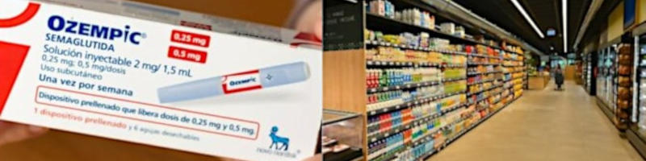

 

## Plastica vegetale: scarti vs canapa

- Published Jul 31, 2024 - origin [Linkedin](https://www.linkedin.com/pulse/plastica-vegetale-scarti-vs-canapa-roberto-a-foglietta-lbdxf) copia in [html](https://robang74.github.io/roberto-a-foglietta/html/linkedin/plastica-vegetale-scarti-vs-canapa-roberto-a-foglietta-lbdxf.html)

- **2nd edition**, include l'[aggiornamento](#aggiornamento-2025-04-04) riguardo alla lungimirante legislazione svizzera.

Un articolo incentrato sull'importanza della coltivazione della canapa per avviare il mercato dei prodotti ecologici, per davvero, non greenwashing.

---

### Economia di scala, un fattore essenziale

[!INFO]
La plastica di canapa è un materiale composito costituito di fibre di canapa, che può essere impiegato per sostituire materie prime derivate dal petrolio o composti chimici affini. È principalmente prodotta in Cina. -- [Wikipedia](https://it.wikipedia.org/wiki/Plastica_di_canapa)
[/INFO]

Nel mercato dei prodotti plastici per il consumo di massa,conta l'economia di scala e le plastiche vegetali raramente possono scalare tanto da poter essere in qualche misura appena percettibili in competizione con le plastiche derivate dalla raffinazione del petrolio.

La ragione è abbastanza semplice. Attualmente i prodotti di plastica di origine vegetale usano, per contenere i costi, materiale di scarto di altre lavorazioni e/o prodotti. Chi si afda a questo tipo di fornitura non può crescere oltre una certa dimensione perché richiederebbe grandi investimenti a fronte di un'incertezza inevitabile nella supply chain della materia prima. In pratica contraddice uno dei principi fondamentali dello stakeholders management. Non si fa, è un rischio troppo grande.

Invece la storia cambia sensibilmente con la coltivazione della canapa di cui l'Italia, un tempo, era grande produttrice perché si trattava di una materia prima ottima e versatile. Oltretutto la coltivazione e la lavorazione della canapa era già ben sviluppata prima della scoperta del petrolio e pure prima dell'introduzione del cotone in Europa (800 d.C. circa).

---

### Fissazione della CO2

Un albero produce ombra e fresco d'estate, ripara dalla pioggia, smottamenti,valanghe d'inverno. Alcuni non perdono nemmeno le foglie d'autunno.

 

Se estendiamo il concetto funzionale di fissatore di CO2 allora scopriamo che ci sono anche le piante, in particolare le piante che non sono alberi. Fra queste la canapa indiana è la più efficiente in termini di consumo di suolo ed acqua come fissatore di CO2.

La canapa indiana può sostituire in molte applicazioni i prodotti derivati dal petrolio come corde, cruscotto, persino certe parti in metallo delle carrozzeria delle automobili,molti usi della plastica in particolare quelli monouso o comunque non per lunga durata.

La canapa indiana, sviluppa naturalmente la capacità di produrre CBD e THC. Due molecole che sono o sarebbero utilissime in farmacologia e anche molto convenienti da usare almeno tanto quando sarebbe più ecologico usare la canapa invece della plastica e del nylon.

Purtroppo il THC è considerato illegale e lo &lt;0.5% (#1) in peso è comunque una gran rogna legale da gestire al punto che la produzione industriale di canapa è stata abbandonata nonostante fosse una delle nostre eccellenze e industrie primarie in Italia.

---

### La Marijuna come droga, dal 1961

Il controllo della marijuana ha spinto la canapa fuori dal mercato. Fondamentalmente perché la canapa sviluppa naturalmente il THC, che è un componente illegale dal 1961. Sviluppa THC per lo stesso motivo per cui le piante di tabacco sviluppano nicotina: difesa antiparassitaria.

Come ogni altra pianta coltivata in un grande campo, tende a ibridarsi con altre varietà. Presto o tardi, anche con la marijuana. Solo perché qualcuno la coltiva per uso personale.

Pertanto, è piuttosto impegnativo coltivare grandi quantità di canapa con un livello di THC pari a zero. Tutto ciò che supera lo zero sarà perseguito come spaccio di droga.

[!INFO]
Since 1961, cannabis inflorescences have been under international control as narcotic substances (UN Single Convention - 1961 - INCB Yellow list). Of the two main cannabinoids present, THC and CBD, only THC is under international control as a psychotropic substance (INCB Green list). -- [unodc.org](https://www.unodc.org/pdf/convention_1961_en.pdf) artt. 22, 28 e 49.
[/INFO]

La canapa è stata utilizzata per molti usi ed è stata una coltivazione primaria in Italia, in particolare per le corde navali. Oggi può sostituire la plastica anche nella produzione automobilistica.

Purtroppo, essendo vietato qualsiasi livello di THC, la coltivazione della canapa non può fornire una grande quantità di materia prima a basso costo. Questo è il motivo principale per cui il Brasile ha allentato i controlli sulla marijuana.

---

### Criteri di quantificazione del THC

Procedimenti penali in tema di "canapa light" e le questioni tecnico-giuridiche e i connessi profili di natura chimico-tossicologica a cura dell'avv. Carlo Alberto Zaina:

- [Cannabis: i criteri di quantificazione del THC](https://www.altalex.com/documents/news/2021/10/29/cannabis-i-criteri-di-quantificazione-del-thc) &nbsp; Avv. Carlo Alberto Zaina per AltaLex Italia (2021-10-29)

Purtroppo questo articolo sebbene faccia un'ampia panoramica con un format divulgativo sulla questione non è recentissimo e delle novità in termini di restrizioni ci sono già state già nel 2024.

---

### Nuove restrizioni introdotte nel 2024

[!INFO]
**6 luglio 2024** - I prodotti per uso orale a base di cannabidiolo, estratto dalla cannabis, usati tra le altre cose per combattere ansia, insonnia, dolore, entrano ufficialmente nella tabella dei medicinali del ministero della Salute nella sezione B, quella dedicata a medicinali a base di sostanze stupefacenti di origine vegetale. -- [Upday News](https://www.upday.com/it/cannabis-i-prodotti-derivati-per-uso-medico-entrano-nellelenco-delle-sostanze-stupefacenti)
[/INFO]

Nel momento in cui vengono considerati medicinali stupefacenti (pur essendo il cannabidiolo privo di effetti psicotropi, a differenza del THC), cambia il regime di somministrazione di questi prodotti: per utilizzarli occorre ora la ricetta medica, sono acquistabili solo in farmacia e ne sarà vietata la pubblicità.

Perché una legge diventi effettiva occorre che sia pubblicata sulla Gazzetta Ufficiale e poi generalmente passati 15 giorni dalla pubblicazione essa entra in vigore, ma il termine può essere diverso se specificato nella legge, più lungo o più breve.

In questo caso si tratta del decreto del 27 giugno 2024 pubblicato in GU n.157 del 6 luglio 2024. In particolare le due parti interessanti sono:

> Ritenuto, per quanto sopra, `[...]`, di dover procedere all'emanazione di un nuovo decreto che, `[...]`, determini l'inserimento delle composizioni per somministrazione ad uso orale di cannabidiolo ottenuto da estratti di Cannabis (lnkd.in/dA3S3p9U) nella tabella B dei medicinali `[...]`, contestualmente revocando i decreti ministeriali 1° ottobre 2020, 28 ottobre 2020 e 7 agosto 2023.

Il presente decreto entra in vigore il trentesimo giorno successivo a quello della sua pubblicazione nella Gazzetta Ufficiale della Repubblica italiana.

Quindi (a) annulla norme in vigore almeno dal 2013 di cui l'ultima approvata un anno fa;poi (b) riguarda solo i fitocannabinoidi per assunzione orale; e (c) i prodotti erano ordinabili senza ricetta medica non ripetibile fino al 18 luglio 2024, incluso.

Cosa è cambiato dal 2023? Nulla, è solo vetero-proibizionismo a favore dei cannabinoidi di origine sintetica (aka farmaceutici).

---

### Alimentazione e salute

 

[!INFO]
**7 luglio 2024** - L’Ozempic può diventare una “minaccia esistenziale per l’industria alimentare”: nei supermercati arrivano i prodotti ad hoc per chi assume il farmaco dimagrante. Nati per il trattamento del diabete, questi farmaci hanno ottenuto un – assai controverso – successo come dimagranti. E ora è il turno delle major dell’alimentazione di cercare di sfruttare questo fenomeno. -- [Il Fatto Quotidiano](https://www.ilfattoquotidiano.it/2024/07/07/lozempic-puo-diventare-una-minaccia-esistenziale-per-lindustria-alimentare-nei-supermercati-arrivano-i-prodotti-ad-hoc-per-chi-assume-il-farmaco-dimagrante/7613422/)
[/INFO]

Quindi l'idea di togliere gli zuccheri raffinati potrebbe essere un salvagente in questo contesto. Al netto di eventuali altri effetti benefici non affatto da trascurare ma ancora da confermare. Tipo sostituire lo zucchero con fibre di canapa e dolcificante, in maniera da non alterare le ricette e le linee di produzione di molti prodotti alimentari. Perché il grosso del costo sta proprio in questo.

+

## Aggiornamento 2025-04-04

Il proibizionismo della cannabis contribuisce fortemente alla depressione dell'industria della canapa che invece, specialmente in Italia, avrebbe ottime prospettive di crescita. 

Infatti, la canapa, anche quella che non contiene THC, tende in modo naturale a ibridarsi con le varianti con THC perché tale molecola funziona come anti-parassitario. Quindi la canapa che produce un po' di THC ha un vantaggio pratico rispetto a quella che non ne ha proprio niente.

In questo contesto converrebbe adottare una legislazione come quella svizzera e nel nostro caso, Italia, estenderla in maniera da garantire per almeno 10-30 anni l'industria della canapa. Perché senza garanzie di legge, il rischio degli investimenti sarebbe troppo elevato per generare un'economia industriale di scala, l'unica che può davvero portare ad un mercato del lavoro floridi e ROI interessanti.

[!INFO]
Le parole "canapa" e "cannabis" sono spesso usate in modo intercambiabile, ma in realtà si riferiscono alla **stessa** pianta, la [Cannabis Sativa L.](https://it.wikipedia.org/wiki/Cannabis_sativa) (canapa utile). La differenza principale tra le due sta nella loro composizione chimica, in particolare nel contenuto di [tetraidrocannabinolo](https://it.wikipedia.org/wiki/Delta-9-tetraidrocannabinolo) (THC), il composto psicoattivo responsabile degli effetti "sballanti". 

La legislazione svizzera, che ammette un limite legale di THC dell'1%, è considerata un ottimo equilibrio per favorire l'agricoltura e l'industria della canapa, pur mantenendo un controllo ragionevole per evitare gli abusi legati al consumo ricreativo di varietà ad alto THC.

Un limite dell'1% di THC è significativo. Anche se superiore allo 0.2-0.3% di molti altri paesi, non è sufficiente a produrre un effetto psicoattivo significativo per la maggior parte delle persone. Varietà di cannabis destinate all'uso ricreativo contengono tipicamente tra il 10% e il 30% o più di THC.

Un contenuto di THC dello 0,5% (che rientra ampiamente nel limite svizzero dell'1%) combinato con altri cannabinoidi (come il CBD, che è abbondante in queste varietà) e un buon profilo terpenico, è generalmente sufficiente per conferire alla pianta un'ottima resistenza naturale contro molti parassiti e patogeni.
[/INFO]

Il proibizionismo ideologico è una zappa sui piedi come per altro tutte le politiche basate su una qualche ideologia piuttosto che su una valutazione razionale ed oggettiva della questione che ambiscono a normare.

Continua approfondendo l'argomento in questa [conversazione](https://g.co/gemini/share/33f7768a9275) con Gemini o la sua [trascrizione](data/279-plastica-vegetale-scarti-vs-canapa-gemini.txt#?target=_blank) che nei suoi due aggiornamenti include anche la questione maschi-femmine nella coltivazione industriale, le peculiarità delle coltivazioni OGM in campi aperti e la specializzazione delle coltivazioni in serra a produzione ridotta ma ad alto valore aggiunto (farmaceutica).

+

## Share alike

&copy; 2025, **Roberto A. Foglietta** &lt;roberto.foglietta@gmail.com&gt;, [CC BY-NC-ND 4.0](https://creativecommons.org/licenses/by-nc-nd/4.0/)

