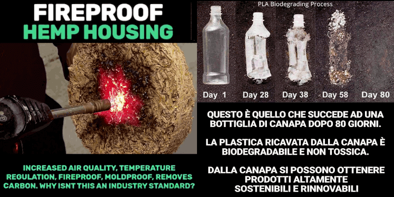

 

## Plastica vegetale: scarti vs canapa

* Published Jul 31,2024

Un articolo incentrato sull'importanza della coltivazione della canapa per avviare il mercato dei prodotti ecologici, per davvero, non greenwashing.

---

### Economia di scala, un fattore essenziale

> La plastica di canapa è un materiale composito costituito di fibre di canapa, che può essere impiegato per sostituire materie prime derivate dal petrolio o composti chimici affini. È principalmente prodotta in Cina.
> &mdash; [Wikipedia](https://it.wikipedia.org/wiki/Plastica_di_canapa)

Nel mercato dei prodotti plastici per il consumo di massa,conta l'economia di scala e le plastiche vegetali raramente possono scalare tanto da poter essere in qualche misura appena percettibili in competizione con le plastiche derivate dalla raffinazione del petrolio.

La ragione è abbastanza semplice. Attualmente i prodotti di plastica di origine vegetale usano, per contenere i costi, materiale di scarto di altre lavorazioni e/o prodotti. Chi si afda a questo tipo di fornitura non può crescere oltre una certa dimensione perché richiederebbe grandi investimenti a fronte di un'incertezza inevitabile nella supply chain della materia prima. In pratica contraddice uno dei principi fondamentali dello stakeholders management. Non si fa, è un rischio troppo grande.

Invece la storia cambia sensibilmente con la coltivazione della canapa di cui l'Italia, un tempo, era grande produttrice perché si trattava di una materia prima ottima e versatile. Oltretutto la coltivazione e la lavorazione della canapa era già ben sviluppata prima della scoperta del petrolio e pure prima dell'introduzione del cotone in Europa (800 d.C. circa).

---

### Fissazione della CO2

Un albero produce ombra e fresco d'estate, ripara dalla pioggia, smottamenti,valanghe d'inverno. Alcuni non perdono nemmeno le foglie d'autunno.

 

Se estendiamo il concetto funzionale di fissatore di CO2 allora scopriamo che ci sono anche le piante, in particolare le piante che non sono alberi. Fra queste la canapa indiana è la più efficiente in termini di consumo di suolo ed acqua come fissatore di CO2.

La canapa indiana può sostituire in molte applicazioni i prodotti derivati dal petrolio come corde, cruscotto, persino certe parti in metallo delle carrozzeria delle automobili,molti usi della plastica in particolare quelli monouso o comunque non per lunga durata.

La canapa indiana, sviluppa naturalmente la capacità di produrre CBD e THC. Due molecole che sono o sarebbero utilissime in farmacologia e anche molto convenienti da usare almeno tanto quando sarebbe più ecologico usare la canapa invece della plastica e del nylon.

Purtroppo il THC è considerato illegale e lo &lt;0.5% in peso è comunque una gran rogna legale da gestire al punto che la produzione industriale di canapa è stata abbandonata nonostante fosse una delle nostre eccellenze e industrie primarie in Italia.

---

### Marijuana control pushed hemp out of business

Fundamentally because hemp naturally develops THC which has been an illegal component since 1961. It develops THC, for the same reason because tobacco plants develop nicotine: antiparasitic defense.

Like every other plant farmed in a large feld, it tends to hybridise with other varieties. Soon or later, with Marijuana as well. Just because someone is cultivating it for personal use.

Therefore, it is quite challenging farming very large quantities of hemp with a THC level zero. Anything above zero will be prosecuted as drug dealing.

> Since 1961, cannabis inflorescences have been under international control as narcotic substances (UN Single Convention - 1961 - INCB Yellow list). Of the two main cannabinoids present, THC and CBD, only THC is under international control as a psychotropic substance (INCB Green list).
> &mdash; **Gooogled**

Hemp was used for many usages and it was a primary cultivation in Italy, in particular for the naval ropes. Nowadays, it can replace plastic also in automotive production.

Unfortunately, because any level of THC is forbidden, hemp farming cannot provide a large and cheap quantity of raw material. Which is the main reason because Brazil relaxed Marijuana control.

---

### Criteri di quantificazione del THC

Procedimenti penali in tema di "canapa light" e le questioni tecnico-giuridiche e i connessi profili di natura chimico-tossicologica a cura dell'avv. Carlo Alberto Zaina:

Articolo su AltaLex Italia del 29.10.2021

Purtroppo questo articolo sebbene faccia un'ampia panoramica con un format divulgativo sulla questione non è recentissimo e delle novità in termini di restrizioni ci sono già state già nel 2024.

---

### Nuove restrizioni introdotte nel 2024

> **6 luglio 2024** - I prodotti per uso orale a base di cannabidiolo, estratto dalla cannabis, usati tra le altre cose per combattere ansia, insonnia, dolore, entrano ufficialmente nella tabella dei medicinali del ministero della Salute nella sezione B, quella dedicata a medicinali a base di sostanze stupefacenti di origine vegetale.
> &mdash; [Upday News](https://www.upday.com/it/cannabis-i-prodotti-derivati-per-uso-medico-entrano-nellelenco-delle-sostanze-stupefacenti)

Nel momento in cui vengono considerati medicinali stupefacenti (pur essendo il cannabidiolo privo di effetti psicotropi, a differenza del THC), cambia il regime di somministrazione di questi prodotti: per utilizzarli occorre ora la ricetta medica, sono acquistabili solo in farmacia e ne sarà vietata la pubblicità.

Perché una legge diventi effettiva occorre che sia pubblicata sulla Gazzetta Ufficiale e poi generalmente passati 15 giorni dalla pubblicazione essa entra in vigore, ma il termine può essere diverso se specificato nella legge, più lungo o più breve.

In questo caso si tratta del decreto del 27 giugno 2024 pubblicato in GU n.157 del 6-7-2024. In particolare le due parti interessanti sono:

Ritenuto, per quanto sopra, [...], di dover procedere all'emanazione di un nuovo decreto che,[...], determini l'inserimento delle composizioni per somministrazione ad uso orale di cannabidiolo ottenuto da estratti di Cannabis (lnkd.in/dA3S3p9U) nella tabella B dei medicinali [...], contestualmente revocando i decreti ministeriali 1° ottobre 2020, 28 ottobre 2020 e 7 agosto 2023.

Il presente decreto entra in vigore il trentesimo giorno successivo a quello della sua pubblicazione nella Gazzetta Ufficiale della Repubblica italiana.

Quindi (a) annulla norme in vigore almeno dal 2013 di cui l'ultima approvata un anno fa;poi (b) riguarda solo i fitocannabinoidi per assunzione orale; e (c) i prodotti erano ordinabili senza ricetta medica non ripetibile fino al 18 luglio 2024, incluso.

Cosa è cambiato dal 2023? Nulla, è solo vetero-proibizionismo a favore dei cannabinoidi di origine sintetica (aka farmaceutici).

---

### Alimentazione e salute

> **7 luglio 2024** - L’Ozempic può diventare una “minaccia esistenziale per l’industria alimentare”: nei supermercati arrivano i prodotti ad hoc per chi assume il farmaco dimagrante. Nati per il trattamento del diabete, questi farmaci hanno ottenuto un – assai controverso – successo come dimagranti. E ora è il turno delle major dell’alimentazione di cercare di sfruttare questo fenomeno.
> &mdash; [Il Fatto Quotidiano](https://www.ilfattoquotidiano.it/2024/07/07/lozempic-puo-diventare-una-minaccia-esistenziale-per-lindustria-alimentare-nei-supermercati-arrivano-i-prodotti-ad-hoc-per-chi-assume-il-farmaco-dimagrante/7613422/)

 

Quindi l'idea di togliere gli zuccheri raffinati potrebbe essere un salvagente in questo contesto. Al netto di eventuali altri effetti benefici non affatto da trascurare ma ancora da confermare. Tipo sostituire lo zucchero con fibre di canapa e dolcificante, in maniera da non alterare le ricette e le linee di produzione di molti prodotti alimentari. Perché il grosso del costo sta proprio in questo.

 

## Share alike

&copy; 2025, **Roberto A. Foglietta** &lt;roberto.foglietta@gmail.com&gt;, [CC BY-NC-ND 4.0](https://creativecommons.org/licenses/by-nc-nd/4.0/)

