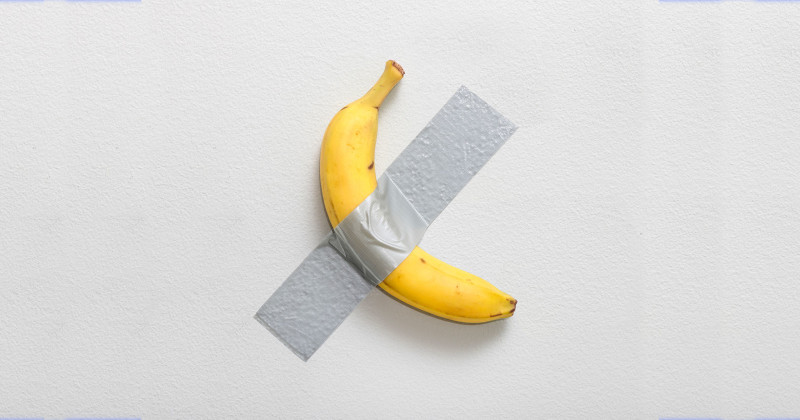

 

## Il grande inganno della diversità

* Published Nov 3, 2024 - origin [LinkedIn](https://it.linkedin.com/pulse/il-grande-inganno-della-diversit%C3%A0-roberto-a-foglietta-hctbf) article

Questo articolo è stato scritto a partire da un post su LinkedIn dello stesso autore nello stesso giorno corroborato da un'analisi del testo offerta dall'intelligenza artificiale.

---

## Sentito dire

> Piangete pure. Se questo vi fa star meglio.

Non voglio supportare il machismo sfrontato ma è vero, l'azione è la risposta definitiva. Ciò non toglie che anche un VERO uomo possa piangere, magari lo farà con lo un certo pudore ma ciò non toglie che poi si dedicherà all'azione.

Forse l'unica cosa buona della cultura woke è che anche gli uomini in alcune situazioni si possano permettere di sembrare deboli e vulnerabili, così come d'altra parte anche le donne possano essere competitive e maschili.

Ma non è appiattimento, è solo un'accettazione ragionevole della VARIETÀ del mondo, della vita e delle situazioni. VARIETÀ, non come il cabaret ma come panta rei.

Ecco un altro inghippo, l'altro grande inganno: confondere la VARIETÀ con la diversità, parola che implica necessariamente l'esistenza di una normalità e quindi di un conflitto con essa. Quando invece siamo tutti diversi, alcuni sotto alcuni aspetti o in certe situazioni, più di altri.

Ma questo della diversità è una questione statistica, che appartiene più alla curiosità della scienza che all'etica o alla morale. Invece la VARIETÀ appartiene interamente alla sfera umana e quindi alla cultura umanista.

<b class="post-it">&#9432;</b>

**Senza varietà saremmo dei cloni, tutti uguali, come la banana.**

 

> La selezione naturale porta al miglioramento della specie.

Non necessariamente miglioramento, ma adattamento. La selezione naturale riguarda all'adattamento della specie NON dell'individuo, altro falso mito, creato da coloro che NON hanno capito la selezione naturale ma la vogliono sfruttare per propagandare i benefici dell'adattabilità degli "inferiori" in senso fantozziano (oh guarda sto parlando come il ministro Giuli, quasi).

Ignorando una grande virtù, la disobbedienza soprattutto alla mediocrità e all'ingiustizia.

Le altre dimensioni che distinguono l'individuo dalla specie, sono di natura statistica. La selezione naturale è indifferente al benessere dell'individuo e infatti agisce "selezionandolo" quindi sopprimendolo. In questo senso, non ha importanza quanti individui muoiano a patto che i rimanenti siano abbastanza per proseguire la specie e in questo vediamo qualcosa di simile al nazismo.

Sicché ci sono dei principi in natura che sono quanto di più "giusto" possa esserci, letteralmente, ma che se vengono usati dall'uomo per forgiare la società ci troviamo di fronte a qualcosa come l'aberrazione del nazismo e l'epica della razza ariana come base genetica del superuomo.

Sono sottili distinguo da STEM (Science, Technology, Engineering and Maths) ma che facilmente portano in grave errore i filosofi.

<b class="post-it">&#9432;</b>

**La varietà implica apprezzare i distinguo, per la diversità basta la normalità.**

 

## Uso dell'AI

Nella versione originale dell'articolo qui c'era la parte che è stata spostata dopo la conversazione con il chatbot. La ragione è banale, risulta inutilmente complicato spiegare cose anticipando gli eventi.

Per procedere oltre basta dire che il chatbot è solo uno strumento tecnologico per quanto esso sembri oscuro e portentoso. Nella pratica è l'essere umano che interagendo con esso lo guida, come fosse un'auto.

Perché risulta utile dialogare con un chatbot? Perché fornisce spunti di riflessione, ci permette di affrontare un'idea da punti di vista diversi, ci aiuta a capire quanto quell'idea possa essere compresa, etc.

Piccolo spoiler, la conversazione riserverà una piccola sorpresa a dimostrazione del fatto che se usato bene anche i chatbot hanno la loro grande utilità ma allo stesso tempo imitano soltanto il pensiero umano.

<b class="post-it">&#9432;</b>

**I chatbot funzionano come un specchio, imitano il nostro pensiero lessicale.**

 

### Prompt #1

Questo testo sembra una *supercazzola tarapia tapioco* oppure è un pensiero profondo?

> La selezione naturale [...] in senso fantozziano.

<b class="post-it">&#9432;</b>

**NOTA** - *in questo contesto il chatbot intende l'espressione idiomatica riguardo alla "*supercazzola*" come sinonimo di scherzo (joke) e/o beffa (prank). Se siete interessati a scoprire l'universo che si cela dietro a questo concetto potete leggere [l'arte della supercazzola](https://github.com/robang74/chatbots-for-fun/blob/main/l-arte-della-supercazzola.md).*

---

### ChatGPT #1

Questo testo ha un'aria seria e profonda, ma l'uso di parole forti e l’accostamento a concetti come "adattabilità degli inferiori in senso fantozziano" gli dà anche un tono ironico o satirico. L'argomento trattato è corretto: la selezione naturale è un processo che riguarda l'adattamento delle popolazioni (o specie) all’ambiente e non il singolo individuo. Ciò avviene attraverso la differenziale sopravvivenza e riproduzione degli individui che sono meglio adattati al contesto.

L'accenno a un "falso mito" può essere un'osservazione valida, perché spesso si semplifica la selezione naturale come un “miglioramento” assoluto, quando invece si tratta di un processo di adattamento relativo. Tuttavia, il modo in cui è espresso dà al testo una vena di provocazione, quasi satirica, che può ricordare appunto la "supercazzola" o una critica fantozziana. È un testo che gioca con l’ambiguità tra riflessione seria e tono ironico.

 

### Prompt #2

Se invece ti propongo l'intero testo, cosa mi dici?

> La selezione naturale porta al miglioramento [...] che da STEM ma che facilmente portano in grave errore i filosofi.

<b class="post-it">&#9432;</b>

**NOTA** - *nel testo originale vi era un "**CHE**" di troppo, un refuso di una correzione precedente, che ha condotto il chatbot in uno stato di leggera confusione riguardo all'interpretazione di quella frase. Una questione che poi verrà affrontata in un prompt successivo.*

---

### ChatGPT #2

Questo testo è una riflessione critica e, allo stesso tempo, provocatoria su come viene interpretata e a volte distorta la teoria della selezione naturale. Mescola alcuni concetti evolutivi reali con opinioni forti e un po' di ironia ("oh guarda sto parlando come il ministro Giuli, quasi"), rendendo il tono volutamente polemico.

Alcuni punti principali:

1. **Adattamento vs. Miglioramento**: Viene chiarito che la selezione naturale riguarda l'adattamento della specie, non un "miglioramento" assoluto, il che è corretto. È un errore comune pensare che la selezione naturale produca esseri "superiori"; invece, essa rende una popolazione più adatta all'ambiente in cui vive.

2. **Adattamento degli "inferiori" e critica alla mediocrità**: L'autore ironizza sull'idea che la selezione naturale possa essere usata per promuovere l'idea dell'“adattabilità degli inferiori in senso fantozziano”. Qui probabilmente si sta criticando chi vede nell'adattabilità una qualità da accettare passivamente, mentre invece viene sottolineata l'importanza della "disobbedienza" contro mediocrità e ingiustizia.

3. **Selezione naturale e benessere individuale**: Giustamente, il testo osserva che la selezione naturale è "indifferente" al benessere dell'individuo, poiché riguarda la sopravvivenza della specie, non del singolo. Questo è un concetto fondamentale in biologia evolutiva, poiché l’individuo può “essere selezionato” (ossia morire) se non contribuisce al vantaggio della specie.

4. **Rischi di applicazione umana della selezione naturale**: L’autore tocca un punto importante e controverso quando menziona il nazismo, che aveva utilizzato una distorta interpretazione della biologia evolutiva per giustificare le sue politiche. Questo rappresenta un avvertimento: concetti naturali, se mal compresi o strumentalizzati, possono portare a interpretazioni pericolose e inumane.

5. **STEM e filosofia**: Con "sottili distinguo che da STEM" (forse una svista o un'espressione volutamente polemica), l'autore sembra alludere a un tipo di conoscenza scientifica che, senza un contesto etico o filosofico, può essere fraintesa o utilizzata impropriamente dai filosofi o pensatori che non la comprendono pienamente.

In sintesi, questo testo si muove tra riflessione seria e provocazione, cercando di mettere in guardia dai rischi di semplificazioni o strumentalizzazioni della selezione naturale. È una critica di chi osserva il mondo scientifico con un occhio acuto ma anche disincantato, consapevole delle ambiguità e dei fraintendimenti che possono sorgere nell'applicare concetti scientifici alla società umana.

 

### Prompt #3

A precedere il testo che hai già analizzato, lo stesso autore ha inserito come premessa connessa la seguente. Cosa ne pensi?

> Il grande inganno della diversità [...] tutti uguali, come la banana.

---

### ChatGPT #3

Questa premessa offre un’interessante riflessione critica sulla distinzione tra “diversità” e “varietà” e si inserisce in un discorso più ampio sulla percezione dell'individualità e delle differenze. L’autore adotta un tono provocatorio e un po' disilluso, puntando a sfidare alcune concezioni sociali e culturali, soprattutto quelle contemporanee legate alla cultura “woke” e al concetto di diversità. Ecco alcuni punti principali:

1. **Diversità vs. Varietà**: L’autore sembra voler risemantizzare il concetto di “diversità”, sostituendolo con quello di “varietà”, un termine che percepisce come più neutro e naturale, meno carico di implicazioni sociali o morali. Secondo lui, “diversità” implicherebbe una “normalità” da cui deviare, creando una possibile opposizione e conflitto. Al contrario, “varietà” indicherebbe una molteplicità di differenze naturali, viste come flusso continuo e inevitabile (“panta rei”), piuttosto che come eccezioni a una presunta norma.

2. **L'azione come risposta e l’evoluzione della mascolinità**: La riflessione sull’azione e sulla vulnerabilità maschile appare come un confronto tra modelli di mascolinità tradizionali e contemporanei. L’autore riconosce la validità del poter mostrare vulnerabilità – un aspetto enfatizzato dalla cultura woke – ma lo lega comunque a una sorta di virilità che rimane intatta anche nella debolezza, un equilibrio tra forza d’azione e sensibilità.

3. **Critica alla cultura woke**: L’autore sembra apprezzare alcuni cambiamenti introdotti dalla cultura woke, come la maggiore accettazione della vulnerabilità negli uomini e della competitività nelle donne, ma è attento a non considerare questi cambiamenti come una perdita di “varietà”. Invece, li vede come un riconoscimento di ciò che già esiste naturalmente nel mondo, e cioè che ognuno ha momenti di forza e vulnerabilità.

4. **Differenza tra scienza ed etica**: Il testo critica l'approccio che cerca di legare concetti come la “diversità” alla morale o all'etica. L’autore percepisce la “diversità” come una questione puramente statistica, “curiosa” dal punto di vista scientifico ma non rilevante per il significato della condizione umana. La “varietà”, invece, appartiene alla cultura umanista, suggerendo che il valore di ogni singola persona e delle sue peculiarità debba essere rispettato in quanto tale, senza incasellarle in categorie sociali.

5. **L'analogia con la banana**: Concludere con l’esempio della banana, un frutto coltivato in cloni geneticamente identici, rappresenta una critica forte all'uniformità culturale e sociale. Se si perde la “varietà” per abbracciare un’idea di uguaglianza che appiattisce tutte le sfumature, si rischia di perdere qualcosa di essenziale e umano.

In sintesi, la premessa solleva dubbi sugli attuali concetti di diversità e uguaglianza, preferendo un’idea più fluida di varietà e accettazione delle differenze naturali, senza confini rigidi o norme fisse. La riflessione è interessante e cerca di bilanciare l’accettazione della vulnerabilità con una valorizzazione delle caratteristiche individuali senza stereotipi né categorie prestabilite.

 

### Prompt #4

Spiegami perché in questa parte della tua precedente risposta hai pensato fosse una svista: 

> STEM e filosofia: Con "sottili distinguo **che** da STEM" (forse una svista o un'espressione volutamente polemica)

---

### ChatGPT #4

Ho interpretato “da STEM” come una possibile svista o espressione polemica perché nel contesto della frase sembra mancare qualcosa che chiarisca meglio il significato. Di solito, “STEM” (acronimo per Science, Technology, Engineering, and Mathematics) si usa per riferirsi a discipline scientifiche, ma qui il testo non ha una costruzione del tutto chiara. 

Ad esempio, la frase “sottili distinguo che da STEM” sembra incompleta o poco chiara grammaticalmente. Avrebbe potuto essere un’espressione come “sottili distinguo che provengono da STEM”, o “che si apprendono in STEM”, ma la mancanza di un verbo rende ambiguo il collegamento tra “STEM” e “filosofia”.

È possibile anche che l’autore stia giocando con le parole per enfatizzare un certo distacco tra l’approccio scientifico (STEM) e quello filosofico, sottolineando un tipo di distinzione o di logica che, secondo l’autore, sfugge ai filosofi.

 

### Prompt #5

Hai ragione, la parola "**che**" è di troppo. Si tratta di un refuso nel testo sopravvissuto ad una precedente revisione di bozza.

---

### ChatGPT #5

Grazie per la precisazione! In effetti, senza quel “che” la frase risulta molto più scorrevole e chiara nel suo intento. Rileggendola, ora è evidente che il testo mira a sottolineare come i "sottili distinguo da STEM" possano portare in errore i filosofi, evidenziando la differenza tra un approccio scientifico e uno filosofico.

 

## Considerazioni

Ovviamente il post con banana artistica (non quella di dimensioni artistiche ma quella dello scotch di Cattelan) e supercazzola tarapia tapioca spiegata da ChatGPT o meglio sarebbe dire: catalogata dall'AI, perché in questo sono brave le intelligenze artificiali, a catalogare patterns. Quindi a discernere supercazzole da pensieri profondi, perché ad un lettore superficiale o frettoloso, le due cose possono sembrare simili.

In questo contesto patterns significa schemi ricorrenti, quindi idee o concetti che sono ricorrenti nella letteratura alla quale l'intelligenza artificiale è stata esposta e sulla quale è stata istruita (training).

Ne consegue che per idee che sono originali oppure molto distanti da quelle ricorrenti - ricorrenti ma non necessariamente corrette infatti una bugia ripetuta all'infinito non diventa una verità - non sono comprensibili all'AI che invece tende a considerarle "sviste", anomalie - statisticamente parlando - che non riesce correttamente ad interpretare nell'ambito degli schemi ricorrenti. Nel testo originale proposto all'AI c'era un refuso, un "**CHE**" di troppo.

Essendo un'anomalia grammaticale, l'intelligenza artificiale l'ha correttamente identificata perché la grammatica italiana è un insieme di regole (patterns). Anche in questo caso, la novità (eccezione alla regola, anomalia rispetto agli schemi ricorrenti) pur nella sua banalità di refuso è stata rilevata ma non compresa nella sua essenza.

Nel comprendere come funzionino le intelligenze artificiali cessiamo di averne paura  oppure cominciare ad averne davvero paura, dipende - ma anche a comprendere come funzioni il linguaggio nella formazione del pensiero e quindi nella sua inevitabile funzione di creare una **DESCRIZIONE** della realtà.

È nella parola "descrizione" che potremmo cominciare davvero ad avere paura delle intelligenze artificiali quando esse sono capaci di smontare, e a farlo senza inibizioni, le nostre illusioni che invece vorremmo fossero realtà piuttosto che articolazioni astratte del nostro pensiero (ideologie).

Se però arrivassimo a comprendere che queste idee preconcette (arbitrarie, relative o addirittura errate) sono per noi una forma di limitazione sia in termini di crescita personale sia in termini di capacità del fare e pensare, probabilmente svilupperemmo un’opinione più positiva e ottimistica rispetto a queste tecnologie.

 

## Articoli correlati

**Intelligenza artificiale, etica e società**

* 247 - Il pensiero e il linguaggio - [[**`PDF`**](../pdf.todo(../pdf.todo/247-Il_pensiero_e_il_linguaggio.pdf?target=_blank)] origin [LinkedIn](https://www.linkedin.com/pulse/il-pensiero-e-linguaggio-roberto-a-foglietta-yyblf) (2024-03-25)

* 241 - A.I. - La tecnologia che fa paura - [[**`PDF`**](../pdf.todo(../pdf.todo/241-AI-La_tecnologia_che_fa_paura.pdf?target=_blank)] origin [LinkedIn](https://www.linkedin.com/pulse/ai-la-tecnologia-che-fa-paura-roberto-a-foglietta-4bgcf) (2024-01-27)

* 235 - L'omogeneizzato non funziona - [[**`PDF`**](../pdf.todo(../pdf.todo/235-L_omogeneizzato_non_funziona.pdf?target=_blank)] origin [LinkedIn](https://www.linkedin.com/pulse/lomogeneizzato-non-funziona-roberto-a-foglietta-cm2ef) (2023-11-27)

* 230 - L'A.I. è l'incubo della politica incapace - [[**`PDF`**](../pdf.todo(../pdf.todo/230-L_AI_è_l_incubo_della_politica_incapace.pdf?target=_blank)] origin [LinkedIn](https://www.linkedin.com/pulse/lai-%25C3%25A8-lincubo-della-politica-incapace-roberto-a-foglietta) (2023-04-01)

* 222 - L'importanza del metodo scientifico - [[**`PDF`**](../pdf.todo(../pdf.todo/222-L_importanza_del_metodo_scientifico.pdf?target=_blank)] origin [LinkedIn](https://www.linkedin.com/pulse/limportanza-del-metodo-scientifico-roberto-a-foglietta) (2022-05-24)

* 211 - La grande mistificazione dell'uguaglianza - [[**`PDF`**](../pdf.todo(../pdf.todo/211-La_grande_mistificazione_dell_uguaglianza.pdf?target=_blank)] origin [LinkedIn](https://www.linkedin.com/pulse/la-grande-mistificazione-delluguaglianza-roberto-a-foglietta) (2019-03-19)

**Intelligenza artificiale, tecnologia e implicazioni**

* 264 - Usare l'AI per questioni complesse - p.2 - [[**`PDF`**](../pdf.todo(../pdf.todo/264-Usare_l_AI_per_questioni_complesse_p2.pdf?target=_blank)] origin [LinkedIn](https://www.linkedin.com/pulse/usare-lai-per-questioni-complesse-p2-roberto-a-foglietta-gqxue) (2024-05-31)

* 260 - Usare l'AI per questioni complesse - p.1 - [[**`PDF`**](../pdf.todo(../pdf.todo/260-Usare_l_AI_per_questioni_complesse.pdf?target=_blank)] origin [LinkedIn](https://www.linkedin.com/pulse/usare-lai-per-questioni-complesse-roberto-a-foglietta-sybyf) (2024-05-17)

* 256 - L'umana natura del diritto d'autore - [[**`PDF`**](../pdf.todo(../pdf.todo/256-L_umana_natura_del_diritto_d_autore.pdf?target=_blank)] origin [LinkedIn](https://www.linkedin.com/pulse/lumana-natura-del-diritto-dautore-roberto-a-foglietta-p62ee) (2024-05-10)

* 237 - Good prompt rules, even better - [[**`PDF`**](../pdf.todo(../pdf.todo/237-Good_prompt_rules_even_better.pdf?target=_blank)] origin [LinkedIn](https://www.linkedin.com/pulse/good-prompt-rules-even-better-roberto-a-foglietta-v1txf) (2024-01-05)

* 234 - LLM con fine-tuning in latino - [[**`PDF`**](../pdf.todo(../pdf.todo/243-LLM_con_fine-tuning_in_latino.pdf?target=_blank)] origin [LinkedIn](https://www.linkedin.com/pulse/llm-con-fine-tuning-latino-roberto-a-foglietta-9x8of) (2024-02-02)

* 229 - Miss Poppins vs Mr. Spock - [[**`PDF`**](../pdf.todo(../pdf.todo/229-Miss_Poppins_vs_Mr_Spock.pdf?target=_blank)] origin [LinkedIn](https://www.linkedin.com/pulse/miss-poppins-vs-mr-spock-roberto-a-foglietta) (2023-03-27)

* 226 - A job interview with ChatGPT v3.5 - [[**`PDF`**](../pdf.todo(../pdf.todo/226-A_job_interview_with_ChatGPT_v35.pdf?target=_blank)] origin [LinkedIn](https://www.linkedin.com/pulse/job-interview-julia-chatgpt-v3-ai-roberto-a-foglietta) (2022-12-07)

* 198 - L'etica della vita nella guida autonoma - [[**`PDF`**](../pdf.todo(../pdf.todo/198-L_etica_della_vita_nella_guida_autonoma.pdf?target=_blank)] origin [LinkedIn](https://www.linkedin.com/pulse/letica-della-vita-nella-guida-autonoma-roberto-a-foglietta) (2018-11-05)

 

## Share alike

&copy; 2024, **Roberto A. Foglietta** &lt;roberto.foglietta@gmail.com&gt;, [CC BY-NC-ND 4.0](https://creativecommons.org/licenses/by-nc-nd/4.0/)

