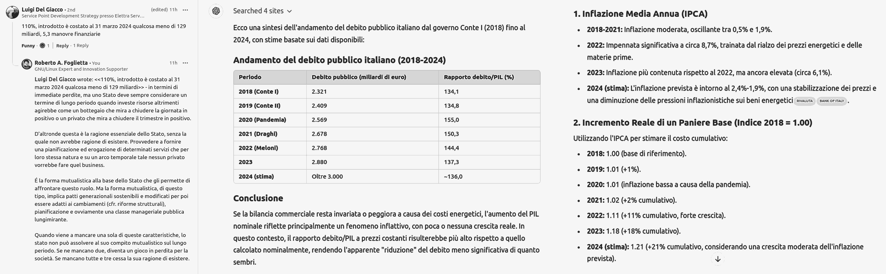

 

## Capire è la chiave di volta

* Published Nov 27, 2024 - origin [LinkedIn](https://www.linkedin.com/pulse/capire-%C3%A8-la-chiave-di-volta-roberto-a-foglietta-kx3ue) article

---

### Premessa

Questo articolo è stato scritto componendo due post con lo stesso titolo ma divisi in due parti qui riproposte in una singola narrazione come era stato concepito questo documento fin da principio ma diviso per motivi "editoriali" di piattaforma.

A loro volta questo articolo nasce alla luce di alcune considerazioni che hanno portato a scrivere un documento con una prospettiva globale e orientato al futuro mentre questo è limitato alla prospettiva italiana e agli ultimi 30 anni, al massimo dal 1980, in poi.

Il paper, che trovate linkato in fondo all'articolo, parla del sogno italiano di diventare la Cina d'Europa, della nostalgia della Lira e come queste due cose sono profondamente interconnesse fra loro ma in modo completamente diverso rispetto alla narrativa mainstream. Che poi è il motivo per la scelta del titolo di questo articolo.

---

### Parte #1

A volte pensiamo che sia l'informazione che ci dà un vantaggio asimmetrico tipo: "*io so e tu non puoi competere con questo*". Ma questa è una beata balla, l'informazione è importante, saperla gestire correttamente è importante, padroneggiare il metodo (scientifico) è fondamentale ma la chiave di volta è sempre "*capire*".

Il termine "*capire*" è un verbo, non un oggetto o un atto. Spesso viene immaginato con la lampadina che si accende **MA** quello è solo un momento particolare del capire e talvolta è pure errato. Perchè magari si accende la lampadina ma abbiamo capito "*un caxxo*". Questa, infatti è la parte più difficile ed è qui che si rivela la fondamentale importanza del metodo scientifico: l'intuizione può anche sbagliare, come la prima impressione.

Il termine "*capire*" è molto simile a "*carpire*" e infatti la sua origine (etimologia) viene dal latino volgare "*capĕre*" che significava "*prendere*". Questo ci spiega perché sia così facile confondere l'intelligenza che "*capisce*" le cose dalla furbizia che "*carpisce*" le cose.

Se io ti prendo un mela, tu rimani senza la mela. Se io condivido con te un'idea, io non perdo nulla. Ma tu non condividi la tua idea con me perché così pensi di aver "*carpito*" qualcosa a me e di avere un vantaggio asimmetrico su di me. Spesso, in realtà, non hai capito "*un caxxo*" e neppure hai capito di non aver capito "*un caxxo*".

In un sistema che funziona sullo spreco è ovvio che la mela la diano a te che la sprechi. Perché se la danno a me, a forza di darmi mele finisco per doverle ridistribuire avendone in eccesso, non in abbondanza, in eccesso ovvero a schifo proprio. Il problema sorge - non sulla produzione o sul consumo delle mele - ma sulla distribuzione delle mele.

Perché chi distribuisce le mele pensa di "*costruire*" la realtà, invece ne costruisce solo una descrizione della realtà. Però quella descrizione è "*importante*" per la natura dei "*valori*" che veicola. Quindi, **SE** è il parroco che ti dà la mela, tu ami Gesù ma Gesù ti schifa perché a te piacciono le tette. Secondo quello che ti dice il parroco di Gesù. Anche se lui di Gesù non ne sa "*un caxxo*" e se ne sa qualcosa non ha capito "*un caxxo*".

Oltre al fatto, poi, che la **DESCRIZIONE** della realtà e i valori che veicolano con la distribuzione delle mele sono strutturati in maniera che rimani comunque povero, drogato di mele, affamato di tette e pure peccatore.

Non mi credi?

---

### Parte #2

Quando vi dicono che è colpa dell'euro, mostrate loro questo grafico (in cima).

1. La gente che non guadagna non spende e se la gente non spende, allora l'economia non gira. Se la gente non può risparmiare allora non può comprare casa e il valore degli immobili cala.

2. Dove il lavoro è mal pagato, i prezzi delle case sono bassi. Quindi diventa un paese di immigrazione perché dove le case costano poco sono accessibili anche agli ultimi arrivati.

3. Se non si può comprare casa, si ha un solo reddito basso e non si può risparmiare, allora non si fanno figli e per tenere in piedi il sistema, strutturato per funzionare con un certo volume, o si devono fare le riforme strutturali oppure si deve incentivare l'immigrazione.

4. Ma l'immigrazione di qualità farebbe a pezzi un paese che ammira la furbizia e coltiva l'ignoranza oltre al fatto che l'immigrato di qualità ha ben altre opzioni. Quindi non arrivano nemmeno quelli regolari perché quelli, già in partenza, hanno una possibilità di scelta.

5. Arrivano barconi di disperati e criminali. Così tu t'incaxxi perché non hai capito un caxxo e li voti perchè è colpa dell'euro se gli immigrati vengono a rubarti la tua mela che a tua volta l'hai presa da quelli che fin dall'inizio di hanno abituato a chiedergli le mele in cambio del permesso di ficcare nella tua testolina la loro m*rda.

Allora ti chiedo, a te che sei furbo, quella mela che pensavi di avermi preso, quanto l'hai pagata in definitiva? Spoiler: tutto. Perchè se la chiave di volta è capire, tu - **sicuramente** - non hai capito "*un caxxo*".

Nella vita ci sono tre tipi di persone:

1. quelli che ti dicono che sei un asino e devi studiare, e tu li odi;

2. quelli che ti dicono che sei un asino e devi studiare ma loro sono disposti ad insegnarti, e tu li odi due volte perché pure presuntuosi sono;

3. quelli che invece ti dicono che tu sei furbo come loro e invece non hai capito "*un caxxo*", ma tu li ami.

Indovina quale di questi tre tipi t'incula di più?

Il quarto tipo: tu che pensi di essere più furbo dei furbi e che quindi ce la puoi fare senza studiare e senza capire "*un caxxo*". Anzi, pure odi chi vorrebbe tu capissi, ma mica per buon cuore, solo perché siamo tutti sulla stessa barca. Infatti, per questo, sei così preoccupato che dalla "*tua*" barca scappino quelli che sanno nuotare.

> L'Italia come la Cina d'Europa: la bufala di Confindustria per abbattere gli stipendi degli Italiani al fine di accantonare il necessario per delocalizzare in paesi in via di sviluppo. John Elkann docet. - [lnkd.in/duPmvPms](https://it.linkedin.com/posts/frank-zu-89285821b_mostrategliela-quando-gente-che-ha-avuto-activity-7267507708969238529-ZTjO)

Poi aggiungiamo pure quanto scritto qui sopra e abbiamo completato il quadro. Si fa per dire. Abbiamo solo cominciato a spiegare il patchwork.

Mal comune mezzo gaudio? Hanno fatto lo stesso con i nostri migliori clienti, in Germania ma con la green-energy. Pensaci tutto il tempo che ti serve, tanto gli interessi si addizionano in modo composto, se capisci a me.

---

### In Germania

Andamento della produzione in Germania dal 1993 al 2024 con trend storico.

 tasto destro per ingrandire in una nuova finestra

Nonostante dopo la pandemia di Covid-19, abbia ripreso il valore precedente, negli ultimi due anni da quando è iniziata la crisi dell'energia a causa della questione Ucraina, ha perso quasi un 1/5 rispetto a quello che era il trend stimato sui dati dei 30 anni prima.

---

### Nostalgia canaglia

Quante volte abbiamo sentito in italia lamentele come questa:

> Ah, quando c'era LEI, la Lira Italiana sempre pronta a svalutare per permetterci di ingigantire il debito pubblico, allora sì che si stava bene e invece l'Euro ci ha rovinato!

Ma cosa succederebbe se l'Euro svalutasse (anche solo limitatamente all'Italia) come era solito fare la Lira Italiana?

La prossima sezione di questo articolo proverà a dare una risposta concreta a questa domanda, però vi avviso in anticipo, tenetevi forte.

 
Screenshot del 2 dicembre 2024 - tasto destro per ingrandire in una nuova finestra

**Luigi Del Giacco** ha scritto in un commento su LinkedIn:

> 110%, introdotto è costato al 31 marzo 2024 qualcosa meno di 129 miliardi.

In termini di immediate perdite, ma uno Stato deve sempre considerare un termine di lungo periodo quando investe risorse altrimenti agirebbe come un bottegaio che mira a chiudere la giornata in positivo o un privato che mira a chiudere il trimestre in positivo.

D'altronde questa è la ragione essenziale dello Stato, senza la quale non avrebbe ragione di esistere. Provvedere a fornire una pianificazione ed erogazione di determinati servizi che per loro stessa natura e su un arco temporale tale nessun privato vorrebbe fare quel business. É la forma mutualistica alla base dello Stato che gli permette di affrontare questo ruolo.

Ma la forma mutualistica, di questo tipo, implica patti generazionali sostenibili e modificati per poi essere adatti ai cambiamenti (cfr. riforme strutturali), pianificazione e ovviamente una classe manageriale pubblica lungimirante.

Quando viene a mancare una sola di queste caratteristiche, lo stato non può assolvere al suo compito mutualistico sul lungo. periodo. Se ne mancano due, diventa un gioco in perdita per la società. Se mancano tutte e tre cessa la sua ragione di esistere.

---

### Andamento Italia

Cominciamo con il fare i c.d. conti della serva - cioé quanto è aumentato il costo della vita ovvero quanto potere d'acquisto abbiamo perso - per i quali mi sono avvalso dell'aiuto di ChatGPT per raccogliere e organizzare i dati.

#### 1. Inflazione Media Annua (IPCA)

- **2018-2021:** Inflazione moderata, oscillante tra 0,5% e 1,9%.

- **2022:** Impennata significativa a circa 8,7%, trainata dal rialzo dei prezzi energetici e delle materie prime.

- **2023:** Inflazione più contenuta rispetto al 2022, ma ancora elevata (circa 6,1%).

- **2024 (stima):** L'inflazione prevista è intorno al 2,4%-1,9%, con una stabilizzazione dei prezzi e una diminuzione delle pressioni inflazionistiche sui beni energetici.

#### 2. Incremento Reale di un Paniere Base (Indice 2018 = 1.00)

Utilizzando l'IPCA per stimare il costo cumulativo:

- **2018:** 1.00 (base di riferimento).

- **2019:** 1.01 (+1%).

- **2020:** 1.01 (inflazione bassa a causa della pandemia).

- **2021:** 1.02 (+2% cumulativo).

- **2022:** 1.11 (+11% cumulativo, forte crescita).

- **2023:** 1.18 (+18% cumulativo).

- **2024 (stima):** 1.21 (+21% cumulativo, considerando una crescita moderata dell'inflazione prevista).

#### 3. Andamento del debito pubblico italiano (2018-2024)

Ecco una sintesi dell'andamento del debito pubblico italiano dal governo Conte I (2018) fino al 2024, con stime basate sui dati disponibili:

| Periodo            | Debito pubblico (miliardi di euro) | Rapporto debito/PIL (%) |
|--------------------|------------------------------------|-------------------------|
| **2018 (Conte I)** | 2.321                              | 134,1                   |
| **2019 (Conte II)**| 2.409                              | 134,8                   |
| **2020 (Pandemia)**| 2.569                              | 155,0                   |
| **2021 (Draghi)**  | 2.678                              | 150,3                   |
| **2022 (Meloni)**  | 2.768                              | 144,4                   |
| **2023**           | 2.880                              | 137,3                   |
| **2024 (stima)**   | Oltre 3.000                        | 136,0 (stima)           |

**Osservazioni**

- **Crescita del debito**: Il debito pubblico è aumentato significativamente durante la pandemia nel 2020, raggiungendo il rapporto debito/PIL più alto mai registrato (155%). Questo è stato causato principalmente da interventi economici emergenziali e da una contrazione del PIL.

- **Riduzione del rapporto debito/PIL**: Dal 2021, grazie alla ripresa economica e alla crescita nominale del PIL, il rapporto debito/PIL è in calo, pur mantenendo valori elevati.

- **Stime per il 2024**: Si prevede che il debito superi i 3.000 miliardi di euro, mentre il rapporto debito/PIL potrebbe rimanere stabile o calare leggermente grazie a una crescita economica moderata.

Questi dati evidenziano la complessità del controllo del debito pubblico italiano, soprattutto in un contesto di alti tassi di interesse che aumentano i costi di servizio del debito. Misure strutturali saranno necessarie per stabilizzare ulteriormente la situazione.

#### 4. Conclusione

Se la bilancia commerciale resta invariata o peggiora a causa dei costi energetici, l'aumento del PIL nominale riflette principalmente un fenomeno inflattivo, con poca o nessuna crescita reale. In questo contesto, il rapporto debito/PIL a prezzi costanti risulterebbe più alto rispetto a quello calcolato nominalmente, rendendo l'apparente "riduzione" del debito meno significativa di quanto sembri.

---

### L'Euro che svalutò

Quando c'era la Lira si stava meglio, perché la Lira inflazionava, quindi perdeva progressivamente valore d'acquisto, quindi era più facile ripagare il debito pubblico, quindi era più facile aumentare il debito pubblico, quindi i partiti potevano distribuire più prebende e alla fine pareva un mondo perfetto quello in cui le chiacchiere distribuivano i soldi e le tasse le pagavano solo gli operai.

Poi entrò nel WTO - l'organizzazione globale del commercio - con il suo marchio CE che significa "China Export" ed praticamente identico al marchio CE che significa "Conformità Europea" a meno di uno spazio in mezzo. Fateci caso, sono diversi per uno spazio in mezzo.

 

Quindi arrivò la pandemia di Covid-19 e il Governo Draghi perché quando la cacca piove dal cielo i nostri politicanti da strapazzo mandano avanti altri per poi tornare in sella appena risplende il sole. Ma con Draghi è anche partito un altro trend, che questi "piccioni" di politicanti non immaginavano nemmeno e non mi sto riferendo alla guerra in Ucraina.

Il riassorbimento del Quantitative Easing: quando si stampano volumi enormi di denaro, questo non va nelle tasche della gente ma crea delle bolle finanziarie che ad un certo punto esplodono come bubboni marci e impestano tutto. Quindi hanno imparato che prima che succeda devono farli assorbire e quando il pus entra in circolo crea infezione, oltre che inflazione.

Qui sotto un palese esempio di infezione (110% bonus edilizi) che poi crea inflazione, insieme a diversi altri fenomeni concomitanti perché poi ogni stato ha il suo bubbone/i da assorbire e tutti insieme quello dell'ideologia green che ha fatto schizzare alle stelle il costo dell'energia, quindi di tutto.

Insomma, per tagliare corto, l'Euro che svaluta come la Lira ha portato via agli italiani almeno un 1/4 del loro valore d'acquisto per sempre. Quindi se avevamo €100 in banca ora ci compriamo €75 e se guadagnavamo €40k/anno ora valgono €30k/anno.

Anche il debito pubblico è salito fino a tre trilioni di euro ma il rapporto debito/PIL è sceso perché ora abbiamo un PIL gonfiato perché per lo stesso carrello della spesa paghiamo €40 invece di €30.

Ma facendo bene i conti, il rapporto fra debito pubblico e PIL a prezzi costanti (maledetti!) è salito ad almeno 168% quando nel 2019 era 135% quindi il debito precedente e quello nuovo, lo stiamo pagando quando facciamo la spesa, carburante e paghiamo le bollette.

Forse qualcuno dirà che sono solo numeri. Non però da un punto di vista della gestione dei conti dello Stato che è un ente mutualistico per sua intrinseca natura e deve necessariamente tenere conto anche del costo dell'occasione perduta (si chiama così in letteratura) ovvero di cosa avrebbe potuto farci in alternativa al bonus edilizio.

* [L'abominevole truffa dei bonus edilizi](https://www.linkedin.com/pulse/labominevole-truffa-dei-bonus-edilizi-roberto-a-foglietta-72r5f) (2024-05-22)

Il risultato immediato è stato che gli italiani hanno perso 1/4 del loro valore d'acquisto ma il costo sociale è stato cancellare "ab-origine" una generazione di nuovi italiani, che equivale a dire: regalare l'Italia agli immigrati. Cosa che per altro facciamo dal 1979, demograficamente parlando. Quindi nulla di nuovo sotto al sole italico.

 

## Agnotology

La parola candidata per diventare l'estrema sintesi della società degli ultimi 30 anni.

> Within the sociology of knowledge, agnotology (formerly agnatology) is the study of deliberate, culturally induced ignorance or doubt, typically to sell a product, influence opinion, or win favour, particularly through the publication of inaccurate or misleading scientific data (disinformation). - [Wikipedia](https://en.wikipedia.org/wiki/Agnotology), 1992

Qualcosa che però non sembra essere così recente ma che va assai indietro nel tempo:

> There is a cult of ignorance in the United States, and there has always been. The strain of anti-intellectualism has been a constant thread winding its way through our political and cultural life, nurtured by the false notion that democracy means that **my ignorance is just as good as your knowledge**. - [Isaac Asimov](https://en.wikipedia.org/wiki/Isaac_Asimov), 1980

 

## Articoli correlati

* [Finanza concetti di base](https://github.com/robang74/roberto-a-foglietta/blob/main/pdf.todo/177-Finanza_concetti_base.pdf) (2018-03-23, PDF)

* [La demografia nel carello della spesa](https://github.com/robang74/roberto-a-foglietta/blob/main/pdf.todo/213-La_demografia_nel_carrello_della_spesa.pdf) (2019-05-01 ,PDF)
 
* [Il debito aggregato è solo make-up](https://github.com/robang74/roberto-a-foglietta/blob/main/pdf.todo/257-Il_debito_aggregato_%C3%A8_solo_make-up.pdf) (2024-05-10, PDF)

* [L'abominevole truffa dei bonus edilizi](https://github.com/robang74/roberto-a-foglietta/blob/main/pdf.todo/263-L_abominevole_truffa_dei_bonus_edilizi.pdf) (2024-05-22, PDF)

* [La favola dell'export italiano](https://github.com/robang74/roberto-a-foglietta/blob/main/pdf.todo/269-La_favola_dell_export_italiano-v1.pdf) (2024-07-02, PDF)

* [Tassare le pensioni? Quali pensioni?](https://github.com/robang74/roberto-a-foglietta/blob/main/pdf.todo/272-Tassare_le_pensioni_Quali_pensioni.pdf) (2024-07-09, PDF)

* [L'importanza dell'economia domestica](https://github.com/robang74/roberto-a-foglietta/blob/main/pdf.todo/225-L_importanza_dell_economia_domestica.pdf) (2024-11-14, PDF)

 

## Share alike

&copy; 2024, **Roberto A. Foglietta** &lt;roberto.foglietta@gmail.com&gt;, [CC BY-NC-ND 4.0](https://creativecommons.org/licenses/by-nc-nd/4.0/)

