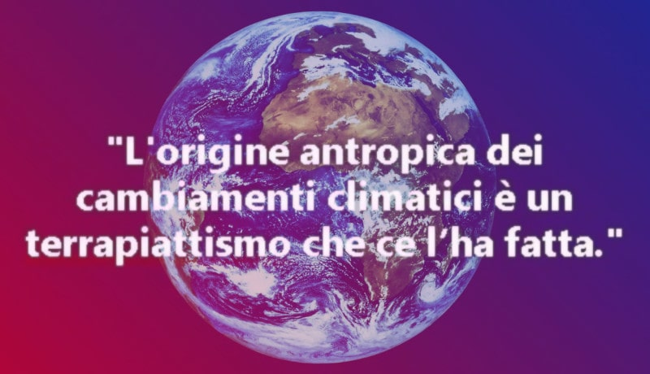

 

## Il cambiamento climatico questo sconosciuto

* Published Dec 14, 2024 - origin [LinkedIn](https://it.linkedin.com/pulse/il-cambiamento-climatico-questo-sconosciuto-roberto-a-foglietta-06ccf) - translate [[**`EN`**](https://raw-githubusercontent-com.translate.goog/robang74/roberto-a-foglietta/refs/heads/main/295-il-cambiamento-climatico-questo-sconosciuto.md?_x_tr_sl=it&_x_tr_tl=en&_x_tr_hl=en-EN&_x_tr_pto=wapp)] [[**`DE`**](https://raw-githubusercontent-com.translate.goog/robang74/roberto-a-foglietta/refs/heads/main/295-il-cambiamento-climatico-questo-sconosciuto.md?_x_tr_sl=it&_x_tr_tl=de&_x_tr_hl=de-DE&_x_tr_pto=wapp)] [[**`FR`**](https://raw-githubusercontent-com.translate.goog/robang74/roberto-a-foglietta/refs/heads/main/295-il-cambiamento-climatico-questo-sconosciuto.md?_x_tr_sl=it&_x_tr_tl=fr&_x_tr_hl=fr-FR&_x_tr_pto=wapp)] [[**`ES`**](https://raw-githubusercontent-com.translate.goog/robang74/roberto-a-foglietta/refs/heads/main/295-il-cambiamento-climatico-questo-sconosciuto.md?_x_tr_sl=it&_x_tr_tl=es&_x_tr_hl=es-ES&_x_tr_pto=wapp)]

Questo articolo è il prodotto di un [post](https://www.linkedin.com/posts/robertofoglietta_il-cambiamento-climatico-questo-sconosciuto-activity-7273048984619794433-gWHW) e dei suoi commenti scritti il giorno prima e qui raccolti con l'obiettivo di renderli pubblicamente disponibili.

Dalla rivoluzione industriale in poi siamo passati da 1 miliardo a 8 miliardi di popolazione, da usare la stufa a legna a bruciare ogni tipo di carburante fossile. Anche la deforestazione è andata di pari passo accelerando in favore delle monoculture. L'idea che l'uomo abbia avuto un impatto sul cambiamento climatico non è una cosa bizzarra ma sensata.

La parte piuttosto discutibile di questa narrativa invece riguarda il riscaldamento climatico inteso come temperatura media globale che francamente è un indice (enon un driver) davvero troppo banale per essere significativo anche se unito alla concentrazione della CO2. Vediamo il perchè.

La media può rimanere stabile anche se metà del pianeta riportasse variazioni di -20°C e l'altra metà del pianeta +20°C. Ci sarebbe uno sconvolgimento del clima ma senza alterare la temperatura media. Il metano ha un effetto serra di 82 volte rispetto alla CO2 che nell'arco di un secolo si riduce a 28 volte. Quindi la CO2 potrebbe rimanere stabile e il pianeta bollire per via del metano.

Non linearità dei cambiamenti climatici. Il permafrost contiene un'enorme quantità di metano imprigionato. Basta che si sciolga e siamo biscottati.

Così, alcuni hanno cominciato a osservare le temperature nelle zone polari invece di curarsi della generica media. Anche perché grazie ai carotaggi si può avere un idea di quale fossero nel passato, anche remoto per via della diversa solubilità dei gas nell'acqua e quindi nel ghiaccio.

Il pianeta ha un suo ciclo di alti e bassi. Coincidenza vuole che noi abbiamo cominciato la rivoluzione industriale su un minimo e quindi l'effetto antropico e quello naturale si sommano e nel sommarsi si mascherano anche.

Quindi il problema è molto più articolato di quello che sembra perché l'alterazione dei cicli del pianeta - anche di una frazione - potrebbe portare a dei cambiamenti drastici a causa della non linearità del sistema.

In particolare la teoria del caos ci assicura che un sistema complesso può saltare piuttosto velocemente da un attrattore (Terra) ad un altro (Venere) quando la sua traiettoria viene modificata in fase (A+a oppure -A-a) anche di poco.

C'è poi un altro effetto che maschera il cambiamento climatico che è quello dell'inerzia e un sistema pianeta ne ha tanta. Però anche questo aspetto non ha transizioni lineari. Fino a -1°C il ghiaccio rimane solido a 0°C comincia a sciogliersi.

Così il permafrost, che rilascia metano che scalda l'atmosfera in particolare localmente proprio dove l'effetto serra può dare il massimo contributo sciogliendo altro permafrost (A+a+a).

Se in questo scenario aggiungiamo che i cambiamenti locali alterano l'equilibrio delle correnti oceaniche in modo non lineare, possiamo immaginare perché alcuni ricercatori pensano che ci stiamo dirigendo verso un disastro.

Aggiungiamo che il green-business è tarato su parametri arbitrari (finestrini) e non sui driver del cambiamento (volante), oplà.Scrive un utente di LinkedIn, [Fabio Fois](https://it.linkedin.com/in/fabio-fois-069bb566) a riguardo ha commentato:

> Zichichi, se non erro, aveva quantificato il contributo antropico al cambiamento climatico in misura non superiore al 5%.
> 
> Nota: secondo Zichichi non superiore al 10%, probabilmente il 5% - dichiarazione verificata dopo la scrittura dell'articolo.

Non ho motivo di contestare la stima di Zichichi e non ho dati o un modello di riferimento pubblicamente disponibile per supportare quella stima. La prendo per buona.

Ricordiamoci però che un 5% può sembrare poco e sicuramente è trascurabile se va in controfase con il trend naturale (raffreddamento naturale + riscaldamento antropico) già meno bene se invece va in fase con quello naturale (riscaldamento naturale + riscaldamento antropico) perché potrebbe portarci fuori dalla zona stabile.

La Siberia è un'area molto vasta in cui il range di temperature minime invernali e massime estive varia da -67 a +25°C quindi diciamo che 5°C sia l'effetto antropico. A -4°C il permafrost rimane stabile a +1°C si scioglie e comincia un processo di fusione autoincrementale.

Il permafrost si scioglie e libera metano, il metano resta in quell'area inizialmente e tende a far alzare la temperatura che velocizza il processo di scioglimento che velocizza il rilascio di metano che...

Quindi il problema NON sono 1.5°C globali ma dove quel 5% va ad innescare processi non lineari che a loro volta possono alterare dinamiche non lineari. Questo spiega perché alcuni sono negazionisti e altri catastrofisti.

Teniamo anche presente però che se è vero che a priori NON lo sappiamo. Per certo sappiamo che CO2 e temperatura media globale sono indici e non driver.

Qual'è la differenza fra un indice e un driver? L'indice è la lancetta del tachimetro, il driver è il pedale dell'acceleratore o del freno. Oltre al fatto che quegli indici non sono necessariamente significativi da soli quindi non sono nemmeno completi.

Quando guidiamo l'auto osserviamo il tachimetro ma anche la strada. Agiamo sui pedali e sul volante. Se però pensiamo di guidare l'auto spostando la lancetta del tachimetro allora siamo pazzi scatenati. Però è questo che stiamo facendo. Da qui le teorie del complotto.Le teorie del complotto nascono dal fatto che la gente percepisce istintivamente che c'è qualcosa di profondamente sbagliato SENZA capire cosa ci sia di sbagliato.

Quindi, dato ciò che non sappiamo e dato ciò che invece sappiamo, sarebbe il caso di agire sui processi di produzione e consumo in maniera che abbiano impatto minimo. Anche perché siamo tanti e forse pure troppi. Questo sarebbe la linea corretta da tenere.

Però visto che la moneta è cartolare allora il sistema si comporta come se avesse risorse infinite. Ma non esiste! WRONG.

 

## Articoli correlati

* Plastica vegetale: scarti vs canapa - origin [LinkedIn](https://www.linkedin.com/pulse/plastica-vegetale-scarti-vs-canapa-roberto-a-foglietta-lbdxf) (2024-08-01)

* The paper money is financial communism - origin [LinkedIn](https://www.linkedin.com/pulse/paper-money-financial-communism-roberto-a-foglietta-3ag5f) (2024-07-31)

* Il futuro non è green ma mixed - origin [LinkedIn](https://www.linkedin.com/pulse/il-futuro-non-%25C3%25A8-green-ma-mixed-roberto-a-foglietta-bw5df) (2024-07-02)

* The BRICS financial system, hope or WW3? - origin [LinkedIn](https://www.linkedin.com/pulse/brics-financial-system-hope-ww3-roberto-a-foglietta-qzptf) (2024-06-07)

* La bolla tecnologica delle EV - origin [LinkedIn](https://www.linkedin.com/pulse/la-bolla-tecnologica-delle-ev-roberto-a-foglietta-lwq3f) (2024-04-09)

* Riciclo di rifiuti pregiati - origin [LinkedIn](https://www.linkedin.com/pulse/riciclo-di-rifiuti-pregiati-roberto-a-foglietta-b9pyf) (2024-01-23)

* Effetti non lineari sul clima e ricadute sulla geopolitica - origin [LinkedIn](https://www.linkedin.com/pulse/effetti-non-lineari-sul-clima-e-ricadute-sulla-roberto-a-foglietta) (2022-11-01)

* A melting planet - origin [LinkedIn](https://www.linkedin.com/pulse/melting-planet-roberto-a-foglietta) (2019-02-26)

* I sette livelli del biscottificio - origin [LinkedIn](https://www.linkedin.com/pulse/i-sette-livelli-del-biscottificio-roberto-a-foglietta) (2019-01-30)

* Un mondo nuovo sta cominciando - origin [LinkedIn](https://www.linkedin.com/pulse/il-mondo-nuovo-sta-cominciando-roberto-a-foglietta)

* Black Swan is not as rare as we might think - origin [LinkedIn](https://www.linkedin.com/pulse/black-swan-rare-we-might-think-roberto-a-foglietta) (2017-11-10)

* Il lato oscuro dell'informazione scientifica - origin [LinkedIn](https://www.linkedin.com/pulse/il-lato-oscuro-dellinformazione-scientifica-roberto-a-foglietta) (2017-11-07)

* Il Quantitative Easing ha fallito - origin [LinkedIn](https://www.linkedin.com/pulse/quatitative-easing-failed-roberto-a-foglietta) (2017-10-28)

* Del controllo e della guida - origin [LinkedIn](https://www.linkedin.com/pulse/del-controllo-e-della-guida-roberto-a-foglietta) (2017-05-25)

* Opinions, data and method - origin [LinkedIn](https://www.linkedin.com/pulse/opinions-data-method-roberto-a-foglietta) (2016-09-03)

 

## Share alike

&copy; 2024, **Roberto A. Foglietta** &lt;roberto.foglietta@gmail.com&gt;, [CC BY-NC-ND 4.0](https://creativecommons.org/licenses/by-nc-nd/4.0/)

