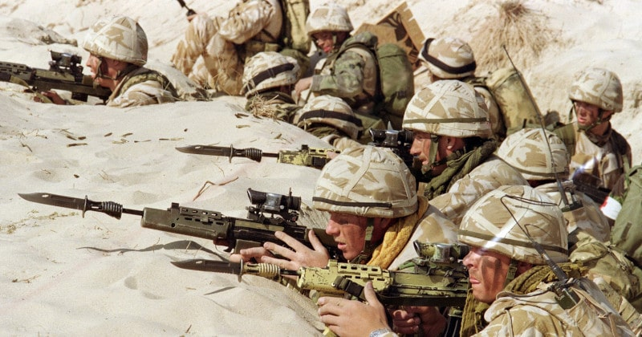

 

## LA MADRE DI TUTTE LE GUERRE

* Published Dec 15, 2024 - source [Facebook](https://www.facebook.com/share/p/1Ews9Z3YEM/)

### Premessa

> **12 Dicembre 2024** - *200mila soldati europei in Ucraina: il "piano Trump" per congelare la guerra tra Mosca e Kiev. La nuova amministrazione Usa freme per congelare il conflitto ucraino. L'unica opzione? Affidarsi a contingenti europei sotto l'insegna delle singole nazioni.*

Ma Trump lo hanno eletto come presidente degli USA oppure c'è un qualche trattato internazionale che non mi ricordo di aver letto per il quale può decidere dove spostare gli eserciti d'Europa?

Chissà come saranno felici quei giovanotti che sventolavano le bandierine dell'Ucraina ora che avranno la possibilità di visitarla come militari in guerra. Divisione bimbomikia 25, all'assalto!

Si però, parità di genere, anche le donne in età da militare dovranno essere arruolate, non si possono tradire gli ideali di democrazia e pluralità proprio in questa fantastica occasione di portare a casa una vittoria contro la Russia che nemmeno i nazisti ce la fecero.

Ah, già. Dobbiamo congelarla finché non abbiamo sviluppato l'arma segreta sgancia pinoli (*). Allora vediamo un attimo: 1. non è più segreta; 2. per allora ci avranno fatto un culo tanto e 3. se graziosamente non ce lo avranno fatto ma atteso con pazienza avranno riempito gli hangar di missili mach 10.

La preparazione è fondamentale, tranne in guerra. In guerra s'improvvisa! (sarcasmo)

#### Nota

* > Si riferisce a un sistema multi-videocamera single-view 360° a 8K 60fps sviluppato per Intel nel 2021 su hardware Intel con specifiche certificabili per l'uso militare che se abbinato ad un'intelligenza artificiale può portare un drone che voli ad alta quota a destinazione anche senza GPS capace di colpire obiettivi con grande precisione. Il fatto che il drone voli ad alta quota, relativamente alle quote di volo dei droni attualmente in uso, permette a questo, unito ad una traccia radar molto lieve, di passare inosservato e la capacità di volare, arrivare e colpire un obiettivo anche in completa assenza di GPS, però volando per l'ultimo tratto sotto l'altitudine dell nubi, rappresenta il superamento dell'attuale maggiore limite alle armi di precisione a medio raggio. Soprattutto considerando che in caso di guerra aperta, il GPS potrebbe essere uno dei sistemi messi globalmente fuori uso insieme a internet satellitare e ai cavi sottomarini.

---

### Del domani non v'è certezza

Noi diamo sempre per scontato che possiamo fare domani quello che avremmo dovuto fare ieri, ma questo abitudine a posporre è controproducente e in alcuni casi sbagliata.

Comunque a questo punto sto valutando l'idea che abbiano ragione Trump e Zelensky, che la democrazia i popoli europei e in particolare gli italiani la debbano vivere in prima persona e non solo farfugliarne.

In quest'ottica la richiesta di Mr. Z di mandare i nostri giovani, maschi e femmine, perché la parità di diritti significa parità di doveri, a combattere per la democrazia sul fronte ucraino contro la Russia, sia corretta.

Partiranno bimbiminkia e torneranno adulti fatti, se torneranno. Ma se non tornano, amen. Perché a noi bastano mille morti per sederci dalla parte dei vincitori e in quest'ottica penso che finirò per essere d'accordo anche con la Meloni.

Sullo stesso principio di prima, bisogna viverlo il fascismo in prima persona e non solo votarlo o sostenerlo con la nostalgia e il braccino alzato.

D'altronde è ormai evidente che sia un'impresa impossibile ragionare con delle teste di caxxo e siamo in troppi su questo pianeta. Quindi in un modo o nell'altro occorre trovare una soluzione anche a questo.

---

### Dove sarebbe la sorpresa?

> **13 dicembre 2025** - *Contro Russia e Cina serve una mentalità di guerra. Prendiamo dalla sanità e dalle pensioni i soldi per le armi. Mark Rutte segretario generale della NATO.*

 

Rido non perché l'idea di Mark Rutte faccia ridere e nemmeno per coloro che si scandalizzano di queste idee ma del fattore "sorpresa". Quale sorpresa?

Se la gente combatte e deruba quella gente che vuole e lavora per la pace, è ovvio che come risultato avrà che vincerà la fazione di coloro che vogliono la guerra.

Forse dovremmo chiederci come mai tutto quanto sia stato ridotto solo a due opzioni ma questa è un'altra questione che non basta un commento per essere affrontata neppure superficialmente.

Comunque, nel momento che ha vinto la fazione della guerra che già alle sue spalle aveva la ricca industria bellica, è ovvio che la guerra poi non basta farla ma occorre anche vincerla. Perché una guerra contro la Russia non è come la guerra del Vietnam o in Afghanistan o in Syria, che basta portare dare fastidio.

Poi visto che in guerra vanno a morire i giovani europei (cfr. link sopra) mi sembra anche equo che nello sforzo bellico vi sia solidarietà sociale quindi è giusto che anche i pensionati partecipino a finanziare la guerra e che i malaticci inabili al lavoro o per combattere al fronte, si lascino indietro.

Quindi, non vi è alcuna sorpresa: war is war.

---

### Pensiero politico bipolare

> **13 dicembre 2025** - *Mercoledì prossimo, a Bruxelles, si terrà un vertice sull’Ucraina a cui parteciperanno il presidente Volodymyr Zelensky, il segretario generale della Nato Mark Rutte, il presidente francese Emmanuel Macron, il cancelliere tedesco Olaf Scholz, la presidente del Consiglio Giorgia Meloni, il premier polacco Donald Tusk, il premier britannico Kier Starmer, la presidente della Commissione europea Ursula von der Leyen, il presidente del Consiglio europeo Antonio Costa.*

Ora facciamo un passo indietro e chiediamoci come mai tutto quanto si è ridotto ad un dibattito bipolare (o forse schizofrenico) fra destra/sinistra, guerra/pace, buoni/cattivi, etc.

Intanto perché negli ultimi 30 anni è stato fatto un immenso lavoro per rincoglionire la gente e questa non è un'opinione ma la conclusione di una prestigiosa università inglese, a cui si stanno aggiungendo contributi di altre università come quella di Lund in Germania.

Quindi dai tempi di Cambridge Analytica, il mondo accademico si è interessato a questo argomento e ovviamente come con il Covid-19, la scienza può essere paralizzata per un certo periodo di tempo ma poi arriva a sgamare gli inghippi.  Perché, per la natura del suo metodo, non guarda in faccia a nessuno ma cerca di comprendere la realtà ed entro certi limiti ci riesce e ci riesce anche bene.

Se le masse sono state rincoglionite allora non sono in grado di apprezzare le sfumatore e quindi la semplificazione bianco/nero è l'unica che può fare numero e in democrazia, i numeri contano, anche se a votare sono degli ebeti e ebeti sono anche i candidati. Perché le persone intelligenti non si adattano ad una propaganda da tifoseria del Bar dello Sport.

In questo panorama già devastante, la destra europea (tranne quella svizzera) si è estremizzata talvolta anche su posizioni che sono obsolescenze del passato, nella migliore delle ipotesi. Mentre la sinistra europea è stata condotta sulla via della follia woke.

L'ecologia, che è una scienza e come tale cerca di fornire delle soluzioni reali, è stata affidata a gente che s'incolla la mano all'asfalto oppure tira salsa sulle opere d'arte. Condiamo il tutto con arcobaleni e unicorni vari, e si finisce a fare la campagna di Russia, again.

 

## Share alike

&copy; 2024, **Roberto A. Foglietta** \<roberto.foglietta@gmail.com\>, [CC BY-NC-ND 4.0](https://creativecommons.org/licenses/by-nc-nd/4.0/)

