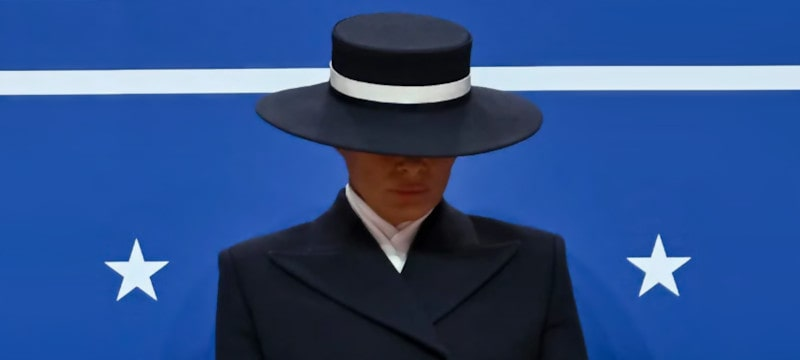

 

## Drill baby, drill & fake news

* Published Jan 23, 2025 - origin [Facebook](https://www.facebook.com/roberto.a.foglietta/posts/10161402722993736)

Questo articolo è stato, inizialmente, scritto come una sequenza di Tweet, di cui ho mantenuto il format, poi esteso con un post su Facebook

---

* In realtà abbiamo avuto notizie prive di fondamento da ormai decenni anche se negli ultimi anni hanno raggiunto un livello di ridicolo raramente visto prima. Secondo la moglie di Trump alla sua inaugurazione e il posto assegnato alla Meloni ha detto molto di più, di tutto [1/N]

* molto di più, di tutto il resto che abbiamo visto perché rinominare il Golfo del Messico in Golfo d'America è solo bait-click politico così come la sceneggiata my <3-2-U di Elon. Invece, il fatto che abbia firmato degli editti già da tempo preparati è tutt'altra cosa [2/N]

* Ora, la questione dei due sessi (biologici) era nell'aria da tempo perché ormai anche in quella direzione si era raggiunto un livello di ridicolo non più sostenibile. L'altro riguarda i rapporti con il Messico che implica la fornitura di Fentanyl dalla Cina quindi Xi [3/N]

* Perché quando si parla di Messico, si parla di Fentanyl e quando si parla di Fentanyl si parla di Cina e quando si parla di Cina si parla di Xi e quando si parla di Xi si parla di Putin. Così arriviamo al resto tipo "drill-baby-drill" perché ROSATOM, lo avete dimenticato? [4/N]

* Perché ROSATOM, quindi l'eventuale stop alle importazioni di combustibile nucleare dalla Russia, metterebbe in ginocchio il fragile sistema energetico degli USA dopo 2 decadi di greenwashing che per confronto la Germania sta 'na bellezza! Quindi petrolio a go-go, [5/N]

* Quindi petrolio a go-go, uscita dagli accordi di Parigi sulla tassazione della CO2 e ovviamente anche uscita dallo WHO perché quella è il braccio politico delle big-pharma e se vuoi fare il braccio di ferro con il Messico devi forzare le big-pharma a fare da spacciatori [6/N]

* Sicché, come si vede, lo show è una cosa, la pratica della realtà ben altra. Uguale per il Mar Rosso, dove o si sta con Israele e quindi Houthi terroristi oppure Israele ti affonda la flotta che gli Houthi spostatevi bimbi. Perché dal Mar Rosso non si passa senza Israele. [7/N]

* Ora, che gli Houthi siano stati bollati come terroristi, non ci stupisce, tendenzialmente è un luogo comune quello degli USA di considerare terroristi chiunque non sia d'accordo con la loro politica estera, salvo buscarle in guerra, s'intende allora, scappano (Afghanistan) [8/N]

* Quindi arriviamo alla relazione con la Russia che attualmente è stata messa benino come economia di guerra mentre l'Ucraina è ormai una voragine mangia miliardi. Ma il punto è un altro: in Europa, la posizione pro Zelensky è ancora un fatto non trascurabile così dazi anche [9/N]

* così dazi anche per l'Europa, perché non ha alcun senso promettere a Putin qualcosa per poi trovarsi tutto l'entourage politico europeo portato alla ribalta dalla presidenza di Obama in poi. Sarebbe alquanto sciocco dimenticare le origini del problema, no? Ergo dazi UE [10/N]

* Se poi mettiamo in prospettiva i dazi alla UE, con quelli relativi alla Cina - che probabilmente non intende togliere ma vuole la loro produzione di Fentanyl - l'alternativa è tassare anche la UE così sull'import in USA la Cina e la UE sono pari in dazi. Capito, che ganzo? ;-)

---

Giusto per fare un confronto: ci sono voluti 11 per spiegare la politica di Trump a 3 giorni dal suo insediamento. Sotto questo punto di vista è incredibile il volume ENORME di news, articoli e opinioni, quando poi - in fondo, in fondo - basta un po' di buon senso e capacità di comprendere come fare i propri interessi per capire la politica (anche estera) di Trump e in generale degli USA.

Se non fossimo stati portati alla confusione più completa, ci riusciremo tutti quanti (almeno con una triennale) a comprenderla, perché ricordiamoci - come palesemente detto durante l'insediamento di Trump - gli USA hanno una storia e una cultura "democratica" di 250 anni, noi 10 volte tanto, i cinesi 20 volte tanto.

Forse però, la cosa più eclatante che è stata detta durante l'insediamento di Trump è la combinazione della citazione - esplicitamente riferita alla banconota da $1 - in God We Trust (e quindi tutto lo show relativo) insieme all'affermazione che gli USA sono il più grande esperimento della civiltà occidentale, e in tal caso andando a ricordarsi della questione del Fugio cent, quello dei padri fondatori, in pratica un esperimento della massoneria Europea che evidentemente vedeva nell'Europa una giardino troppo affolato dove "espandersi".

Curioso perché i padri fondatori americani hanno fatto una guerra d'indipendenza (due se ci mettiamo quella di secessione) per liberarsi dell'influenza degli inglesi (e della corona inglese, che imponeva tasse fra il 2% e il 4% sui commerci) per poi trovarsi a svilupparsi come un esperimento massonico in cui - praticamente - il servizio sanitario nazionale distribuisce oppiacei sintetici invece di cure e le cure, così come l'istruzione superiore, sono solo per coloro che hanno denaro.

Denaro che però è disconnesso da qualsiasi forma di realtà - come per altro il prezzo dell'energia elettrica in Europa - ma è solo carta moneta stampata a debito.

Eh già, una bella botta di cruda realtà! 😏

 

## Share alike

&copy; 2025, **Roberto A. Foglietta** &lt;roberto.foglietta@gmail.com&gt;, [CC BY-NC-ND 4.0](https://creativecommons.org/licenses/by-nc-nd/4.0/)

