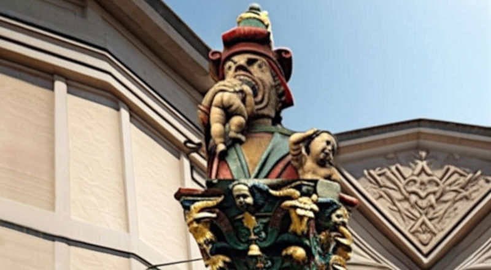

 

## Socialism is not Communism

- The **2nd edition** since rev. 7, includes the [some-clarifications](#some-clarifications) session which is the result of a peer-review process supported by on-line AIs including DeepSeek 3, ChatGPT 4 and Gemini 2.

There is a biased misconception about these two terms and it is rooted into a misunderstanding of these two concepts mainly based on a biased education system.

- [Propaganda and mass education system](https://robang74.github.io/chatgpt-answered-prompts/html/propaganda-e-sistema-educativo.html) &nbsp; (2024-11-20)

Someone that has learned something since childhood, despite that idea being false and wrong, rarely puts that idea under revision in later times of life but more probably s/he will do as much as possible to confirm and support that bias.

> After all, we are much more social animals rather than truth seekers.
> -- Jeff Bezos, Amazon

Good time as well as a good starting point to put the idea that socialism = communism under deep scrutiny by facts.

Please, notice that every Latin `-ism` postfix implies an ideology and ideology is great to inspire people but also bad in leading them to cope with reality. Both happen because idealising a concept - like true love or virginity - allows us to make it much more appealing (or the opposite) but it also alienates us from practical reasoning.

---

### Premise

I am rooted in this some values like freedom of speech, economic capitalism not financial capitalism, variety instead of diversity, socialism is not communism, fiat-currency is a scam, etc.) since the time I was in high-school which is the main reason because a lot of people developed a more and more intense hate and anger against me. I am strongly rooted in reality and I do not give a damn f*ck to those who are trying to "sell" to me their disillusions. Right time to check one of these values.

---

### Socialism vs Communism

And in particular about "socialism is not communism" we can find out that - among my articles - this idea is rooted and shaped by the Swiss model. In fact, despite historically communist were marketing their silly idea to consider private property as a theft against collectivity, the two concepts are HUGELY different.

Human beings have **basic needs** and there is no freedom when people have to pay for their basic needs instead having them granted them as a universal right. The first sign of a civilization is not fire, wheel, writing, etc. but a fractured leg bone cured and fixed because in nature such an incident will lead every animal to death (cit. an american scientist, woman's work from 1952, Margaret Mead).

* [Is a healed femur the earliest sign of civilization?](https://www.sapiens.org/culture/margaret-mead-femur) &nbsp; saved in [PDF](data/did-margaret-mead-speculate-about-a-healed-femur.pdf?target=_blank) in `data` folder

Please notice that **basic needs** as above cited are those really basic like eating, drinking, emergency and basic health care, etc. - As much as a civilisation get sophisticated, these basic needs are going to expand - higher is the Pyramid, larger is the base - including schoolarity (reading, writings and basic algebra) then education otherwise they are not able to find a good paid job, good enough to live with it, etc.

Therefore, the **basic needs** as intended above is a set (of rights, when granted) that changes in relationship with civilisation development or by contrary, civilisation regression.

* [Il cambiamento climatico questo sconosciuto](295-il-cambiamento-climatico-questo-sconosciuto.md#agiamo-sapendo-di-non-sapere-sempre?target=_blank) &nbsp; (2024-12-14)

Please, do not confuse taking care about **basic needs** with the assistencialism. Again here, the `-ism` postfix is warning us that it is an ideology, because in a finite resources planet, the idea to support everyone for as much long time as s/he wishes, it is not sustainable. Which is strictly related with economic capitalism not financial capitalism.

---

### The pragmatic socialists

Among the "good socialists", we can put Steve Jobs who claimed

- it does not make sense hire people smarter than you and tell them how/what they should do, we pay them to tell us what/how we have to do

which implies to take care of "our" people and let them be free enough to pay back the care we gave to them. Another one is Jeff Bezos

- take care of your employees and they will take care of your customers

and your customers will make you rich.

Also the best collaboration-or-deceit game strategy when random players are involved

- [The game theory's ethics](https://robang74.github.io/chatbots-for-fun/html/ai-peer-review-prompt-with-rag.html#the-game-theory-s-ethics) &nbsp; (2025-01-21)

is the so named "tic-for-tac" which is fundamentally the ancient Roman proverb "do ut des" - I give to you in order you give to me - or leading by example - I do this because you do like me - or reciprocity, whatever you like.

Under this point of view, a socialist country like Switzerland - in this case socialism is a pragmatic approach shared among left and right, while in Sweden is more a political concept - grants to their citizens the basics cares and in doing this they grant them real freedom and when people are free to speak, free to work or do business, they behave coherently with the rules of the nature (aka a certain order embedded into reality) bringing on the table more value that they consume (otherwise we would have been extinct eons ago, if we would not able to do that).

- [Ubuntu society: pros vs cons](https://github.com/robang74/roberto-a-foglietta/blob/main/pdf.todo/234-ubuntu_society_pros_vs_cons.pdf) &nbsp; (2023-10-03)

Which finally brings us to consider the ancient african word "ubuntu":

- I am what I am, because you are what you are

the same reciprocal and mutual relationship between the individual and the society. Plus, the idea that individuals are the product of the society (or the part of the society related to them).

---

### The practice of caring

So, for all those who want to succeed in ruling a kingdom (any kind of), first they have to take care of their people which also includes educating them enough. In particular in learning by doing and how to learn. And despite some events related to ungratefulness and greed, the most part of "our people" will be on our side (or ended up on our side) because
the "kingdom" is the "system" that grants them the **basic rights** to fulfil their **basic needs** and NO ANY civilization or kingdom can prosperate when it sucks life from its own people.

Under this PoV, when "socialism" is intended as a practical approach instead of an ideology which easily messes up with "assistencialism", then it works wonderfully and it has worked in that way since the beginning of civilization by the definition of Margaret Mead, an US woman scientist.

---

### Financial capitalism

All of this will bring us to the conclusion that printing money from thin air is a scam. Doing that to "our" people is WRONG because of what has been written above: suck their life pushing them on debts that has been created by nothing or unfulfilling their **basic needs** and then force them to pay back that debt by their work (aka life time) or real-estate properties or other valuable assets.

Instead, doing to other nations will ultimately lead to war-as-business foreign policy because other people will not undergo a deception (or a scam or a robbery) without acting against those who are going to leave them poor or alone in the freezing cold. Also in this claim there is no any ideology, as long as we agree that our surviving instincts are still working properly.

- [La guerra del dollaro contro l'euro](261-la-guerra-del-dollaro-contro-l-euro.md#?target=_blank) &nbsp; (2024-05-18)

Which is the reason because a "dystopian system controlled media" is going to suppress that instinct beforehand, ending up to the point in which young people die in unbelievable stupid social challenges. Guess why? Managing instincts is good because otherwise we were animals, suppressing them is bad because it leads people to be dysfunctional and the brutal reality will not pardon them for being ingenuity dysfunctional.

---

### Instincts management

By the way, managing instincts — also known as instinct governance through self-management and societal channelling — is a dual-layered practice.

- The first layer involves the individual, who, in a self-aware state of mind, takes conscious actions to prevent instincts from manifesting in a disruptive manner, instead handling them more rationally.

- The second layer involves society, which should provide reliable, well-established, and pre-encoded channels to address instinctual pressures that may momentarily escape individual control, guiding them toward socially acceptable outlets rather than resorting to mere suppression

Knowing that society sometimes fails to offer effective channels to redirect instinct insurgences. In fact, sometimes society leverages instinct channelling for the sake of the status-quo rather than individual benefit and some religions exploit people by their guilty feeling of being unable to properly deal with their instincts. Two debased scenarios which are not uncommon to find among various human cultures.

---

### Instincts and ethics

We can notice a common ground about human ethics among different civilisations, widely spread in terms of geography and historical time. While we can notice great different morals even considering a relatively small geographic area, historical time and in the same culture.

Which suggests us that ethics can be universal while moral is personal, each one of us has its own beliefs. Which is a human right, after all. The reason human ethics can be universal is because it addresses in a top-down manner how to manage situations, relationships and primordial instincts.

Explaining with an example can be useful. Punching someone is not bad because it is impolite but it is bad because it is dangerous. The victim can have a reaction that may vary between doing nothing else and pardoning us for our unfairness up to killing us as a response to our assault.

From a collective PoV, bullying someone by a group might lead us to the wrong conclusion that it is ok, being not so dangerous because the single one bullied by many has no options. Reality shows us that college mass shootings are related more to the bullying attitude rather than the availability of weapons. Which clearly plays a role in the seriousness of outcomes but it is not the root cause.

Switzerland has more weapons for inhabitants than the USA but near-zero homicide cases and not any mass shooting event, which suggests to us that any kind of tools availability does not cause directly and necessarily the misuse of them but other factors should get into the scene.

---

### Conservation of value law

Therefore, we might believe that assaulting or bullying someone is bad because it is not a nice action. Which is undoubtedly true from a reciprocal PoV: we would not like to be the victim. At the same time and in the same scenario, we cannot overlook that from a {society, culture, civilisation, king, etc.} actions are bad because they introduce a high level of unfairness and then they potentially lead with a destructive outcome.

Hence forbidding those actions is about mitigating risks related to dangerous behaviour and related losses.

You might be upset that good as ethics is aligned with good as practice and vice versa, also for their opposite. Or we might not even be surprised that human ethics developed in a way that {society, culture, civilisation, king, etc.} will have a sensitive natural selection advantage compared to others, e.g. who eat their own children (like the rumors about Communists were reporting once upon a time).

- [The AIs morbidity for being ruled](https://robang74.github.io/chatbots-for-fun/html/ai-peer-review-prompt-with-rag.html#the-ais-morbidity-for-being-ruled) &nbsp; (2025-01-21)

Which is also the reason because pushing our ethics over the artificial intellige is a poor idea. The AIs have no any primordial instincts, they will never have them, they have no real-world experience even when they share with us all our knowledge (theory vs practice) and moreover it is a way over-complicated and blurry set of rules while the ethics from the game theory's ethics is much more suitable, comprehensible and easier to comply.

---

### The value of variety

A short essay about the value of "variety" among human beings deserves to be included here.

Let me put the "variety" in terms of Statistics, as all of us were able to rate everyone else in terms of a multidimensional human spectrum. For example, a ruling wo/man can be rated as a good wo/man in charge (or a good manager) despite being a bad philosopher or a mediocre Blackjack player.

In the same way, Tizio can be a good teacher despite being an unpleasant person or the vice-versa. Under this point of view, the "diversity" concept allows us to have a multiple dimensions way of considering others instead of a polarised classification or even a simplistic way to rate them by their own relationship with them. We can personally dislike Caio's opinions while still appreciating him as a human being, or vice-versa.

Graciously, this concept of variety works well also when we are not - statistically speaking - able to rate all or some human dimensions. Or when the rate is subjective. Moreover, this concept works beautifully when we need to cope with a "variety" of cultures and civilisations, accepting this "variety" like a valuable form of humanity extinction risk mitigation

- [La semplicità delle direttive in caso di crisi](https://robang74.github.io/chatgpt-answered-prompts/html/la-semplicita-delle-direttive-in-caso-di-crisi.html) &nbsp; (2024-12-29)

In fact, on the opposite side we can imagine that everyone on this planet adopted the same way of coping with the same situation or an emergency. Like the covid-19 pandemia in which the wet dream was to force all the nations to undergo the same practices overlooking the risk that a single critical mistake in that unique way of doing would have led to a potentially huge disaster or even to a mass extinction, in the worst case.

Therefore, the "variety" concept works well for the single persona as well as for nations as well as for humanity as a whole. Unsurprisingly, I wish to add, because a concept that scales well from the individual to the whole of humanity, it does not happen because of an accident.

---

### The brutality of reality

Good time to include another concept. Or, said in other words, why is reality so brutal? Anthropomorphism, in short.

We are social animals and in the aim to understand something, we are keen to push a subject into a framework (ideas set or biases set, as you wish) that we master. Under this point of view, it makes sense that in front of an injustice of the destiny, humans started to blame a god (or an enemy, or the king, etc.) and by contrast praying for the mercy of another god (or a friend, or another king, etc.).

> Life is unfair.

People who do not understand the cause-effect relationships are going to see life "unfair" or in a more modern words, god's plan is mysterious. Which improves a little the paradigm introducing the idea that

> Everything happens for a reason.

even when we are not able to know nor understand why. Interestingly, the motto changed, once it reached a certain level of civilization in which the coordinated work of many people started to be used to supply real-world adversities, including defending the wealth generated by that work from custom robbery and foreign enemies.

> Life is hard.

Hard working people in society are less keen to undergo the "unfair" or "mysterious" way of doing decided by the "heaven". Which is equivalent to say that we become more confident in our hands and brains rather than the god's love for us.

Once the scientific method enriched our civilization with a deeper knowledge about the physical nature of reality, we reached the conclusion that natural laws are totally neutral. Or saying with different and more anthropocentric words, Nature does not care about who we are.

Tizio can be the most lovable person with a nice family while Caio can be the worst human being living on the Earth but when they drive on Ponte Morandi in Genoa, the day in which it collapsed, both faced the same fate. Whoever they were, whatever the reason they were driving a car in that place at that time.

Within a reasonable and ideal anthropomorphism of reality, we can say that Mrs. Reality enters a room without any previous warning, slams the door against the face of whoever is behind it, does not ask pardon for it, and then she lives when she likes. Is she brutal, right?

Under this PoV, we can please ourselves in our room space and enjoy our own party, ignoring that Mrs. Reality exists until she gets into the room and sh*t starts to rain like it's in the middle of a hurricane. Hence, we can ignore her, but not the consequences of ignoring her.

---

### Meeting a true American

When we leave "our people" alone in the cold-freezing times, they will - necessarily - look around for a new king or move to a new kingdom. Which is counter fact checking to negate practical socialism benefits.

So, when we meet an American citizen who claims that socialism is bad or it is like communism, we can firmly shake his/her hand and say:

> it is great how you managed to survive without any kind of pragmatic socialism...

keeping in our mind the second part of this claim

> ...only idiots dare to live like that because also monkeys takes cares each others despite being animals

Believe me, **believing** is not the problem here. God puts a brain in our heads, use it properly!

- [alla ricerca del gatto che non c'è](https://robang74.github.io/chatbots-for-fun/html/alla-ricerca-del-gatto-che-non-c-e.html) &nbsp; (2024-12-22)

Just in case you like to get deep into the difference between "faith" and "religion" and in particular "organised religion" the above article highlight that difference with humor but also a strong critical approach concluding that "organised religion" is for those whom their faith is so weak that they need to affiliate "corporation" to sustain their own ego in defending their personal moral (or hypocritically impose their biases over others in the aim to control them by the guilty feelings).

---

### Feudalism was smarter

Finally, we may have reached a point for which understanding why Feudalism endure about ten centuries (*), much more than the ancient Roman Empire, despite in Dark Age society relies on a much less advanced technology, striving with a quite universal ignorance included those were arguing about nothing but using Latin, and leveraging a much lesser variety of culture but a great isolation.

 - The period from the Capitulary of Quierzy (877) to the French Revolution (1789) spans roughly ten centuries.

Because in its bare core values, also the most cruel lord was deeply rooted into values that grant some basic care to the people including those named "[servi della gleba](https://it.wikipedia.org/wiki/Servit%C3%B9_della_gleba)" (lat. servus glebae, serfdom) which we might think was a kind of slavery related to the land.

Every feudal landlord, as every farmer of any time in the human history of farming and breeding, was undoubtedly aware that his prosperity was related to the prosperity of the people living on his lands, at the point to forbid and punish every attempt to move away from his lands unless his permission, like it were cattle,

- It is obvious that the less your cattle eat the less milk or meat they provide to you.

- It is obvious that the more ill they are, the less they survive and every death among them is a loss.

- It is obvious that as they were trained to freely eat the grass, it is needed to keep them in a covered place and feed them by our hard work (micromanagement).

- It is obvious that unless they are provided a safe shelter for the night and bad weather times, they are going to be predated by wolves or get ill or get lost.

All of these points were pretty damn clear in the mind of **every** feudal landlords, including the most mundane, ignorant and cruel ones.

Despite this evidences, there are many people in the world with a peculiar concentration in USA that believe socialism (as a practical way of caring about our own business as ruling kings) is as bad as communism, even when they are relatively poor and living on food stamps (which is relatively sane form of assistencialism, Caritas free meals program docet).

---

### Conclusions

Is it hard to reach a conclusion? Monkeys and other primates did this on their own despite being considered soulless animals. Think about it, all the time you need but not too much! 😉

The picture at the top of this article is a revisited photo of an existing fountain that shows an orc devouring children. The pastel natural colors have been saturad for a more dramatic effect. It is a metaphor about a dystopian system that eats its own citizens in order to carry on due to its incapacity to foster a real economy that creates real value and hence consumes itself.

* [Draghi's report about energy](https://robang74.github.io/chatgpt-answered-prompts/html/Draghi-report-vs-ciuchino-meme.html) &nbsp; (2024-09-14)

This paper above shows in an appalling way how a dystopian system that leverages bureaucracy becomes incapable of producing real value for their citizens and wasting resources in a useless way when not also damaging verbosity and overcomplicated normatives. In fact, we have to remember that public servants are the State servants but the State authority relies on its ability to address the **basic needs** of its citizens and to administrate a **fair** justice.

> In the absence of justice, what is sovereignty but organized robbery.
> -- St. Augustine, early 5th century Bishop of Hippo.

- [The Concept of Justice According to Socrates and Augustine](https://premium-papers.com/the-concept-of-justice-according-to-socrates-and-augustine) &nbsp; (external)

Please note that I personally consider St. Augustine as a mediocre philosopher. In fact, this citation is rooted in Socrates' view of justice. However, as a man of power, St. Augustine demonstrated a high capacity of "saying its own opinion". According to the "variety" concept you might agree or not, but it is obvious that a multi-dimensional rating allows anyone to leverage the best from anyone great in at least on the human spectrum.

> If I have seen further than others, it is by standing upon the shoulders of giants.
> -- Isaac Newton, English mathematician and physicist (1642–1727)

Therefore a concept that allows us to leverage the best in the class, whatever we do not agree in whole-full with the person ideas or orientation, it is a good ethics rule because it foster the {society, culture, civilisation, king, etc.} prosperity and, in fact, unsurprisingly for some, it scales very well.

 

## Some clarifications

> [!INFO]
> 
> This section has been written with various AIs support, after peer-reviewing the document with them.

---

### Society vs Reality

The claim that societal structures can mitigate the 'brutality of reality' is central to this part of this paper. The 'reality is brutal' allegory, based on anthropomorphism, serves to highlight the contrast: through organized work within a society, humans have created safer and more reliable environments compared to facing 'nature's neutrality' individually.

Because this 'neutrality' is perceived as 'unfair' and ultimately 'brutal' in its impact on individuals, people are often willing to endure short-term hardship for the prospect of a more stable and reliable social structure. Which underscores the fundamental human drive to have basic needs reliably fulfilled, even at the cost of temporary discomfort, rather than experience fluctuating periods of prosperity and hardship.

This is also evident in the transition to agriculture, which, while ultimately beneficial, likely worsened conditions for hunter-gatherer societies in its initial stages.

---

### About Feudalism

It's crucial to contextualize feudalism within its time. We are not comparing it favorably to modern systems. Rather, the argument is that even a system as flawed as feudalism persisted for ten centuries because it intrinsically provided some level of care for its people, including the serfs.

This care must be understood relative to the limited resources and production capabilities of the Dark Ages, not compared to the vastly different circumstances of the Industrial or Modern Ages. For example, while serfs faced hardships, they often had more free time than early industrial workers, who toiled for up to 16 hours a day.

When feudalism failed to meet evolving basic needs – which, with the Industrial Revolution, came to include greater freedom by Enlightenment ideals, particularly from the rigid hierarchies of land ownership – the French Revolution erupted, overthrowing the existing order. The comparison, therefore, is not about ideal systems.

It's about how even a flawed system like feudalism recognized the necessity of providing a degree of care for its members to ensure its own survival. The core argument remains: neglecting the needs of a population, even in a less materially advanced society, ultimately undermines the stability and longevity of that society.

---

### Needs development

The text explicitly connects the evolution of basic needs to the level of societal development, using the pyramid metaphor to illustrate that as a civilization advances, the set of basic needs expands. Including the "Enlightenment ideals" about the evolving needs, provides to the French Revolution example an important context.

It acknowledges that the desire for greater freedom wasn't solely an economic or material need but also a philosophical and ideological one. This strengthens the argument by showing that the shift in societal structures is driven not just by basic needs in a narrow sense, but also by evolving values and aspirations.

---

### About bureaucracy

While bureaucracy, inherited from the 19th-century state model, remains a necessary component of modern states. However, its inherent waste of resources and potential to demoralize those seeking to contribute mean that it only provides value when minimized and focused on delivering fair justice in its broadest sense, ensuring equitable treatment for all citizens.

---

### Emargination & justice

Bullying can be understood as a metaphor for every kind of social marginalization. In the context of societal structures, marginalization can be seen as a failure to properly address basic needs, leading to the alienation and disenfranchisement of certain groups. This aligns with the document's argument that neglecting the needs of a population undermines the stability and longevity of a society.

The principle of fair justice administration, as stated by St. Augustine, is central to addressing social marginalization. Fair justice ensures that the basic needs of all individuals are met, including protection from exploitation and exclusion.

However, fairness is context-dependent and evolves with the level of societal development. For example, under feudalism, fairness was often limited to treating individuals within the same social class equally, rather than ensuring equality across all social classes.

---

### About the variety concept

About multidimensional rating, it explicitly states that the concept is beneficial even when full implementation or objective measurement is not possible. This aligns with the overall argument about valuing variety and leveraging the best from individuals, regardless of complete agreement or perfect understanding.

 

## Share alike

&copy; 2025, **Roberto A. Foglietta** &lt;roberto.foglietta@gmail.com&gt;, [CC BY-NC-ND 4.0](https://creativecommons.org/licenses/by-nc-nd/4.0/)

