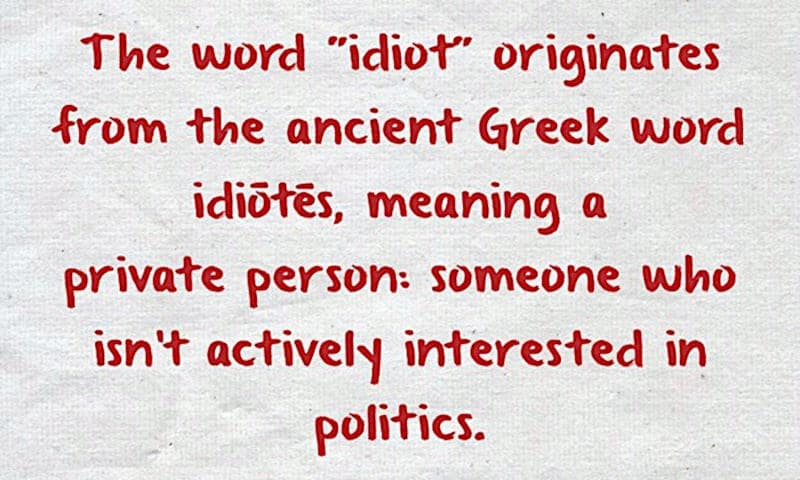

 

## Politics and democracy for dummies

- Initially published on the same day in Facebook and LinkedIn.

Seeing the picuture above as a meme shared over Facebook, I have decided that it is the good time to explain HOW etymology works. So let start this trip!

---

### Idiots in politics

> The word "**idiot**" originates from the ancient Greek word **idiōtēs**, meaning a private person: someone who isn't actively interested in politics.

That's the etymological meaning of the word "idiot" or the original meaning of the word, at the time of ancient Greek. At such a time, Machiavelli did not write yet his "Il Principe" and hence politics - in modern terms - was not even being known.

In order to understand the etymological meaning of the word "idiot" word, we have to associate it with the meaning of the other words associated at THAT time. In primis, "politics".

- Politics: late Middle English: from Old French politique ‘political’, via Latin from Greek politikos, from politēs ‘citizen’, from polis ‘city’.

---

### What was about, politics?

So "politics" ancient Greek words came from "polis" another ancient Greek word meaning - not just the city in terms of buildings or geographical area - but the concept of the city, with is "agora" another ancient greek terms which can be translated in "square" but for them had a completely different meaning like "polis".

Another ancient Greek word related to "politics" is democracy which comes from "demos" (people) and "kratos" (power). Well, at that time "people" was not meaning ALL the people. Women were not universally considered "people", slaves were common, even among "free" people (not slaves) not all of them had the "citizenship" then they were not considered part of the "demos".

For example, in the [Starship Troopers](https://en.wikipedia.org/wiki/Starship_Troopers_(film) film, male and female should have served the military for at least 12 moths, before earning citizenship. Among Spartans it was a strict rule or gave a birth for the female. In Athens, there were many other means to earn it, like art, philosophy, "science" which was not modern science as we intended today after Galileo Galileo.

On the contrary, the hand-working was considered "inadequate" for citizens unless art and sophisticated mechanisms (engineering before engineering was) were involved in.

---

### Polis and democracy

Polis was meaning "civitas" - vivere comune civile, society - compared to those who were living outside in the wild by their own means. In the "agora" placed at the center of "polis" where "common people" were doing markets trading (for money or future payments in front a future agreed delivery) or exchanging (baratto) goods  and citizens were deciding in a democratic way.

Are we going in war against the nearby city, to sack them, or trading the good olive harvesting for cleaning the streets and building a public fountain? Those who were voting for war, were going to war. Others voting for cleaning the street were paying not-citizens (or using their slaves) for cleaning the streets.

---

### Conclusion

Hence politics and democracy were about deciding WHO does WHAT not about WHO would should f*uck US in our names because a vast number of ignorant people voted by their guts (or traded their votes for a piece of bread), idiots!

+

## Share alike

&copy; 2025, **Roberto A. Foglietta** &lt;roberto.foglietta@gmail.com&gt;, [CC BY-NC-ND 4.0](https://creativecommons.org/licenses/by-nc-nd/4.0/)

