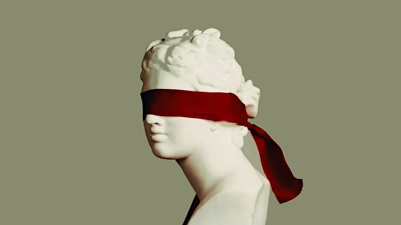

 

## Ignoring reality has its own cost

Published the same day starting from a [LinkedIn](https://www.linkedin.com/posts/robertofoglietta_ignoring-reality-has-its-own-cost-the-blind-activity-7303701155354677249-5hLI) post.

---

### The blind spot, the book

> The Blind Spot: Why Science Cannot Ignore Human Experience

So, "the blind spot" is a book which says anything else that quoting Deming - without data you're just another person with an opinion - is not enough. Not only because data can be wrong or biased which is a "corner-case" even when it might be common in certain cases (especially when our perception or the measuring tool it is biased) but in a broader view because, as often reminded - without data and without understanding, you are just another person with an opinion and data.

Understanding does not happen by chance. Method is fundamental. Hence the quote of Deming should be extended even more: with data, with a method and without understanding, you are just another person with an opinion. Which is the reason behind - Paolo - continues to point out a problem being unable to see the root cause behind that problem, usually because he is part of the SOURCE of all these kind of problems.

So, why did science start to become a kind of puzzle?

There are two main root causes.

1. **Cycles**. We collect pieces and then we put them together, it happened many times and it is more because of humans rather than science. New pieces rarely fit smoothly into the current state-of-art which implies putting in discussion AGAIN the fundamentals of science or just one important-name contribution. This creates a resistance because the day we put aside Einstein theory all those who made their careers on that subject will be also put aside and should have to restart in another branch.

2. **Interference**. Science was born the day a religious man decided to "not look into Galileo's telescope because it was a devil's tool" - that day science moved for its own way. Obviously because science produces value, politics and religious entities are interested in "conditioning" that value. What if they discover that god doesn't exist or god exists but it is not Jesus? What if Darwin theory is true? Stupid questions, no any real scientist cares about, by definition.

So, scientists do not care. But politics, religion and common people care. And they work against science can develop a broader vision: you are an expert of X, why do you talk about Y? Ignorance speaks about everything, instead!

It is a paradox, that someone that has a well-grounded foundation in science at the point to be a researcher in X, cannot have an informed opinion about Y but anyone else without barely an idea of how things work in reality can have an opinion on everything and we MUST care about that opinion.

So, science is NOT detached from reality and human experience. Most of the people who work in science simply avoid talking in public about their opinions, often also when they are experts of that specific field. Why this happens?

Simply because WE are aware that on the other side of science there are a bunch of irrational and emotional monkeys. Hence, the blind spot exist in THEIR perception and because of OUR unwillingness to debate about science with ignorants about how science works.

---

### No any question is stupid, almost

Those are stupid questions by definition, because whom believe sincerely that god exists, do not care about other people's opinions nor science theories. Alike, who believes that Jesus is god, does not care about others disagree. In short, faith-by-itself is not a topic for science.

By definition of faith as personal belief, otherwise is just trying to "win an argument" for no other reason than winning an argument. When doing that in large groups happens, it shows that the single person is feeling weak in their own faith. A football fans club logic, after all. Sociologically speaking.

Moreover, a scientific theory cannot be true or false in logic terms. It can be falsified by the definition from Karl Popper. A theory can work better under certain conditions and within broader limits than alternatives. In particular Darwin's theory has been corrected in many ways and several times since its first debut.

Which is perfectly reasonable in science and also when the contributes are bringing in more value than the initial discovery, nevertheless that theory maintains the name of the first person that made the leap of the box. So, about the theory, it is not even about Darwin, but a naming consuetude.

+

## Share alike

&copy; 2025, **Roberto A. Foglietta** &lt;roberto.foglietta@gmail.com&gt;, [CC BY-NC-ND 4.0](https://creativecommons.org/licenses/by-nc-nd/4.0/)

