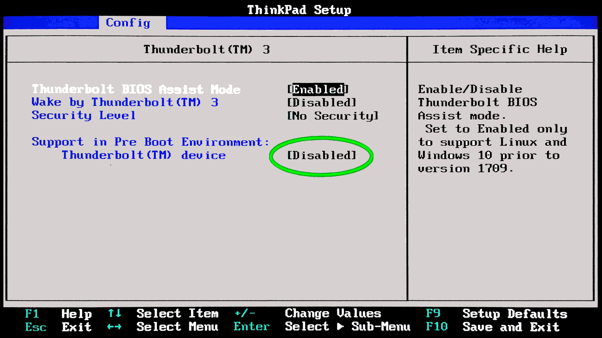

 

## ThinkPad X390 BIOS USB-C full bandwidth

Published initially on LinkedIn and on [Facebook](https://www.facebook.com/plugins/post.php?href=https%3A%2F%2Fwww.facebook.com%2Froberto.a.foglietta%2Fposts%2Fpfbid0e8pbVkLx9L9XbmX1VCoFqRM1M5JTEVv4WufrHFQQPnX8d49had1FxQSyQ3qc3Posl) on 1st March 2025, then updated and collected here.

---

I have noticed a drastic drop in performance on my X390 USB-C Thunderbolt port when I have enabled that system in full and in particular the option which is marked with a green circle. I do not want to convince anyone that disabling that option can 2x increase the performance on that port. Just give it a try, and judge by yourself on Ubuntu 22.04 with 6.08 kernel and Netac US9 512GB as USB 3.2 drive.

This is the Grok3 explanation about my experience and it is totally coherent with what I have seen on my own and in my case. Which confirms my feeling that it is better keep the Thunderbolt disabled as long as it is not used (changing that settings requires 15s for the BIOS and a reboot).

[!INFO]

#### Why It Affects USB Performance

Your Netac US9 is a USB 3.2 drive (likely Gen 2, 10 Gbps), not a Thunderbolt device, but it’s using the X390’s USB-C Thunderbolt 3 port. Here’s how enabling pre-boot Thunderbolt activation could throttle it.

#### Prioritization of Thunderbolt Protocol

When enabled, the BIOS might configure the Thunderbolt controller to assume a Thunderbolt device is attached, prioritizing PCIe tunneling or Thunderbolt signaling over USB SuperSpeed.

USB-C ports multiplex USB and Thunderbolt over the same pins/lanes. If Thunderbolt gets precedence, the USB SuperSpeed pairs (SSRX/SSRX+ and SSTX/SSTX+) might not negotiate at their full potential, capping the port at USB 3.0 (5 Gbps) instead of USB 3.2 Gen 2 (10 Gbps).

####  Lane Misconfiguration

Thunderbolt 3 uses up to 4 PCIe lanes, dynamically allocated with USB and DisplayPort. Pre-boot activation might reserve or misalign these lanes, leaving fewer or slower paths for USB data.

Your 300-500 MB/s matches USB 3.0’s real-world limit (400-500 MB/s with overhead), suggesting it’s stuck at 5 Gbps instead of 10 Gbps (800-1000 MB/s in real-world).

####  Latency or Overhead

Enabling pre-boot Thunderbolt could introduce controller polling or initialization delays, adding latency to USB transfers. This might not drop the theoretical speed but could reduce effective throughput, especially on a non-Thunderbolt device like your Netac.

####  Negotiation Downgrade:

The kernel (xhci_hcd) relies on the hardware’s initial state. If the BIOS hands over a port pre-configured for Thunderbolt, USB 3.2 negotiation might fail or downgrade to USB 3.0 (Gen 1), as seen in your ~300-500 MB/s range.

[/INFO]

---

### Thunderbolt firmware upgrade

After Ubuntu proposed to me the Thunderbolt firmware upgrade 20.00 --> 23.00, and I accepted it, I did not manage to go above 560Mb/s while - before the upgrade - I hit the 900MB/s and a little above. Check in the comments the screenshot about the firmware upgrade.

While moving on lowlatency kernel, the system did something better but still did not see the top v20.00 Thunderbolt Firmware performance.

- `268435456 bytes (268 MB, 256 MiB) copied, 0.314098 s, 855 MB/s`

Plus adding this into Linux kernel command line:

- `usbcore.autosuspend=-1`

which is fine in AC mode but it would be better to have "1" on battery to save power, the max speed achieved is near the nominal value of the usbkey:

- `268435456 bytes (268 MB, 256 MiB) copied, 0.279603 s, 960 MB/s`

Which is not bad at all, but it requires a deeper investigation. Therefore, here below a bash script to check the average data transfer speed.

[!CODE]
&num; variables 
f=/tmp/usbkey.tst 
d=/dev/sda 

&num; test 10 or 100 tries 
umount $d&ast; 2>/dev/null; for i in $(seq 100); do 
dd if=$d bs=1M count=256 skip=$[RANDOM%256] of=/dev/null 2>&1 |\ 
 &nbsp; grep bytes; done | tee $f 

&num; maths 
str=$(cat $f | cut -d, -f4 | sort -n) 
min=$(echo "$str" | head -n1) 
max=$(echo "$str" | tail -n1) 
let sum=$(sed -e "s/.&ast; s, \([0-9]&ast;\) .&ast;/\\1+/" $f | tr -d '\n')0 
avg=$[sum/100].$[sum%100] 

&num; results 
printf "\n min:%s, avg: %s MB/s, max:%s \n\n" "$min" $avg "$max" 
[/CODE]

#### Results print out & comments

Because the direct access to the device is not cached

- `min: 194 MB/s, avg: 838.45 MB/s, max: 960 MB/s` with `usbcore.autosuspend=-1`
- `min: 407 MB/s, avg: 856.91 MB/s, max: 963 MB/s` with `intel_iommu=on iommu=pt`

the average data transfer speed is looking quite impressive!

Anyway, here we are testing the USB data speed transfer.

The use of a real USB stick like Netac US9 is just for bragging... {:-D}

+

## Share alike

&copy; 2025, **Roberto A. Foglietta** &lt;roberto.foglietta@gmail.com&gt;, [CC BY-NC-ND 4.0](https://creativecommons.org/licenses/by-nc-nd/4.0/)

