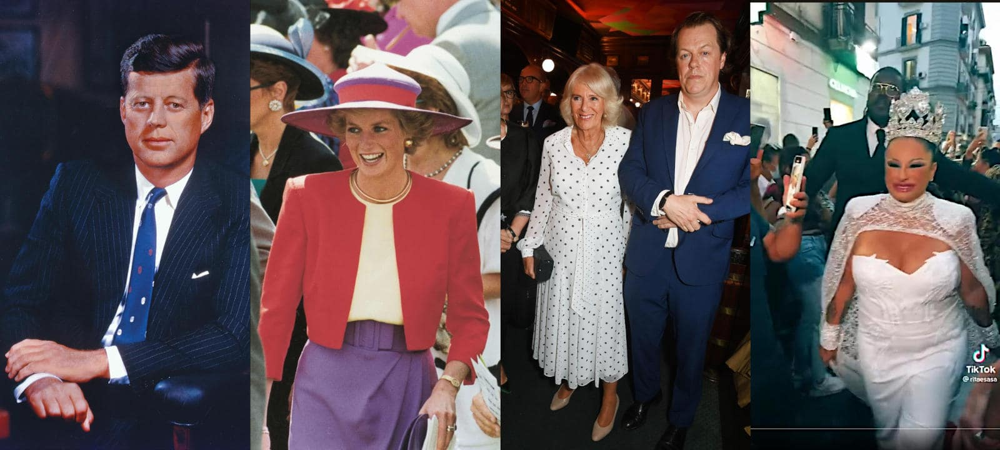

 

## La misura del degrado del sistema

Articolo scritto a partire da un post su [LinkedIn](https://www.linkedin.com/posts/robertofoglietta_anubi777-anubi77787292-on-x-activity-7319182287793799168-LElq) pubblicato il giorno prima.

---

C'è uno schema? Una misura di degrado del sistema? Si, c'è: i governanti che non sono il potere ma i maggiordomi del potere. La misura è stata istituita, e finora non è mai stata confutata, da Machiavelli - la saggezza di un Principe si misura dall'intelligenza delle persone di cui si circonda - che tradotto in termini moderni, sarebbe: il degrado di una nazione è inversamente proporzionale all'intelligenza - che è un concetto MOLTO diverso dalla furbizia - della classe dirigente (governo, in senso esteso).

La scala di degrado quindi è questa: intelligenti, furbi, corrotti, furbetti, stupidi, folli e poi pazzi scatenati assetati di sangue. Noi attualmente siamo qui. Dove qui, s'intende "Avanti Savoia", siamo andati così indietro che stiamo superando i fascismo con il ritorno alla monarchia, ma NON quella moderna, illuminata e borghese MA quella dei Casamonica e dei Savoia. Beh, beh, beh, è stata un'idea geniale scambiare l'etichetta "avanti" con "indietro". Sono certo che la nuova regina di Napoli, non è il tipo che faccia paura alla gente per le sue idee.

Parafrasando Woody Allen: io mi sento vecchio e più di qualcosa è andato storto.Possa la mediocrità essere dimentica nell'oblio eterno come una pallottola che ha mancato il bersaglio.

---

### Il suicidio dell'Europa, 1914-1944

Il paradosso della sicurezza tramite riarmo e la guerra che ne conseguì, [spiegato bene](https://x.com/anubi77787292/status/1912874366754259325). Per coloro che vanno di fretta, il riassunto del video è il seguente: 

- dobbiamo aumentare le spese militari per essere più sicuri che il nostro vicino non ci attacchi, il nostro vicino vede che noi facciamo quello e fa lo stesso ma ad un certo punto comprende che se attacca subito ha un vantaggio che invece potrebbe perdere più avanti, quindi guerra subito.

Trentanni passati a costruire armi e a distruggersi con quelle, così i paesi dell'Europa occidentali persero la loro importanza e a causa di quelle scelte i paesi dell'est Europa furono liberati dall'armata rossa. A proposito di liberatori ...

... furono liberati e annessi all'Unione Sovietica, perché essa ebbe oltre 10 milioni di morti fra soldati e civili a causa dell'invasione nazista e nonostante affrontò la macchina bellica nazista al suo massimo splendore, la distrusse per l'80%.

Questo fece risorgere la speranza nei popoli sottomessi dai nazisti all'idea che potessero ribellarsi, resistere e liberarsi dai essi. Quei morti, non sono mai stati considerati KIA in termini militari ma perdite civili. Nelle statistiche questa fa una certa differenza, e curiosamente invece in quelle dell'URSS mettiamo anche i civili.

La distruzione dell'80% dell'esercito nazista - in realtà italo-tedesco ma questo farebbe ridere in termini di effettività della campagna di Russia in cui le nostre truppe furono mandate totalmente impreparate e l'inverno fece il suo gran lavoro, oltre che irrispettoso dei tedeschi che NON sono i nazisti di un tempo, anzi a differenza degli italiani hanno decisamente svoltato pagina riguardo alle nostalgie del passato - permise agli USA di prendere in considerazione l'intervento: molto da vincere e il grosso del lavoro era già stato fatto.

Appunto, e qui sta il problema, perché gli USA fino ad allora avevano finanziato e offerto semilavorati (come l'acciaio) ai Russi per permettergli di affrontare i nazisti MA non avrebbero mai pensato che l'armata rossa che da un punto di vista militare e tecnologico era considerata inferiore avrebbe potuto arrivare fino a Berlino e se là non avesse incontrato gli americani, fino in Spagna.

Eppure di fronte a tutto questo, i Russi avrebbero pure accettato di ritornare sui loro passi, non certo lasciare Berlino, questo è ovvio, ma in altri paesi avrebbero potuto ritirarsi o rimanere solo come osservatori di garanzia.

Invece Churchill, che avevano messo al potere perché lo ritenevano l'unico pazzo in circolazione, sufficientemente pazzo da opporsi ad Hitler fino alla morte, decise che la Russia era un problema e quindi prima ancora che la guerra fosse conclusa distrusse le relazioni diplomatiche.

- Uguale è stato fatto nel 2007 all conferenza di Monaco, cfr. [discorso di Putin](https://it.wikipedia.org/wiki/Discorso_di_Vladimir_Putin_a_Monaco_del_2007) su Wikipedia.

Abbiamo distrutto le relazioni diplomatiche con la Russia, e poi per cosa? Maidan 2014, guerra in Ucraina nel 2022. Beh, beh, beh, dalla storia abbiamo imparato che non abbiamo imparato nulla dalla storia e continuamo a mentire con le statistiche, alla mano.

Comunque, a ben vedere, non è che prima andasse meglio: Hitler tradì unilateralmente il trattato di non belligeranza sottoscritto con l'URSS e fallì come prima di lui Napoleone.

+

## Share alike

&copy; 2025, **Roberto A. Foglietta** &lt;roberto.foglietta@gmail.com&gt;, [CC BY-NC-ND 4.0](https://creativecommons.org/licenses/by-nc-nd/4.0/)

