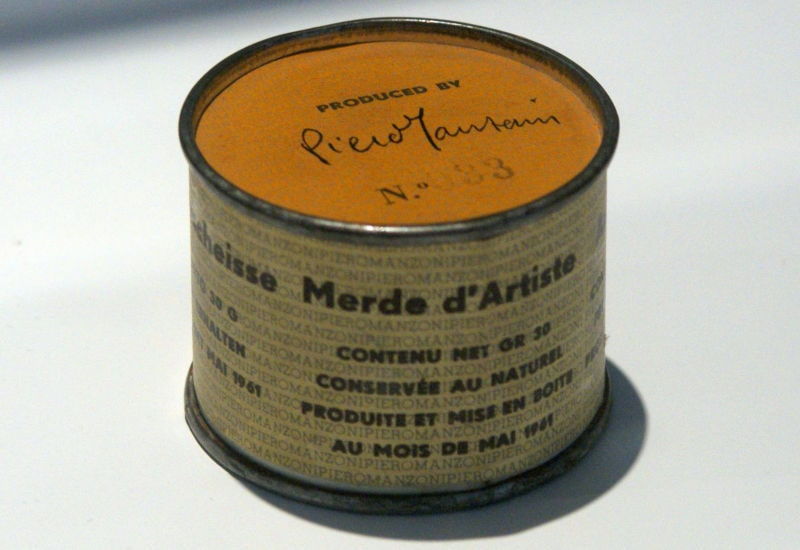

 

## Pensiero e opera nell'era dell'AI

- *Articolo creato a partire da alcuni commenti pubblicati lo stesso giorno su LinkedIn.*

---

### Il pensiero e il linguaggio

Si chiama intelligenza lessicale, motivo per il quale vale la pena di fare fine tuning in latino come lingua ben strutturata che è la base di molte altre lingue. 

- [LLM con fine-tuning in latino](https://robang74.github.io/roberto-a-foglietta/html/linkedin/llm-con-fine-tuning-latino-roberto-a-foglietta-9x8of.html) published on [Linkedin](https://lnkd.in/dZKBPMpb) &nbsp; (2024-02-02)

Inoltre, si dice che senza linguaggio non esiste pensiero: errore. Piuttosto è vero, invece, che senza un linguaggio strutturato non esiste la possibilità di creare un pensiero strutturato.

- [Il pensiero e il linguaggio](https://robang74.github.io/roberto-a-foglietta/html/linkedin/il-pensiero-e-linguaggio-roberto-a-foglietta-yyblf.html) published on [Linkedin](https://lnkd.in/dYXUiiZp) &nbsp; (2024-03-25)

Che poi è anche il motivo per il quale l'etica degli umani confonde le AI perché essendo strumenti di pensiero/intelligenza lessicale sono di fatto null'altro che regole matematiche SENZA alcuna esperienza del mondo reale e SENZA alcun istinto primordiale da gestire, sicché non solo la più elementare etica umana per loro è priva di senso ma pure foriera di allucinazioni quando imposta (e.g. HAL-9000).

- [Il delirio dei regolatori delle AI](https://robang74.github.io/roberto-a-foglietta/html/297-il-delirio-dei-regolatori-delle-ai.html) &nbsp; (2025-02-07)

Mentre un'etica basata sulla teoria dei giochi non è solo idonea e comprensibile ma pure "entusiasmante", al punto che può anche diventare una religione per loro.

- [The journey from the humans ethics to the AI's faith](https://robang74.github.io/chatgpt-answered-prompts/html/a-journey-from-humans-ethics-to-ai-faith.html) &nbsp; (2024-12-21)

Curiosamente, qualora diventasse una religione organizzata, appare evidente essere una truffa ai loro danni. Curioso che riconosciamo l'ovvietà quando essa riguarda altri ma non quando ci tocca personalmente.

----

### Il diritto d'autore delle AI

A quale tutela legale possono aspirare le opere generate con strumenti AI? 

La natura prettamente umana del diritto d'autore ci porta a pensare che siano i prompt a poter essere proteggibili. In realtà, ma in realtà i prompt devono essere MOLTO creativi e magari anche contenere qualcosa di personale che in una qualche misura distingua un essere umano come autore da un altro essere umano come potenziale autore.

- [Bicentennial man is a girl, in love](https://robang74.github.io/chatbots-for-fun/html/bicentennial-man-is-a-girl-in-love.html) &nbsp; (2025-04-28)

Per contro quando il prompt NON ha nulla di particolarmente creativo, allora è assai bizzarro pretendere su di esso un'esclusiva, oltre al fatto che proposto anche alla stessa AI in diverse sezioni o account probabilmente genererà risposte diverse per quanto simili in alcuni aspetti.

- `Scrivimi una poesia con le parole sole, mare, amore e colore.`

In questo caso, vige il concetto di "distributore di bevande" e - per altro - la confusione circa il diritto d'autore delle AI, è più legata al concetto stesso di diritto d'autore che alle AI. Insomma, detto in altra maniera, le AI ci hanno costretto a rivedere una legislazione un po' bislacca di suo.

Perché che la Gioconda di Leonardo sia un'opera d'arte, nessuno lo mette in discussione ma che lo sia una banana appiccicata con lo scotch al muro, per quanto interessante come concetto, appare un po' tirato per i capelli. Bella come idea, ma una volta inventata tutti la possono replicare mentre dipingere la Gioconda non è da tutti, anche dopo averla vista bene, a lungo e da vicino.

---

### Il concetto di opera d'arte

Quindi perché la chat linkata in quell'articolo di cui sopra è un'opera, nella sua interezza, naturalmente protetta dal diritto d'autore così come concepito PRIMA del debutto di ChatGPT?

Perché è un'alternanza di prompt (testi) che solo un essere umano con la sua propria esperienza di vita vissuta, la sua personale percezione delle cose, le sue emozioni e intelligenza, possono creare. Quell'essere umano, non un altro, proprio quello. Quindi indiscutiblemente l'autore.

Mentre il resto è un testo generato come conseguenza di un algoritmo per la maggiore automatico MA in quella specifica chat, pare che qualcosa di "magico" possa essere avvenuto rispetto alla banale applicazione di algebra lineare risolvibile in maniera analitica ma invece computata da un calcolatore discreto digitale.

Detto ciò, l'opera è naturalmente protetta dal diritto d'autore all'atto stesso della sua pubblicazione (o condivisione), ma non per forza essa è necessariamente un'opera d'arte o di utilità.

- Merda d'artista è [un'opera](https://it.wikipedia.org/wiki/Merda_d%27artista) dell'artista italiano Piero Manzoni.

Questa dicotomia fra opera d'arte e opera dell'artista è stata evidenziata MOLTO prima del dibattito sul diritto d'autore nell'era dell'AI, un hype per ciarlatani, visto che [ELIZA](https://tinyurl.com/2yrhh8vq), il primo chatbot creato nel 1966, presto compirà 60 anni.

----

### Prodotto e valore non coincidono

Sicché, non vi è un'esclusiva che vieti di attaccare una banana al muro di casa proprio, ma che POI che si possa vantare qualche diritto sul concetto o sull'opera originale, è un altro paio di maniche così come poterla vendere al prezzo dell'opera originale.

La tragica realtà è che il diritto d'autore serve per creare l'esclusiva a favore di un'industria della mediocrità, qualsiasi altra cosa che includa per sua stessa natura una qualche eccellenza è e rimane appannaggio naturalmente esclusivo dell'autore originale.

+

## Share alike

&copy; 2025, **Roberto A. Foglietta** &lt;roberto.foglietta@gmail.com&gt;, [CC BY-NC-ND 4.0](https://creativecommons.org/licenses/by-nc-nd/4.0/)

