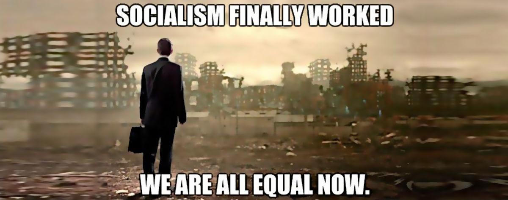

 

## War vs panem et circenses socialism

- Published on [LinkedIn](https://www.linkedin.com/posts/robertofoglietta_stupidity-kills-not-socialism-thats-war-activity-7323936649048965120-a3Bm) on the same day.

---

### Stupidity kills, not socialism

That's war, depicted in the image.

Why attack "socialism", the idea that everyone has a piece of bread to eat, some fresh water, a decent care when ill, and more in general that the basic needs met while **all others** needs can be the engine for capitalism?

It is fine to give a price/value to a bottle of water, but should it be **also** necessary to kill people by drought because we cannot accept the idea that there can exist a "basic quota" as per human right?

By the way, historically speaking "socialism" is the magic word that communism leveraged to market itself.

Switzerland is a socialist de-facto country, while Sweden is a socialist by politics country. Unsurprisingly Switzerland is more wealthy and safer than Sweden in which a bit of ideology remained about the misconception of socialism.

Hey, do you know that "**socialism**" derives from "**society**"? Really!

Without "socialism" we would live in a society of people who do not give a f*ck when we are dying in the middle of a street, for whatever reason.

In a "non-socialist" family, your wife would just evaluate the death-insurance premium versus the negative balance to call an ambulance and face an hospital degency.

You might not know, but understanding.

The "**panem et circenses**" socialism ruled the world for centuries. And no, it never jeopardised the jearchy order in any way but stabilised it.

Understanding is not an option, unless stupidity.

+

## Share alike

&copy; 2025, **Roberto A. Foglietta** &lt;roberto.foglietta@gmail.com&gt;, [CC BY-NC-ND 4.0](https://creativecommons.org/licenses/by-nc-nd/4.0/)

