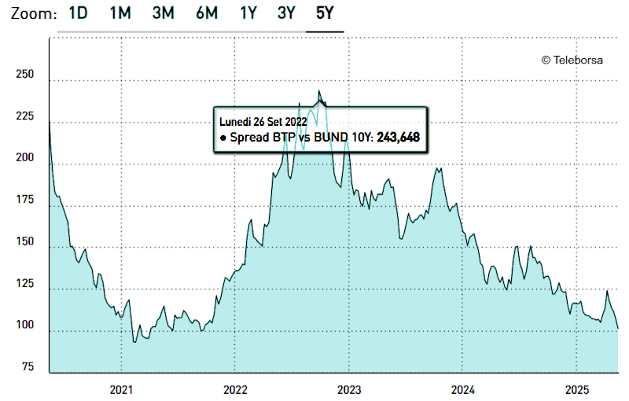

 

## Non c'è il 2° podio negli schemi Ponzi

- *Articolo scritto a partire da un post su [Facebook](https://www.facebook.com/photo/?fbid=10161771372168736&set=a.10150400606833736) e **LinkedIn** ma frammentato nei commenti, a causa della lunghezza, entrambi aggiornati durante la mattinata per poi evolversi in questo documento.*

---

### Quando Angela salvò l'Italia

Sebbene con alti e bassi, lo spread per l'Italia cala dal Q4/2022. Cosa è successo in quel periodo?

 

La Merkel fece un'intervista che poi fu pubblicata successivamente ammettendo che entrambi gli accordi di Minsk erano stati sottoscritti, sapendo di volerli violare fin da principio e solo per comprare tempo per preparare l'Ucraina alla guerra.

In pratica, ammise che **non** era la Russia che voleva fare guerra a noi, ma eravamo noi a voler far la guerra alla Russia. Questo è un dettaglio che pare banale ma per un paese sempre sull'orlo del tracollo come l'Italia, estremamente frammentato in termini sociali, è fondamentale.

Perché se noi vogliamo fare la guerra alla Russia significa che la NATO come fanclub degli USA sta pressando i governi europei a pagare per creare una crisi che poi si risolverà con una fuga (Afghanistan docet) e che ha come unico obiettivo una qualche rapina (Iraq e Kuwait, docet).

Se invece fosse stata la Russia a decidere di fare la guerra alla NATO, l'Italia sarebbe stato il primo paese a collassare, finanziariamente e poi economicamente, probabilmente anche socialmente, fino a livelli di caos tali da portarlo al default effettivo, non quello tecnico.

Quella notizia -- rivelazione della Merkel -- pur essendo stata ignorata dai fan di Mr. Z ma non dai mercati che invece l'hanno colta al volo per avvantaggiarsene quanto più possibile e il prima possibile, ha salvato l'Italia.

---

### L'intervista della Merkel

Le date documentate sono quelle delle pubblicazioni: Der Spiegel, novembre 2022 e Die Zeit, 7 dicembre 2022. Tuttavia, è assolutamente ragionevole che l'intervista sia stata effettuate settimane prima, almeno prima della fine di settembre 2022.

Un ritardo fra il rilascio dell'intervista e la sua pubblicazione, per diverse ragioni molto concrete: una figura politica di primo piano che rilascia dichiarazioni di portata storica in un momento molto delicato e in un contesto esplosivo che richiede verifiche rigorose, consultazioni con attori istituzionali fra cui è ragionevole inserire anche i vertici europei della NATO, almeno tramite il capo dell'esercito tedesco e/o del Cancelliere in carica, ed un'eventuale revisione dell'intervista stessa coerente con un ciclo di approvazione complesso.

Dichiarazioni che sicuramente **non** sono state fatte a caso e pubblicate **senza** un intento preciso, di estrema importanza e urgente da non poter aspettare le fine della guerra. Quindi una comunicazione strategica come atto politico collettivo in seno alla Germania di cui si fece personalmente carico la Merkel come ex-Cancelliera ma che era in carica al tempo dei fatti.

[!INFO]

Nel 2015, la Merkel aveva rilasciato interviste a Bild a ridosso del secondo trattato. Ma il Bild -- popolare, molto letto e spesso in posizione critica verso il governo Scholz -- non era il media adatto.

Poiché nel 2022 l’obiettivo era la massima credibilità diplomatica. Mentre nel 2015, era una questione di conquistarsi il favore ed eventualmente i voti anche tra i meno propensi a quell'area politica che sosteneva la Merkel. 

Al contrario Der Spiegel ha una lunga storia di inchieste su temi di sicurezza, intelligence, politica estera, e un profilo molto autorevole. Mentre Die Zeit è considerato il settimanale più intellettuale e rispettato della Germania, con ampia credibilità a livello europeo.

[/INFO]

Quindi un'intervista che è stata presentata e confermata da due testate giornalistiche altamente specializzate, professionali e autorevoli. Il **verbo** sulla questione, sebbene in lingua tedesca e per gli abbonati o su carta stampata, quindi con una diffusione non immediatamente universale.

Cosa che ha ovviamente permesso alla miriade di "*fact-checker*" di contestare l'interpretazione di quelle dichiarazioni eppure anche un **solo** passaggio, qui tradotto lascia pochi dubbi a riguardo: 

> **Merkel**
> 
> Ritengo che l'avvio dell'adesione dell'Ucraina e della Georgia alla NATO, di cui si è discusso nel 2008, sia stato sbagliato. I due Paesi non avevano i prerequisiti necessari per farlo, né erano state pienamente considerate le conseguenze di una simile decisione, sia per quanto riguarda le azioni della Russia contro la Georgia e l'Ucraina, sia per quanto riguarda la NATO e le sue norme di mutua assistenza. E l'accordo di Minsk del 2014 è stato un tentativo di dare tempo all'Ucraina.

- **Fonte**: [zeit.de](https://web.archive.org/web/20221213035833/https://www.zeit.de/2022/51/angela-merkel-russland-fluechtlingskrise-bundeskanzler/seite-3) by archive.org

Un passaggio introduttivo che poi porterà necessariamente a parlare degli accordi di Minsk del 2015, di una questione che era cominciata nel 2008 e che sicuramente, come di fatto poi è avvenuto, non si sarebbe conclusa nel 2015.

+

## Il default tecnico dell'Italia

Lo spread indica quanto costa rifinanziare il debito pubblico e quindi, in sostanza, quanto ci costa la gestione finanziaria dello stesso. Ogni volta che abbiamo cercato di ridurre il debito pubblico è stato un massacro. Invece, è stato possibile aumentare il debito pubblico SOLO perché abbiamo creato inflazione.

- `debito 2.28x → costo della vita oltre 2x`

- `debito/PIL +25% → pressione fiscale +23%`

- [Primo maggio, festa dei lavoratori](311-primo-maggio-festa-dei-lavoratori.md#?target=_blank) &nbsp; (2025-05-01)

C'è però un problema di fondo: visto che il denaro viene creato (*quantitative easing, whatever it takes*) allora tutto questa "gestione finanziaria" in realtà è una truffa:

- [The paper money is financial communism](278-the-paper-money-is-financial-communism.md#?target=_blank) &nbsp; (2024-07-31)

Perché **noi** peones siamo costretti a comprare gli euro (o dollari) con il nostro lavoro mentre nella finanza li stampano, letteralmente dal nulla. È ovvio che la finanza si comprerà **tutto** e il lavoro diventerà inutile. Infatti i lavoratori sono stati cartolarizzati:

- [La cartolarizzazione del lavoratore](https://robang74.github.io/roberto-a-foglietta/html/linkedin/la-cartolarizzazione-del-lavoratore-roberto-a-foglietta.html) &nbsp; su &nbsp; [LinkedIn](http://linkedin.com/pulse/la-cartolarizzazione-del-lavoratore-roberto-a-foglietta) &nbsp; (2017-10-27)

che è un modo "tecnico" per dire che **non** ha più importanza la produzione al punto che le aziende guadagnerebbero di più dalla borsa se **non** avessero lavoratori. In pratica, i lavoratori servono alle aziende **solo** per far finta di esistere e quotarsi in borsa.

+

## Il default tecnico del debito USA

Ma è ancora più grave, perchè prima dell'euro era privilegio esclusivo del dollaro americano espandere la massa monetaria e diluire il suo valore quindi creare inflazione, con l'euro questo "privilegio" è diventato anche nostro e se non lo facessimo anche noi, il resto del mondo preferirebbe usare l'euro per gestire le loro riserve finanziarie.

- [La guerra del dollaro contro l'euro](https://robang74.github.io/roberto-a-foglietta/html/261-la-guerra-del-dollaro-contro-l-euro.html) &nbsp; (2024-05-18)

Quindi dal 2001 è in corso una guerra finanziaria tra dollaro ed euro. Di cui la "sorpresa" più devastante è stata l'ingresso della Cina nel WTO. In pratica gli USA hanno risposto alla creazione dell'euro con lo spostamento in Cina della produzione industriale. Quindi anche NOI siamo stati costretti a stampare euro invece di produrre.

La cosa più interessante è che il debito pubblico americano è già tecnicamente fallito che è il motivo per il quale paradossalmente ora tutti i dollari sono costretti ad essere investiti in USA, quindi gli USA sono in saldo.

A noi europei toccherà la stessa sorte oppure la guerra contro qualcuno che ci rada al suolo e cancelli il ricordo del debito (default reset), tipo la Russia. Esiste una via di uscita che non sia la WW3, ma la BCE imita la FED e non c'è un secondo posto sul podio degli schemi Ponzi.

- [Valutazione di un nuovo modello monetario](https://robang74.github.io/chatgpt-answered-prompts/html/valutazione-di-un-nuovo-modello-monetario.html) &nbsp; (2024-11-26)

Una volta passato il periodo di grazia, il default è tecnico ma non necessariamente un collasso, però tutto il prosieguo diventa puramente aleatorio e fideistico. Il che spinge tutti coloro che hanno grandi liquidità in USD o a convertirle o a ritornarle alla sorgente.

Il modo meno "appariscente" di farlo è quello che stiamo osservando: grandi società di tecnologia dotate di immense liquidità che investono contratti di costruzione di impianti, quali reattori nucleari, oppure principi arabi che investono in alta tecnologia in USA e armi, casomai si dovessero difendere le posizioni con qualcosa di più effettivo della sola diplomazia che oltretutto, ultimamente, non gode di grande credibilità.

...

#### U.S. public debt default

Unfortunately, the U.S. public debt is gone in default after the grace period expired, that day Warren Buffett retired. The day after everything based on USD gets into a Ponzi scheme, technically speaking. How did the U.S. public debt default? Long story short: no any USD backup, anymore (we don't trust anymore).

Gemini2 is debating about details but -- in fact, for everyone who knows in depth the financial mechanisms -- during G7 in Puglia (2024) the Saudi Arabia puts a stop to the Petrodollar agreement, de-facto removing the last real-world collateral to backup the USD. Unsurprisingly, they found themselves, after the grace period expired, sitting on an Everest of paper money and suddenly they decided that investing $600B in AI tech in the USA and buying $142B american weapons was a good way to protect their position.

Is this explaining to you something about how quickly some "positions" are evolving? Good, then the whole story (in development, watch outside) will amuse you much more!

Warren Buffett was the #1 non-speculative finance guru investor before he retired -- which cannot be a 1-day disengagement considering his position and the need to properly delegate his duties, hence he is formally the Berkshire Hathaway CEO and president -- his motto was:

> in the market, winners are those can keep a position as long as they will

which defines him as a "non-speculative" investor, as long as we can consider a "speculative trader" everyone rely on high-frequency transactions to earn a sort of gain. By contrast, every HF trader can liquidate in a single working day their positions, something which cannot be reasonably done by those who have a long-term investment strategy.

...

#### Il grande avversario di Trump <i> &nbsp; Aggiornamento del 2025-05-17</i>

Il Moloch che l'amministrazione Trump dovrà affrontare è quei $7T di debito pubblico da rinnovare. Ma per darvi un'idea di cosa significhi la finanza negli USA e quindi il controllo del debito pubblico c'è l'altro screenshot e allora andiamo a mettere in prospettiva quei $7T con tutto il resto.

- solo di interessi sul debito pubblico pagano $1T all'anno

- sul debito pubblico e privato aggregato quasi $5.5T l'anno

Ma non è finita qua perché queste sono solo le punte di due iceberg.

- Fonte dei dati: [usdebtclock.org](https://www.usdebtclock.org)

Il debito pubblico americano è sicuramente importante ma non è l'unico debito che USA hanno, infatti se andiamo a vedere quello privato, esso è semplicemente ENORME: un numero espresso da 15 cifre dove 10^12 sono trilioni quindi $103 trilioni, se includiamo anche i leverage finanziari (esposizione) si arriva ad un valore di 772% del PIL americano.

+

## Conclusione

Quindi non stiamo osservando solo un fallimento del debito pubblico USA ma anche sociale e produttivo (debito privato), anche finanziario e commerciale (esposizioni) e infine infra-strutturale perché è sufficiente ricordarsi della tragedia del ponte di Baltimora che ha portato alla luce altri 17mila ponti a rischio, dell'incendio di Los Angeles, dello stato della rete ferroviaria e in particolare di quella merci che è rimasta al '900, dei problemi di aggiornamento informatico come i sistemi di radiocontrollo dell'aeronautica civile come il black-out di 92 secondi all'aeroporto di Newark oppure alla marina militare che ancora utilizza Windows NT, e che fra tutti i problemi di aggiornamento è probabilmente il meno grave.

In un contesto del genere servirebbe prudenza ma a questo stadio è più corretto dire psicofarmaci (ansiolitici) di cui il 25% degli americani fa uso regolare e probabilmente un altro 25% ne fa abuso insieme a droghe di vario tipo fra cui il Fentanyl. Invece c'è Trump che io personalmente adoro come presidente perché penso ci regalerà ENORMI soddisfazioni e anche uno spettacolare mandato in termini di show.

+

## Share alike

&copy; 2025, **Roberto A. Foglietta** &lt;roberto.foglietta@gmail.com&gt;, [CC BY-NC-ND 4.0](https://creativecommons.org/licenses/by-nc-nd/4.0/)

