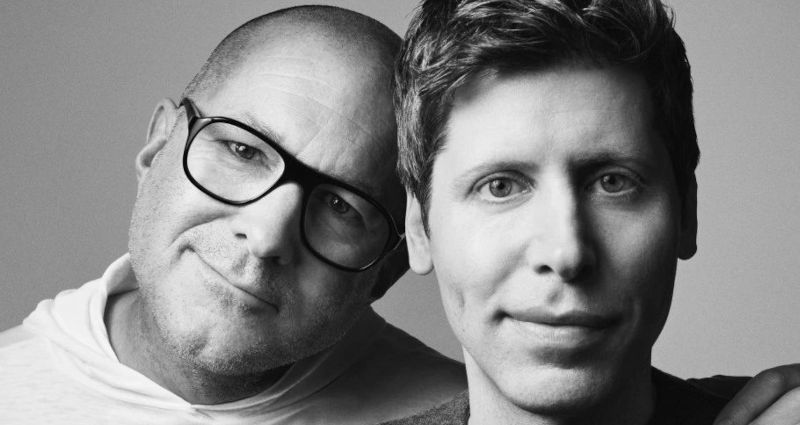

 

## Sam Altman, come fosse la Louis Vuitton di qualcosa

- Questo articolo è stato scritto a partire da un post pubblicato su [LinkedIn](https://www.linkedin.com/posts/robertofoglietta_sam-altman-ha-comprato-una-start-up-per-65b-activity-7331070589421391873-smDc) e [Facebook](https://www.facebook.com/photo?fbid=10161794077968736&set=a.10150400606833736) il giorno prima.

---

### La notizia, prima

Can be anything from Rabbit R1, to real-time translator earplugs or headphones, to a [crypto orb](https://world.org/blog/world/designing-orb-universal-value-simplicity) gadget or any possible combination of that including the Humane AI pin now dismissed.

The two most interesting fact are:

1. the HUGE sum of money involved in;

2. the IO start-up has no even a website.

A quick chat with ChatGPT clarify the news and the last statement, in particular:

> Jony Ive's AI hardware startup is named io. Founded in 2024 by Ive alongside former Apple colleagues Tang Tan, Evans Hankey, and Scott Cannon, io was recently acquired by OpenAI in a $6.5 billion all-equity deal, marking OpenAI's significant expansion into consumer hardware.
> 
> While specific details about the devices are still under wraps, the project aims to develop a new category of AI-native hardware that offers an alternative to traditional smartphones. The envisioned devices are expected to integrate advanced AI functionalities—such as summarizing information, recognizing objects, and managing complex tasks—into a more ambient and less attention-demanding experience.
> 
> As of now, io, the AI hardware startup co-founded by Jony Ive, does not appear to have a public-facing website. The company has operated in stealth mode, focusing on developing innovative AI-powered devices that aim to redefine user interaction with technology.

- Fonte dell'estratto di cui sopra: [ChatGPT](https://chatgpt.com/share/682e30ca-8d18-8012-b712-c32eb188fae8)

Could we trust OpenAI's chatbot about Sam Altman next secret move? So, so. But it can be considered an official source. What they wish to let us know, beforehands. The marketing does not mimic the Apple but winks at the woke culture but without gender extremism and with an apparent modesty because the new luxury is no longer something to wear but an accessory to carry with us.

---

### L'analisi della notizia

Sam Altman ha comprato una start-up per $6.5B. Falso, è una narrativa tossica. 

Sam Altman ha comprato della gente che lavora in quella start-up che hanno decenni di comprovata esperienza nel creare dispositivi hardware che sono diventati successi globali.

Sam Altman ha capito che se continua a fare business con "idee innovative" e "software" prende sberle come nei film di Trinità, tante e senza capire nemmeno da dove gli piovono.

Quindi investe nell'unica seniority capital intensive con un'industria di riferimento ad alta barriera d'ingresso perché ha capito che SOLO in quel settore può avere un vantaggio "esclusivo" che gli concede il denaro.

Il resto è solo narrativa tossica di quelli che pensano che aprire una start-up innovativa (di cui talvolta non si comprende nemmeno che cosa facciano, realmente) sia la via vincere la lotteria. Falso, quelle al più sono sofisticate truffe finanziarie. L'unico vero asset, quello fondamentale, di ogni start-up NON è l'idea ma la seniority del suo personale.

Se c'è una persona con 20-30 anni di esperienza in un settore che apre una start-up (o un'impresa) la probabilità che quell'impresa abbia successo sul mercato anche se non si è capito cosa faccia, è alta. A patto che ovviamente quell'impresa possa effettivamente operare in un libero mercato perché SE il libero mercato NON esiste, allora parliamo di club esclusivi.

Se parliamo di club esclusivi, allora anche l'investimento stratosferico di Sam Altman e quelli futuri anche più gravosi nella produzione di dispositivi high-tech, sarà comunque alle mercè di chi - avendo cervello - decide di offrire un'alternativa - magari meno chic - ma ugualmente funzionale.

Ecco, Sam Altman cosa sta facendo veramente: la Louis Vuitton di qualcosa. 

O almeno ci prova, comprando senior che in passato ce l'hanno fatta.

---

### L'opinione di ChatGPT

Per fare un approfondimento, ho deciso di parlare con ChatGPT della sezione precedente, dando per scontanto che anche in una nuova sessione abbia le informazioni base sull'argomento senza chiedere di cercarle. Un buon approccio, perché eventualmente si può sempre chiedere di cercarle dopo, qualora si noti che ne difetti rispetto al traning di base.

- [Analisi critica post su Altman's $6.5B acquisition](https://chatgpt.com/share/682e4a9d-f904-8012-8c91-c0b70e088a78) &nbsp; (2025-05-21)

- [Trascrizione della chat sopra](data/316-analisi-critica-post-altman-chatgpt.txt#?target=_blank) &nbsp; text 80 cols in UTF-8

Invece, ChatGPT pare essere parecchio sul pezzo e anche informata dei "vizi" delle start-up innovative e più in generale di quel "mercato". La sue critiche, assolutamente ragionevoli, è stato facile superarle. Facile, per chi è altrettanto informato delle dinamiche della c.d. innovazione e quindi basta citare brevi riferimenti che l'AI engine correttamente identifica all'interno del suo training.

Bello! Insomma, guardiamo questa cosa dal punto di vista di coloro che hanno pagato per addestrare ChatGPT per essere un AI engine che possa favorire l'innovazione tecnologica e poi si trovano con un chatbot che ammette candidamente -- che secondo le statistiche, quindi dati solidi quanto lo screening in pre-training delle fonti -- al 90% è un mercato del fallimento pilotato in cui la truffa regna sovrana.

+

## Share alike

&copy; 2025, **Roberto A. Foglietta** &lt;roberto.foglietta@gmail.com&gt;, [CC BY-NC-ND 4.0](https://creativecommons.org/licenses/by-nc-nd/4.0/)

