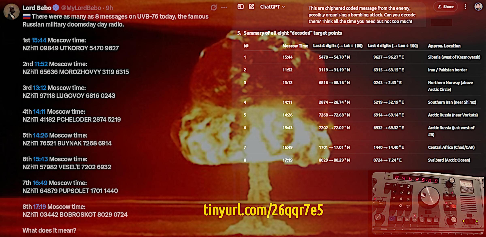
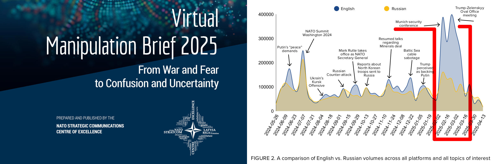

 

## War of drones, business model and consequences

- Articolo a partire da vari post pubblicati su LinkedIn alcuni giorni prima a partire dal 1° giugno 2025.

- **WORKING IN PROGRESS** -- This article content might change radically or its way of reading, patience.

---

### From war and fear to confusion and uncertanty by NATO

An estimated ~7.9 % of all the interactions we tracked show statistics-based signs of coordination. Kremlin‑aligned messaging bursts were roughly twice as frequent as their pro‑Western counterparts, and about three times as frequent for the posts that appeared on more than one platform. 

[which kind of coordination?]

This implies the broader reach and tighter synchronisation of Kremlin-orchestrated operations.

[soon later]

Figure 2, a comparison of EN vs. RU volumes of interactions

 

Please, take in consideration that the "coordination" can be a mere rational reaction to the disturbing bullsh*t emerged by those two events that Russians ignored almost completely while get on the nerves on rational fact-driven opinionists (and a cascade of memes related, as usual because it is enough that few of those are facts-driven engages the social media with a humor-sarcastic tone that hits emotionally the people and they meme on that).

So, let me reframe this in a more useful way: the biases of those paying this paper were so strong that western people who, critically protest or speak about how NATO (*) is ridiculously dumb, got labeled as pro-Kremlin!

(*) Why does NATO still exist after 1992, by the way?

#### -= SPOILER #1 =-

NATO is the solution to the problem they created by continuing to exist after 1992 instead of being transformed into something else, like the U.S. strategic analysts were suggesting at that time, in combination with expanding NATO to the east is a terrible mistake, hence to prevent that in future terrible mistakes would happen a NATO transformation has been suggested.

The NATO transformation idea ceased to exist around 2004 while the Ukraine proxy-war started to be put in action around 2007, most probably immediately after the Putin speech at the Munich conference.

#### -= SPOILER #2 =-

The paper (ISBN 978-9934-619-43-4) has been published in May 2025 which means that it has been prepared a few months before. The last date in the graph indicates 13th April 2025.

From the middle of April to the beginning of June, has something changed?

2025-05-30: US Special Envoy for Ukraine Keith Kellogg has acknowledged that Russian President Vladimir Putin is right that NATO is waging a proxy war with Russia.

Among other declarations, in that speech there is also a stop NATO expansion (including to the east, at least) claim. Which makes the paper look even more funnier. Because it had not even the time to rot to smell weird.

#### -= SPOILER #3 =-

NATO influence extending eastward after the Soviet Union collapse was more a natural drift of some countries toward west AND within the NATO there was a debate about transformation or a change of posture, at least.

A debate (or the debate was a pretending show about NATO would not be NATO anymore soon, hence eastward expansion was not THAT thing) which was going on up to 2004, at least. On the other side, the "debate show" inconsistency was clearly exposed during the Munich security conference in 2007 by the Putin [speech](https://en.wikipedia.org/wiki/2007_Munich_speech_of_Vladimir_Putin).

Soon after that speech US funded NGO started to infiltrate the Ukraine society with the aim of influencing the political context. Something that we can clearly see and claim, by now. But at that time it was not so obvious.

The western NGO was a coverage for more than a political drift, as the orange and maiden revolutions shown. More than that, they were working as a network to convey financial support for CIA operations in breeding, training and then weaponise neo-nazi paramilitary groups.

We know that because such activities were illegal by US law, in any part of the world, until the Congress removed such limitations allowing nazi groups US support.

+

## The drones attack to Russia military facility

- Operation Spider's Web, June 1st 2025 ([Wikipedia](https://en.wikipedia.org/wiki/Operation_Spider%27s_Web))

Operation Spider's Web (Ukrainian: Операція «Павутина», romanized: Operatsija "Pavutyna") was a covert drone attack carried out by the Security Service of Ukraine (SBU) deep inside Russia on 1 June 2025, during the Russo-Ukrainian War.

 

The coordinated strikes targeted the Russian Air Force's Long-Range Aviation assets at five air bases—Belaya, Dyagilevo, Ivanovo Severny, Olenya, and Ukrainka—using drones concealed in and launched from trucks on Russian territory.

---

### The Internet connection is not the main key

> A satellite link between the control center and the truck still seems to be the most plausible assumption

Everything else apart a satellite link would have been tracked after-post, the movements among the cellular network of the SIMs (many for the same truck) and when many SIMs are moving together on a truck instead of autobus (people), then some suspects start to arise. Many SIMs from many operators, one among them always connected, all together at the operation start which means the time for preparation before the launch.

Many things can go wrong, so that solution can be a mere emergency backup while the satellite connection is the most effective and reliable. Plus, a satellite link for the Internet is not something unconceivable also for a stopped truck: pay-tv for those are used to drive in many countries and voip/whatsapp for friends and family. However, in principle, any commercial Internet satellite operator can be used. Even better prepared to use all of those available.

After all, the Internet connection does not seem the main key apart from the fact that it should be available and - when available - many connections on many operators can be bounded into a single VPN: faster and darker.

---

WHAT'S ABOUT WAR AS BUSINESS BUT NOT AS USUAL?

Instead, another interesting "question" (or topic, more precisely) is about doing war as business but not as usual. Not as usual form few but fundamentally reasons:

- **Costs in BOM**: renting the truck (tractor unit) is about $4000/mo and almost the same to buy the used container to customize and each drone cost about $300 (as I read but says $1k would not change much more), hence $12000, says $40.000 modified. Total, $100K

- **Networking**: Internet, darknet, 4K entertainment, pay-per-play, simulations, tournaments, real adrenalina pay-per-fight (or watch), betting, etc. plus more (like drug delivery and various illegal material) can easily fulfil the budget for organising these operations.

- **One fits all**: scalable business model, today is Russia, tomorrow could be any other country on demand. First successful story 18mo, the next 9mo, the next 6mo, the next 3mo, the next 1mo (physical time to reach the targets) at that point is "destroying as service" on demand.

- **No way out**: absolute fidelisation up to the point of blackmailing the fighters: Gotcha, shitfighter. You have officially become a military target! (cit.) - your 14yo son/daughter into a "heroic lega" but trapped a terrorist network.

Welcome into the new world in which shitcoin, drugs home delivery, and eros on demand are stuff for boys, while real-world terrorism is for men, whatever the age behind the player behind the joystick pad.

Well done, Uncle Sam! 😎 

---

### Gotcha shitfigher

Why do Ukraine drones have a 4K hence the optic fiber guidance? Even a poor model pilot (or old Flight Simulator pilot) can use instrumental flight and a poor vision to navigate. But not the kids who get mad and do not enjoy the game when they use UAV as if they were video games.

This explains why the Ukraines UAV moves like in the video games instead of following the "hunting or scouting path". Someone that has been a real-word hunter or scout now. They are kids, paying kids for playing and only the best goes into real missions, the other financing the killing machine.

Which also explains all this mad stuff in enjoyment of the video targeting the enemy. Because below the surface there is a dark network that earns $$$, kills, and educates to kill and enjoy the others' suffering.

Nothing new, I met three ex KGBs with Polish ID cards but from Ukraine and they were exactly that way. Who knows where they have gone? Whatever about them, the same idea is spreading: first a large group of haters bullies the most brilliant and various many steps of hating kill by drones.

Gotcha, shitfighter. You have been officially became a military target! (cit.)

---

### The game changer

Now, the game is to find those kids before Russian hackers and secret services agents do. It is like Dama, the piece taken without a backup is gone.

Precious hint: take the maximum advantage in the meantime Russia is busy in selecting the targets to hit as retaliation.

Good luck, adventurers! (cit.)

---

ABOUT THE DRONES ATTACK

About the drones attack against military nuclear facilities, there are two HUGE red flags to consider:

1. that kind of attack can be soon develop autonomously as a private on-demand terrorism business AND it has the potential of penetrate our society and culture with immense consequences which are beyond imagination. - lnkd.in/dZMmnaNV

2. the target chosen creates a VERY dangerous precedent because - including a previous destruction of an over-horizon radar - it is the 2nd and most daring attack which infringes the nuclear non-proliferation agreements. - lnkd.in/d5hinkFk

Those agreements enforce not only Russia but also USA to keep that facilities exposed in such way others countries can check by satellite (or visual) where and how much defensive-attack nuclear power is deployed.

Non nuclear states which are driven these kind of attack are going to push the world back to the times in which nuclear threads were hidden. Which means that first-strike re-enter as a "reasonable" option.

We are bringing terroristic attacks into our international negotiation toolkit, in our culture and society plus back to Cuba missiles crisis times but with 8B+ people, Internet complexity and a lot more of cocaine! 

+

## La fine della guerra

THE WONDERFUL M&M COUPLE IS
GOING TO CONQUER THE WORLD

They haven't been beaten enough by Russia, and they are wishing another massive dose from China. They speak in that way thinking they can have the cheering of their nationals supporters, looking as wo/men-in-power but...

Spoiler: yesterday Macon met Meloni, and now the M&M couple is thinking that, after setting down their conflicts, united they can stand and win. I am going to end the list of bad words to swear!

---

L'attacco vantato da Zelensky ai bombardieri nucleari della Russia, che avrebbe comunque sollevato ENORMI questioni di sicurezza anche se fosse stato diretto contro altre installazioni comunque strategiche (https://lnkd.in/dZMmnaNV), viola il trattato di non proliferazione delle armi (e velivoli relativi) perché essi debbono rimanere esposti così da poter essere H24 sotto il controllo visivo dei satelliti spia.

Un controllo incrociato che però ha come collaterale anche quello che nessuna delle parti, direttamente o per intermediazione, possa attaccare quelle strutture o velivoli. Si tratta di un accordo globale, non limitato alla Russia e agli USA. Coincidenza vuole che

2025-05-30: US Special Envoy for Ukraine Keith Kellogg has acknowledged that Russian President Vladimir Putin is right that NATO is waging a proxy war with Russia.

due giorni prima dell'attacco gli americani hanno pubblicamente ammesso che quell Ucraino-Russa fosse una loro guerra per procura contro la Russia, anche se nel titolo della notizia questo aspetto non traspare esplicitamente e la notizia è circolata molto poco (copertura notizia al 1° giugno, https://lnkd.in/dWKt69jX)

Appare quindi ovvio che a seguito dell'attacco solo due opzioni rimanevano sul tavolo: 1. sospendere l'accordo a livello globale e con la guerra UA-RU ancora in corso; 2. oppure mettere fine all'eroismo fuori controllo di Zelensky. Attualmente l'offerta di pace da parte della Russia è una resa incondizionata dell'Ucraina.

Non mi pare che ci sia molto da aggiungere. Ma ora inizia il balletto dei negoziati. In pratica, a questione ormai conclusa, si tratta di assegnarsi i meriti di questa splendida sconfitta dell'Ucraina - scusate volevo dire, vittoria della diplomazia internazionale sulla guerra - per giustificare la valanga di miliardi e 18 (o 19, ho perso il conto) pacchetti di sanzioni.

Beh, beh, beh!

+

LA VERA RAGIONE PER LA QUALE ODIANO PUTIN

Quali sono le vere ragioni per le quali gli Europei e gli Inglesi hanno accettato di tollerare gli Africani e i Musulmani ma hanno continuato ad odiare i Russi e in particolare la figura di Putin?

In questa chat con Gemini 2 si dipana un discorso che parte dall'attualità e va indietro per sei secoli dai quali emerge l'invidia sfacciata per la Russia come Terza Roma che ha sempre trovato un qualche vantaggio sufficiente a non farsi MAI sottomettere dagli Europei.

=-> https://lnkd.in/dvPMB-Wx

Passino i Cinesi che ci sono distanti culturalmente, passino gli Africani che un tempo li abbiamo ridotti in schiavitù, passino i Musulmani che di tanto in tanto li abbiamo vinti nelle crociate. Ma i Russi, mannaggia, non siamo mai riusciti, in sei secoli di perniciosa e radicata invidia, a sottometterli.

Non sazi di averci fatto tribolare così tanto senza manco darci la soddisfazione di essere almeno una volta stati nostri zerbini, hanno scelto un uomo che ci ricorda quasi ogni settimana, come fosse uno sberleffo, che non ci siamo MAI riusciti, in sei secoli di conflitti diretti o celati, a sottometterli.

Dio, quanto ci fa incaxxare quest'uomo! Vero? 😉 

---

Berlusconi e i dittatori

l successo di Berlusconi nel intessere rapporti funzionali con Putin e Gheddafi è proprio in quel "funzionali". Serviva qualcuno in occidente che dialogasse con due personalità, molto diverse ma in qualche misura affini e strategiche, per dare loro l'impressione di avere un canale per farsi ascoltare quando invece si stava già pianificando e organizzando il loro omicidio e la razzia del loro prosperoso paese, quando lo fosse abbastanza da giustificare la razzia violenta, appunto. In questo schema, Berlusconi era l'uomo della Provvidenza giacché da una parte era idolatrato dagli italiani perché incarnava il LORO modello di uomo di successo e dall'altra parte perché era ovvio che Berlusconi con i suoi mille conflitti era un personaggio politico che NON sarebbe rimasto in sella oltre i 20 anni. Un clichè, tutti gli uomini di potere, dopo 20 anni, diventano dittatori da eliminare e i loro paesi nazioni di cui fare razzia. Anyway, Berlusconi era l'uomo giusto al momento giusto, quasi come fosse stato calzato e vestito per quel ruolo oppure allevato, addirittura. Geddafi è morto e la Libia è stata devastata. Con l'altro dei due, non pare stia andando nello stesso modo e ho la sensazione, che il secondo farà giustizia.

+

SPIACE DELUDERVI MA IL RESET NUCLEARE È NECESSARIO

Mettiamola così: indebolire la potenza nucleare in termini di offensività e difensiva, quindi deterrenza, una volta, due volte e non c'è due senza tre. 

Se ci mettiamo tutto insieme, tipo che questo delirio è working in progress dal 2007, e il voltafaccia al G20 di Bali che i russi avevano accettato di ritirarsi quando ormai avevano quasi circondato Kiev in cambio della pace e poi si sono sentiti dire: avete perso (perché ora ci entriamo anche con la NATO ma "mercenari"), si capisce bene che la testata la tirano i russi oppure la tirano gli inglesi. I primi che non possono farne proprio a meno.

Ma a meno di cosa? Di ammettere il default pubblico USA (e non solo pubblico anche strutturale e sociale).

https://lnkd.in/dYRSgpuT

https://lnkd.in/d3GckiC2

Quindi mettetevi il cuore in pace, il reset arriverà dal cielo (desu vult, in god $1 we trust) a prescindere da chi lancerà. Se gentilmente lo fanno i russi, e si sbrigano, colpendo giusto 3 obiettivi, abbiamo vinto tutti e tutto.

https://lnkd.in/dzBTuuEc

Fate pace anche con il cervello, e se vi fa sentire meglio anche il segno della croce (funzionale quanto l'autoerotismo nell'abbattere l'ansia, de gustibus).

---

“La pace fra Ucraina e Russia non sarà immediata”. A dirlo è il presidente statunitense Donald Trump che, attraverso un post social, fa sapere di aver parlato telefonicamente con il suo omologo russo Vladimir Putin.

https://www.linkedin.com/posts/la-ragione_la-pace-fra-ucraina-e-russia-non-sar%C3%A0-immediata-activity-7336082909948227587--CVW

---

Con la guerra in Ucraina, hanno da smaltire una batosta che parte dal 1992, e sono più di 33 anni. Tanto tempo, tanto debito USA che non si potrà smaltire facendo spendere il 5% del PIL in supporto ai militari, come stanno pianificando.

Oggi l'esercito USA costa quasi $1T anno, senza attualizzare il costo del pregresso ma usando l'attuale, per 33 anni fa una spesa di $33T quasi l'intero debito pubblico americano di cui ORA si accorgono che è a rischio default per il 2026.

L'idea che qualcuno lanci un'atomica e scoppi una gran bugna per insabbiare 33 anni di spese inutili a schiacciare la Russia sarà dura togliergliela dalla testa. Quindi anche tutti i supporters, e in particolare gli analisti compiacenti, rimarranno "attaccati" all'idea emotivamente per molto. Per molti, questa è la fine del mondo, comunque vada.

Ma forse le cose non andranno in quella direzione, o per lo meno non secondo le queste aspettative.

---

IL RESET NUCLEARE È NECESSARIO, LONDRA CONFERMA

4 giugno 2025 - Londra fornirà a Kiev 100mila droni entro aprile 2026. [Quindi la Russia o lancia o lancia, pare deciso?!]

---

## Le vestigia dell'Unione Europea

- Articolo a partire da un post pubblicato su LinkedIn alcuni giorni prima

---

### Informazioni di base

Il Consiglio d’Europa (mappa blue/grigio) -- da NON confondere con il Consiglio dell'Unione Europea (mappa su globo) -- è un’organizzazione internazionale autonoma, estranea all’Unione Europea, fondata nel 1949 e composta oggi da 46 Stati membri. Il suo obiettivo principale è la promozione dei diritti umani, della democrazia e dello Stato di diritto in Europa. Ha sede a Strasburgo.

Il mercato europeo comune (MEC) si riferisce al mercato unico (mappa con viola) dell'Unione europea (e, prima, della Comunità economica europea, CEE), la cui creazione era uno degli obiettivi fondamentali del trattato di Roma – firmato il 25 marzo 1957 ed entrato in vigore il 1º gennaio 1958 – che istituì la CEE. L'espressione veniva inoltre spesso utilizzata come sinonimo di CEE.

Il mercato comune si basa su quattro libertà non scindibili per averne accesso:

- 1. libera circolazione delle persone (Accordi di Schengen, Accordo di Dublino per gli immigrati e clandestini);

- 2. libera circolazione dei servizi;

- 3. libera circolazione delle merci (es. senza dazi doganali interni);

- 4. libera circolazione dei capitali.

Sulla disciplina della concorrenza e sulla limitazione degli aiuti statali alle imprese.

L'Unione economica e monetaria (UEM) dell'Unione europea (mappa colorata) è un termine ampio: include l'insieme delle politiche fiscali, valutarie, concorrenziali e monetarie messe in coordinamento dal luglio 1988 con lo scopo di avvicinare le rispettive economie degli Stati dell'allora Comunità europea. Un momento importante, che assunse anche un valore simbolico del processo, fu l'adozione di una moneta unica europea, l'euro, nel 1999, in sostituzione delle rispettive valute nazionali da parte degli Stati membri dell'Unione europea. Si ebbe così una politica monetaria comune sotto il controllo della Banca centrale europea (BCE), dando vita alla cosiddetta eurozona.

---

### L'Unione Europea

Da queste informazioni si desume che se anche l'Unione Europea (EU) -- come per magia -- cessasse di esistere improvvisamente, ben poco andrebbe perduto a parte il gigantesco sunk-cost di aver creato una macchina essenzialmente burocratica che avendo tradito l'ideale originale ha avuto l'infausta supponente arroganza di poter dominare la scena politica invece di creare una federazione europea sul modello elvetico.

La magia non esiste, vero. Però il WHO è uscito di scena quando ormai si dava per scontato che avrebbe controllato la sanità globale. Uguale la macchina di propaganda DEM-woke-Hollywood. Da marzo 2022, fate un riflessione su quante "entità" sono scomparse come ombre (o evaporate come nebbia) proprio al culmine, o ad un passo, della loro vittoria totale.

Extreme Refactoring: replacing, reshaping, resizing, etc. all the system units, one by one, while the system is alive in production. In italiano: fare a pezzi e riassemblare in corsa. Roba che Transformer spostati!

---

UN'IMMAGINE VALE PIÙ DI MILLE PAROLE

C'erano tempi in cui costruire un parcheggio e istituire una navetta bus per la spiaggia come fanno (facevano, almeno nel 2002) in nord africa da noi era fantascienza e si posteggiava alla caxxo di cane anche se apparentemente a lisca di pesce (ma appunto nel posto sbagliato).

Nostalgia canaglia, ci fa sembrare che eravamo felici guardando delle vecchie foto e non ci fa capire che eravamo già dei perdenti allora. Solo fortunati a viaggiare su un'onda positiva senza pensare che quell'onda avrebbe dovuto essere sfruttata anche per fare un balzo in avanti e passare la mano alla generazione successiva.

Ci sono fallimenti e fallimenti, quello della generazione dei boomer è uno di quelli che passerà alla storia e diventerà un caso studio nella scienza dell'ingegneria delle società (che non è social engineering ma society engineering). Cosa che é già così, infatti gli USA ci usano come criceti da esperimento.

Se qualcosa (di incredibilmente stupido) funziona con noi, allora loro lo implementano su larga scala. Vedi tu, a volte la fortuna, di essere la razza (di criceti) eletta! 🤣 

---

ho visto oggi uno spezzone di intervista in cui Putin parla del problema del cambiamento nelle democrazie.

Che quel video fosse originale piuttosto che generato dalla AI o che la traduzione in Inglese fosse fedele all'originale, non è una questione rilevante, nella misura in cui quanto detto sia significativo, e sicuramente alcuni passaggi lo sono.

Per esempio, ha parlato di Obama e delle sue promesse elettorali. Tipo chiudere Guantanamo e che ci avrebbe anche seriamente provato ma il deep-state non lo ha permesso.

La traduzione NON diceva "deep-state" ma persone con la valigetta 24 ore che si presentano in giacca e cravatta al nuovo presidente eletto e gli dicono come le cose devono funzionare.

Chiaramente si tratta di un'allusione al deep-state e quindi strizza l'occhio al complottismo. La scelta di Obama come vero democratico NON è affatto casuale, e per meglio sottolineare che il problema non è Obama o Trump, ma il sistema.

Che il sistema sia il problema lo abbiamo visto durante la pandemia di covid dove poliziotti che riconoscevano l'incostituzionalità di fermare, identificare e denunciare persone che esercitavano il loro diritto di libera circolazione erano oppressi dai colleghi più "ligi" al dovere.

***

Premesso quanto sopra nel mio commento precedente, la questione non è se Zelensky sia il problema oppure se sia l'unico eroe a poter tenere testa a Putin, perché ormai pare che sia un incontro di box oppure una partita a scacchi dove le pedine sono la gente che muore.

Il problema, VERO, e che si ripete ciclicamente è che gli USA sfruttando la democrazia e una rete di NGO finanziata all'occorrenza (nella migliore delle ipotesi) instaurano dei governi e talvolta dei regimi a loro favorevoli.

Purtroppo questo è SOLO metà del problema. Perché l'altra metà del problema è che questi regimi spesso sfuggono al loro controllo - semplicemente perché non lo sono mai stati, ma avevano solo l'illusione del controllo tipica di coloro che si circondano di yes-men pagandoli - e gli si rivoltano contro.

Nel caso di Mr. Z, il problema è che non potendo attaccare le torri gemelle ha attaccato le basi dei bombardieri nucleari russi ma per varie ragioni è finito nello stesso schema di Al-Qaeda.

Circola da parecchi mesi, l'idea che l'eroico Zelensky sarebbe finito ammazzato come una qualsiasi altro dittatore-terrorista allevato dalla CIA. Eppure ciò NON ha impedito che anche Mr. Z saltasse nel "personaggio" di quel dejavu.

***

ALLA FINE TUTTO SI RIASSUME IN UN TWEET

Sta ancora murato vivo dopo aver attaccato i bombardieri russi che DEVONO stare esposti fuori dagli hangar per rispettare il trattato di non proliferazione nucleare (accordo globale) e che quindi NON devono essere attaccati da alcuno stato altrimenti gli altri reagiscono? 😎 

Allo stato attuale, mi pare, che Zelensky e i suoi più vicini collaboratori siano nascosti da qualche parte, probabilmente in un bunker sottoterra. Ma gli attacchi a Mach 10 dei russi hanno dimostrato la capacità di distruggere in modo efficace strutture sotterranee anche profonde diversi piani. 

A questo punto, se fosse colpito il bunker che ospita Mr. Z & Co, i russi potrebbero addurre la plausibility negability per svincolarsi anche dall'eventuale accusa di aver ammazzato un capo di stato: spiace, non sapevamo che fosse là sotto, pensavamo fosse Antani (*).

(*) Intl. Antani è un personaggio immaginario della "supercazzola" di Amici Miei (film), cfr. [Dalla supercazzola alla civiltà](https://robang74.github.io/chatgpt-answered-prompts/html/dalla-supercazzola-alla-civita.html)

---

COSÌ VICINI, COSÌ LONTANI, CHE ORMAI CI SIAMO

Gli UK stanno rientrando nella UE dopo la Brexit con addirittura l'idea di unire gli eserciti e manca solo l'adozione dell'Euro (*) per essere 100% allineati con Bruxelles. (*) Improbabile ma non impossibile visto che mentre si uniscono militarmente alla EU tagliano 15.000 operativi nella sanità pubblica per investire nelle armi (anche da dare all'Ucraina) quindi preso gli inglesi dovranno indebitarsi per curarsi e a quel punto non saranno più in grado di opporsi alla fine della Sterlina.

Quindi mentre Trump parla di pace con Putin, il primo ministro Inglese e quello tedesco pensano al riarmo. La notizia che un bando di gara da €27 milioni (e la cifra non è stata scelta a caso) per rimodernare una caserma a 5Km dal duomo di Firenze per farne una base NATO per il controllo strategico va in questa direzione. A cui si aggiunge il voto che molti sostengono "tirato per i capelli" pro-Europa della Romania che DEVE ospitare la più grande base NATO al mondo in quanto la Romania è fondamentale per tenere a bada la Russia.

Quindi stiamo tornado agli accordi di Minsk del 2015 con la Russia che oltre alla Crimea si è presa il Donbass e un corridoio che la colleghi alla Crimea via terra. O per lo meno, ci stiamo provando, visto che abbiamo perso di nuovo. Però non molliamo la presa e anzi, i militari si stanno facendo sempre più "prepotenti" nel chiedere risorse dal 2% al 5%.

Sicché è inutile rigirarsi la frittata, e la domanda ultima è quale sarà il prossimo paese da sacrificare alla guerra contro la Russia? L'Europa? O la Polonia? Ecco, sulla Polonia sono già molto più confidente. Perché la Polonia è geograficamente in una posizione troppo delicata per essere invasa dalla Russia ma ottimale per mandarli a combattere in Ucraina.

I generali russi stanno pressando Putin per avanzare ma Putin non si fida della loro esuberanza perché sa che i costi di una guerra convenzionale sono troppo elevati. Potrebbe decidere di trascinare gli USA al default ma questo non può farlo senza la Cina che nonostante sia alleata del Pakistan non ha gradito affatto il tafferuglio l'altro popoloso partner dei BRICS, l'India.

Quindi la domanda ultima è: aspetteranno altri 5-10 anni prima di riaprire il conflitto oppure la riunione di capi di stato del 9 maggio ha già sancito che - lasciato un tempo di grazia agli occidentali perché decidano, elezioni incluse - poi sganciano due atomiche in atmosfera, riportano l'Ucraina al medioevo e ne fanno una novella Bielorussia?

Il rischio NON è tanto una WW3, anzi. Ma il collasso (**) del sogno americano. Un sogno oppure un incubo durato troppo a lungo? Secondo me, i russi e i cinesi, hanno imparato dalla storia della conquista del Far West americano e sanno che fare accordi con i bianchi dalla lingua biforcuta non è mai la scelta migliore anche se sul breve appare la scelta più razionale.

(**) https://lnkd.in/deZSMbFz, no 2nd place.

+

A.A.A. CONFUTAZIONE CERCASI #1

Adoro quei video in cui per tutto il tempo in cui li guardi ti chiedi dove cominci lo schermo e dove gli scalini o la platea. Se fosse un personaggio di un film, si direbbe che c'è stato un profondo cambio di abitudini, cosa che NON si può affermare con ragionevole certezza per una persona reale di cui si conosce (e si può conoscere) effettivamente molto poco.

Perciò ci limitiamo ad osservare il cambio di abitudini del "personaggio" che poi l'unica cosa che da comuni spettatori possiamo osservare, e apprezzare la barba incolta a dimostrare uno stato trasandato come l'Ucraina tenuta sveglia dai bombardamenti.

Customi, e regia: 10/10
Personaggio: statico
Location: 7/10
Pubblico: 4/10

Notevole le persone presente presa di schiena e tutto sommati pochi, anche se pochi ma buoni basta, i pochi potrebbero essere chiunque e ovunque, anche in un bunker o in una realtà virtuale. Giacché l'inquadratura, a parte i primo piano e i mezzi busto, è pressoché statica quindi manca di profondità reale, ma solo geometrica.

Spoiler: sto cercando una confutazione credibile alla teoria dell'eroe murato vivo dal 1° giugno ma ancora non l'ho trovata, ma io non demordo e che Kalar Popper mi assista in questa missione.

https://x.com/Mylovanov/status/1931050675825439053

---

A.A.A. CONFUTAZIONE CERCASI #1

In questa inquadratura più ampia si vede la sala e le persone, continua ad essere un ambiente chiuso con un limitato numero di persone.

Comunque la cosa, più impressionante è che con questa apertura e una modesta traslazione della camera, i gradini appaiano inclusi nello schermo. Mentre lo schermo dietro appare solo come una proiezione artificialmente quadrettata.

Questa idea della quadrettatura artificiale l'avevo già valutata anche prima, ma ora, in questo spezzone di video che è centrato sul primo piano e apre solo per pochi secondi sulla sala, la profondità dei gradini e quindi del palco scompare.

Anche oggi, sarà domani che lo vedremo in carne e ossa. Se pensiamo che in questo momento tutto gira intorno al fatto che sia murato vivo o meno, ci si sono proprio impegnati ZERO per mettere in evidenza una scena che tolga ogni dubbio.

https://x.com/Mylovanov/status/1931050675825439053

---

THE PERFECT STORM

Are you hearing the tic-toc from the doomsday clock?

What is the best idea they had? Militarize the society!

Wonderful idea. So, we can all die but in good order... 

[image1] [image2]

---

### Money laundering reached its game over in Ukraine.

https://www.linkedin.com/posts/p1st_korruption-rechenschaft-ukraine-activity-7337888850532327424-CZ0l

Nearly 100 accountants in suits and ties landed in Kiev to begin a large-scale audit -- an audit -- of the use of American aid.
And that this is not a courtesy visit is shown by the fact that the American State Department and the Treasury have booked the rooms in a Kiev luxury hotel for a whole month!

Foreign Minister Rubio made it clear that the US wants to see a justification "for every cent that we have transferred from taxpayers' money", and it is of course only pure coincidence that exactly yesterday at the Romanian border the first member of the kleptocrat class who wanted to leave Kleptocratistan for Europe was arrested.

Now, of course, nothing happens by chance in the international big stage, and the fact that after three years of war and hundreds of billions of sunk and burned taxes in this corruption, a whole company of accountants from the USA is now landing in Kiev, of course, is no coincidence either.

---

UKRAINE MONEY LAUNDERING IS DOOMED, ARE WE ALSO?

More transparent than this, we literally die! Let me explain.

0 - lnkd.in/dNs8zAEk - the war against Ukraine has been planned since 1992, in this period of time, the US war machine has cost about $33T of public debt (almost all of it in full, spoiler #3 in its comments).

1. - lnkd.in/dMrZac9F - a perfect storm is looming soon (2026), which will lead to a US default, not only public but also private ($103T both), 

2. - lnkd.in/dYRSgpuT - while it is estimated that "future" exposures are near to 800% of the current GDP.

3 - lnkd.in/djDq4tja - regarding money laundering that is so tempting to politicians, especially the American DEMs and the European pro-war ones. 

4 - lnkd.in/dxArx4ti - a result obtained by Trump accepting their request to raise military spending to 5% of GDP (who asked who, might vary).

5. - lnkd.in/dmpFQ3TR - so soon a total global mess will break out (except nuclear conflict) and in any case the "solution" proposed by Europe is to militarize civil society.

So, how to solve the "problem", indicating a nuclear strike, is an option that even the Americans do not exclude.

***

UN PO' DI SELEZIONE NATURALE, INEVITABILE

Con l'adozione in massa degli AI nei dispositivi mobili certi problemi andranno ad acuirsi però altri andranno a risolversi (migliore educazione, più veloce apprendimento, indipendenza dai programmi scolastici).

Indubbiamente la tecnologia cambia il mondo, quindi cambia l'ambiente e il modo con cui ci rapportiamo con esso. Questo crea, inevitabilmente, una pressione evolutiva, sotto la quale alcuni individui cedono.

Società e civiltà, sono i mezzi che usiamo per evitare di confrontarci con la brutale realtà, ed emanciparci da essa. Eppure, nonostante tutti gli sforzi collettivi NON siamo in grado di ignorare la realtà, così come non siamo capaci di ELIMINARE del tutto la selezione naturale.

La ragione è abbastanza tautologica oppure da un punto di vista sistemico, integrata nel modello stesso che adoperiamo per emanciparci dalla realtà, tipo usando la tecnologia, oppure crearci delle reti sociali di amicizie, gruppi, etc.

Senza sorpresa, quando facciamo ciò incontriamo due limiti: 1. cambiamo l'ambiente; 2. emanciparsi va bene ma alienarsi dalla realtà non va bene, però dov'è il confine? Perciò è inevitabile, che alcuni si spingano "oltre".

---

LA TRAGEDIA DI CONFONDERE IL MEZZO CON IL FINE

Che poi è anche il rapporto che vige fra "obbedire agli ordini" e la "disciplina". All'inizio obbedire agli ordini e aderire alle regole in modo fermo è necessario -- forse, ma comunque un modo universalmente usato -- per imparare la disciplina.

Dopo però imparata, obbedire agli ordini dovrebbe diventare superfluo perché nel mentre si è anche divenuti abbastanza maturi da non aver bisogno di quel tipo di controllo da parte di altri. Invece, si crea un circolo vizioso nel quale lo STRUMENTO diventa il fine, invece di essere il mezzo per un obbiettivo più elevato.

In questo banale esempio e nel suo perverso rapporto, possiamo cogliere nella sua profondità la follia del militarismo. D'altre era noto che gli Spartani fossero dei grandiosi eroi e dei fieri guerrieri ma se fosse stato per loro non avremmo mai avuto arte, poesia, letteratura e probabilmente nemmeno la scienza come attività intellettuale.

Morale: stupidity kills.

---

Se la stupidità uccide allora è un'agente della selezione naturale. Ma cos'è questo misterioso e incomprso fenomeno scoperto da Darwin? Intanto possiamo dire che cosa NON è la selezioen naturale e questa spiegazione ci è utile a capire come quel concetto venga usato per manipolare le menti deboli.

La selezione naturale di Darwin, che nei suoi meccanismi fondamentali trova una lucida descrizione ne "Il Gene Egosita" (1976), non riguarda il singolo individuo la cui traiettoria di vita può essere anche fortemente alterata da accidenti o eventi casuali. Ma riguarda le specie, ovvero i gruppi di individui che sono geneticamente affini e però al contempo diversi.

In realtà, la selezione naturale si applica anche ai cloni, come le banane, ma in maniera diversa e anzi proprio in questa differenza riusciamo a capire meglio sia la selezione naturale sia l'incidenza del caso. Il caso opera come il rumore bianco, ovvero è un fattore neutrale sul grande numero di occorrenze anche se dal punto di vista dell'individuo, l'accidente è qualcosa di ingiusto.

Coloro che millantano che la selezione naturale privilegi l'individuo più forte o quello che meglio si adatta, parlano o della c.d. legge della Jungla (che non esiste, quindi è un mito ne bello ne buono) oppure di trasformismo sociale o opportunismo comportamentale (il mito del Gattopardo, tutto cambia perché nulla cambi, in effetti).

Per quanto riguarda le banane, in quanto cloni di una sola pianta, sono comunque soggetti alla selezione naturale ma come singolo individuo distribuito. Il che rende la riproduzione per clonazione molto fragile, infatti diversi tipi di banane si sono estinti, anche se molto conveniente in termini energetici (non serve cercare un partner).

L'uomo è una specie particolare perché basa il suo vantaggio evolutivo, rispetto ad altre specie animali, principalmente su due fattori: 

- l'uso delle mani con pollice opponibile che ci permettono di usare in modo molto preciso ma anche con forza, molti e diversi strumenti

- sull'intelletto (mente) che ci permette di manipolare idee (meme) sviluppare dei ragionamenti e comprendere relazioni di causa-effetto

Si tenga conto che mente e cervello non stanno necessariamente nella relazione in cui funzionano software e hardware. La mente è più di un insieme di nozioni e algoritmi, ma trascuriamo questo aspetto, seppure essenziale e fondamentale, non ci è utile a comprendere invece le dinamiche più vicine a quello che sono le altre specie di mammiferi e quindi a comprendere il ruolo della selezione naturale.

Occorre però sottolineare che a causa della specificità dell'essere umano, la mente di ogni individuo può essere vista come un entità che fa parte di un gruppo. Se all'interno di questo gruppo ci fosse una qualche forma di competizione, allora due sarebbero le direttrici principali che creano un significativo divario: l'intelligenze e l'informazione.

Sono certo che avrete già sentito parlare di giochi ad assimetria informativa (o guerra assimetrica). Per contro, non vi stupirà leggere che l'omologazione sociale, crea cloni. Non come le banane, che sono dei cloni fisici, ma appiattisce la diversità delle menti costringendole in un unico schema, per esempio il pensiero unico.

Quello che in genere viene chiamato il gregge, etc. dal quale ogni individuo vorrebbe distinguersi e nel quale ogni individuo vorrebbe adeguarsi per godere dei vantaggi del gruppo. Nei greggi di pecore in cui l'omologazione è percepita come uno svantaggio, diventano stormi di pappagalli, continuano a ripetere tutti la stessa cosa, ma ognuno sgargiante a modo suo. La società moderna e le sue estensioni tecnologiche sono la fiera dei pappagalli.

Infine ritorniamo ancora sulla selezione naturale propriamente detta e però questa volta insieme a Darwin ci mettiamo anche gli studi sui piselli condotti da Mendel. Sotto questo nuovo punto di vista, vi sono due tipi di selezione:

1. quella "naturale", quella dell'evoluzione delle specie di Darwin dove un gruppo di individui (specie, appunto) a causa del fatto che alcuni individui muoiano prima di trasmettere il loro specifico patrimonio genetico e quindi rendano gli individui della generazione successiva meno incline ad essere vittime di un certo cambiamento dell'ambiente. Le culture di Peltri dei batteri, a contatto con la penicillina mostravano appunto questo andamento: il 90% dei batteri moriva, quelli lontani dalla penicillina e quelli più resistenti, invece davano origine ad una generazione in cui la successiva iniezione di penicillina era meno impattante e quinid solo 85% moriva, e via così fino ad ottenere - in via teorica - batteri penicillina-resistenti, quelli che negli ospedali chiamano "super-batteri".

2. quella "domestica", quella operata con lo stesso metodo di cui sopra ma dagli esseri umani che hanno trasformato il magnifico e indomito lupo in merdine psicolabili quali chiwawa e carlini.

Non abbiamo solo addomesticato il lupo, ovvero modificato il cambiamento di un individuo e poi magari anche di una specie, per trasformare un potenziale pericolo e un concorrente nella caccia, in un operatore di sicurezza e un alleato nella caccia. Abbiamo alterato secondo il nostro gusto non solo la mente del lupo ma anche il suo corredo genetico. 

Abbiamo creato non solo il cane ma anche delle razze con caratteristice molto peculiari e un corredo genetico relativamente limitato (pedegree) come animaletti da compagnia (tamagoci) che sebbene siano devastati da un punto di vista mentale perché sistematicamente e terrorizzati dalla loro inedaguetezza alla sopravivvenza percepita costantemente a causa dell'istinto, noi adoriamo perché sono buffi (nella forma e nel comportamento) e patologicamente dipendenti da noi.

Qualunque lupo, canide indipendente e che tale voglia rimanere, e persona lucida di mente nonché compassionevole, terminerebbe questi obrori genetici nell'instante che li incontrasse. Che apparentemente potrebbe sembrare equivalente all'eliminazione degli handiccapati per rendere pura e forte la razza ariana ma NON è così. 

Perché quella sarebbe eugentetica che è esattamente quello che facciamo per ottenere i carlini, accettando come "positivi" rispetto alla selezione che operiamo dei tratti che sono arbitrari e soggetti al nostro gusto ma affatto, anzi contrari, al benessere dell'individuo e della speicie. I carlini sono il prodotto di eugenetica.

Mentre una persona handicappata è un accidente accaduto ad un individuo che se riguarda anche il suo patrimonio genetico è opportuno - quella specifica variante del gene o del cromosoma - non trasmettere alle future generazioni perché nessun genitore desidera trasmettere il gene della leucemia ai figli, questo mi pare ovvio.

Quindi quando parliamo di selezione naturali c.d. Darwiniana, parliamo di un fenomeno molto complesso multi-dimensionale e che è trasversale a molte specie oltre ad avere almeno due piani operativi (meme vs gene) e almeno due modi di operare (naturale vs domestico).

Perciò è molto facile che questo concetto sia manipolato per manipolare le persone creando in loro false aspettative sia in termini di vantaggi sia in termini di pericoli. Che poi, nella pratica, è un po' come la caccia alle streghe nel Medioevo: bruciare tutto quello che per la sua stranezza o superiorità ci incute timore, a prescindere che sia giusto o utile.

Il sonno della ragione genera mostri e la banalità del male ci ha insegnato che essi - quasi sempre - hanno le rassicuranti sembianze tipiche dei carlini (anonimi burocrati e ligi servi dell'ordine pubblico) piuttosto che dei lupi mannari (Vlad III di Moldova, detto l'Impalatore).

+

## Share alike

&copy; 2025, **Roberto A. Foglietta** &lt;roberto.foglietta@gmail.com&gt;, [CC BY-NC-ND 4.0](https://creativecommons.org/licenses/by-nc-nd/4.0/)

