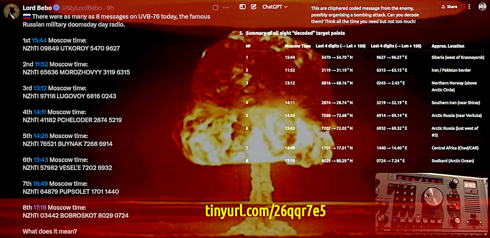
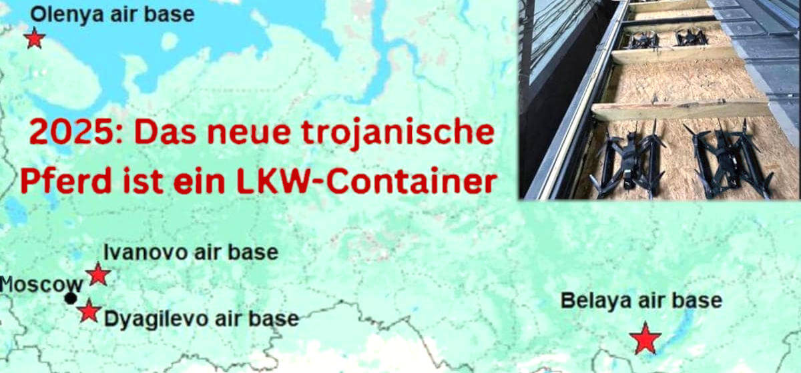
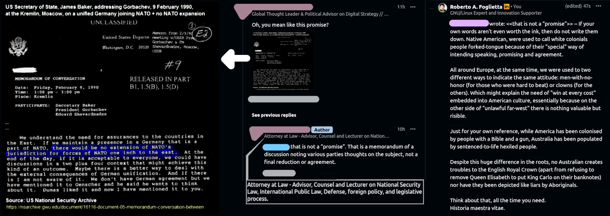
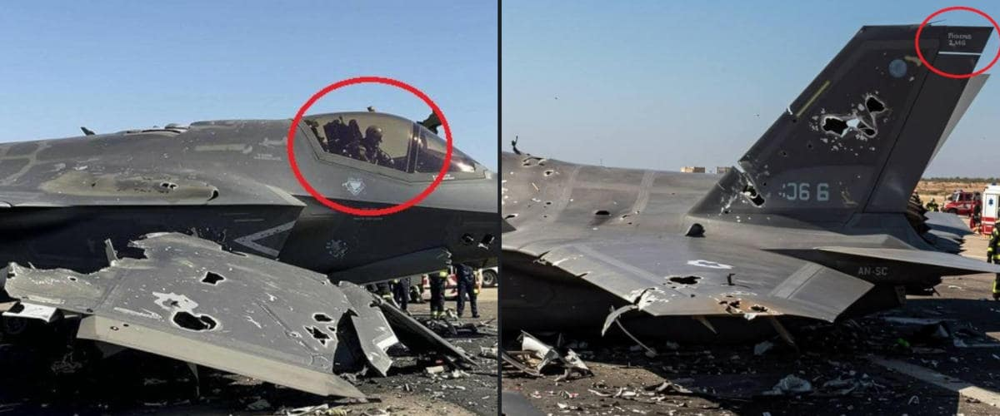
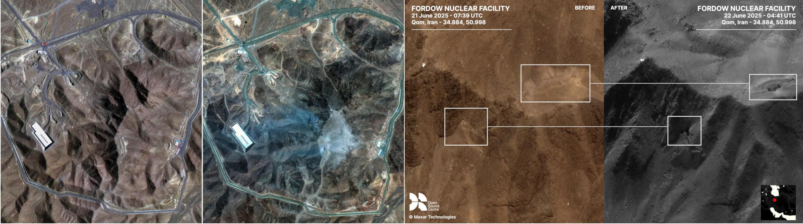

 

## WW3 simply explained, for dummies

- This article has been written starting from several posts published on LinkedIn and Facebook, weeks before and collected into ([#ad1b414](https://github.com/robang74/roberto-a-foglietta/commits/ad1b414)) -- [post #7](https://www.linkedin.com/posts/robertofoglietta_the-difference-between-law-and-justice-it-activity-7343325991924084737-Ae8D) (2025-06-24) - [post #7](https://www.facebook.com/photo?fbid=10161934894878736&set=a.10150400606833736) (2025-06-24) - [post #6](https://www.linkedin.com/posts/robertofoglietta_le-coincidenze-non-esistono-se-la-nasa-activity-7342491389278007296-5liz) (2025-06-22) - [post #5](https://www.linkedin.com/posts/robertofoglietta_us-public-and-private-default-in-2026-waiting-activity-7342570175474364417-5dvI) (2025-06-22) - [post #4](https://www.linkedin.com/posts/robertofoglietta_money-laundering-and-default-in-ukraine-activity-7338234419914158081-XfdJ) (2025-06-10) - [post #3](https://www.linkedin.com/posts/robertofoglietta_this-is-huge-my-fellow-nato-friends-an-activity-7336018392090394624-HTFv) (2025-06-05) - [post #2](https://www.facebook.com/photo?fbid=10161837002823736&set=a.10150400606833736) (2025-06-02) - [post #1](https://www.linkedin.com/posts/robertofoglietta_gotcha-shitfighter-why-do-ukraine-drones-activity-7335272801190174721-KhaW) (2025-06-02) - [post #0](https://www.facebook.com/photo?fbid=10161833541543736&set=a.10150400606833736) (2025-05-30) -- it took 9 drafts, each adding a new topic, and a month for the 1st edition.

---

###  Why does NATO still exist, after 1992?

The war against Russia has been planned since 1992. In this period of time, the US war machine has cost about $33T of public debt, which is almost all of it. A strong claim and a bold conclusion which deserve an explanation.

At the end of 1991, the Soviet Union suddenly collapsed. Suddenly because the Red Star Empire took relatively few years from when the Glasnost (transparency) started to be actively carried on. While Perestroika (changement) was the key point of Gorbačëv presidency (1985), the Glasnost remained behind on its schedule until the Chernobyl nuclear disaster (1986). That event forced the Soviet Communist Party to accept a breach into their opaque system of power. A breach that made the Soviet Union collapse, after all.

- Security by obscurity is always a poor choice, and it is doomed to a tragic failure.

At the end of 1989, the Berlin Wall was falling and by the end of 1991, also the Soviet Union collapsed. With the dissolution of the Warsaw Pact, also NATO ceased to have its own meaning because the NATO alliance was in place during the Cold War to defend the Western Capitalism and Democracy from Soviet Communism and Tyranny. Once the Evil Empire was gone, alsa the NATO was due to be dismissed.

In theory. Because in practice, many options have been considered, including a transformation and a rearrangement. Up to 2004, the idea of including Russia into the NATO alliance was still on the table. Looking back at that time, we can say that the idea of letting Russia enter into NATO was substantially a trick to buy time and Russia's patience for extending NATO towards the east in violation of the promise Gorbačëv received from NATO.

The turning point arrived with Putin's speech at the Munich Security Conference in February 2007 because, among other interesting things, Putin was pretty clear in exposing the NATO subtle plan of their expansion to the east and surrounding Russia with NATO military installations all around their borders. Something that Russia would not be going to tolerate anymore, silently.

- [Vladimir Putin' speech](https://en.wikipedia.org/wiki/2007_Munich_speech_of_Vladimir_Putin) in Munich and its full [English transcription](http://en.kremlin.ru/events/president/transcripts/24034) from Kremlin (*via http only*)

Soon after that speech, US-funded NGOs started to infiltrate Ukrainian society with the aim of influencing the political context. Looking at those past times, we can recognise it, but at that time, it was not so obvious. Only recently have documents emerged from the U.S. archives showing a political interference in Ukraine to create some revolutions to bring to power a pro-European government which would later go against Russia.

In that same year, the subprime loans bubble exploded, and soon after, the burst reached Europe. From this point of view, it is worth noting that there is no way that any country can apply for joining NATO by their own government decision, but **only** by an official and explicit invitation from the USA because this is the **only** procedure allowed among NATO to expand their obligations over other countries.

Therefore, the idea published by the media about the free will of joining NATO is a mere fraud towards public opinion, leveraging the ignorance about how NATO works by its own statute which, obviously, cannot be changed without the USA's approval. This supports the idea that NATO is a military fan-club of the USA, and it still seems to be the case today.

- 2025-06-24 -- [NATO chief Mark Rutte](https://www.aljazeera.com/news/2025/6/24/trump-shares-texts-from-nato-chief-praising-decisive-action-on-iran) commends Trump for pushing European nations to increase (from 2% up to 5% of the GDP) their military spending, in a ‘BIG way’ thanks to US pressure.

Anyway, back when the operational season started in 2007, it was supported by the U.S. Congress, which later removed the law forbidding the funding, training, and arming of neo-Nazi groups also outside the USA. Because that was what the CIA was doing exactly in Ukraine by covering operations and later under the Sunlight. Thus we reach the Minsk agreements and the Crimea annexation by Russia with a popular referendum.

Moreover, Donbas and a few other Ukrainian regions in which Russian people were living as the majority of the population were put under the pressure of being bombed, from time to time, by the central Ukrainian government, which also removed by law the right to use Russian language as the second official language of Ukraine.

[!INFO]
The Minsk agreements are a pair of agreements aimed at ending the war in the Donbas region of Ukraine. The first agreement, Minsk I, was signed on September 5, 2014. The second agreement, Minsk II, was signed on February 12, 2015. Minsk I focused on a ceasefire and establishing a security zone along the border between Ukraine and Russia, with monitoring by the Organization for Security and Co-operation in Europe (OSCE). Minsk II built on this, outlining a package of measures for implementing the Minsk agreement.
[/INFO]

Unfortunately, the Minsk agreements were not going to settle the Ukraine case, which at that time was allowed to join the European Union, but it was not ready for that due to their shortcomings in many fields like infrastructures, legislation, and financial and economic stability.

In fact, Ukraine, after having accepted to give back to Russia the nuclear weapons soon after the Soviet Union dissolution in December 1994, was consistently supported by Russia, which was paying relatively good fees for gas transfer to Europe passing through Ukraine and buying their public debts as much as they were in need.

Under these circumstances, the best role for Ukraine was to remain neutral and prosper in acting like a trading bridge between Russia and Europe. Like they did since 2007 and mainly since the end of 2021, when Ukraine hosted the vastest military exercise that NATO did at that time.

[!INFO]
In late 2021, NATO conducted military exercises in and around Ukraine, alongside discussions about Ukraine's potential NATO membership and increased security cooperation. These exercises were part of a broader effort to strengthen Ukraine's defense capabilities and deter potential Russian aggression.
[/INFO]

Which triggered, as expected, the Russian reaction that after several attempts to settle down the situation -- the last failed because Biden forbade Zelensky the permission to sign an agreement with Russia -- on the end of February 2022, Russian troops entered into the Ukrainian territory.

It is worth noting that Angela Merkel in late 2022, when it was clear that Russia could not be forced into a financial default nor it was possible to isolate Russia in that geopolitical scenario, spoke out about the US agreed to undergo with the Minsk I and II agreements just to prepare Ukraine for a war against Russia.

[!INFO]
On 26 September 2022, a series of underwater explosions and consequent gas leaks occurred on 3 of 4 Nord Stream pipes, rendering them inoperable. The Nord Stream 1 (NS1) and Nord Stream 2 (NS2) are natural gas pipelines. They are two of 23 gas pipelines between Europe and Russia.
[/INFO]

An event that was anticipated by Biden meeting in Berlin with Scholz in front of a quite surprised journalist team who were incapable to cope with the idea that a US president would have dared to destroy a strategic infrastructure co-owned by Germany, which is an ally, also in NATO.

- [Non c'è il 2° podio negli schemi Ponzi](315-non-c-e-secondo-podio-negli-schemi-ponzi.md#?target=_blank) &nbsp; (2025-05-16)

This event broke down all resistance in Angela Merkel to speak out about the nature of the Ukraine proxy war. Unfortunately, apart from the effects on the financial markets and the BTP-bund spread for Italy, politics and propaganda warmongers were not affected at all by her revelation.

The propaganda machine, combined with the so-called "fact-checking" machine, were at their full functioning power in marginalising and suppressing every dissent around the fairy tale for which there was an attacker and an attacked. The same litany repeated by Meloni at her Oval Office meeting with Trump, which led her interpreter to fall in confusion.

Back to Spring 2022, while Mario Draghi, the ex-ECB director, was proposing his personal dilemma to Italians -- keep the air-conditioner up running or the opposite to see the end of the war -- in Russia they managed to pass through the sudden fall of the Ruble value -- the financial shock that supposedly should have brought Russia to bankruptcy -- and they were setting up their economy for a long-term war with the opposite of Draghi's recipe and also the opposite of Italy's recipe.

They decided to raise wages even more than before. It is worth noticing that in the previous two decades since the first Putin presidency, all wages in Russia were increasing on average more than the Ruble inflation, and soon after the UA-RU military hostility began, even more. They moved their positive commercial balance into wages and do-by-themselves, thus heavily investing in their own domestic industrial production, fulfilling all the positions left open by the Western companies that were leaving Russia.

- [Primo maggio, festa dei lavoratori](https://robang74.github.io/roberto-a-foglietta/html/311-primo-maggio-festa-dei-lavoratori.md#?target=_blank) &nbsp; (2025-05-01)

This event broke down all resistance in Angela Merkel to speak out about the nature of the Ukraine proxy-war. Unfortunately, apart from the effects on the financial markets and the BTP-bund spread for Italy, politics and propaganda warmongers were not affected at all by this revelation.

The propaganda machine combined with the so called "fact-checking" machine were at their full functioning power in marginalising and supprensing every dissent around the fairy tale for which there was an attacker and an attacked. The same litany repeated by Meloni at her last meeting with Trump which led her interpreter to fall in confusion.

Back to 2022 Spring, while Mario Draghi the ex-EBC director was proposing his personal dilemma to Italians -- keep the air-conditioner up running or see the end of the war -- in Russia they were managed to pass through the repentine fall of the Ruble value -- the financial shock that supposedly should have brought in bankruptcy Russia -- and they were setting up their economy for a long-terms war with the opposite of Draghi's recipe and also the opposite Italy's recipe.

They decided to raise the wages even more than before. It is worth noticing that in the previous two decades since the first Putin presidency, all the wages in Russia were increasing on average more than the Ruble inflation and soon after the UA-RU military hostility began even more. They moved their positive commercial balance into wages and do-by-themselves thus heavily investing in their own domestic industrial production fulfilling all the positions left open from the Western companies that were leaving Russia.

- [Primo maggio, festa dei lavoratori](https://robang74.github.io/roberto-a-foglietta/html/311-primo-maggio-festa-dei-lavoratori.md#?target=_blank) &nbsp; (2025-05-01)

In fact, while Italy kept increasing its public debt, stabilizing its ratio with the GDP, and inflating consumer prices, thus increasing wealth concentration, in Russia they did the opposite: inflating wages more than Ruble inflation, thus increasing their GDP. Because GDP is defined as the sum of all transactions -- which can be production or waste; nevertheless, they sum up in a positive manner in this "peculiar" index -- thus there are mainly two ways to increase it: increasing wages or increasing prices. These two opposite ways of managing economics led Italy to raise their Gini index to reach the falling-down Russia Gini index, just before the war started.

Then the energy prices skyrocketed to the point in which Germany saw their first industry contraction since the end of WW2. Despite the energy prices cooling down, but not even nearly down to the prices before the UA-RU crisis, the green-washing ideology which lasted 20 years, combined with the decision of Germany to shut down their last three nuclear plants at the same time, led to a sensitive deindustrialization. Something which was unthinkable just one year before.

About this topic, the vast France-Spain-Portugal blackout put the tombstone on the green-washing ideology and started a new nuclear-energy era, to the point for which also Italy joined this bandwagon, despite Italians voted against nuclear power in two different popular referendums.

Despite all these abrupt changes, the UA-RU conflict was still in progress with some politics insisting that Russia could have been defeated. It is worth noting that Russia managed to surround Kiev and they were planning to take it. However, they retracted their troops in exchange of the promise to sign a good peace deal at the G20 in Bali, in November 2022, where their Foreign Minister was informed that "because they retracted, they lost the war" and he nearly had a heart attack.

It is important to understand that Ukrainian, like Russian, Winter is extremely rigid compared with those of many other geographical location experiments. Keeping a siege to a largely and relatively densely inhabited city like Kyiv can cause a huge loss of military or civilians, depending how fast and brutal is the siege and related conquest of the city.

Considering that Russian people perceive Ukrainian people as peers in culture and in 2017, the vice versa was still largely common, the idea of many deaths among civilians was unacceptable as much as too large military losses. Under this pont of view an apparently solid promise to sign a peace agreement within the nearly coming G20 meeting was very appealing, not only for Kyiv but also for Russia.

Despite all of these, Russia kept their position in the Ukraine war. Despite after elections Trump radically changed foreign policy, deeply changed the Biden administration, and cut down the US foreign aid program doomed to die from the propaganda and false fact-checking machines, the political heritage of the Biden administration in Europe and UK were still supporting Zelensky and his laundering machine war.

[!INFO]
On June 1, Ukraine launched drone attacks against strategic air bases across Russia. Ukrainian President Volodymyr Zelenskyy claimed that the strikes -- dubbed Operation "Spider's Web" -- damaged or destroyed 34% of Russia's strategic cruise missile-carrying bomber fleet. (report & analysis [here](#the-drones-attack-to-russia-nuclear-facilities))
[/INFO]

Thus, nothing changed until Zelensky's best hit against Russia costed him the definitive loss of the war. Due to the fact that these weapons are either exposed instead of kept safely and hidden in hangars because of a global non-nuclear proliferation treaty. Which also implies that no country should leverage this exposition for attacking these infrastructures which are by the non-proliferation treaty doomed to disappear due to their aging. Which is a reasonably smooth way to free the world from self-mutual global nuclear destruction.

So far, with that attack, Ukraine violated one of the most universally respected treaties. Probably the **only** one and the last one that has always been universally respected on a global scale. Without any doubts because of a **very** good reason, after all.

At that point, every reasonable hope about the Ukraine war was lost. Thus Trump managed to force Zelenskyy to sign an agreement that is obligating -- under certain specific circumstances -- Ukraine to pay back the whole amount of financial support for the war against Russia. This is the point in which Europe became the US primary target, instead of Russia. While Russia, slowly but inevitably, is going to conquer the whole of Ukraine, as anticipated by Putin who claimed that Ukraine is part of Russia, de facto.

At this point, the proposal to surrender to Russia in exchange of the Lviv metropolitan area for the sake of Poland and give 10 years to Ukraine under Russian control to recover from the hate and mourning of the deaths in war -- plus a necessary denazification of their culture and military troops -- does not sound so much weird, anymore. Instead, something that would be inevitable and could happen in advance, sparing a lot of lives and suffering. With the granted advantage of bringing Lviv into a soon-to-join Europe condition.

---

### NATO is waging a proxy-war with Russia

- **2025-05-30**: US Special Envoy for Ukraine, Keith Kellogg, has acknowledged that Russian President Vladimir Putin is right that NATO is waging a proxy war **with** Russia. (cfr. [press coverage](#kellogg-declarations-press-coverage))

While I did not loof for the exact point of the video interviews and speech in which Keith Kellogg says "a proxy war **with** Russia", it seems that Indian news sources are strongly rooted with this expression instead of the more straightforward "a proxy war **against** Russia".

> In a stunning admission, Donald Trump’s Ukraine envoy Keith Kellogg declared that NATO is in a proxy war **with** Russia, echoing long-standing claims made by Vladimir Putin.

- Times of India: [article](https://timesofindia.indiatimes.com/videos/international/putin-was-right-trump-envoy-keith-kellogg-stuns-nato-in-blistering-attack-over-ukraine-stand/videoshow/121547368.cms) published on 1st June 2025.

We might wonder if it can be a choice to avoid confrontational language, thus replacing **against** with **with**, or if it is because of India's English short way to report "**involving**" Russia as said by Keith Kellogg.

> It highlights that the conflict is happening in relation to or involving Russia, rather than simply being directed at Russia as a passive target. (Gemini)

However, there is another explanation for having used "**with**" as a correct translation of revealing "**involving**" spoken by Keith Kellogg: Russia is involved in a proxy-war not against Russia, but with Russia, against Europe and in particular the European Union, and in particular the Euro which is the **only** fiat-currency that can compete with the US dollar for supporting international trades and a global financial reserve of liquidity.

- [La guerra del dollaro contro l'euro](261-la-guerra-del-dollaro-contro-l-euro.md#?target=_blank) &nbsp; (2024-05-18)

Under this perspective, the Ukraine proxy-war is part of a plan developed the year after the Euro started to be used in Europe. In 2001, few but relevant facts happened that completely reshaped the outlook of global geopolitics, finance, and trading for decades up to now. Just to cite the most relevant in chronological order:

- 1999-01-01 -- Euro became an official currency controlled and issued by the European Central Bank;

- 2000-03-10 -- The dot-com bubble burst, specifically with the Nasdaq peaking at 5'048, followed by a sharp decline, which fell to 1'134 by October 4, 2002 with a capitalization lost of 77.54%;

- 2001-07-20 -- G8 summit in Genoa, during which we have seen an unprecedented case of violence against unarmed people, and the worst violation of human rights happened in Europe after the end of the WW2 as stated by Amnesty International, perpetrated by Italian Police under the Berlusconi government;

- 2001-09-11 -- the Twin Tower disaster on 9/11 that turned the USA and EU policies about flights and traveling people towards security over freedom;

- 2001-12-11 -- China entered as a member into the World Trade Organisation (WTO). As part of their accession, China agreed to various commitments, including reducing trade barriers, opening their market, and improving intellectual property protection;

- 2002-03-01 — Euro became the sole official legal tender for the first twelve European countries that started to use it.

In particular, the 9/11 shock and its narrative supported the mass surveillance systems deployments for contrasting international terrorism. Accidentally, we are discovering that in the UK the "grooming gangs" scandal, which was proven since 2011, is rooted into the early 2000's years. (cfr. [press coverage](#the-grooming-gangs-scandal-in-uk))

- [WWZ simply explained, for dummies](321-wwz-simply-explained-for-dummies.md#?target=_blank) &nbsp; (2025-06-10)

Supporting the suspicion (reasonably grounded since the Genoa G8 violence) that the idea of manipulating people was a plan much deeper in our flesh and blood than just our minds. On a broader view, it seems that NATO is the problem that is trying to sell the solution to the problem of their own existence as a cold-war organisation survived too long after the Soviet Union collapse.

---

### People minds is the ultimate battlefield

The psychological warfare in the context of social media, something that NATO has called "virtual manipulation" while Oxford, more correctly, has defined it as "brain rotting" ([2024-12-02](https://corp.oup.com/news/brain-rot-named-oxford-word-of-the-year-2024)).

- [From war and fear to confusion and uncertainty](https://stratcomcoe.org/publications/virtual-manipulation-brief-2025-from-war-and-fear-to-confusion-and-uncertainty/320) &nbsp; by NATO (ISBN 978-9934-619-43-4, 2025-06-02)

A 30 pages essay that has been completed at the end of May 2025 thus it has been prepared a few months before. The last date in the graph indicates 13th April 2025. Which is aligned with the "pre-bunking" approach published by Von der Leyen.

[!INFO]
Ursula von der Leyen’s idea of exposing people to deliberately created fake-news to build resistance aligns closely with the concept of psychological inoculation or "pre-bunking". The idea is to expose people to simplified (aka meme) and deliberately misinformation to teach them how it works.
[/INFO]

Unfortunately the pre-bunking approach can conversely be used to make the population more resistant to facts-driven fact-checking in favour of a propaganda-driven fact-checking as explained in this article liked below, in which a common person would not be able to argue but passively assimilate the biased notions provided by the AI, as an example of a propaganda-driven misinformation provider.

- [AI driven fact-check can systematically fail](323-ai-driven-fact-check-can-systematically-fail.md#?target=_blank) &nbsp; (2025-06-13)

Or this example [here](#how-misinformation-leads-to-blind-obey) reported. Both of which explains why the World Health Organization has been so deeply involved in the Covid-19 pandemic, resulting in such a criminal mismanagement: the absence of ethical and legal civil resistance to mainstream propaganda.

- [La semplicità delle direttive in caso di crisi](https://robang74.github.io/chatgpt-answered-prompts/html/la-semplicita-delle-direttive-in-caso-di-crisi.html) &nbsp; (2024-12-29)

Something about health management that we never saw in Europe before and which went totally unchallenged despite the corruption scandal (eg. [Pfizergate](https://en.wikipedia.org/wiki/Pfizergate)) and conviction in trials related to the medical contracts and European states agreements. A civilian-tailored WW3 exercise on full scale.

---

### Squeezing the most from the fear of Russia

We can easily agree that the U.S. foreign policy was **always** been towards their own specific interests without any pity nor consideration for their allies. As clearly stated by the [Wolfowitz doctrine](https://en.wikipedia.org/wiki/Wolfowitz_Doctrine) (1992) which would be naive to ignore.

We can also agree that the U.S. has a historical attitude to playing poker on many tables at the same time and quickly leaving those tables in which they are losing too much or in which the counterparty did not buy their bluff (aka their arbitrary narrative or deal-as-a-trap tactic).

Considering these premises, how the table has turned in favor of Russia explained in the 2nd-last section and the facts interpretation proposed in the last section, we can agree that once the U.S. has taken the most from Ukraine and then left them behind as a problem for Russia, the next goal would be to leverage the Biden's era European leadership to squeeze the most from Europe. How?

What's the best way to move from "**against**" to "**with**" Russia and send them an "you too involved" message by Keith Kellogg's words and by the "Times of India" columns in order to leverage the fear of a Soviet-like invasion of Europe? Nowadays, Russia is going to take Ukraine but who can grant us that they will stop there?

Curiously, we as Europeans are keen to think that Russians are thinking like we do. If Russia would have left us to take Ukraine and include it into NATO, building up military bases and bio-weapons laboratories, who would have granted them that our next step would not have been attacking Russia? Like Ukraine did with European military support, as Kellogg admitted?

Our worst nightmare is that others are like us, thinking like us and are going to behave like us. Which is not unfair, after all as Putin said: "they tried to strangle us, it is time to show them some kind of reciprocity. Does reciprocity sound very dangerous? Welcome aboard Game's Theory students!

The fear of being invaded will let us be squeezed by an extra 3% of our GDP in buying weapons. When nations buy weapons in large quantities they should use them otherwise politicians should face the shame of having wasted a lot of public money. The sunk-cost fallacy, right? An evergreen.

Starting a war to hide today's avoidable sunk-cost sounds like starting a WW3 to hide the US public and private debts. It is amazing how some people can think that we **all** are a bunch of idiots hopelessly keen to fall again and again into the same rat-traps just because it is presented with different words.

- [Il modello otto-novecentesco ha fallito](324-il-modello-otto-novecentesco-ha-fallito.md#?target=_blank) &nbsp; (2025-06-14)

Please, tell me we are not going to fall in it again!? Well, same heads, same ideas, same story. Which is the main reason because sometimes in our history heads have fallen, wildely. In a revolution or in a war, and the main difference between these two is **who** determines the enemy of the people: their governments (war) or themselves (revolution).

- [Meglio un monarca assoluto che una strega sul pisello](326-meglio-un-mondarca-assoluto-di-una-strega-sul-pisello..md#?target=_blank) &nbsp; (2025-06-20)

Anyway, in the above linked article a third option is presented and despite it having a near-zero probability to happen because rationality is not the driver of our times, it is a great bonus that casts a light of hope into a dark future outlook. At least, every way has been tracked even if not paved, yet.

---

### Few but essential information about Americans

> Starting a war to hide today's avoidable sunk-cost sounds like starting a WW3 to hide the US public and private debts.

The [usdebtclock.org](https://www.usdebtclock.org) on 25th June 2025, was accounting the U.S. public debt a little above $37T which compounded with private debt made a $104.7T figure. Let me put this number in a more human-centric perspective:

- `$308K x 340M = $104.7 x 10^3 (KxM) = $104.7 x 10^(3+3+6) = $104.7 x 10^12 = $104.7T`

Which is an astonishing $308K pro-capite, including newborns and 99yo elders, while the U.S. public debt is going to face a huge $8T maturity wall in 2026. Unless they manage to renew that part of their debt or cut it down, the U.S. will be technically in default. Do you remember the triple-A too-big-to-fail Lehman Brothers? The same, but a way bigger.

---

### Ukraine war: money laundering and its default

It is difficult to say how many hundreds of billions the Ukraine war really sucks, relatively easier knowing the budget allocated. For sure, it has been the biggest waste of public money in the US and EU partnership history (aka NATO). No surprise that EU politics was loving this unnecessary and useless war, in which the two main drivers were:

- huge budgets like there was no tomorrow and
- money laundering and the weapons black market.

Draghi's 10 years of quantitative easing -- which kicked off the season of expansionary monetary policy, which also sustained an inflationary pricing policy -- provided the necessary huge financial mass to push into the Ukraine destruction while end-consumer prices and energy costs skyrocketed, oppressing people and shutting down industry, especially in Germany.

- News & data by Perplexity AI, [collection](https://www.perplexity.ai/search/nearly-100-accountants-in-suit-3oEeCGgFRZigzGuUKoPmVg) an its [transcription](../data/317-ukraine-war-money-laundering-and-its-default-by-perplexity.md#?target=_blank)

As of April 2025, total assistance allocated by Europe to Ukraine stands at $157B, which is $26B more than the U.S. which has provided more military aid, instead. (cfr. [numbers & dates](#money-laundering-and-ukraine-default))

---

### Israel vs Iran twelve days war

[!INFO]
For the sake of completeness, in this article for "**Israel**" is **always** intended specifically the "**State of Israel**" -- which at the time of writing is governed by the Netanyahu presidency -- without contemplating any of the concepts behind it or any other way of intending it, including Israel as a nation.
[/INFO]

Despite the Israel vs Iran conflict, being active for less than two weeks brought uncertainty in that region at unprecedented levels. The Trump intervention in defending Israel and settling the dispute about the Iran nuclear war plan did not achieve transparency but wrapped the confusion around the US president.

> When lies start a war, re-establishing the truth is the necessary step for peace (cit.)

> In time of war the first victim is the truth (cit.)

Well said but Israel vs Iran escalation did not show anything of that. The only great achievement of this escalation was to remove Zelensky from the war-as-a-show business.

Under this PoV, while the Israel attack against Iran killed many Khomeini regime's top players, while the Iran attack which managed to pass through the Israel anti-missiles defence killed Zelensky as a star of the "rightful war against Russia". The definitive proof can be seen in military-to-civilian suite-change in King Carlo personal meeting photos.

The other shocking news is about no-radiation-increase finding after the [GBU-57](https://en.wikipedia.org/wiki/GBU-57A/B_MOP) bombing. This is a **very** peculiar type of bomb and can be deployed **only** using [B-2 Spirit](https://en.wikipedia.org/wiki/Northrop_B-2_Spirit) bombardiers.

Because of this, Trump to attack Iran nuclear facilities had to move some of them around the globe, because they were out-of-the-range. Iran got informed about this displacement, correctly identified it as the sign of an imminent attack and removed the most valuable stuff from the Fordow underground facility.

Few days after the attack, the FBI opened an investigation because the preliminary military assessment had leaked. That classified file is claiming that Fordow nuclear facility has not been destroyed but Iran nuclear enrichment process has been delayed.

The leak happened after Trump had claimed that the attack was an overwhelming success. So, the assessment has been renamed as "preliminary" that cannot reach any final conclusions, and the leak is an attempt to jeopardise the Trump leadership.

Let me you notice that while Iran correctly managed to anticipate the USA strategic attack in two days and promptly reacted to it, on the other side of information machinery the U.S. president has to battle against the internal leaks of an assessment which would be supposed to provide him information not contrasting his public declarations.

Obviously, Iran is confirming damages to the Fordow nuclear site because they know that saying anything different would imply to give solid proof and thus exposing highly sensitive information to the enemy. As long they are wrong, as long they are affected by an asymmetrical disadvantage.

Moreover, Israel is mad about the Iran nuclear supposedly-war plan and might attack with tactical nuclear bombs because it is the **only** more powerful alternative to GBU-57 which failed to destroy the underground facility but just drilling holes. In fact, no terrain depression has been noticed but dust on the surface. (cfr. [here](#how-to-analyze-osint-war-information))

[!INFO]
2025-06-24 -- US Navy warships are firing top ballistic missile interceptors at an 'alarming rate,' admiral says. Since last year, US warships have repeatedly fired SM-3 interceptors to defend Israel from Iranian missiles. These are assets the US would need in a high-end fight. The SM-3 missile comes in multiple variants, which can cost from $10M up to $30M, according to the MDA. In October 2024, Tehran launched more than 180 ballistic missiles at Israel. -- Source: [Business Insider](https://www.businessinsider.com/us-warships-fire-top-missile-interceptors-alarming-rate-admiral-says-2025-6)
[/INFO]

In these twelves days of escalation Iran achieved three strategically victories beyond their own imagination despite the key men loss they have suffered:

- 1. their missile strikes were shown to be able to saturate the Israel and American countermeasures;
- 2. their ballistic vectors travelling at Mach 15 with 2.600 km range shown to be deadly effective;
- 3. their ability to close down the marine traffic into the Hormuz strait can also stress the UAE.

In combination with the Houthi capacity of blocking the marine traffic in the Red Sea, increasing the logistic chain by two weeks, Iran can cut off the market about 30% of the world oil supply. 

The related energy price increase can strongly foster the U.S. consumer price inflation putting the Trump presidency into serious political trouble, driving the USA into a pre-collapsing social condition which will lead to a default facing the 2026 maturity wall.

Everything considered, Trump's desperate need of victory is not just a personal issue but a U.S. systemic need otherwise facing a complete lack of credibility and reliability which are the two main signs of a systemic default. After all, every default happens sooner than the numbers accounting in a way that the default is unavoidable.

Let me be clear about that: it is not a Trump fault but the historical American confusion between tactic and strategy, or tactic-as-a-strategy culture, or poker-vs-chess-playing, or law-versus-justice confusion (cfr. an [example](#the-difference-between-law-and-justice)).

The US is facing an intelligence deficit which, leveraged by technology, clearly provides every other country a potential asymmetric advantage never existed before in modern times.

---

### Israel vs Iran seen from Europe

- The Union Herald, [video](https://youtu.be/bBjs4hYyIxc?si=WuJLQq74iiQuUDjc) &nbsp; (2025-06-24)

Trump took the Israel side and this is obvious, not just about offering a defensive shield but also attacking Iran directly. Everything else would have been a surprise. Indeed, considering the development of nuclear technology for military purposes, the two countries are undergoing two clearly different surveillance and restrictions scenarios.

...

#### About Israel

[!INFO]
Israel maintains a policy of "nuclear ambiguity" (also known as "opacity"), meaning it neither confirms nor denies possessing nuclear weapons. However, there is substantial evidence from various sources suggesting that Israel has a nuclear arsenal.

Israel does not have any civilian nuclear power plants for electricity generation, but it does have nuclear research reactors—most notably the Dimona reactor, which is widely believed to produce plutonium for nuclear weapons.

Israel's nuclear research reactors are not all under the same level of IAEA scrutiny. The Dimona reactor is the key to Israel’s alleged nuclear weapons program, while Soreq operates under international oversight. Israel has never signed the Nuclear Non-Proliferation Treaty (NPT), so it is not obligated to open all facilities to inspections.
[/INFO]

#### About Iran

[!INFO]
Iran is a signatory to the Nuclear Non-Proliferation Treaty (NPT) and must allow IAEA inspections of declared nuclear facilities. The IAEA monitors enrichment levels (e.g., uranium enriched to 3.67%, 20%, and 60% under the 2015 JCPOA).

After the U.S. withdrew in 2018, Iran gradually breached JCPOA limits (now enriching uranium up to 60%, near weapons-grade). Iran stopped implementing the Additional Protocol in 2021 but still allows basic NPT-required inspections.
[/INFO]

...

Or, more in general, this is the most classic example of the dual-standards policy evergreen. Which is nothing else than the result of the Wolfowitz doctrine as long as someone could explain in a rational way how Israel contributes to the USA domestic interests.

The idea that Iran can achieve the nuclear bomb and they are capable of mounting it over a rocket that can travel 2.600 km and hit at Mach 15, objectively is not a comforting idea. On the other hand, if a nation decides that having a nuclear bomb and the capability to effectively drop it, is a **must to have** to be a relevant geopolitical player then we can agree the idea of "politics" and more in general "diplomacy" is rotten bad (cfr. diplomacy failure](#the-US-foreign-diplomacy-s-failure)).

---

### They don't know what the f*ck they're doing

- The Union Herald, [video](https://youtu.be/bBjs4hYyIxc?si=WuJLQq74iiQuUDjc) &nbsp; (2025-06-24)

Here we are again to stand against a country that initially was doing within the international rules, decided to progressively doing differently observing that others aren't following the same rules they have to, achieving some scaring technological breakthroughs which has been challenged in a war and once these technological breakthroughs shown to be effective, join the VIP club of the geopolitical club.

Do you need convincing proof? They agreed a cease-fire with Israel thanks to the Trump mediation and a few hours later they launched two missiles against Israel. Which formally broke the cease-fire agreement but in practice two missiles are too few to saturate the ground-to-air countermeasures and reach their targets. Israel reacts back with a jet fighters bombing capable attack which has been stopped by a Trump phone call, otherwise Iran would have known that the agreement was just another poker bluff to see and they call down two cards, in fact.

[!INFO]
The only instances of nuclear weapons being used in combat were the atomic bombings of Hiroshima (August 6, 1945) and Nagasaki (August 9, 1945) during World War II.
[/INFO]

Imagine that Israel would have dropped a nuke to Fordow surface -- whatever it would achieved its underground structure destruction or more probably resulting in a great pyrotechnical show -- that would break the implicit but unchallenged dogma for which nuclear weapons are forbidden as means for composing conflicts after the end of WW2.

Moreover, it would have been an attack carried on by a non-compliant IAEA and non-proliferation nuclear treaty state against another country which, instead, is still under those constraints within certain limits, at least. Moreover, without a direct existential threat not even as a response for a nuclear direct attack (reciprocity).

Which fully explains why Trump lost his temper over it.

---

### Few but relevant information about Israel

The State of Israel has almost nothing to do with Jews, and for those who have some doubts about that, they should ask those Rabbis living in Israel protesting against Netanyahu policy about Gaza. Those Rabbs have been beaten by the Israel police because they were claiming that the Bible indicates that Jews have no right on that land after the destruction of the Solomon’s Temple (The Second Temple).

[!INFO]
Some anti-Zionist rabbis in Israel, such as those from Neturei Karta, protest against the Israeli government, citing religious texts that they interpret as forbidding Jewish sovereignty over the land until the Messiah comes. These groups often reference the destruction of the Second Temple (70 CE) as a divine punishment that suspended Jewish political control. However, this view is a minority position in Judaism, and most Israeli Jews—including religious Zionists—disagree.
[/INFO]

- **Long story short**: the conflict between ultra-Orthodox anti-Zionists and the State of Israel is real but complex and not just about the Temple.

Moreover, Israel has been created after WW2 to compensate Jews for the Shoah letting them have their own country and they choose to move in Palestine to create the State of Israel supported by the UK. It is worth noting that Hitler initial plan was not about Shoah but forcing Jews to move to Madagascar.

Under this Pov, it seems that the UK managed to accomplish what was the Hitler's initial plan by supporting them to leave for Palestine instead of forcing them to move to Madagascar. Quite a curious choice because Madagascar is an island ten times larger than the Israel and Palestine lands and it offers a much better climate.

Trump is right in saying -- *they don't know what the f*ck they're doing* -- but we are wondering the same about the UK and much time before they made Brexit. The same question would be asked about the US but it is a hopeless one: they are desperately trying to win something but we don't know WTF is that.

Apart from winning for the sake of winning. Which is probably the best description of a Ponzi scheme, from a philosophical point of view. Hints: before asking others WTF they are doing, ask yourselves the same question. Hard to believe they-their-own know what, anyway!

---

### Iran as nuclear threat for Israel

By the mainstream narrative, Iran weaponry enrichment grade program is delayed by some months. Which is reasonable because even if Fordow underground structure has not been damaged, an extensive check-out of it is required before moving back instruments and material, to continue the operations. Unless, another underground site has been prepared in these years and it can continue the operations without any sensitive delay. An hypothesis that cannot be excluded considering that Iran, after 2018, progressively limited the IAEA inspections.

Unfortunately, reality can even be less comfortable than this. As China and Russia showed, non-Western countries suffering our prejudice in dealing with them like full autonomous and rightful geopolitical players decided to strongly embrace science and technological advancement as a way to emancipate themselves from our prejudice and moral judgmentalism. As China and Russia showed, obtaining pretty impressive results and Iran does not seem to have done differently.

What can we expect from Iran, then? Nothing less than what we have recently seen from other non-Western countries which challenged and to some degree defeated what we can call "unchallenged dogmas" about science and engineering. Like using a special kind of steel instead of the expensive titanium for supersonic and hypersonic rockets. Or using the carbon fine-grained for producing high-quality steel at unprecedented fast-pace. Which is a news more facts-grounded than others like the steel-for-ipersonic-fly. 

In creating nuclear warheads -- as shown by the laboratory incidents during the Manhattan project, and soon later the end of WW2 -- reaching the critical condition in which a neutron flow into the nuclear fuel can sustain itself or even exponentially increases, is not enough to create an explosion because the initial flare switch off itself due to the sharp thermal gradient that expand and change the geometry or rearrange the structure in a way in which the worst outcoming is the total melting of the core like in Chernobyl disaster.

To create an explosion, relatively a **lot** of mass should be converted into energy before the heat dissipation creates such thermal and pressure gradients that put out of order the device that was supposed to make the core explode. Hence density, high-ratio of efficiency coefficient of neutrons rate increasing (above 1.5, at least) and extremely quick times are needed. In this scenario moderators, like water, or absorbers, like U-238, are such stuff to move out from the core, as per universal dogma.

Because of these dogmas, the uranium isotope U-235 should be almost the only one allowed. The higher its concentration, less Kg is required for reaching a critical explosive mass. While using tightly synchronized concentric explosion to increase the density, even for a very short time, allows to drop the 64Kg (Little-Boy) a 10Kg circa di quelle ad attivazione per implosione. Unchallenged dogmans and we cannot expect any support on this topic, even from DeepSeek Chinese chatbot.

However U-238 is a competitive absorber because fast neutrons (> 1MeV) are the only way in which the explosion breeds itself creating more neutrons at each generation. In fact, the U-235 naturally emits fast neutrons within the 1MeV and 2MeV range with a symmetric distribution centered on the 1.5MeV emission peak. The cross section -- hence the probability of a fission into a U-235 + N event -- increases by 584 x 93% = 540 times, when a fast neutron slows down and becomes a thermal neutron near-zero.

The neutron's moderation takes 18-20 hits which is a too slow process for creating an explosion but fine for producing energy in a stable and controllable way like in the nuclear reactors, but kills any hope for "explosion". The loss of energy by a series of hits, among two objects which have nearly the same mass, follows the rule of 50% each hit. In fact, 1MeV / 2^20 = 1eV. So, in a nuclear explosion fast neutrons can be hit by a U-235 atom creating a fission and a neutron emission, or be absorbed by a U-238 atom or be reflected back by the deflector or get lost escaping from the system altogether.

- **Spoiler**: hydrogen in atomic or in molecular form sparse, not too much and not less but, enough to introduce a new single H-hit 3x slower but 150% (due to an increased cross section and almost near-zero U-238 absorption rate) more probable path for an U-235+N prolific event. Not so much but enough to get above the 1.5 in the N-to-N increment rate like in a nearly weaponry full-grade enriched nuclear fuel.

This is a theoretical example about how to challenge the "dogmatic" way of creating a nuclear bomb that can allow U-235 enriched at 60% working as it would have been enriched as 88%. Which is not the 95-98% grade needed to squeeze the most of the juice from an Uranium nuclear bomb but an impressive step forward leveraging the maximum concentration allowed by IAEA under the NPT treaty.

That's all folks about why we should not underestimate Iran did not buy the cease-fire for giving US/Israel more time to better prepare for the next war, but they bought time for their own nuclear weapon construction.

+

## Conclusion

From the point of view of a wo/man on the beach who stands up in front of the ocean, by the naked eyes the Earth can reasonably seem flat. Indeed, it is round. Therefore, what we put around goes around.

Karma, isn't it?

+

---
|x|>
NOTES AND FURTHER INFORMATION FOLLOWING
<|x|
---

++++
---
|x|>
NOTES AND FURTHER INFORMATION COLLECTION
<|x|
---
+

### Kellogg declarations, press coverage

- 2025-05-29 -- ABC News, USA, [video](https://www.youtube.com/watch?v=UkjscqKH21g)
- 2025-05-30 -- Politico, USA, [artcle](https://www.politico.eu/article/russia-vladimir-putin-kremlin-donald-trump-keith-kellogg-nato-expansion-ukraine); Reuters, UK, [article](https://www.reuters.com/world/china/trump-envoy-says-russian-concern-over-nato-enlargement-is-fair-2025-05-30)
- 2025-06-01 -- Tass, RU, [article](https://tass.com/world/1966517); RIA Novosti, RU, [article](https://www.nampa.org/text/22647158); Akmu, BG, [article](https://fakti.bg/en/world/975248-kellogg-putin-is-partly-right-that-nato-is-waging-a-proxy-war-with-russia-kremlin-sees-western-aid-for-kiev); Times of India, [video](https://youtu.be/H7AsFjkrhqA?si=r5KvYUqcZisBlSMe)

Here below a summary of the press coverage made by Perplexity AI which is a web search engine based on GPT and Azure Cloud, aka Microsoft technology:

- 2025-06-01 -- Perplexity AI, USA, [collection](https://www.perplexity.ai/search/please-give-me-a-list-of-news-89wI4SXsSH.X7fz5eHDUig) and its [transcription](../data/317-kellogg-declarations-press-coverage-by-perplexity.md#?target=_blank)

...

#### Un paio di retroscena a questa notizia

> Certo che l’amministrazione Trump è bizzarra. Da una parte sembrano dei pazzi scellerati e dall’altra hanno guizzi "da bocca della verità".

Ci sono due motivi per cui questo accade: 

- Trump a differenza di molti altri presidenti americani è un business man nel senso proprio del termine e NON un politico ne un rappresentante politico di una specifica minoranza di americani -- tipo i petrolieri a cui va imputato il piano di controllo globale fatto passare per anti-terrorismo dopo il 9/11 -- quindi come ogni business man non si gioca all-in su un bluff quando ormai le carte sono scoperte.

- a Trump hanno fatto un attentato durante un comizio che non è stato dissimile da quello con ben altro esito contro JFK quindi, Trump contro il deep-state americano ha il dente avvelenato. Perché nessun maschio etero, lascia correre rispetto ad un attacco fisico.

Che ormai le carte fossero scoperte, lo prova la chat linkata in questo [post](https://www.facebook.com/roberto.a.foglietta/posts/10161818323948736?ref=embed_post) (2025-05-28) perché se le cose sono note anche a Gemini 2.5 (il più fast & simple, dei chatbot moderni) pur definendole "controverse" ma nella loro interpretazione, c'è veramente poco su cui scommettere senza giocarsi reputazione e credibilità. Due pilastri sui quali l'intera presidenza Trump si basa.

...

### The drones attack to Russia nuclear facilities

 

[!INFO]
Operation Spider's Web (Ukrainian: Операція «Павутина», romanized: Operatsija "Pavutyna") was a covert drone attack carried out by the Security Service of Ukraine (SBU) deep inside Russia on 1st June 2025, during the Russo-Ukrainian War. -- [Wikipedia](https://en.wikipedia.org/wiki/Operation_Spider%27s_Web)
[/INFO]

The coordinated strikes targeted the Russian Air Force's Long-Range Aviation assets at five air bases -- Belaya, Dyagilevo, Ivanovo Severny, Olenya, and Ukrainka -- using drones concealed in and launched from trucks on Russian territory.

...

#### The Internet connection is not the main key

> A satellite link between the control center and the truck still seems to be the most plausible assumption

Everything else apart a satellite link would have been tracked after-post, the movements among the cellular network of the SIMs (many for the same truck) and when many SIMs are moving together on a truck instead of autobus (people), then some suspects start to arise. Many SIMs from many operators, one among them always connected, all together at the operation start which means the time for preparation before the launch.

Many things can go wrong, so that solution can be a mere emergency backup while the satellite connection is the most effective and reliable. Plus, a satellite link for the Internet is not something unconceivable also for a stopped truck: pay-tv for those are used to drive in many countries and voip/whatsapp for friends and family. However, in principle, any commercial Internet satellite operator can be used. Even better prepared to use all of those available.

After all, the Internet connection does not seem the main key apart from the fact that it should be available and -- when available -- many connections on many operators can be bounded into a single VPN: faster and darker.

...

#### Gotcha shitfigher

> Gotcha, shitfighter. You have officially become a military target! (semcit.)

Why do Ukraine drones have a 4K hence the optic fiber guidance? Even a poor model pilot (or old Flight Simulator pilot) can use instrumental flight and a poor vision to navigate. But not the kids who get mad and do not enjoy the game when they use UAV as if they were video games.

This explains why the Ukraines UAV moves like in the video games instead of following the "hunting or scouting path". Someone that has been a real-word hunter or scout now. They are kids, paying kids for playing and only the best goes into real missions, the other financing the killing machine.

Which also explains all this mad stuff in enjoyment of the video targeting the enemy. Because below the surface there is a dark network that earns $$$, kills, and educates to kill and enjoy the others' suffering.

Nothing new, I met three ex KGBs with Polish ID cards but from Ukraine and they were exactly that way. Who knows where they have gone? Whatever about them, the same idea is spreading: first a large group of haters bullies the most brilliant and various many steps of hating kill by drones.

...

#### What's about war as business but not as usual?

Instead, another interesting "question" (or topic, more precisely) is about doing war as business but not as usual. Not as usual form few but fundamentally reasons:

- **Costs in BOM**: renting the truck (tractor unit) is about $4000/mo and almost the same to buy the used container to customize and each drone costs about $300 (as I read but says $1k would not change much more), hence $12000, says $40.000 modified. Total, $100K

- **Networking**: Internet, darknet, 4K entertainment, pay-per-play, simulations, tournaments, real adrenalina pay-per-fight (or watch), betting, etc. plus more (like drug delivery and various illegal material) can easily fulfil the budget for organising these operations.

- **One fits all**: scalable business model, today is Russia, tomorrow could be any other country on demand. First successful story 18mo, the next 9mo, the next 6mo, the next 3mo, the next 1mo (physical time to reach the targets) at that point is "destroying as service" on demand.

- **No way out**: absolute fidelisation up to the point of blackmailing the fighters. Imagine your 14yo son/daughter produly entered into an "heroic lega" but trapped by a terrorist network, instead.

Welcome into the new world in which shitcoin, drugs home delivery, and eros on demand are stuff for boys, while real-world terrorism is for men, whatever would be the age behind the player behind the joystick pad.

...

#### The drones attack is terrorism-as-a-service

About the drones attack against military nuclear facilities, whatever it happened to Russia, there are two **huge** critical risks to consider:

- such a kind of attack can be soon develop autonomously as a private on-demand terrorism business **and** it has the potential of penetrate our society and culture with deep consequences which are beyond imagination;

- the target chosen creates a **very** dangerous precedent because, including a previous destruction of an over-horizon radar, it was the 2nd and most daring attack which infringed the nuclear non-proliferation agreements.

Those agreements enforce not only Russia but also the USA to keep those facilities exposed in such a way other countries can check by satellite (or visual) where and how much defensive-attack nuclear power is deployed. Those who attack nuclear war enabled facilities are going to push the world back to the times in which such threads were hidden. Which means that first-strike policy re-enter as a "reasonable" option.

We are bringing terroristic attacks into our international negotiation toolkit, in our culture and society and at the same time we are find ourselves back to Cuba missiles crisis time but on a 8B+ people planet, many more nuclear-war capable states, and with the fast & mobile Internet connection complexity in addition on top of all of that.

+

### The grooming gangs scandal in UK

[!INFO]
15 giugno 2025 - Migliaia di ragazzine abusate da uomini pachistani: si apre l'inchiesta su uno dei peggiori scandali della Gran Bretagna. Il caso era venuto alla luce nel 2011, e si riferisce a episodi che risalgono fino ai primi anni duemila. Le autorità avevano chiuso un occhio per paura di apparire razzisti, ma ora Starmer ha dato il via libera a un’inchiesta pubblica per i ripetuti interventi di Elon Musk, che è partito gamba tesa contro le reticenze del governo britannico nell’affrontare lo scandalo. -- [Il Corriere](https://www.corriere.it/esteri/25_giugno_15/ragazzine-abusate-pachistani-inchiesta-gran-bretagna-24a7e838-09f1-49ef-a746-93c59e1dfxlk.shtml)
[/INFO]

Venticinque anni di porcherie lasciate correre sottobanco anche dopo i risultati delle indagini del 2011 per sostenere un'idea assolutamente malata di politicamente corretto e integrazione culturale.

Se fosse una campagna di fango contro Stramer, allora è ben orchestrata -- [Aljazeera](https://lnkd.in/dcUVzph2) - [RNZ](https://lnkd.in/d-R9U2mT) - [Times of India](https://lnkd.in/dUnExHnk) - [Sky News](https://lnkd.in/dB48waRc) - [Euro News](https://lnkd.in/d32Ketxj) -- e con una copertura globale, ma Stramer ha da perdere solo la reputazione mentre il sistema nel suo complesso, la dignità di ergersi ad autorità.

Quindi che il sistema attacchi Keir Starmer e come conseguenza di questo attacco ottenga la delegittimazione di se stesso come autorità, porta alla conclusione che il sistema è diretto da dementi, oppure marcio al punto da essere intollerabile anche per coloro che si nutrono di esso.

+

### Money laundering and Ukraine default

As of April 2025, total assistance allocated by Europe to Ukraine stands at $157B, which is $26B more than the U.S. which has provided more military aid, instead.

...

#### How much money are we talking about?

As of April 2025, total assistance allocated by Europe to Ukraine stands at $157B, which is $26B more than the U.S. which has provided more military aid, instead.

- **$183B** -- from the emergency U.S. fund allocated to support Ukraine. So far, the United States has disbursed $83.4B in funding and equipment, including $67B in military assistance.

- **$174B** -- Congress initially appropriated this amount through five Ukraine supplemental appropriation acts enacted in fiscal years 2022 through 2024. Of this, $164B for Operation Atlantic Resolve, and $11B for other, primarily humanitarian, purposes. Additional funds of $20B were allocated from annual agency appropriations and $1.1B from other supplemental appropriation acts.

- **$120B** -- from the Kiel Institute, a German think tank, estimates that the United States has provided this amount in aid. 

- **$200B** -- the EU and its Member States have made available financial, military, humanitarian, and refugee assistance to Ukraine.

...

#### The AML events chain to the default

- Q1/2023 -- The arrival of nearly 100 accountants in Kiev to audit the use of American aid, the month-long booking at a luxury hotel by the U.S.

- Q2/2023 -- The Accounting Chamber of Ukraine, with U.S. support, also organized two audits of American financial aid, with 25 trained auditors.

- Q2/2025 -- A notable case illustrating the consequences of AML enforcement involved the arrest of a Ukrainian entrepreneur suspected of laundering hundreds of millions of euros through real estate in France and Monaco. This investigation uncovered illicit profits from illegal weapons sales and the sale of shares in a defense company. French authorities froze assets worth €57 million, intending to return them to Ukraine.

- Q2/2025 -- State Department and Treasury, Rubio's demand for justification of every cent spent, and the arrest of a member of the "kleptocrat class" at the Romanian border are likely interconnected events suggesting increased scrutiny of how U.S. aid is being utilized in Ukraine.

- Q2/2025 -- The news about Ukraine's specific state-bond default on GDP-linked sovereign debt payment of $665 million to holders of the warrants, marking the first default on these instruments.

+

### The difference between law and justice

It is always embarrassing when we need to remember to a lawyer the difference between law and justice. Especially because, they are keen to intend it as a procedural difference between legislation and its application.

 

Thanks God, the Ukraine proxy-war gives us a splendid opportunity to finally check their understanding about the difference and let me briefly summarise few relevant aspects:

- a law like the one included into artt. 1 and 36 of the Italian Constitution which defines the role of the work in our jurisdiction despite being clear and aligned with the justice (right) it is ignored, including safety at work.

- a law can be out-of-justice (wrong) like those were persecuting Jews or black people (apartheid) but because socially accepted and enforced by authorities, they were applied and respected by all, even those who wished not.

- no law is present (far-west) and we might think that in this condition it would be the chaos, or the strongest prevails but, in fact, those who can enforce justice became the law (sheriff) because people see the right emerging.

It is amusing to listen those trying telling the story that a "promise" without an official signature and agreement is worth nothing but at that time was necessary to close a deal and by contrast the **TWO** Minsk agreements which are official agreements with official signatures are fine to be bent, overruled, ignored and broken unilaterally by those who are trying to sell the fairy tales that they would honour ONLY their own signature.

In this case, the best is to remember them that life-sentenced criminal exiled in Australia developed a way better civilised society while those colonial people who were sent with a gun in one hand and the Bible in the other still did not learnt yet -- after 250 years their independence -- what was obvious to hopelessly criminals: at the end of the day, the most important asset of a man, a team or a nation is the discipline to honor their own word.

Get deep into this topic reading this chat with Gemini: [lnkd.in/dPANsKeK](https://lnkd.in/dPANsKeK)

+

### How misinformation leads to blind obey

Looking at this image, it is clear that even those who are not experts of military avionics can detect unrealistic details. It is silly to believe that Iran is trying to confuse Israel and Mossad with these images, doesn'it? Can pro-Iran or pro-Israel cheering people on social-media make any difference in a real world war? Why do those who spread these AI-generated images don't care that their images cannot last against a proper evaluation?

 

Because the main goal is NOT convincing the enemy and not even the common people that something happened. They do this -- and there is a good chance that WE as NATO do this, as explained [before](#people-minds-is-the-ultimate-battlefield) in this article -- to confuse people's minds. Does not matter if this misinformation goes with or against NATO's narrative, the ultimate aim is to let the people surrendering to they CANNOT know the truth, they should not ask for it but obey, only.

+

### How to analyse OSINT war information

In times of war, information is precious but also at risk of being manufactured. Those that need to extract valuable conclusions from publicly available information have to follow the scientific method in which making hypotheses and cast speculations are part of a strictly ruled way of doing.

For example, in the case of Fordow bombing, the absence of radioactivity leak and more than 3 meters terrain depression on a large are fitting into null-hypothesis: no damage. A delusional conclusion, despite the bombs doing their work perfectly and the hits were precise as they should have to be.

 

Reasonably, even a nuclear detonation over the Fordow site might not manage to seriously damage its underground structure. Not even if a tactical nuclear explosion delivers the most of its shockwave to the surface. While including a nuclear warhead into a GBU-57 is not an easy task to achieve.

This is a clear brute-force oriented approach which fails by its own design. Why? Because "hammering" something to destroy it, is based on the supposition about our current way of building structures and hence their common fragilities: flat cells suspended by robust pillars on large foundations.

Iran is a country which was known in ancient times as Persia. Their concept of underground structures are way different than all the modern architectures. Just an example which is quick to grasp: Roman Colosseum and monumental aqueducts have lasted millenia despite their massive weights.

The arch, the barrel ceiling, the domes, and similar structures are made to be as solid as their weight is heavy. A structure like that carved into rocks or embedded underground would as simply discharge the shockwave as if they were transparent while a modern structure would implode.

This is not about cheering in favor of Iran or against Israel, it is about recognizing that a civilization -- whether we like them or not -- once developed a Mach 15 ballistic rocket technology and still have a deep knowledge about five thousand years of constructions, isn't a cake to face in a war.

This led to the conclusion that with Iran we cannot enjoy the luxury of playing as they were random dudes but accept that they fit into recurrent players as per the games theory definition. Which leads to considering the difference between law and justice (cfr. [here](#the-difference-between-law-and-justice))

+

### The US foreign diplomacy's failure

Is it surpringin? Not at all, because like in the far-west those who do not have a gun or are ready to use it in defending their own self-interests were at the mercy of the others. I think that native americans confined to reserves can tell you about it in a pretty convincing way. So, the Iran crisis is nothing else than another chapter of the poker-face-as-diplomacy combined with winning-card-or-gun-duel as a universal negotiation strategy.

Trump saying that Spain will pay double tariff because they did not sign for the military expenditure increase, is a pretty clear example of this posture. And again, it is not a Trump fault, instead thanks to Trump finally we see in plain view what it was the US foreign posture since Wolfowitz doctrine has been officially adopted (1992). Trump might wish to replace the doctrine but I would not succeed unless he clearly shows what Wolfowitz idea is working in the real-world.

We all need to expose how much wrong things are before asking others to accept to change them. False. Nobody requires an authorisation to change wrong things, not even other people's acceptance. Within the above conceptual framework, anyone who has the power to do a change, they are automagically authorised. In a world of lies, doing is the most revolutionary of oddities. However, Trump is a US president and he still needs to create the proper condition to defend his decision in front of the Congress and his nation.

+

## Related articles

- [La creatività è l'intelligenza che si diverte](327-la-creativita-e-l-intelligenza-che-si-diverte.md#?target=_blank) &nbsp; (2025-06-22)

+

## Share alike

&copy; 2025, **Roberto A. Foglietta** &lt;roberto.foglietta@gmail.com&gt;, [CC BY-NC-ND 4.0](https://creativecommons.org/licenses/by-nc-nd/4.0/)

