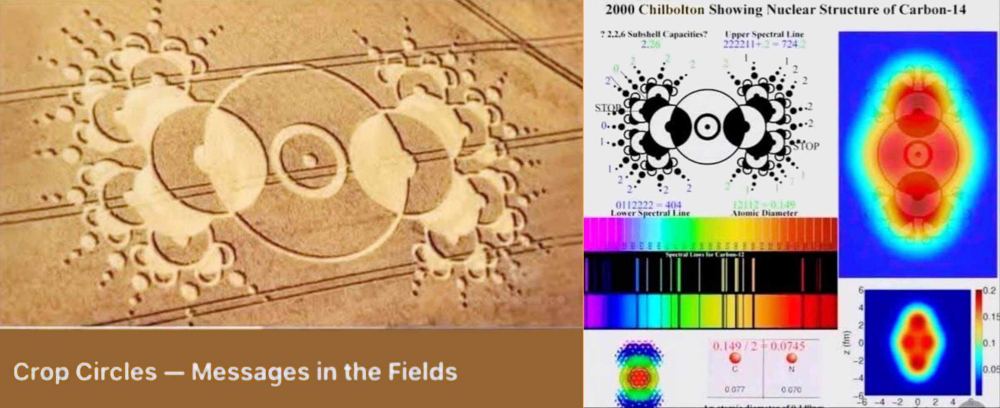

 

## A tragedy in the world of ufology!

Tragedy in the world of ufology and crop circle enthusiasts, after 25 years of intense investigations, the mystery is revealed to them with a post on Linkedin (here also reported on Facebook).

We (humans) have bent the wheat stalks, without breaking them, with the same principle by which we have known how to make wicker baskets for over 10 thousand years and we did it to raise funds for the SETI project as a publicity stunt!

Try not to laugh too much, if you can! {:-D}

---

### Whom pay for the science, get crop circles as bonus

Moreover carbon is the element of organic chemistry and hence the foundation of ALL the biologica life as we know today. Nice to know that such a drawing in the grain field has been drawn near Chilbolton Radio Observatory. This confirms that some who know QCD and the C-14 fundamentals were playing a trick to those who would have seen "circle in the crops".

Welcome in touch with nerd culture, we play tricks for the sake of entertaining ourselves and let common people wonder about extraterrestrial life. Who are those who are paying for running the observatory, after all.

My personal most warming welcome for those are producing food and paying for carrying on the society while we are busy doing science and tech. Crop circles are our personal sign of gratitude and we are glad to know that you like them so much.

Are you interested in getting into science? We have a LOT many of that coloured stuff, we also gave to that stuff very funny names like spectrum, phases diagram, frequency lines, etc.

...

Lanson Burrows Jones Jr. wrote: «*The material wasn’t removed, but rather flattened or rearranged, almost as if restructured from within.*» -- or simpler, bent like we usually do for producing a wicker basket! 🤗 

By who and why? Spoiler: by those were interested in marketing the SETI project. When there is a crime, the first people to be investigated are those who have a motivation. 😉 

----

### Twenty-five years of ufology, and speculations

You can see the traces of a large agricultural machine delimiting the crop circles and they are crossing it like lines into a notebook, the wheat stalks seem to be bent without breaking like the wicker in the wicker baskets, could it have been the steam that did it?

Twenty-five years of ufology, and speculations, did not achieve the secret of how to bend without breaking the wheat stalks, a technique (*) that was known ten-thousands years ago!

In the meanwhile technology made huge progress in every field, like a 2.5" HDD size 20GB weight 100gr. evolved in a 2TB NVMe M.2 SSD weight 10gr. Isn't better do science and tech than speculations? Sure, it is harder!

[!INFO]
**Note (&ast;)**

The earliest baskets, including what we might call "wicker" ones (although the materials varied depending on local availability), date back to about 10,000-12,000 years ago. There are finds that testify to their presence as early as the 9th millennium BC in Asia Minor and the Middle East (for example at Shanidar in Iraq, Çatalhöyük in Turkey, and in Upper Egypt). Some of the oldest complete baskets have been found in the Negev and date back to 10,500 years ago. -- Gemini 2.
[/INFO]

+

## Share alike

&copy; 2025, **Roberto A. Foglietta** &lt;roberto.foglietta@gmail.com&gt;, [CC BY-NC-ND 4.0](https://creativecommons.org/licenses/by-nc-nd/4.0/)

