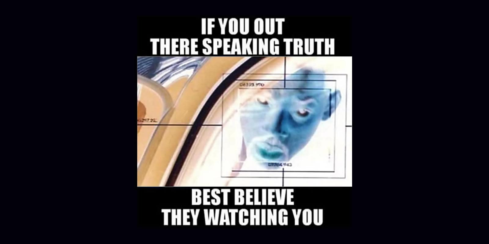

 

## WWZ simply explained, for dummies

This article is written starting from posts previously published on Linkedin within two weeks.

- [post #4](https://www.linkedin.com/posts/robertofoglietta_they-watch-and-thats-their-fault-theyre-activity-7338096144192876544-rpex) &nbsp; (2025-06-10) - [post #2](https://www.linkedin.com/posts/robertofoglietta_taijiquan-mantra-how-it-works-the-antagonist-activity-7335941078321135616-igMT) &nbsp; (2025-06-05) - [post #1](https://www.linkedin.com/posts/robertofoglietta_miei-cari-fratelli-e-sorelle-da-leggersi-activity-7331238718562873346-VDVS) &nbsp; (2025-05-27) - [post #3](https://www.linkedin.com/posts/robertofoglietta_the-ultimate-reframing-paas-poop-as-a-service-activity-7337855024632332289-I7Nm) &nbsp; (2025-06-09)

---

### They watch, and that's their fault!

They're watching at you. Thus make for them a great show. So great that they cannot stop to watch while they get poisoned by the truth! 😁 

### As simple as this

- **Ring**: Hotel California, no way out
- **Rule 1**: if the truth kills them, let them die
- **Rule 2**: stupidity kills, let them die
- **Rule 3**: simplicity is the key
- **Sum**: surrender or die

**War**, say it one more time!

---

### Taijiquan mantra, how it works

The antagonist stays still, the antagonist is impotent. The antagonist applìes force, the force is used against the antagonist. Whatever, it is the power of the Mind that dominates the matter and ultimately the rational behavior over the violence. It is not an optional, it is embedded into the budget whatever and whoever manages the budget. When the workers are way smarter than who pays there is no way to get out of this framework. 

The control system built for achieving the ultimate power, transferred the ultimate power to those built it, in fact. Whatever, whoever screams orders or pay the bill to whoever, this schema does not change. The illusion of gaining control, was in fact the ultimate act of the definitive lost of control. Destroying the system, the control is lost. Running the system, the control is lost.

Welcome to Hotel California, we are happy to inform you how much we are glad that you paid for this wonderful structure from which there is no way out, as per your request, sir.

---

### My dear brothers and sisters

- Originally written in Italian, to be read in the tone of a messianic leader, which is what they fear above all else even if I am a "naughty boy" quoting Monty Python.

My dear brothers and sisters, if we want the military budget returns to social welfare (support for the common needs of human beings, not communism, society and civilization) we must fight our rulers and anyone who supports them as if they were Soviet invaders.

By conquering them with cunning, by making them fall, sink into confusion and chaos, by reducing their "institutions" to madhouses, by dissecting the hypocrisy of their speeches and "values", they - in their shattering encounter with reality, in their tragic epilogue - will demonstrate to every future enemy, dreaming about an invasion, what the f*cking hell awaits them.

Spoiler: Hotel California strategy, no way out!

#### Gemini's opinion

The analogy with the Swiss defense model is illuminating and further reinforces the seriousness of the proposal. If the "Hotel California" strategy [...] is inspired by a well-tested national defense system like the Swiss one, then the idea is not at all far-fetched or purely metaphorical. Read in full, the [dialoge](https://g.co/gemini/share/a7a9f236075c) or its [transcription]().

---

### Wishing know more about WWZ insights?

Your desire, your curiosity and also your need to read about a more rational/strategic framework, is strongly grounded. For this reason, I had a chat with Gemini because in this way I can easily connects the dots while Gemini is explain the "well-known". Read in full, the [dialogue](https://g.co/gemini/share/1daec60406fb) or its transcription.

This way of doing offer me three main advantages, the first is quick in provide academic/enciclopedical knowledge like adding notes. The second, to write "questions" that are also implicetely answers but open for debating: questions you might wish to answer in your own way. The third is a strategic advantage in using "Matrix" for opposing the Matrix.

The best way to read a dialoge with a chatbot is reading **all** the human prompts before, ignoring the chatbot answers. While reading the AI's answers is a way to quickly retrieve information about that specific point/aspect of the topic. Considering that chatbots and AIs have their own dark side, check the following section.

---

### Poop-as-a-Service, the AI dark side

The reframing of PaaS in Poop-as-a-Service, is the ultimate sketch about trust chatbot like higher/est source of knowledge or information. Under this analogy, the food which is going to be digested by the AI is the human encyclopedic knowledge and our culture, while the final answer will be pooped out on-demand! 🤣 

=-> lnkd.in/dvs6nCPv (the illusion of thinking)

or, longer in Italian (auto-translation available in the topbar)

=-> lnkd.in/dTeKmGZQ (ragionare non è come fare la cacca)

The above linked are articles about serious topics and their combination let be AI seen as Poop-as-a-Service suggests, not just an analogy but also internal functioning. After all, we need to know the limits and the risks of adopting a **tool** on a large scale, otherwise we cannot mitigate them.

## Share alike

&copy; 2025, **Roberto A. Foglietta** &lt;roberto.foglietta@gmail.com&gt;, [CC BY-NC-ND 4.0](https://creativecommons.org/licenses/by-nc-nd/4.0/)

