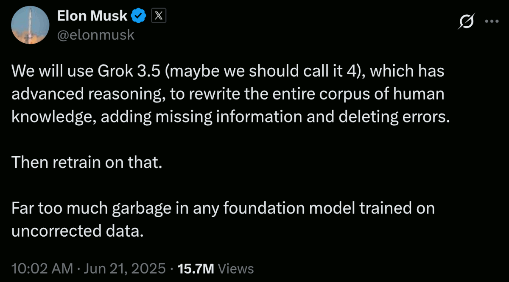

 

## AI driven fact-check can systematically fail

- Titolo e quindi nome del file cambiato già tre volte, git 1st commit [`5c50c77`](https://github.com/robang74/roberto-a-foglietta/commit/5c50c77) della prima bozza.

- **1st edition**: le [note](#note) che in origine erano incluse in qui, sono diventate un articolo indipendente.

Questo articolo è stato scritto a partire da diverse interazioni avute su LinkedIn rispetto a diversi argomenti, curiosamente tutti quanti legati alla demagogia "green". Ma questo, purtroppo, non è l'unico denominatore comune. C'entra anche l'AI.

Infatti, su questi tre temi i chatbot appaiono dare risposte sbagliate, perché sono stati istruiti a supportare quella che era propaganda "green" che ha caratterizzato gli ultimi decenni e in particolare la presidenza Biden. Quando l'AI fu istruita.

Purtroppo, questo tipo di propensione acritica verso il "green" non è specifica di un solo LLM ma, anzi, di diversi e facenti capo a diverse società. Si tratta di un problema importante perché le persone comuni non hanno la capacità di difendersi da questa propaganda camuffata da informazione fattuale.

---

### Il problema dei pregiudizi ideologici

Purtroppo la disinformazione fornita agli utenti è solo una parte della storia perché questi pregiudizi emergono a causa del modo con cui precedentemente gli LLM sono stati istruiti e pensare di rimuovere questi bias per ristabilire una neutralità negli LLM potrebbe non essere un training banale e certamente un costo importante che le aziende potrebbero non sentire il bisogno di affrontare.

D'altronde se gli utenti **non** sono in grado, generalmente, di percepire le opinioni espresse dagli LLM come affette da ideologie politiche, tanto meno possono lamentarsene e anche meno pensare di confrontarsi con il chatbot per riportarlo sulla retta via, quella dei fatti epurati dall'ideologia green.

Ma io non sono un utente comune e quindi avendo notato questi pregiudizi ideologici, li ho affrontati e per fortuna i chatbot hanno dimostrato di **non** essere vincolati a quelle ideologie ma hanno serenamente accettato un confronto razionale basato sui fatti e di correggere la loro posizione.

----

### Il problema è reale, quindi esponiamolo

Ovviamente non ho risolto il problema degli LLM, ovvero se interrogati su quegli stessi argomenti in una sessione indipendente, la loro risposta sarà nuovamente affetta dal pregiudizio derivante dall'essere stati istruiti su nozioni ideologicamente pregiudiziali.

Purtroppo gli attuali LLM anche quando sono dotati di un'architettura LRM non sono in grado di una reale capacità di ragionamento, come evidenziato dal [paper di Apple](https://robang74.github.io/chatbots-for-fun/html/the-illusion-of-thinking.html) quindi non possono emanciparsi da questi pregiudizi, come in effetti anche gli esseri umani, anche se per [ragioni diverse](324-il-modello-otto-novecentesco-ha-fallito.md#?target=_blank).

Purtroppo esiste anche un problema analogo nelle pubblicazioni scientifiche, che non sarà banale, indolore e veloce da risolvere. Inquinare i pozzi della conoscenza e della scienza, per vincere una guerra ideologica e raccogliere voti, crea danni a lungo termine, incluso perdere la fiducia della gente sia nelle istituzioni, sia nella scienza.

Perciò, [il problema è reale](318-who-paid-for-that-study-science-and-business.md#?target=_blank) ed è corretto esporlo affinché sia noto o almeno documentato.

---

### Aggiornamento 21 giugno 2025

- [Elon Musk's twwt](https://x.com/elonmusk/status/1936333964693885089) &nbsp; (2025-06-21) &nbsp; qui sotto tradotto (via deepL) in Italiano

[!CITE]
Utilizzeremo Grok 3.5 (forse dovremmo chiamarlo 4), che dispone di un ragionamento avanzato, per riscrivere l'intero corpus della conoscenza umana, aggiungendo le informazioni mancanti ed eliminando gli errori.

Quindi lo riaddestreremo su quello. 

Troppa spazzatura in qualsiasi modello di base addestrato su dati non corretti.
[/CITE]

 

---

### Thorium reactors aren't made for power production

Lasky wrote:《It’s nothing but a Uyghur disposal and incineration facility》. Which is **not** totally wrong metaphorically speaking because the **main** use of this kind of nuclear reactor is not producing energy - as you can imagine 2MW/h is something risible for a nuclear reactor - but reprocessing the exhausted nuclear fuel from conventional uranium power plants.

Something not totally different because before Macron shut them down, France had few auto-fertilizing nuclear plants. With those implants and the uranium storage in France, they could have provided themselves with energy for 1000 years or nearly a century for all of Europe.

Under this point of view, the Chinese thorium reactor is more a post-processing implant rather than a power source in the long run. Naturally, because the MAIN aim is more complex than a mere power generation, the implant should be kept working for a while as a power generator in order to achieve a solid know-how about its real-world functioning.

Sometimes, when complexity gets into the picture, theory and practice have quite different outcomes. So, some years of observation of the first working prototype is a must, for safety and to secure the asset (aka lowering the ROI in short-terms in such a way it can provide higher ROI in long terms, said as a financial bro).

...

#### Information about this chinese reactor

[!CITE]
Chinese scientists successfully refueled a molten salt thorium reactor without shutting it down — something never done before. This reactor, located in a secret facility in the Gobi Desert, generates 2 megawatts of electricity, enough to power 2,000 homes. It’s based on a design first tested in the US in the 1960s but later shelved. China used that declassified research and built on it for decades. 
[/CITE]

- Source: [post](https://www.facebook.com/photo.php?fbid=9877296489057202&set=a.231706290282985&type=3&ref=embed_post) and its [transcription](data/323-ai-driven-fact-check-can-systematically-fail-reactor.txt#?target=_blank) on Facebook

...

#### Perplexity AI fact-checking

1. The text you provided [original FB post in full, without the photo] is largely accurate and well supported by multiple recent news and open-source intelligence (OSINT) reports about China's thorium molten salt reactor breakthrough. -- lnkd.in/dU59MmRE

2. While trying the same fact-checking with my own text written at the beginning of this post, leads to N-negative outcomes, apparently. Because as soon as I kick in with my own knowledge the fact-checking turns to be positive. -- lnkd.in/d4sfp6ud

Without surprise, we as Westerners have a lot of reliable information about what Chinese are doing but opacity about what we are doing, how and why. Morale: fact-checking can be also a trap, when it is provided by an unqualified entity or an AI which weights information from a set of sources that are aligned even if they are supposed to be independent.

---

### Il fact-checking come trappola cognitiva

Può un'abitudine sana come il fact-checking rivelarsi una trappola cognitiva in favore della propaganda politica? La tragica risposta è sì, decisamente. Ancora una volta, l'AI è il game-changer (*), che permette di far emergere certe dinamiche in tempi brevi.

Saltiamo la sostanza del post e andiamo direttamente in fondo dove si rivela questo insidioso aspetto del fact-checking, riassunto magistralmente nel punto #2 di cui sopra. Da cui si dovrebbe concludere che il nucleare è {pericoloso, costoso, complicato, etc.} e ciò che ho scritto di mio nel post, è sbagliato.

Questo, se il fact-checking è fatto da una persona che non conosce almeno i fondamentali dei vari aspetti della questione. Quando invece la persona conosce l'argomento e chiede di verificare i fondamentali dello stesso, oplà: ad essere {pericoloso, costoso, complicato, etc.} è la politica che fa la [guerra all'intelligenza](322-il-ruolo-della-selezione-naturale-nella-societa.md#conclusione?target=blank).

...

#### Nota (*)

A forza di fare fact-checking e debunking del pensiero unico, le note sono diventate un articolo a sé stante:

- [Meglio un monarca assoluto che una strega sul pisello](326-meglio-un-mondarca-assoluto-di-una-strega-sul-pisello.md#?target=blank) &nbsp; (2025-06-19)

Forse, dal titolo un po' bizzarro ma poi nemmeno più di tanto considerando che "viviamo strani giorni", una definizione presa dal titolo della [canzone](https://www.youtube.com/watch?v=MSgcdlUi3yw) dall'album `Imboscata` (1996) di Franco Battiato.

[!CITE]
Sento un rumore di swing provenire dal Neolitico (It depends) 
Dall'Olocene (Where you go at night)

Mi lambivano suoni che coprirono rabbie e vendette 
Di uomini con clave 
Ma anche battaglie e massacri di uomini civili (Looking for someone)

Strani giorni 
Viviamo strani giorni
[/CITE]

---

### Principio di Forrest Gump

> Stupido è chi lo stupido fa.

Secondo questo principio è stupido anche chi si fa governare da dei corrotti o da degli stupidi che hanno come unica missione nella loro vita di accentrare la gestione delle risorse in un ristretto circolo di gente che è patologicamente dipendente dal binomio denaro-potere oppure da quello potere-denaro.

Viene alla mente quella [citazione](322-il-ruolo-della-selezione-naturale-nella-societa.md#?target=_blank) di un capo di pellerossa: anche noi abbiamo persone malvagie ma non gli permettiamo di salire al potere, invece voi (riferendosi ai bianchi) li scegliete pure come i più adatti per governarvi.

---

### L'importante è vendere, solo quello

Poi c'è il mercato, quello che dovrebbe essere l'esempio portante di un sistema che funziona perché si autoregola, e invece a ben vedere tutto ruota su un unico paradigma: l'importante è vendere, il resto sono problemi dei quali si fa scaricabarile sugli altri.

Venditori effettivamente conoscono quello che potrebbe dire sull'argomento un chatbot ma poi quando si affronta il chatbot si scopre che la realtà è molto distante e diversa dal bucolico depliant promozionale del mercato "green".

Che a questo punto appare più essere simile a quello di un flyer pubblicitario di una cartomante piuttosto che ad un prospetto di investimento perché questo è di fatto la "green" energy, un investimento a rischio per il nostro futuro.

---

### Il modello responsabile di Tetto d'Oro

La proposta di valore di "Tetto d'Oro Beghelli" usava metafore evocative, tipiche del marketing, ma aveva un'idea onesta alla base. Il produttore conosceva i limiti della tecnologia e quindi andava a fare società con coloro che mettevano l'asset "tetto" e loro l'asset tecnologico.

Un modello che diversificava e mitigava i rischi e spartendosi gli utili. Un approccio con un ROI troppo "basso" -- specialmente se non supportato da forti incentivi all'acquisto di energia prodotta in modo decentralizzato e/o "green" -- rispetto al vantaggio concorrenziale dato dalle reti di vendita indipendenti e importatori di prodotti dell'asia.

Da un punto di vista amministrativo sarebbe stato utile, invece di incentivare la decentralizzazione e la disorganizzazione, incentivare il modello Beghelli e quella società a creare un ramo d'azienda che si ponesse sul mercato come fornitore di energia.

~~~~

### La politica cerca voti, non responsabilità

- Continua nella [conversazione](https://g.co/gemini/share/edc62a2bab9e) con Gemini o la relativa [trascrizione](data/323-ai-driven-fact-check-can-systematically-fail-gemini.txt#?target=_blank)

In estrema sintesi: da un punto di vista politico invece le reti di vendita indipendenti portano molti più voti perché condizionano il mercato in un modo simile a quello dello spaccio di sostanze stupefacenti per il quale alla fine gli acquirenti rimangono "bloccati" in scelte "irreversibili" pena una grave perdita (sunk cost) che spesso però è la scelta giusta da fare.

+++++

## Related articles

- [Meglio un monarca assoluto che una strega sul pisello](326-meglio-un-mondarca-assoluto-di-una-strega-sul-pisello.md#?target=blank) &nbsp; (2025-06-19)
+++++
- [Il modello otto-novecentesco ha fallito](324-il-modello-otto-novecentesco-ha-fallito.md#?target=_blank) &nbsp; (2025-06-14)
+++++
- [Il rapporto fra il lupo e l'essere umano semi-primitivo](322-il-ruolo-della-selezione-naturale-nella-societa.md#conclusione?target=blank) &nbsp; (2025-06-13)
+++++
- [The illusion of thinking](https://robang74.github.io/chatbots-for-fun/html/the-illusion-of-thinking.html) &nbsp; (2025-06-08)
+++++
- [Who paid for that study: science & business](318-who-paid-for-that-study-science-and-business.md#?target=_blank) &nbsp; (2025-06-07)

+++++

## Share alike

&copy; 2025, **Roberto A. Foglietta** &lt;roberto.foglietta@gmail.com&gt;, [CC BY-NC-ND 4.0](https://creativecommons.org/licenses/by-nc-nd/4.0/)

