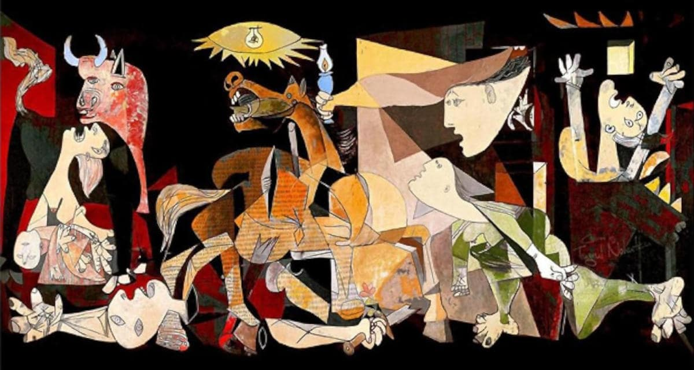

 

## Il modello otto-novecentesco ha fallito

---

Dubito che un risultato del genere, il fallimento della nostra civiltà, sia capitato per colpa degli insegnanti o addirittura alcuni di essi.

> Tragedy in the world of ufology and crop circle enthusiasts, after 25 years of intense investigations, and speculations, did not achieve the secret of how to bend without breaking the wheat stalks, a technique for doing wicker baskets that was known ten-thousands years ago!

- [Tragedy in the world of ufology](https://robang74.github.io/roberto-a-foglietta/html/319-a-tragedy-in-the-world-of-ufology.html) &nbsp; (date)

Piuttosto è il sistema educativo che, come lo stato, è rimasto ancorato ai paradigmi dell '800 quelli che erano funzionali alla Rivoluzione Industriale per la quale produrre utili idioti era un vantaggio

- [Propaganda e sistema educativo](https://robang74.github.io/chatgpt-answered-prompts/html/propaganda-e-sistema-educativo.html) &nbsp; (date)

Come per altro la NASA ha divulgato di recente ma già sapevano dal 1969 quando i militari misero fine ad un sistema sociale alternativo emergente perché lo consideravano inadatto per la guerra, allora quella fredda, e poi dopo il 1992 per quella che sarebbe venuta.

> In 1969, George Land and Beth Jarman check 1000+ kids with NASA's high-creativity test: 98% of 5yo were in. While only 2% of adults were in. From 98% to 2%, what happened? They have been educated. 
> 
> **Morale**: geniuses aren't rare, but buried.

- **Note**: the claims briefly reported above are from George "Breakpoint and Beyond" book (1992), and it presents a study which was never peer-reviewed nor published by any scientific journal. However the broader idea of a decline in creativity with age and formal education is supported by relevant studies, including those by J. P. Guilford (1950), E. P. Torrance (1968) and K. H. Kim (2006).

I militari, altra istituzione del '800 che anch'essa sta dimostrando tutta la sua inadeguatezza di fronte ad un mondo in cui è l'intelligenza e la creatività a costituire il potere del fare.

...

> Comunque l'ottocento non ha prodotto solo idioti.

Ogni epoca ha avuto i suoi grandi pensatori e la sua larga base di idioti. La questione però è diversa. Perché un filosofo dell'antica Grecia è ancora contemporaneo come pensiero (o può esserlo) mentre un pensatore dell'800 o del '900 non lo è? Una domanda decisamente intrigante, no?

Fondamentalmente la ragione è che il filoso dell'antica Grecia era secondo la nostra prospettiva un ateo perché gli dei dell'Olimpo erano delle caricatura delle vicende umane. Oltre al fatto che la società dell'epoca era estremamente basilare, il che portava questi pensatori a riflettere sulla natura dell'essere umano o sulla natura delle cose semplici. 

Entrambi questi aspetti non sono cambiati, perché l'essere umano nella sua natura non si è certo evoluto negli ultimi 20-30 secoli, non parliamo d Neanderthal vs Sapiens. Così come le cose basilari della vita, e della natura, sono rimaste le stesse. Mangiamo, dormiamo, ci accoppiamo, ridiamo, piangiamo, etc.

Il pensatore dell'800 o '900 è un uomo del suo tempo e parla di cose del suo tempo che NON è il nostro tempo. Questo è un fattore devastante quando si parla di modelli funzionali. Musica e arte, sono altro.

...

> Adesso ci mancava lo scoppio della guerra tra Israele e Iran.

Il default degli USA è inevitabile ed è previsto per il 2026 [link](https://www.linkedin.com/posts/robertofoglietta_doomsday-is-today-but-at-which-time-please-activity-7337952187270021122-NR6W).

Ogni tempo ha i suoi "valori" di riferimento. Noi viviamo in un mondo che ha cessato di esistere ma resta in piedi solo come un teatro mentre il nuovo mondo non è ancora sorto sulle rovine del precedente. Perché come diceva quello che hanno bruciato sul rogo con la lingua inchiodata: è ingenuo pensare che il potere riformi se stesso.

Si può sperare in tutto quello che si vuole, ma ci sono momenti in cui la storia svolta e persi quei momenti in cui ancora si poteva fare qualcosa certe "opportunità" o linee di universo sono ormai precluse. Ragionevolmente nella migliore delle ipotesi nei prossimi 30 anni moriranno così tante persone da cambiare il clima. Nella peggiore morirà lo stesso numero di persone ma in un tempo **molto** più breve.

Questo perché da una parte il potere non ha più la capacità nemmeno cognitiva di riformare se stesso e dall'altra parte perché coloro che hanno una certa lucidità non si prendono l'onere di sganciare per primi.

...

> È da milioni di anni che esiste l'uomo ed è sempre [...] sopravvissuto a sciagure naturali a guerre, pestilenze, [...].

Eppure nonostante ciò, mai come oggi l'essere umano, o anche alcuni di noi soltanto, hanno la capacità di portare su questo pianeta il livello di estinzione (che già in termini di biodiversità è epocale, il c.d. antropocene) ad un livello ancora più catastrofico quello della guerra nucleare.

Continua con Gemini sui commenti già scritti qui 

- [g.co/gemini/share/00024414efa8](https://g.co/gemini/share/00024414efa8) &nbsp; [trascrizione](data/324-il-modello-otto-novecentesco-ha-fallito-Gemini.txt#?target=_blank)

+

## Share alike

&copy; 2025, **Roberto A. Foglietta** &lt;roberto.foglietta@gmail.com&gt;, [CC BY-NC-ND 4.0](https://creativecommons.org/licenses/by-nc-nd/4.0/)

