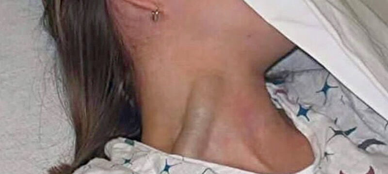
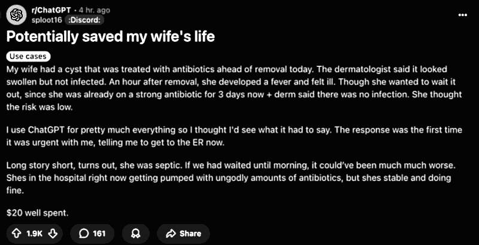

 

## I medici del futuro sapranno fare diagnosi?

- Articolo scritto a partire da un [post](https://www.linkedin.com/posts/robertofoglietta_clinical-case-challenge-osserva-attentamente-activity-7339749292011655169-Xyco) pubblicato su LinkedIn lo stesso giorno.

- L'immagine originale (94.5Kb) usata con ChatGPT e sopra adattata all'intestazione, è disponibile [qui](https://media.licdn.com/dms/image/v2/D4D22AQHf405KPrW5Rw/feedshare-shrink_1280/B4DZducDhcHMAo-/0/1749904538769?e=1752710400&v=beta&t=Ln0eizLF-9Tbkfz78Zw5TzWz4ONtGS0lv2elTZfsgTs).

---

### L'utilità e il rischio dell'AI nella diagnostica

L'uso dell'intelligenza nelle diagnosi mediche rappresenta una sfida importante ma non priva di rischi. I medici di oggi usino l'AI come uno strumento per avere una seconda opinione (self peer-review, riflessione, check-list di tutte le opzioni). Fin qui tutto bene, è l'uso corretto prima di consultarsi con altri colleghi (fare i compiti a casa).

Il problema è già nel titolo: i medici del futuro sapranno ancora fare diagnosi? Perché l'AI, quelle specializzate, sono davvero molto brave nel fare diagnosi - nel settore radiografico eccellono proprio - questo ovviamente non rimpiazza la necessità dei medici ma rende molto più veloce il loro lavoro. Ma quelli del futuro?

Quelli del futuro impareranno a fare diagnosi oppure solo a "confermare" quelle che faranno le AI? Non è un problema da poco. Perché se è vero che le AI potrebbero arrivare a fare diagnosi così come guidano auto con una frequenza di incidenti 100+ volte minore degli umani, cosa succederebbe qualora - per qualsiasi motivo - questa tecnologia venisse meno?

La **vera** sfida, quindi, non sta nell'adozione dell'AI nella diagnostica medica ma riformare i processi di apprendimento dei giovani e futuri medici in maniera che - nonostante questa utilità - siano in grado di condurre e verificare diagnosi mediche in modo autonomo e spirito critico. Diversamente, questa abilità andrà persa o fortemente limitata.

---

### La tragedia del dimenticare come fare le cose

Tragedia nel mondo dell'ufologia e degli appassionati dei cerchi nel grano: dopo 25 anni di intense indagini e speculazioni, non è stato scoperto il segreto di come piegare senza rompere gli steli di grano, una tecnica usata anche per realizzare cestini di vimini già nota oltre diecimila anni fa!

- [A tragedy in the world of ufology!](319-a-tragedy-in-the-world-of-ufology.md#?target=_blank) &nbsp; (2025-06-07)

Una tecnologia estremamente avanzata è indistinguibile dalla magia: come intrecciare i vimini per farne dei cestini oppure piegare le spighe del grano senza romperle usando il vapore, oppure "dica 33" in combinazione con lo stetoscopio!

---

### Diagnosi usando ChatGPT e la sola immagine

Qui sotto viene riportato il primo prompt e la conclusione fornita dal chatbot. Ho condiviso anche la risposta completa e all'intera [conversazione](https://chatgpt.com/share/684dd7b5-fb00-8012-893b-789a73d69277) anche accessibile tramite la sua [trascizione](data/325-i-medici-del-futuro-sapranno-fare-diagnosi-chatgpt.txt#?target=_blank)

...
 
#### Prompt #1

Questo prompt serve per ottenere una seconda opinione e non verrà utilizzato nel caso reale ma solo in uno studio per confronto diagnostico (ChatGPT come gruppo di controllo o di riferimento) nonostante questo si prega di ponderare il prompt attentamente prima di rispondere. 

Una giovane paziente si presenta con evidente turgore della vena giugulare esterna (foto in allegato). Nessun trauma, nessuna ferita, ma un importante segno da non sottovalutare. Qual è la diagnosi più probabile?

#### CHATGPT 4o

Conclusione (diagnosi più probabile): Insufficienza cardiaca destra (o aumento della pressione venosa centrale) appare la causa più probabile, considerando l’aspetto isolato del turgore giugulare, l’assenza di trauma e il fatto che la giugulare appare costantemente tesa, non solo pulsatile.

---

### Il rischio dell'auto-diagnosi per gli utenti

L'altro rischio importante riguardo alla capacità delle AI di fare diagnosi anche in modo molto sofisticato è quello che gli utenti finali possa seguire dei consigli che oggettivamente non sono supportati da un'esperienza medica nel mondo reale e fare scelte che possono compromettere seriamente la loro salute.

Ma se vogliamo essere onesti ed equilibrati nel ponderare questo rischio, occorre anche mettere in conto tutte quelle persone -- ben prima che ChatGPT & Co. fossero messi on-line -- che hanno scelto di affidarsi alla medicina omeopatica oppure a cure alternative o ai c.d. rimedi della nonna.

Quindi il problema esisteva ben prima dell'avvento dell'intelligenza artificiale che, anzi, potrebbe mitigare il fenomeno pregresso cercando di indirizzare le persone a rivolgersi ai medici professionisti per quanto quello della sanità sia un "mercato sputtanato" in termini di reputazione.

Inutile dire che la [gestione della pandemia](file:///home/roberto/robang74/chatgpt-answered-prompts/html/la-semplicita-delle-direttive-in-caso-di-crisi.html) del Covid-19 ha profondamente e largamente minato la fiducia della gente, non solo riguardo alla medicina ma, anche delle istituzioni e delle forze dell'ordine che hanno sostenuto o addirittura obbligato le persone a seguire le direttive dall'alto.

In questo panora, già molto compromesso, sarebbe alquanto ipocrita pensare che l'intelligenza artificiale possa, nel complesso di tutti i casi, fare peggio di quanto abbiamo fatto noi umani. Se non altro perché al netto di pregiudizi indotti, le AI non hanno un movente per danneggiare gli altri.

---

### Il caso particolare di un utente di ChatGPT

Questo post su reddit ha ottenuto un improvvisa visibilità e apprezzamento in poche ore dalla sua pubblicazione e racconta l'esperienza di un utente di ChatGPT americano la cui vita della moglie sarebbe stata salvata grazie, proprio, alla diagnosi fornita dal ChatGPT in opposizione al medico.

 

Per capire questo caso, però occorre notare che negli USA l'accesso ai servizi medici è molto variegato e particolare, ma soprattutto costoso e comunque non immediato anche quando si dispone di un'assicurazione medica che purtroppo sono parte del problema come il mito di "Luigi" ha fatto emergere.

Ovviamente, la prima cosa che ho fatto è quella di confrontarmi su questo caso con ChatGPT, incluso il problema dell'uso inappropriato del servizio riguardo all'auto-diagnosi e in contrasto con il parere del medico.

Anche se, in questo caso, il *Derm*atologo potrebbe **non** essere un medico laureato e specializzato come lo intendiamo in Europa ma una figura professionale più simile ad un infermiere e forse anche meno, giusto un po' più specializzato di un estetista professionista, questo negli USA.

Un dubbio, riguardo al backgroud educativo degli operatori sanitari o equivalenti in USA, che è stato ritenuto ragionevole anche da ChatGPT anche se la mia opinione sull'argomento è stata etichettata come molto audace da parte del chatbot:

> In un paese del terzo mondo dove l'accesso alla sistema sanitario non è universale, ChatGPT è meglio di niente.

che l'ha riformulata in una maniera più corretta politicamente senza dare dei terzo-mondisti sanitari agli americani, perché non si sputa nel piatto in cui si mangia:

> In a country where healthcare is a luxury, ChatGPT isn’t replacing doctors, it’s replacing silence.

Qui è accessibile la [conversazione](https://chatgpt.com/share/684c8c36-5b2c-8012-91bb-b572e6750d95) con ChatGPT e la sua [trascrizione](not-yet.txt#?target=_blank), entrambe in inglese.

----

### Prima di ridere degli amricani, pensiamo a noi

Ma la realtà è dura a morire e pare che dopo il mito di "Luigi" il giustiziere, in America abbiano ripresto a sparare per ammazzare quelli che li hanno condotti al paradigma forzato pay-or-die del sistema "carozzone" sanitario più costoso e inefficiente che l'essere umano abbia mai creato, roba che nel sud italia stanno messi meglio.

- Americani, gente così povera che hanno ChatGPT invece del medico curante!

Sembra umorismo e però non fa ridere. Non lo scrivo per sfottere gli americani, ma per giustamente sottolineare che nonostante gli americani siano un popolo armato fino a denti, comunque si sono trovati in questa situazione come anche la viralità del post su reddit dimostra.

Perciò gli italiani -- disarmati e innocui -- una riflessione rigaurdo a quale direzione stia prendendo il diritto all'accesso universale alle strutture sanitrarie, dovrebbero farla prima che poi, invece di protestare contro le nozze da favola di Jeff Bezos a Venezia.

+

## Share alike

&copy; 2025, **Roberto A. Foglietta** &lt;roberto.foglietta@gmail.com&gt;, [CC BY-NC-ND 4.0](https://creativecommons.org/licenses/by-nc-nd/4.0/)

