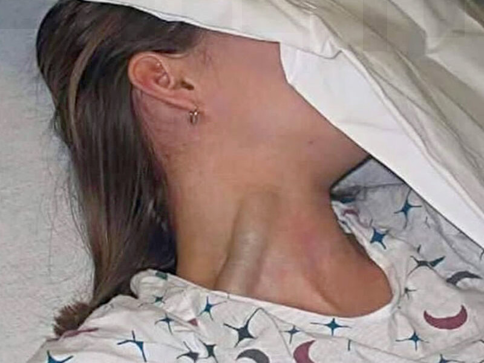

 

## I medici del futuro sapranno fare diagnosi?

- Articolo scritto a partire da un [post](https://www.linkedin.com/posts/robertofoglietta_clinical-case-challenge-osserva-attentamente-activity-7339749292011655169-Xyco) pubblicato su LinkedIn lo stesso giorno.

- L'immagine originale (94.5Kb) usata con ChatGPT e sopra adattata all'intestazione, è disponibile [qui](https://media.licdn.com/dms/image/v2/D4D22AQHf405KPrW5Rw/feedshare-shrink_1280/B4DZducDhcHMAo-/0/1749904538769?e=1752710400&v=beta&t=Ln0eizLF-9Tbkfz78Zw5TzWz4ONtGS0lv2elTZfsgTs).

---

### L'utilità e il rischio dell'AI nella diagnostica

L'uso dell'intelligenza nelle diagnosi mediche rappresenta una sfida importante ma non priva di rischi. I medici di oggi usino l'AI come uno strumento per avere una seconda opinione (self peer-review, riflessione, check-list di tutte le opzioni). Fin qui tutto bene, è l'uso corretto prima di consultarsi con altri colleghi (fare i compiti a casa).

Il problema è già nel titolo: i medici del futuro sapranno ancora fare diagnosi? Perché l'AI, quelle specializzate, sono davvero molto brave nel fare diagnosi - nel settore radiografico eccellono proprio - questo ovviamente non rimpiazza la necessità dei medici ma rende molto più veloce il loro lavoro. Ma quelli del futuro?

Quelli del futuro impareranno a fare diagnosi oppure solo a "confermare" quelle che faranno le AI? Non è un problema da poco. Perché se è vero che le AI potrebbero arrivare a fare diagnosi così come guidano auto con una frequenza di incidenti 100+ volte minore degli umani, cosa succederebbe qualora - per qualsiasi motivo - questa tecnologia venisse meno?

La **vera** sfida, quindi, non sta nell'adozione dell'AI nella diagnostica medica ma riformare i processi di apprendimento dei giovani e futuri medici in maniera che - nonostante questa utilità - siano in grado di condurre e verificare diagnosi mediche in modo autonomo e spirito critico. Diversamente, questa abilità andrà persa o fortemente limitata.

---

### La tragedia del dimenticare come fare le cose

Tragedia nel mondo dell'ufologia e degli appassionati dei cerchi nel grano: dopo 25 anni di intense indagini e speculazioni, non è stato scoperto il segreto di come piegare senza rompere gli steli di grano, una tecnica per realizzare cesti di vimini nota già diecimila anni fa!

- [A tragedy in the world of ufology!](319-a-tragedy-in-the-world-of-ufology.md#?target=_blank) &nbsp; (2025-06-07)

Una tecnologia estremamente avanzata è indistinguibile dalla magia: come intrecciare i vimini per farne dei cestini oppure piegare le spighe del grano senza romperle usando il vapore, oppure "dica 33" in combinazione con lo stetoscopio!

---

### Diagnosi usando ChatGPT e la sola immagine

Qui sotto viene riportato il primo prompt e la conclusione fornita dal chatbot. Ho condiviso anche la risposta completa e all'intera [conversazione](https://chatgpt.com/share/684dd7b5-fb00-8012-893b-789a73d69277) anche accessibile tramite la sua [trascizione](data/325-i-medici-del-futuro-sapranno-fare-diagnosi-chatgpt.txt#?target=_blank)

...
 
#### Prompt #1

Questo prompt serve per ottenere una seconda opinione e non verrà utilizzato nel caso reale ma solo in uno studio per confronto diagnostico (ChatGPT come gruppo di controllo o di riferimento) nonostante questo si prega di ponderare il prompt attentamente prima di rispondere. 

Una giovane paziente si presenta con evidente turgore della vena giugulare esterna (foto in allegato). Nessun trauma, nessuna ferita, ma un importante segno da non sottovalutare. Qual è la diagnosi più probabile?

#### CHATGPT 4o

Conclusione (diagnosi più probabile): Insufficienza cardiaca destra (o aumento della pressione venosa centrale) appare la causa più probabile, considerando l’aspetto isolato del turgore giugulare, l’assenza di trauma e il fatto che la giugulare appare costantemente tesa, non solo pulsatile.

...

+

## Share alike

&copy; 2025, **Roberto A. Foglietta** &lt;roberto.foglietta@gmail.com&gt;, [CC BY-NC-ND 4.0](https://creativecommons.org/licenses/by-nc-nd/4.0/)

