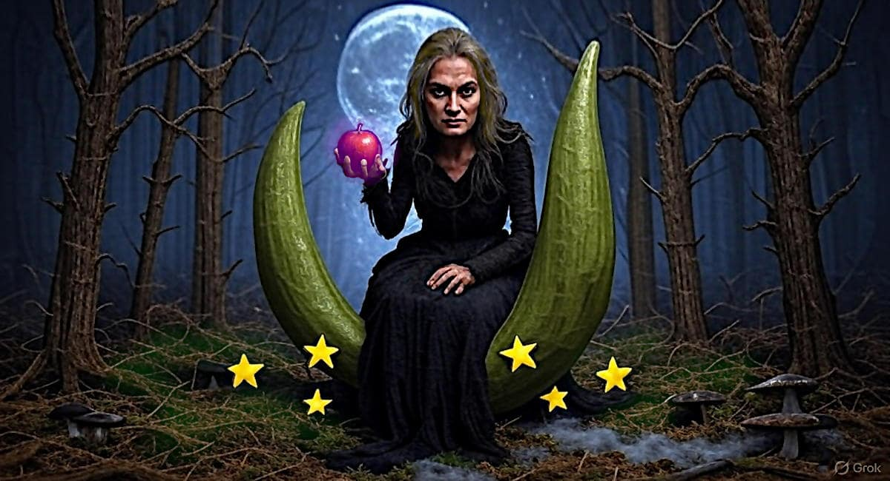

 

## Meglio un monarca assoluto che una strega sul pisello

- **1st draft**: articolo in scrittura, emerso da una serie di note scritte per un articolo precedente

   - [AI driven fact-check can systematically fail](323-ai-driven-fact-check-can-systematically-fail.md#note?target=_blank) &nbsp; (2025-06-13)

---

### Nota [³]

Perché per quanto possa apparire "strano", sono le dittature e in particolari quelle soft (come quella Cinese) che costruiscono il consenso marginalizzando le opinioni "dissidenti" mentre in [democrazia](302-politics-and-democracy-for-dummies.md#?target=_blank) la libertà di parola non è solo un diritto ma un fondamentale del dibattito.

- Una monarchia assoluta sarebbe più onesta, almeno la gente saprebbe come viene governata [⁴]

Se invece di una monarchia assoluta ci fosse una democrazia parlamentare, nella quale il Parlamento è il luogo deputato a gestire il confronto democratico e a fornire le direttive generale di governo mentre il monarca si occuperebbe delle eccezioni, saremmo tornati indietro rispetto al concetto di Repubblica Democratica fondata sulla Costituzione Italiana ma paradossalmente avremmo fatto un passo da gigante in termini di pluralità e partecipazione.

Ci troviamo in una condizione politica, in Italia e in Europa così ridicola da essere assurda: in cui i cittadini dovrebbero fare una rivoluzione per instaurare una monarchia, che non esiste in quanto tale e che quindi dovrebbe essere creata dal nulla, per avanzare in termini di stato di diritto.

---

### Nota [⁴]

In realtà l'idea di fare una rivoluzione popolare per passare da una dittatura di fatto, seppure soft ma comunque opprimente, ad un monarca assoluto che poi sviluppi una monarchia parlamentare, quindi una monarchia parlamentare costituzionale, per poi giungere ad una federazione europea in stile elvetico è meno assurda di quanto possa apparire.

Perché nell'ambito della storia dell'Europa, le dittature hanno sempre condotto o a una guerra o ad una rivoluzione violenta, quindi un bagno di sangue. Di solito le guerre ad un periodo di maggiore libertà, mentre le rivoluzioni violente ad una restaurazione (Napoleone). Però la WW3, la guerra nucleare, non è un'opzione di reset accettabile.

In questo contesto la rivoluzione non porterebbe alla distruzione dell'accentramento di potere ma ad una sostituzione del vertice e della direzione di governo. Quindi sarebbe una rivoluzione minimamente distruttiva.

Un catarsi del potere, che non riforma se stesso -- ingenuamente. impossibile -- ma viene riformato dal suo interno per collasso istituzionale e quindi rivoluzione al vertice. Sotto questo punto di vista "rivoluzione" è pure un termine "overkill", basta uno sgambetto ben fatto!

Un'idea che appare di primo acchito bizzarra, ma che invece ha un suo solido fondamento razionale. Certamente è un azzardo, ma le alternative non paiono migliori. D'altronde l'atto scatenante è uno sgambetto agli attuali vertici europei [⁵], una cosa -- Buona e Giusta [&trade;] -- che andrebbe fatta a prescindere [⁶].

---

### Nota [⁵]

D'altronde l'Unione europea come la conosciamo oggi è un carrozzone burocratico che impantana l'impresa e saccheggia i cittadini a favore della militarizzazione della società, oltre ad essere inutile funzionalmente. In particolare riguardo all'ultima informazione:

[!INFO]

Il Consiglio d’Europa (mappa blue/grigio) -- da NON confondere con il Consiglio dell'Unione Europea (mappa su globo) -- è un’organizzazione internazionale autonoma, estranea all’Unione Europea, fondata nel 1949 e composta oggi da 46 Stati membri. Il suo obiettivo principale è la promozione dei diritti umani, della democrazia e dello Stato di diritto in Europa. Ha sede a Strasburgo.

Il mercato europeo comune (MEC) si riferisce al mercato unico (mappa con viola) dell'Unione europea (e, prima, della Comunità economica europea, CEE), la cui creazione era uno degli obiettivi fondamentali del trattato di Roma – firmato il 25 marzo 1957 ed entrato in vigore il 1º gennaio 1958 – che istituì la CEE. L'espressione veniva inoltre spesso utilizzata come sinonimo di CEE.

Il mercato comune si basa su quattro libertà non imprenscindibili per averne accesso effettivo che si possono riassumere in due punti:

- libera circolazione delle persone (accordi di Schengen per i cittadini e accordo di Dublino per gli immigrati e clandestini);

- libera circolazione dei capitali, servizi e delle merci (mercato unico, senza dazi doganali interni, banca centrale europea);

Sulla disciplina della concorrenza e sulla limitazione degli aiuti statali alle imprese.

L'Unione economica e monetaria (UEM) dell'Unione europea (mappa colorata) è un termine ampio: include l'insieme delle politiche fiscali, valutarie, concorrenziali e monetarie messe in coordinamento dal luglio 1988 con lo scopo di avvicinare le rispettive economie degli Stati dell'allora Comunità europea. Un momento importante, che assunse anche un valore simbolico del processo, fu l'adozione di una moneta unica europea, l'euro, nel 1999, in sostituzione delle rispettive valute nazionali da parte degli Stati membri dell'Unione europea. Si ebbe così una politica monetaria comune sotto il controllo della Banca centrale europea (BCE), dando vita alla cosiddetta eurozona.

[/INFO]

Da queste informazioni si desume che se anche l'Unione Europea (EU) -- come per magia -- cessasse di esistere improvvisamente, ben poco andrebbe perduto a parte il gigantesco sunk-cost di aver creato una macchina essenzialmente burocratica che avendo tradito l'ideale originale ha avuto l'infausta supponente arroganza di poter dominare la scena politica invece di creare una federazione europea sul modello elvetico.

- **Extreme Refactoring**: replacing, reshaping, resizing, etc. all the system units, one by one, while the system is alive in production. In italiano: fare a pezzi e riassemblare in corsa. Roba che Transformer spostati!

La magia non esiste, vero. Però il WHO è uscito di scena quando ormai si dava per scontato che avrebbe controllato la sanità globale. Uguale la macchina di propaganda DEM-woke-Hollywood. Da marzo 2022, fate un riflessione su quante "entità" sono scomparse come ombre (o evaporate come nebbia) proprio al culmine, o ad un passo, della loro vittoria totale.

---

### Nota [⁶]

Per quanto riguarda fare lo sgambetto ai vertici dell'Unione Europea, non è nemmeno cosa che trascenda dalla giustizia o che richieda chissà quale macchiavellica contorsione politica, è sufficiente bastonare big-pharma affinché ci permetta di fare procedere con la condanna già emessa sulle modalità di acquisto dei vacchini covid, e quindi giungere ad un processo in stile Norinberga II anche se più probabilmente si terrebbe a Ginevra, per la **criminale** gestione della pandemia Covid-19.

- [La semplicità delle direttive in caso di crisi](https://robang74.github.io/chatgpt-answered-prompts/html/la-semplicita-delle-direttive-in-caso-di-crisi.html) &nbsp; (2024-12-29)

Sicché c'è già tutto e tutto sarebbe a norma di legge oltre che un atto di giustizia dovuto. L'unica cosa che ancora manca, è non averlo già fatto anche se sarebbe nostro interesse di europei che si fosse fatto alla conclusione del primo mandato della Presidenza della Commissione Europea di Ursula Von der Leyen. Per pura coincidenza il *cattivissimo* e *odiatissimo* Putin [⁷] ha scatenato una guerra in Ucraina che ha accelerato la militarizzazione e bloccato il cambiamento.

A pensare che se la Russia, come ci avevano decantato, fosse fallita in poche settimane dopo l'*invasione* dell'Ucraina sotto il mostruoso peso delle nostre sanzioni occidentali, ora avremmo il gas russo gratis e l'Europa sarebbe stata liberata dal pensiero unico mentre lo scandalo della seconda presidenza VdL sarebbe finito per essere giudicato in tribunale.

- [Long Live Novichok!: The British poison which fooled the world](data/long-live-novichok-book-presentation-on-linkedin.txt#?target=blank) by John Helmer (2025-01-13)

Ci manca solo scoprire che il Novichok è in realtà un agente nervino che i servizi segreti inglesi usano per uccidere -- e dare la colpa ai Russi -- gli infiltrati della CIA in Russia, quando falliscono la loro missione e tentano di ripare in Europa, e rischiamo seriamente di esaurire le teorie del complotto!

---

### Nota [⁷]

Quali sono le vere ragioni per le quali gli Europei e gli Inglesi hanno accettato di tollerare gli Africani e i Musulmani, relativamente di buon grado considerato il nostro storico passato di Crociati e schivisti negrieri, ma hanno continuato ad odiare i Russi e in particolare la figura di Putin?

In questa chat con Gemini si dipana un ragionamento che parte dall'attualità e va indietro per sei secoli dai quali emerge l'invidia sfacciata per la Russia come Terza Roma che ha sempre trovato un qualche vantaggio sufficiente a non farsi MAI sottomettere dagli Europei.

- [gemini.google.com/share/454f6850b456](https://gemini.google.com/share/454f6850b456)

In estrema sintesi: tolleriamo i Cinesi che ci sono distanti culturalmente, tolleriamo gli Africani che un tempo li abbiamo ridotti in schiavitù, tolleriamo i Musulmani che di tanto in tanto li abbiamo vinti nelle crociate. Ma i Russi, mannaggia, non siamo mai riusciti, in sei secoli di perniciosa e radicata invidia, a sottometterli.

Non sazi di averci fatto tribolare così tanto senza manco darci la soddisfazione di essere almeno una volta stati nostri zerbini, hanno scelto un uomo che ci ricorda quasi ogni settimana, come fosse uno sberleffo, che non ci siamo MAI riusciti, in sei secoli di conflitti diretti o celati, a sottometterli.

+

## Share alike

&copy; 2025, **Roberto A. Foglietta** &lt;roberto.foglietta@gmail.com&gt;, [CC BY-NC-ND 4.0](https://creativecommons.org/licenses/by-nc-nd/4.0/)

