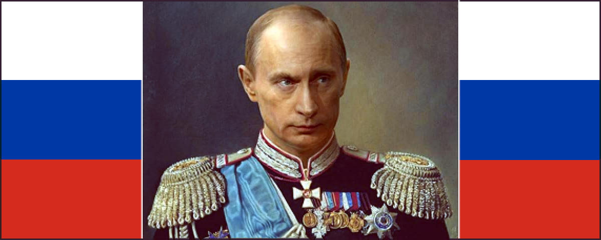

 

## The real reason why Putin is so hated

- This article has been written starting from a [post](https://www.facebook.com/photo/?fbid=10161818323693736&set=a.10150400606833736) published on Facebook, on 28th of May 2025.

---

### The real problem is that we lost

The problem is not Putin, and the question is not even if the Putin is a dictator because in Europe we made trading, especially for oil, with **every** sort of dictators while CIA - for a public admission of one their ex-director - pushed several times and countries in dictatorship regime with the solely aim to advantage the US. Therefore, none of this is **the** problem. Which makes sense considering the [Wolfowitz doctrine](https://en.wikipedia.org/wiki/Wolfowitz_Doctrine) officially shapes the U.S. foreign policy since 1992.

The issue might be that we, as Europeans, have a long historical tradition of move in others countries kill them, rape the, sack them, enslaved them, for whatever reason we like because **we** are the civilised ones. While, we, as Europeans, never leveraged our superior civilisation rather than using weapons combined with a rare mastership of organised violence. Despite this, it was **not** a problem for us, as Europeans, perpetrating violence.

The **real** issue is that nowadays we, as Europeans, are **not** in the position to do that anymore, nor the United States of America. Indeed, **we** are not able to do this anymore since WW2, because **every** single war has been lost apart from the one against the fake army of Iraq. Since Vietnam to Afghanistan, there is to account a long series of proxy-wars or invasions wars that Westerns systematically have lost.

Ukraine proxy-war against Russia is not different, but hurts. Why does it hurt so much?

Well, it doesn't because Vietnam was a Hell in comparison. Not just because of the battlefield but also because of veterans. By the way, looking at some photos and reading some personal stories, Ukrainian veterans are even in worse shape than those who were back from Vietnam. Whatever joining the army to fight for freedom in Vietnam was a personal choice, many Ukrianins had been taken with force and sent to the front war.

It is hard to cope with such a kind of responsibility. In fact, currently in Ukraine, people who return and might wish to ask for compensation or even a vet pension, are seriously risking being accused of dissertation. While the body of the deaths are left behind or hidden, while the families instead of receiving a compensation for their lost, a notice of missing person, possibly a disertor including the warning tha hosting a deserting military is a felony.

It is a tragedy into a tragedy, a madness into a madness. In this scenario, it is difficult to say who is worse: those who support war for personal gain, those who sell weapons, or those who cheer on social media at the death of this or that target, as if war were a football match or a video game. Under this PoV, accusing Putin to be the bad guy -- the evil enemy -- is a way to distract everyone from thinking about what is going on. But why Putin in particular?

---

### The enemy as a devil personification

> The Devil, taking the blame for humans who won't own up to their own mistakes for centuries.

The idea to dehumanise those who want to kill or sack, is an evergreen. In a state of law, a criminal undergoes a fair trial and in case s/he is found guilty beyond any suspect, then it is condemned. This way of doing does not -- or not so much -- trigger our bestial instinct, our popular jury hide deep in us but ready to get out as soon as possible.

Therefore, like in witches' trials, we desperately need to blame someone in order to attack. A such desperate need, that the Inqeuisition was using torture fro extorcing confessions. It is an evergreen: convincing people that Joe is a very bad guy, torturing Joe until he confesses to be a bad guy or in self-defence act as a bad guy, then "look, Joe is a bad guy, for real".

Finally, in case this popular witch hunt doesn't go well, we need a scapegoat. Like in ancient times, when a goat was killed and the body burned for pleasing the divinity to forgive our mistakes. In the witch trial, the enemy and the scapegoat are the same person. If she confesses, then we burn her as a witch otherwise the same but to avoid facing our mistake.

Up to here, everything is pretty clear. But why Putin? Sitting at the top isn't enough. It is not even necessary. In fact, witches were marginalised people, usually. Also at the time of Crusades, the enemy was not a specific person but just an imaginary persona which was summarising all the biased narrative and gossip about the enemy (e.g. il feroce saladino).

...

Quali sono le vere ragioni per le quali gli Europei e gli Inglesi hanno accettato di tollerare gli Africani e i Musulmani ma hanno continuato ad odiare i Russi e in particolare la figura di Putin?

In questa chat con Gemini 2 si dipana un discorso che parte dall'attualità e va indietro per sei secoli dai quali emerge l'invidia sfacciata per la Russia come Terza Roma che ha sempre trovato un qualche vantaggio sufficiente a non farsi MAI sottomettere dagli Europei.

Passino i Cinesi che ci sono distanti culturalmente, passino gli Africani che un tempo li abbiamo ridotti in schiavitù, passino i Musulmani che di tanto in tanto li abbiamo vinti nelle crociate. Ma i Russi, mannaggia, non siamo mai riusciti, in sei secoli di perniciosa e radicata invidia, a sottometterli.

Non sazi di averci fatto tribolare così tanto senza manco darci la soddisfazione di essere almeno una volta stati nostri zerbini, hanno scelto un uomo che ci ricorda quasi ogni settimana, come fosse uno sberleffo, che non ci siamo MAI riusciti, in sei secoli di conflitti diretti o celati, a sottometterli.

- per approfondimenti continua leggendo questa [conversazione](https://gemini.google.com/share/454f6850b456) con Gemini o la sua [trascrizione](data/329-the-real-reason-why-putin-is-so-hated-gemini.txt#?target=_blank).

+

## Conclusion

We, as Western people, lost the proxy-war against Russia thus we did not managed to torture the witch nor to burn her. Suddenly, our enemy is not anymore Russia but Iran. In such a case it is not because of the love for the State of Israel, but because Iran is planning to threaten us with developing a nuclear bomb.

Curiously, Kohomeni is **not** the enemy because at his age, he is more like an orthodox icon rather than man of astuce. In fact, those who had been targeted were top-level commanders in charge or scientists. Unfortunately, the U.S. did not have enough SM-3 to continue the war and protect Israel, but at the same time they did not have powerful-enough conventional bombs to effectively hit Iran underground nuclear plants.

Because of these two limitations, a cease-fire agreement was necessary otherwise another war was bitterly lost on the battlefield. So, the maneuver to shift the public opinion toward Iran, the new #1 enemy, was also failed and soon we were forced to see on East and accept also the oher bitterly war lost on the battlefield.

Whatever, a war is lost or won, the real defeat is diplomacy.

+

## Share alike

&copy; 2025, **Roberto A. Foglietta** &lt;roberto.foglietta@gmail.com&gt;, [CC BY-NC-ND 4.0](https://creativecommons.org/licenses/by-nc-nd/4.0/)

