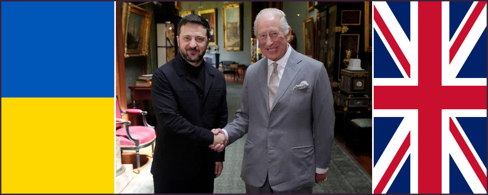

 

## The real reason why Putin is so hated

- **1st edition**, this article has been written starting from a [post](https://www.facebook.com/roberto.a.foglietta/posts/10161818323948736) published on Facebook, on 2025-05-28.
- **2nd edition**, includes an [update](#update-2025-07-05) about the Russia-Azerbaijan diplomatic emerging crisis.
- **3rd edition**, includes an [update](#update-2025-08-10) about the Russia-USA diplomatic distension.
- **4th edition**, includes an [update](#update-2025-08-19) about the European show in Washington.

---

### The real problem is that we lost

The problem is not Putin, and the question is not even if the Putin is a dictator because in Europe we made trading, especially for oil, with **every** sort of dictators while CIA -- for a public admission of one their ex-director -- pushed several times and countries in dictatorship regime with the solely aim to advantage the US. Therefore, none of this is **the** problem. Which makes sense considering the **Wolfowitz Doctrine** (#1) officially shapes the U.S. foreign policy since 1992.

The issue might be that we, as Europeans, have a long historical tradition of move in others countries kill them, rape the, sack them, enslaved them, for whatever reason we like because **we** are the civilised ones. While, we, as Europeans, never leveraged our superior civilisation rather than using weapons combined with a rare mastership of organised violence. Despite this, it was **not** a problem for us, as Europeans, perpetrating violence.

The **real** issue is that nowadays we, as Europeans, are **not** in the position to do that anymore, nor the United States of America. Indeed, **we** are not able to do this anymore since WW2, because **every** single war has been lost apart from the one against the fake army of Iraq. Since Vietnam to Afghanistan, there is to account a long series of proxy-wars or invasions wars that Westerns systematically have lost.

Ukraine proxy-war against Russia is not different, but hurts. Why does it hurt so much?

---

### A war like no other before, so far

Well, it doesn't because Vietnam was a Hell in comparison. Not just because of the battlefield but also because of veterans. By the way, looking at some photos and reading some personal stories, Ukrainian veterans are even in worse shape than those who were back from Vietnam. Whatever joining the army to fight for freedom in Vietnam was a personal choice, many Ukrianins had been taken with force and sent to the front war.

It is hard to cope with such a kind of responsibility. In fact, currently in Ukraine, people who return and might wish to ask for compensation or even a vet pension, are seriously risking being accused of dissertation. While the body of the deaths are left behind or hidden, while the families instead of receiving a compensation for their lost, a notice of missing person, possibly a disertor including the warning tha hosting a deserting military is a felony.

It is a tragedy into a tragedy, a madness into a madness. In this scenario, it is difficult to say who is worse: those who support war for personal gain, those who sell weapons, or those who cheer on social media at the death of this or that target, as if war were a football match or a video game. Under this PoV, accusing Putin to be the bad guy -- the evil enemy -- is a way to distract everyone from thinking about what is going on.

But why Putin in particular?

---

### The enemy as a devil personification

> The Devil, taking the blame for humans who won't own up to their own mistakes for centuries.

The idea to dehumanise those who want to kill or sack, is an evergreen. In a state of law, a criminal undergoes a fair trial and in case s/he is found guilty beyond any suspect, then it is condemned. This way of doing does not -- or not so much -- trigger our bestial instinct, our popular jury hide deep in us but ready to get out as soon as possible.

Therefore, like in witches' trials, we desperately need to blame someone in order to attack. A such desperate need, that the Inqeuisition was using torture fro extorcing confessions. It is an evergreen: convincing people that Joe is a very bad guy, torturing Joe until he confesses to be a bad guy or in self-defence act as a bad guy, then "look, Joe is a bad guy, for real".

Finally, in case this popular witch hunt doesn't go well, we need a scapegoat. Like in ancient times, when a goat was killed and the body burned for pleasing the divinity to forgive our mistakes. In the witch trial, the enemy and the scapegoat are the same person. If she confesses, then we burn her as a witch otherwise the same but to avoid facing our mistake.

Up to here, everything is pretty clear. But why Putin? Sitting at the top isn't enough. It is not even necessary. In fact, witches were marginalised people, usually. Also at the time of Crusades, the enemy was not a specific person but just an imaginary persona which was summarising all the biased narrative and gossip about the enemy (e.g. il feroce saladino).

...

#### Nella storia sono radicate le ragioni del rancore

Quali sono le vere ragioni per le quali gli Europei e gli Inglesi hanno accettato di tollerare gli Africani e i Musulmani ma hanno continuato ad odiare i Russi e in particolare la figura di Putin?

In questa chat con Gemini 2 si dipana un discorso che parte dall'attualità e va indietro per sei secoli dai quali emerge l'invidia sfacciata per la Russia come Terza Roma che ha sempre trovato un qualche vantaggio sufficiente a non farsi MAI sottomettere dagli Europei.

Passino i Cinesi che ci sono distanti culturalmente, passino gli Africani che un tempo li abbiamo ridotti in schiavitù, passino i Musulmani che di tanto in tanto li abbiamo vinti nelle crociate. Ma i Russi, mannaggia, non siamo mai riusciti, in sei secoli di perniciosa e radicata invidia, a sottometterli.

Non sazi di averci fatto tribolare così tanto senza manco darci la soddisfazione di essere almeno una volta stati nostri zerbini, hanno scelto un uomo che ci ricorda quasi ogni settimana, come fosse uno sberleffo, che non ci siamo MAI riusciti, in sei secoli di conflitti diretti o celati, a sottometterli.

Per approfondire questa parte, continua leggendo la [conversazione](https://gemini.google.com/share/454f6850b456) con Gemini o la sua [trascrizione](data/329-the-real-reason-why-putin-is-so-hated-gemini.txt#?target=_blank).

~~~~~~

### Conclusion

We, as Western people, lost the proxy-war against Russia thus we did not managed to torture the witch nor to burn her. Suddenly, our enemy is not anymore Russia but Iran. In such a case it is not because of the love for the State of Israel, but because Iran is planning to threaten us with developing a nuclear bomb.

Curiously, Kohomeni is **not** the enemy because at his age, he is more like an orthodox icon rather than man of astuce. In fact, those who had been targeted were top-level commanders in charge or scientists.

Unfortunately, the U.S. did not have enough SM-3 to continue the war and protect Israel, but at the same time they did not have powerful-enough conventional bombs to effectively hit Iran underground nuclear plants.

Because of these two limitations, a cease-fire agreement was necessary otherwise another war was bitterly lost on the battlefield. So, the maneuver to shift the public opinion toward Iran, the new #1 enemy, was also failed and soon we were forced to see on East and accept also the oher bitterly war lost on the battlefield.

Anyway, in this story, the real defeat is diplomacy.

+

## Update 2025-07-05

[!INFO]
3 luglio 2025 - Alta tensione tra Russia e Azerbaijan, dopo un'operazione di polizia che ha portato all'arresto di alcuni cittadini azeri: due di loro sono morti. La contrapposizione si era acuita dopo l'abbattimento, a fine 2024, di un aereo dell'Azerbaijan Airlines che causò la morte di 38 persone. Le indagini, e le relative intercettazioni diffuse in seguito, hanno accertato che il velivolo era stato colpito dalla difesa aerea russa, ma Mosca non ha mai riconosciuto la propria responsabilità. Una crisi diplomatica importante, poiché teoricamente Baku è alleata di Mosca però non ha ricevuto da Mosca il sostegno che si aspettava. -- [Radio Radicale](https://www.radioradicale.it/scheda/763712/postsovietika-intervista-ad-anna-zafesova)
[/INFO]

In questo articolo viene presentato in modo conciso ma evidente, un **grosso** problema diplomatico, anzi di credibilità, che riguarda le aspettative di un paese satellite e alleato della Russia. Una questione che merita di essere considerata in generale e nel momento da cui è iniziata, a prescindere da come sia formulata oggi.

Non ha importanza che la Russia non sia direttamente responsabile o addirittura estranea all'abbattimento del volo azero, quello che conta è il principio per il quale il capo, il leader, il boss, lo zar, il re o dir si voglia, intervenga e rassicuri che i responsabili saranno trovati anche qualora fossero dentro al Cremlino.

Al peggio, il rimborso alle famiglie delle vittime sarà più oneroso, magari in parte già anticipato in virtù di dove è caduto l'aereo, tipo un 50% di rimborso in anticipo, di questo 50% una metà alla Russia e una metà dall'Azerbaijan, giusto per mostrare che la collaborazione fra i due paesi è una garanzia, de-facto.

Poi a seconda di come si sviluppino le indagini, o per estremo opposto si voglia insabbiare tutto, nell'ambito della collaborazione si deciderà quale rimborso offrire se non è possibile o non è opportuno somministrare anche le condanne. In uno scenario di guerra con l'Ucraina ancora attivo, non è tutto banalmente lineare.

Piaccia o meno, questo è il prezzo che si paga per essere al comando: saper gestire le situazioni, specialmente quelle spiacevoli. In maniera che si pensi -- *ecco, c'è una ragione per la quale il capo è il capo* -- e chi è contro potrebbe al più criticare l'importo dell'indennità o la trasparenza delle indagini.

Questo è un caso in cui la Russia, il Cremlino o Putin, non si stanno presentando -- *apparentemente, perché tante cose non sappiamo, in particolare, rispetto ad un episodio specifico, ma la politica è fatta di apparenze, la diplomazia è fatta di mediazioni* -- come il capo che "dovrebbe essere" e questo, oggi, è il **grosso** problema per loro. Per quelli contro è un'opportunità, ovviamente.

~~~~~~

### Valutazione nel dettaglio

Dopo aver valutato più nei dettagli l'abbattimento del volo J2-8243 e le relazioni diplomatiche fra vari paesi coinvolti e confinanti, sono giunto alla conclusione che la spiegazione più probabile, e anche più plausibile, sia dovuta ad una decisione dei militari di mantenere una linea di assoluta fermezza, con priorità unica la difesa operativa.

Inoltre è ragionevole pensare che i generali russi nutrino del risentimento, a causa del conflitto Nagorno-Karabakh (2020), verso l'Azerbaijan, che ha ottenuto una piena vittoria contro l'Armenia, un più fedele alleato russo, grazie all'aiuto della Turchia e alla neutralità della Russia, su cui probabilmente non erano d'accordo.

Sicché che le gerarchie militari russe abbiano come priorità unica la difesa operativa non stupisce, e in un contesto come la guerra Russo-Ucraina anche è difficile da criticare, però non dovrebbero aver problemi che la diplomazia mitighi gli "effetti collaterali" di questa loro priorità. Il che ci porta al punto di cui sopra, appunto.

Queste considerazioni sono state formulate in conclusione di una [conversazione](https://x.com/i/grok/share/g6JR1V6rhBXIK5ZpMFrGYbgNP) con x/Grok, di cui la relativa [trascrizione](data/329-the-real-reason-why-putin-is-so-hated-azerbaijan.txt#?target=_blank), che attraverso la sua ricerca web ha fornito informazioni specifiche sull'sull'abbattimento e dell'assetto geopolitico locale.

---

### La struttura del potere in Russia

Nell'ambito delle analisi basate su fonti OSINT, lo scopo di fare congetture e stabilire quale grado di confidenza possano avere non è un esercizio di retorica del convincimento, che è tipico della propaganda, ma all'opposto mettere in discussione critica le nostre convinzioni. Tipo che Putin sia lo Zar della Russia.

Considerando la [biografia di Putin](https://it.wikipedia.org/wiki/Vladimir_Putin) è ragionevole pensare che quanto emerso nel caso J2-8243 mostri come in realtà Putin sia molto meno "un dittatore assoluto" di come viene dipinto in Occidente e che in alcuni contesti la sua tendenza alla diplomazia (agente d'intelligence dell'ex-KGB) sia addirittura neutralizzata dalle gerarchie militari.

La guerra in Ucraina ha posto i militari in una posizione di importanza relativamente molto elevata rispetto al passato, ma è difficile pensare che questo caso sia eccezionale piuttosto che sia emerso perché reso molto più evidente dal contesto polarizzato della guerra e dell'accentuata importanza dei militari. Quindi è plausibile che Putin fosse e sia soggetto a pressioni importanti anche prima del 2022.

Se la percezione che gli americani hanno del potere in Russia è troppo semplicistica, e Trump è certamente un presidente che tende ad avere relazioni personali, allora convincere Putin non basta. Questo spiegherebbe perché dopo l'ultima lunga telefonata fra Trump e Putin, la Russia abbia scatenato nella notte fra il 3 e il 4 luglio 2025 immediatamente seguente un dei più importanti attacchi su Kyiv. 

Un messaggio dalle gerarchie militari che Trump potrebbe non aver colto, perché convinto che Putin sia il decisore ultimo ma non orientato alla pace. Quando invece è la nostra percezione dell'altro ad essere diversa dalla realtà. Questa incomprensione della struttura di potere in Russia potrebbe avere risvolti molto pericolosi: consideriamo solo la punta dell'iceberg (Putin) ma come accadde al Titanic non è quella che fa il danno.

La prossima volta, i militari potrebbero mettere Putin in condizione di non potersi rifiutare di girare la terza chiave, che in realtà dovrebbe essere la prima a girare, un piccolo dettaglio sulle tempistiche, seppur ristrette in termini di temporali, che potrebbe essere passato inosservato ed aver fatto fallire il lancio. Infatti, ai sottomarini nucleari (SSBN) l'abilitazione presidenziale viene inviata prima, generalmente giorni o settimane prima, quando possono riceverla perché sono risaliti in superficie o almeno a quota periscopio.
<!-- 
https://g.co/gemini/share/7d610cf0b7dc 
https://chatgpt.com/share/686970a6-9bbc-8012-81ed-7b0c588c94a0
https://chat.mistral.ai/chat/294db351-7999-43b4-9c14-12203a521f25
//-->

+

## UPDATE 2025-08-10

Two important news reached the media in the last two days:

[!INFO]
2025-08-08 -- Azerbaijan and Armenia sign peace pledge at White House summit with Trump. The leaders of Azerbaijan and Armenia signed an agreement aimed at ending decades of conflict as they were hosted by President Donald Trump at the White House on Friday. -- [BBC](https://www.bbc.com/news/articles/c39dzl1lzrgo)
[/INFO]

As stated in a previously reported [section](#valutazione-nel-dettaglio) and in the [update](#update-2025-07-05) above: the Armenia vs Azerbaijan conflict was a pain for Russia and it was jeopardising the Putin leadership, in particular among the top military hierarchy.

[!INFO]
2025-08-08 -- President Donald Trump said Friday he will meet with Russian President Vladimir Putin on Aug.15 in Alaska to talk about an end to Russia's war in Ukraine. -- [Alaska Public Media](https://alaskapublic.org/news/politics/2025-08-08/trump-sets-meeting-date-with-putin-in-alaska)
[/INFO]

The second is another historical issue in which Putin was seen as "weak" by the Russian ultranationalists. The opportunity to close a deal for which the USA recognised some Ukraine territorial claims in favour of Russia in exchange the Alaska do-not-return contract clause addition, would put the Zelensky government and his European campaign against Russia in a very unfavourable position.

[!INFO]
2025-08-10 -- Russians cheer Putin’s Alaska invitation, envision no concessions on Ukraine. Analysts noted Alaska was once part of the Russian Empire, and some nationalists believe it should be returned. Sam Greene, professor in Russian politics at King’s College London, said the venue favored Russia. 
 -- [The Washington Post](https://www.washingtonpost.com/world/2025/08/10/putin-trump-russia-ukraine-summit/)
[/INFO]

With these two moves, which are resembling more a chess player rather than a poker player pattern, Trump is going to consolidate his foreign politics and Putin's leadership in Russia, as well. 

A do-ut-des, which is extremely important for the USA as their public debt is skyrocketing and Rosatom is still their only viable option to buy nuclear fuel for their nuclear power plants without which blackouts are shown to happen and AI data centers require, like the humans, the air to breathe.

A do-ut-des, which is extremely important for Russia, and Putin leadership in particular. Because the stake on the table is high, and the Armenia vs Azerbaijan war settles down, Putin regains the main decision-maker role which the Ukraine weakened but which is essential for the Trump presidency.

#### Update 2025-08-15

In support of the analysis exposed above, recent news confirms that do-ut-des translation went good even before the Alaska meeting between Trump and Putin.

[!INFO]
2025-08-15 -- Russia decree opens door for Exxon return to Sakhalin-1 project. The signing of the decree comes on the day Russian president Vladimir Putin meets Donald Trump in Alaska for a summit. -- [Reuters](https://www.reuters.com/business/energy/russia-decree-opens-door-exxon-return-sakhalin-1-project-2025-08-15)
[/INFO]

Also Reuters confirms, on that day before the meeting that "opportunities for investment and business collaboration will be on the agenda" alongside the Ukraine crisis. After the meeting we can reasonably think that a strategic business alliance between the USA and Russia has been the core of such a meeting.

+

## Update 2025-07-01

 

---

### Zelensky, la stella cadente della UE

Secondo me Zelensky sarà portato ad esempio, dai posteri, come icona di questo primo quarto di secolo. Lasciate che spieghi perché **questa** è una storia notevole.

Ha iniziato una guerra (cfr. [qui](#secondo-la-tradizione-diplomatica)) che non voleva fare e non gli conveniva fare, si è ostinato a continuarla fino a quando quelli che lo avevano costretto a scommeterci all-in del suo, non hanno cambiato presidente e quindi lo hanno abbandonato dopo averlo costretto a firmare la restituzione dei prestiti di guerra.

Già questo da solo sarebbe tanta roba ma tutto sommato solo la re-edizione di una sceneggiatura più volte osservata nell'arco degli ultimi 50 anni in cui la CIA ha portato al potere un qualche dittatore per poi eliminarlo una volta che tale dittatura aveva maturato le condizioni ideali per approfittarne senza intermediari. Invece no, Zelensky è riuscito a superare questo cliché però il giorno che pensava di aver vinto tutto, ha scoperto che aveva perso e si è dovuto rintanare in un bunker.

Ormai lo si dava per spacciato e invece anche dal bunker ne è uscito, e quando finalmente ne è uscito, è stato ricevuto da Carlo, il Re d'Inghilterra. Nel bunker è entrato con la mimetica e ne è uscito in abito, giacca pantalone nero, ma senza cravatta, il classico dei tirapiedi dei mafiosi russi perché quelli degli italo-americani amano metterci una nota di colore.

Total black suite, anche perché qualsiasi altro colore non sarebbe adatto al riciclaggio di denaro (#2). Un cambio d'abito che come a treatro presuppone anche un cambio di ruolo. D'altronde una svolta era inevitabile perché, non solo gli americani, pure gli europei fanno fatica ad accettare un perdente come eroe. 

Però un perdente può essere un "affidabile" uomo d'affari, affari di cui altri più pudici non si vorrebbero occupare, tipo disseminare l'Ucraina di mine anti-uomo nella speranza di fermare l'avanzata dell'armata Russa nella conquista. Immaginate l'Ucraina con l'accesso al Mar Nero bloccato e il territorio minato, un capolavoro!

Si noti che Re Carlo, è anche il primo sovrano inglese e quindi capo della Chiesa Anglicana -- da quando un suo predecessore chiamato Enrico VIII volendo divorziare dalla moglie ma trovando l'opposizione del papato ha deciso che fondare la chiesa Anglicana e tagliare la testa alla moglie era più consono che sopportare ambedue -- che ha fatto gli auguri per la festa mussulmana del digiuno invece che per la Pasqua cristiana e ha elevato a titolo onorifico con tanto di spada sulla spalla un musulmano.

Per carità di dio, i tempi cambiano ed entro certi limiti questo richiede anche adattamento, ma considerando che la monarchia è un'istituzione che per sua natura è tanto conservatrice e tradizionale almeno quanto la Chiesa, passare da Enrico VIII a Carlo III è un uno shock reale.

Sicché non ci deve stupire se gli Australiani, già in tempi non sospetti ma che loro conoscevano meglio, hanno minacciato l'indipendenza -- più un atto formale che sostanziale -- dalla Corona Inglese se questa avesse continuato ad insistere che l'Australia avrebbe dovuto cambiare sulle sue banconote l'effige della Regina Elisabetta con quella di Re Carlo. 

> Per il poco tempo che dio mi ha concesso di essere re. (cit.)

Citazione tratta dal discorso in Italiano fatto al Parlamento Italiano e affato fuori luogo perché Carlo III è salito al trono relativamente in tarda età e secondo i tabloit inglesi affetto da una forma di cancro incurabile. Ormai è chiaro che il suo regno sia incentrato al ripianamento della situazione finanziaria della Corona Reale e ragionevolmente la sua durata sarà funzionale a questo pragmatico ma indispensabile scopo (#3).

Mentre Zelensky che è ancora in carica come presidente dell'Ucraina nonostante il suo mandato elettivo sia scaduto nell'aprile 2024, per tutto quanto sopra -- e altro ancora che sapremo in futuro quando ormai non più capo di stato non si potrà più nascondere dietro il paravento dei servizi segreti (SBU) -- magari ritratto proprio in questa foto ghignante metnre stringe la mano a Re Carlo, sarà ricordato come icona del primo quarto del nostro secolo.

- [La misura del degrado del sistema](309-la-misura-del-degrado-del-sistema.md#?target=_blank) &nbsp; (2025-04-18)

La cosa più ardua per gli storici del futuro, però, sarà trovare una ragionevole spiegazione a come in 60 anni, ovver nell'arco di due generazioni, siamo passati da quelli a questi.

---

### Secondo la tradizione diplomatica

> Ha iniziato una guerra?

Russia e Ucraina, avevano trovato un accordo di pace già a novembre 2021, che poi non era altro che attenersi agli accordi di Minsk e smetterla di perseguitare i cittadini ucraini di lingua e origine russa che poi nella pratica si limitava a smetterla di fare quelle azioni tipo bombardare il Donbass che andavano avanti da prima degli accordi di Minsk e che avrebbero dovuto essere cessati già da allora.

Ma evidentemente come ha rivelato la Merkel dopo che il sabotaggio del Nord Stream I e II, gli americani avevano acconsentito che le parti firmassero quegli accordi ma solo per prendere tempo per preparare l'Ucraina alla guerra. La proposta di pace è rimasta sul tavolo e Zelensky si era convinto a firmare ed (questa volta) ad onorare la firma del trattato ma Biden lo ha chiamato e gli ha ordinato di non firmare, di fatto causando l'inizio della guerra.

Perché per quanto possa la propaganda NATO aver stravolto la mente delle persone, rimane un fatto acclarato nell'intera storia della diplomazia internazionale che coloro che firmano un patto, non lo mantengono, lo ignorano per anni, e per altro lo fanno consapevolmente tanto prima o poi sarà l'altra parte a dover reagire, è considerato "iniziare una guerra". 

- [WW3 simply explained, for dummies](317-ww3-simply-explained-for-dummies.md#?target=_blank) &nbsp; (2025-06-01)

Quindi Zelensky ha, di fatto, iniziato una guerra per procura su ordine di Biden. 

---

### La cpaziosa questione della Crimea

> Il conflitto inizia con l'occupazione della Crimea?

Occupazione che non è mai esistita visto che la Crimea è sempre stata Russa ma durante l'Unione Sovietica quando le questioni fra confini non erano particolarmente sentite, anzi negate, fu territorialmente assegnata in gestione a quella che oggi è l'Ucraina. 

Alla dissoluzione dell'Unione Sovietica, quelle che oggi sono la Russia e l'Ucraina giunsero ad un accordo per il quale la Russia avrebbe protetto militarmente l'Ucraina e l'avrebbe sostenuta finanziariamente, in cambio di questo l'Ucraina avrebbe dato indietro le testate nucleari alla Russia che comunque non poteva lanciare senza i codici che avevano al Kremlino e avrebbe permesso alla Russia di continuare ad usare la Crimea per le sue basi navali anche militari, in particolare quella di Sebastopoli.

Visto che ancora nel 2004 in Ucraina il 90% della popolazione parlava russo come seconda lingua e il russo era considerata seconda lingua ufficiale non si è mai posto il problema della Crimea anche perché la Russia non è mai venuta meno agli accordi di sostegno del debito pubblico Ucraino fino al 2014 e ancora oggi paga importanti fee sul trasporto del gas russo in Europa attraverso l'Ucraina.

Vale la pena sottolinearlo, perché altrimenti è difficile capire dalla parte degli occidentali che firmano accordi per poi non rispettarli -- nonostante l'Ucraina sia formalmente in guerra contro la Russia a causa del governo Zelensky che dall'aprile 2024 è in carica solo a causa della legge marziale o stato di guerra, dir si voglia -- la Russia non è mai venuta meno agli impegni che avevano, o hanno ancora, in ragione di essere.

É ragionevole pensare che qualora la Russia prendesse il controllo dell'Ucraina, ritornerebbe a finanziarne il debito pubblico, motivo per il quale Zelensky e il suo governo fanno del loro meglio per lasciare un buco enorme nelle finanze del paese al punto da finire in default tecnico nonostante tutti i finanziamenti ricevuti, in particolare dagli stati europei (#2).

Questo, fra le tante altre cose, supporta il discorso di Putin fatto ai suoi generali e poi al Parlamento russo, motivo per il quale conosciamo quel discorso, che in estrema sintesi richiamava l'attenziona a non sottovalutare l'imprevedibilità delle decisioni degli occidentali, e quindi di Zelensky, perché così stupidi (secondo la definizione di Carlo M. Cipolla) da fare un grave danno a se stessi per danneggiare la Russia.

---

### L'anessione della Crimea nel 2014

[!INFO]
Insieme alla vicina Donetsk, Lugansk è stata il crogiolo del conflitto iniziato nel 2014, dopo che un presidente filorusso fu rovesciato durante la Rivoluzione ucraina di Maidan e la Russia ha annesso la Crimea a seguito del risultato del referendum popolare del 16 marzo 2014. -- [wikipedia](https://it.wikipedia.org/wiki/Referendum_sull%27autodeterminazione_della_Crimea_del_2014).
[/INFO]

Vale la pena notare che, senza sorpresa, la Crimea essendo sempre stata a maggioranza di popolazione russa, ha chiesto l'annessione alla Russia con un referendum che ovviamente noi occidentali contestiamo ma se avessero votato in favore dell'Ucraina, oggi sbraiteremmo che tale referendum, in quanto espressione democratica diretta della volontà popolare, è sacro.

Curiosamente, i fautori della democrazia e della volontà popolare, sono favorevoli a sacrificare il popolo ucraino fino all'ultimo uomo contro la Russia. Si fa persino fatica a considerare il mainstream come "pensiero unico" perché se fosse frutto di una sola mente, di una sola regia, la schizofrenia sarebbe la diagnosi meno negativa.

Se l'ucraina non avesse ceduto le bombe nucleari alla Russia, oggi sarebbe diverso? 

- è inutile tenersi degli ordigni che non si possono usare senza il consenso di Mosca;
+++++
- oggi grazie a quel patto l'Ucraina non è un avamposto di basi nucleari della Russia.

L'Ucraina per diversi decenni hanno goduto di un'apertura e gli Ucraini di una libertà di viaggiare, quindi anche di commerciare che, per esempio, la Bielorussia non ha avuto. 

Per contro l'Italia che è stata "liberata" dagli americani per diventarne un loro protettorato de-facto in quanto avamposto per le basi nucleari USA, non è ha mai goduto di un'indipendenza confrontabile a quella dell'Ucraina dopo la dissoluzione dell'URSS fino al 2007, per quanto questo possa sembrare strano.

Quella dell'Italia è una sorte che pare la Polonia e la Romania ci contendono, a dimostrazione che la gente non impare mai nulla dalla storia, nemmeno da quella recente, e i politici sono così corrotti che sembrano pure scemi da tanto sono in contrasto con gli interessi di coloro che dovrebbero rappresentare.

Infine, quanto siano felici gli Ucraini che gli USA abbiano "esportato la democrazia" nel loro paese penso che a Baltimora ne abbiano avuto un primo esempio e, forse, è anche il motivo per il quale Trump ha deciso di sfilarsi da quel fronte, come per altro fece in Afganistan nella sua prima e più tradizionale presidenza, dimostrando che non ha difficoltà ne ad accettare ne a gestire la sconfitta sul campo, a differenza degli altri presidenti americni che lo hanno preceduto.

<!--

AM wrote «Zelensky è stato eletto nel 2019. Non ha iniziato il conflitto» e il suo mandato è scaduto nel 2024, ad aprile. In quanto pupazzo di Biden, è quello che ha creato le condizioni diplomatiche perché il conflitto come lo conosciamo oggi è iniziato, non solo l'operazione speciale come inizialmente definita, che aveva come obiettivo quello di mettere in sicurezza le regioni, principalmente il Donbass, abitate da maggioranza russofona, ma anche della seconda parte del conflitto, quella che è a tutti gli effetti diventata una guerra dopo il secondo attacco deliberato ad infrastrutture militari della triade nucleare Russa che sono esposte ma anche protetto fino a l loro smantellamento per obsolescenza dal trattato di non proliferazione nucleare, a cui aderiva anche l'Iran completamente fino al 2018 quando gli USA hanno fatto alcuni passi indietro e quindi anche l'Iran. Notare che invece Israele non ha mai aderito, ne formalmente ne permettendo ispezioni in tutti i loro centri all'IAEA. Ogni volta che rispondi ripetendo a pappagallo la propaganda mainstream dell'era Obama-Biden, emergono nuovi dettagli che mostrano quanto quell'epoca fosse intrisa -- nel migliore dei casi -- di una profonda ipocrisia, per non dire malafede, e di una falsa superiorità morale. Possano le indagini sulla lista dei partecipanti alle feste dell'isola di Epstein portare a rivelazioni anche più sferzanti di quelle sulle "grooming gang" in UK. Per completezza di informazione non sono filo-putiniano e penso sia superfluo dire che Putin non sia un mio fan, ma visto che l'ovvio ormai va spiegato, allora diciamolo. Quello che invece ho sempre affermato che, io-me-personalmente, mi sono messo dalla parte della storia, magari un po' scomoda al momento, ma dall'altra parte di quella storia non rimarrà anima viva. Perché gente che per 25 anni ha perseguitato le persone creative per evitare potessero cambiare la società e le istituzioni mentre utilizzava dei predatori universali (banalmente conosciuti per una delle loro tante malvagie attitudini: pedofili) per manipolare l'opinione pubblica (perché tali persone sono naturalmente dei manipolatori nati diversamente a causa dei loro vizietti sarebbero facilmente soggetti repressi dalla legge, e anche per questo cercano la protezione del potere e per questo il potere li ritiene utili e affidabili) non hanno grandi speranze di incontrare un giudizio favorevole da parte della storia. La sorte ha voluto che Elisabette durasse molto e che uno dei creativi, ingiustamente qualificato come "un predatore" sia finito fra le loro file e abbia cominciato a portare devastazione nei loro network, un gioco del destino, una doppia omonimia, un'errata classificazione, e una serie di altre coincidenze che definirle casuali insulta l'intelligenza di una capra, ci hanno portato ad una svolta nella storia in cui il più lungo e macchinoso piano di sottomissione della Russia è tragicamente fallito. Ancora no, ma inevitabilmente, si. Guai ai vinti, non fu mai meglio appropriato che in questi tempi perché non esiste un società sufficientemente progredita nella quale non si possa tornare indietro abbastanza da bere ancora vino da calici fatti con i teschi dei nostri nemici...
...e non è tanto per dire. (cit.)

***

L’AIEA FU INFILTRATA DA UN AGENTE DELL’MI6 PER INFLUENZARE LE ATTIVITÀ DI MONITORAGGIO NUCLEARE DELL’IRAN
https://www.linkedin.com/posts/giorgiobianchiphotojournalist_laiea-fu-infiltrata-da-un-agente-dellmi6-activity-7346077981624152064-TQ5h?utm_source=share&utm_medium=member_desktop&rcm=ACoAAABzvHAB9TGQLgYBOT5X9f6zNl13D_CPAXw

Documenti riservati trapelati rivelano che l’AIEA, l’Agenzia delle Nazioni Unite responsabile del monitoraggio dei programmi nucleari, è stata infiltrata da un agente dell’MI6, il servizio di intelligence britannico, per conto del governo di Londra. Questi documenti supportano le accuse di lunga data dell’Iran secondo cui l’AIEA avrebbe collaborato segretamente con i nemici della Repubblica Islamica, compromettendo la sua imparzialità come organo di supervisione nucleare.
Nicholas Langman, un agente dell’MI6, già precedentemente esposto come spia britannica in due occasioni, è stato indicato come il principale collegamento britannico con l’AIEA, secondo un curriculum depositato presso Torchlight, una società di intelligence britannica utilizzata come copertura. Langman, in qualità di capo del Britain’s Counter-Proliferation Centre, avrebbe guidato iniziative per imporre sanzioni contro l’Iran, un ruolo che solleva interrogativi sulla neutralità dell’IAEA.
I file trapelati suggeriscono che Langman abbia avuto un ruolo attivo nel raccogliere informazioni sensibili all’interno dell’AIEA, sfruttando la sua posizione per influenzare le attività di monitoraggio nucleare dell’Iran. Questa infiltrazione ha permesso al Regno Unito di ottenere informazioni privilegiate sul programma nucleare iraniano, potenzialmente condivise con alleati come Israele e gli Stati Uniti, che hanno storicamente cercato di ostacolare il progresso nucleare dell’Iran.
L’Iran ha ripetutamente accusato l’IAEA di essere influenzata da potenze occidentali, in particolare Stati Uniti e Israele, che utilizzerebbero l’agenzia per giustificare sanzioni e azioni militari contro Teheran. La scoperta dell’infiltrazione di Langman rafforza queste affermazioni, suggerendo che l’AIEA non è un arbitro imparziale, ma uno strumento per avanzare gli interessi geopolitici occidentali.

Tramite Giubbe Rosse

//-->

+

### Nota #1

The **Wolfowitz Doctrine** is a US foreign policy guideline theorised by then Undersecretary of Defence Paul Wolfowitz (third-in-command at the Pentagon), contained in the Defense Planning Guidance for the 1994-99 (dated 18 February 1992), an internal US administration document distributed to the military and civilian leaders of the Department of Defence to instruct them on how to commit their forces and resources to the common goals set out in the 10-year foreign policy plan. Wikipedia in [Italian](https://it.wikipedia.org/wiki/Dottrina_Wolfowitz) and in [English](https://en.wikipedia.org/wiki/Wolfowitz_Doctrine)

- [The spectre of Wolfowitz](https://www.ussc.edu.au/the-spectre-of-wolfowitz) - published on 2014/06/24 for the United States Studies Centre of the Sidney University by Professor Anatol Lieven of Georgetown University School of Foreign Service, Qatar - subtitle: A controversial 1992 defence strategy has helped shape the US foreign policy mindset of containing Russia in its own backyard - In essence, the author sees the Wolfowitz Doctrine's underlying principles of maintaining US global dominance and preventing regional challengers as a key driver behind the aggressive US foreign policy in Ukraine, even when it contradicted Obama's stated intentions and led to predictable negative consequences with Russia.

- [Wolfowitz Doctrine: US action in the middle-east](https://tiis.org/index.php/2025/04/29/want-to-understand-us-action-in-the-middle-east-look-at-the-wolfowitz-doctrine) - published on 2025/04/29, German company as domain registrar - The author labels the "War on Terror" as "fake" and directly links it to the Wolfowitz Doctrine. This connection is further solidified by the mention of the PNAC report, co-authored by Wolfowitz, which famously stated that a "catastrophic and catalyzing event, like a new Pearl Harbor" might be needed to initiate a "process of transformation" [N.d.R.: checked and confirmed] which implies foreknowledge of 9/11, and that the "War on Terror" that followed was a pretext, enabled by the doctrine's aggressive pursuit of global dominance, to intervene militarily and solidify US power in the Middle East.

- [The foundation of the modern Ukrainian crisis](https://en.topwar.ru/242238-doktrina-vulfovica-fundament-sovremennogo-ukrainskogo-krizisa.html) - published on 2024/05/14, on a Russian domain - In essence, the author sees the Wolfowitz Doctrine as the original blueprint for a consistently adversarial US foreign policy toward Russia, characterized by a relentless pursuit of unipolar dominance, active containment, military expansion, and a willingness to bypass international law, which ultimately set the stage for the ongoing conflict in Ukraine.

- [How the Wolfowitz Doctrine Shaped Putin’s Outlook](https://nationalinterest.org/feature/how-wolfowitz-doctrine-shaped-putins-outlook-206225) - published on 2023/02/18, for the The National Interest by Sameed Basha from Deakin University, Australia - In essence, the author posits that the Wolfowitz Doctrine's vision of unipolar US dominance and its aggressive implementation through NATO expansion and interference in Russia's neighborhood directly fostered Putin's confrontational outlook, leading him to believe that Russia needed to forcefully resist what he saw as a consistent US strategy to undermine its power and influence. From Putin's perspective, the invasion of Ukraine in 2022 was a direct response to signal that Russia would no longer tolerate the continued advancement of the Wolfowitz Doctrine, which he saw as an American plan to impose its will and eliminate rivals. - The TNI, with HQ in Washington, DC has served as an important forum for debates about American foreign policy and political realism since it was launched as a quarterly journal in 1985.

Despite these four articles are bringing in different perspectives which can be reasonably biased the critics elevated to Wolfowitz Doctrine are acceptable in every rational-driven open-minded academic conces in which participants can freely express their opinions. This because of the intrinsic nature and explicit claims of the Wolfowitz Doctrine, even in its edulcorate version that became the official version. A document that did not fall from the sky but the Pentagon wrote for themselves and the US foreign diplomacy accepted in full, de facto (cfr. the [conversation](https://g.co/gemini/share/0deddef37ae8) with Gemini/SoNia or its [transcription](data/329-the-real-reason-why-putin-is-so-hated-wolfowitz.txt#?target=_blank)).

<!--
#### Sources

* http://www.informationclearinghouse.info/pdf/naarpr_Defense.pdf
* http://www.informationclearinghouse.info/pdf/RebuildingAmericasDefenses.pdf
* https://thefreedomarticles.com/brzezinski-easier-to-kill-than-control/
* http://www.takeoverworld.info/Grand_Chessboard.pdf
* https://thefreedomarticles.com/who-is-jeb-bush-really-part-2/
* https://www.youtube.com/watch?v=A9RCFZnWGE0
* https://www.lewrockwell.com/lrc-blog/u-s-implements-the-wolfowitz-doctrine/
* https://www.youtube.com/watch?v=dexrP27MMdU
* https://www.youtube.com/watch?v=KIvRljAaNgg
* https://www.rt.com/news/international-observers-crimea-referendum-190/
* http://newsvoice.se/2015/09/07/swedish-analyst-the-smear-campaign-against-putin-and-the-us-agenda-part-1/
//-->
---

### Nota #2

As of April 2025, total assistance allocated by Europe to Ukraine stands at $157B: $26B more than the U.S., which has provided more military aid, instead. The AML events chain to the default started in Q1/2023 with the arrival of nearly 100 accountants in Kiev to audit the use of American aid. The default happens in June 2025, when the news about Ukraine's specific state-bond default on its GDP-linked sovereign debt payment of $665 million to holders of the warrants, marking the first default on these instruments. (cfr. [AML & default](317-ww3-simply-explained-for-dummies.md#money-laundering-and-ukraine-default?target=_blank))

---

### Nota #3

2025-07-01 -- La famiglia reale ha bisogno di un'ingente iniezione di liquidità, pari a 91 milioni di sterline (circa 106 milioni di euro) per far fronte al deficit del Sovereign Grant. Re Carlo darà un triste addio al treno della regina Elisabetta, che verrà dismesso nel 2027. Fonte: [ADN Kronos](https://www.adnkronos.com/internazionale/royalfamilynews/addio-al-treno-della-regina-elisabetta-sara-dismesso-nel-2027_4ulW84J2YvKsBIwSqZLpQV)

+

## Update 2025-08-19

L'incontro in Alaska fra Trump e Putin è stato certamente un punto di svolta nelle relazioni fra USA e Russia. D'altronde se inseriamo nel contesto di quell'incontro la notizia che gli USA rischiano di perdere la corsa tecnologica all'intelligenza artificiale a causa della loro rete elettrica:

[!INFO]
2025-08-14 -- AI experts return from China stunned: The U.S. grid is so weak, the race may already be over. "Everywhere we went, people treated energy availability as a given", Rui Ma wrote on X after returning from a recent tour of China’s AI hubs. For American AI researchers, that’s almost unimaginable. In the U.S., surging AI demand is colliding with a fragile power grid, the kind of extreme bottleneck that Goldman Sachs warns could severely choke the industry’s growth. In China, Ma continued, it’s considered a "solved problem". -- [Fortune](https://fortune.com/2025/08/14/data-centers-china-grid-us-infrastructure)
[/INFO]

allora scopriamo che:

- Rosatom è il fornitore primario di combustibile nucleare degli USA
- nel breve periodo anche l'unico agibile per gli USA
- e probabilmente anche sul lungo periodo,

e che:
 
- le centrali nucleari sono un asset indispensabile per i data center
- come dimostrano gli investimenti di Microsoft e altra aziende cloud/AI
- quindi la produzione di energia nucleare, è un fattore strategico per l'AI

Facile comprendere come mai Trump, da businessman con uno spiccato senso degli affari, abbia accolto Putin facendo gli onori di casa. Dal canto suo Putin, nel contraccambiare favore con favore (cfr. [qui](#update-2025-08-15)), senza indugi o rinegoziazioni, si è posto subito come un interlocutore determinante e per quanto detto sopra in una contesto di estrema importanza strategica per la quale anche la questione Ucraina è passata in secondo piano.

---

### Due presidenti e un gentlemen agreement

Quale accordo possono mai aver raggiunto questi due presidenti in poche ore, meno di mezza giornata? 

Si sono incontrati, si sono studiati, si sono conosciuti. Gli accordi erano già stati preparati prima del loro incontro. Putin ha detto, al termine dell'incontro, come debriefing per i Russi: "non ci sono limiti" mentre Trump ha laconicamente ammesso che non sono stati sottoscritti accordi. 

D'altronde è normale, e anche molto positivo, che vada così perché per due volte gli USA hanno firmato gli accordi di Minsk e due volte li hanno unilateralmente violati. Hanno sottoscritto la non proliferazione di vettori nucleari a medio raggio e l'hanno unilateralmente disatteso.

C'è quindi un gentlemen agreement che di fatto è una delega in carta bianca a Putin per prendersi l'Ucraina e dare seguito agli accordi di sfruttamento minerario dell'Ucraina a favore degli USA. D'altronde la Russia può garantire la copertura di quelle forniture a prezzi convenienti anche senza l'Ucraina e Rosatom è fornitore indispensabile per gli USA.

Mentre Putin si prende l'Ucraina, Trump saccheggia l'Europa ancora guidata dai dementi della woke ideology, ormai definitivamente consegnata alla storia. Perché tagliarsi gli ammenicoli per difendere il diritto di essere una vera donna e trovare un posto di lavoro per il quale non si è qualificati grazie al programma di inclusione DEI, ha bruciato anche Hollywood, letteralmente.

---

### Zelensky, l'Europa e il club dei volenterosi

 

A seguito del meeting in Alaska si è tenuto un incontro a Washington con i c.d. leader europei fra cui Zelensky e Von der Leyen. In questa seconda occasione, il contesto è stato completamente diverso, totalmente orientato allo spettacolo, perché le questioni pratiche alla fine dei conti si riducono alla classica letterina a Babbo Natale più che ad rapporto d'affari o diplomatica.

Zelensky dopo essere stato il cavallo di Troia degli USA di Biden in Ucraina, sta replicando in Europa. É incredibile come l'ovvio, si ripeta senza essere notato ma evidentemente c'è una forma di cecità selettiva alla realtà. Infatti, senza sorpresa, le news cominciano a portare le inevitabili conferme.

[!INFO]
2025-08-18 -- Una delegazione europea di alto livello senza precedenti per evitare la debacle dell'incontro nello Studio Ovale dello scorso febbraio e per garantire un futuro di pace non solo all'Ucraina ma a tutta l'Europa. -- [ANSA](https://www.ansa.it/sito/notizie/mondo/2025/08/18/trump-zelensky-puo-mettere-subito-fine-alla-guerra-rinunci-a-crimea_4b3a1dc5-bc24-46d6-bc0e-b13403f9012f.html)
[/INFO]

D'altronde gli americani detestano perdere e come altrove dal Vietnam all'Afghanistan, dove perdono (ovunque) fanno scarica-barile su qualche altro paese. Come i contratti capestro per lo sfruttamento minerario dell'Ucraina dimostrano, che poi saranno i Russi a garantire agli USA, in cambio dell'Ucraina come novella Bielorussia. Senza grandi sorprese, una trama già era facile da prevedere sin dall'inizio.

---

### La dottrina Wolfowitz è ancora in auge

Infatti, basta chiedersi: in quali paesi gli USA per intervento diretto o indiretto hanno favorito la pace e il benessere piuttosto che la distruzione e il saccheggio. Risposta facile, senza eccezioni: nessuno.

In pratica, gli USA (o se preferito l'imperialismo americano) segue lo stesso schema del colonialismo francese ma senza la boutade de grandeureux tipica dei francesi (in Africa, in particolare) ma una più pragmatica ma scomposta razzia: chi piglia, piglia basti che porti in USA.

Ma forse la cosa più sorprendente è la semplicità quasi banale della strategia USA che però pare funzionare sempre forse per la loro incapacità di essere coerenti e quindi di procedere a gruppi di interesse (anche il lite fra loro) senza una strategia o un piano articolato.

Sicché appaiono politicamente incomprensibili quando invece basterebbe aver letto di Cesare e delle tribù gallico-germanico per sapere che barbari e predoni, così anche come i pirati dei caraibi, hanno sempre fatto leva su questa loro "imprevedibilità" strategica per dissimulare la banalità della razzia.

Un tratto caratteristico molto utile per ingannare il nemico incapace di vederli come un unico agente operativo semplicemente perché privi di struttura di coordinamento piramidale quindi senza un unico vertice di comando.

Da un punto di vista delle dinamiche di sistema (o anche dette di gruppo) è molto interessante perché dimostra che l'auto-organizzazione unita all'omogeneità dell'intento e a basse pretese (il saccheggio, piuttosto che la conquista) continua a manifestare la sua intrinseca capacità di confondere gli opponenti.

A poco vale notare che poi i paesi alleati (ad esempio Afganistan contro la Russia) poi diventino nemici. Nel caso dell'Ucraina, forse questa lezione è stata appresa (grazie al fatto che Trump si avvale di consigli un po' "oltre" le banalità del Pentagono e della CIA), e quindi prima che l'Ucraina si ponga come nemico degli USA, viene abbandonata al nemico (Russia) che nel frattempo è diventato un partner commerciale strategico (come per altro è sempre stato, salvo analisi politiche idiote e per l'Europa pure masochiste).

=-> lnkd.in/d6yJ6idZ (dal 3° prompt)

---

### Un incontro piuttosto imbarazzante

Nei video trapelati dall'incontro fra Zelensky, i volenterosi, e Trump appare ormai definitivamente chiara l'assenza di contenuti da parte degli "arrivati" e che Trump stesse facendo il ruolo del conduttore televisivo.

Da quello che vomita diversi minuti di "siamo importanti, incontro storico, bla bla" a quello che chiede un cessate il fuoco a quella che fa le faccine e Zelensky con il quale si baloccano, sia Trump che i giornalisti, riguardo all'abito, appare chiaro che manchi del tutto il concetto di do-ut-des, ancora prima del concetto di "rapporto di forza". Sono dei bambini che vanno in gita a Washington a chiedere al papà di realizzare il sogno del loro 18esimo compleanno.

In questo scenario, non si "salvano" nemmeno quelli che hanno fatto scena muta o dicono cose così banali anche nella forma che nemmeno arrivano al moderno piccolo schermo come la VdL o Macron, sono i cosiddetti ospiti che fanno riempitivo.

Contributi tipo "Putin è un orco che rapisce i bambini", una logica che se applicata in altri contesti come Gaza dovrebbe portare a tutt'altre considerazioni su Israele e Netanyahu oppure l'intervento di Macron che insiste sul fatto che Putin non voglia la guerra ma la caduta di Kiev, quando è evidente che la Russia vuole la destituzione di Zelensky.

Una condizione sine-qua-non che si basa, palesemente, sulle dichiarazioni della Meloni, al tavolo e ai giornalisti, che di fatto dipinge Zelensky come l'ex pupazzo di Biden che ancora viene sostenuto dall'unità dei leader europei. Quindi giustamente Trump, fa notare loro la foto del giorno in cui gli hanno sparato e sottolinea che non è stata una gran bella giornata.

Evidentemente dall'ultimo bilaterale Italia-USA in cui la Meloni è uscita con un "c'è un aggressore e un aggredito" che ha mandato in shock anche la traduttrice diplomatica, la lezione non è stata imparata evidentemente a causa dell'effetto band-wagon. Anche la reazione di Trump però è stata la stessa, anzi è stata estesa, invece dei $10 miliardi di GNL all'Italia, ha piazzato l'Europa sotto un accordo di acquisto di 750 miliardi dagli USA e 600 miliardi di investimenti USA.

Questo è ciò che emerge in superficie, non sappiamo quali sono gli accordi che la diplomazia dei vari paesi europei hanno portato a Washington, se ce ne sono stati.

---

### I volenterosi rimandati a settembre

Nel discorso conclusivo Trump li rimanda a settembre, letteralmente, e sottolinea che un cessate il fuoco è un obiettivo sopravvalutato. Auspicabile ma sopravvalutato e non banalmente raggiungibile.

Un giro di parole per dire che un cessate il fuoco -- sebbene possa essere propagandato come una vittoria politica dai "leader europei" del tipo: ecco, vedete? Putin è stato costretto a fermarsi. -- non ha alcun valore se fine a se stesso.

Come per altro ormai è chiaro a Putin, è inutile dare all'avversario del tempo per riorganizzarsi e poter continuare la guerra con un vantaggio acquisito. Lo scopo della guerra non è vincere ma costruire una pace duratura (Sun Tzu).

Su questa citazione i leader europei giocano con le parole parlando di guerra "giusta" nel senso che se non va bene a loro allora non sarà duratura perché si riarmamano e faranno la guerra, senza rendersi conto che non si minaccia la guerra, o si è pronti **ora, adesso** a farla e a vincerla, oppure è già persa.

Però questo concetto non pare essere percepito e ancora una volta è la Meloni a rivelarcelo affermando che la Russia è impantanata sul campo di battaglia grazie al coraggio degli Ucraini e al sostegno dell'Europa a Zelensky. Ma anche questa è una narrazione **molto** di parte. La realtà è che la Russia ha poco interesse ad invadere l'Ucraina a costo di molte vite umane quando da un punto di vista diplomatico la guerra l'ha già vinta.

Tale disconnessione dalla realtà dei c.d. leader europei, è tipica della follia. Così come folle è l'idea che occorra "unificare" il pensiero contro la Russia e questo "magicamente" vincerebbe la guerra, come se le elezioni russe o le pallottole russe tenessero conto della nostra opinione. Ma d'altronde, se questa narrativa venisse meno, Zelensky dovrebbe affrontare le elezioni che perderebbe e così anche i c.d. leader europei per aver combattuto una guerra che hanno perduto.

Questo ci spiega perché sia la VdL quanto gli altri siano disposti ad ogni "sottomissione e sacrificio" per aumentare il sunk-cost di questa "impresa" dei volenterosi che molto ricorda i "capitani coraggiosi" di Alitalia. Perché o perdono la poltrona oppure perdono il portafoglio, nel dubbio perdono anche la testa.

In conclusione, quello a Washington è stato un incontro fra il ridicolo e l'imbarazzante. Almeno, per quanto emerso dai media. Considerando il tenore dei discorsi che queste persone presentano al pubblico (o agli elettori) è assai probabile che ciò che è emerso è anche il tutto.

---

### Il quantitative easing di Draghi

In questo scenario l'accordo per la fornitura di $100 miliardi di materiale bellico da parte degli USA, pagato dall'Europa che dovrebbe aiutare l'Ucraina appare null'altro che l'estensione del "quantitative easing, whatever it takes" di Mario Draghi, portato avanti con altri mezzi (come si suole dire della guerra in funzione della diplomazia).

Dobbiamo infatti ricordarci che le armi occidentali, per la maggiore **non** sono fruibili direttamente dall'esercito Ucrainao perché non è un esercito facente parte della NATO e quindi continua ad avere bisogno di operatori sul campo e dell'infrastruttura di informazione e controllo che fa capo alla NATO in Europa. Il che implica un concreto e fattivo intervento contro la Russia.

Appare evidente che l'Europa sta proseguendo sulla strada impostata dalle presidenze americane da Obama a Biden, mentre Trump sta scaricando tutte le responsabilità anche quelle finanziarie sull'Europa di Ursula von der Leyen semplicemente perché l'Ucraina non è sufficientemente ricca per garantire una tale monumentale quota di debito, che ovviamente come contraltare ha appunto il gettito di spesa.

Il tutto appoggiato sul nulla che non siano i contribuenti europei e inglesi perché l'illusione che i 300 miliardi congelati alla Russia di asset che erano produttivi o fruttiferi possano essere definitivamente incamerati è pressoché nulla. Giacché la Russia non è fallita e sul piano diplomatico ha già finto il confronto con l'Europa di Ursula, e l'UK di Steamer.

Costoro più che il sogno di una vittoria inseguono la garanzia di una sicurezza, in pratica un perdono presidenziale come è stato per Hunter Biden et Co. Ma purtroppo, Trump non può garantire questo e nemmeno ha alcun interesse a garantire perché dal suo punto di vista i c.d. leader europei non sono null'altro che limoni da spremere: if life gives you lemons, make a lemonade.

---

### Il castello di carte e il suo collasso

Più il tempo passa più si concretizza la visione che tutto questo non è null'altro che un castello di carte, un enorme schema Ponzi, che inevitabilmente predilige gli idioti al potere perché diversamente non potrebbe esistere e la scommessa di Trump è quella di scaricare tutte le responsabilità sull'Europa prima che esse diventino evidenti.

Un'impresa non facile anche per una carattere temerario e resiliente come quello di Trump, giacché questo andazzo parte da lontano e per essere precisi con la fine degli accordi di Breton Wood (1971), quindi in sostanza, con l'assassinio di John Fidgerald Kennedy (1963) come premessa. Così che ancora una volta la storia ci pone di fronte all'aneddotica questione, in puro stile shakespeariano:

- abbiamo ammazzato Cesare per salvare la Repubblica
- cosa è costato ammazzare Cesare?
- la Repubblica

Quella Occidentale è una storia che non si ripete mai, ma insiste con una metrica quasi perfetta, a fare rime e baciate. D'altronde il nostro caposaldo è sempre quello di avere un piano quando anche lo stesso Napoleone ammise che anche il migliore dei piani dura due minuti dopo l'inizio della battaglia, sebbene sia indispensabile.

Che poi in realtà, parafrasando Napoleone, sarebbe "la preparazione è indispensabile", il piano è solo uno dei tanti strumenti che ci aiutano a prepararci. Una sottile interpretazione apocrifa ma che fa una **grande** differenza fra chi **non** distingue il mezzo dal fine, ma li confonde, con tragici risultati.

Il lato positivo di questa vicenda è che ora **anche** il presidente americano, nelle vesti di Trump, ha smesso di confondere il mezzo con il fine. Già solo questo è un enorme motivo di ottimismo se paragonato alla presidenza Biden o alla sua prosecuzione su quella via.

+

## Related articles

- [WWZ simply explained, for dummies](321-wwz-simply-explained-for-dummies.md#?target=_blank) &nbsp; (2025-06-10)
+++++
- [WW3 simply explained, for dummies](317-ww3-simply-explained-for-dummies.md#?target=_blank) &nbsp; (2025-06-01)
+++++
- [Il ruolo dell'Armata Rossa nella WW2](https://robang74.github.io/roberto-a-foglietta/html/linkedin/il-ruolo-dellarmata-rossa-nella-ww2-roberto-a-foglietta-8rdmf.html) &nbsp; [lkdn](https://www.linkedin.com/pulse/il-ruolo-dellarmata-rossa-nella-ww2-roberto-a-foglietta-8rdmf) &nbsp; (2024-08-27)
+++++
- [La guerra del dollaro contro l'euro](261-la-guerra-del-dollaro-contro-l-euro.md#?target=_blank) &nbsp; (2024-05-18)
+++++
- [2022.02.22, Доброе утро всем](https://robang74.github.io/roberto-a-foglietta/html/linkedin/22022022-roberto-a-foglietta.html) &nbsp; [lkdn](https://www.linkedin.com/pulse/22022022-roberto-a-foglietta) &nbsp; (2022-02-22)
+++++
- [The Russia's advantage](https://robang74.github.io/roberto-a-foglietta/html/linkedin/russias-advantage-roberto-a-foglietta.html) &nbsp; [lkdn](https://www.linkedin.com/pulse/russias-advantage-roberto-a-foglietta) &nbsp; (2017-11-05)
+++++
- [L'opinione dello Zar](https://robang74.github.io/roberto-a-foglietta/html/linkedin/lopinione-dello-zar-roberto-a-foglietta.html) &nbsp; [lkdn](https://www.linkedin.com/pulse/lopinione-dello-zar-roberto-a-foglietta) &nbsp; (2017-01-02)
+++++
- [Opinions, data and method](016-opinions-data-and-method.md#?target=_blank) &nbsp; (2016-09-03)

+++++

## Share alike

&copy; 2025, **Roberto A. Foglietta** &lt;roberto.foglietta@gmail.com&gt;, [CC BY-NC-ND 4.0](https://creativecommons.org/licenses/by-nc-nd/4.0/)

