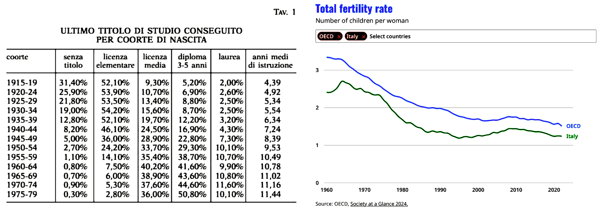

 

## Italia: fuga di cervelli e falso documentale

- **1st draf**, articolo scritto a partire da alcuni post pubblicati su LinkedIn nei giorni precedenti.
   - [post #4](https://www.linkedin.com/posts/robertofoglietta_produciamo-troppi-laureati-oppure-cosa-activity-7346744357888188416-Pm_K) (2025-07-04) - [post #3](https://www.linkedin.com/posts/robertofoglietta_segni-che-arrivano-dallalto-del-cielo-activity-7346256090105270275-w-Pj) (2025-07-03) - [post #2](https://www.linkedin.com/posts/robertofoglietta_2-luglio-2025-seimila-componenti-difettosi-activity-7346147415990665217-wlk4) (2025-07-03) - [post #1](https://www.linkedin.com/posts/robertofoglietta_segni-che-arrivano-dallalto-del-cielo-activity-7345379742054764547-PqXj) (2025-07-01)

---

### Tasso di educazione in Italia

> Abbiamo prodotto più laureati di quanti la nostra economia sia in grado di digerirne, nulla di più e nulla di meno.

In Italia i laureati STEM mancano e quindi questo non è vero. Invece è vero che esiste un cartello fra aziende che non si fanno concorrenza nell'assunzione dei talenti perché non sono esse stesse competitive. Quando le aziende sono competitive anche gli stipendi lo sono, o tendono ad esserlo.

Il problema invece è che il sistema universitario ha prodotto TROPPI laureati in alcune materie che non hanno uno sbocco professionale e questo è chiaramente un limite: ci sono più avvocati a Roma che in tutta la Francia nonostante la Francia conti 80 milioni di abitanti. Un esempio classico fra tutti.

Comunque ho qualche dubbio sulla presentazione di questi numeri e la ragione è abbastanza semplice: fino al 1980, al più il 12% della popolazione è laureata mentre attualmente la media è di circa il 20% che comunque è la metà di quella europea (41%). Significa che fra il 1980 e il 2000 abbiamo prodotto tanti laureati da portare il 12% nella popolazione al 20%. Ma il numero di nascite è in progressiva diminuzione, rispetto al 1960. Ciò porterebbe a pensare che oggi il 40% degli 2000-2005 avrà una laurea.

---

### L'evoluzione del sistema Italia

Ritornando alla questione di cui sopra, il problema non è che il sistema non riesca a "digerire" i troppi laureati che produce, è invece il contrario, il sistema non è abbastanza competitivo e non lo è perché ha prodotto troppi laureati in materie non STEM che quindi NON portano progresso tecnologico, quindi non portano innovazione, quindi non portano competitività e quindi il sistema nel suo complesso perde terreno rispetto ad altri paesi.

Da qui la fuga di cervelli. Ma se la Germania che ha il 32% di laureati quindi meno della media -- anche perché che il tasso più alto di laureati si trova nei paesi ex-comunisti dell'est Europa -- attira i cervelli, allora sicuramente non è una questione che l'Italia produca "troppi" laureati. Si potrebbe dire che l'Italia produca "relativamente troppi laureati" rispetto a quelli che riesce ad impiegare (tesi sopra esposta) ma anche questo è sbagliato, perché gli STEM mancano. Quindi ne produce troppi del tipo sbagliato.

Se ne produce e ne ha prodotto troppi del tipo sbagliato questo sarà vero anche per i diplomati e nel complesso, laureati e diplomati del tipo sbagliato hanno portato il sistema Italia ad essere "sbagliato" rispetto al trend Europeo e globale ovvero poco competitivo. É anche così che siamo passati da essere 4° potenza industriale a terzo mondo (solo servizi) perché con l'automazione delle industrie, non sono i laureati che devono fare gli operai ma sono i laureati che devono fare gli automatismi.

Coloro che NON sanno fare, al più possono vendere quindi servizi invece di industria, il paese non ha nucleare quindi importa energia, non produce quindi non esporta prodotti ma non esporta nemmeno tecnologia. Amen.

---

### Approfondimento con Gemini

In questa [conversazione](https://lnkd.in/dR6GBqXs) o la sua [trascrizione](not-yet.txt#?target=_blank).

+

## Dall'industria, ai servizi, al falso

L'Italia che era negli anni '80 la quarta potenza industriale al mondo ha visto cambiare sensibilmente la sua struttura economico-produttiva in questi 40 anni. Oppure, considerando l'ingresso della Cina nel WTO, sarebbe più corretto affermare che l'Italia ha proseguito nel suo piano "industriale" mentre il resto del mondo è andato in direzione opposta.

Due affermazioni complementari che nel loro complesso meritano di essere spiegate attraverso due casi recenti che potremmo considerare emblematici, ognuno dei due nel loro specifico contesto ed entrambi complementari come le due affermazioni di cui sopra.

Fare manutenzione di qualità a prezzo e intensità tecnica elevati oppure risparmiare sui costi di gestione e pagare un'assicurazione che copra eventuali incidenti o danni? Una domanda che è solo un caso specifico del dilemma manageriale "do or buy".

La migliore assicurazione è la scelta di un servizio di manutenzione eccellente oppure è preferibile risparmiare sui costi di manutenzione e pagare una polizza? Da un punto di vista manageriale la seconda scelta è un jolly di tipo omnibus.

Quando il management ha **zero** cognizioni tecniche diventa anche l'unica opzione e quando c'è un'unica opzione su molti, troppi, tavoli è ovvio che il premio cresce così come la competizione sui costi fino al punto in cui i sinistri diventano la norma e non più l'eccezione.

D'altra parte quando il management ha **zero** cognizioni tecniche la loro percezione si limita alla superficie, quindi il controllo qualità si fa sui documenti, e quando questo diventa la via maestra dove persino i controlli a compione sono un'eccezione, è chiaro che il falso documentale diventa il modus operandi come destinazione finale di una deriva patologica.

In sintesi, la radice del problema è la stessa, le manifestazioni del problema invece prevedono molte diramazioni e varietà rendendo apparentemente difficile riconoscere l'origine del problema anche perché essendo un problema sistemico è un banale "così fan tutti". La banalità del Male, appunto.

---

### La gestione del rischio al collasso sistemico

La gestione del rischio ha sempre un orizzonte temporale definito e per estensione su una finestra temporale molto lungo, l'esempio più emblematico è quello della gestione del cambiamento climatico, che recentemente è stato indicato come causa del collasso dell'insegna di Generali in cima alla torre del loro HQ a Milano.

Due questioni scottanti che non riguardano solo Generali ma anche Boeing e Leonardo tanto per fare nomi di società che non sono minuscole eppure sono afflitte dallo stesso problema che apparentemente può assomigliare all'incidente di Costa Crociere ma invece è totalmente diverso. Perché quello della Costa Concordia è stato delegare un certo grado di gestione del rischio al comandante della nave e la gestione del rischio relativa era selezionare i capitani in modo prudente. Quindi un problema di mancanza di doppio check.

Quello che invece stiamo osservando in Italia, come catena infinita di disservizi, rotture, ritardi, fallimenti e cedimenti come nel caso delle Generali è un problema sistemico che riguarda un sistema che NON ha percezione della realtà, a differenza dei capitani delle navi, ma pretende di fare il controllo dei costi, della qualità e del rischio SOLO attraverso la carta: se i documenti sono in ordine allora tutto è in ordine. Senza mai verificare, o non verificare in modo adeguato, che documenti (descrizione) e realtà (sottostante) siano allineati e che lo siano in modo funzionale allo scopo.

Colpa del cambiamento climatico? Il cambiamento climatico non è altro che il risultato di lungo periodo di una progressiva perdita di connessione con la realtà dove le carte, la narrativa, i numeri non sono più una rappresentazione funzionale della realtà ma vengono "prodotti" per adattarsi al "mercato" cioè vendere ciò che sul momento conviene vendere, domani è un altro giorno. In questo, ovviamente, l'Italia è in vetta: un paese che ha cancellato l'idea di un domani, al punto da vivere della nostalgia del passato.

---

### Il collasso della gestione, da Generali a Leonardo

Perché il collasso dell'insegna ha a che fare con il core business di Generali?

Fondamentalmente perché riguarda la gestione del rischio e se Generali non sa farla correttamente per se stessa allora si pone la questione di come sappia farla per i clienti e per quanto riguarda le polizze assicurative, stante che Generali è in forte attivo, se esse siano effettivamente concorrenziali perché per poterlo essere il rischio deve essere correttamente computato in maniera da definire il premio concorrenziale, ammesso che il mercato sia libero e vi sia effettiva concorrenza.

Si noti che in quei mercati dove i contratti sono tipizzati come nel settore RC auto, Genertel è stata una delle prime a sbarcare sul digitale facendo risparmiare sui costi della rete di vendita ma Prima Assicurazioni ha dimostrato che si poteva fare molto meglio in termini di competitività valutando in maniera più precisa il rischio e quindi abbattendo il valore dei premi.

Ci sarebbe molto da dire a riguardo ma torniamo al concetto di collasso sistemico della gestione del rischio. L'amministrazione della torre cerca, come ogni gestione amministrativa, di ridurre i costi che alla fine si traducono in una più carente manutenzione o di un'eccessiva diluizione della sostituzione della struttura. 

Il controllo dei costi è sulla carta, il controllo della qualità del servizio è sulla carta e quindi il controllo del rischio è sulla carta. Perché l'azienda di manutenzione che fa meno a meno prende il contratto fintanto che il meno è anche meno di abbastanza, poi interviene l'assicurazione. Quindi è un circolo vizioso che in questo caso dove assicurazione, torre e amministrazione fanno riferimento ad un unica proprietà si manifesta nella sua massima espressione emblematica.

Un altro caso iconico è Boeing, Leonardo e le due aziende fornitrici di Brindisi.

---

### Il caso Leonardo per i Boeing 787 e 477

[!INFO]
2 luglio 2025 - Seimila componenti difettosi usati su 477 aerei Boeing 787: a processo due aziende di Brindisi e sette imputati saranno processati per aver fornito componenti difettosi per 477 Boeing 787. Le accuse: frode, attentato alla sicurezza e inquinamento. Tra le parti civili, Leonardo e Boeing. Processo al via nel 2026. -- lnkd.in/dk-WtGz6
[/INFO]

Una domanda sorge spontanea: chi doveva fare il quality check della componentistica in ingresso e/o al montaggio?

### Informazioni raccolte web-access ChatGPT

Leonardo acquistava quei componenti dalle aziende brindisine per integrarli nei propri moduli o sistemi destinati a Boeing, nel quadro della sua collaborazione industriale con Boeing. Leonardo è fornitore strategico per la struttura della fusoliera del 787. Il caso evidenzia la vulnerabilità della supply chain aerospaziale, dove subfornitori minori possono compromettere interi programmi industriali globali.

>>>|
**Sintesi della filiera**
   - Aziende Brindisine (componenti difettosi)
      - Leonardo S.p.A. (assemblaggi strutturali e integrazione) 
         - Boeing (uso finale su 787)
|<<<

Leonardo S.p.A. effettua controlli di qualità sui componenti ricevuti, ma il sistema ha mostrato delle lacune in questo caso specifico: 

- Prima di aggiungere un’azienda come MPS (Manufacturing Process Specification) nella propria lista, Leonardo valuta la capacità produttiva e la conformità ai requisiti aerospaziali tramite analisi documentali e revisioni dei processi

#### Dove il sistema ha fallito

- Mancanza di controlli fisici a campione. Gli audit condotti (sia interni che esterni) non includevano test casuali o ispezioni fisiche sui pezzi al momento del ricevimento. Leonardo si basava soprattutto su approvazioni di terze parti senza controllo tangibile del materiale

- Scoperta tardiva del problema. Il difetto, consistente nell'uso di titanio puro anziché della lega adeguata, venne identificato solo tra fine 2020 e inizio 2021 dopo segnalazioni di Boeing e approfondimenti interni. Questo ha fatto emergere la debolezza dei controlli originali.

Fonte delle informazioni: [lnkd.in/dfCEdz8U](https://lnkd.in/dfCEdz8U) e i primi due prompt riguardano il meme "Fuckaldo" su Generali.

+

## Il Cambiamento climatico. questo sconosciuto

Se le strutture d'acciaio collassero sopra i 40°C allora a Dubai dovrebbero ancora vivere nelle tende, e non mi pare che sia così. Che poi il cambiamento climatico, per la parte imputabile al c.d. antropocene possa seppur marginale, possa generare un grande cambiamento a livello globale, è realistico ma, purtroppo, difficile da prevedere con accuratezza. Certamente non fa crollare le impalcature che pure sono tirate su da gente che non sono certo ingegneri.

Le dichiarazioni che riportano "cambiamento climatico" o "clima torrido" non si riferiscono a quel fenomeno in senso letterale, ma al cambio di potere che sta generando un clima di alta tensione. Capisco che sia una lettura molto alla Men in Black, ma d'altronde credere che una struttura d'acciaio collassi per il caldo quando ciò non avviene nemmeno nei ponteggi che sono tirati insieme da gente che la laurea in ingegneria non l'ha mai vista, fa ridere ancora di più.

=-> lnkd.in/dF7pv-Nv

Perché è importante aver dato una lettura profondamente alternativa, quasi sarcastica riguardo al treno di articoli su varie testate giornalistiche che sostenevano essere il cambiamento climatico la causa del collasso dell'insegna di Generali?

Perché, tanto è più corretta l'analisi di un collasso sistemico dovuto ad un handicap del management italiano che negli ultimi 40 anni ha causato una deriva patologica che come esito ultimo ha il falso documentale come modus operandi standard (ovvero assenza di controlli reali, ma solo documentali: *così fan tutti*) e l'assicurazione come jolly per lo scaricabarile delle responsabiltià (assicurazione must-have is the new negazione dell'handicap manageriale: *tanto siamo assicurati*).

Curioso che alcuni su LinkedIn abbiano portato come temine di paragone il caso della Costa Concordia, che però c'entra come i cavoli a merenda, però in qualche misura è affascinante (#1) per non usare termini dispregiativi sebbene più consoni, abbinare una tragedia con morti all'idea che se Costa Crociere è sopravissuta a quel disastro allora non è un problema nemmeno per Generali.

Deve piovere un meteorite dal cielo? Deve cadere la Luna? Deve esplodere un super-vulcano? Deus-vult quindi nemmeno tutto ciò basterebbe. Stupidity kills.

---

### Nota #1

Alzare l'asticella crea una [pressione evolutiva](322-il-ruolo-della-selezione-naturale-nella-societa.md#alzare-lasticella-crea-una-pressione-evolutiva?target=_blank), che in tutto e per tutto è equivalente ad uno stress per il sistema -- ricordiamoci infatti che la selezione naturale opera sulle specie, quindi sui gruppi, e **non** sugli individui -- poiché lo stress non piace allora si evita. 

Ma non è detto che se noi, per noi stessi, abbassiamo l'asticella gli altri non l'alzino magari in principio solo per loro stessi e poi per confronto diretto ovvero concorrenza sul mercato, l'alzino anche per noi. La produzione Cinese è sempre stata sottovalutata in Italia perché "*tanto la loro qualità è bassa, e poi anche loro saranno costretti ad alzare i prezzi quando gli operai chiederanno più soldi*". 

Però non è andata così, non solo perché i Cinesi sono diventati 1.3 miliardi nel frattempo, ma perché sfornando STEM a ciclo continuo e a volumi industriali, sono passati alla produzione automatica che fa alzare gli stipendi degli operai ma anche i volumi di produzione e la qualità.

Uno scenario del tutto ovvio a posteriori ma in realtà era ovvio anche a priori -- come in effetti la Germania sapeva e coerentemente si comportava già all'epoca dello SME cosa che noi gli rinfacciamo come vantaggio d'ingresso nell'Euro, loro 1:1 marco:euro e noi 2K:1 lira:euro, però eravamo anche quelli che si credevano furbi a svalutare la lira per agevolare l'esportazione della produzione industriale nazionale -- o lo sarebbe stato ovvio a priori agli occhi di una classe dirigente con un'estrazione STEM piuttosto che **solo** umanistica.

Perché alla fine della giornata, cari signori, la realtà è che un informatico può leggere e capire Omero ma un filoso non sa scrivere e debuggare codice. Oplà, il disastro è tutto qua!

+

## Related articles

- [Il cambiamento climatico questo sconosciuto](295-il-cambiamento-climatico-questo-sconosciuto.md#?target=_blank) &nbsp; (2024-12-14)
+++++
- [La cartolarizzazione del lavoratore](https://robang74.github.io/roberto-a-foglietta/html/linkedin/la-cartolarizzazione-del-lavoratore-roberto-a-foglietta.html) &nbsp; [lkdn](https://www.linkedin.com/pulse/la-cartolarizzazione-del-lavoratore-roberto-a-foglietta) &nbsp; (2017-10-27)

+

## Share alike

&copy; 2025, **Roberto A. Foglietta** &lt;roberto.foglietta@gmail.com&gt;, [CC BY-NC-ND 4.0](https://creativecommons.org/licenses/by-nc-nd/4.0/)

