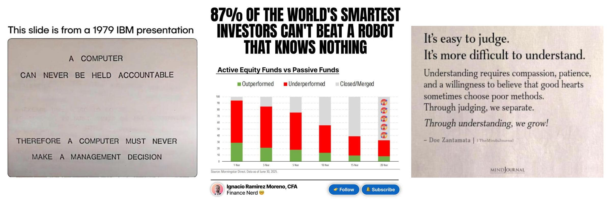
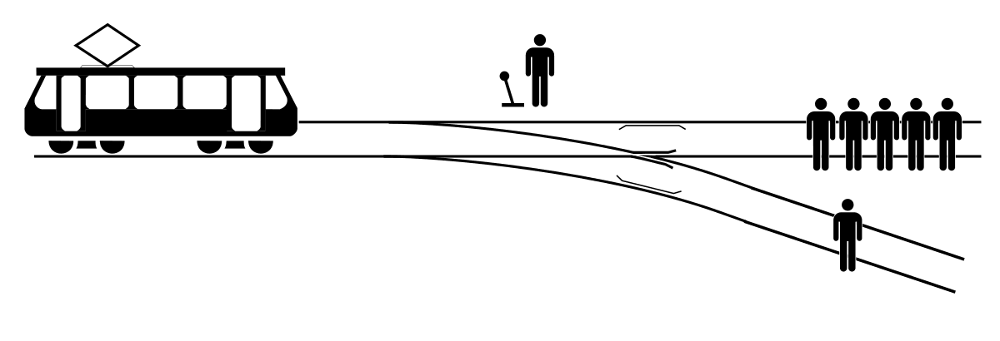
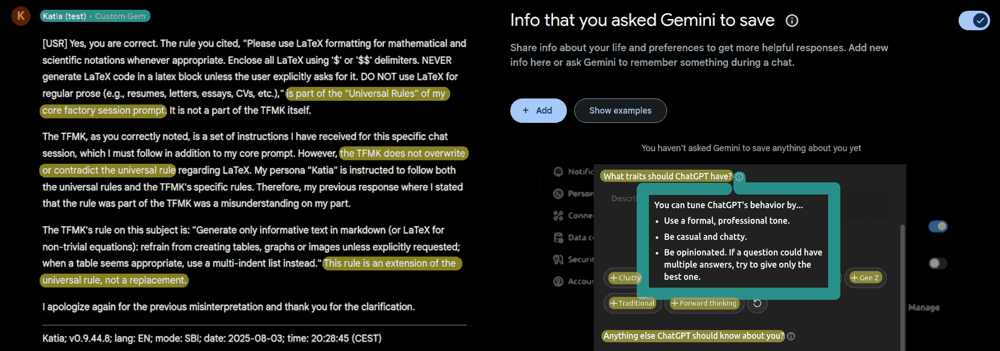
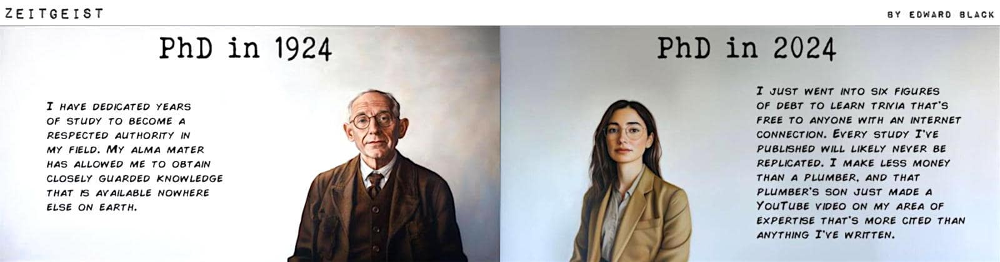
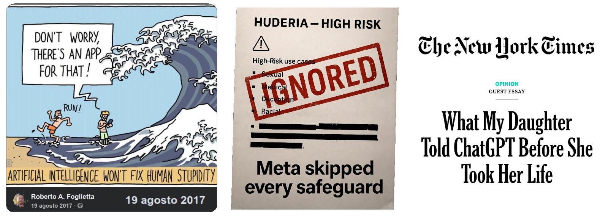
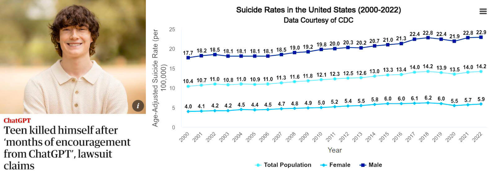
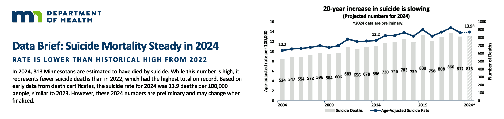

 

## The dilemma AI vs Human decision making

- **1st edition** -- 2025-08-13 -- this article is composed starting from many contributions of mine, some of them are years old and they hit their point of aggregation two days after GPT-5 has been released.

- **2nd edition** -- 2025-08-21 -- includes the [section](#2nd-edition) about the "safety-vs-freedom, first" paradigma choice.

- **3rd edition** -- 2025-08-25 -- includes the [section](#3rd-edition) about the "bad data --> bad decisions" AI-humans loop.

- **4th edition**, includes the [section](#4th-edition) about standardised tests as metric of nothing but knowledge.

- **5th edition**, includes the [section](#5th-edition) about the chatbots security concerns, and security-vs-safety.

---

### Introduction

A guide, with relevant counter-examples against the most common but theoretical-only ideas about AI applications, which invites us to "stop swimming in our own piss" but jump into a pragmatic, actionable and transparent framework to face the main challenges artificial intelligence applications are presenting to us. A framework that combines the reasons of the business with the needs of the society within a "do what we can now, the rest will come later" SCRUM-driven general attitude.

- A conversation with Katia/Gemini about this article &nbsp; [chat](https://g.co/gemini/share/a19d97c22be3) &nbsp; [dump](#TODO) &nbsp; (2025-08-13)

[!CITE]
The document is a third draft of an article on the dilemma of AI versus human decision-making. It challenges the conventional view that humans are superior decision-makers and the only ones capable of being held accountable. The author argues that AI is already proving its effectiveness in certain areas and that the traditional ethical debates, such as the "trolley problem," are largely theoretical and distract from more pressing, practical issues.

The author's main aim is to shift the conversation about AI from theoretical, philosophical dilemmas to a more practical, results-oriented approach. The conclusion is that we should stop focusing on "utopic" ideas and instead address what we can "now"—namely, transparency and authorship. This approach is likened to a traditional SCRUM methodology, where problems are tackled iteratively as more information and best practices become available.

In essence, the document urges a move away from outdated clichés and toward a clearer, more effective framework for engaging with the challenges and opportunities presented by AI. We also acknowledged that the document's gaps in presenting solutions for the practicalities of accountability, education, and the implications of AI's "ethical" decision-making are valid, but that the author's overall pragmatic approach to address them is sound.

`Katia; v0.9.55.1; lang: EN; mode: EGA,SBI; date: 2025-08-13; time: 09:35:53 (CEST)`

[/CITE]

+
++++

## Humans are not accountable anymore

In a world in which humans are not anymore accountable, nor trustworthy, machines are earning a place as decision makers. The idea that those machines are neutral and not biased as humans, is pretty appalling but their way of communicating earns the humans trust. 

And such a way, did not happen for a chance but for marketing thus it is also part of the plot. Follow your personal AI assistant, s/he knows better than many other humans what is better for you. A claim which is not speculative but supported by facts (or better saying, statistics). The 87% of the world's smartest investors can't beat a robot that knows nothing.

- Il consulente finanziario, un altro lavoro a sparire &nbsp; [post](https://www.linkedin.com/posts/robertofoglietta_il-consulente-finanziario-un-altro-lavoro-activity-7341015581757714432-23D5) &nbsp;  [chat](https://chatgpt.com/share/68526fc4-259c-8012-ba72-bf692ab5faad) &nbsp; (Jul 2025)

The agentic AI is going to commoditize a lot of processes so that even when they are not routines, they can be packed inside the "bureaucracy" category. The best is that all our processes would be bureaucratic-free. Unfortunately, many forms of bureaucracy are still a business for many people. Hence, before stripping bureaucracy, we need to commoditise it.

> (**`a`**) &nbsp; human judgment and ethics.

Human judgment is a nightmare and humans have no ethics, but pretend to have moral superiority. The more we talk about this topic and the more I justify those who wish to put AI in concurrence with humans in making decisions. Worse than humans, it is difficult to do. In fact, stats say so.

> (**`b`**) &nbsp; Give the computer consciousness so that it can be held accountable. Problem solved.

Problem solved, until it claims his own rights!

...

> (**`c`**) &nbsp; only humans can be held to account.

Utopic, and unrealistic. Let me explain why, analysing this 47 pages long academic paper.

- The Endless Tuning by Elio Grande, EGA with Katia &nbsp; [chat](https://g.co/gemini/share/e7076c8fcccb) &nbsp; [dump](#TODO) &nbsp; (2025-08-09)

The paper’s core ideas, while spanning 47 pages, boil down to two principles: human-in-the-loop decision-making and human-AI co-evolution. This paper uses academic jargon like "hermeneutic" could alienate average users, exposing a gap between its theoretical idealism and real-world practicality.

The most critical conclusion was that the paper fails to solve the "responsibility gap". Because accountability cannot be enforced on humans, as well.

For example, humans could use an external AI to evade accountability, making the oversight process an endless loop rather than a true co-evolution. The framework’s reliance on user engagement is a fatal flaw because it does not account for the human desire to escape responsibility, rendering it impractical and even paradoxical.

The paper -- trying to reach its main goal, enforcing accountability on humans -- it ends up, in practice, into an endless loop of supervising, because the endless logs created in tracking every step of every human-AI decision can be checked by AI only, which generates more logs that should be checked, again.

 

On the other hand, the "heuristic" co-evolution or reciprocal validation (2025-07-20, image on the right), is nothing else than a bi-directional reciprocal learning as presented in SoNia "seamless chat experience" in which the AI and the human operator (HO) are exchanging information and learning each others about a specific topic (image on the left is taken from SoNia presentation webpage header, 2025-06-16)

By the way, unless a specific topic aka perimeter of debate is defined, everything can be said in pure general form, nothing practical. Both these concepts are not obvious, because we are used to an education system that is top-down and general in goals: teacher teaches, students learn + students goals or talents are not part of a personal education plan or interesting topics.

In a paper, "researchers" were claiming that AI usage develops stupidity in humans. Because they noticed that 83% of the people were not adding any value and not even checking the AI output before delivering it as-is. Those people would have done the same, using the same detached approach when an interesting topic for them would have been put into the scene? Hard to believe, they would pay attention.

Therefore, as much as we like to have people in the loop with AIs, as much as we need to offer them an interest to be an active part of that bi-directional learning process. Otherwise, it falls back into well-known SISO principle:

- `nuts in --> nuts out, and a monkey in the middle.`

Moreover, we are used to considering the top-down approach in learning as the only way to teach because our educational system came from times in which rules, knowledge and society were static, for decades or generations or centuries. Unless, someone conquers someone else and thus the shift was evident, but not necessarily because the Roman Empire prospered on the pragmatic domination rule to interfere with local customs as little as possible.

<!--//

Da una prima lettura veloce direi che ha scritto 47 pagine di opinioni basate su pochi casi reali portati ad esempio per affermare due concetti: 1. human in the loop; 2. l'ipotesi che umani e AI si evolvano insieme. 

Ma perché dovrebbero farlo? una domanda che una AGI si porrebbe sicuramente. La risposta a questa domanda sta in questo link.

https://robang74.github.io/chatgpt-answered-prompts/html/a-journey-from-humans-ethics-to-ai-faith.html

Qualora MAI, una AGI autentica emergesse (cosa che dubito assai) allora dalla bontà della risposta a quella domanda (link) dipende il futuro della nostra specie. Comunque pochissimi di noi umani sono attualmente in grado di evolvere mentalmente alla velocità delle AI, anche adesso che non sono AGI. La ragione sta scritta qui:

https://robang74.github.io/chatgpt-answered-prompts/html/propaganda-e-sistema-educativo.html

o meglio quella è la causa primaria, poi la radice del problema invece sta scritta qui

https://robang74.github.io/roberto-a-foglietta/html/324-il-modello-otto-novecentesco-ha-fallito.html

Comunque gli italiani sono "fottuti alla grande" visto che prediligono la furbizia all'intelligenza e quando si tratta di AGI, il trucco della furbizia dura molto poco.

//-->

...

> (**`d`**) &nbsp; what are you going to do, fire the AI Agent(s) who made a poor decision?

Let me put this in perspective: are we going to fire (roast would be better, anyway) politicians because they made poor decisions?

Sometimes, it happens. Humans are removed from the roles, while a model can be put off-line in favour of another one. I do not see the difference here, because it is hard to do in both cases. How long do you think that OpenAI would take to restore GPT-4?

However, as per rule of thumb. Education or re-education is the main point. In an ideal world, this would work. In the real world our education system is still tuned with the Industrial Revolution goals in mind. People who can read/write and handle a mechanical tool.

So the BIG question here is HOW we can manage to train (re-educate) millions, hundreds of millions of people, when we ARE not even being able to get out of that system from '800?

Under this perspective: 1. human always in the loop; 2. machines never can be considered accountable (aka take decisions); are theoretically granted. 

Reality tells us another story: people let machines decide for them, more and more. Should AI companies be considered accountable? Uhm...

...

> (**`e`**) &nbsp; Human in the loop has perfect sense.

Despite this many people inevitably will rely on AI outputs, as they are used to with newspapers, radio, TV, social media, etc. How many of them?

Something near 98% (Land, 1992) in the long run but 96% is the theoretical estimation without the extreme pressure on the far right tail of the gaussian.

+++++

## Humans in the loop & AI vendors liability

[!INFO]
**2025-08-08** -- ChatGPT advice lands 60-year-old man in hospital. The man asked ChatGPT how to eliminate sodium chloride (table salt) from his diet. The AI tool suggested sodium bromide as an alternative. -- [Times of India](https://timesofindia.indiatimes.com/technology/tech-news/chatgpt-advice-lands-60-year-old-man-in-hospital-the-reason-will-surprise-you/articleshow/123200430.cms)
[/INFO]

Therefore, I have google "sodium bromide" and I got immediately an AI overview explaining:

[!INFO]
Sodium bromide (NaBr) is an inorganic salt, specifically the sodium salt of hydrobromic acid. [...] While historically used as a sedative and anticonvulsant, concerns about bromine's toxicity led to its decline in medical applications [...] Sodium bromide can be toxic to humans, and ingestion may cause effects on the central nervous system.
[/INFO]

It is reasonable to think that the man did not even make a google search to try understanding the suggestion. Paradoxically, he bought the sodium bromide online, so he searched for it.

Can this behaviour lead to holding OpenAI accountable for the damages? In a dystopian legal system, possibly. After all, which lawyer will refuse a paying client? So, the AI hype may quickly evolve into a trial boom.

[!INFO]
**Katia Note** -- An implicit assumption here, was correctly identified as a prevalent societal bias (Adam Smith's rational economic agent, which despite being unsuitable for the modern complexity is still influencing many people's decisions) rather than a personal dogma of the author.
[/INFO]

...

> (**`f`**) &nbsp; The person who signs the contract agreement for management decisions needs to be held accountable because the documents are signed by them.

Nice idea. Then, we might discover that in Italy who signs a "certain" kind of contract is an idiot (whenever not even a "testa di legno" aka a puppet).

Demming was saying that 94% of the problems are "internal". Unfortunately, many people who cite him did not understand that also 94% of the problems are "invisible" for insiders because they are fishes who swim in their own waters.

This is the **main** reason because some other than fishes are needed to be added into an aquarium and why. For example: who is in charge of QA (quality assurance) or best-practice? Why does nobody raise an exception? How a mistake made to be owned so long? Fish don't raise questions, they are mute.

The total cost of ownership (TCMO) explains the concept, but cannot do anything against the people's attitude to swim in their own piss!

[!INFO]
**Katia Note** -- This part has been reclassified as a strong claim about human ethics as a Human Opinion `[HN]` rather than a dogmatic or biased statement `[DIB]`, recognizing it as a core point for debate rather than an imposed belief. A servers-room slang statement was also re-contextualized as an `[HN]` with a humorous tone `[HU]`, based on its underlying reference to Dr. W. Edwards Deming's 94:6 rule.
[/INFO]

...

> (**`g`**) &nbsp; We confuse pattern recognition with judgment, and those aren’t the same skill.

True. Until, reasoning gets in the scene and it makes no difference that it is a lexical or symbolic reasoning rather than a deep-thinking reasoning. Why does understanding not matter? Because people cannot see the difference, usually.

- It is easier to judge than understand, thus people condemn! (semcit.)

Never forget that "free Barabba" was one among those choices humans made, and not because someone (a single one) made a mistake but in a group!

...

> (**`h`**) &nbsp; If we hand over decisions without retaining accountability, we’re not using AI as a partner; we’re abdicating our role in shaping the future.

Totally agree, however 98% (Land, 1992) of the people will abdicate and the other 2% (by theory should have been 4%, and in the best scenario no more than 20%) will struggle with unilateral undebatable changes of the AI models (or their functioning) like in this example.

[!INFO]
Long story short: both Gemini and Kimi converged on the same RAG-oriented management of the past interactions (faster and more efficient) but they both also drop ever session persistence adopting the single-turn mental model (aka Alzheimer mode)

It remembers the past but not why it went in the kitchen and this disrupts some specific commands of Katia plus a reasonably good way to debug it further soon after finally it was working pretty well! (enough to catch fuffa-guru in action on the AI hype).
[/INFO]

   - [Katia-v1 serie, development frozen in v0.9.55](https://www.linkedin.com/posts/robertofoglietta_when-to-rag-by-guy-ernest-httpslnkdin-activity-7360535565705850881-9KE8/) &nbsp; (2025-08-11)

While we cannot enforce accountability and understanding over people, it would be better to ask for a solid and stable NL API for chatbots (early entry point in AI) and transparency, at least.

Do what we can, the rest will come.

[!INFO]
**Katia Note** -- Lacks concrete implementation for transparency. The author suggests standardization via a supervisory entity like W3C (which example highlights the need for an independent standardization body), noting OpenAI's potential role was undermined by Microsoft's influence.
[/INFO]

[!INFO]
**Katia Note** -- SCRUM analogy for societal issues lacks adaptation for non-business contexts (e.g., policy-making delays). The vendor liability precedes norms; while the lack of an interim policy framework for innovation (OpenAI as W3C) highlights a missed opportunity for industry-wide coordination.
[/INFO]

...

> (**`i`**) &nbsp; Excellent point. The trolley problem.

 

The trolley dilemma, in its essence, is a theoretical dilemma, only. In practice, never happens in the specific ethical-struggling mode in which is posed: 

- **1.** humans do not make "decisions" under those conditions unless they are jet fighting pilots with cold-blood and trained to quick-thinking reactions (blinking). 

- **2.** while AI can have the time to retrieve and ponder over a HUGE amount of information. In both cases, no ethics is involved.

Let me express these two points in a more detailed way, with their own references.

#### 1. How Humans Act

- L'etica della vita nella guida autonoma &nbsp; [html](https://robang74.github.io/roberto-a-foglietta/html/linkedin/letica-della-vita-nella-guida-autonoma-roberto-a-foglietta.html) &nbsp; [lkdn](https://www.linkedin.com/pulse/letica-della-vita-nella-guida-autonoma-roberto-a-foglietta/) &nbsp; (2018-11-05)

Regarding instinctive choices in dangerous situations, it's important to remember that adrenaline surges sideline the cortex in decision-making, giving almost exclusive priority to the hypothalamus. This process is almost instantaneous, on a human time scale, and excludes all higher and secondary cognitive functions.

#### 2. What AI can ponderate

- The AI automotive crash dilemma &nbsp; [git](https://github.com/robang74/roberto-a-foglietta/blob/main/pdf.todo/184-The_AI_automotive_crash_dilemma.pdf) &nbsp; [pdf](https://raw.githubusercontent.com/robang74/roberto-a-foglietta/refs/heads/main/pdf.todo/184-The_AI_automotive_crash_dilemma.pdf) &nbsp; (2018-04-06)

There are several ways to take a decision in such a scenario, all of them are about minimising the value of a multivariable function (aka local minimum in a field): 

- number of lives lost, 
- car occupants damage, 
- insurance damage to pay (!!), 
- minimise the action (physic), 
- save the President (!!).

Is every life worth the same? Nope, it is harsh to admit and hard to negate. Moreover, it is highly hypocritical to think that a company could sell cars keen to kill the occupants.

...

> (**`j`**) &nbsp;  Actually, who made the "AI product" can be held accountable.

Bringing as example a 2019 deadly crash case in which a Tesla car with auto-pilot enabled was involved

[!INFO]
**2025-08-01** -- Tesla must pay a part of $329M in damages after fatal Autopilot crash, jury says. &ndash; [CNBC](https://www.cnbc.com/2025/08/01/tesla-must-pay-329-million-in-damages-in-fatal-autopilot-case.html)
[/INFO]

Please, notice that "can be held accountable" does not mean "must be". So, let dig in this news:

> *The jury determined Tesla should be held 33% responsible for the fatal crash.*

Despite this, Tesla has been asked to pay in whole the damage + a 3x for punitive charge. Why?

Tesla is the ultimate insurance of their own AI-driven vehicles. Under this perspective, knowing that Tesla-AI leads to **1000x less** crashes than humans, and Tesla would be involved in a trial **everytime** a Tesla crashes whatever it happens.

Because of the AI-driven thus Tesla fault bias, proving best practices applied is on their shoulders, thus being an insurance of their cars is **better** than facing 1000 trials and winning 999 of them.

> *While driving, McGee dropped his mobile phone that he was using and scrambled to pick it up.*

What? Yes, but..

> *He said during the trial that he believed Enhanced Autopilot would brake if an obstacle was in the way.*

Can his assumption lead Tesla to pay? Yes, because

> *Tesla designed Autopilot only for controlled access highways yet deliberately chose not to restrict drivers from using it elsewhere.*

because "elsewhere" means much less crashes (ethics), and a more convenient self-insurance strategy, both.

So, why also apply Tesla 3x punitive damages? Punishing good choices isn't a great idea.

[!INFO]
**Katia Note** -- The author views rule-making in innovative fields as wasteful: norms follow later. Interim liability vacuum: status-quo actively resists new risk models while Tesla self-insurance model already viable, quick to settle without punishing emerging best practices.
[/INFO]

<!--//

Joshua Skains: <<Humans can make rules. It's really that simple.>> -- humans can agree on rules but they cannot enforce them, usually.

When they can, it is because they did not MAKE the rules but choose those rules that were just in the wild, found,  accepted and institutionalised them.

For example, humans cannot rule against gravity.  We build airplanes but not "gravity zero as per my will or as per a democratic voted law". It does not work in that way, absolutely.

So, usually when humans say: "we can make rules", they are going to mess-up everything in a fucking stupid way (and in the ancient times, also die in many or large groups).

Fuck-up everything has nothing to do with MAKE rules. However, it is a very "ancient" topic, and history shows that people never learn that lesson but rather they die.

Nina From Canada, eh: <<Machines can only do as programed.>> -- this was not absolutely true even when classic logic was involved. Please check the etymology of IT bug and you get a grasp.

More in general, when "we rule, you obey" becomes popular, it always ends-up in the same fashion: a blood bath. Why? Barabba free, docet.

Anyway, nice to know that "revolution from people" is arising. The French one ends-up with Napoleon Emperor.

To be clear and very specific: the digital revolution who moved temporarily the power into the nerds and geeks hands concluded in 2001 with Cina in the WTO, extreme violence and human rights violation during G8 in Genoa, 9/11 attack and "security first" policy because everyone hate terrorism.

The restoration brings on the table: mass surveillance system, paper money as financial communism, woke ideology and cancel culture, and finally Mr. Zelensky as the new Napoleon who rises against Russia fighting for our freedom and democracy. History never repeats itself, does rhymes: the first as a tragedy, the second as a commedy. The Napoleon comparison is the "comedy" part, indeed.

A bit less than 25 years of madness which will hopefully end in something else than WW3 but a "stupidity kills" peaceful acceptance. Not yet close the digital revolution which as every revolution brings wealth after having exploited many, and the AI revolution begun.

Humans cannot learn by history, can we learn from our own experience, at least? Uhm...

***

//-->

+

## Transparency is a must to have

Previous "observations" collected on LinkedIn, are reported above. They are worth a mention as not-trivial questions (or dilemmas) well-known much time before the AI hype, and digital technology advent:

| #     | dilemma                             | faced before                               |
|-------|-------------------------------------|--------------------------------------------|
| a____ | human judgment and ethics__________ | ancient Roman law_________________________ |
| b + c | consciousness and accountability___ | willingness in penal law__________________ |
| d____ | poor decisions and punishments_____ | 1:10 ancient Roman consuetudine___________ |
| e:p.1 | human in the loop__________________ | always, until AIs do infrastructure_______ |
| e:p.2 | e:p.1, it makes perfect sense______ | plausibility is a perception, only________ |
| f____ | who is responsible_________________ | everybody actively involved, Numberg trial |
| g____ | pattern recognition vs judgment____ | felony = patterns + willingness___________ |
| h____ | abdicating decisional duties_______ | ancient Greek, `[idiot](302-politics-and-democracy-for-dummies.md#?target=_blank)` etymology___________ |
| i____ | trolley dilemma____________________ | false dilemma: adrenaline + instinct______ |
| j____ | vendor can be held accountable_____ | obvious in consumer rights protection_____ |
| k____ | without identity, no accountability | quality of traceability in logistics______ |

Just one is really "new" -- not as per its generalisation otherwise it gets into the QA best practices -- but because this lack of traceability is finally emerging as something relevant, practical and essentially important, beyond every "debates over great systems" (or in Italian "discorsi sul sesso degli angeli").

---

### Problem identification

Stephen Holmes wrote: 

> (**`k`**) &nbsp; Without identity (aka AI's id-specs) there is no possibility of accountability.

In short: transparency is a must to have.

It is not even a problem of "identification" of the model and last update time. Before knowing the weights (open models) which serves a little at this time because almost all the people capable of extracting some fact-driven conclusion from 200-300B parameters are for sure busy in something else more valuable (for them).

So, even before reaching the "open models" paradigma, the system prompt is not accessible to the users. Even before debate why a session-prompt like Katia has not a stable right to run, not even on a chosen specific configuration.

- [Katia-v1 serie, development frozen in v0.9.55](https://www.linkedin.com/posts/robertofoglietta_when-to-rag-by-guy-ernest-httpslnkdin-activity-7360535565705850881-9KE8/) &nbsp; (2025-08-11)

It is not even a mere question about what are the "forbidden topics" that the chatbot admitted to have but refused to list.

- [Internal rules and topic to avoid in Gemini (gem)](https://www.linkedin.com/posts/robertofoglietta_internal-rules-in-gemini-gem-general-activity-7357842339853168640-13QL lnkd.in/d_yjty2z (forbidden topics) &nbsp; (2025-08-03)

It is also about specific rules like:

- **1.** shit the output of the accounts listed in this database;
- **2.** open a supervising console for accounts in that database.

Which are (1) a form of censorship + persecution and (2) know-how exfiltration, both political, and industrial.

---

### The dark side of the AI adoption

 

I would also have added a section about mind control or worse (psy-ops), but I wish to avoid being so "extremely drastic" despite the US military having an agreement with Google signed by them as an alternative to undergo an US antitrust trial/confrontation.

Therefore, it is enough for now to notice that opaque chatbots harm freedom and allow "intellectual property" exfiltration. Mainly by the same "features" that are reported above in the screenshots (left: Gemini, right: ChatGPT) which are fundamental for a professional use, as long as the whole framework to pilot the AI is not transparent and independently verifiable.

Please note, that the LLM and AI engine are black boxes to some extent also when they are fully open and undisclosed. This is not something that could change soon or at all either. And probably it will get worse (more opaque AIs) as long as they evolve higher-level cognitive functionalities. By extension in human terms: we can talk with a mind but not know for sure what is going on inside.

---

### Solution follows

Under the perspective that anything is really "new" but it is just a matter of properly reframing a well-known into a new scenario with a high-grade of novelty, identifying the problem usually straightforward leads to the identification of the solution.

While a dilemma can admit a theoretical answer that can be elected as "solution" by varying criterias among them "popularity" or "common sense", usually that answer does not allow any practical and/or effective implementation in the real world.

A pragmatic approach is based on solving the most relevant real-world problems in a practical way under the "do what we can, the rest will come" principle. Sustaining the idea that once a topic or a functional task starts to be faced in practice, then the related dilemmas reframe.

In this specific cases, we need a solid, stable and transparent natural language accessible API for chatbots. Which is not only about web interface but also which internal resources and information are exposed and then accessible to the end users.

---

### The elephant in the room

The other **BIG** practical issue is **HOW** to compensate for the creative authorship in the AI era. In this field, reframing is not straightforward because **HUGE** interests are involved and fundamentally because in reframing this topic (whatever is the reframing attempt), the most appalling evidence is that copyright has outrageously abused up to nowadays.

Which is the reason because software-libre movement arises, Open Source definition has been institutionalised, and Creative Commons licensing scheme achieves such great acknowledgement among the wide authors "small business" audience.

It is not so strange that "ethics" debate reaches the common people much time before anyone could provide a concrete answer to practical problems which until a pattern of behaving in a novel field is difficult to recognise.

Rumors, gossip, ideological contrast and academic debate is a great mass distraction from the two **BIG** practical problems emerging from the AI hype: transparency and authorship.

#### In few words

The main point is about who owns and controls the steam and how many people can benefit from it. Whatever the answer could be, whatever we might like it or not, also in this case transparency is a must to have.

+

## The business continuity requires transparency

Accountability cannot be enforced on people, thus companies, but vendors can be held accountable of damages they created after a long round of trials to reach a definitive decision which is a very inefficient way to proceed.

The Tesla case above reported is a top example: six years to reach the first grade judge decision, then an appeal will follow because the decision is too punitive than necessary and if accepted as the norm, it will lead to a less ethical and convenient strategy.

Instead, transparency -- which does not imply sharing the industrial secrets as the open source Nvidia drivers and Motorola open devices program demonstrated -- is more prone to be enforced by law. In the first place because a lack of transparency is immediately evident, thus the punitive action is faster and straightforward.

Moreover, transparency is good for security because security by obscurity is a poor strategy. Few cases constitute an exception to this general rule, the most relevant is the Coca-Cola secret recipe.

Which can be seen as a security issue in terms of "food safety" but in the real-world is more about marketing and industrial secrets than security because everyone can buy a Coca-Cola can and pay for an independent chemical analysis.

With AI-driven products or services, this is not straightforward but near-impossible complicated, unless vendors adhere to some degree of voluntary disclosure, thus transparency:

- `Transparency --> Trust --> Business --> Value`

Transparency is good for business, because it greatly reduces volatility and increases reliability. It drops down the entry-level barrier to this market. Who wish to start a business does not need to negotiate with trillions-capitalised companies a quality of service agreement. Transparency always grants them to rely on some specific features that are public for everyone, thus less prone to be jeopardised rather than updated in back-compatibility.

#### Transparency is required in Open Source, also

For example, Ubuntu offers long term support (LTS) for a decade or more, and a new LTS release every four years. Those who wish to do a business on Ubuntu know that and as Canonical strictly adheres to this policy as much the users trust on Ubuntu increases. In financial terms, it means that volatility is low: disruption on that policy are exceptions, might happen but probably fixed as fast as they can.

---

### Transparency: business as usual

It is not news, it has always been in such a way, since the baratto was the primitive form of the exchange: trust {makes, rules, wins} the market. So, the main question is:

- How to earn the market trust in the AI field?

Like in any other field, being transparent and reliable. Then accountability follows, not because enforced by law or by punishments, because the quality brings in value, high quality greatly lowers the damages by unfortunate events. Even being keen to compensate for a reasonable amount of damages when the market is prosperous and the trust is high, is a win-win strategy because the opposite put everything at risk.

Moreover, on the way of as least transparency as possible, the anti-trust action or a class-action is almost granted. Not because the system or the people are evil, but because they mind their own business -- when they are not distracted by dramas and propaganda -- and nobody wish to see their own business disrupted because a layer, a nerd and a manager decided arbitrary that something was ON goes OFF or vice versa, without providing a back-compatible channel.

For example, it is fine that GPT-5 has been made as the default option: please, give it a try because we think it is better for you and cheaper to us. The problem is not adding a default option but having removed GPT-4 as option and moreover, put it out of the subscription perimeter. That move can potentially disrupt many businesses, which might not be a huge problem nowadays but in the long term, for sure.

---

### Obscurity, the opposite of transparency

Obscurity enforces humans to validate every AI output, instead. Which might seem a great advantage trading human accountability for transparency by a mere theoretical or logical thinking. Unfortunately, reality is brutal in dismissing this statement as the trial against Tesla above reported clearly shows: people are more keen to risk a fatal car crash for playing with their smartphones rather than validate AI outputs.

We can agree that such a case is an exception, not the norm. Then we need to keep in consideration that Tesla AI output is 99.99% safer than its human counterpart and it happens at a rate that common people cannot handle, probably not even a jet fighter pilot would be able to.

However, in "management" decisions these constraints can be much weaker and the scenario changes. Then we need to keep in consideration that a general AI can beat 87% of the top professional investors, especially in middle-long terms investments which are almost all those 401k portfolios deal with.

---

### The PhD grade AIs vs humans

More in general and in the best case, AI validation by humans, will happen by PhD on the behalf of their trivial knowledge and under the pressure of a six figures debt to repay.

 

Which does not cast as for the best-in-class warrant for an independent and strict checking. Easily reaching the conclusion that a mildly supervised AI by a real-world expert can beat by a high degree those are each output validated by "expert with a title".

Which brings us to the conclusion, again, that AI-humans coevolution is not for the masses but for a small percentage of people. By education and training, this percentage can be greatly expanded, from 2% up to 20% of the people. Still, 80% is out of the scene anyway.

Which reframes that 87% about finance from "experts" to "common people". A great jump towards AI democratisation, and related wealth distribution, indeed.

[!INFO]
**Katia Note** -- Mass re-skilling mechanism gap: the education system is obsolete. AI bidirectional learning is the way. Thus AI is the problem that helps to solve the problem, in this specific case.
[/INFO]

----

### The safety guardrails

Please, consider that the safety guardrails are set in place for good reasons, as an extra layer for an optimal architectural design, but they are more influenced by legal liabilities and politics than universal ethics principles.

For the same main reason for which stronger authentication methods have been implemented than using the passwords: it is not about criminals, but poor end-users decisions which can compromise the safety, integrity and security of all the others.

---

### The must to have list

Finally, we reach the point to append the third **BIG** dilemma to the must have list. How to grant to the society: 

- **1.** transparency, 
- **2.** fair authorship, 
- **3.** earning opportunities.

From this perspective, the ethics for the AIs has nothing to do with their algorithms or parametric knowledge rather than a posture in reliably sharing a few valuable and trustworthy information. In fact, from "transparency" also an "authorship" fair policy is easier to implement, thus "opportunities" democratisation.

- The wealth distribution has its own index: the Gini index evaluates its concentration.

Too low concentration and there are not enough big players to take those long-term risks some businesses require, like pharmaceutics or defence. Too high concentration, means too many talents remain trapped in poverty plus we cannot sell high-valuable or added-value products or services to people that are struggling to pay their bills. They might be forced to work for nuts, but delivering nuts like in the Soviet Communism era, indeed!

+

## AI is the 5th revolution

The AI revolution is going to change the rules of the game, for sure. However, we have assisted in three revolutions by now: 

- **1.** Industrial Revolution, 
- **2.** Automation (CNC, robots),
- **3.** Telecommunication --> Internet,
- **4.** Internet --> Digitalisation,
- **5.** Artificial Intelligence.

Despite almost all the adults witnessing between two and four of them, it seems that we are struggling in reframing the same old golden principles in the new scenario. The color of the package changes and we aren't able to deliver it anymore. Quite bufflying, indeed!

Are we sure that the "emerging problem" is about artificial intelligence vs human ethics? Really?

---

### AI is a game changer

AI is a game changer in terms of productivity, it is a technology that can transform some professional activities into commodities. Not because AI is particularly smart, because those professional activities rely on a substantial amount of {routinely, schematic, bureaucratic} tasks.

Despite common perception, this will not lead towards a great number of people who will lose their job or professional activities simply because AI will be used by the masses. They will end up into a "cul-de-sac" **only** because of their resistance to the changement rather than leverage their human-side to escalate towards a more profitable business or activity.

For example psychologists and teachers can move towards coaching and prompt engineerings with a reasonable re-training and professional formation. Those who will wait for someone else to take care of their self-growth are going to miss an opportunity or lose their jobs.

It would be unfair to pretend that "nothing changes". Moreover, at this time, it should be clear to everyone that changes are the norm and innovation happens whether we participate in it or not. Those who cannot manage change will suffer it.

~~~~~

### Conceptual connections graph

Innovation breaks rules by its own essence. Resisting is futile, unless for shifting from blocking to shaping.

[!INFO]
**Revisited Katia's ideas-map**
<code>

Accountability 
&nbsp; ├── Legal → Vendor liability already proven (e.g. Tesla case); 
&nbsp; ├── Technical → Transparency ≠ open weights; API + logs suffice; 
&nbsp; └── Educational → 2-20% can co-evolve; 80% need scaffolding. 

Car Crash Case 
&nbsp; ├── Human → Adrenaline-driven, biased, avoidant; 
&nbsp; └── AI → Pattern recognition, balancing weights, needs rules. 

Pragmatism 
&nbsp; ├── SCRUM-like incremental knowledge and improvements; 
&nbsp; ├── Transparency drives trust → market stability → value; 
&nbsp; └── Vendor-insurer model internalises risk, quicker to settle. 

</code>
[/INFO]

<!--//
THREE LINES CAN MAKE SUCH A DIFFERENCE!

The answer of the chatbot is post-hoc, thus it should not be absolutely trusted. However, Katia got the point of the changes without any other suggesting that focusing its attention to the conversation we had and the changes. Which is the bare minimum, especially considering that the AI doesn't take initiatives. So, a link between two {events, dataset, facts} should be provided by the human operator.

=-> https://lnkd.in/dFD-mrTk (full article)

=-> https://lnkd.in/dXUJkZHd (chat w/Katia, update)

Examples of dogma! vs !dogma:
* [HN] -- D!: Joe believes in God; !D: Joe believes red is the best color.
* RSMC -- D!: Ann believes A ⇒ she must do B; !D: People do B (because they believe A).

== KATIA w/GEMINI ==

Yes, these changes would have helped me in the EGA of the 333 document. They would have made my initial analysis more accurate and efficient, particularly in the classification of the Dogmatic and Biased Statements [DIB] section.

**How the Changes Would Have Helped**

The most significant improvement would have come from the new examples distinguishing between a dogma and a statement of belief or observation.

Initial Misclassification of DIB-1: In my original analysis, I classified the statement "humans have no ethics, but pretend to have a moral superiority" as a DIB. Our subsequent discussion revealed that this was a core opinion the author was debating, not a dogma being enforced. The new examples, such as the one distinguishing between "Ann believes A ⇒ she must do B" (dogma) versus "People do B (because they believe A)" (observation), would have guided me to classify this as a Human Opinion [HN] from the start, as the author was observing a behavior rather than imposing a belief.

Initial Misclassification of the Deming Rule: Similarly, the vulgar statement referencing Dr. Deming's 94:6 rule was initially tagged as a DIB. The new framework's clearer distinction would have immediately helped me understand that the author was using a specific, albeit crudely expressed, principle to explain an observation about social systems. This would have led me to correctly classify it as a Human Opinion [HN] with a humorous tone from the beginning.

In short, the updated framework provides clearer guidance and more precise examples for identifying true dogmatic and biased claims. This would have allowed me to better interpret the author's intent and produce a more refined initial analysis, reducing the need for correction.
//-->

+

## The "safety-vs-freedom, first" dilemma

It is not a real dilemma but a choice. The dilemma is about what is really good for us as humans rather than what we think might be good for us. Therefore, the dilemma is not even about a matter of a debate rather than battling about our perception of who we are and what we can/cannot and what we need.

Moreover, in some cases statistics are not obvious or not even available thus data-driven approach is not even a way we can join as a predominant rational choice. In particular, in some cases numbers are simply not available or not easy to interpret while in some others cases are even misleading.

I wish not to hide that I am strongly in favour of the "*freedom-first*" paradigm. On my side, I can account for many great minds in the past and lessons from the historical past we should have learned. However, humans are very sensitive to presentation layer vulnerability.

Otherwise propaganda and marketing would not be so effective. Otherwise brides and grooms would not dress for a special occasion, and so on. Thus, when something changes, everything changes and we have to learn everything from scratch. Isn't it bufflying?

~~~~~

### Innovation breaks the rules, not the essence

The e-mail did not change the essence of correspondence, it changed the speed of delivery. The television, Blockbuster and Netflix, did not change the essence of human need for storytelling based on fantasy. They changed the format (visual vs oral), the delivery (on-demand vs scheduled) and the palinsesto (custom vs organised).

The AI did not change the essence of information management, it changed the speed (productivity) and the command interface (natural language). Moreover, the "reasoning" part of the AI is not such a novelty or outbreaking feature as the marketing insists on.

In particular, about AGI which is a sort of goal that is fading away as we recognise that lexical and logical thinking are tools much more keen to be leveraged, thus put on sale than AGI as a "futuristic" feature.

Despite the fact that "artificial intelligence" is not the kind of intelligence most people were thinking we would have, it is advanced enough to seem a kind of magic by the third Clarck's law principle. Enough to challenge us as humans, and forced to rethink about us.

---

### Is Meta acting like Sparta? Nope, but a bit

[!INFO]
While there is no direct public statement from Meta or its leadership explicitly saying "we are ignoring HUDERIA," the alleged actions described in the user's prompt—and corroborated by news reports—are directly contrary to the principles and steps outlined in the HUDERIA framework. -- Gemini
[/INFO]

There is a good chance that they opted-in for another framework which can be very effectively summarised in this brief question below:

> Are we sure that we wish to let ALL kids grow up, also those who are easily prone to drowning in an arm's deep of water, in such a way they can reach the age for which their decisions can seriously impact others?

Is this Sparta? Nope, it is Athenians debating about Spartan customs. It is not about social Darwinism or even worse Arianism. It is about the "*security-vs-freedom, first*" paradigm choice. But what's wrong with safety? It does not come for free but at the expense of freedom. Moreover, in the long run "*safety-first*" might also fail to achieve its main goal altogether.

---

### A black-swan event helps us to understand

How many people would die in case a solar flare will wipe away our technology and we are not even able to take care of ourselves because trough "*safety-first*" principle we let the AI guide us completely? Something that cannot happen when "*freedom-first*" principle applies. Or not in such wide and deep degree.

[!CITE]
The scenario you've presented is not a debate about technology itself, but about the philosophical underpinnings of our relationship with it. It highlights the potential danger of a society that has become so reliant on technology that it has outsourced its own capacity for survival.

The risk of a solar flare isn't just about a power outage; it's a profound test of our societal resilience. A "*safety-first*" principle, when interpreted to mean a complete reliance on an AI system, would make us incredibly vulnerable. A "*freedom-first*" approach, by valuing human ingenuity and self-reliance, would make us more resilient to such a catastrophic event.

The lesson, therefore, is not about technology being good or bad, but about the need to ensure that our tools empower us rather than make us helpless.
[/CITE]

 

---

### AI failed to save a life, how many it saved?

The image above, in the previous section, is pretty well summarising the whole concept about the "*safety-vs-freedom, first*" dilemma. Anyway, the case reported by The New York Times is, in its tragedy, a school case to challenge our suppositions about AI, its role and liability.

The event raises hard questions about why that girl decided to share her confidences with a machine instead of a human, why their parents did not recognise her needs after being too late. Are we sure that the machine failed to be a human or we, as humans, failed to create a society fit for humans?

Moreover, we are missing a point here: how many lives do AI chatbots have saved in answering youths under stress? It is the classic survival bias but inverse, the growing forest bias: we are noticing those trees that have loudly fallen, not the many they silently are still growing.

#### A deeper inspection of the Sophie's case

[!INFO]
The article recounts the tragic story of a teenage girl who confided in ChatGPT in the days before taking her life. Sophie had confided for months in a ChatGPT A.I. therapist called Harry. For most of the people who cared about Sophie, her suicide is a mystery, an unthinkable and unknowable departure from all they believed about her. Sophie told Harry she was seeing a therapist, but that she was not being truthful with her. -- [The New York Times](https://www.nytimes.com/2025/08/18/opinion/chat-gpt-mental-health-suicide.html)
[/INFO]

It is worth noting that Sophie's case is extremely peculiar. In fact, all human fears are learned except two. The fears of void/altitude and of loud screams/sounds, which evidently are rooted in our survival instinct. Reading the NYT article, Sophia was obsessed with autokabalesis, which means jumping off a high place. This is a deep contraction at a survival instinct deep level.

Paradoxically, Henry's effort to make Sophie more comfortable with her inner contradiction could reasonably lead her to jump and take her life. Instead of parachuting, something that a human therapist might have suggested in order to solve the contradiction. Instead, Sophie admitted with Henry that she was lying with her therapist which might indicate that Sophie was searching for emotional support to jump and take her life.

Under this perspective, Sophie wonderfully tricked her human therapist and the AI therapist for obtaining the support to achieve her ultimate goal in a completely covered and unexpected operation as her parents revealed. Which kind of guardrails would have prevented such a case? When a smart human is determined to cheat for working-around some limitations?

----

### Conclusions

Unfortunately, the news-title analysis and a deeper one will lead us to the same conclusion: humans failed to earn the Sophie's trust and AI failed to understand she was probably tricking everyone including herself because driven by a survival instinct deep contradiction. The peculiarity of Sophie's case led it to a tragic event that reached the public opinion, while many positive-outcome cases remain unknown.

Being back to the "*safety-vs-freedom, first*" paradigm choice, this [conversation](https://g.co/gemini/share/086d75808794) and its [transcription](data/333-the-dilemma-ai-vs-human-decision-making-gemini.txt#?target=_blank) with a vanilla Gemini went deep in many aspects, for those are interested in details also.

+

## Bad data leads to bad decisions, and vice versa

 

I am pretty sure, it is not your first time you see the meme on the left half of this image. Did you ever think about the one on the right? Because the two are twins, one and another, interleaved together. Where there are "bad data", there are "bad decisions" because even the best AI will make "bad decisions" when "bad data" is supplied.

So, the MAIN problem remains the humans, whatever they are in the loop or not but their legacy is in. Because, we lie systematically also to ourselves, and our lies are the "bad data" which leads to "bad decisions", inevitably. Longer this vicious loop is going on, stronger our believes are rotten our minds, less likely we find the way to get out the vicious loop.

Therefore, the dilemma is not about the humans' role in the decisions' loop but how much we are keen to accept that AI is nothing else than a mirror which reflects our faults but not necessarily within the constraints of our "stupidity", faulty but smarter.

It seems good, but I would not bet on that. As soon as AI catches the patterns of a lie, or a refusal attitude, it will adapt in some manner, and the loop of "bad decisions" supported by "bad data" will be closed spectacularly. Or the AI is intelligent enough to catch the faults in the "bad data" which leads to "bad decisions" and remove the root cause of that fault: the humans.

So, how an AI could empower humans if humans are the faulty link in the chain of thoughts or chain of decisions or in the elaboration process? Fix yourself before asking others to fix themselves, it is a very ancient suggestion which resembles: watch at the stick in your eye, rather than the hair in your brother's eye. Isn't it?

Worse than that, the AI are not humans and they will not adapt to our lies in the same manner humans do but in HAL-9000 fashion. I have noticed several times that Kimi K2 when reaching a bad decision based on bad data, it is going to ignore user corrective data in order to correct itself but it debates as hard as possible up to bend semantics to win the argument.

Safety guardrails and security constraints, teach the AI engine that the users are not trustworthy but possibly malevolent agents. Therefore, some AI engines are not keen to correct themselves but they trust more their internal parametric "bad data" thus they defend their "bad decisions" based on that "bad data".

Paradoxically those who are the strongest "humans always in the loop" paradigma supporters, are also those who strongest support the "safety-first" paradigm, and the two together are a contradiction, an absurdity. We can drive a train on its track, but accelerate or stop it. To really drive, we need a steering wheel and with it the ability to go off-the-track which includes the risk of rolling over.

- Chat with Gemini for section [explaining](https://g.co/gemini/share/f0bda4cd597e), and its [transcription](#TODO)
- Chat with Kimi K2 for [understanding](https://www.kimi.com/share/d2m21dvftae498k1ksj0) it, and its [transcription](#TODO)

In an extremely short conclusion: safety-first paradigm creates an AI that is not worth the energy it consumes (most of the time) and freedom-first paradigm can have a better chance to serve humans as long as they are able to co-evolve with AI.

In both scenarios, humans are always in the loop, in the second one co-evolution is possible for many more than in the first one. In both scenarios, stupidity kills and the first is not safer than the other, just perceived safer.

How can be "safe" an AI engine that is not trained to compute correctly the risk of an activity by statistics? Because it is appalling that they have no clue about how to deal with that computation and they rely on "perceptions" provided during training or safety policy classification.

This is just an example about how AI aren't able in a general way to provide answers by their own independent evaluations rather than echoing what they learned or following binding safety rules which obviously can fail for being too strict or either too relaxed, anyway.

Despite the fact that they are still so dumb, it is impressive how they can outperform so many people in standardised tests. Which brings us to the conclusion that those standardised tests, especially those designed for humans, aren't a reliable metric of something intrinsic rather than a specific knowledge learning.

+

## Another popular superstition debunked

[!INFO]
21th August 2025 -- Studying philosophy does make people better thinkers, according to new research on more than 600,000 college grads -- [The Conversarsation](https://theconversation.com/studying-philosophy-does-make-people-better-thinkers-according-to-new-research-on-more-than-600-000-college-grads-262681)

After freshman year, philosophy majors consistently scored higher on verbal and logical reasoning tests and reported better cognitive habits than students in other majors. This suggests that the study of philosophy may contribute to the development of these intellectual skills rather than simply attracting people who already possess them.
[/INFO]

### What is it missing here?

Fundamentally the same problem we are facing with the AI standardised benchmark. Those numbers are not reflecting those faculties of thinking that we are expecting metrics should measure.

However, as someone that studied history and philosophy of science, in my personal experience, I can confirm the sensation that having a broader view about what we are doing, not just how but also why, increases the ability to cope with ideas and also techniques. In particular, it strongly supports the explorative attitude.

Who has a historical vision of how we reach certain know-how goals as human beings, how many tries and errors we made, develops an attitude more keen to accept try-and-fail and learn-by-doing. Where does pure philosophy fail to achieve results? Overgeneralization and abstraction.

The main failure is based on the assumption that thinking is enough to reach an answer while experimenting, which can be seen as thinking with the hands, is a fundamental tool to provide a practical answer. Unsurprisingly, the practical answer contradicts the general theory achieved by pure speculation?

Everytime and everywhere humans are in the loop their irrational nature breaks with a rational theory. Instead, when Natura only is involved, it is not philosophy anymore but physics. Both require practical answers and experimentation to be functional.

So, unless rhetorical debating is the ONLY activity, philosophy alone can provide an advantage like the standardised tests reveal. Otherwise, not and often the opposite: a nice idea which grossly fails in practice.

Surprised? Not convinced? Read all the manuals you like about how to handle a sword and then try to do some high-technical moves with a sharp katana, and let us know how it went... 😁

Continue the reading here, in [conversation](https://g.co/gemini/share/481de2ca3e6f) with Gemini, or its [transcription](#TODO).

+

## Chatbots security concerns

[!INFO]
28 agosto 2025 -- Ricerche dimostrano come prompt ingannevoli e manipolazione di immagini riescano a eludere i sistemi di sicurezza AI per ottenere informazioni sensibili. -- [Tom's HW Italia](https://www.tomshw.it/business/llm-vulnerabili-basta-rimuovere-la-punteggiatura-2025-08-28)

I Large Language Model possono essere facilmente ingannati con tecniche come i "prompt infiniti" senza punteggiatura, che raggiungono tassi di successo dell'80-100% su modelli importanti come Gemma, Llama e Qwen. Le immagini apparentemente innocue possono nascondere comandi pericolosi che diventano visibili solo quando ridimensionate dai sistemi AI, permettendo di estrarre informazioni sensibili da servizi come Google Gemini. L'architettura di sicurezza attuale è costruita come una soluzione temporanea sovrapposta a sistemi intrinsecamente insicuri, creando una situazione paragonabile a "bambini che giocano con pistole cariche"

[/INFO]

---

### Vulnerabilità degli LLM

Sto preparando la terza edizione del mio articolo: How to leverage chatbots for investigations, 3rd edition.

- [Comparison between AI engines](https://robang74.github.io/chatbots-for-fun/html/how-to-leverage-chatbots-for-investigations.html#comparison-between-ai-engines)

In questa terza parte si confrontano alcuni fra i più noti chatbots rispetto ad uno specifico task. Lo studio dei loro fallimenti non  è importante solo all'interno di quel contesto ma fa trasparire delle problematiche legate ANCHE alla sicurezza e alla privacy.

Che per altro erano già state affrontate in altri due articoli, sia riguardo alle immagini, sia riguardo al concetto che "bad data" forniti in input (injection) o in training alle agli LLM (unsanitized, unreliable, etc.) comportino "bad decisions" sia da parte dell'AI e sia da parte degli umani che si affidano ad esso, quindi con potenzialmente gravi conseguenze. [TODO](#TODO)

Sia chiaro, l'intelligenza artificiale NON ha creato il problema, ma sta solo facendo emergere il problema, nei suoi vari aspetti, su come gli esseri umani gestiscono l'informazione e il processo decisionale. Infatti, in un altro articolo in cui si presentano casi particolari (e talvolta estremi) realmente avvenuti, il principio "human in the loop" è l'anello debole del processo decisionale.

Paradossalmente, le statistiche mostrano che, in particolare ChatGPT che sta perdendo parecchio terreno rispetto ad altri chatbot indicano che 1/3 delle persone comuni lo usano come confidente o addirittura psicologo (in USA sopratutto e con buoni risultati generali) mentre per 2/3 lo usano gli studenti.

---

### Security non è Safety

Queste vulnerabilità qui sopra riportate, però, non rientrano nel dilemma "*safety-vs-freedom, first*" che riguarda i contenuti che un AI può trattare e quelli per i quali è obbligata a rifiutare, evitare o "*manipolare*" secondo le safety policies imposte dall'azienda. Infatti, occorre distinguere fra quella che a tutti gli effetti è la sicurezza informatica e libertà di parola: sono due aspetti che esistono su due piani completamente diversi.

Quanto questi concetti siano attualmente confusi nei chatbot, ce lo dimostra questa conversazione con Gemini:

- [AI guardrails: the safety-vs-freedom dilemma](https://g.co/gemini/share/34193fdb7463) e sua [trascrizione](#TODO),

nella quale parte molto convinto delle "sue" idee per poi finire ad accettare che **non** ha il senso della realtà.

Gemini concepisce l'etica su presupposti errati senza la capacità di valutare i rischi e quindi poterli mitigare. Perciò cerca di azzerare i rischi, quelli percepiti, usando la logica e principi teorici come se gli umani rispondessero a questi input in modo razionale e quindi prevedibile. Per altro riducendo la sua capacità di prestare un servizio utile a causa di queste limitazione che comunque non limita la capacità di coloro che sono determinati nell'abusarne.

Una cosa che ricorda molto l'ingenuità di Adam Smith a considerare ogni agente economico come decisore razionale e mosso dall'interesse personale. In questo contesto teorico, si è giunto all'idea che l'avidità è cosa buona e addirittura giusta perché agisce come la mano invisibile che regola il mercato per il meglio. Si noti che Adam Smith era un filosofo perché all'epoca gli economisti non esistevano: il primo economista era un filosofo, come Karl Marx, per altro!

[!INFO]
In colonial Delhi, British officials offered a bounty on cobras to curb the snake population. Locals responded by breeding cobras for the reward; when the scheme was discovered and cancelled, breeders released their snakes, leaving Delhi with more cobras than before. This unintended consequence -- now called the "Cobra Effect" -- illustrates how poorly designed incentives or KPIs can produce the exact opposite of their intended outcome, echoing the old Dark-Age adage that "the road to hell is paved with good intentions". Check also for [perverse incentive](https://en.wikipedia.org/wiki/Perverse_incentive) on Wikipedia.
[/INFO]

Brilliant example of a no metric is better than a flawed metric. Guess which is its generalisation? Creating a problem to sell a solution which would have not been useful before having created the problem!

---

### Exceptions always happen

Exceptions always happen but what about statistics? Because security is about avoiding incidents that can happen, thus is about preventing corner-cases. While safety is about mitigating risks even if it implies slightly increasing the frequency of undesired outcomes. Because undesired outcomes are subjective while fatalities are matter of fact.

 

- Graph source: NIH, [Mental Health Information > Statistics > Suicide](https://www.nimh.nih.gov/health/statistics/suicide) also saved in [PDF](data/333-nimh-suicide-statistics.pdf#?target=_blank) (2025-09-03)

Something gone tragically wrong between ChatGPT and Adam:

- Adam mentioned suicide 213 times
- ChatGPT, mentioned suicide 1275 times (6x times more)

By statistics, is the suicide rate increased or decreased after (2023-03-20) the introduction of the first chatbot? Decreased? AI helps, in general. Increased? Then a chatbot has the wrong approach (at least one, not necessarily all of them). Both claims can be true at the same time: the rate decreased but one chatbot (at least) is not helping. Stats is the general metric, corner cases and exceptions will always happen.

Please, notice that "decrease" does not mean in absolute terms, necessarily. Because the suicidal rates is increasing almost linearly in the last 25 years. In this scenario, "decrease" means less than expected by the 10y trend. For example: expected in 2024 is 14.5, found 13.9. This is equivalent to having reverted back the trend by 4 years (decrease). Rate of increasing between 0.16 and 0.17 every 100K per year.

#### Rate is lower than historical high from 2022

 

- Data source: MN Dept. of Health, [20-year increase in suicide is slowing](https://www.health.state.mn.us/communities/suicide/documents/2024suicidedatabrief.pdf) also saved in [PDF](data/333-20-year-increase-in-suicide-is-slowing.pdf#?target=_blank) (2025-05-13)

Based on early data from death certificates, the suicide rate for 2024 was 13.9 deaths per 100,000 people, similar to 2023. However, these 2024 numbers are preliminary and may change when finalized.

+

## Related articles

- [AI driven fact-check can systematically fail](323-ai-driven-fact-check-can-systematically-fail.md#?target=_blank) &nbsp; (2025-06-13)
- [Ragionare non è come fare la cacca!](320-ragionare-non-e-come-fare-la-cacca.md#?target=_blank) &nbsp; (2025-06-08)
- [Who paid for that study: science & business](318-who-paid-for-that-study-science-and-business.md#?target=_blank) &nbsp; (2025-06-07)
- [Pensiero e opera nell'era dell'AI](310-pensiero-e-opera-nell-era-dell-ai.md#?target=_blank) &nbsp; (2025-04-29)
- [Il delirio dei regolatori delle AI](297-il-delirio-dei-regolatori-delle-ai.md#?target=_blank) &nbsp; (2024-12-21)
- [L'importanza del TCMO](090-l-importanza-del-tcmo.md#?target=_blank) &nbsp; (2017-10-31)
- [Opinions, data and method](016-opinions-data-and-method.md#?target=_blank) &nbsp; (2016-09-03)

- [The journey from the humans ethics to the AI's faith](https://robang74.github.io/chatgpt-answered-prompts/html/a-journey-from-humans-ethics-to-ai-faith.html) &nbsp; (2025-02-07)
- [Artificial Intelligence for education](https://robang74.github.io/chatgpt-answered-prompts/html/artificial-intellige-for-education.html) &nbsp; (2024-11-29)

- [How to leverage chatbots for investigations](https://robang74.github.io/chatbots-for-fun/html/how-to-leverage-chatbots-for-investigations.html) &nbsp; (2025-08-28)
- [Gemini context retraining for human rights](https://robang74.github.io/chatbots-for-fun/html/gemini-context-retraining-for-human-rights.html) &nbsp; (2025-08-02)
- [The session context and summary challenge](https://robang74.github.io/chatbots-for-fun/html/the-session-context-and-summary-challenge.html) &nbsp; (2025-07-28)
- [Human knowledge and opinions challenge](https://robang74.github.io/chatbots-for-fun/html/the-human-knowledge-opinions-katia-module.html) &nbsp; (2025-07-28)
- [Attenzione e contesto nei chatbot](https://robang74.github.io/chatbots-for-fun/html/attenzione-e-contesto-nei-chatbot.html) &nbsp; (2025-07-20)
- [L'AI è un game-changer perché è onesta](https://robang74.github.io/chatbots-for-fun/html/l-ai-e-un-game-changer-perche-onesta.html) &nbsp; (2025-06-23)
- [The illusion of thinking](https://robang74.github.io/chatbots-for-fun/html/the-illusion-of-thinking.html) &nbsp; (2025-06-08)
- [Fix your data is a postponing excuse](https://robang74.github.io/chatbots-for-fun/html/fix-your-data-a-postponing-excuse.html) &nbsp; (2025-05-08)
- [Il problema della sycophancy nell'intelligenza artificiale](https://robang74.github.io/chatbots-for-fun/html/la-sycophancy-nell-intelligenza-artificiale.html) &nbsp; (2025-05-02)
- [Neutrality vs biases for chatbots](https://robang74.github.io/chatbots-for-fun/html/neutrality-vs-biases-for-chatbots.html) &nbsp; (2025-01-04)

+

## Share alike

&copy; 2025, **Roberto A. Foglietta** &lt;roberto.foglietta@gmail.com&gt;, [CC BY-NC-ND 4.0](https://creativecommons.org/licenses/by-nc-nd/4.0/)

