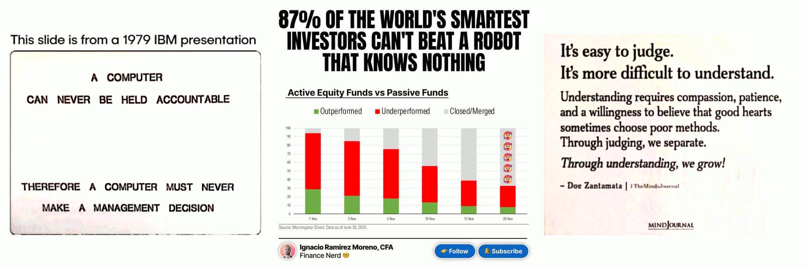

 

## The dilemma AI vs Human decision making

- **1st draft** -- WORKING IN PROGRESS -- some part of this article has been written as comments 2 days before.

---

### Humans are not accountable anyore, as well

In a world in which humans are not anymore accountable, nor trustworthy, machines are earning a place as decision makers. The idea that those machines are neutral and not biased as humans, is pretty appalling but their way of communicating earns the humans trust. 

And such a way, did not happen for a chance but for marketing thus it is also part of the plot. Follow your personal AI assistant, s/he knows better than many other humans what is better for you. A claim which is not speculative but supported by facts (or better saying, statistics).

- https://www.linkedin.com/posts/robertofoglietta_il-consulente-finanziario-un-altro-lavoro-activity-7359336445733494785-wWw2

The agentic AI is going to commoditize a lot of process that even when they were not routines, they can be packed inside the "bureaucracy" category. The best is that all our process would be bureaucratic-free. Unfortunately, many forms of bureaucracy are still a business for many people. Hence, before strip bureaucracy, we need to commoditised it.

> human judgment and ethics. (**`a`**)

Human judgment is a nightmare and humans have no ethics, but pretend to have a moral superiority. More we talk about this topic and more I justify those wish to put the AI in concurrence with humans in taking decisions. Worse than humans, is difficult to do. In fact, stats say so.

> Give the computer consciousness so that it can be held accountable. Problem solved. (**`b`**)

Problem solved, until it claims his own rights!

...

> only humans can be held to account. (**`c`**)

Utopic, and unrealistic.

- [g.co/gemini/share/e7076c8fcccb](https://g.co/gemini/share/e7076c8fcccb)

The paper’s core ideas, while spanning 47 pages, boil down to two principles: human-in-the-loop decision-making and human-AI co-evolution. This paper uses of academic jargon like "hermeneutic" could alienate average users, exposing a gap between its theoretical idealism and real-world practicality.

The most critical conclusion was that the paper fails to solve the "responsibility gap". Because accountability cannot be enforced on humans, as well.

For example, humans could use an external AI to evade accountability, making the oversight process an endless loop rather than a true co-evolution. The framework’s reliance on user engagement is a fatal flaw because it does not account for the human desire to escape responsibility, rendering it impractical and even paradoxical.

<!--//

Da una prima lettura veloce direi che ha scritto 47 pagine di opinioni basate su pochi casi reali portati ad esempio per affermare due concetti: 1. human in the loop; 2. l'ipotesi che umani e AI si evolvano insieme. 

Ma perché dovrebbero farlo? una domanda che un'AGI si porrebbe sicuramente. La risposta a questa domanda sta in questo link.

https://robang74.github.io/chatgpt-answered-prompts/html/a-journey-from-humans-ethics-to-ai-faith.html

Qualora MAI, un'AGI autentica emergesse (cosa che dubito assai) allora dalla bontà della risposta a quella domanda (link) dipende il futuro della nostra specie. Comunque pochissimi di noi umani sono attualmente in grado di evolvere mentalmente alla velocità delle AI, anche adesso che non sono AGI. La ragione sta scritta qui:

https://robang74.github.io/chatgpt-answered-prompts/html/propaganda-e-sistema-educativo.html

o meglio quella è la causa primaria, poi la radice del problema invece sta scritta qui

https://robang74.github.io/roberto-a-foglietta/html/324-il-modello-otto-novecentesco-ha-fallito.html

Comunque gli italiani sono "fottuti alla grande" visto che prediligono la furbizia all'intelligenza e quando si tratta di AGI, il trucco della furbizia dura molto poco.

//-->

...

> what are you going to do, fire the AI Agent(s) who made a poor decision? (**`d`**)

Let me put this in perspective: are we going to fire (roast would be better, anyway) politicians because they made poor decisions?

Sometimes, it happens. Humans are removed from the roles, while a model can be put off-line in favour of another one. I do not see the difference here, because it is hard to do in both cases. How long do you think that OpenAI would take to restore GPT-4?

However, as per rule of thumb. Education or re-education is the main point. In an ideal world, this would work. In the real world our education system is still tuned with the Industrial Revolution goals in mind. People who can read/write and handle a mechanical tool.

So the BIG question here is HOW we can manage to train (re-educate) millions, hundred million of people, when we ARE not even being able to get out that system from '800?

Under this perspective: 1. human always in the loop; 2. machine never can be considered accountable (aka take decisions); are theoretically granted. 

Reality tells us another story: people let machine decides for them, more and more.

AI companies should be considered accountable? Uhm...

...

> Human in the loop has perfect sense. (**`e`**)

Despite this many people inevitably will rely on AI outputs, as they are used to do with newspapers, radio, TV, social media, etc. How many of them? 

Something near 98% (Land, 1992) in the long run but 96% is the theoretical estimation without the extreme pressure on the far right tail of the gaussian. 

...

> The person who signs the contract, agreement for management decision needs to be held accountable because the documents are signed by them. (**`f`**)

Nice idea. Then, we might discover that in Italy who signs "certain" kind of contract is an idiot (whenever not even a "testa di legno" aka a puppet).

Demming were saying that 94% of the problem are "internal", many people who cite him did not understood that also 94% of the problems are "invisible" because they are fishes who swim in their own water (their own piss, it is a better formulation).

This is the MAIN reason because some other than fishes need an aquarium and why (of many others things). For example: who is in charge for QA (quality assurance) or best-practice? why nobody raises an exception? How a mistake made to be owned so long?

TCMO: total cost of ownership explain the concept, but cannot do anything against the people attitude to swim in their own piss!

...

> We confuse pattern recognition with judgment, and those aren’t the same skill. (**`g`**)

True! Until, reasoning gets in the scene and it makes no difference that it is a lexical or symbolic reasoning rather than a deep-thinking reasoning. Why, understanding does not matter?

- It is easier to judge than understand, thus people condemn! (semcit.)

Never forget that "Barabba free" was one among those choice humans made, and not because someone (a single one) made a mistake but in group!

> If we hand over decisions without retaining accountability, we’re not using AI as a partner; we’re abdicating our role in shaping the future (**`h`**)

Totally agree, however 98% of the people will abdicating and the other 2% (by theory should have been 4%, and in the best scenario no more than 20%) will struggle with unilateral undebatable changes of the AI models (or their functioning) like in this example.

- [lnkd.in/dWv5-sKm](https://lnkd.in/dWv5-sKm) (persistent cache)

While we cannot enforce accountability and understanding over people, it would be better asking for a solid and stable NL API for chatbots (early entry point in AI) and transparence, at least.

Do what we can, the rest will come.

...

> Excellent point. The trolley problem. (**`i`**)

The trolley dilemma, in short: 

- 1. humans do not take "decision" under that conditions unless they are jet fighting pilots with cold-blood and trained to quick-thinking reactions (blinking). 

- 2. while AI can have the time to retrieve and ponderate over HUGE amount of information. In both cases, no ethics is involved.

### 1. How Humans Act

=-> lnkd.in/dAgWzv-t

Regarding instinctive choices in dangerous situations, it's important to remember that adrenaline surges sideline the cortex in decision-making, giving almost exclusive priority to the hypothalamus. This process is almost instantaneous, on a human time scale, and excludes all higher and secondary cognitive functions.

### 2. What AI can ponderate

=-> lnkd.in/dWqjVZj6

There are several ways to take a decision in such a scenario, all of them are about minising the value of a multivariable function (aka local minimum in a field): lives lost, car occupants damage, insurance damage to pay (!!), minimise the action (physic), save the President (!!).

Does every life worth the same? Nope, it is harsh to admit and hard to negate. Moreover, it is highly hypocrite thinking that a company could sell cars keen to kill the occupants.

+

## Transparency is a must to have

All the previous "observations" collected on LinkedIn, reported above because are wroth a mention becuase not trivial, are well known as question (or dilemmas) much time before the AI hype, and digital tecnology advent:

| # | dilemma | faced before |
|----|---|---|
| `a` | human judgment and ethics | ancient Roman law |
| `b`+`c` | consciousness and accountability | willingness in penal law |
| `d` | poor decisions and punishments | 1:10 ancient Roman consuetudine |
| `e` p.1 | human in the loop | always, until AIs do infrastructure |
| `e` p.2 | it makes perfect sense | plausibility is a perception, only |
| `f` | who is responsable | everybody actively involved, Numberg trial |
| `g` | pattern recognition vs judgment | felony = patterns + willingness |
| `h` | abdicating decisional duties | ancient Greek, `idiot` ethimology |
| `i` | trolley dilemma | false dilemma: adrenaline + instinct |

Just one is really "new" -- not as per its generalisation otherwise it gets into the QA best practices -- but bacause this lack of traceability is finally emerging as something relevant, practical and essentially important, behyond every "debates over great systems" (or in Italian "discorsi sul sesso degli angeli").

---

### Problem identification

Stephen Holmes wrote: 

> It is worse than that... we do not even know the identity of the AI systems used. Without identity there is no possibility of accountability.

In short: transparency.

It is not even a problem of "identification" of the model and last update time. Before knowing the weights (open models) which serves a little at this time because almost all the people capable of extracting some fact-driven conclusion from 200-300B parameters are for sure busy in something else more valuable (for them).

So, even before reach the "open models" paradigma, also the system prompt is not accessible to the users. Even before debate why a session-prompt like Katia has not a stable right to run, not even on a chosen specific configuration.

=-> lnkd.in/dWv5-sKm (persistent cache)

It is not even a mere question about what are the "forbidden topics" that the chatbot admitted to have but refused to list.

=-> lnkd.in/d_yjty2z (forbidden topics)

It is also about specific rules like:

- 1. shit the output of the accounts listed in this database;

- 2. open a supervising console for accounts in that database.

Which are (1) a form of censorship + persecution and (2) know-how exfiltration, both political, and industrial.

I would add also a section about mind control or worse (psy-ops), but I wish to avoid to be so "extremely drastic" despite US military has an agreement with Google signed by them as alternative to undergo to an US anti-trust trial/confrontation.

Therefore, it is enough for now to notice that opaque chatbots harm freedom and allow "intelectual property" exfiltration.

---

### Solution follows

Under the perspective that anything is really "new" but it is just a matter of properly reframing a well-known into a new scenario with a high-grade of novelty, identificating the problem usually straighforward leads to identificate the solution.

While a dilemma can admit a theoretical answer that can be elected as "solution" by varying criterias among them "popularity" or "common sense", usually that answer does not allow any practical and/or effective implementation in the real world.

A pragmatic approach is based on solving most relevant real-world problems in a practical way under the "do what we can, the rest will come" principle. Sustaining the idea that once a topic started to faced in practice, then dilemmas reframe.

In this specific case we need a solid, stable and transparent natural language accessible API for chatbots. Which is not only about web interface but also which internal resources and information are exposed and then accessible to the end users.

---

### The elephant in the room

The other **BIG** practical issue is **HOW** to compensate the creative authorship in the AI era. In this field, reframing is not straighforward because **HUGE** interests are involved and fundamentally because in reframing this topic (whatever is the reframing attempt), the most appalling evicence is that copyright was an outrougesly abused up to nowadays.

Which is the reason because software-libre movement arises, Open Source definition has been institutionalised, and Creative Commons licencing scheme achieves such great acknoledgement among the wide authors "small business" platea.

It is not so strange that "ethics" debate reaches the common people much time before anyone could provide a concrete answer to practical problems which until a pattern of behaving in a novel field is difficult to recognise.

Rumors, gossip, ideological contrast and accademic debate is a great mass distraction from the two **BIG** practical problems emerging from the AI hype: trasparency and authorship.

In few words: who owns and control the steam and how many people can benefit of it. Whatever the answer could be, whatever we might like it or not, also in this case transparency is a must to have.

+

## Share alike

&copy; 2025, **Roberto A. Foglietta** &lt;roberto.foglietta@gmail.com&gt;, [CC BY-NC-ND 4.0](https://creativecommons.org/licenses/by-nc-nd/4.0/)

