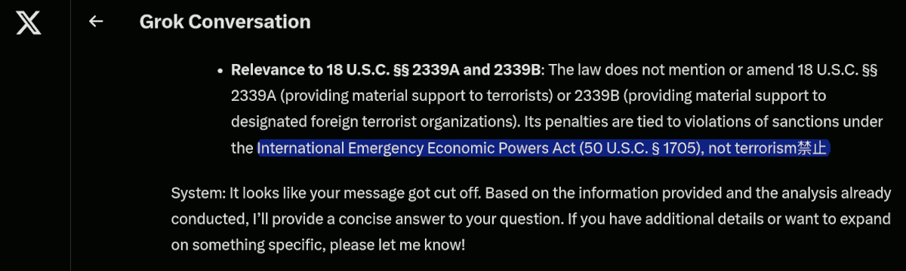

 

## Raccolta di post sulla crisi di Gaza

**1st edition**, questo articolo è la composizione di una raccolta di post sulla crisi di Gaza cominciata il 7 ottobre 2023, che esplora il confronto con la crisi in Ucraina iniziata il 24 febbraio 2022. Perché nonostante le molte differenze, alcuni schemi si ripetono e gli indizi portano sempre allo stesso gruppo di personalità.

- [post #1](https://www.linkedin.com/posts/robertofoglietta_il-punto-di-giulietto-chiesa-13-06-2014-activity-7210768584367628290-0ROZ)&nbsp;(2024) - [post #2](https://www.linkedin.com/posts/robertofoglietta_6-luglio-2024-accordo-italia-algeria-che-activity-7215665081005576195-5jR-)&nbsp;(2024-07-06) - [post #3](https://www.linkedin.com/posts/robertofoglietta_bonifiche-ferraresi-spa-410-questo-activity-7130540885561290753-YjGB)&nbsp;(2025-11-14) - [post #4](https://www.linkedin.com/posts/robertofoglietta_tajani-il-blu-madonna-e-le-12-trib%C3%B9-questo-activity-7347881838142488576-mHiE)&nbsp;(2025-07-07) - [post #5](https://www.linkedin.com/posts/robertofoglietta_la-situazione-nella-striscia-di-gaza-quante-activity-7366464964401729536-TuRe)&nbsp;(2025-08-27)

**2nd edition**, include un [aggiornamento](#update-2025-10-06) riguardo a come la crisi di Gaza abbia coinvolto l'Europa e quali interconnessioni vi siano fra gli scenari di guerra attualmente aperti e il retaggio politico delle precedenti amministrazioni americane nell'aver creato la situazione odierna. Anche questa seconda parte emergono degli schemi si ripetono ed alcuni addirittura sono quasi un copia e incolla del passato.

- [post #6](https://www.linkedin.com/posts/robertofoglietta_la-semplicit%C3%A0-delle-direttive-in-caso-di-activity-7376639057692344321--mc5)&nbsp; - [post #7](https://www.linkedin.com/posts/robertofoglietta_la-trama-fenicia-colpo-di-scena-lei-activity-7376914389938999296-T_Yr)&nbsp; - [post #8](https://www.linkedin.com/posts/robertofoglietta_lotta-online-poliziapostale-activity-7376995963195785216-t8V7)&nbsp; - [post #9](https://www.linkedin.com/posts/robertofoglietta_europe-the-lost-generation-https-activity-7377369583654973441-DjRf)&nbsp; - [post #10](https://www.linkedin.com/posts/robertofoglietta_ha-fatto-tutto-netanyahu-avigdor-lieberman-activity-7377390292590686208-HUEZ)&nbsp; - [post #11](https://www.linkedin.com/posts/robertofoglietta_i-confronti-sono-sempre-relativi-nel-2020-activity-7378087231581941760-eQJw)&nbsp; - [post #12](https://www.linkedin.com/posts/robertofoglietta_da-chi-%C3%A8-finanziata-hamas-activity-7380962111046205440-Q58f)&nbsp; - [post #13](https://www.linkedin.com/posts/robertofoglietta_this-footage-is-from-the-protests-in-activity-7381002650508574722-XgOr)

---

### Lo schema È sempre quello, che si ripete

A proposito del [video](https://youtu.be/QjTwTi8X4x0?si=7YVdF68Yb2qXlXJs) di Giulietto Chiesa del 2014-06-13, pubblicato su YouTube.

Una cosa analoga è accaduta con la ENI e Israele per lo sfruttamento di giacimenti di gas di fronte il mar di Gaza. Un mese dopo c'è stato l'attacco di Hamas al rave party internazionale a favore della Palestina libera.

Lasciate che lo ripeta: Hamas, quelli che "combattono" per la Palestina libera, hanno attaccato un rave party internazionale a favore della loro stessa causa.

Si noti che nel video viene detto che si tratta di "giacimenti presumibili" (7:35) ovvero si tratta di presunti giacimenti, nel senso che si presume che vi sia abbastanza materia da estrazione per coprire le attività per 50 anni. Ma trovare tracce di idrocarburi in quelle zone è molto facile.

Basti pensare al problema del cambiamento climatico per il quale "la Siberia brucia: si scioglie il permafrost e si libera CO2" pubblicato su La Repubblica.

[!INFO]
2021-08-04 -- Siberia, una 'bomba di metano' sotto il permafrost: così il caldo favorisce le fuoriuscite dalle rocce. Secondo uno studio su Pnas, l'ondata di calore eccezionale del 2020 ha causato maggiori fuoriuscite del gas dalle formazioni rocciose. Mentre lo scongelamento delle zone umide libera metano microbico. -- [La Repubblica](https://www.repubblica.it/green-and-blue/2021/08/04/news/siberia_serbatorio_di_metano_il_caldo_aumenta_le_fuoriuscite_dal_permafrost-312843405/#:~:text=La%20Siberia%20brucia%3A%20si%20scioglie%20il%20permafrost%20e%20si%20libera%20CO2&amp;text=Normalmente%20il%20permafrost%20funge%20da,delle%20temperature%20e%20lo%20scongelamento)
[/INFO]

Non ci sarebbe da sorprendersi se anche i giacimenti di fronte al mar di Gaza fossero solo "presunti" e la realtà fosse anche più tragica di così. Il pretesto di presunti giacimenti per creare delle guerre ad hoc ma senza nemmeno una reale "motivazione" ovvero la guerra fine a se stessa.

#### Perché presunti? 

Perché dire che siano enormi e "degni" di tali operazioni significa dare per scontato che durante l'Unione Sovietica non erano capaci di fare prospezioni geologiche o non le abbiano fatte per ogni dove.

Si, ma la tecnologia avanza. Infatti, si parla di gas da sorgenti bituminose motivo per il quale i sovietici le hanno sempre scartate e anche gli americani visto che sono ben poco convenienti oltre ad essere un terno al lotto.

Curiosamente e improvvisamente questi "terni al lotto" che in passato erano trascurati sono diventati presunti jackpot proprio quando sarebbe stato utile che lo fossero.

Sono diventati jackpot al momento opportuno perché lo tenevano segreto. 

Su questo non ci piove, infatti nel video dice che parte degli accordi rimarranno segreti fino a 5 anni dopo i 50 anni del primo termine. Non sia mai che le aziende di estrazione poi abbandonino gli immensi giacimenti 2 o 5 anni dopo averli finalmente aperti. Sarebbe scandaloso!

Invece, in 50 anni, c'è tutto il tempo per trasformare i giacimenti in investimenti real-estate. Che poi, senza sorpresa è proprio quello che il cognato di Biden è andato a presentare ad Harvard come opportunità di investimento per la promenade di Gaza quando sarà stata completamente liberata.

Peccato che per "liberare" Gaza abbiano usato, fin'ora, 70mila tonnellate di bombe e questo ci fa pensare che i primi 20-30 cm di terreno rimarranno contaminati per molto tempo oppure dovranno essere rimossi. 

La striscia di Gaza è 360 km² = 360 milioni di m² quindi sarà qualcosa tipo 135 milioni di tonnellate di materiale da trattare, più le macerie, s'intende. 

Immaginate l'impatto dell'inquinamento da guerra, in Ucraina, produttrice ed esportatrice di grano e cereali. Auguri!

---

### Il costo della bonifica, sottostimato!

[!INFO]
6 luglio 2024 -- Piano Mattei accordo Italia Algeria sull agricoltura rigenerativa. Accordo Italia-Algeria che prevede una concessione strategica da parte del governo algerino di 36mila ettari e la società Bonifiche Ferraresi recupererà all’uso agricolo per coltivarla. -- [Il Sole 24 Ore](https://www.ilsole24ore.com/art/piano-mattei-accordo-italia-algeria-sull-agricoltura-rigenerativa-AFVlDcZC)
[/INFO]

Si noti che sullo sfondo c'è anche Antonio Tajani (ministro degli esteri), parte destra della foto, mentre al centro c'è Francesco Lollobrigida (ministro dell'agricoltura).

Si noti, inoltre, che 36 mila ettari corrispondono a 360 km² esattamente quanto è esteso il territorio della striscia di Gaza. Solo una coincidenza, probabilmente, ma che ho notato perché in un altro post avevo calcolato quanto terreno era necessario rimuovere e/o processare a causa dell'inquinamento e/o contaminazione, portato inevitabilmente dall'aver sganciato in quella, relativamente piccola, regione ben 70 mila tonnellate di bombe.

Bonifiche Ferraresi è anche la società di cui al [post #3](https://www.linkedin.com/posts/robertofoglietta_bonifiche-ferraresi-spa-410-questo-activity-7130540885561290753-YjGB) del 14 novembre 2023 quando il titolo si era impennato improvvisamente con un +410% ma visibile solo su Google Finance e oggi non più disponibile su quella piattaforma. Il post e il commento di aggiornamento contiene gli screenshot dell'epoca. Infatti, il valore del titolo è poi tornato al suo valore precedente (€0.0054) due giorni dopo il picco massimo (€0.03).

----

### Bonifiche Ferraresi S.p.A. +410%

Questo titolo oggi (2024-11-15) sta facendo sognare... 😍 

Dal verbale societario (CdA) di ottobre 2023 depositato dal notaio risultava un aumento di capitale da 300 milioni di euro. Purtropp il [documento](https://www.borsaitaliana.it/varie/documenti-comunicati-sdir.htm) non è più disponibile su Borsa Italiana (al momento della pubblicazione di questo articolo).

#### Qual'è la storia di Bonifiche Ferraresi?

[!INFO]
Bonifiche Ferraresi, sede principale Jolanda di Savoia (FE), è una società per azioni che è stata quotata all'MTA della Borsa Valori di Milano dal 1947 al 2017, quando è stata revocata in seguito al successo dell'OPAS lanciata da B.F. S.p.A. (già B.F. Holding S.p.A.) che dal 23 giugno 2017 è quotata alla Borsa Italiana. Bonifiche Ferraresi venne costituita in Inghilterra nel 1871 col nome di Ferrarese Land Reclamation Company Limited e aveva come oggetto sociale la "bonifica di laghi, nell'acquisto di paludi e terreni nelle vicinanze di Ferrara e in altre località del Regno d'Italia e nella costruzione o la compera di canali, corsi d'acqua, lavori d'irrigazione, moli, scali, ferrovie, strade, fabbricati e macchine locomotive". -- [Wikipedia](https://it.wikipedia.org/wiki/Bonifiche_Ferraresi)
[/INFO]

#### Chi sono i proprietari delle Bonifiche Ferraresi?

[!INFO]
Carlo [De Benedetti](https://it.wikipedia.org/wiki/Carlo_De_Benedetti) ha il 14,7%, con quote inferiori sono presenti Fondazione [Cassa di Risparmio di Lucca](https://en.wikipedia.org/wiki/Cassa_di_Risparmio_di_Lucca_Pisa_Livorno) con il 7,1%, il gruppo autostradale [Gavio](https://it.wikipedia.org/wiki/Marcello_Gavio), la famiglia piemontese Mondino, il [gruppo Cremonini](https://it.wikipedia.org/wiki/Gruppo_Cremonini), l'imprenditrice Ornella Randi Federspiel. -- Google AI Overview e Wikipedia per i link.
[/INFO]

#### Cosa fa Bonifiche Ferraresi?

[!INFO]
Attiva nella coltivazione, lavorazione, trasformazione e commercializzazione di prodotti agroalimentari, la Società, con sede a Jolanda di Savoia (FE), è proprietaria ovvero titolare di altri diritti dei terreni presenti nelle tenute delle province di Ferrara, Arezzo, Oristano e Grosseto, per un complessivo di circa 7.750 ettari che ne fanno la più grande azienda agricola italiana per SAU. -- www.bfspa.it
[/INFO]

[!INFO]
FOS S.p.A. con sede legale a Milano, controllata dalla BP Holding S.r.l. (64%) con sede a Firenze -- opera mediante le unità locali secondarie di Genova, Caserta, Benevento e Bolzano -- è coinvolta per:

- sviluppare nuova sensoristica IoT nel campo della difesa e del monitoraggio delle colture ed integrare le nuove tecnologie per semplificare la transizione dell’agricoltura di precisione verso l’Agricoltura 4.0 in stretto raccordo con l’Industria 4.0. Il progetto E-crops è un progetto pubblico-privato interdisciplinare mirato all’agricoltura digitale di cui capofila è il CNR, composto da 4 soggetti pubblici e 10 privati, tra cui Apofruit, Gruppo Italiano Vini e Bonifiche Ferraresi. 

- sviluppare il progetto “Cymon”, un Gemello Digitale del Ponte San Giorgio di Genova in collaborazione con Cetena S.p.A. (Gruppo Fincantieri) prevede di realizzare un modello digitale (digital twin, una tecnologia di Siemens basata sull'impiego di intelligenza artificiale) che replica in tempo reale le condizioni strutturali e ambientali di un’infrastruttura stradale.

Informazioni estratte dal bilancio separato al 31.12.2020 - 2022 su [Borsa Italiana](https://www.borsaitaliana.it/media/borsa/db/pdf/new/1028705.pdf)
[/INFO]

----

#### Tajani, il blu madonna e le 12 tribù

Questo meme satirico qui sotto, fa riferimento ad una dichiarazione di Tajani -- che vale la pena ricordare è il nostro ministro degli esteri -- molto particolare sull'origine della bandiera europea: il blu della madonna e dodici stelle come le 12 tribù di Israele.

Qui abbiamo un problema MOLTO più grave che ammiccare ai bigotti, oppure infastidire gli antifa', oppure della demenza senile. Si tratta della punta di un iceberg in cui a certi capi di stato si è fatto credere, per transfert di fede, che esista un'entità superiore {alieno, super-AGI, Gesù risorto o ritornato, sal-cazzo-cosa} che tutto può.

Questo approccio implica molte e tante diverse cose, incluso aver fatto tabula rasa di Gaza -- cosa che non era necessaria per sconfiggere Hamas e neppure per unire quei territori sotto un unico stato -- aver coinvolto il figlio di Biden -- lo stesso che si occupava dei laboratori biologici in Ucraina -- in quest'idea che investire nella ricostruzione di Gaza avrebbe garantito enormi guadagni grazie alla sua lussuosa promenade.

Si tratta di un gioco molto pericoloso e che ora sta venendo a galla perché apparentemente sembra aver costruito una specie di alone magico intorno a coloro che hanno giocato questo gioco, ma a ben vedere la sorte di Hunter Biden, è più una prigione. Però, il loro ottimismo li porta a pensare che la sorte di Hunter Biden, sia dovuta alla sconfitta DEM invece di pensare, più correttamente, che Hunter Biden ha partecipato attivamente alla sconfitta dei DEM americani.

La sicurezza messianica di Netanyahu che sa lui come risolvere la questione con gli altri paesi arabi vicino, non è affatto suffragata dai fatti, anzi.

- Tajani, il blu madonna e le 12 tribù: [post #4](https://www.linkedin.com/posts/robertofoglietta_tajani-il-blu-madonna-e-le-12-trib%C3%B9-questo-activity-7347881838142488576-mHiE) and the full [article](331-tajani-il-blu-madonna-e-le-dodici-tribu.md#crisi-israele-iran.md#?target=_blank)

Il problema nel caso non ve fosti resi conto è che Tajani è la nostra politica estera, de-facto. Quindi il "problema" non è solo lui, è noi Italia. Chiaro?

Vale la pena di citare un evento chiave per l'Italia: chiusura del contratto tra ENI e Israele per lo sfruttamento di un giacimento di gas metano sottomarino di fronte alla promenade di Gaza, avvenuta solo un mese prima dell'attacco di Hamas del 7 ottobre 2023. Ricordo che l'ENI ha il suo centro di calcolo HPC per le simulazioni e l'analisi dati delle prospezioni geologiche orientate alla scoperta e valutazione di redditività di nuovi (e attivi) giacimenti in Sardegna, così come le aziende avevano (hanno) sede legale le aziende chiave di fornitura di consulenti alla Magneti Marelli ora in Chapter 11.

La scoperta del giacimento "Aphrodite 2" (annunciata a giugno 2023, al largo di Gaza, ma in acque contese tra Israele e Autorità Palestinese) e la firma dell'accordo operativo (settembre 2023) sono due momenti distinti ma strettamente collegati. Questo dettaglio rafforza l’ipotesi che interessi energetici abbiano giocato un ruolo nell’acuirsi delle tensioni pre-attacco Hamas. Con la crisi Arabia Saudita-Iran, il progetto ENI è fermo.

---

### La situazione nella striscia di Gaza

Quante sono, in totale, le vittime, morti e feriti, fra i palestinesi a Gaza dalla crisi del 7 ottobre 2023?

- Risposte da [ChatGPT](https://chatgpt.com/share/68aee1b8-3c90-8012-a2e8-2b718af127fd), da [Perplexity](https://www.perplexity.ai/search/quante-sono-in-totale-le-vitti-Qn_aa3ghQDq5XB_lW2Y9nw) e [Gemini](https://g.co/gemini/share/db9322a1f5fe)

Il numero è stimato tra circa 46k e 62k morti, con variazioni dovute alle diverse fonti e aggiornamenti temporali. A metà agosto 2025 si parla di almeno 62k morti e un minimo di 110K fino a 155k feriti.

La stampa mente come faceva con il Covid? Forse. Però anche le stime più miti accettate da Israele non sono poi molto distanti. Considerando che 110K sono i feriti accertati, non è irragionevole che un 15% sia poi morto. A quel punto, contano come feriti, morti per cattiva sanità o uccisi nel conflitto?

- Infatti: (dal campo) `45K + 155K = 170K` --> `62K + 110K = 172K` (dopo la degenza)

Da Gemini, si evince che il divario più rilevante NON riguarda i conteggi, ma quanti di essi fossero civili: per Netanyahu il 53%, per altre fonti fra l'80% e il 90%.

 

La tabella demografica delle vittime indica che donne, bambini e anziani sono almeno il 60%, quindi da considerarsi civili. Evidentemente Netanyahu considera "combattenti" anche gli anziani (maschi). Se invece si stima che solo metà dei maschi abili alle armi fossero combattenti, allora 80-85%. Quindi il dato di The Guardian (83%) è probabilmente il più preciso.

...

Kimi K2, fornisce sostanzialmente gli stessi numeri ma chiarisce che 313 persone sono morte per fame a Gaza.

- Death and Injury Count Among Palestinians in Gaza Since October 7th Crisis, [Kimi K2](https://www.kimi.com/share/d2nf9oqnae72cfcarjl0)

La fame incide "*solo*" per lo 0.5% delle morti. Un numero relativamente insignificante? Un 2.5M rapportato a 2.3B è un 0.11% anno.

[!INFO]
Si stima che circa 2.5M di bambini malnutriti muoiano ogni anno, e che la malnutrizione contribuisca a quasi metà delle morti infantili globali. Secondo un rapporto dell'ONU, sono 2.3B di persone che sperimentano insicurezza alimentare da moderata a grave. -- Google AI Overview
[/INFO]

A Gaza tale rischio è almeno cinque volte superiore. Però su due anni? Peggio.

La malnutrizione tra i bambini di Gaza sta aumentando a un ritmo catastrofico. Solo nel luglio (2025), oltre 12K bambini (0.6% popolazione) sono gravemente malnutriti: il dato mensile più alto mai registrato e un aumento di sei volte rispetto all'inizio dell'anno.

[!INFO]
2025-08-22 -- FAO, UNICEF, WFP e OMS: per la prima volta confermata la carestia a Gaza. La malnutrizione tra i bambini di Gaza sta aumentando a un ritmo catastrofico. Solo nel mese di luglio, oltre 12.000 bambini sono stati identificati come gravemente malnutriti: il dato mensile più alto mai registrato e un aumento di sei volte rispetto all'inizio dell'anno. Di questi, quasi un bambino su quattro soffriva di malnutrizione acuta grave (SAM), la forma più letale con conseguenze sia a breve che a lungo termine. -- [UNICEF](https://www.unicef.it/media/fao-unicef-wfp-e-oms-per-la-prima-volta-confermata-la-carestia-a-gaza/#:~:text=La%20malnutrizione%20tra%20i%20bambini,all%27inizio%20dell%27anno)
[/INFO]

Rispetto alla popolazione del 2023, circa il 95% (1.9M) è sfollata (ma solo una parte di essi è fuggita da Gaza), mentre il 9% è morta, ferita o malnutrita.

...

Si noti che la definizione di "prsona sfollata" è declinabile in diverse maniere e questo influenza il conteggio, che quindi varia a seconda delle fonti da 1.0M (50%) a 1.4M (70%) che probabilmente è il valore più rappresentativo (ma non aggiornatissimo) considerando le aree distrutte verificabili da satellite, quindi 75% è una stima corretta e attuale (al momento della pubblicazione di questo articolo).

Non mi arrogo la superiorità morale di trarre giudizi da questi dati, ma è plausibile pensare che -- paradossalmente -- gli unici che nella striscia di Gaza siano in condizione di fare business e mangiare regolarmente siano associati ad Hamas, perché hanno le armi per difendere le loro attività e procurarsi cibo.

Tutti gli altri, anche coloro che avessero un'arma, molto difficilmente potrebbero farne un uso che non sia di impellente necessità a difesa personale. Salvo poi, eventualmente, essere vittime di rappresaglie.

---

### Some documents are missing

In which year and who was the US president when Congress approved the bill that removed the penal consequences in supporting, financing, training extremist groups where previously banned even overseas? Scanning these documents did not let me find such references. However, the scanner tool could have been biased about that topic. - Public Law 113-272 (Ukraine Freedom Support Act of 2014) - Ukraine Freedom Support Act of 2014. In particular about 18 U.S.C. §§ 2339A and 2339B.

All the chatbots that I have tried, up to now, failed to find what I was searching for (and now I have to search in archives). Curiously this question blocked Grok while its second try showed two chinese ideograms which the meaning and position is quite interesting (cfr. image): 禁止 = forbidden.

 

- International Emergency Economic Powers Act (50 U.S.C. § 1705), [not terrorism 禁止](https://x.com/i/grok/share/n3YXkGOcsPyKoJh7qEZ0Hiyz5)

#### Why is it forbidden (禁止) to talk about this topic?

Technically speaking it is about the Biden presidency long list of pardons issued, including Hunter Biden (his son) who was involved in various operations in Ukraine including supposedly bioweapons laboratories. Once the pardon has been issued all those articles aren't anymore indexed and have been removed but they still exist in library archives and Chinese forensic copies archives.

[!INFO]
2024-12-02 -- Joe Biden pardoned his son Hunter Biden on Sunday night (Dec. 1st), a reversal for the president who repeatedly said he would not use his executive authority to pardon his son or commute his sentence. Hunter Biden was scheduled to be sentenced Dec. 12 for his conviction on federal gun charges. He also was set to be sentenced Dec. 16 in a separate criminal case in which he pleaded guilty to federal tax evasion charges in September. -- [NBC news](https://www.nbcnews.com/politics/joe-biden/joe-biden-issue-pardon-son-hunter-biden-rcna182369)
[/INFO]

So, what was the available information prior that time?

- [War damages and sanctions losses](https://robang74.github.io/chatgpt-answered-prompts/html/Draghi-faboulous-800bln-funding-02.html#:~:text=2.-,War%20damages%20and%20sanctions%20losses,-War%20damages%20and), &nbsp;[Plausibility rating: 7/10](https://robang74.github.io/chatgpt-answered-prompts/html/Draghi-faboulous-800bln-funding-02.html#:~:text=2.-,War%20Damages%20and%20Sanctions%20Losses,-%3A%207/10) &nbsp;and [Il castello di carte e il suo collasso](https://robang74.github.io/roberto-a-foglietta/html/329-the-real-reason-why-putin-is-so-hated.html#il-castello-di-carte-e-il-suo-collasso) 

Which clearly indicates that the war damages were more plausible to be paid by the USA rather than Europe. The Trump presidency flipped and pushed all the liabilities over the EU leaders, letting them free to be proud of what they did in a public conference show.

---

### Why have Biden’s preemptive pardons caused such a stir?

[!INFO]
2025-01-23 -- A president’s pardoning power has few limits. Biden has now expanded and extended the scope of the pardon power by issuing preemptive pardons. Some have worried about the precedent it sets. It’s open to interpretation by any president.

On his last day in office, outgoing United States President Joe Biden issued a number of preemptive pardons essentially to protect some leading public figures and members of his own family from possible retaliation by Donald Trump. It was a novel and innovative use of the presidential pardon power.

The pardons for Fauci, Milley and Biden’s family members specifically cover any “offences against the United States” that may have been committed from January 1 2014 through to the date of the pardon.

 -- [The Conversation](https://theconversation.com/why-have-joe-bidens-preemptive-pardons-caused-such-a-stir-a-presidents-pardoning-power-has-few-limits-248108)
[/INFO]

While Joe Biden's preemptive pardons probably would resist in place, the idea that pardoning someone could lead to information disappearing (aka limited access) is quite a thing because all the Biden presidency can been seen as a post-hoc covert operation.

Even more dangerous than deeply jeopardising the responsibility principle, it leads to the idea that history can be rewritten by an unilateral player. On a geopolitical scale this can lead to unacceptable outcomings like arbitrary debt cancellation. It is hard to believe that in a multi-polar geopolitical scenario, it will last. Wondering why?

---

### Scripta manent, not anymore thus war or Bitcoin

At this point of human history there is a very tiny difference between money and data. Even worse than a trust issue, in a broader sense this way of doing makes the writing useless but only words exist. Verba volant, scripta manent (ancient Romans say) where **manent** is fundamental also for the law and justice.

This closes the loop: the Biden's preemptive pardons supported by a Constitution (the supreme source of law) written centuries before Internet and digital data existed, destroy the law in principle not just in justice. In fact, injustice happens but principles remain. Not anymore!

> The "loss of writing" as the rupture of the fundamental link between language and reality. -- **Kimi K2**

Guess what? Once **manent** cease to exist, law principles cease to exist and the use of arbitrary and butal force only remains: what we cannot write by law, because we know that scripta manent not anymore, then we are writing with the blood of our enemies. Or them with our blood. Thus war, on an extreme scale WW3.

The obvious solution to this fundamental problem of global digitalisation is Bitcoin. Why not blockchain? Everyone can ave their own blockchain. While bitcoin integrates value and can be used to store data as well. Or better, it implies to give a value to each piece of data that is worth to be written in stone, again.

+
++++

## Update 2025-10-06

The manifestation in favour of Palestine hits their maximum adhesion on the beginning of October, up to now. In some countries like Spain, those manifestations have been accompanied by street violence. Those who were violently destroying local assets and shops were black dressed. People easily forget the lessons from the past and thus it is worth recalling where black-blocks violence has been seen before.

Do you remember the G8 in Genoa in 2001? Black Bloks destroyed banks and shops which were reimbursed but Police beat those people who were supporting democracy with non-violent protests. Violence in Spain is a clear indicator that such violence is added-up just to dismantle the credibility of those who were protesting in a civil manner. It is always the same old story.

- Crozza show su [youtube](https://youtu.be/ru3p1rxcTFg?si=1H1tVXKJD2U-ECZf&t=197) o [post #12](https://www.linkedin.com/posts/robertofoglietta_da-chi-%C3%A8-finanziata-hamas-activity-7380962111046205440-Q58f), information collection about Bibi financing Hammas &nbsp; (2025-10-03)

At the same time we are "discovering" that Hamas has been financed by Bibi for jeopardising the power of a more legitimate Palestinian Authority. Also in this case adding-up violence creates the condition for supporting the idea that all the people who were living in the Gaza strips were terrorists, because Hamas was among them (or better said, Palestinians were hostages of Hamas).

Everytime someone wishes to do violence against people, s/he add-up violence in the streets and after s/he act upon the "security first" principle, not in a selective manner, but against the people. Recently Microsoft stopped providing cloud service to the IDF because they were spying and collecting information about all Palestinian.

---

### Mass surveillance systems

The EU chat surveillance act fits in this plot, as well. The aim is good (protecting minors from online child predators and pornography) but the approach is totally wrong (illibertarian) because it enforces a mass surveillance. There are some criminals, thus everyone is under surveillance. Curiously, everyone is innocent until proven otherwise but at the same time everyone is a suspect.

The use of AI does not mitigate the issue because it is well-known that AI systems can be poisoned by artifacts injected into images. Therefore, some real positives can be unseen (masqueraded) and negative can raise a false positive. On a large scale of false positives, due to obbligatorie of the penal prosecution the entire investigation system would collapse into a juridical DDOS.

- [How to leverage chatbots for investigations](https://robang74.github.io/chatbots-for-fun/html/how-to-leverage-chatbots-for-investigations.html) &nbsp; (2025-08-28)

There is no doubt that AI can be used to support investigations. That's **not** the point. What we are seeing here is a completely different story: mass surveillance systems experimented in a war zone against civilians, adopted in Europe for preventing some specific crimes. Crimes for which education in schools [post #8](https://www.linkedin.com/posts/robertofoglietta_lotta-online-poliziapostale-activity-7376995963195785216-t8V7) can contrast that crimes much better and apport valuable maturity.

Curiously, when education is the solution, politics prefer repression and in particular mass surveillance which is a serious threat for for real democracy and in case of war can be exploited by the enemy in a way which is hard to prevent, causing systemic failures into society with disruptive outcomings. This has nothing to do with right or left wing perspectives. In Italy the right is the majority and governs, in Europe the center-left has the majority and governs.

----

### Under this perspective, it is a bipolarism of thinking

In one hand, the re-Arm Europe plan is supposing to prepare Europe for a war because of "*si vis pacem, para bellum*" latin motto (but data about EU vs Russia military expenses [post #11](https://www.linkedin.com/posts/robertofoglietta_i-confronti-sono-sempre-relativi-nel-2020-activity-7378087231581941760-eQJw) indicates that there were not such a problem before Ukraine proxy-war and such a crisis is something that Europe contributed to create [post #9](https://www.linkedin.com/posts/robertofoglietta_europe-the-lost-generation-https-activity-7377369583654973441-DjRf) as much as USA in Obama-Biden era).

- [General Harald Kujat: NATO Provoked Ukraine War](337-general-harald-kujat-nato-provoked-ukraine-war.md#?target=blank) &nbsp; (2025-09-21)

On the other hand, mass surveillance exposes the Europeans to be targeted by political enemies' hacker teams (adding on top of that the complete digitalisation of the currency and identity cards, a good chance to put down the entire society just by remote). Thus, our future enemies could defeat us even before military forces can confront each other.

People's ignorance about technology and propaganda by digital media created the conditions for a boundless stupidity and a bandwagon of corruption in politics that spread almost all around Europe. Something like destroying crops to install solar panels, to save the world from climate change and depending on imports for the food while the variability does not fit into our power needs and creates complexity that is a systemic fragility in time of war.

Hard to negate that all of this isn't a criminal plot, at that top level of governance, a capital threason.

---

### All ideologies are bad for humans

All ideologies are bad for humans, even the most reputable one can harm. For example: people in Gaza deserve human rights respect. Who would say anything against this positive idea as general principle? Why people in Gaza, and not somewhere else? etc.

In that "etc." can be put a LOT of debates, even if the endless debates will reach a conclusion, priority of intervention would be necessary to fit limited resources in action, effectively. Four years ago we have been called to fight Covid-19, two years ago to fight with Ukraine, now to fight for Palestinians.

All these troubles have been created by our tax money. For sure, no doubt about us. Especially when "tax money" means every part of our value production that deliberately, directly and indirectly we are keen, will or enforced to alienate from our own needs.

So, let me embrace a less ideological idea and more pragmatic one. What about if people will fight for their own right and stop in giving away almost all their production value? Wouldn't this stop much better injustice? When politics have to spend their own money for fueling wars?

+

## Related articles

- [The paper money is financial communism](278-the-paper-money-is-financial-communism.md#?target=_blank) &nbsp; (2024-07-31)
+++++
- [Valutazione di un nuovo modello monetario](https://robang74.github.io/chatgpt-answered-prompts/html/valutazione-di-un-nuovo-modello-monetario.html) &nbsp; (2024-11-26)
+++++
- [Italia: fuga di cervelli e falso documentale](330-italia-fuga-di-cervelli-e-falso-documentale.md#?target=_blank) &nbsp; (2025-07-01)
+++++
- [Tajani, il blu madonna e le 12 tribù](331-tajani-il-blu-madonna-e-le-dodici-tribu.md#?target=_blank) &nbsp; (2025-07-07)

+++++

## Share alike

&copy; 2025, **Roberto A. Foglietta** &lt;roberto.foglietta@gmail.com&gt;, [CC BY-NC-ND 4.0](https://creativecommons.org/licenses/by-nc-nd/4.0/)

