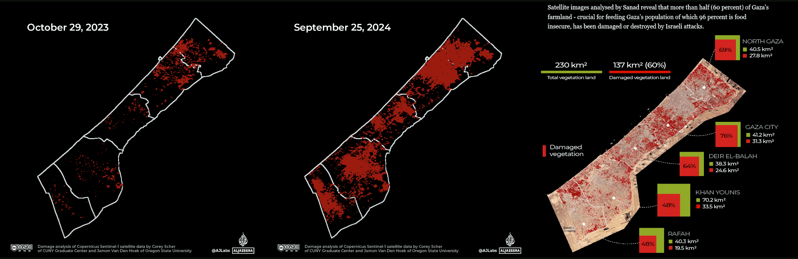
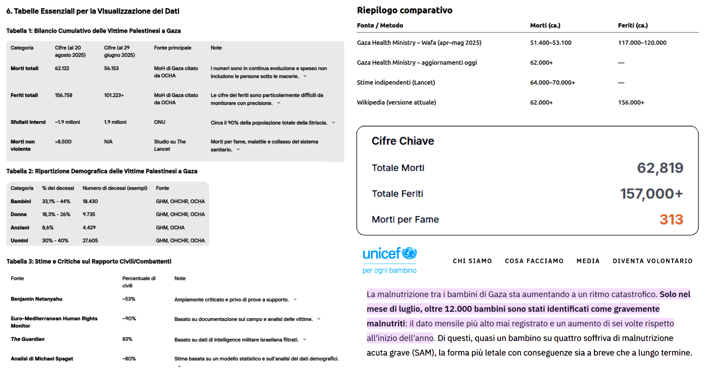

 

## Raccolta di post sulla crisi di Gaza

- [post #1](https://www.linkedin.com/posts/robertofoglietta_il-punto-di-giulietto-chiesa-13-06-2014-activity-7210768584367628290-0ROZ) -- [post #2](https://www.linkedin.com/posts/robertofoglietta_6-luglio-2024-accordo-italia-algeria-che-activity-7215665081005576195-5jR-) -- [post #3](https://www.linkedin.com/posts/robertofoglietta_bonifiche-ferraresi-spa-410-questo-activity-7130540885561290753-YjGB) -- [post #4](https://www.linkedin.com/posts/robertofoglietta_tajani-il-blu-madonna-e-le-12-trib%C3%B9-questo-activity-7347881838142488576-mHiE) -- [post #5](https://www.linkedin.com/posts/robertofoglietta_la-situazione-nella-striscia-di-gaza-quante-activity-7366464964401729536-TuRe)

> [!WARN]
> 
> **WORKING IN PROGRESS**

---

### Lo schema È sempre quello, che si ripete

A proposito del [video](https://youtu.be/QjTwTi8X4x0?si=7YVdF68Yb2qXlXJs) di Giulietto Chiesa del 2014-06-13, pubblicato su YouTube.

Una cosa analoga è accaduta con la ENI e Israele per lo sfruttamento di giacimenti di gas di fronte il mar di Gaza. Un mese dopo c'è stato l'attacco di Hamas al rave party internazionale a favore della Palestina libera. 

Aspe' che lo ripeto: Hamas quelli che "combattono" per la Palestina libera hanno attaccato un rave party internazionale a favore della loro stessa causa.

Si noti che nel video viene detto che si tratta di "giacimenti presumibili" (7:35) ovvero si tratta di presunti giacimenti, nel senso che si presume che vi sia abbastanza materia da estrazione per coprire le attività per 50 anni. 

Ma trovare tracce di idrocarburi in quelle zone è molto facile, basti pensare al problema del cambiamento climatico per il quale "la Siberia brucia: si scioglie il permafrost e si libera CO2" pubblicato su La Repubblica [alturl.com/vrjz4](https://alturl.com/vrjz4) (2021).

Non ci sarebbe da sorprendersi se anche i giacimenti di fronte al mar di Gaza fossero solo "presunti" e la realtà fosse anche più tragica di così.

Il pretesto di presunti giacimenti per creare delle guerre ad hoc ma senza nemmeno una reale "motivazione" ovvero la guerra fine a se stessa.

Perché "presunti"? 

Perché dire che siano enormi e "degni" di tali operazioni significa dare per scontato che durante l'Unione Sovietica non erano capaci di fare prospezioni geologiche o non le abbiano fatte per ogni dove.

Si, ma la tecnologia avanza. Infatti, si parla di gas da sorgenti bituminose motivo per il quale i sovietici le hanno sempre scartate e anche gli americani visto che sono ben poco convenienti oltre ad essere un terno al lotto.

Curiosamente e improvvisamente questi "terni al lotto" che in passato erano trascurati sono diventati presunti jackpot proprio quando sarebbe stato utile che lo fossero.

Sono diventati jackpot al momento opportuno perché lo tenevano segreto. 

Su questo non ci piove, infatti nel video dice che parte degli accordi rimarranno segreti fino a 5 anni dopo i 50 anni del primo termine. Non sia mai che le aziende di estrazione poi abbandonino gli immensi giacimenti 2 o 5 anni dopo averli finalmente aperti. Sarebbe scandaloso!

Invece, in 50 anni, c'è tutto il tempo per trasformare i giacimenti in investimenti real-estate. Che poi, senza sorpresa è proprio quello che il cognato di Biden è andato a presentare ad Harvard come opportunità di investimento per la promenade di Gaza quando sarà stata completamente liberata.

Peccato che per "liberare" Gaza abbiano usato, fin'ora, 70mila tonnellate di bombe e questo ci fa pensare che i primi 20-30 cm di terreno rimarranno contaminati per molto tempo oppure dovranno essere rimossi. 

La striscia di Gaza è 360 km² = 360 milioni di m² quindi sarà qualcosa tipo 135 milioni di tonnellate di materiale da trattare, più le macerie, s'intende. 

Immaginate in Ucraina, produttrice ed esportatrice di grano e cereali, invece. Auguri!

Origine: [lnkd.in/djyv3fF6](https://lnkd.in/djyv3fF6)

---

### Il costo della bonifica, sottostimato!

6 luglio 2024 - Accordo Italia-Algeria che prevede una concessione strategica da parte del governo algerino di 36mila ettari e la società Bonifiche Ferraresi recupererà all’uso agricolo per coltivarla.

Fonte della notizia, Il Sole 24 Ore: [piano Mattei accordo Italia Algeria sull agricoltura rigenerativa](https://www.ilsole24ore.com/art/piano-mattei-accordo-italia-algeria-sull-agricoltura-rigenerativa-AFVlDcZC)

Si noti che sullo sfondo c'è anche Antonio Tajani (ministro degli esteri), parte destra della foto, mentre al centro c'è Francesco Lollobrigida (ministro dell'agricoltura).

Si noti che 36 mila ettari corrispondono a 360 km² esattamente quanto è esteso il territorio della striscia di Gaza. Solo una coincidenza, probabilmente, ma che ho notato perché in un altro post avevo calcolato quanto terreno era necessario rimuovere e/o processare a causa dell'inquinamento e/o contaminazione, portato inevitabilmente dall'aver sganciato in quella, relativamente piccola, regione ben 70 mila tonnellate di bombe.

Bonifiche Ferraresi è anche la società di cui questo post del 14 novembre 2023 quando il titolo si era impennato improvvisamente con un +410% ma visibile solo su Google Finance e oggi non più disponibile su quella piattaforma.

Screenshot dell'epoca: [lnkd.in/dcNC8QZy](https://lnkd.in/dcNC8QZy)

A verbale societario (CdA) di ottobre 2023 depositato dal notaio per un aumento di capitale da 300 milioni di euro.

---

### Bonifiche Ferraresi S.p.A. +410%

Questo titolo oggi (2024-11-15) sta facendo sognare... 😍 

Allora dai, verbale societario (CdA) di ottobre 2023 depositato dal notaio per un aumento di capitale da 300 milioni di euro. Purtropp il [documento](https://www.borsaitaliana.it/varie/documenti-comunicati-sdir.htm) non è più disponibile su Borsa Italiana (al momento della pubblicazione di questo articolo).

Qual'è la storia di Bonifiche Ferraresi?

Bonifiche Ferraresi è una società per azioni che è stata quotata all'MTA della Borsa Valori di Milano dal 1947 al 2017, quando è stata revocata in seguito al successo dell'OPAS lanciata da B.F. S.p.A. (già B.F. Holding S.p.A.) che dal 23 giugno 2017 è quotata alla Borsa Italiana.

Bonifiche Ferraresi venne costituita in Inghilterra nel 1871 col nome di Ferrarese Land Reclamation Company Limited e aveva come oggetto sociale la "bonifica di laghi, nell'acquisto di paludi e terreni nelle vicinanze di Ferrara e in altre località del Regno d'Italia e nella costruzione o la compera di canali, corsi d'acqua, lavori d'irrigazione, moli, scali, ferrovie, strade, fabbricati e macchine locomotive". -- Wikipedia

Chi sono i proprietari delle Bonifiche Ferraresi?

Carlo De Benedetti ha il 14,7%, con quote inferiori sono presenti Fondazione Cassa di Risparmio di Lucca con il 7,1%, il gruppo autostradale Gavio, la famiglia piemontese Mondino, il gruppo Cremonini, l'imprenditrice Ornella Randi Federspiel. -- Google

Cosa fa Bonifiche Ferraresi?

Attiva nella coltivazione, lavorazione, trasformazione e commercializzazione di prodotti agroalimentari, la Società, con sede a Jolanda di Savoia (FE), è proprietaria ovvero titolare di altri diritti dei terreni presenti nelle tenute delle province di Ferrara, Arezzo, Oristano e Grosseto, per un complessivo di circa 7.750 ettari che ne fanno la più grande azienda agricola italiana per SAU. -- www.bfspa.it

Il valore del titolo è poi tornato al suo valore precedente (€0.0054) due giorni dopo il picco massimo (€0.03).

---

#### Tajani, il blu madonna e le 12 tribù

Questo meme satirico qui sotto, fa riferimento ad una dichiarazione di Tajani -- che vale la pena ricordare è il nostro ministro degli esteri -- molto particolare sull'origine della bandiera europea: il blu della madonna e dodici stelle come le 12 tribù di Israele.

Qui abbiamo un problema MOLTO più grave che ammiccare ai bigotti, oppure infastidire gli antifa', oppure della demenza senile. Si tratta della punta di un iceberg in cui a certi capi di stato si è fatto credere, per transfert di fede, che esista un'entità superiore {alieno, super-AGI, Gesù risorto o ritornato, sal-cazzo-cosa} che tutto può.

Questo approccio implica molte e tante diverse cose, incluso aver fatto tabula rasa di Gaza -- cosa che non era necessaria per sconfiggere Hamas e neppure per unire quei territori sotto un unico stato -- aver coinvolto il figlio di Biden -- lo stesso che si occupava dei laboratori biologici in Ucraina -- in quest'idea che investire nella ricostruzione di Gaza avrebbe garantito enormi guadagni grazie alla sua lussuosa promenade.

Si tratta di un gioco molto pericoloso e che ora sta venendo a galla perché apparentemente sembra aver costruito una specie di alone magico intorno a coloro che hanno giocato questo gioco, ma a ben vedere la sorte di Hunter Biden, è più una prigione. Però, il loro ottimismo li porta a pensare che la sorte di Hunter Biden, sia dovuta alla sconfitta DEM invece di pensare, più correttamente, che Hunter Biden ha partecipato attivamente alla sconfitta dei DEM americani.

La sicurezza messianica di Netanyahu che sa lui come risolvere la questione con gli altri paesi arabi vicino, non è affatto suffragata dai fatti, anzi.

- [Tajani, il blu madonna e le 12 tribù](331-tajani-il-blu-madonna-e-le-dodici-tribu.md#crisi-israele-iran?target=_blank)

Il problema nel caso non ve fosti resi conto è che Tajani è la nostra politica estera, de-facto. Quindi il "problema" non è solo lui, è noi Italia. Chiaro?
++++
#### Post Scriptum #1

Dimenticavo di citare un evento chiave per l'Italia: chiusura del contratto tra ENI e Israele per lo sfruttamento di un giacimento di gas metano sottomarino di fronte alla promenade di Gaza, avvenuta solo un mese prima dell'attacco di Hamas del 7 ottobre 2023. Ricordo che l'ENI ha il suo centro di calcolo HPC per le simulazioni e l'analisi dati delle prospezioni geologiche orientate alla scoperta e valutazione di redditività di nuovi (e attivi) giacimenti in Sardegna, così come le aziende avevano (hanno) sede legale le aziende chiave di fornitura di consulenti alla Magneti Marelli ora in Chapter 11.

#### Post Scriptum #2

La scoperta del giacimento "Aphrodite 2" (annunciata a giugno 2023, al largo di Gaza, ma in acque contese tra Israele e Autorità Palestinese) e la firma dell'accordo operativo (settembre 2023) sono due momenti distinti ma strettamente collegati. Questo dettaglio rafforza l’ipotesi che interessi energetici abbiano giocato un ruolo nell’acuirsi delle tensioni pre-attacco Hamas. Con la crisi Arabia Saudita-Iran, il progetto ENI è fermo.

---

### La situazione nella striscia di Gaza

 

Quante sono, in totale, le vittime, morti e feriti, fra i palestinesi a Gaza dalla crisi del 7 ottobre 2023?

- ChatGPT: [lnkd.in/dUqpiFm5](https://lnkd.in/dUqpiFm5)

- Perplexity: [lnkd.in/djQHrTbN](https://lnkd.in/djQHrTbN)

Il numero è stimato tra circa 46k e 62k morti, con variazioni dovute alle diverse fonti e aggiornamenti temporali. A metà agosto 2025 si parla di almeno 62k morti e un minimo di 110K fino a 155k feriti.

La stampa mente come faceva con il Covid? Forse. Però anche le stime più miti accettate da Israele non sono poi molto distanti. Considerando che 110K sono i feriti accertati, non è irragionevole che un 15% sia poi morto. A quel punto, contano come feriti, morti per cattiva sanità o uccisi nel conflitto?

Infatti: (dal campo) 45k + 155k = 170k --> 62k + 110k = 172k (dopo ospedale)

...

Da Gemini, si evince che il divario più rilevante NON riguarda i conteggi, ma quanti di essi fossero civili: per Netanyahu il 53%, per altre fonti fra l'80% e il 90%.

- Gemini: [lnkd.in/dpwJuV6S](https://lnkd.in/dpwJuV6S)

La tabella demografica delle vittime indica che donne, bambini e anziani sono almeno il 60%, quindi da considerarsi civili. Evidentemente Netanyahu considera "combattenti" anche gli anziani (maschi). Se invece si stima che solo metà dei maschi abili alle armi fossero combattenti, allora 80-85%. Quindi il dato di The Guardian (83%) è probabilmente il più preciso.

...

Kimi K2, fornisce sostanzialmente gli stessi numeri ma chiarisce che "solo" 313 persone sono morte per fame a Gaza:

- Kimi K2: [lnkd.in/dVWnS3cc](https://lnkd.in/dVWnS3cc)

La fame incide "solo" per lo 0.5% delle morti. Un numero relativamente insignificante? Un 2.5M rapportato a 2.3B è un 0.11% anno.

[!INFO]
Google AI Overview -- Si stima che circa 2.5M di bambini malnutriti muoiano ogni anno, e che la malnutrizione contribuisca a quasi metà delle morti infantili globali. Secondo un rapporto dell'ONU, sono 2.3B di persone che sperimentano insicurezza alimentare da moderata a grave.
[/INFO]

A Gaza tale rischio è almeno cinque volte superiore. Però su due anni? Peggio.

...

La malnutrizione tra i bambini di Gaza sta aumentando a un ritmo catastrofico. Solo nel luglio (2025), oltre 12K bambini (0.6% popolazione) sono gravemente malnutriti: il dato mensile più alto mai registrato e un aumento di sei volte rispetto all'inizio dell'anno.

- UNICEF: [lnkd.in/dzDwpa7x](https://lnkd.in/dzDwpa7x)

Rispetto alla popolazione del 2023, circa il 95% (1.9M) è sfollata (ma solo una parte di essi è fuggita da Gaza), mentre il 9% è morta, ferita o malnutrita.

...

Si noti che la definizione di "prsona sfollata" è declinabile in diverse maniere e questo influenza il conteggio, che quindi varia a seconda delle fonti da 1.0M (50%) a 1.4M (70%) che probabilmente è il valore più rappresentativo (ma non aggiornatissimo) considerando le aree distrutte verificabili da satellite, quindi 75% è una stima corretta e attuale (al momento della pubblicazione di questo articolo).

Non mi arrogo la superiorità morale di trarre giudizi da questi dati, ma è plausibile pensare che -- paradossalmente -- gli unici che nella striscia di Gaza siano in condizione di fare business e mangiare regolarmente siano associati ad Hamas, perché hanno le armi per difendere le loro attività e procurarsi cibo.

Tutti gli altri, anche coloro che avessero un'arma, molto difficilmente potrebbero farne un uso che non sia di impellente necessità a difesa personale. Salvo poi, eventualmente, essere vittime di rappresaglie.

+

## Share alike

&copy; 2025, **Roberto A. Foglietta** &lt;roberto.foglietta@gmail.com&gt;, [CC BY-NC-ND 4.0](https://creativecommons.org/licenses/by-nc-nd/4.0/)

