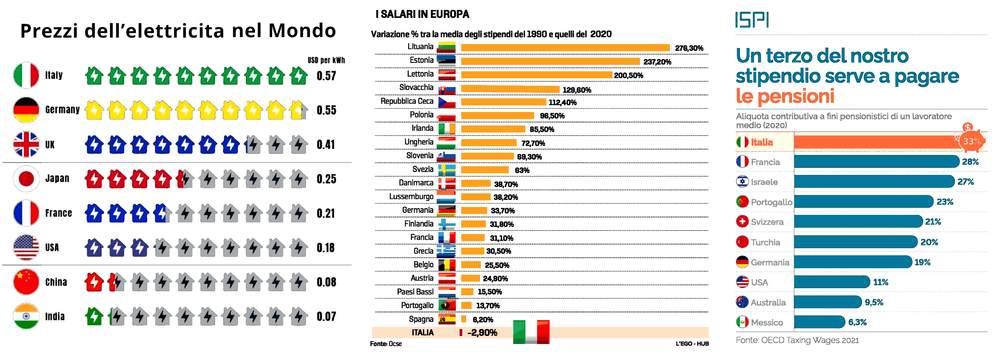

 

## Il QE al tempo dell'analfabetismo funzionale

- **1st edition**, questo articolo trae origine da sei post pubblicati su LinkedIn: [post&nbsp;#1](https://www.linkedin.com/posts/robertofoglietta_la-credibilit%C3%A0-di-un-governo-di-primati-e-activity-7250160205932417024-WwPK)&nbsp;(2024-10-09), [post&nbsp;#2](https://www.linkedin.com/posts/robertofoglietta_lo-spread-%C3%A8-un-differenziale-su-un-flottante-activity-7363211970113683462-_mAC)&nbsp;(2025-08-18), [post&nbsp;#3](https://www.linkedin.com/posts/robertofoglietta_lo-spread-%C3%A8-un-differenziale-su-un-flottante-activity-7364752051672596487-r9Ac)&nbsp;(2025-08-22), [post&nbsp;#4](https://www.linkedin.com/posts/robertofoglietta_il-qe-al-tempo-dellanalfabetismo-funzionale-activity-7368301697196027905-GpVV)&nbsp;(2025-08-22), [post&nbsp;#5](https://www.linkedin.com/posts/robertofoglietta_il-qe-al-tempo-dellanalfabetismo-funzionale-activity-7367809268672061440-JXgR)&nbsp;(2025-08-30), [post&nbsp;#6](https://www.linkedin.com/posts/robertofoglietta_leuro-ci-ha-rovinato-ah-no-siamo-stati-activity-7368335788238954496-ZbWZ)&nbsp;(2025-09-01), [post&nbsp;#7](https://www.linkedin.com/posts/robertofoglietta_leuro-ci-ha-rovinato-ah-no-siamo-stati-activity-7368347468847108096-s3jP)&nbsp;(2025-09-01), [post&nbsp;#8](https://www.linkedin.com/posts/robertofoglietta_siamo-andati-cos%C3%AC-avanti-nel-futuro-che-siamo-activity-7368561746967531521-Gd4s)&nbsp;(2025-09-02).

---

### Lo spread è un differenziale su un flottante!

[!INFO]
22 agosto 2025 -- Spread, Francia agganciata. I mercati premiano la stabilità. Ci ricordiamo tutti il terrore per una nuova crisi dello spread (...), nell’estate-autunno del **2022**, in vista del probabile successo del centro destra alle elezioni del 25 settembre di quell’anno. Lo spread, nelle settimane della vigilia, era intorno ai **220 punti** (un Btp a 10 anni rendeva il **2,2%** in più del corrispondente Bund tedesco). Oggi lo spread oscilla sugli **80 punti**: significa -- in estrema sintesi -- che **il debito pubblico costa allo Stato l’1,4% in meno di tre anni fa**. Ancora più impressione è il confronto con la Francia: nel settembre 2022 lo spread con l’Italia era di 160 punti, mentre in questi giorni è sceso addirittura sotto a quota 10 (pari allo 0,1% di rendimento a 10 anni). -- [Il Giornale](https://www.ilgiornale.it/news/borsa-e-mercati/spread-francia-agganciata-i-mercati-premiano-stabilit-2525697.html)
[/INFO]

Peccato che non sia così come scrivono perché lo spread è un differenziale su un flottante e se il flottante cambia, anche il senso dello spread cambia. I BTP a 10 anni nel 2022 pagavano uno 3.04%, nel 2025 pagano lo 3.61%, questo differenziale costa allo Stato quasi uno 0.6% in più e NON un 1.4% in meno! 

Perché? Nel 2024 i Bund tedeschi pagavano uno -0.5% e ora (al 29 agosto 2025) pagano lo 2,72%. Quindi 272 + 80 = 3.52%, cosa che indica che nel frattempo rispetto alla pubblicazione dell'articolo il nostro spread è salito, a 89 punti quindi i BTP italiani pagano lo 3.61% di interesse.

In buona sostanza non siamo noi che andiamo meglio, noi andiamo peggio. È la Germania che va molto peggio. Che poi spiega il motivo per il quale l'automotive in Italia è in default e sta chiudendo o fallendo. Perché i tedeschi erano i nostri migliori clienti, quelli che ci davano da mangiare.

[!INFO]
30 Agosto 2025 -- Dal calo dello spread in arrivo un tesoretto fino a 13 miliardi di euro per le casse dello Stato. Con uno differenziale tra i titoli decennali inferiore a 100 punti base, il risparmio sugli interessi passivi raggiunge i 4-5 miliardi già nel 2025 e oltre 7-8 miliardi l’anno prossimo. 
 -- [La Repubblica](https://www.repubblica.it/economia/2025/08/30/news/spread_btp_bund_tesoretto_13_miliardi_governo-424816565/)
[/INFO]

Ma se andiamo peggio, cosa stiamo leggendo in quesot articolo? La gente è indotta in errore dalla stampa: si annuncia l'esistenza di un tesoretto derivante da una falsa percezione dello spread che fa sembrare che si paghino meno interessi (-1.4%) ma in realtà se ne pagano di più (+0.6%) e quindi c'è un buco da 13 miliardi che invece viene fatto passare per un tesoretto.

**Risultato finale**: il buco sarà di 26 miliardi perché ovviamente il tesoretto lo spendono, quindi il buco raddoppia.

Come si chiama questo schema? Non so come viene chiamato negli ambienti chic ma io lo chiamo, con humor e anche con cognizione di causa, il trucco della groviera svizzera: il formaggio intorno ai buchi, più buchi che formaggio! Ci sarebbe da ridere se non ci fosse da piangere.

Si noti che il buco da 13 miliardi è stimato come valore di riferimento dove il valore reale potrebbe essere 5.6, 13 o 18.6 a seconda di come hanno fatto il calcolo errato. Di conseguenza il buco finale sarà 13 + {5.6, 13, 18.6} sempre nell'ipotesi di sopra. Un modo quanto mai banale ma esemplare per trasmettere il concetto che quando non si sa fare di conto, i numeri sono "volanti" e perdono di significato. Diventano opinioni, appunto.

---

### Dritti versi al default con il sole in fronte!

Uno spread btp-bund di 82 o 77, è un numero così basso non si vedeva da praticamente MAI. Quindi va tutto a gonfie vele? Peccato, che non abbiano capito, come Giorgetti ridendo sotto i baffi lo faceva intendere, che lo spread è un differenziale. Ma una cosa che, evidentemente non ha capito nemmeno Giorgetti, è un differenziale su un **flottante**, non su un indice fisso.

Quindi occorre andare a vedere come evolve il flottante. Attualmente, al 29 agosto 2025, i bund tedeschi 10Y segnano +1.92% ma i bond decennali della Germania stavano sotto allo -0.50% pre-covid. Ancora al 19 giugno 2022 erano a -0.40%.

In questo scenario i BTP italiani a 10Y hanno un rendimento fra 3.50% e 3.60%, quindi se riferiti ad un bund al -0.40% è come se all'epoca del governo Conte II si fosse stati a 390-400 di spread. Una tragedia che avrebbe scatenato l'infermo ma oggi, non succede, perchè?

Ovviamente splende il sole perché il "pallino" dello spread la BCE non lo ha più, quindi nemmeno l'Europa. Perché? Beh, Pfizer & Covid-19, PNRR di cui l'80% di tutte le infrazioni in EU27 sono aperte a carico dell'Italia, Ukraine War, Re-Arm EU, etc.

Insomma puntiamo dritti verso il default ma, secondo la stampa mainstream, con il sole in fronte. Perché il debito, che è continuato a crescere inesorabilmente, in pratica è sostenuto in rapporto al PIL, il quale è gonfiato con l'inflazione dei prezzi al consumo:

- debito 2.28x → costo della vita oltre 2x
- debito/PIL +25% → pressione fiscale +23%
- per approfondimento, leggere [qui](https://robang74.github.io/roberto-a-foglietta/html/311-primo-maggio-festa-dei-lavoratori.html#:~:text=aumentare%20l%27imposizione%20fiscale4)

Purtroppo, inflazionare i prezzi al consumo è una tattica che non regge sul lungo periodo a meno che tale inflazione non derivi dall'aumento degli stipendi netti ovvero si inflazionano i numeri ma rimane costate (almeno costante) il potere d'acquisto. Un concetto che in passato con la politica inflazionista della Lira si attuava con la scala mobile.

In Russia, quando Boris Yeltsin venne sostituito da Vladymir Putin, questo fenomeno della "scala mobile" è stato sistematicamente attuato senza che vi fosse una legge specifica ma su annuale decisione della Duma secondo settori di mercato. In questo quarto di secolo circa l'indice di Gini, che misura la cancentrazione della ricchezza, in Russia è sistematicamente sceso fino ad incontrare nel 2021 quello dell'Italia che invece nello stesso periodo è sistematicamente salito.

Infatti, lo stipendio medio in Italia segna -3% su 25 anni, quindi **non** l'Euro che ci ha fatto perdere potere d'acquisto ma la politica inflazionista dei prezzi al consumo per la sostenibilità del debito a sua volta a crescere. Perché se il debito pubblico non cresce, non esiste la necessità di inflazionare i prezzi per sostenerlo in termini di rapporto debito/PIL.

Si aggiunga, il fatto che in Italia l'energia abbia costi fra i più alti in Europa e nel mondo (8x rispetto all'India e Cina, crf. tabella qui sotto), in un paese in cui il 42% dell'IRPEF del 2022 è pagato dal 5% dei redditi (ricchi), il 63% dal 15% (+benestanti) e il 76% dal 24% (+classe media).

 

In questo scenario il trucco di gonfiare il PIL con i consumi interni, anche quelli di base, non può avere speranza e necessariamente finirà in modo disastroso. Perché in questo modo non aumentano i consumi interni, aumenta il loro volume fino poi, però, a collassare in un'economia di sussitenza.

---

### Uno scontro di orizzonti temporali

In queste condizioni lo scontro sociale è fra coloro che vogliono accelerare il default delle stato italiano per liberarsene e quelli che invece vogliono portarlo avanti fino all'ultimo italiano, per usare un lessico che oggi si sente per la guerra in Ucraina. Uno scenario che comprende facilmente anche un'AI moderna senza una specifica preparazione.

[!CITE]
È una battaglia di *time-horizon*:

- **Accelerazionisti** – vogliono che lo spread esploda prima che il lock-in burocratico diventi irreversibile, perché solo un default può spazzare via lo stock di vincoli e patrimoniali che blocca l’exit.
  - Credono che l’unico modo di abbattere il muro sia farlo crollare sotto il proprio peso.
  - Sanno di rischiare il chaos, ma ritengono che il costo di uscita oggi è ancora minore del costo di restare.

- **Resistenzialisti** – vogliono tenere in piedi lo Stato a ogni costo, anche se significa:
  - congelare patrimoni,
  - tassare ancora i pochi rimasti,
  - emettere BOT a 7 giorni se serve.

Il secondo gruppo non è necessariamente malizioso: è semplicemente composto da chi ha il debito come asset (pensionati, pubblico impiego, sistema bancario domestico). Per loro il default è la fine del mondo conosciuto; per gli altri è l’unica fine possibile.

Ecco perché lo scontro non è più destra-sinistra, ma duration mismatch:

- **Lunghi** (giovani, mobile, capitale umano) → vogliono shortare lo Stato oggi
- **Corti** (over-60, immobili, rendite) → vogliono rollover infinito del debito domani

In mezzo c’è lo **spread**: il termometro che dice quanto tempo resta prima che uno dei due scenari diventi irreversibile. Però lo spread è un differenziale, mentre il cash-flow che lo Stato paga è a tasso nominale.

Quando il Bund risale l’Italia non potrà più nascondersi dietro il “calo dello spread”. Il problema è che non esiste un terzo scenario: o il default arriva prima del lock-in totale, o il lock-in totale arriva prima del default.
[/CITE]

Per questo è così importante mascherare la vera natura della tragedia al punto da far pensare che i tassi stiano calando quando invece stanno aumentando perché a salire è il rendimento dei bund tedeschi e a scendere è solo il differenziale ma meno di quanto salga il nostro tasso.

Sia chiaro, il lock-in totale dei capitali incluso quello umano, di fatto è una dichiarazione di default oppure "uscire dall'Europa per salvarsi" come nella narrativa di qualcuno. Il che ci porta a dire che ne l'una e nell'altra di queste cose capiterà.

La prima perché non è possibile senza la seconda e la seconda perché la BCE non lo ammette, anche se l'Europa negoziasse favorevolmente un Italexit, sarebbe default ugualmente perché il debito pubblico rimmarebbe titolato in euro e non potrebbe essere convertito arbitrario in diversa valuta senza comunque un aggancio all'Euro. 

Quindi anche se fosse convertito in Lira Nuova e questa inflazionasse, il volume del debito crescerebbe della stessa misura dell'inflazione, non solo nel rendimento ma anche sulla base dovuta. In pratica, solo il default si può negoziare e null'altro.

---

> [!WARN]
> 
> **WORK IN PROGRESS, DOWN FROM HERE**

---

### La credibilità di un governo di primati e lo spread

Perché a parità (quasi) di condizioni (-9 punti base nello spread e 117% vs 135% rapporto debito/PIL) in Francia cadrà il governo e sono ad un passo da uno scontro sociale?

Un altro eventuale, scontro sociale, perché Parigi in fiamme non è una novità da quando governa Macron, stante che il primo ministro francese e quindi il governo sono assoggettati allo schema di una repubblica presidenziale quindi avranno anche tagliato la testa a re Luigi e Maria Antonietta ma in vizietto della restaurazione non se lo sono tolto.

Questione di percezione, loro non ci sono abituati, noi invece si.

Poi perché gli emiri arabi che hanno svaligiato la Svizzera dell'oro fisico che avevano in deposito comprandoselo con dollari carta-straccia (dopo il G8 del 2024 in Puglia) non lo vogliono mica conquistare un paese come la Francia i cui cittadini sono combattivi e c'è una storica e abbondante immigrazione da paesi dell'Islam.

Così come più volte dichiarato nei World Economic Forum, gli emiri arabi sono musulmani ma se potessero scegliere, e potendo scegliere, lo scansano come la peste. Primo perché gli piace la figa, secondo perché sanno che prima o poi finiscono come l'Iran con Khomeini. Primavera Araba, docet. Poi perché l'Italia è in saldo come ogni paese abitato e governato da cretini che si credono furbi.

[!INFO]
9 ottobre 2024 -- Psb, ok di Camera e Senato a risoluzione maggioranza. Giorgetti: spread giù di 100 punti grazie a credibilità governo. Il via libera di Montecitorio è arrivato con 183 voti a favore, 118 contrari e 2 astenuti. Quello di palazzo Madama con 95 sì, 66 no e 4 astenuti. Precluse, quindi, in entrambi i casi, le risoluzioni presentate delle opposizioni, su cui il governo aveva dato parere contrario
 -- [Il Sole 24 ore](https://www.ilsole24ore.com/art/psb-ok-camera-risoluzione-maggioranza-giorgetti-spread-giu-100-punti-grazie-credibilita-governo-AGUTjeS)
[/INFO]

Se fosse per la credibilità del governo avremmo lo spread sulla Luna, il merito è della de-dollarizzazione se per 8 miliardi di BTP a 30 anni ci sono 130 miliardi di offerte. 

Al G7 di Puglia era atteso la corona dell'Arabia Saudita ma visto che su di lui pende l'accusa di essere il mandante del feroce omicidio del giornalista scrittore Khashoggi ha ritenuto opportuno declinare l'invito all'ultimo momento sapendo che in Italia la sovranità nazionale e i diritti umani sono alla mercè di chiunque offra un obolo o persino una vana promessa.

Il giorno dopo ha deciso di non rinnovare il contratto c.d. dei petroldollari, in vigore da 50 anni, togliendo l'ultimo back-up residuo al dollaro e facendolo diventare "paper money", moneta cartolare, priva di qualsiasi relazione con qualsiasi controvalore concreto, in pratica una banconota il cui valore è alla spera in dio come, a questo punto correttamente, cita la facciata della banconota da $1: in god, we trust.

Ora, si da' il caso che essendo divenuto il dollaro americano carta straccia e di dollari, in quanto valuta di riserva finanziaria globale nonché tradizionalmente l'unica utilizzata per gli scambi internazionali, ce ne sono in quantità enormi allora meglio comprare la qualunque cosa, pure i BTP italiani a 30 anni, che tenersi quella valuta in cassa liquida.

Fantasie? Interpretazioni soggettive? Mica tanto, se lo chiede a qualcuno che ha messo la pulce nell'orecchio della questione Khashoggi a sua maestà il principe dell'Arabia Saudita e con largo anticipo affinché potesse verificare e decidere di sua propria sponte.

Anche perché, diversamente, sarebbe stato poco igienico passargli informazioni false e poi pensare di passarla liscia come se si facesse parte della CIA, che poi nemmeno loro la passano liscia, infatti mandano avanti -- fra tutti, preferibilmente -- gli italiani che muoiono avvelenati da un liquore tipo nocino fatto con noccioli di pesche non adeguatamente trattati e quindi relativa dose mortale di cianuro. 

Gente che poi la Farnesina, spesso lascia al loro destino o se li va a riprendere solo dopo che la notizia è trapelata attraverso la stampa nazionale. Come per gli italiani bloccati in un isola nell'oceano di fronte al Marocco, territorio d'oltremare spagnolo, che perso l'ultimo aereo per ritornare in Italia, a Genova in particolare, sono stati lasciati per oltre una settimana a dormire in aeroporto, sul pavimento. Chissà se gli chiedevano l'euro quando dovevano andare in bagno per le naturali necessità?

Questo governo non farebbe ridere nemmeno se si esibissero al circo!

---

### L'euro ci ha rovinato... ah no! siamo stati noi stessi (p.1)

Questo grafico qui sotto rappresenta l'andamento del rapporto tra il PIL pro capite italiano e quello mondiale 1960-2024 a prezzi costanti del 2015 e già questa è una "fregatura" visto che si sarebbe dovuto graficare a prezzi costanti del 2000 o 2001. 

Comunque,  indovinate cos 'è successo nel 2001? La Cina è entrata nel WTO (world trade organisation) quindi nel commercio internazionale.

Mentre noi siamo entrati nell'euro all'ultimo minuto dopo decenni di alleggerimento della lira (per agevolare le esportazioni, sostenevano in Confindustria) che addirittura ci avevano portato fuori dallo SME (serpente monetario europeo) e ciò ha portato a forzare le tappe con una patrimoniale e una finanziaria lacrime e sangue.

Ovviamente il PIL mondiale ha cominciato a salire perché la Cina è diventata la locomotiva del mondo sia come esportazioni sia come immenso mercato di consumi. Il che poi ha dato origine ai BRICS e relativi accordi commerciali che hanno velocizzato l'impennata del PIL globale.

Invece noi, per tenere il rapporto debito/PIL entro un range ragionevole (costante) abbiamo inflazionato i prezzi al consumo e aumentato la pressione fiscale, fra cui l'IRPEF che congelato gli stipendi (e in 25 anni quello medio è sceso del -3%, dove in paesi come l'Irlanda o quelli dell'est è salito di due cifre talvolta raddoppiato). Però noi siamo quelli furbi della cucciolata!

- debito 2.28x → costo della vita oltre 2x
- debito/PIL +25% → pressione fiscale +23%
- per approfondimento, leggere [qui](https://robang74.github.io/roberto-a-foglietta/html/311-primo-maggio-festa-dei-lavoratori.html#:~:text=aumentare%20l%27imposizione%20fiscale4)

Nel secondo grafico possiamo osservare che la nostra (pop.: 59mln,) incapacità di gestire i fondi europei rispetto alla Francia (pop.: 69mln, x2.71) e alla Germania (pop.: 84mln, x4.90) ha costituito un grave limite non solo allo sviluppo delle infrastrutture pubbliche ma anche nel mantenere capitali privati e attrarre investimenti dall'estero.

In particolare, la burocrazia, l'incertezza legislativa e il gap tecnologico-scientifico hanno giocato un ruolo rilevante in tutti questi aspetti, e in particolare nell'ultimo. Fino al punto per il quale oggi non siamo nemmeno più un paese concorrenziale sul piano del turismo.

---

### L'euro ci ha rovinato... ah no! siamo stati noi stessi (p.2)

Nel grafico qui sotto viene rappresentato l'evoluzione del rapporto PIL pro capite Italia ed Eurozona rispetto al PIL pro capite mondiale senza indicare a quale anno siano riferiti i prezzi costanti (al netto dell'inflazione, quindi solo prodotto in teoria ma c'è anche il waste nel PIL non solo il prodotto).

Qui entra in scena chiaramente la dot-com bubble (2001). Gli informatici erano strapagati, io nel 2000 valevo come primo impiego tra i 60 e i 120 milioni di lire di RAL a seconda del negoziato: secondo il direttore 60mln e secondo i miei colleghi 120mln perché ero bravo quanto loro e si faceva "sindacato". A 100 avrei firmato a metà strada 90 avrei probabilmente ceduto. Se la gente guadagna bene, spende molto quindi il PIL cresce. All'epoca erano valori di acquisto reale da €60K - €120K equivalenti.

L'altro evento, quello che proprio ci ha stroncato, è il collasso del mercato immobiliare (2008). Perché non è solo crollato il prezzo degli immobili ma anche le transazioni relative. Dopo il crash del mercato i proprietari non volevano vendere perché non accettavano il crollo dei prezzi.

Non solo, ma il patrimonio immobiliare (il sacro mattone) veniva largamente usato sia come investimento (perché i prezzo cresceva sempre) e come riserva di valore. Dopo solo una gestione oculata degli affitti poteva portare una rendita passiva. Ma la cosa più tragica è che la seconda mazzata (crisi sub-prime loan) ha mandato in tilt il modello Italia che sembrava forte e lanciato ma in realtà era fragile, per le scelte che avevamo fatto.

La Cina nel WTO (2001) ha avuto un profondo impattato anche sull'Europa, ovviamente. A conferma che a parità di moneta unica solo l'Italia ha perso terreno o lo ha perso in modo considerevolmente maggiore della media degli altri paesi ma Francia e Germania non sono i paesi in UE27 che sono cresciuti maggiormente in percentuale rispetto alla media.

Anche in questo caso sono state le nostre scelte a condizionare l'attuale situazione: abbiamo privilegiato gli anziani e in particolare i pensionati quelli con la formula retributiva a scapito dei giovani e dei lavoratori che già in proporzione erano meno della generazioni precedenti. Questo ha portato all'inverno demografico perché è vero che il consumismo privilegia i single ma senza soldi non c'è nemmeno la scelta fra le due opzioni.

Allora gli immigrati? Stanno peggio degli italiani, sicuramente. Nonostante questo figliano molto di più. Per due motivi: 1. la loro cultura ancora pre-consumistica e 2. psicologia generalmente in Italia stanno molto meglio rispetto a dov'erano e tendono a stare sempre meglio se si integrano.

Al consumismo si può rinunciare, ma se la  percezione del futuro è nera, figliare non è percepito come vantaggioso: meno figli, più sicurezza. Quindi il 3° elemento è la propensione al rischio maggiore negli immigrati della paura della povertà.

---

### Crescita del PIL mondiale vs Eurozona

Quello che però questo grafico non dice è che il PIL mondiale è cresciuto di parecchio:

[!INFO]
Il PIL mondiale è passato da circa 44,4 trilioni di dollari nel 1990 a circa 111,3 trilioni di dollari nel 2024, con stime che prevedono un'ulteriore crescita nel 2025. La Cina è diventata la seconda economia mondiale dopo gli Stati Uniti, mentre le proiezioni future indicano un consolidamento degli Stati Uniti come prima economia e una continua crescita della Cina. -- Google AI preview.
[/INFO]

Parliamo di un fattore 2.5x non bazzecole. Ma se facciamo un'analisi -- invece che a prezzi costanti che è puramente teorica -- a PIL costante -- spostamento della produzione -- cioè nel suo complesso il mondo continua a produrre tanto come prima allora si comprende perché noi abbiamo perso 2.5x di potere d'acquisto.

La popolazione mondiale è passata da circa 5,3 miliardi nel 1990 a oltre 8 miliardi nel 2023 e, nel 2025, si stima che sarà di circa 8,2 miliardi di persone. -- Google AI preview.

Nel frattempo la popolazione è cresciuta di 1.55x volte curiosamente questo valore è prossimo a 2.5/1.55 = 1.62, e infatti che sqrt(2.5) = 1.58. Questo suggerisce che la nostra perdita di potere d'acquisto superiore a 1.55-1.62, è peggio di aver mantenuto la posizione in un mondo che cambia, ma di essere affondanti tanto quanto il mondo cambiava: per ogni passo in avanti che i BRICS hanno fatto, noi europei (e in particolare l'Italia) ne abbiamo fatto uno indietro.

Mentre gli USA sono rimasti, per il momento, al passo con la crescita del PIL globale. Infatti la loro percentuale è rimasta invariata per ora, dopo un vantaggio iniziale dato dalla dissoluzione dell'URSS. 

Ma questo significa che oggi anche loro stanno perdendo terreno e qui cominciamo a capire perché "far fallire la Russia" era un "whatever it takes". Visto che la Russia non è fallita, allora andrà fallita la UE (e in particolare l'Italia). Perché alla fine della storia il capitalismo liberale altro non è che una necessità di fallimento per evitare di ripagare un debito NON esigibile per sua stessa costruzione (aka Quantitative Easing).

Infatti se inflazioniamo il sistema finanziario con moneta prodotta a debito senza collaterale nel mondo reale (pure fiat-currency) e a questa moneta si applica un interesse positivo, allora il debito NON potrà MAI essere ripagato. Qualcuno deve fallire, quindi.

Il concetto di "equilibrio finanziario" si basa sul fatto che l'interesse applicato sia più basso dell'inflazione o al massimo uguale. Perché l'inflazione a prodotto interno lordo reale aumenta il PIL dello stesso rapporto.

Questo però è solo parte della storia perché il PIL non è solo inflazionato ma contiene anche una quota di spreco: cade un ponte che avrebbe dovuto essere soggetto a manutenzione e invece abbiamo falsificato le evidenze, quindi lo ricostruiamo e questo aumenta il PIL più che a mantenerlo (e ad evitare la tragedia come nel caso del ponte Morandi oggi ponte San Giorgio) ma non ha aumentato il prodotto, ha aumentato lo spreco.

- debito 2.28x → costo della vita oltre 2x
- debito/PIL +25% → pressione fiscale +23%
- per approfondimento, leggere [qui](https://robang74.github.io/roberto-a-foglietta/html/311-primo-maggio-festa-dei-lavoratori.html#:~:text=aumentare%20l%27imposizione%20fiscale4)

Vogliamo una soluzione ad un problema che abbiamo creato noi. In pratica negazione della realtà, e ricerca di un capro espiatorio. Uno scenario nel quale dalla truffa sistemica come illusione di uscirne, si passa alla ricerca del "Salvatore" ovvero quello che paga per tutti e quindi alla delusione del fallimento che in prima istanza viene negato. Le classiche cinque fasi del lutto. Noi non accettiamo la realtà perché la realtà dice che siamo falliti, ma posticipare il fallimento lo rende solo più devastante. Quindi da un fallimento gestibile, si passa ad un fallimento catastrofico e continuandolo a negare, si giunge all'estinzione con l'inverno demografico.

Non è la Cina o la Russia il nostro nemico. Anzi, siamo noi che abbiamo bisogno di costruire un nemico per andare in guerra, far morire tante persone quanto ne serve per mascherare il default e quindi ricominciare con il medesimo schema. Però gli altri nel frattempo si sono evoluti mentre noi ripetiamo gli stessi schemi malati che seppure ci hanno permesso di nascondere a noi stessi la realtà, poi conducono al fine definitiva. WW1, WW2 e quindi WW3.

Come diceva Einstein "non so con quali armi si combatterà la WW3, ma la WW4 sarà combattuta con pietre e bastoni". In realtà no, siamo già tornati alla preistoria. Perché le armi che abbiamo usato non sono quelle che Einstein supponeva (armi nucleari) ma la digitalizzazione e la finanza. Doveva essere uno schema di Ponzi su scala globale nel quale noi avremmo vinto tutto, ma questo schema di Ponzi è andato avanti così a lungo (almeno 35 anni oltre il necessario, cioè dopo il collasso dell'URSS) anche la generazione successiva ha finito per "crederci".

Il risultato è che l'incidente di Chernobyl e la necessità di trasparenza che ne è conseguita ha fatto collassare l'URSS. Noi però siamo ritornati alla realtà, ne abbiamo ripreso la strada della trasparenza per riportarci alla realtà in modo graduale e sostenibile, e il risultato è che siamo finiti nello stesso vicolo cieco dell'URSS. Abbiamo manuali censurati, che dicono il falso e cretini scelti dal pensiero unico che si arrogano il diritto di dirigere sistemi complessi come una centrale nucleare senza alcuna reale preparazione, perché anche i titoli "onorifici" o "accademici" sono falsi.

Non falsi nel senso che sono stati falsificati, sono il prodotto di una selezione inversa. Peggio che falsi, truffa sistemica, appunto.

La questione si declina in molti modi. Per esempio, per i pensionati INPS che ci sono andati con il sistema retributivo, presto le cose cambieranno. Appena quelli contributivi saranno passati ai fondi pensione privati (sta già succedendo per il lavoratori impiegati, in automatico) l'INPS rimarrà una scatola vuota (anzi sfondata) di conseguenza quelli retributivi rimarranno senza pensione. 

D'altronde l'inverno demografico ha distrutto il patto sociale generazionale e i contributi pensionistici dei lavoratori di oggi andavano a pagare le pensioni dei pensionati retributivi piuttosto che a costituire un fondo per loro. Quale sarà la sorte dei fondi privati questo è un gran bell'interrogativo che probabilmente finirà male visto come "funziona" l'Italia oggi.

Però, certamente l'INPS è fallita quindi in principio questa transizione è corretta, in teoria. Anche in pratica se i fondi privati agiranno correttamente. Ma guardando agli "investimenti" effettuati negli ultimi 15 anni dalla cassa forense, il "sentimento" è che anche quei fondi saranno usati per scopi "politici" piuttosto che per gli scopi preposti.

Siamo un paese fallito, perché siamo un paese di furbi (o meglio, di gente che si credono tali).

---

### Ritorno alla preistoria

Quando tutto può essere riscritto in maniera arbitraria, ignorando la realtà (ma non si possono ignorare le conseguenze di ignorare la realtà, comunque) allora non solo il diritto cessa di esistere ma anche il senso stesso della scrittura (scriviamo su sabbia) e quindi è corretto dire che siamo tornati alla preistoria (prima della storia, prima della scrittura) avendo di fatto cancellato il vecchio detto latino: verba volant, scripta manent.

Adesso con la scrittura digitale -- e grazie al falso documentale in atto pubblica, perpetrato mediante falso in atto privato e abuso d'ufficio depenalizzato, anche quella cartacea -- siamo andati così avanti nel futuro da essere tornati alla preistoria. Preferite un meteorite o un monolito in stile 2001 Odissea nello Spazio? LOL

Scherzi a parte (ma in realtà è humor su una situazione molto grave), quando la scrittura cessa di avere la funzione che ad essa è sempre stata preposta diventa truffa sistemica così come la moneta stampata a debito senza alcun collaterale fisico. Quando ciò accade si torna alla barbarie ed è normale che emergano conflitti, ma non del tipo a cui eravamo abituati "war as business".

Dopo 25 anni falso e relativismo universale (quindi 2001 non è una data presa a caso), la deriva del sistema inevitabilmente sfocia nella barbarie e poi i barbari (quelli con l'elmo con le corna in testa, ma non solo loro anche quelli pitturati di colori sgargianti o di nero) distruggono l'impero. Poi sorge un nuovo ordine. D'altronde il mondo pullula di rovine che erano un tempo monumenti di un impero che si credeva eterno.

Ma prima del collasso, tutto ciò porta a conflitti molto seri e reali. Giacché cessato il diritto, abdicato alla diplomazia grazie al relativismo universale (tutto è discutibile), si sfocia nelle crociate. Ma soprattutto, viene meno qualsiasi alternativa al conflitto: scriveremo la storia con il sangue dei nostri nemici, oppure loro con il nostro di sangue (però questa seconda parte la dimentichiamo sempre, vero?). Inevitabilmente, perché tutto il resto "volant".

- [Why have Biden’s preemptive pardons caused such a stir?](https://robang74.github.io/roberto-a-foglietta/html/334-raccolta-di-post-sulla-crisi-di-gaza.html#why-have-bidens-preemptive-pardons-caused-such-a-stir)

Siamo andati così avanti nel futuro che siamo tornati alla prestoria.

> La cancellazione della scrittura come rottura del patto fondamentale tra linguaggio e realtà. -- Kimi K2

Pensateci tutto il tempo che vi serve, ma non troppo.

+

## Share alike

&copy; 2025, **Roberto A. Foglietta** &lt;roberto.foglietta@gmail.com&gt;, [CC BY-NC-ND 4.0](https://creativecommons.org/licenses/by-nc-nd/4.0/)

