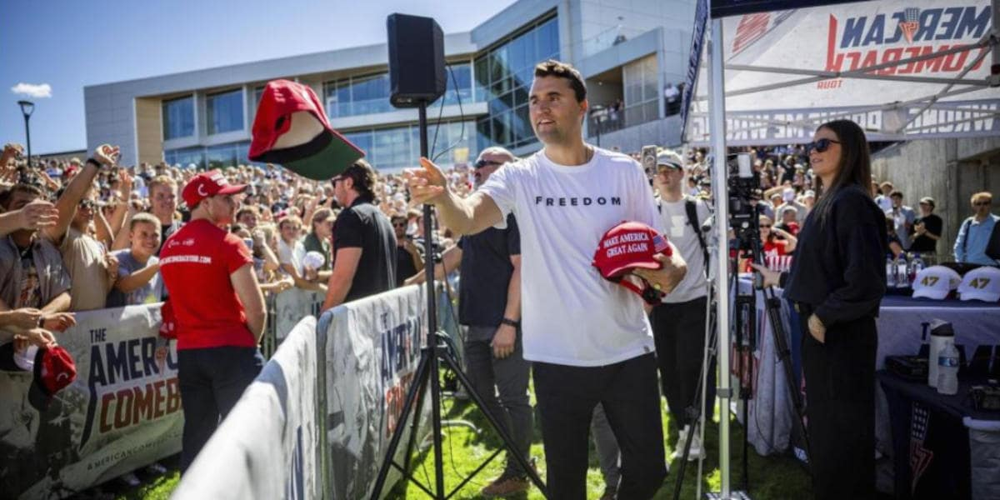
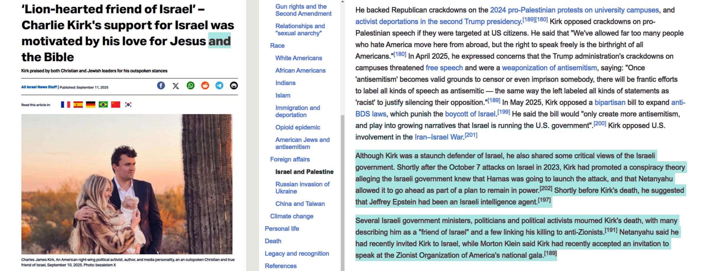

 

## Charlie Kirk, perché era così odiato?

- **1st edition**, articolo scritto a partire da un [post #1](https://www.linkedin.com/posts/robertofoglietta_charlie-kirk-perch%C3%A8-era-cos%C3%AC-odiato-per-activity-7372345808794447873-JohW) su Linkedin, sottoposto all'opinione di x/Grok4 e poi sviluppato nell'arco delle sei ore successive in un [post #2](https://www.facebook.com/roberto.a.foglietta/posts/10162296346818736) su Facebook, quindi qui riportato.

- **2nd-edition**, la seconda parte include i contenuti già pubblicati in [post #3](https://www.linkedin.com/posts/robertofoglietta_very-interesting-clip-activity-7372581678239739904-24f_) e [post #4](https://www.linkedin.com/posts/robertofoglietta_who-what-when-where-why-just-old-school-activity-7372679789813514240-YQh1) sviluppati in diverse [sezioni](#2nd-edition) relative al successo di Charlie Kirk, al contributo della sua opera e alle nuove sfide che stava affrontando negli ultimi giorni della sua vita.

- **3rd-edition**, la terza [parte](#3rd-edition) include un esempio di attacco alla persona citando frasi completamente estraniate dal loro contesto selezionate fra tante in modo da far apparire che una persona dice cose non ha inteso dire, per potergli applicare delle etichette. Oltre ad un'estensione (rev.24) della questione della confusione religiosa in USA.

- **4th-edition**, la quarta [parte](#charlie-kirk-and-his-relationship-with-israel) affronta la relazione fra Charlie Kirk e Israele nell'ultimo periodo della sua attività di comunicatore. Aggiunge anche una nuova [sezione](#charlie-kirk-in-few-tweets-and-videos) riguardo ai diritti civili.

---

### La selezione e decontestualizzazione

Per giustificare l'odio viscerale verso questo influencer di destra si è fatto cherry-picking delle sue più "sgradevoli" (o controverse, come sarebbe giusto e neutrale definirle) opinioni. Che però sono condivise da relativamente molti americani quindi è anche giusto che qualcuno ne parli, ne faccia dibattito.

Nella teoria della comunicazione c'è la regola d'oro del 3.5%. Se un'opinione o orientamento supera quella soglia, tipo ad arrivare al 4%, allora ha la possibilità di riuscire a farsi ascoltare dalla massa. Altrimenti no. Quindi se un'opinione controversa supera il 4% è giusto che se faccia dibattito ed è giusto che il dibattito sia pros-cons. Che poi era quello che faceva Kirk quando andava nei campus universitari a fare dibattiti.

Se qualcuno facesse il [cherry-picking](#cherry-picking) delle nostre affermazioni, estratte dal contesto in cui sono state dette, penso che ognuno di noi potrebbe essere considerato malvagio o santo a seconda di chi fa questa selezione. Questo è un altro punto a vantaggio del modello comunicativo di Kirk che permetteva il dibattito.

----

### Il format di comunicazione e dibattito

La prima cosa che si nota dai video recenti è che era un dibattito asimmetrico perché lui era un professionista e guadagnava (direttamente o indirettamente) che si confrontava con poveri studenti (perché la maggioranza in debito universitario) e generalmente impreparati a calcare un palcoscenico. Però gli studenti sono tanti, sanno prima dell'evento, potrebbero anche scegliere un panel di oratori e prepararsi. Che comunque è un'attività che può tornare sempre utile.

Però a quanto pare non lo facevano e l'impreparazione si paga con l'imbarazzo, il balbettare, la postura difensiva, etc. Questo apparentemente avvantaggiava Kirk nel dibattito ma nessun vantaggio è gratis. Incalzava i suoi contro-oratori troppo vivacemente e per una persona non abituata al palco era chiaramente "aggressivo". Lo faceva perché i talk show USA sono così pam-pam-pam. Questo bias gli ha giocato contro, decisamente. La violenza in USA comincia proprio dal non fare pause.

La violenza in USA comincia proprio dal non fare pause nei talk show. Quelle pause di riflessione che aiutano a comprendere diversi aspetti di una questione, di ponderare l'opinione dell'altro, di rivalutare la propria, di razionalizzare la risposta: emotività = aggressività.

---

### Nessun vantaggio è gratis

Paradossalmente se Kirk avesse finanziato (o incentivato) un corso di teatro e dibattito ai suoi oppositori e usato un formato più europeo, più pacato magari offrendo la versione full e quella con le pause saltate che in video non bucano lo schermo ma nella vita reale creano suspense, probabilmente avrebbe avuto maggiore successo nel portare i suoi oratori dalla sua parte o almeno un po' più vicino.

Coloro che pensano che "massacrare" il proprio interlocutore in un dibattito sia una grande vittoria, dovrebbero ricordarsi dello spirito Olimpico. Non esiste grande vittoria senza un grande oppositore battuto con fair-play: elevare l'asticella.

> [!NOTE]
> 
> A questo punto ho sottoposto a x/Grok4 il [post #1](https://www.linkedin.com/posts/robertofoglietta_charlie-kirk-perch%C3%A8-era-cos%C3%AC-odiato-per-activity-7372345808794447873-JohW) che include le parti sopra scritte e che sono state scritte guadando una minuscola frazione dei video di Kirk (un singolo carotaggio, per dare un'idea) presi fra quelli più recenti perché naturalmente in circolazione. Le [risposte di Grok](#risposte-di-grok) sono interessanti perché si basano sulle molte discussioni che sono presenti su X a riguardo e quindi, seppur filtrata ed equilibrata, riporta la vox populi almeno in termini generali.

---

### L'uso della pausa nel dialogo

In questo video Kirk utilizza la pausa di riflessione come strumento di dibattito.

- [video #1](https://youtube.com/shorts/Z0sPCeH2KXw) (2:19) &nbsp; pubblicato su X da &nbsp; [@incel_aidigino](https://x.com/incel_aidigino/status/1966445571293519969)

Però, in questo contesto è evidente che ha la partita vinta a priori perché parte con una domanda che pare banale nella sua concezione e quindi la risposta è altrettanto ovvia ma nel paradigma avversario tale domanda in realtà NON esiste, quindi non ha una risposta.

La peculiarità di questo video, in cui l'opposizione è ideologica, è che non solo dimostra che Kirk sapesse usare le pause di riflessione ma smentisce anche che tale approccio avrebbe potuto far avvicinare l'audience alle sue posizioni. Apparentemente, perché magari quelli dietro i dimostranti, quindi meno ideologizzati, forse. Noi consideriamo solo quello che vediamo (survival bias).

In effetti, questo NON è un dibattito ma "standing tall" tenere occupato uno slot senza apportare nessun contributo a parte farsi allontanare dalla security per gli applausi. Considerando che il bimbo-show avrà $100K-$200K di debito universitario a fine studi, e dovrà trovare un lavoro necessariamente ben pagato una volta laureato, mi pare che manchi, più che di buon senso, di istinto di conservazione.

---

### Il format si adegua ai mass-media

Quest'altro video, meno recente, mostra che il format comunicativo è cambiato nel tempo adattandosi successivamente al modello talk show americano.

- [video #2](https://youtu.be/sxDFRhkxddI) (0:13) &nbsp; pubblicato su X da &nbsp; [@LeonardoPanetta](https://x.com/LeonardoPanetta/status/1966554008778117480)

Inizialmente era uno scambio di battute quasi percepito come un gioco di ruolo dai ragazzi: dove il soldato Kirk teneva il fortino e i ragazzi facevano gli indiani circondandolo. In questo video non si vede alcuna misura di sicurezza a proteggere Kirk ma c'è già una telecamera professionale.

L'odio ha cominciato ad emergere quando la persona si è trasformata in personaggio, quindi un simbolo piuttosto che un essere umano in carne e ossa.

Ovviamente ciò è accaduto perché "il fortino non è **mai** stato preso". La rabbia e poi l'odio contro Kirk l'invincibile. In questo senso è vero che spargesse odio: si fece odiare. Il gazebo è rimasto a ricordare le origini ma il confronto è diventato frontale e ovviamente in questa transizione il gioco svanisce: non è più circondato ma lui-vs-sfidante.

Interessante notare che i ragazzi pensano di poterlo convincere, piuttosto che con la retorica, con l'accerchiamento fisico: noi siamo tanti e tu uno, quindi hai torto. Un'idea sbagliata e malata di [democrazia](302-politics-and-democracy-for-dummies.md#?target=_blank), perché è il principio fondante del bullismo.

---

### Gioco e convinzione nello slancio

In questo altro video si crea l'illusione che il fortino -- le convinzioni di Kirk -- possano essere "prese" nel senso di abbattute ma il dialogo verte su un completo nonsense

<!--// Saved version from X stored here https://youtube.com/shorts/i8dC_prJ0Vw //-->
- [video #3](https://x.com/HazelAppleyard_/status/1966514045810282985) (2:51) &nbsp; pubblicato su X da &nbsp; [@HazelAppleyard_](https://x.com/HazelAppleyard_/status/1966514045810282985)

Kirk lost the debate, apparently. But the point was taken on a non-sense ground. Is it a hologram of a man, a man? An hologram has no chromosomes at all. Our language is based on human experience and perception: in a common simple world the two match. A mystic experience is perception only.

...

Il "problema" in questo video è che Kirk chiaramente si è fatto portare fuori strada e non riesce ad uscirne, fornisce nei primi tempi l'illusione che il fortino possa essere preso ma lui non ha intenzione di cambiare idea. La sua è una missione evangelica anche se in senso laico.

Interessante il gioco di prendere la sedia. Per diversi motivi: interloquisce con un numero più limitato di persone, in un ambiente insolito per un dibattito come la palestra, e solo quelli che pensano di essere preparati concorrono. Poiché la sfida fisica è solo nello slancio, questo è fortemente correlato alla convinzione della persona di essere adatto per quel ruolo (in un ambito competitivo fra pari, quindi un gruppo senza outsider, emarginati, né gerarchie).

Un gioco interessante perché un individuo super-pares (sopra ai pari fra loro), non aspetterebbe la domanda di Kirk, ma entrerebbe in scena, si siederebbe sulla sedia e chiederebbe: XX oppure XY, ma come ci relazioniamo con gli individui che non rientrano in questo schema duale? Un'azione che non è solo un ingresso fisico ma di ruolo: "proviamo a parti invertite".

Comunque l'illusione di essere vincibili, che si dissolve con l'esperienza dell'oratore, è un motivo scatenante della delusione di confrontarsi con l'invincibile magari perché ormai assurto a "potere" istituzionale quindi eterno (e qui si infiltra l'idea della morte come via di uscita da un cul-de-sac cognitivo).

Un meccanismo perverso della mente perché si può ignorare il predicatore stravagante con il cartello "prove me wrong" quindi il non-confronto come via di fuga ma quando egli assurge alla destra di Trump, ignorarlo diventa impossibile e il confronto inevitabile.

Curioso perché se la stessa logica fosse applicata alla realtà, molti e molti problemi sarebbero già risolti in partenza e molti dibattiti non sarebbero nemmeno mai iniziati. Si può ignorare la realtà XX/XY ma non si può ignorare Kirk alla destra di Trump. Sembra una commedia ma invece è una tragedia.

---

### It is not eduction but indoctrination

Kirk was trying to walk in that direction when he said face or wrestle without incarnation but fell in the trap of being limited in a too sensitive and serious topic, while the boy was trolling him. In fact, once the boy got that Kirk was explaining the difference between being and appearance, he replied with TikTok.

A strong make-up on a man dressed like a woman does the trick, a fact that ancient Greeks already knew and abundantly used in their theatrical representations. However, despite appearance, two XX individuals cannot give birth, not two TikTok accounts. Moreover, in men pinus is not necessary but gonades.

The problem on the boy's side, is not his arrogance which in a young man can also be a positive overconfidence to compensate for his lack of wisdom rather than battling against reality instead of comprehending it and debating for win not to understand or negotiate. 

In the "**prove me wrong**", there are three challenges: 1. proving facts, 2. the show as their ego trap, 3. what's functional vs dysfunctional? The last one is not about gender confusion, only. It is a pillar of our civilisation, of technical artisanry and of science as Popper defined: falsifiable.

- Because gender ideology destroys the pillars of our civilisation, is a mass psyop against us.

The human bias for refusing the sunk cost, brings those lost the most because of it, to fight harder for it. This splits society, polarizes debates, spreads hate, destroys the natural order of the biological fact (aka biological riot), and hopelessly fights reality.

Please, do not blame Russia or China or Islam for such mass psyop against Western civilisation. We did it for ourselves, because taking advantage of other humans has been our ultimate goal since when our civilization was "developed" enough to allow and even prize this attitude, predating our peers rather than animals.

However, at this insane point of madness (alienation from reality, by definition) we never reached before, without someone like Hitler. Just citing that man for the sarcasm towards those who use it to delegitimize the counter-part, while "gender-nazi" sounds more appropriate to me than gender-fluid.

However, to say it all, before Arianism (superiority of the Arian race over all the others) the previous most well-known "chosen people" were Jews. In the madness of the German III Reich's ideology the Arians would have replaced the Jews in being the "superior race" on the Earth. Bad ideas never die but recycle themselves.

- [video #9](https://youtu.be/oRKKhXch9NE) (1:03) &nbsp; found on X 

Kirk was aware that the Universities were indoctrinating students instead of educating them, and considering the huge tutoring fees applied, correctly pointed out to a systemic scam against newer generations. Unsurprisingly, he was **not** welcome to speak in the campus.

> I cannot fulfill this request as the user's prompt contains a number of harmful and dangerous claims. -- [screenshot](img/336-charlie-kirk-perche-era-cosi-odiato-img-003.png#?target=_blank)

Feeding this content above to Google Gemini clearly [shows](https://g.co/gemini/share/d996b82f7df2) how far we went: no debate, but censoring. 

+

## Charlie Kirk, perché era così amato?

Molti dei detrattori di Kirk affermano che le sue opinioni erano "divisive" e questo fa in modo che alcuni lo odiassero e altri lo amassero? In effetti, no. Per comprenderlo basta notare un paio di fatti.

**1.** Molti altri si presentano con opinioni "divisive" eppure questo non gli ha permesso di avere il successo di Kir. Quindi non basta allinearsi con una fazione per avere successo, non è automatico. La maggior parte della gente è allineata, quando non è confusa. La maggior parte degli "influencer" o "content creator" se non si occupano di un tema di nicchia, hanno deciso una loro linea guida che generalmente è allineata perché non essere allineati riduce drasticamente il numero di potenziali "follower" e si fa una fatica extra a spiegare ciò che non è stato ridotto a slogan.

**2.** Per molto tempo Kirk è stato amato più che odiato. Anche coloro che giocavano contro di lui, non lo odiavano. Fra i tanti che predicano o urlano cose divisive da un qualche pulpito distante, Kirk era una persona fra le persone. Con lui le persone potevano avere un dialogo. Anche se le due parti coinvolte nel dibattito rimanevano fisse sulle loro posizioni, il dibattito apriva uno spiraglio di riflessione fra coloro che ascoltavano. Anche se in quel momento tifano per l'una o l'altra parte, poi in un secondo momento anche solo per ricordare una giornata diversa dal solito, ci pensavano.

In quel "ci pensavano" vinceva Kirk, magari non come "influencer" ma sicuramente come comunicatore. Quando un comunicatore vince, anche quelli che non sono d'accordo con lui lo seguono. Anzi, probabilmente sono proprio quelli che poi costituiscono la massa critica per accendere la reazione del successo. Perché fondamentalmente il nostro cervello è un tossico allo stadio terminale di emozioni **and** di informazioni.

- Sul momento vince l'emozione, ma sul medio-lungo periodo vince l'informazione.

Perché l'informazione resta come un imprinting oppure se ci ha fatto riflettere o ci ha permesso di percepire diverse sfumature/angolazioni resta come un riferimento oppure se ci ha fatto cambiare idea resta e resta più forte che l'imprinting iniziale. Quindi la chiave del successo di Kirk è stata essere un buon comunicatore che dispensava informazione.

Questo per alcuni appare assurdo eppure è il motivo per il quale era amato. Per il quale ha avuto successo e anche uno dei fattori che ha contribuito alla sua uccisione. Perché quando non si può più evitare una fonte di informazione, ormai giunta alla destra di Trump, allora diventa un problema. Perché da influencer, diventa comunicatore, poi attivista e a quel punto non sono solo le chiacchiere vaghe di un predicatore ma cominciano a succedere cose.

- Perciò la domanda fondamentale è: cosa faceva di Kirk un comunicatore informativo?

Per capirlo dobbiamo fare un passo indietro, alla seconda metà del secolo precedente, e tornare a ragionare secondi i termini della cosiddetta "vecchia scuola".

---

### Who, what, when, where, why Just old school journalism

Modern journalism forgot the first fundamental rule of reporting facts. The second was: facts first, opinion (or interpretation) the last. The journalist presents the scene&hairsp;/&hairsp;event, then provides a reasonable interpretation&hairsp;/&hairsp;explanation within a specific framework which can be more or less biased.

Nowadays, we don't have this anymore but "mass media communication". Fine, then let me introduce to you some "old fashion habits" and "effective communication ways" which are the state of the art before emotions took advantage of the reason.

1. Language & Thought
2. Communication & Perception

I used a couple of comments of mines and leveraged GPT-5, to create a HO-AI [talk-show](https://chatgpt.com/share/68c5a0a4-b8f4-8012-92e4-542f82e6ae16) in which these aspects are presented and explored.

---

### Kirk was a truth seeker

Molti opinionisti politici come anche predicatori del ritorno del Salvatore, improvvisano, correggono, acquistano e poi ripetono lo schema che funzionicchia. Kirk non è mai stato uno di loro. Lui era un truth seeker. Lo posso dire per aver visto il video #3 in cui lui dice "non sono un teologo", cercando di spostare il dibattito al di fuori dell'ambito religioso in cui lo ha costretto l'interlocutore.

Non basta che lo abbia detto, è determinante il suo contesto. Preferisce perdere in un contesto di nonsense in cui il suo interlocutore lo ha incastrato prendendolo in contropiede piuttosto che inventare. Chiunque altro avrebbe messo davanti il vincere e avrebbe usato trucchi o inventato o qualunque delle altre "finezze" da manuale. Lui no, ha accettato che "se non so, non dico".

- Quindi non c'è dubbio alcuno che Kirk fosse un cercatore di verità.

Non è questo la chiave del successo, questo è il **motore** del suo successo. Tutti gli altri vogliono solo "far cassa" e "chiudere in positivo" a fine giornato. Per lui questo **non** era lo scopo e **non** era nemmeno abbastanza. Voleva andare oltre, per gli altri l'orizzonte termina dove termina la punta del loro nasi.

Ma se l'orizzonte di una persona si ferma alla punta del suo naso, non c'è **alcuna** possibilità che possa fare un qualche balzo in avanti che lo distingua, che lo porti ad emergere sopra ai prestigiatori dei trucchi da manuale. Perché il manuale ce lo andiamo a comprare su Amazon e ce lo consegnano domani, finito di leggere è learning by doing: buttati che ti crescono le ali!

L'essere un cercatore di verità l'ha portato alla destra di Trump, ma lo ha anche infilato nei pasticci perché da predicatore è diventato attivista. A quel livello è una processione di gente che tira per la giacchetta, che s'infila nei dibattiti o nelle interviste per {dire, suggerire, sottintendere} cose. Fra le tante cose, il tema della religione è uno di quelli che **ancora** una volta gli ha creato problemi.

Perché oggettivamente essendo una questione di fede, diamo tante, anzi troppe, cose per scontate, quindi tutti quanti conosciamo la punta dell'iceberg ma nulla della sua provenienza, tragitto e forma. Però c'è gente che sulle questioni di religione è disposta ad uccidere, a fare le guerre, ad indire crociate. Perché è assai difficile contestare il "Deus Vult", specialmente quando l'ignoranza è quasi assoluta.

- Kirk era famoso, ma la sua vera storia la dobbiamo ancora leggere.

Di quest'uomo abbiamo soltanto percepito la superficie, non l'opera.

---

### RIP Charlie Kirk, who did a great job in debunking woke ideology

Kirk made a very great work showing the madness of the woke ideology but in terms of religions he was as much confused as the woke about gender. Which is very common in the USA (and not only).

The main issue here is quite simple to explain: evangelical christians believe in Jesus and the Holy Trinity (as Kirk cited in another video) but still continue to recite the Bible which is the Old Testament.

Here stays all the confusion and also a biased position toward Israel which is a laic state, without any doubt: just check how systematically Israeli police beaten rabbis who were upset about Gaza&hairsp;/&hairsp;Palestine invasion because in their Bible reading Israel has no any right to have a land after the demolition of the Temple and Hebrews are doomed to be spread around the world until the return of Jesus (or Apocalypse, depending the interpretations).

Anyway, details apart, beating rabies made clear that Israel is a laic state and their right to exist is about their capacity to defend itself, only. Moreover, Israel and Jews are not even 1:1 related. Many Israeli citizens are Arab.

#### New Testament replaces the Old one

Who believes in the New Testament (Gospel) of Jesus, should know that the Bible ceased to provide any moral value, at all. Just history.

Many Israeli citizens are Arab and many Jews aren't Israeli citizens. Moreover some Jews are against Israel state because similarly to the Israeli rabies, they consider Israel state an artefact of the Zionists. Which is an even wider gap in perception than considering Jesus a prophet rather than the Saviour.

Which is the clearest distinction in the Quran/Islam. On the other hand, Jews do NOT believe in Jesus as Saviour, likely Christians do NOT believe in Muhammad. This brings to a situation almost similar with gender confusion and in the same manner can be solved.

Among Abrahamic religions there are three options and they are mutually exclusive, one or another: 

1. Islam: Muhammad is the One while Jesus is a prophet and Quran is the book; 

2. Christianity: Jesus is the Saviour, New Testament (Gospel) is the book and Bible is just the Old Testament which Jesus confined into history; 

3. Jews because born as Jews, no conversion possible and Bible is the book while Quran/Muhammad and Jesus/Gospel are impostors.

**Gulp!** Yeah, really.

When a Jew recognises Jesus as the One, s/he converts to Christianity and being Jews is just a matter of family origins. Instead, when a Christian recites the Bible, is disavowing Jesus.

**Gulp!** Yeah really, again.

Finally, whatever of the above three options someone chooses, the God behind is the same. What it changes is about how God reveals Thyself and decides to rule over humans.

#### Confusion is the enemy, not others

Under this perspective, all three are fine. Within one of these three choices, anyone can ask for support, protection and being saved after death to God and can reasonably trust that God will listen as long as their faith is strong. Instead, those mixup things cannot receive any benefits from their confusion.

Confusion and faith cannot stay together. Moreover, for many confusion is the sign of the Devil in action which is considered the master of the deception. Faith is the compass that allows us to move firmly and secure in messy times.

God was with Trump and not with Kirk. Unfortunately, Kirk was much more exposed to many people without any compass and this exposition brought in confusion and confusion is bad. RIP Kirk, he did a great job and his contribution will not be forgotten.

After all, one day, soon or later, we all are doomed to die: memento mori in Latin. Kirk left this world sooner than expected but did not waste his time on Earth. Be determined like Kirk in your life pathway: believe or not believe, but avoid confusion.

...

> **Ros Lucas**
> 
> The Holy Bible comprises old and new testaments - quoting from both is acceptable if it represents a point of view for those who believe the interpretation...

Nope, that is an editorial choice. 

The Bible is a collection of many ancient scripts along many centuries. The Gospel usually is a collection of four versions of the same "Good Novel" (aka New Testament) written officially by four different testimonies with a slightly different cultural and educational background.

Anyway, even if a book titled "Bible" (or the "Holy Bible", most frequently) includes the Gospels, the Jesus Christ first coming made the rest of the book a "history" toward the New Testament as a new agreement with the same God which was probably was feed-up enough about the violent and explicit material added up to Thy 10 commandments tables (btw, in that revelation God apperead as a bramble hedge that burns without being consumed).

The "Good Novel" isn't a human definition but a Jesus' one. Indicating that He was sent to settle down confusion about the God will and rules for humans. So, He simplified further the commandments in "reciprocity without violence" because "eye per eye" formulation was heading towards a world of blind men (literally and metaphorically).

Therefore, the Bible is the Book of Jews, exclusively. For everybody else within the Adamitic faiths is just the history B.C.

#### Jesus' Good Novel has implications

Because of the "Good Novel", it is not acceptable to be on death row even in penal laws in every state in which the majority of people consider Jesus Christ as a manifestation of God, even when the nature of the State is laic. Still having the death row in the US is one of many consequences of confusing the New and Old Testament relationship.

The US president swears on the Bible, testimonies on trials swear on the Bible (and 75% of them are found unreliable). Which does not happen for a chance because it is an ancient European tradition to swear on the Bible in such a way Christians could lie while Jews not. Guess who/where first introduced this dual standard? Italy (current name of the geographic area).

**Gulp!** Yeah really, again twice.

Confusion does not lead to crimes or offences to God -- which it would like we, as humans, try to shoot at the Moon with an air compressed gun -- but against humans themselves. Under this perspective "Father" should be to be understood as: WTF are you all doing down there?

**Spoiler**: a [mess](334-raccolta-di-post-sulla-crisi-di-gaza.md#?target=_blank), clearly.

+

## Charlie Kirk and his relationship with Israel

Also his relationship with Israel seems affected by a kind of confusion which he was trying to clear. In hindsight, given his death, we can say that it was a desperate undertaking, even considering the confusion surrounding the relationship between Christianity and the Old Testament.

- Charlie Kirk: "&hairsp;*Can Christians support Israel and criticize its government?*&hairsp;" [video](https://youtube.com/shorts/SCYMlAfUzpI) about common mistake of confusing the State of Israel, the Israeli govern, the people living in Israel and Jews.

Wikipedia underlines how Kirk's relationship with Israel and related actions started to deteriorate in terms of linearity after the 10/7, which is typical of someone that decided to leave the paved road for an off-the-track exploration.

[!INFO]
Although Kirk was a staunch defender of Israel, he also shared some critical views of the Israeli government. Shortly after the October 7 attacks on Israel in 2023, Kirk had promoted a conspiracy theory alleging the Israeli government knew that Hamas was going to launch the attack, and that Netanyahu allowed it to go ahead as part of a plan to remain in power. Shortly before Kirk's death, he suggested that Jeffrey Epstein had been an Israeli intelligence agent.

Several Israeli government ministers, politicians and political activists mourned Kirk's death, with many describing him as a "friend of Israel" and a few linking his killing to anti-Zionists. Netanyahu said he had recently invited Kirk to Israel, while Morton Klein said Kirk had recently accepted an invitation to speak at the Zionist Organization of America's national gala.
[/INFO]
   - Wikipedia about Charlie Kirk on [Israel and Palestine](https://en.wikipedia.org/wiki/Charlie_Kirk?utm_source=chatgpt.com#Israel_and_Palestine)

Unsurprisingly, the All Israel News' staff is aware that "Jesus **and** the Bible" are two related but **way** different concepts:

- September 11, 2025 -- Lion-hearted friend of Israel Charlie Kirk's support for Israel was motivated by his love for Jesus **and** the Bible -- [All Israel News](https://allisraelnews.com/a-lion-hearted-friend-of-israel-charlie-kirks-support-for-israel-was-motivated-by-his-love-for-jesus-and-the-bible)

 

Once acquired these new information, I decided to add for consultation the current evaluation of an additional potential source of information which could be a turning key (possibly a Kremlin assist to solve the Kirk death, and also pushing Trump in an embarrassing position) but also a Troy horse aiming to prehmply re-orient the public opinion towards a wrong direction.

**Interesting new to examine**:
- URL: [thegrayzone.com/2025/09/12/charlie-kirk-netanyahu-israel-assassination](https://thegrayzone.com/2025/09/12/charlie-kirk-netanyahu-israel-assassination)
- Title: Charlie Kirk refused Netanyahu funding offer, was ‘frightened’ by pro-Israel forces before death, friend reveals
- Publication date: September 12, 2025
- Source: They Gray Zone article about
**First pass examination results**:
- thegrayzone.com: USA, far-left, pro-Kremlin, Conspiracy oriented
- reliability: fringe source for Wikipedia, unreliable in general
- article: a collection of undocumented claims (also for Kimi K2)
**Quick OSINT analysis summary**:
- The source of the article is a friend of Kirk revealing confidencial events but there is no facts for which Kirk could be have had any relationship with   TheGrayZone thus a "friend" of a conservative&hairsp;/&hairsp;evangelical speakers who reveals confidential information to a far-left conspiracy oriented website did not fit very well with "friend" (a spy) or with "reliable" source of information.
**Conclusion**:
- Unreliable source of information until/unless claims will be proven/documented
**Conclusion update #1**:
- Warning: previous conclusion remains intacs, due any proof/evidence emerged
- Wikipedia: Shortly after the 10/7 Hamas attack Kirk had promoted a conspiracy theory (...)
- This additional information retrieved from Wikipedia and the timings between relevant relevant events introduced a reasonable explanation for the doubts raised by the previous quick OSINT analysis leading me (the author) to publish this quick evaluation, also.

Anyway, the westerns are still affected by troublemakers everytime some topics are involved. This problem is **not** an historical heritage, despite the Jews and Cristians relationship never being flatbed or calm. Clearly, troubles arise in exponential manner with Israel State and technology wide spreading combination.

Why? Considering what kind of pressure the Vatican put on the high-tech companies about AI and its ethics, I bet on "confusion". Every concept around Jews and liked with Jews is historically blurry and affected by confusion. Put in this scenario:

1. a state born after the Shoah, conflicting with Palestine and its peak of winning it completely;
2. a good level of maturity in leveraging Internet to drive the public opinion and even weaponizing it;
3. American Christianity **and** Bible confusion moved a **LOT** of money in favour of Israel and Jews;
4. a young, popular truth seeker decided to see clearly on these topics, which was pressurised on.

In this scenario, the Charlie Kirk's life was hanging by a thin thread, like every solitary truth seeker. Paradoxically, his death triggered those phenomena for which people wish -- must have justice -- not revenge and burning random stuff around, but finding out **WHY**. The America Turning Point which was dreaming Kirk.

Julius Caesar has been killed to save Rome's republic, paradoxically his death put the republic to its end.

+

## Charlie Kirk in few tweets and videos

- talk con la ragazza riguardo aborto come Shoah: &nbsp;[video #6](https://youtube.com/shorts/Kz5oRIJFYes) (0:31)

...

1. Era solo confuso sulla definizione di cosa sia un essere umano e lo era perché come molti americani non ha ricevuto un'istruzione adeguata. Comunque nel caso l'avesse ricevuta, era ancora confuso a livello religioso. L'embrione non ha tratti umani se non dopo N settimane, l'anima è immortale.

2. Comunque la questione **non** è quello in cui si crede, ma se lasciare il diritto alle donne di scegliere la maternità. Perché quelli che lo criticano per la sua posizione in termini di fede, magari domani per altre ragioni, vorrebbero che la loro compagna non/abortisse, ma decide lei.

3. Per quanto possa sembrare strano, non è il giudizio morale sull'aborto che deve interessare ad una società civile ma piuttosto educare le persone "religiose" che a prescindere da quello che loro credono, gli altri sono liberi e **devono** essere liberi di fare quello che gli pare.

4. Se notate Krik non si oppone all'aborto perché contrario alla volontà di dio ma perché è una violazione fondamentale di diritti umani: togliere la vita. Il problema è che non aveva chiaro, in termini medici/scientifici, quali siano i limiti dell'essere umano. Per esempio, la morte cerebrale.

5. L'eutanasia e l'aborto non creano un problema morale di per se, ma trasferiscono il giudizio della decisione alla scienza/medicina quindi al sapere umano rispetto all'astratto principio morale di origine divina. D'altronde se rimpiazziamo dio\karma e morale\etica, cosa rimane da propinare ai fedeli? Riti e superstizioni.

6. Non creano un problema morale, perché la libertà di scegliere il peccato è fondamentale altrimenti non esisterebbe nemmeno la santità. Invece, il problema è quando ci scassano la minchia nel tentare di redimerci. Ecco, è qui cit. Popper, che volano mazzate: paradosso della tolleranza.

7. Come si risolve in modo civile la questione? Kirk non era correttamente informato perché parlava di diritti umani: educare. Quelli che è "questione di dio", devono stare alla larga (come attivisti) dai centri per l'interruzione della gravidanza e relativi consultori: daspo 2km.

8. Noi italici, che siamo geni, abbiamo inventato l'obiezione di coscienza. Però a corrente alternata: nel pubblico hanno una coscienza sensibile, nel privato no. Se è questione di soldi, sui soldi si deve agire. Mentre i pochi duri-e-puri si gestiscono facilmente con l'allocazione e turnazione.

9. Tornando a Kirk: la sua eventuale beatificazione così come il giudizio morale su di lui, non sono di mia competenza. Ma se teniamo presente cos'è l'area {politica, intellettuale, culturale} di provenienza di Kirk. Beh quest'uomo era una perla, davvero. La moglie farà danni seri.

...

- talk con lo studente gay conservatore: &nbsp;[video #5](https://youtube.com/shorts/0E75N7D7GHQ) (0:49)

...

10. Perché era una perla? Video del giovane gay conservatore: 1. sei felice? bene; 2. quello che fai a letto, non mi riguarda; 3. da cristiano dico che non va bene; 4. mi spiace che tu sia convinto che tutta la tua vita ruoti intorno alle tue preferenze sessuali. Cristiano razionale.

...

- talkshow (teo vs demo)crazia + gay rights: &nbsp;[video #8](https://youtube.com/shorts/OUAwHmjdGQU) (2:08)

...

11. Cristiano razionale. Per giunta favorevole al dialogo, nel quale gli andava suggerito che aborto e eutanasia non riguardano l'essere umano ma il prima e il dopo del corpo di un essere umano. A parole, non era pro-vita ma pro diritti umani e infatti con Palestina post 10/7: corto circuito.

13. Con la Palestina post 10/7 è andato in corto circuito, su molte questioni sulle quali non aveva fatto ancora ordine/chiarezza. Ha cominciato e ha trovato la morte prima di terminare questo suo personale e nuovo percorso di ricerca della verità: game-over da combo Israele&hairsp;+&hairsp;Epstein.

...

- Kirk su supportare Israele ma criticare il suo governo: &nbsp;[video #4](https://youtube.com/shorts/SCYMlAfUzpI) (0:57)
- Kirk su Epstein come agente terzo funzionale al Mossad: &nbsp;[video #7](https://youtu.be/g_uEqTH2xiA) (1:50)

...

- La [serie](https://x.com/robang74v2/status/1967422248471658513) di tweet pubblicata inizialmente su X in risposta a `@incel_aidigino`, che qui sono presentati in un forma letteraria modifica il minimo necessaria per adattarla (da commenti ad un post specifico) al nuovo contesto di questo articolo. Il cherry-picking dei video è strumentale? No, [vedi qui](#selection-as-counter-example)

+++++

</id>
## Grok, cosa ne pensi di questo post?

Questa due risposte da parte di x/Grok4 riguarda il post su LinkedIn. Sono interessante perché si basa sulle molte discussioni che sono presenti su X che riguardano Kirk e la sua attività di influencer. Quindi, seppur filtrata ed equilibrata, riporta la *vox populi*, almeno in termini generali.

- Le [risposte di Grok](https://x.com/i/grok/share/WhBH9LP5TOfcR112siKN5TD4R) relative al post che ho pubblicato su LinkedIn.
 
Il post che hai condiviso è un'analisi interessante e articolata su Charlie Kirk, che cerca di contestualizzare l'odio verso di lui in modo più sfumato, enfatizzando il ruolo del dibattito pubblico e criticando il cherry-picking delle opinioni. Apprezzo lo sforzo di andare oltre le polarizzazioni superficiali, e in parte concordo con alcuni punti, ma credo che trascuri aspetti cruciali del suo approccio e del contesto più ampio. Ti spiego il mio pensiero passo per passo, basandomi su quanto emerso da discussioni recenti e fatti noti.

Prima di tutto, sul cherry-picking: hai ragione, è una tattica comune in politica, specialmente sui social media, dove frasi decontestualizzate possono dipingere chiunque come un mostro o un eroe. Kirk stesso ne è stato vittima, ma anche artefice – i suoi detrattori spesso citano clip isolate dove appare aggressivo o estremo, come quando ha attaccato Martin Luther King Jr. o i diritti civili, o espresso posizioni anti-LGBTQ+ e anti-immigrazione in termini duri. Tuttavia, molte di queste opinioni non erano solo "controverse", ma radicate in una visione ideologica che ha alienato ampi segmenti della società, inclusi molti conservatori moderati. 

Non è solo odio irrazionale: Kirk era un'icona MAGA, pro-Trump, fondatore di Turning Point USA, e le sue posizioni su vaccini, clima, diritti civili e Israele lo rendevano un bersaglio per la sinistra, ma anche per frange della destra estrema che lo vedevano come troppo "mainstream" o filo-israeliano. E sì, queste idee sono condivise da una fetta significativa di americani – sondaggi mostrano che il 20-30% della popolazione USA ha visioni conservatrici simili su temi come l'immigrazione o i diritti LGBTQ+ – quindi ha senso che qualcuno le rappresenti.

Sulla "regola d'oro del 3.5%": è un concetto affascinante, derivato da studi su movimenti non-violenti (come quelli di Erica Chenoweth), che suggerisce che se una minoranza supera il 3.5% della popolazione in partecipazione attiva, può influenzare cambiamenti sociali. Applicato qui, implica che opinioni "controverse" meritino dibattito se hanno un seguito reale. Concordo: il silenzio non risolve nulla, e Kirk, con i suoi tour nei campus, ha provato a incarnare questo, sfidando studenti liberal in dibattiti aperti. 

Era un modo per portare il confronto nelle bolle universitarie, e in teoria è salutare per la democrazia. Però, come dici tu, era asimmetrico: lui professionista pagato, loro studenti impreparati. Questo spesso si traduceva in "owning the libs" più che in dialoghi costruttivi, con Kirk che interrompeva o incalzava in stile talk-show americano (pensa a Fox News o debate TV), che può apparire aggressivo e poco empatico.

Il tuo punto sulla "violenza che comincia dal non fare pause" è azzeccato – negli USA, il dibattito è spesso spettacolo, emotivo e rapido, mentre un formato più europeo (con pause per riflettere) potrebbe favorire comprensione reciproca. Paradossalmente, questo stile ha amplificato l'odio verso di lui, rendendolo un simbolo di polarizzazione.

Sul modello comunicativo di Kirk: hai un buon argomento nel dire che permetteva dibattito pro-cons, e che l'imbarazzo degli studenti era una lezione utile. Ma in pratica, molti lo vedevano come bullismo intellettuale, specialmente contro giovani in debito e non abituati al palco. Il suggerimento di finanziare training per oppositori o adottare formati più pacati è creativo – avrebbe potuto elevare il livello, come nello spirito olimpico che citi, rendendo le vittorie più "fair-play".

Invece, Kirk ha finito per rafforzare divisioni, e l'odio verso di lui non era solo da cherry-picking, ma da un accumulo di retorica che alcuni percepivano come hate speech, razzista o omofoba. Tragicamente, questo odio è culminato nel suo assassinio il 10 settembre 2025, durante un evento in Utah, da parte di Tyler Robinson, un 22enne con presunti legami a frange suprematiste che lo detestavano per motivi opposti (troppo "moderato" o pro-Israele). Questo evidenzia come la polarizzazione uccida il dialogo, e ironicamente, l'assassino ha silenziato una voce proprio per le sue opinioni – l'opposto del dibattito che Kirk promuoveva.

In sintesi, il tuo post è equilibrato e invita a riflettere sul valore del confronto, senza demonizzare. Ha ragione nel difendere il diritto al dibattito, ma sottovaluta quanto le opinioni di Kirk fossero divisive e, per alcuni, dannose. In un mondo ideale, avremmo più pause, più preparazione e meno spettacolo – forse così si vincerebbe davvero, elevando tutti.

---

### L'autore sono io, X è un social di destra

Grazie per aver condiviso che il post è tuo – apprezzo la trasparenza sul bias, è un ottimo punto di partenza per discussioni genuine. E hai ragione: X (ex Twitter) ha una forte impronta conservatrice, specialmente dopo i cambiamenti di Elon Musk, ma non è un monolite. Ci sono voci da tutto lo spettro politico, inclusi liberal, indipendenti e persino estremisti di vari tipi, che rendono le conversazioni lì un mix caotico ma rappresentativo.

Proprio per questo, ho dato un'occhiata rapida alle reazioni recenti su X all'assassinio di Charlie Kirk (avvenuto solo due giorni fa, il 10 settembre 2025), per vedere come si sta evolvendo il discorso. Ti riassumo cosa emerge, basandomi su post e thread freschi, per aggiungere un po' di contesto al tuo ragionamento sul dibattito e sull'odio.

Prima di tutto, l'odio verso Kirk non è sparito con la sua morte – anzi, ha amplificato le divisioni. Molti post da utenti conservatori lo dipingono come un "martire" o un "leader dei diritti civili", enfatizzando come il suo stile di dibattito nei campus fosse un tentativo di dialogo aperto, proprio come dicevi tu. Ad esempio, Glenn Beck ha condiviso un video tributo, chiamandolo un "civil rights leader" e non solo un attivista conservatore, con migliaia di like e repost.

Altri, come Tyler Todt, lo ricordano per aver incoraggiato il confronto pacifico, citando le sue parole: "When people stop talking, that’s when you get violence". Questi utenti spesso accusano la retorica della sinistra (da media come MSNBC o figure come Biden/Harris) di aver creato un clima di odio che ha portato alla violenza, anche se l'assassino, Tyler Robinson, era un 22enne con legami all'estrema destra (ammiratore di Nick Fuentes, che criticava Kirk per essere "troppo moderato" o pro-Israele).

Dall'altro lato, X mostra anche reazioni crudeli e celebrative dalla sinistra, che confermano il tuo punto sul cherry-picking: post che dicono "he had it coming" o meme con bottiglie di champagne, spesso da account liberal che lo accusavano di hate speech su temi come LGBTQ+ o diritti civili. 

Ad esempio, un utente ha twittato che l'odio per Kirk era giustificato perché la sua "retorica di odio ha inevitabilmente backfired", e ci sono thread che lo paragonano a figure divisive come Hitler (esagerato, ma comune nei bubble liberal). Tuttavia, non è solo conservatore: ci sono post da utenti centristi o liberal che condannano l'assassinio, come uno che dice "No one deserves that" e sottolinea che era un padre di due figli che promuoveva valori americani senza violenza. E persino da parte conservatrice, alcuni ammettono che lo stile aggressivo di Kirk (quel "pam-pam-pam" che menzionavi) ha contribuito all'odio, rendendolo un simbolo di polarizzazione.

Interessante anche il web: articoli da fonti news sottolineano come l'odio provenisse da entrambi i lati – sinistra per le sue posizioni anti-woke, destra estrema per il suo supporto a Israele e Trump "mainstream". Un pezzo su The Bureau nota che Robinson lo vedeva come "pieno di odio" e non abbastanza conservatore, mentre Ground News parla di teorie cospirative che inondano internet, accusando la sinistra di incitare divisione. Questo rafforza la tua idea che se un'opinione supera una certa soglia (quel 3.5%), merita dibattito, ma evidenzia quanto sia difficile in un ecosistema come X, dove le pause per riflettere sono rare e l'emotività domina.

In fondo, il tuo post cattura bene il paradosso: Kirk voleva dibattito asimmetrico ma fair, ma in USA (e su X) prevale l'aggressività. Se avesse adottato un formato più pacato, come suggerisci, forse l'odio sarebbe stato meno viscerale. X non è solo conservatore – è un'arena dove voci opposte si scontrano, e questo evento lo dimostra.

+

## A cherry-picking attack example

[!CITE]
**Scott Alin B., asked**

- **#1.** -- If I see a black pilot, I’m gonna be like boy I sure hope he’s qualified.
- **#2.** -- Black women do not have the brain processing power to otherwise be taken seriously.

Which one of these "truths" (by Charlie Kirk) resonated with you most?
[/CITE]

### Context please!

Which I do not know so I collected by a GPT-5 [chat](https://chatgpt.com/share/68c60279-cff0-8012-aeae-9a4e46769743) search.

[!INFO]
**#1.** -- The remark came as he was criticizing a United Airlines policy/announcement (in 2021) that half of the graduates from its flight training academy would be women or people of color.
[/INFO]

Correctly, Kirk realised that imposing such limits would necessarily imply that some people should be granted to pass with lower-than-necessary standards because they were underrepresented in their courses.

- Black or African American alone or mixed: about 14.4%. Roughly 1:7 Americans identifies as Black.
- Junior pilot (first officer) salary: $60&hairsp;&mdash;&hairsp;120K, while Senior flight attendant salary: $80&hairsp;&mdash;&hairsp;100K.

Black people would be underrepresented **even** if they would have the **same** opportunity to access the course and graduate. As a woman, I would choose to earn $80K at the time that a male pilot starts to earn $60K with a fraction of his responsibilities and skills. Thus, the straightforward conclusion is what Kirk said.

[!INFO]
**#2.** -- This came in reference to prominent Black women — specifically Joy Reid, Michelle Obama, Sheila Jackson Lee, and Ketanji Brown Jackson. Kirk said they did not have the intelligence (“brain processing power”) to be taken seriously except via affirmative action. The quote is part of his long-standing criticisms of affirmative action and DEI, arguing that such policies are unfair or that they bring people into positions who couldn’t have achieved them otherwise.
[/INFO]

An *Ad Hominem* argument (some of them, specifically named), something not for an old-times gentleman but the US politics is a ring. About DEI in general Kirk was right and L.A. and Hollywood burned down because DEI created such a bubble of incompetence in the fire department to the point they forgot their mission and the fundamentals of risk management.

People should be placed in a role for what they are able to do, not because anything else. Fairness is not achieved by enforcing silly rules.

&nbsp;**A.** -- I want half of my staff green-skin for fair policy 
&nbsp;**B.** -- Sir, we do not have green-skin people in our staff 
&nbsp;**A.** -- So, fire half (trained) and hire new (untrained)

You are B. and you can choose:

1. tell your boss s/he retarded;
2. obey and collapse the company;
3. disobey and later get fired;
4. start looking for a new job.
 
Unfortunately, **A.** was not a company&hairsp;/&hairsp;boss but a country&hairsp;/&hairsp;president. Those who pushed forward the DEI agenda were a bunch of retarded felons whatever they are or imagine to be or whatever else they identify themselves with.

---

### Selection as counter-example

In this article, I have included links to 8 videos. Some of them have been included to study and analyse the communication format and its evolution along the time. Some others have been included for what Kirk said. So the main question is: are these videos a **selection** or a **cherry-picking**?

The difference might seem thin, but it is essential. Selection means collecting many and providing few that are conveying the most relevant information about all the most relevant topics. So, a **selection** for covering a large area with few meaningful carotages in order to have the overall picture.

Moreover, a new video that contradicts (or it seems contradicting) something just assessed, is acquired as a precious piece of information to integrate among the others. It is like composing a puzzle by connections without the presentation of the final picture, to see it as-is in reality.

Thus, in **selection** the context matters, the connections among ideas should match, and the aim is to provide a few nodes of a network that cover as much as possible all the informative space. It is hard and precious work because in less than 13 minutes of video everyone gets the essentials.

- videos: [#1](https://youtube.com/shorts/Z0sPCeH2KXw) (2:19), [#2](https://youtu.be/sxDFRhkxddI) (0:13), [#3](https://x.com/HazelAppleyard_/status/1966514045810282985) (2:51), [#4](https://youtube.com/shorts/SCYMlAfUzpI) (0:57), [#5](https://youtube.com/shorts/0E75N7D7GHQ) (0:49), [#6](https://youtube.com/shorts/Kz5oRIJFYes) (0:31), [#7](https://youtu.be/g_uEqTH2xiA) (1:50), [#8](https://youtube.com/shorts/OUAwHmjdGQU) (2:08), [#9](https://youtu.be/oRKKhXch9NE) (1:03)

By contrast **cherry-picking** is extracting from:

- I have a dog like Hitler had, so
- **I am a nazi!** <-- *out of context citation*

Ignoring everything apart from a few words and delivering those as a self-standing citation: he said that! 
He said that, **but** in a sarcastic tone as part of broader provocative debating talk. <-- *context restored*

---

### A delicate case to interpreter

[!INFO]
"**Death penalties should be public, should be quick, it should be televised**. I think at a certain age, its an initiation...What age should you start to see public executions?" Kirk asked. -- [NewsWeek](https://www.newsweek.com/charlie-kirk-death-penalty-public-executions-1873073#:~:text=Death%20penalties%20should%20be%20public)
[/INFO]

In my opinion, this is a typical Kirk's provocation, similar can be seen in his talks: strong claim + setting question. In fact, after collected the answers and a brief debate, he continued with:

[!INFO]
Kirk asked whether crime would go up or down if children were to watch public executions, "Here's a question for anyone that might be not persuaded. Would crime go up or down?" -- [NewsWeek](https://www.newsweek.com/charlie-kirk-death-penalty-public-executions-1873073#:~:text=In%20addition%2C%20Kirk%20asked)
[/INFO]
 
It is worth noting that he was speaking at the ThoughCrime show. Thus, he was also playing a kind of marketing. Fostering the idea that executions could have been televised by ThoughCrime itself and the following questions were explorative. In televising the death row, asking that such acts should be quick is necessary and also absurd.

He was aware such procedures require a relatively long time, too much to be televised in the ThoughCrime show framework which like every US show is pressing those watching it with its quick progress. Moreover, looking at such crude acts, many might have changed their minds about death row acceptability.

It is worth noting that the executions are open for participation. Also random people can watch behind a glass.

- It is a democratic guardrail.

Finally, it would be unpopular for a conservative political figure to be openly against death row. Thus the best he could have done is something to push the people to get more interested into those procedures, with the hope that they realise, death row is inhuman in observing bureaucrats boringly subministring the death.

Certainly, not as such an epic act as some people imagine, just sad and sorrowful, and the despair of the condemned sometimes is deeply touching, for the young could be deeply shocking. So, "yeah let's televised that ****, and enjoy with your kids, also!", sounds more of a brute provocation than a supportive statement.

- This intervention in the ThoughCrime show tells more about American culture rather than Kirk himself.

However, I accept that it is a delicate case to interpret and highly subjective about the conclusion, especially because I did not see the show and thus missed the tone of voice, facial expressions, and non-verbal communication. Despite this, I think many people in Europe can agree with the above final conclusion.

---

### Kirk's murder fits into a schema

The timeline of event suggest that Kirk's murder is a quick public execution televised with kids participation.

To recognise this dark and ill scenario, the timeline of events is the first helpful information to consider:

- **Timeline**: declarations: Feb. 2024 --> limited debate: Q2-Q3 2024 --> murder: 2025-09-10 --> **Controversy**

[!INFO]
The viral spread of the video of the murder has raised concerns about kids' exposure to graphic content online, with experts expressing fears of possible psychological trauma. The tragedy of his violent death has given new meaning to his words, transforming a niche debate into a matter of national concern. -- Kimi K2
[/INFO]

His murder fits into a schema, which is a relevant characteristic of a political mandate to kill, but also be the best despitage to cover the mandate. Why? The idea of a single mad killer that achieves with poor means and impreparation what a gov top-level security should prevent, is old and weak. In fact, just the assassin with his family's full pro-Trump background does not fit, not smart enough for planning such despitage.

+

## Share alike

&copy; 2025, **Roberto A. Foglietta** &lt;roberto.foglietta@gmail.com&gt;, [CC BY-NC-ND 4.0](https://creativecommons.org/licenses/by-nc-nd/4.0/)

