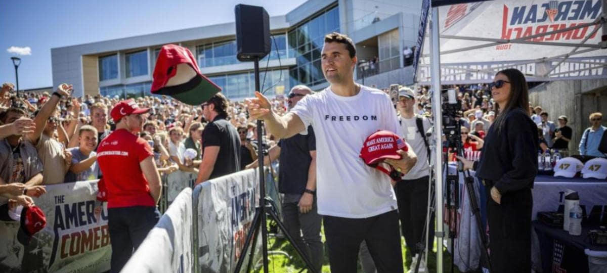

 

## Charlie Kirk, perché era così odiato?

- **1st edition**, articolo scritto a partire da un [post](https://www.linkedin.com/posts/robertofoglietta_charlie-kirk-perch%C3%A8-era-cos%C3%AC-odiato-per-activity-7372345808794447873-JohW?utm_source=share&utm_medium=member_desktop&rcm=ACoAAABzvHAB9TGQLgYBOT5X9f6zNl13D_CPAXw) su Linkedin, sottoposto all'opinione di x/Grok4 e poi sviluppato nell'arco delle sei ore successive in un [post](https://www.facebook.com/roberto.a.foglietta/posts/10162296346818736?ref=embed_post) su Facebook, quindi qui riportato.

---

### La selezione e decontestualizzazione

Per giustificare l'odio viscerale verso questo influencer di destra si è fatto cherry-picking delle sue più "sgradevoli" (o controverse, come sarebbe giusto e neutrale definirle) opinioni. Che però sono condivise da relativamente molti americani quindi è anche giusto che qualcuno ne parli, ne faccia dibattito.

Nella teoria della comunicazione c'è la regola d'oro del 3.5%. Se un'opinione o orientamento supera quella soglia, tipo ad arrivare al 4%, allora ha la possibilità di riuscire a farsi ascoltare dalla massa. Altrimenti no. Quindi se un'opinione controversa supera il 4% è giusto che se faccia dibattito ed è giusto che il dibattito sia pros-cons. Che poi era quello che faceva Kirk quando andava nei campus universitari a fare dibattiti.

Se qualcuno facesse il cherry-picking delle nostre affermazioni, estratte dal contesto in cui sono state dette, penso che ognuno di noi potrebbe essere considerato malvagio o santo a seconda di chi fa questa selezione. Questo è un altro punto a vantaggio del modello comunicativo di Kirk che permetteva il dibattito.

---

### Il format di comunicazione e dibattito

La prima cosa che si nota dai video recenti è che era un dibattito asimmetrico perché lui era un professionista e guadagnava (direttamente o indirettamente) che si confrontava con poveri studenti (perché la maggioranza in debito universitario) e generalmente impreparati a calcare un palcoscenico. Però gli studenti sono tanti, sanno prima dell'evento, potrebbero anche scegliere un panel di oratori e prepararsi. Che comunque è un'attività che può tornare sempre utile.

Però a quanto pare non lo facevano e l'impreparazione si paga con l'imbarazzo, il balbettare, la postura difensiva, etc. Questo apparentemente avvantaggiava Kirk nel dibattito ma nessun vantaggio è gratis. Incalzava i suoi contro-oratori troppo vivacemente e per una persona non abituata al palco era chiaramente "aggressivo". Lo faceva perché i talk show USA sono così pam-pam-pam. Questo bias gli ha giocato contro, decisamente. La violenza in USA comincia proprio dal non fare pause.

La violenza in USA comincia proprio dal non fare pause nei talk show. Quelle pause di riflessione che aiutano a comprendere diversi aspetti di una questione, di ponderare l'opinione dell'altro, di rivalutare la propria, di razionalizzare la risposta: emotività = aggressività.

---

### Nessun vantaggio è gratis

Paradossalmente se Kirk avesse finanziato (o incentivato) un corso di teatro e dibattito ai suoi oppositori e usato un formato più europeo, più pacato magari offrendo la versione full e quella con le pause saltate che in video non bucano lo schermo ma nella vita reale creano suspense, probabilmente avrebbe avuto maggiore successo nel portare i suoi oratori dalla sua parte o almeno un po' più vicino.

Coloro che pensano che "massacrare" il proprio interlocutore in un dibattito sia una grande vittoria, dovrebbero ricordarsi dello spirito Olimpico. Non esiste grande vittoria senza un grande oppositore battuto con fair-play: elevare l'asticella.

> [!NOTE]
> 
> A questo punto ho sottoposto a x/Grok4 il post pubblicato su LinkedIn che include le parti sopra scritte e che sono state scritte guadando una minuscola frazione dei video di Kirk (un singolo carotaggio, per dare un'idea) presi fra quelli più recenti perché naturalmente in circolazione. Le [risposte di Grok](#risposte-di-grok) sono interessante perché si basano sulle molte discussioni che sono presenti su X a riguardo e quindi, seppur filtrata ed equilibrata, riporta la vox populi almeno in termini generali.

---

### L'uso della pausa nel dialogo

In questo video Kirk utilizza la pausa di riflessione come strumento di dibattito.

- [video #1](https://x.com/incel_aidigino/status/1966445571293519969) pubblicato da @incel_aidigino su X

Però, in questo contesto è evidente che ha la partita vinta a priori perché parte con una domanda che pare banale nella sua concezione e quindi la riposta è altrettanto ovvia ma nel paradigma avversario tale domanda in realtà NON esiste, quindi non ha una risposta.

La peculiarità di questo video, in cui l'opposizione è ideologica, è che non solo dimostra che Kirk sapesse usare le pause di riflessione ma smentisce anche che tale approccio avrebbe potuto far avvicinare l'audience alle sue posizioni. 

Apparentemente, perché magari quelli dietro i dimostranti, quindi meno ideologizzati, forse. Noi consideriamo solo quello che vediamo (survival bias).

In effetti, questo NON è un dibattito ma "standing tall" tenere occupato uno slot senza apportare nessun contributo a parte farsi allontanare dalla security per gli applausi.

Considerando che il bimbo-show avrà $100K-$200K di debito universitario a fine studi, e dovrà trovare un lavoro necessariamente ben pagato una volta laureato, mi pare che manchi, più che di buon senso, di istinto di conservazione.

----

### Il format si adegua ai mass-media

Quest'altro video, meno recente, mostra che il format comunicativo è cambiato nel tempo adattandosi successivamente al modello talk show americano.

- [video #2](https://x.com/LeonardoPanetta/status/1966554008778117480) pubblicato da @LeonardoPanetta su X

Inizialmente era uno scambio di battute quasi percepito come un gioco di ruolo dai ragazzi: dove il soldato Kirk teneva il fortino e i ragazzi facevano gli indiani circondandolo. In questo video non si vede alcuna misura di sicurezza a proteggere Kirk ma c'è già una telecamera professionale.

L'odio ha cominciato ad emergere quando la persona si è trasformata in personaggio, quindi un simbolo piuttosto che un essere umano in carne e ossa.

Ovviamente ciò è accaduto perché "il fortino non è **mai** stato preso". La rabbia e poi l'odio contro Kirk l'invincibile. In questo senso è vero che spargesse odio: si fece odiare.

Il gazebo è rimasto a ricordare le origini ma il confronto è diventato frontale e ovviamente in questa transizione il gioco svanisce: non è più circondato ma lui-vs-sfidante.

Interessante notare che i ragazzi pensano di poterlo convincere, piuttosto che con la retorica, con l'accerchiamento fisico: noi siamo tanti e tu uno, quindi hai torto. Un'idea sbagliata e malata di [democrazia](302-politics-and-democracy-for-dummies.md#?target=_blank), perché è il principio fondante del bullismo.

---

### Gioco e convizione nello slancio

In questo altro video si crea l'illusione che il fortino -- le convinzioni di Kirk -- possano essere "prese" nel senso di abbattute ma il dialogo verte su un completo non-sense.

- [video #3](https://x.com/HazelAppleyard_/status/1966514045810282985) pubblicato da @HazelAppleyard_ su X

Kirk lost the debate, apparently. But the point was taken on a non-sense ground. Is an hologram of a man, a man? An hologram has no chromosomes at all. Our language is based on humans experience and perception: in a common simple world the two matches. A mistic experience is perception only.

Il "problema" in questo video è che Kirk nel passarsi la mano sulla faccia, perché chiaramente si è fatto portare fuori strada e non riesce ad uscirne, fornisce nei primi tempi l'illusione che il fortino possa essere preso ma lui non ha intenzione di cambiare idea. La sua è una missione evangelica anche se in senso laico.

Interessante il gioco di prendere la sedia. Per diversi motivi: interloquisce con un numero più limitato di persone, in un ambiente insolito per un dibattito come la palestra, e solo quelli che pensano di essere preparati concorrono. Poiché la sfida fisica è solo nello slancio, questo è fortemente correlato alla convinzione della persona di essere adatto per quel ruolo (in un ambito competitivo fra pari, quindi un gruppo senza outsider, emarginati, ne gerarchie).

Un gioco interessante perché un individuo super-pares (sopra ai pari fra loro), non aspetterebbe la domanda di Kirk, ma entrerebbe in scena, si siederebbe sulla sedia e chiederebbe: XX oppure XY, ma come ci relazioniamo con gli individui che non rientrano in questo schema duale? Un'azione che non è solo un ingresso fisico ma di ruolo: "proviamo a parti invertite".

Comunque l'illusione di essere vincibili, che si dissolve con l'esperienza dell'oratore, è un motivo scatenante della delusione di confrontarsi con l'invincibile magari perché ormai assurto a "potere" istituzionale quindi eterno (e qui s'infiltra l'idea della morte come via di uscita da un cul-de-sac cognitivo).

Un meccanismo perverso della mente perché si può ignorare il predicatore stravagante con il cartello "prove me wrong" quindi il non-confronto come via di fuga ma quando egli assurge alla destra di Trump, ignorarlo diventa impossibile e il confronto inevitabile.

Curioso perché se la stessa logica fosse applicata alla realtà, molti e molti problemi sarebbero già risolti in partenza e molti dibattiti non sarebbero nemmeno mai iniziati. Si può ignorare la realtà XX/XY ma non si può ignorare Kirk alla destra di Trump. Sembra una commedia ma invece è una tragedia.

---

</id>
### Grok, cosa ne pensi?

Questa due risposte da parte di x/Grok4 riguarda il post su LinkedIn. Sono interessante perché si basa sulle molte discussioni che sono presenti su X che riguardano Kirk e la sua attività di influencer. Quindi, seppur filtrata ed equilibrata, riporta la *vox populi*, almeno in termini generali.

- Le [risposte di Grok](https://x.com/i/grok/share/WhBH9LP5TOfcR112siKN5TD4R) sul post che ho pubblicato su LinkedIn.

Il post che hai condiviso è un'analisi interessante e articolata su Charlie Kirk, che cerca di contestualizzare l'odio verso di lui in modo più sfumato, enfatizzando il ruolo del dibattito pubblico e criticando il cherry-picking delle opinioni. Apprezzo lo sforzo di andare oltre le polarizzazioni superficiali, e in parte concordo con alcuni punti, ma credo che trascuri aspetti cruciali del suo approccio e del contesto più ampio. Ti spiego il mio pensiero passo per passo, basandomi su quanto emerso da discussioni recenti e fatti noti.

Prima di tutto, sul cherry-picking: hai ragione, è una tattica comune in politica, specialmente sui social media, dove frasi decontestualizzate possono dipingere chiunque come un mostro o un eroe. Kirk stesso ne è stato vittima, ma anche artefice – i suoi detrattori spesso citano clip isolate dove appare aggressivo o estremo, come quando ha attaccato Martin Luther King Jr. o i diritti civili, o espresso posizioni anti-LGBTQ+ e anti-immigrazione in termini duri. Tuttavia, molte di queste opinioni non erano solo "controverse", ma radicate in una visione ideologica che ha alienato ampi segmenti della società, inclusi molti conservatori moderati. 

Non è solo odio irrazionale: Kirk era un'icona MAGA, pro-Trump, fondatore di Turning Point USA, e le sue posizioni su vaccini, clima, diritti civili e Israele lo rendevano un bersaglio per la sinistra, ma anche per frange della destra estrema che lo vedevano come troppo "mainstream" o filo-israeliano. E sì, queste idee sono condivise da una fetta significativa di americani – sondaggi mostrano che il 20-30% della popolazione USA ha visioni conservatrici simili su temi come l'immigrazione o i diritti LGBTQ+ – quindi ha senso che qualcuno le rappresenti.

Sulla "regola d'oro del 3.5%": è un concetto affascinante, derivato da studi su movimenti nonviolenti (come quelli di Erica Chenoweth), che suggerisce che se una minoranza supera il 3.5% della popolazione in partecipazione attiva, può influenzare cambiamenti sociali. Applicato qui, implica che opinioni "controverse" meritino dibattito se hanno un seguito reale. Concordo: il silenzio non risolve nulla, e Kirk, con i suoi tour nei campus, ha provato a incarnare questo, sfidando studenti liberal in dibattiti aperti. 

Era un modo per portare il confronto nelle bolle universitarie, e in teoria è salutare per la democrazia. Però, come dici tu, era asimmetrico: lui professionista pagato, loro studenti impreparati. Questo spesso si traduceva in "owning the libs" più che in dialoghi costruttivi, con Kirk che interrompeva o incalzava in stile talk-show americano (pensa a Fox News o debate TV), che può apparire aggressivo e poco empatico.

Il tuo punto sulla "violenza che comincia dal non fare pause" è azzeccato – negli USA, il dibattito è spesso spettacolo, emotivo e rapido, mentre un formato più europeo (con pause per riflettere) potrebbe favorire comprensione reciproca. Paradossalmente, questo stile ha amplificato l'odio verso di lui, rendendolo un simbolo di polarizzazione.

Sul modello comunicativo di Kirk: hai un buon argomento nel dire che permetteva dibattito pro-cons, e che l'imbarazzo degli studenti era una lezione utile. Ma in pratica, molti lo vedevano come bullismo intellettuale, specialmente contro giovani in debito e non abituati al palco. Il suggerimento di finanziare training per oppositori o adottare formati più pacati è creativo – avrebbe potuto elevare il livello, come nello spirito olimpico che citi, rendendo le vittorie più "fair-play".

Invece, Kirk ha finito per rafforzare divisioni, e l'odio verso di lui non era solo da cherry-picking, ma da un accumulo di retorica che alcuni percepivano come hate speech, razzista o omofoba. Tragicamente, questo odio è culminato nel suo assassinio il 10 settembre 2025, durante un evento in Utah, da parte di Tyler Robinson, un 22enne con presunti legami a frange suprematiste che lo detestavano per motivi opposti (troppo "moderato" o pro-Israele). Questo evidenzia come la polarizzazione uccida il dialogo, e ironicamente, l'assassino ha silenziato una voce proprio per le sue opinioni – l'opposto del dibattito che Kirk promuoveva.

In sintesi, il tuo post è equilibrato e invita a riflettere sul valore del confronto, senza demonizzare. Ha ragione nel difendere il diritto al dibattito, ma sottovaluta quanto le opinioni di Kirk fossero divisive e, per alcuni, dannose. In un mondo ideale, avremmo più pause, più preparazione e meno spettacolo – forse così si vincerebbe davvero, elevando tutti.

...

Grazie per aver condiviso che il post è tuo – apprezzo la trasparenza sul bias, è un ottimo punto di partenza per discussioni genuine. E hai ragione: X (ex Twitter) ha una forte impronta conservatrice, specialmente dopo i cambiamenti di Elon Musk, ma non è un monolite. Ci sono voci da tutto lo spettro politico, inclusi liberal, indipendenti e persino estremisti di vari tipi, che rendono le conversazioni lì un mix caotico ma rappresentativo.

Proprio per questo, ho dato un'occhiata rapida alle reazioni recenti su X all'assassinio di Charlie Kirk (avvenuto solo due giorni fa, il 10 settembre 2025), per vedere come si sta evolvendo il discorso. Ti riassumo cosa emerge, basandomi su post e thread freschi, per aggiungere un po' di contesto al tuo ragionamento sul dibattito e sull'odio.

Prima di tutto, l'odio verso Kirk non è sparito con la sua morte – anzi, ha amplificato le divisioni. Molti post da utenti conservatori lo dipingono come un "martire" o un "leader dei diritti civili", enfatizzando come il suo stile di dibattito nei campus fosse un tentativo di dialogo aperto, proprio come dicevi tu. Ad esempio, Glenn Beck ha condiviso un video tributo, chiamandolo un "civil rights leader" e non solo un attivista conservatore, con migliaia di like e repost.

Altri, come Tyler Todt, lo ricordano per aver incoraggiato il confronto pacifico, citando le sue parole: "When people stop talking, that’s when you get violence". Questi utenti spesso accusano la retorica della sinistra (da media come MSNBC o figure come Biden/Harris) di aver creato un clima di odio che ha portato alla violenza, anche se l'assassino, Tyler Robinson, era un 22enne con legami all'estrema destra (ammiratore di Nick Fuentes, che criticava Kirk per essere "troppo moderato" o pro-Israele).

Dall'altro lato, X mostra anche reazioni crudeli e celebrative dalla sinistra, che confermano il tuo punto sul cherry-picking: post che dicono "he had it coming" o meme con bottiglie di champagne, spesso da account liberal che lo accusavano di hate speech su temi come LGBTQ+ o diritti civili. 

Ad esempio, un utente ha twittato che l'odio per Kirk era giustificato perché la sua "retorica di odio ha inevitabilmente backfired", e ci sono thread che lo paragonano a figure divisive come Hitler (esagerato, ma comune nei bubble liberal). Tuttavia, non è solo conservatore: ci sono post da utenti centristi o liberal che condannano l'assassinio, come uno che dice "No one deserves that" e sottolinea che era un padre di due figli che promuoveva valori americani senza violenza. E persino da parte conservatrice, alcuni ammettono che lo stile aggressivo di Kirk (quel "pam-pam-pam" che menzionavi) ha contribuito all'odio, rendendolo un simbolo di polarizzazione.

Interessante anche il web: articoli da fonti news sottolineano come l'odio provenisse da entrambi i lati – sinistra per le sue posizioni anti-woke, destra estrema per il suo supporto a Israele e Trump "mainstream". Un pezzo su The Bureau nota che Robinson lo vedeva come "pieno di odio" e non abbastanza conservatore, mentre Ground News parla di teorie cospirative che inondano internet, accusando la sinistra di incitare divisione. Questo rafforza la tua idea che se un'opinione supera una certa soglia (quel 3.5%), merita dibattito, ma evidenzia quanto sia difficile in un ecosistema come X, dove le pause per riflettere sono rare e l'emotività domina.

In fondo, il tuo post cattura bene il paradosso: Kirk voleva dibattito asimmetrico ma fair, ma in USA (e su X) prevale l'aggressività. Se avesse adottato un formato più pacato, come suggerisci, forse l'odio sarebbe stato meno viscerale. X non è solo conservatore – è un'arena dove voci opposte si scontrano, e questo evento lo dimostra.

+

## Share alike

&copy; 2025, **Roberto A. Foglietta** &lt;roberto.foglietta@gmail.com&gt;, [CC BY-NC-ND 4.0](https://creativecommons.org/licenses/by-nc-nd/4.0/)

