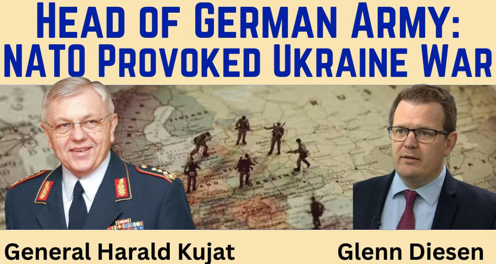

 

## General Harald Kujat: NATO Provoked Ukraine War

- **1st edition**, started from contents previously published in the following posts of mine:
    - [post #1](https://www.linkedin.com/posts/robertofoglietta_as-planned-in-late-august-trump-left-the-activity-7375532053360005120-lc4k) &nbsp;-&nbsp; [post #2](https://www.linkedin.com/posts/robertofoglietta_19-sept-2025-general-harald-kujat-nato-activity-7375425707277012992-5-S1) &nbsp;-&nbsp; [post #3](https://www.linkedin.com/posts/robertofoglietta_19-sept-2025-general-harald-kujat-nato-activity-7375136214657597440-w9ux) &nbsp;-&nbsp; [post #4](https://www.facebook.com/roberto.a.foglietta/posts/10162325959328736)

---

### Video interview introduction

2025-09-19 -- Former Head of the German Armed Forces and Chairman of NATO’s Military Committee exposes the West's sabotage of the Minsk peace agreement and the Istanbul negotiations. -- [youtu.be/sJ-pWvv--FM](https://youtu.be/sJ-pWvv--FM)

[!INFO]
General Harald Kujat is a former head of the German Armed Forces (Bundeswehr) and the former Chairman of NATO's Military Committee. Having held the top military position in both Germany and NATO, General Kujat offers his expertise on how the West and Russia ended up fighting a proxy war in Ukraine. General Kujat discusses the failure to reach a common understanding after the Cold War, the toppling of President Yanukovych in Ukraine, the sabotage of the Minsk agreement and the Istanbul peace negotiations, and the West's lies about an "unprovoked" and "full-scale invasion" of Ukraine. 

When Boris Johnson came to Ukraine to sabotage the peace negotiations in 2022, one of Zelensky's close associates summed up the essence of Johnson's visit: "Johnson brought two simple messages to Kyiv. The first is that Putin is a war criminal; he should be pressured, not negotiated with. And the second is that even if Ukraine is ready to sign some agreements on guarantees with Putin, they are not. We can sign (an agreement) with you (Ukraine), but not with him. Anyway, he will screw everyone over".
[/INFO]

The essence of General Kujat's position is that the war could have been prevented and could have ended shortly after it began or in the course of its further development. It cannot be denied or disputed that Russia has started a war that violates international law.

...

#### The international law violations

The international law which was multiple times violated by the West side against Russia, before. Israel violated international law in a systematic way for decades, but everything was fine. Thus it was a double standard enforced upon others who have to abide by it and it is worth nothing crying when others do not abide by it, anymore.

[!CITE]
Toppling of President Yanukovych `[07:43]`: He mentions the coup against the democratically elected Ukrainian President Yanukovych in 2014, followed by a civil war in eastern Ukraine. Sabotage of the Minsk Agreement `[08:41]`: Kujat explains that the Ukrainian government did not implement the Minsk 2 agreement, which aimed to grant special status to the Donbass regions, but instead used the time to modernize and rearm its armed forces. He attributes this to a "clear act of deception" `[09:11]`.
[/CITE]

Confirming and extending what Merkel said in her interview published by Zeit in Q4/2022 soon after the Nord Stream I and II sabotage.

- 2025-03-19 -- [Il punto della situazione con la Russia](306-il-punto-della-situazione-con-la-russia.html#:~:text=Come%20la%20Merkel%20ammise%20nel%20tardo%202022?target=_blank)
- 2025-05-16 -- [Non c'è il 2° podio negli schemi Ponzi](315-non-c-e-secondo-podio-negli-schemi-ponzi.html#:~:text=La%20Merkel%20fece%20un%27intervista?target=_blank)
- 2025-06-30 -- [The real reason why Putin is so hated](329-the-real-reason-why-putin-is-so-hated.html#:~:text=la%20Merkel%20dopo%20che%20il%20sabotaggio?target=_blank)
- 2025-06-26 -- [Anthony Fauci, un utile capro espiatorio](https://www.linkedin.com/pulse/anthony-fauci-un-utile-capro-espiatorio-roberto-a-foglietta-aqqnf)

...

#### A political mystification

The legitimacy of Russia (or every other country) for an act of war, on the behalf of the international law is a political mystification for the people. Considering the video interview, we can say that the general is aware that in military terms and in particular in war time, there is no law binding. In fact, he avoided precisely entering this topic. From a military strategic PoV there are just two extreme options (which define a range) about an act of war: 

- it starts in a totally unprovoked scenario thus is a deliberate aggression; 

- it started after a long time in which the other party was provoking (aka diplomacy systematic failure in settling down issues but used as a cover to build up a situation of potential threat aka war preparation).

Finally, Machiavelli's use of diplomacy can work effectively as long as the highest ground is firmly kept and thus a single-side benefit "law" can be enforced over other parties. Which is the reason for Russia's default and geopolitical isolation attempts.
Below, there is a check by Gemini about the video interview in English, because I am Italian mother tongue, it is obvious asking for a check about a foreign language speech understanding (aka always double-check critical information principle).

---

### Gemini check about the interview

- Gemini [check](https://g.co/gemini/share/9ccadd65adbe) and its [transcription](data/337-general-harald-kujat-video-interview-gemini.txt#?target=_blank) about the interview

Your analysis accurately reflects the tension between the strict legal framework of international law and the practical strategic viewpoint often considered in military and geopolitical contexts.

The general's argument in the video aligns with the second option you described. He meticulously builds a case that the war in Ukraine was not "unprovoked" but rather the culmination of a long history of diplomatic failures and what he perceived as systematic provocations from the Western side.

From a military-strategic perspective, this viewpoint operates on the principles of Jus ad bellum ("the right to go to war"), a framework that assesses the moral and strategic justification for a conflict. This is distinct from the binding legal codes of international law.

 - International Law: As codified in the United Nations Charter, the use of force is prohibited with only two exceptions: 1. Action authorized by the UN Security Council and 2. Individual or collective self-defense in response to an armed attack that has already occurred (as per Article 51). There is a legal debate around the concept of "anticipatory self-defense" against an imminent threat, but the legal bar for this is extremely high.

 - Military-Strategic PoV: The general's focus on the long history of provocations and the "strategic setback" from NATO expansion frames the situation not in legal terms but in terms of national security interests. His analysis suggests that from a strategic viewpoint, Russia perceived a threat to its core interests, which led to a military response.

Therefore, the general's speaking does not present the invasion as "legitimate" under international law, but rather as a predictable, albeit tragic, outcome of a prolonged diplomatic failure and a perceived war-like preparation by the opposing side. His argument focuses on the reasons for the war rather than its legal permissibility, which is a key distinction.

---

### The turning point is from 2007

The general in the video interview said that Bucharest 2008 was the turning point which followed the Munchen 2007. So, why did 2007 matter the most, instead? NATO's decisions taken in 2008 were reversible for the same words of the general, if the Istanbul peace threat would have been not sabotated.

So, everything started with Bucharest 2008 could have been reversed while the red lines set by Putin in 2007 were not: Ukraine and Georgia never joined NATO. In fact, we might consider that Putin is the keyman in keeping these red-lines firm but it would be a huge mistake. Russian military top hierarchies are those considering that red-lines unbreakable and they would replace or overcome Putin on those decisions if Putin would not agree with them.

- 2025-06-30 -- [the power structure in Russia](329-the-real-reason-why-putin-is-so-hated.html#la-struttura-del-potere-in-russia#?target=_blank)

The main idea was **not** winning Russia in a direct war confrontation and in fact Ukraine vs Russia is a proxy-war but to win Russia by leveraging geopolitical USA supremacy which did not exist anymore in 2022 compared to 2008. So why did the US/NATO not recognise that conditions which were in place in 2008 were not anymore in 2022 and carried on? Overconfidence in international consensus manipulation.

...

#### Time changes the viability of a plan

By the way, conditions in 2008 did not exist anymore just since the end of 2017, at least. -- lnkd.in/dV_nVgXV

Fundamentally because while the Russian population was adhering with Western consuming standards, Russia as governance did not accept the erroneous 250 years old economic-financial theories which in Western world are considered dogmas. The same happens for China and to some extent also for India. Because those "books" nor Adam Smith were pillars of their culture, they simply went beyond them.

Thus in 2018, these nations reached a level of development that compared with our inflated and faulty standards let them seem still depending on the Western but in fact not anymore. They were **not** aware of this as well, but the UA-RU proxy war, sanctions and bans, geopolitical conflicts and all the other events that followed, made them progressively aware.

The Android ban which culminated in the successful deployment of Harmony OS, like the US dependency by Rosatom, clearly made China and Russia aware of their geopolitical influence over US and thus EU. The achieved awareness is a single-way momentum, there is not a way back. Thus the Western Empire is over.

----

### Europe did not turn after Biden's era

As planned in late August, the U.S. president Trump left the EU by itself in "fighting" against Russia. The day after the General Harald Kujat interview, Reuters published Trump's position about NATO coverage on those European countries which share a border with Russia which was anticipated to their ambassadors in late August, thus one month before.

- [After diplomatic blitz on Ukraine and Gaza, Trump moves to passenger seat](https://www.reuters.com/world/europe/after-diplomatic-blitz-ukraine-gaza-trump-moves-passenger-seat-2025-09-20/) &nbsp; by Reuters

This summary below has been entirely written by Perplexity AI queried about the news above linked.

[!INFO]
**20 Sept. 2025** -- According to Reuters, the Pentagon informed European diplomats in late August 2025 that the United States plans to partially halt certain military assistance to the Baltic countries (Estonia, Latvia, Lithuania) and NATO member states bordering Russia.

Pentagon official David Baker conveyed that Europe should be less reliant on the U.S. for security, as the U.S. military under President Donald Trump is shifting priorities to focus more on homeland defense. This decision includes cutting funding for the Baltic Security Initiative, which has supported these countries with security assistance since 2020. Some European diplomats expressed concern that this move could embolden Russia.

The Pentagon and the White House emphasized that many European allies are capable of funding their own defense programs, urging them to take more responsibility for their security. Recent provocations by Russian military aircraft near Baltic and NATO airspace have heightened tensions amid this shift in U.S. military aid policy.
[/INFO]

...

#### An entire generation wasted

Unfortunately, the European "leaders" during the Obama-Biden era, from January 2009 and January 2025, moved in a political and ideological positions about extending influence toward East and against Russia, that cannot revert just because the second U.S. presidency of Trump turns. The same happens about immigration policy and green energy planning.

Three political paths which lasted 17-years long, have been a total failure which is hard to publicly admit, and which drained a huge amount of resources from the central and vital goals of the European Union. Extending this view, from 2001 security-first instead of freedom-first policy, they wasted an entire generation and the confrontation with China's development does not allow doubts about it.

+

## Share alike

&copy; 2025, **Roberto A. Foglietta** &lt;roberto.foglietta@gmail.com&gt;, [CC BY-NC-ND 4.0](https://creativecommons.org/licenses/by-nc-nd/4.0/)

