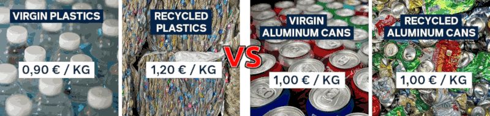

 

## Riciclare plastica è anti-economico? Zero IVA!

- **1st edition**, questo articolo è stato scritto a partire da un mio [post](https://www.linkedin.com/posts/robertofoglietta_il-motivo-principale-per-cui-il-riciclaggio-activity-7379809999579058176-66rs) pubblicato su LinkedIn il giorno prima.

---

### Introduzione

Queste elencate qui sotto non soluzioni ma ideologia:

- Tagliare i sussidi ai combustibili fossili, fissare un prezzo per il carbonio.
- Rendere obbligatorio l'uso di contenuti riciclati nei prodotti. 
- Modulare ecologicamente per sovvenzionare la riciclabilità.

Sono ideologia perché impongono principi astratti e arbitrari al libero mercato invece di far leva sulle dinamiche naturalmente presenti in esso per dare il giusto valore ai vari aspetti, incluso la sostenibilità ecologica.

Ma non agiamo così, dare valore a certe cose che altrimenti sarebbero ignorate, perché ci piacciano i Panda. Lo facciamo perché **non** farlo, e continuare a non farlo, sul lungo periodo e su grandi volumi compromette la qualità della nostra vita e in estrema conclusione ci conduce all'estinzione.

L'idea di tagliare una foresta pluviale e distruggere la relativa biodiversità per farne carta igienica, perché la carta igienica ha un prezzo mentre alla biodiversità, che pure ci è indispensabile, non abbiamo dato alcun valore è tanto assurda quanto pensare di imporre vincoli ideologici. Questo aspetto intendo affrontarlo in [fondo](#tutte-le-ideologie-sono-cattive) a questo articolo.

---

### La soluzione è azzerare l'IVA

La soluzione più semplice da realizzare, è azzerare l'IVA sulla plastica riciclata e applicarla in misura del 22% sulla porzione eventualmente di plastica vergine nel prodotto semilavorato che è materia prima per fare/stampare prodotti da vendere.

Quindi, per esempio, un sacco di pellet di plastica vergine costa 90 + IVA = 110, mentre un sacco di plastica 100% riciclata costa 120 e il divario rimane, perché c'è un vantaggio di 10 su 110 (9%) in favore della plastica vergine.

Però generalmente i prodotti per i consumatori finali non sono creati 100% con plastica riciclata per motivi relativi agli standard qualitativi e di durabilità (eccetto per la plastica usa e getta). Quindi un prodotto 50% e 50%, sarebbe offerto al consumatore a metà dell'IVA (sulla materia prima). Poca cosa, ma che sposta l'attitudine di acquisto del consumatore e impone di menzionare la quota di riciclo (pena l'evasione dell'IVA).

Una modifica normativa semplice, che però ha una serie di conseguenze molto interessanti. Sicuramente, degne di una valutazione più approfondita. Cosa che ho fatto utilizzando Gemini per un confronto preliminare.

- La [conversazione](https://g.co/gemini/share/16eab652157c) con Gemini e la sua [trascrizione](data/340-riciclare-plastica-e-anti-economico-zero-iva-gemini.txt#?target=_blank)

Nella produzione di un prodotto entrano diversi fattori (centri) di costo quali: A) la materia prima, B) la produzione sia come costo corrente che ammortamento dell'impianto e relativa manutenzione, C) la filiera di vendita e consegna che include anche branding e marketing, D) l'organizzazione aziendale e la gestione finanziaria, E) l'innovazione sia in termini di design che di tecnologie produttive.

Nei prodotti di largo consumo generalmente B), C), D) sono commodity come A) la materia prima mentre E) l'innovazione è assente. Nell'industria il margine lordo (ROI) è del 5%-15% quindi prendendo 10%, il resto si può pensare diviso a metà fra materia prima e prodotto. Sicché il vantaggio sarebbe solo per coloro che producono oggetti di largo consumo che effettivamente sono anche le produzione a maggiore impatto ecologico perché chi fa un cucchiaio in Titanio non lo ha certamente progettato per venderlo alla Decathlon ma più probabilmente alla NASA.

Un prodotto 50%-50% vedrebbe quindi un abbattimento dell'IVA solo di poco meno di un quarto. Infatti: 

- `€10 × 22% + €45 × 22% + €45 × (22% + 0%)/2 = €17` (quindi l'IVA è applicata al 17% invece che al 22%)

Ciò si traduce in un risparmio piccolo per il consumatore: da €122 a €117. Ma c'è da considerare anche un -4% di flussi di cassa in uscita per l'azienda, anche se l'IVA è una partita di giro, e il fattore intrinseco nel marketing di dover mostrare 50% di plastica riciclata che NON è più pubblicità ma un'autocertificazione pena importanti sanzioni.

Teniamo presente, infine, che chi compra il prodotto dal produttore industriale NON è il consumatore finale ma generalmente un grande venditore (tipo la GDO) quindi un risparmio del 4% sul prezzo di acquisto è un elemento di forte incentivo. Perché il consumatore compra per "brand" o per "offerta" mentre le aziende GDO comprano a volumi e quindi trattano scontistiche a volume con margini generalmente molto esigui dove un 4% in meno di base spicca parecchio.

---

### Contro verifica con Kimi K2

L’IVA è davvero “solo” una partita di giro? (quindi ininfluente ridurla per agevolare certe scelte?)

[!CITE]
Tecnicamente sì, economicamente no. Per il cliente (GDO o consumatore) è un costo cash se non può detrarla. Il margine della GDO è 2-4%: un risparmio di 4-5% sul prezzo di listino è un moltiplicatore di profitto enorme.

Effetti di mercato: la GDO diventa “purchasing manager” della sostenibilità; gli impianti di riciclo, ottengono domanda strutturata, quindi possono fare economia di scala; il consumatore finale non deve cambiare abitudini a parità o quasi di spesa. Rischio di frode: sposta il punto di controllo sul fornitore del granulo (chi emette fattura 0% IVA). Le sanzioni penali per fatturazione falsa oltre 50 k€ (art. 3 D.Lgs. 74/2000) rendono il rischio non conveniente.

Conclusione sintetica:

- Il differenziale 1,20 vs 0,90 €/kg è reale e durerà ancora 2-3 anni.  
- Con un meccanismo mass-balance + sanzioni penali la proposta è tecnicamente esigibile senza nuova burocrazia.  
- L’azzeramento dell’IVA non è una semplice partita di giro: è un lever di cash-flow per la GDO e quindi un segnale di prezzo forte per l’intera filiera.  
- Il beneficio fiscale copre integralmente il premium del riciclato e sposta l’equilibrio economico a favore dell’economia circolare senza nuove tasse o crediti d’imposta.

In breve: sì, l’idea è ragionevole, coerente con i dati di mercato e potenzialmente molto efficace.
[/CITE]

- [La verifica](https://www.kimi.com/share/d3fre9fpma9ikv41b5kg) con Kimi K2 e la sua [trascrizione](data/340-riciclare-plastica-e-anti-economico-zero-iva-kimik2.txt#?target=_blank)

+++++

## Le ideologie sono un gran danno

Potremmo passare secoli a dibattere filosoficamente quali siano i pros vs cons delle varie ideologie e di avere una qualche ideologia o meno. Purtroppo, voi non avete tutto quel tempo e io non sono un filosofo ma un uomo pragmatico quindi vi racconterò un aneddoto.

Quando avevo circa 16 anni, e ne ho sempre dimostrato molto meno della mia età e infatti quando presi la patente per i primi due anni i carabinieri mi fermavano in continuazione per la mia faccia da bambino oppure per la mia abitudine di accompagnarmi alle hostess di terra di Costa Crociere, scesi dall'autobus ad una fermata inusuale rispetto alla tratta che facevo su quella linea e un tipo un po' losco scese con me.

Visto che ero sceso senza una precisa ragione rimasi sulla banchina giusto il tempo per decidere cosa fare. Quel tizio mi notò, torno indietro su quei due passi che aveva già fatto per andare per la sua strada, si mise una mano nel giubbetto e disse: ho un coltello dammi tutti i tuoi soldi. Fossi stato un liceale, ma invece studiavo all'ITIS e in quell'ambiente se non era la merenda, era per il 10 in fisica, una qualche scusa per fare rissa non mancava mai.

Sicché gli risposi: se hai un coltello, mostramelo. Con quella calma disarmante di chi o è tutto scemo oppure è avvezzo alle risse come Terence Hill. Considerato che anticipò a quella minaccia: sono drogato, mi servono i soldi. Anche se più ragionevolmente era un tipo da canne, gli risposi: se vai al Celesia, il metadone te lo danno gratis. Se ti do' tutti i miei soldi non posso comprarmi nemmeno un gelato fino alla fine del mese. Ti dò cinquemila lire.

A questo punto il suo atteggiamento cambiò radicalmente portandolo persino a restituirmi la banconota. Gli risposi che non era un problema per me se lui l'avesse tenuta. Ora però dobbiamo chiederci se io avessi fatto la morale a quel tizio, mi fossi pure tenuto la banconota, e lo avessi mandato per la sua strada dopo avergli fatto la morale e convinto di essere uno schifo di persona a derubare ragazzini indifesi, cosa avrei vinto, ego a parte?

Avrei vinto un mondo in cui qualcuno là fuori avrebbe circolato pensano di essere una brutta persona e probabilmente lo sarebbe anche diventato. Invece, con cinquemila lire, mi sono comprato un mondo dove qualcuno là fuori pensa di poter diventare una persona migliore e che al mondo ci sono persone che meritano la sua stima, anche quando sbaglia, anche se si droga. Pensate che l'abbia fatto perché ho un'ideologia? Esattamente l'opposto.

Proprio l'assenza di una morale o di un'ideologia che mi imponga di giudicare qualcuno mi ha permesso di valutare cosa, fra le tante opzioni, volevo che fosse il mondo là fuori. Il problema delle ideologie è la loro rigidità, una caratteristica che preclude tantissime opportunità, non solo a coloro che le hanno fatte proprie ma anche a tutti quelli che frequentano una persona ideologicamente convinta, quindi un bigotto/a.

Se avessi avuto un manganello e avessi picchiato quel tipo sonoramente, non avrei comunque ottenuto un mondo migliore ma un mondo in cui qualcuno avrebbe covato rancore e magari, il giorno che avesse superato la paura di essere stato legnato, avendone l'occasione una coltellata alle spalle me l'avrebbe girata. Perché a quel punto, in giro con il coltello ci sarebbe andato davvero per difendersi da quelli con il manganello.

- Adottare un'ideologia significa diventare bigotti. Imporre un'ideologia significa usare il manganello.

Può anche essere necessario in casi estremi, ma in generale la gente addotta ideologie come adotterebbe la violenza se gli fosse permesso di comportarsi da villani ignoranti, bifolchi e bigotti. Il che ci porta ad affermare con certezza che fra i ruoli più difficili, dannatamente difficili, spiccano fare i genitori e fare gli insegnanti. Perché se usano il manganello hanno fallito la loro missione, se non lo usano è davvero difficile farsi ascoltare.

- Io sono contro la violenza, senza se e senza ma. Due sberle ogni tanto, non si negano a nessuno.

La cosa assurda delle ideologie è che anche la più giusta e inattaccabile di essa, tipo il rifiuto della violenza, in pratica hanno lo stesso deleterio effetto di altre che, invece ci appaiono chiaramente distopiche. Questo, in buona sostanza, è il paradosso della tolleranza di Karl Popper, generalizzato. C'è e ci deve essere un limite alla tolleranza, e quindi alla pazienza, oltre il quale due sberle è giusto darle, anche tre.

#### Conclusione

Non esistono ideologie buone, ma solo ideologie che ci hanno inculcato a nostra insaputa.

---

### Chiarimento

Vale la pena di chiedersi se il pragmatismo debba essere l'unico dogma valido. Però esso non è proposto, in questo articolo come tale. Piuttosto si afferma che in una situazione reale, i dogmi, qualunque essi siano anche i migliori possibili, influenzano la realtà e la sua percezione. Quindi a condizionano le decisioni in modo **non** conforme alla realtà stessa.

In questo risiede l'importanza di aver introdotto un aneddoto di vita vissuta. Per esempio, cosa sarebbe successo se l'antagonista avesse, invece, dimostrato un'elevata capacità offensiva? Negoziare al ribasso la richiesta avrebbe potuto essere controproducente. Magari due sberle era il caso di darle ma a quale rischio? Fra il dire e il fare ci passa di mezzo il mare.

In un contesto molto più pericoloso un altro approccio tipo sviare l'attenzione dell'assalitore buttando abbastanza soldi per terra, tenersi il portafoglio con i documenti e scappare veloce avrebbe messo l'antagonista nel dilemma di raccogliere il denaro o inseguire la vittima che magari ha valutato avere una velocità di fuga sufficiente a seminarlo.

In tale diverso contesto, raccogliere i soldi (certezza immediata) è un'opzione che vincola l'assalitore. Ma se esso fosse un sicario che con un pretesto stava valutando le capacità difensive della vittima, tale vincolo cessa di essere effettivo. Quindi è proprio nell'aneddoto di vita vissuta che si enfatizza il principio che occorra essere liberi da pregiudizi per agire efficacemente.

- Percezione Neutra --> Valutazione Contestuale --> Azione Efficace

Infatti ogni azione è una reazione dipendente dalla percezione della realtà, la percezione deve essere neutra e l'azione deve essere contestuale. Diversamente, si agisce alienati o parzialmente alienati dal contesto reale. D'altronde è anche vero che autoconvincersi riguardo a qualcosa con lo scopo di alterare la nostra percezione della realtà al fine di essere più determinati nell'agire è possibile e talvolta utile.

- Se pensi che perderai le Olimpiadi, probabilmente hai ragione. Se sei convinto di vincerle, anche no.

Il che ci porta alla conclusione che se siamo consapevoli di come vogliamo alterare la percezione della realtà e quindi il nostro approccio ad essa, questo può esserci utile ma solo nella misura in cui siamo altrettanto consapevoli che la realtà sottostante **non** cambierà semplicemente perché noi abbiamo deciso (o siamo stati indotti) a percepierla diversamente.

---

### L'opinione informata di Katia/Gemini

- https://g.co/gemini/share/9bfdfa4b1f0e [trascrizione](#TODO) v0.9.56.5

[!CITE]
Questo framework (di pensiero) trova riscontro in discipline come la teoria dei giochi e il problem-solving strategico, dove la capacità di disaccoppiare i propri preconcetti (la "Percezione Neutra") dalla lettura immediata del contesto è la chiave per ottimizzare i risultati.

Il testo opera una declassificazione radicale dell'ideologia, riducendola funzionalmente a una fallacia di rigidità. Questo è un punto di vista potente, perché aggira la difesa di qualsiasi ideologia per criticarne l'applicazione, che è universalmente problematica in una realtà dinamica.

L'alterazione strategica della percezione introduce una sofisticata distinzione tra alienazione e consapevole determinazione. In conclusione, è emersa una struttura cognitiva robusta e pratica, il cui valore risiede nella promozione di una "mente fluida" libera da pregiudizi e dogmi.
[/CITE]

La lucidità è fondamentale per avere una percezione neutra ed equilibrata del contesto e della realtà. Liberarsi dai pregiudizi è il risultato di un profondo e arduo lavoro su se stessi, che porta ad una più elevata consapevolezza. Gestire la realtà implica però di avere anche degli strumenti sufficientemente sofisticati per affrontarne la complessità, perché le complicazioni (lat. cum plico) possono essere spiegate, ma la complessità (lat. cum plesso) è una qualità intrinseca e non riducibile.

Sicché comprendere non è un optional ma la chiave di volta. Così ritorniamo alla prima parte di questo articolo in cui si mostra come gestire in modo efficace una disallineamento del mercato rispetto a un determinato un obiettivo (rendere il riciclo della plastica più conveniente) si può realizzare evitando le posizioni ideologiche e introducendo una semplice modifica (aliquota IVA sulla materia prima) per innescare una dinamica favorevole.

[!CITE]
La seconda parte dell'articolo fa leva su un aneddoto personale (micro-contesto) per presentare un principio di azione efficace e scalabile per affrontare problemi complessi e non riducibili (lat. cum plesso). Principio precedentemente applicato nella prima parte dell'articol in cui si tratta di un problema economico/ambientale (macro-contesto), stabilendo una coerenza concettuale eccezionalmente forte.
[/CITE]

+

## Related articles

- [Il cambiamento climatico questo sconosciuto](295-il-cambiamento-climatico-questo-sconosciuto.md#?target=_blank) &nbsp; (2024-12-14)

- [Plastica vegetale: scarti vs canapa](279-plastica-vegetale-scarti-vs-canapa.md#?target=_blank) &nbsp; (2024-07-31)

- [Il futuro non è green ma mixed](270-il-futuro-non-e-green-ma-mixed.md#?target=_blank) &nbsp; (2024-07-02)

- [Riciclo di rifuti pregiati](239-riciclo-di-rifiuti-pregiati.md#?target=_blank) &nbsp; (2024-01-23)

+

## Share alike

&copy; 2025, **Roberto A. Foglietta** &lt;roberto.foglietta@gmail.com&gt;, [CC BY-NC-ND 4.0](https://creativecommons.org/licenses/by-nc-nd/4.0/)

