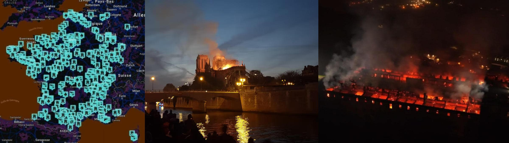

 

## The first Secular Crusade theory

- **1st edition**, article writen starting from these post of mines: &nbsp; [part #0](https://www.linkedin.com/posts/robertofoglietta_is-the-resentment-against-church-spreading-activity-7383577726642806785-V_3w) &nbsp; [part #1](https://www.linkedin.com/posts/robertofoglietta_12-ottobre-2025-lecco-a-fuoco-lo-storico-activity-7383562752730157057-id9W) &nbsp; [part #2](https://www.linkedin.com/posts/robertofoglietta_12-ottobre-2025-lecco-a-fuoco-lo-storico-activity-7383590772052398080-8I-1)

[!INFO]
12 ottobre 2025 -- Lecco, a fuoco lo storico Monastero di Bernaga. Qui San Carlo Acutis ricevette la prima comunione. 22 monache di clausura evacuate. Fortunatamente, nessuna di loro è rimasta ferita. Il monastero delle Romite ambrosiane ha subito danni importanti. Intervenute nove squadre dei vigili del fuoco. Il rogo sarebbe partito da una camera, si sospetta un corto-circuito elettrico. -- [RAI news](https://www.rainews.it/articoli/2025/10/lecco-a-fuoco-lo-storico-monastero-di-bernaga-qui-san-carlo-acutis-ricevette-la-prima-comunione-e84e7bf9-96dc-4d25-b33d-4579545de11f.html)
[/INFO]

[!INFO]
5 marzo 2022 -- Cristianofobia in Francia, lo scorso anno 857 casi. Resta stabile il numero di atti anti-cristiani in Francia, che conta in totale nello scorso anno quasi 1700 atti anti-religiosi. Il Paese della laicitè ostile ad ogni fede. -- [ACI stampa](https://www.acistampa.com/story/19251/cristianofobia-in-francia-lo-scorso-anno-857-casi-19251)
[/INFO]

Attached is a map of events against ecclesiastical property and clergy. Also attached is a non-exhaustive list of events and motivations created with the Perplexity AI support. Gemini, what do you think about this trend?

- The news [collection](data/344-the-first-secular-crusade-theory-perplexity.txt#?target=_blank) by Perplexity AI and the Gemini chat [transcription](data/344-the-first-secular-crusade-theory-gemini.txt#?target=_blank).

---

### Is the resentment against Church spreading?

By a cultural strong bias, every act against the church unless publicly executed or vindicated falls into the "incident" category. Until investigations reveal another story, at least. However, because of the same bias above, finding a guilty/reason would not lead to a public opinion debate, usually.

- Or, when it happens, it is because of a psychiatric disorder or a mental issue, like in France.

Guess what? A psychiatric disorder usually is the result of an abuse in childhood or early adolescence while the "mental issue" is the category of those who fall into it because otherwise they can prove systematic abuses perpetrated by clergy.

Do not trust my words, just keep this scenario in consideration: what if it is true? Unsurprisingly, French people's reaction is quite hard but also understandable. 

- Not legit, nor legal, somehow reasonable, and fully understandable.

When someone has been a victimin of violence (or injust persecution) and instead of being protected justice is trying to put him/her down then just two options remains: one in extreme leads to suicide, the other one in extreme leads to homicide.

Therefore, it is BOLD to classify this phenomenon as anti-christianity trend even if few cases certainly fall in this category. In my opinion a more realistic and functional way to describe it, is: the first anti-church crusade. A crusade emerged from the people who were exposed to christianity but they aren't fighting against it, rather than the Church as the corpus.

A sentiment which is understandable and totally rational: fighting against the corpus which supports predators, enforcing the social stigma or marginalization of testimony and/or truth-seekers, and persecuting victims as the victims were to blame: they haven't been beaten enough, yet.

Clearly, persecuting the victimis is the best strategy to experience a strong Karma negative feedback.Because soon or later, also the most peaceful person will turn hangry and seek revenge when justice isn't available. Which is the main reason because law and rights are in place, a civil manner to settle disputes.

#### Conclusion

- Once the light of reason has set, arsons make light in the dark.

---

### The best critique deserves an answer

> Lack of coordination as the main points against the crusade hypothesis.

This is a good critique that deserves a precise and factual answer: CIA's Simple Sabotage Field Manual, declassified and published in 2008. From that manual, the best sabotaging strategy (aka crusade) is avoid facing the enemy which has the protection of the authorities in power and rely on a disorganised jeopardising violence with unpredictable patterns and as often as possible deceived as "incidents" (aka plausible deniability).

- In a few words: expect us, we are a legion (of ghosts in the dark).

Moreover, the "ghosts in the dark" wood is a thematic and recurrent play game (at night, obviously) which is performed in the early scout training by AGESCI which is the Catholic association of scouts related to the Church. That gameplay is the most effective way to provide an on-the-field immediate self-organisation of a small group of young scouts lost in a wood at night facing a scary threat (ghosts in the dark).

Usually, the younger adult of the rangers closes the end of the track intercepting young scouts fleeing back to the camp and to support their quest. Obviously, once I was in that position, dispensing offensive tactics to youngsters that made Rangers who were running at the camp complaining that it was not a fair game. In deploying an attack, a balanced fair fight means a lack of preparation, strategy or a tactic failure.

- `echo "die hard, die once" | sed s/die/fight/g` -- Sun Tzu, docet.

Humans shall not divide whom God united. In sending against me "your" best ghosts, you silly men have reunited my legion around me! 😁 

---

### Why it took so long?

- When we see the iceberg, it is too late.

Put in this scenario that being socially emarginate just means being young from a poor family (working class), being fragile implies being sensitive, which implies a high-level of emotional IQ which in normal condition (no abusing condition) leads to high-rate learning (curiosity for others, including what others did, which includes science, art and literature) which leads to high IQ passing test because such a test is a mix of knowledge and social fit not bare brain power.

Therefore the most exposed to being abuse are the leaders of tomorrow raised from the peripheral of the society (social elevator, paradigms fluidity, innovation, etc.) and despite relatively few are abused, the abusing attitude and the sense of injustice corroborated by the sense of impotence, is spread among others that develops the "not to me" attitude which brings to the idea that it is better to be the abuser rather than its victim. The 1971 fake Stanford Prison experiment, docet.

+

## Related articles

- **ChatGPT vs Paolo Benanti** del 2024-11-21, aggiornato con [la conclusione](https://robang74.github.io/chatbots-for-fun/html/chatgpt-vs-paolo-benanti.html#conclusione) &nbsp; (2025-10-13) 

+++++

## Share alike

&copy; 2025, **Roberto A. Foglietta** &lt;roberto.foglietta@gmail.com&gt;, [CC BY-NC-ND 4.0](https://creativecommons.org/licenses/by-nc-nd/4.0/)

