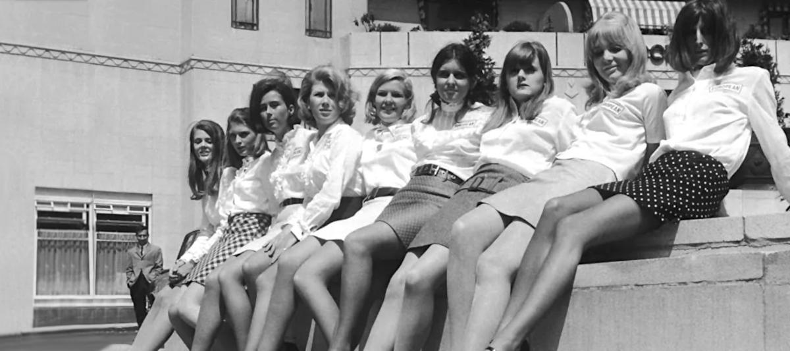

 

## Dal femminismo tossico alla follia woke

**1st edition**, articolo scritto a partire da questo [po](https://www.linkedin.com/posts/robertofoglietta_dal-femminismo-tossico-allideologia-woke-activity-7384076149494099968-dLI2)[st](https://www.facebook.com/roberto.a.foglietta/posts/10162444868733736) pubblicato su LinkedIn e Facebook, lo stesso giorno.

---

Perché il femminismo che dovrebbe essere un movimento di emancipazione della femmina dal patriarcato (e non un'ideologia) è diventato tossico fino a trasformarsi nell'ideologia/follia woke?

Partiamo dall'inizio. Le donne hanno cominciato ad emanciparsi durante la WW2 quando per mancanza di personale maschile venivano assunte per ricoprire ruoli prima relegati al maschile (bread-winner).

Fra queste e in questa peculiare condizione di sistematica mancanza di uomini di "forte e robusta costituzione" perché mandati al fronte, quelle più di successo furono proprio quelle che riuscirono a fare bene lavori che davvero erano "al maschile" culturalmente, tipo il meccanico di spitfire per i militari (come fece la Regina Elisabetta, da cui il mito della protagonista del Titanic che ricorda le foto con l'aeroplano).

Ma esattamente quando il femminismo divenne tossico? Le donne che si sono emancipate durante la WW2 avevano chiaro che l'elemento essenziale era la possibilità di avere un'educazione, un lavoro quindi un reddito e quindi la capacità effettiva di autodeterminarsi. In sintesi: l'opportunità, alla pari ma non uguale.

Sebbene la WW2 diede a molte donne l'opportunità di emanciparsi, e quelle avevano capito l'importanza degli aspetti fondamentali, molte altre rimasero ad osservare e ad invidiare quelle che ce l'avevano fatta. Queste, che non avevano capito l'emancipazione, crearono il femminismo insegnando alle figlie quale era il modello di donna da diventare.

Il problema è che indicando un modello **senza** essere e quindi offrire l'esempio di quel modello. Perciò i tratti caratteristici che vennero appresi furono quelli superficiali e le apparenze convergevano, a causa della peculiarità create dalla WW2, nello stereotipo della donna che rimpiazza l'uomo prendendone il suo posto. 

- Quindi necessariamente nel conflitto con il maschio: se ci sei tu, io non posso essere libera.

In quel momento il femminismo divenne tossico. Perché le donne emancipate trasferirono il concetto di emancipazione come opportunità di autodeterminazione e generalmente questo NON portò la donna a competere con il maschio. Perché se hai delle belle gambe non ti metti i pantaloni ma una gonna corta e comoda.

Non ti togli il reggiseno, rifiuti il corpetto e le stecche di osso di balena per costringerti ad avere **solo** quella specifica forma, desideri che le **tue** forme siano oggetto di desiderio e non tu a desiderare delle forme che non ti appartengono creando frustrazione e ansia da prestazione, tipico dei maschi. 

- In sintesi, una donna emancipata sceglie di essere donna, rifiuta l'imposizione di uno stereotipo.

O più precisamente **ma non quel** stereotipo di donna che il patriarcato le avrebbe imposto, eventualmente ne crea un altro, e molte donne che creano nuovi modelli di essere donna, non creano uno stereotipo ma creano delle mode e in quanto tali passeggere e non vincolanti. Mode che si adattano alle varie età: bambina, signorina, ragazza, donna, e infine anche anziana.

Mentre il patriarcato imponeva un **solo** modello che quindi diventava stereotipo e lo faceva a partire da subito, anche dai quattro anni: stirare, lavare, pulire, cucinare, accudire, a cominciare dalle bambole.

- Il patriarcato creava una serva sottomessa, fin dalla tenera età. L'emancipazione libera la serva.

Banale, come guidare l'auto ma una volta che si è imparato a guidare l'auto. A cosa serve sedersi al posto di guida se non si è acquisita la capacità di guidare e la confidenza per farlo come se fosse normale farlo?

Però, per quelle donne che non avevano imparato a guidare l'auto ma che osservano, vedevano una donna seduta al posto dove ci si aspetterebbe di vedere un uomo. Volevano liberarsi, ma osservano il mondo attraverso il patriarcato.

- Quindi non si emanciparono, e alle loro figlie trasferirono l'invidia per il maschio, e la competizione. 

- Sicché le figlie di quelle rimaste a guardare, divennero femministe piuttosto che donne emancipate.

Così il femminismo divenne tossico e cominciò la lotta contro il patriarcato, che nel frattempo aveva perso molto terreno perché molti maschi, ritornati dalla guerra e poi i loro figli, erano deliziati dall'idea di avere delle compagne emancipate piuttosto che averne paura. Perché si può avere paura di chi ci vuole sostituirsi al comando, di chi ci vuole combattere. Non si teme chi desidera completarci, alla pari.

Comunque sia, alla fine lotta fu e ben venga la lotta che insegna anche ad affrontare situazioni difficili. Ma lottare per cosa? Per potersi mettere i pantaloni? Per dare alle tette l'opportunità di essere sfaldate dalla gravità? Per poter puzzare ed essere pelose come i maschi? Affinché i maschi si vestano da donne, sculettino e siano emotivamente instabili?

Panta rei, perché il *vaffa* dicono sia maleducato!

+

## Share alike

&copy; 2025, **Roberto A. Foglietta** &lt;roberto.foglietta@gmail.com&gt;, [CC BY-NC-ND 4.0](https://creativecommons.org/licenses/by-nc-nd/4.0/)

