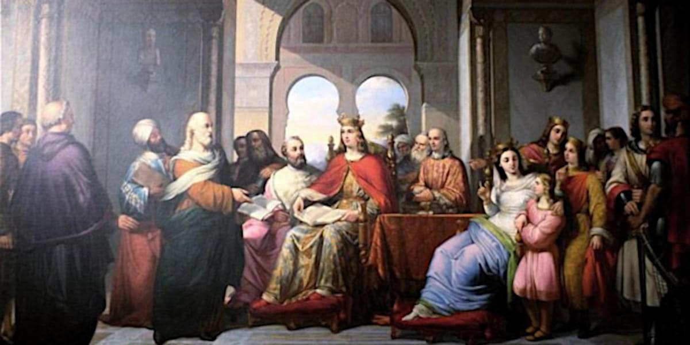

 

## L'essere umano è condannato ad essere libero

- **1st edition**, trascrizione del testo sviluppato in un [post](https://www.facebook.com/roberto.a.foglietta/posts/10162557010243736) di reshare su Facebook.

---

### Introduzione

> In Occidente pensiamo la libertà in senso positivo. Ma nel resto del mondo no: in persiano azadi richiama la nascita dell'individuo come parte di una comunità, perché il protoetimo è lo stesso di gignomai in greco antico oppure di nascor in latino. Anche in russo svaboda si riferisce all’ego, perché il prefisso sva- è l'equivalente di self- e questo sta a sottolineare che per molte civiltà, oggi come ieri, anteporre l’individuo alla collettività non è libertà, ma egoismo.
> -- **Dario Fabbri**.

La citazione di Dario Fabbri non rispecchia l'opinione dell'autore di questo testo e probabilmente nemmeno l'opinione di Fabbri, che stava spiegando il dilemma. Per coerenza la citazione è riportata in maniera quanto più completa a partire dal media dal quale è stata raccolta. Queste perché le persone intellettualmente educate e mature dialogano di idee, non limitando l'esercizio della parola alle loro personali opinioni.

---

### Il dilemma ego vs società

Nella contrapposizione fra la realizzazione del sé come individuo ovvero come componente dell'IO antitetica a quella del sé sociale, insiste il dilemma occidentale della libertà come realizzazione dell'ego. In esso insiste anche la malvagità del potere necessario per soddisfare il desiderio egoistico ma senza ricorrere al concetto rivoluzionario di libertà individuale, perché si passa per giustificazione di utilità sociale.

Il che ci porta a comprendere perché oggi, ancora più che in passato, il potere attiri gli individui psicopatici: perché più è emergente il contrasto fra libertà individuale e funzione sociale, l'abuso del potere come forma di ordine sul caos quindi indispensabile è l'unica forma concreta dell'utopia astratta e irrealizzabile del servant leader. Ovvero di un re che per sua magnanimità è posto al di sopra della società.

Quando invece la figura del re (in ambito moderno, essere leader di se stessi) nella storia umana ha sempre incarnato l'idolo vivente di un divinità (il faraone, re per volontà o natura divina) oppure il potere della forza bruta che porta ordine nel caos (veni, vidi, vinci ovvero Cesare il conquistatore). Però in realtà, la figura del monarca, ha sempre funzionato come sorgente del diritto (colui che pone il sigillo) oppure exception handler (l'oracolo che vaticina su questioni altrimenti non decidibili).

La modernità ha adottato i principi del diritto dalla tradizione di quello romano-latino mentre per l'indecidibilità abbiamo la teoria dell'informazione, in senso esteso del termine quindi dalla teoria dei giochi, a quella del chaos, a quella della statistica, etc. Rimangono quindi due soli aspetti dell'intreccio malsano fra ego, potere e società: la gestione delle eccezioni e il riconoscimento della sfera privata dell'individuo.

Quella sfera in cui l'individuo ha l'assoluto potere di esprimere se stesso, quindi di manifestare la prevalenza dell'ego, come antitesi dell'essere (o del funzionare) sociale. Una sfera che attualmente viene inibita e compressa dalla morale talvolta travestita da etica, erosa dal gossip e dalla maldicenza. Perché il dramma della modernità è che la libertà è un valore positivo (ma antisociale) e quindi la società impone il controllo sul pensiero.

Il controllo del pensiero, così come della vita privata, è l'abbattimento dell'ultima barriera fra l'individuo (ego) e la società: il marito imposto, la gravidanza obbligata, il pater familias, la schiavitù, etc. fino anche alla propaganda nazista che incarna il modello dell'alveare. Insomma, tutto quello che non si è voluto portare nella modernità, non per mettere in discussione la civiltà, anzi, ma per porre un limite al potere della società che nel frattempo era diventata potentissima e invasiva grazie alle telecomunicazioni.

In questo scenario, la figura apicale di novello monarca riveste ancora l'importanza di gestore delle eccezioni come decisore ultimo qualora a causa della velocità insita nel progresso della modernità non si conosce ancora come gestire le novità emergenti. 

Un problema che è sempre esistito e che fondamentalmente è sempre stato tipico della primogenitura: l'esploratore, colui il cui potere era giustificato non dall'ordine costituito ma dalla necessità di ampliare gli spazi vitali di una società in rapida crescita (allora demograficamente, oggi in termini di progresso tecnologico quindi innovazione).

---

### La nostalgia per la monarchia

Coloro che pensano che l'idea di riportare in vita il concetto di monarca come decisore di ultima istanza sia peregrina, sarebbe anche il caso che questa lacuna di "pater familias" non garantisce affatto la libertà e l'emancipazione ma piuttosto permette la diffusione del gossip come elemento di controllo sociale, la macchina del fango che si estende dalla politica delle chiacchiere a tutta la società.

A chi ritiene peregrina l’idea di reintrodurre una figura sovrana come decisore di ultima istanza, andrebbe ricordato che la sua assenza non ha garantito maggiore libertà o emancipazione. Al contrario, il vuoto lasciato da quella funzione di autorità, un tempo incarnata dal pater familias o dal monarca, è stato colmato dal consenso collettivo manipolato dal gossip, subdolamento orchestrato.

Un regime costruito dalla macchina del fango, inizialmente usata in politica e successivamente per invadere la sfera personale dei privati cittadini, mettendo in discussione quello spazio di autodeterminazione che era una conquista della modernità come ragionevole equilibrio fra l'ego individuale e il ruolo sociale dell'individuo. Creando situazioni grottesche come i cortei di drag-queen.

Il burlesque, come esempio divisivo e caso evidente, usato per far presentare i diritti di alcuni come "speciali" e quindi separati dagli altri. Quando invece la massima garanzia si sarebbe ottenuta della loro affermazione come parte dei diritti umani e quindi universali. Perché se il diritto ad essere "diversi" è una componente indivisibile di un diritto universale, è massimamente garantito da tutti e per tutti.

In sostanza la dissoluzione fra il diritto alla sfera personale e quindi privata dal diritto all'esibizione che è tutt'altra cosa e per altro incompatibile proprio con il concetto di sfera privata come comfort zone in cui l'individuo può essere, non solo libero dal giudizio del consenso, ma anche pienamente garantito di esprimere il proprio ego, incluse le perversioni sessuali legittime fra adulti consenzienti ma non per questo adatte ad essere spettacolo per tutti.

Chiaramente un punto di forte tensione, un punto di rottura, perché incide su un dilemma fondamentale che riguarda proprio la dissoluzione della sfera privata e personale operata dai social media che hano reso la modernità NON più legittimata avendo distrutto l'equilibrio che si era venuto a creare fra egos e civitas. Non fra morale e decenza, ma fra ciò che è per sua natura intimo, quindi non pubblico e quindi non soggetto ad approvazione sociale.

In sintesi, e in termini popolari, potevate avere Federico II di Svevia ma dimostrandosi sudditi indegni dello Stupor Mundi avendo preferito concentrare la vostra attenzione su ciò che invece avrebbe dovuto essere rispettato come ambito della sfera esclusivamente personale, vi troverete sottomessi al regno di Vlad III detto l'impalatore perché Historia Magistra Vitae ripete la lezione che non è stata compresa o è stata dimenticata.

---

### L'epilogo ragionato

La citazione di Fabbri è il punto di partenza per un'analisi del dilemma individuo società. Che viene espanso dall'autore del testo, in termini generali e poi declinato con un taglio che è chiaramente qualcosa di più vicino alla sua percezione e quindi alla sua opinione.

Che poi non è nemmeno la sua opinione intimamente personale ma più una conclusione a partire dall'osservazione del concetto di Ubuntu: io sono ciò che sono perché voi siete ciò che siete. Anche il sovrano, chiunque esso sia, è espressione del contesto e della società che va a regolare altrimenti da essa sarebbe alienato come un tempo si diceva fosse Maria Antonietta.

Si tratta appunto di un dilemma infranto nel suo essenziale equilibrio che in una fase di transizione richiede nell'opinione esposta dal testo un gestore delle eccezioni perché la costruzione di strumenti collettivi (corti, leggi, etc.) richiede un tempo e una consapevolezza che non è disponibile attualmente e che richiede tempo per essere sviluppata (e.g. una generazione).

Già i greci antichi si sceglievano un tiranno ("tyrannos") quando la situazione lo richiedeva necessario. Però "tiranno" è un termine che nel mondo moderno ha un eccezione spiccatamente negativa ("despotes") mentre "re" mantiene ancora una forma romantica e accettabile anche se ha il difetto di essere un titolo ereditario a differenza del concetto di tiranno greco che però nel mondo moderno assomiglia al concetto molto più pericoloso di "uomo del destino" ("Führerprinzip").

Non era inevitabile, se è diventato inevitabile (o qualore lo fosse diventato) è solo post-hoc, ergo il "destino" non esiste a priori ma solo come lettura retrospettiva a posteriori che nel tentativo di spiegare le cose, giustifica se stessa (narrazione).

In pratica: un'alternativa e la relativa opzione di scelta è sempre esistita, ma nel riconoscere ciò si ammette anche la responsabilità del risultato e quindi dell'inevitabilità conseguenze di una scelta che però non sono mai stati inevitabile in senso epistemologico ("destino") ma di mero causa-effetto (forza di gravità).

---

### Conclusione

Satre affermò che l'essere umano è condannato ad essere libero. Però il destino non esiste, se non come costruzione post-hoc ovvero tautologia narrativa, allora la condanna alla libertà potrebbe essere reale ma la sua esecuzione differita nel tempo, quando ormai troppo tardi e quindi inutile.

Aka carpe diem vs panta rei, ci "fottono" il destino ad essere liberi posticipando l'azione finché troppo tardi per essere utile, ma anche questa manipolazione è solo un'illusione che cessa di essere efficace quando smettiamo di scrollare il reel e agiamo, senza una logica di mera causalità.

+

## Related articles

- [Introduzione alla politica, concetti di base](339-introduzione-alla-politica-concetti-di-base.md#?target=_blank) &nbsp; (2025-10-03)

- [Il QE al tempo dell'analfabetismo funzionale](335-il-qe-al-tempo-dell-analfabetismo-funzionale.md#?target=_blank) &nbsp; (2025-09-03)

- [Italia: fuga di cervelli e falso documentale](330-italia-fuga-di-cervelli-e-falso-documentale.md#?target=_blank) &nbsp; (2025-07-01)

- [Meglio un monarca assoluto che una strega sul pisello](326-meglio-un-mondarca-assoluto-di-una-strega-sul-pisello.md#?target=_blank) &nbsp; (2025-06-20)

- [Il modello otto-novecentesco ha fallito](324-il-modello-otto-novecentesco-ha-fallito.md#?target=_blank) &nbsp; (2025-06-14)

- [Eppure Feynman l'avrebbe apprezzato](314-eppure-feynman-l-avrebbe-apprezzato.md#?target=_blank) &nbsp; (2025-05-11)

- [La misura del degrado del sistema](309-la-misura-del-degrado-del-sistema.md#?target=_blank) &nbsp; (2025-04-18)

- [Politics and democracy for dummies](302-politics-and-democracy-for-dummies.md#?target=_blank) &nbsp; (2025-03-03)

- [Il grande inganno della diversità](293-il-grande-inganno-della-diversita.md#?target=_blank) &nbsp; (2024-11-03)

- [The paper money is financial communism](278-the-paper-money-is-financial-communism.md#?target=_blank) &nbsp; (2024-07-31)

- [L'abominevole truffa dei bonus edilizi](263-l-abominevole-truffa-dei-bonus-edilizi.md#?target=_blank) &nbsp; (2024-05-22)

- [La guerra del dollaro contro l'euro](261-la-guerra-del-dollaro-contro-l-euro.md#?target=_blank) &nbsp; (2024-05-18)

+

## Share alike

&copy; 2025, **Roberto A. Foglietta** &lt;roberto.foglietta@gmail.com&gt;, [CC BY-NC-ND 4.0](https://creativecommons.org/licenses/by-nc-nd/4.0/)

