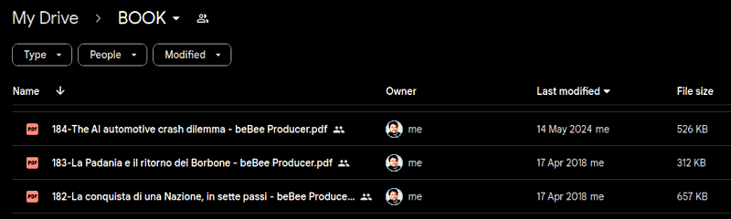

 

# Roberto A. Foglietta

---

 

## Rationale

[**`EN`**] Linkedin and beBee articles collected along the time in PDF format. Written and published under the personal brand **Roberto A. Foglietta** by Roberto Foglietta since 2016. This collection is presented here because with a certain regularity, usually 4 years, the social accounts are unilaterally deleted or frozen. The author's habit to print in PDF his articles and uploading on several Google Drive accounts made them last through adversities. The personal brand was created a little before 2000, in order to avoid existing and not desirable homonyms.

[**`IT`**] Articoli di Linkedin e beBee raccolti nel tempo in formato PDF. Scritti e pubblicati sotto il marchio personale **Roberto A. Foglietta** da Roberto Foglietta a partire dal 2016. Questa raccolta viene presentata qui perché con una certa regolarità, di solito 4 anni, gli account social vengono unilateralmente cancellati o congelati. L'abitudine dell'autore di stampare in PDF i suoi articoli e di caricarli su diversi account Google Drive li ha conservati nonostante le avversità. Il marchio personale è stato creato un po' prima del 2000, per evitare omonimie esistenti e non desiderabili.

### Data management

[**`EN`**] One of the benefits of this approach is that a PDF document generated with some difficulty from an article published on LinkedIn is 8 times larger in size than one easily generated with this approach. But it is only the tip of the iceberg, in fact by using a git-oriented approach we have the complete revision control and obviously direct management of the data produced both in terms of availability and in terms of licensing.

[**`IT`**] Uno dei benefici di questo approccio è che un documento PDF generato con una certa difficoltà da un articolo pubblicato su LinkedIn ha una dimensione 8 volte più grande di uno generato facilmente con questo approccio. Ma è solo la punta dell'iceberg, infatti usando un approccio git-oriented si ha il completo controllo delle revisioni e ovviamente la gestione diretta dei dati prodotti sia in termini di disponibilità sia in termini di licenza.

### Format conversion

[**`EN`**] The PDFs collection is splitted into two folders [pdf.todo](pdf.todo) and [pdf.done](pdf.done) depending on whether they have already been converted to markdown format or not. Because the purpose of this project is also to revise and give a coherent and cohesive connotation to the collection of writings, not only to collect them in a single repository.

[**`IT`**] La raccolta di PDF é divisa in due cartelle [pdf.todo](pdf.todo) e [pdf.done](pdf.done) a seconda che siano già stati convertiti in formato markdown o meno. Perché lo scopo di questo progetto è anche quello di revisionare e dare una connotazione coerente e coesa all'insieme degli scritti, non solo di raccoglierli in un unico repository.

### The Internet memory

[**`EN`**] Internet memory has become a meme, a concept that emerged from the realisation that it is practically impossible to remove information once it has been shared on the Internet. Those who have little or no understanding of this new technology have invented the right to be forgotten more to support the myth of the "rebirth" or more prosaically "*revergination*" of politicians or supposed politicians who have been trounced by history even more than by the ballot box. To remove any doubts about the idea of opposing technological modernity, I think one image will suffice.

[**`IT`**] La memoria di Internet è diventata un meme, un concetto emerso dal prendere atto che in pratica è impossibile rimuovere delle informazioni una volta che esse sono state condivise in Internet. Coloro che poco o niente hanno capito di questa nuova tecnologia si sono inventati il diritto all'oblio più che altro per supportare il mito della "rinascita" o più prosaicamente detta "*revergination*" di politici o supposti tali che sono stati trombati dalla storia ancora più che dalle urne. Per togliere ogni velleità di dubbio all'idea di opporsi alla modernità tecnologica, penso basti un'immagine.

 <i>Click</i> <a href="img/cloud-document-collection.png" target="_blank">here</a> <i>to view in full the screenshot</i>
 

[**`EN`**]  Most of the two billion Internet users have a cloud drive like this. Many have more than one and each drive keeps a history of documents, their revisions and versions, sometimes even deleted ones as Apple has shown to us. Everyone of these accounts can upload data again in public or share it in public among groups or in private among close friends. Moreover, between any two people chosen from these 2 billion, there are no more than 7 personal connections to reach anyone else on this planet. This means that, in the worst case, a document can travel around the world in 7 days if it is urgent and necessary.

[**`IT`**] La maggior parte dei due miliardi di utenti di Internet hanno un drive cloud come questo. Molti ne hanno più di uno e ognuno di drive conserva una cronologia dei documenti, delle loro revisioni e versioni, talvolta anche di quelli cancellati come Apple ci ha dimostrato. Ognuno di questi account può caricare nuovamente i dati in pubblico o condividerli in pubblico tra gruppi o in privato tra amici intimi. Inoltre, tra due persone qualsiasi scelte tra questi 2 miliardi, non ci sono più di 7 connessioni personali per raggiungere chiunque altro su questo pianeta. Ciò significa che, nel peggiore dei casi, un documento può fare il giro del mondo in 7 giorni, se è urgente e necessario.

 

## Website

* &nbsp;[robang74.github.io/roberto-a-foglietta](https://robang74.github.io/roberto-a-foglietta)

[**`EN`**] The website is easier to browse, but not always up to date with the [github](https://github.com/robang74/roberto-a-foglietta?tab=readme-ov-file#roberto-a-foglietta) project. However, the information presented in the website are more stable and reviewed compared the github project that can be working in progress.

[**`IT`**] Il sito web è più facile da consultare, ma non sempre aggiornato rispetto al progetto [github](https://github.com/robang74/roberto-a-foglietta?tab=readme-ov-file#roberto-a-foglietta). Tuttavia, le informazioni presentate nel sito web sono più stabili e riviste rispetto al progetto github, che può essere in corso di modifica.

 

## Forum

* &nbsp;[open discussions forum](https://github.com/robang74/roberto-a-foglietta/discussions)

[**`EN`**] This forum is open for debates about documents included into this collection and other topics that may enter into it. You need a github account to post in that discussion forum or alternatively write to me by e-mail.

[**`IT`**] Questo forum è aperto a dibattiti sui documenti inclusi in questa raccolta e su altri argomenti che possono entrarvi. È necessario un account github per postare in quel forum di discussione o, in alternativa, scrivermi via e-mail.

* **`roberto.foglietta`@`gmail.com`** for a direct contact

 

## Index

[**`EN`**] As PDF documents are converted to markdown, they will be added to this index, in anti-chronological order as the chronological one is present in the file list given the numerical index preceding it in the name. Instead, new articles will be written directly in markdown format. Date of first publication is written in a universal format, like YYYY-MM-DD.

[**`IT`**] Man mano che i documenti in PDF saranno convertiti in markdown verranno aggiunti in questo indice, in ordine anticronologico giacché quello cronologico è presente nella lista dei file dato l'indice numerico che li precede nel nome. Invece, i nuovi articoli saranno scritti direttamente in formato markdown. La data di prima pubblicazione sarà riportata in formato universale come ANNO-MM-GG.

* 299 - 2025-01-09 - ([**`raw`**](https://raw.githubusercontent.com/robang74/roberto-a-foglietta/refs/heads/main/299-such-a-man-of-common-sense.md)) [[**`IT`**](https://raw-githubusercontent-com.translate.goog/robang74/roberto-a-foglietta/refs/heads/main/299-such-a-man-of-common-sense.md?_x_tr_sl=en&_x_tr_tl=it&_x_tr_hl=it-IT&_x_tr_pto=wapp)] [[**`DE`**](https://raw-githubusercontent-com.translate.goog/robang74/roberto-a-foglietta/refs/heads/main/299-such-a-man-of-common-sense.md?_x_tr_sl=en&_x_tr_tl=de&_x_tr_hl=de-DE&_x_tr_pto=wapp)] [[**`FR`**](https://raw-githubusercontent-com.translate.goog/robang74/roberto-a-foglietta/refs/heads/main/299-such-a-man-of-common-sense.md?_x_tr_sl=en&_x_tr_tl=fr&_x_tr_hl=fr-FR&_x_tr_pto=wapp)] [[**`ES`**](https://raw-githubusercontent-com.translate.goog/robang74/roberto-a-foglietta/refs/heads/main/299-such-a-man-of-common-sense.md?_x_tr_sl=en&_x_tr_tl=es&_x_tr_hl=es-ES&_x_tr_pto=wapp)] - [Such a man of Common Sense!](299-such-a-man-of-common-sense.md)

* 298 - 2025-01-07 - ([**`raw`**](https://raw.githubusercontent.com/robang74/roberto-a-foglietta/refs/heads/main/298-dietro-a-quel-nome-c-e-un-mondo.md)) [[**`EN`**](https://raw-githubusercontent-com.translate.goog/robang74/roberto-a-foglietta/refs/heads/main/298-dietro-a-quel-nome-c-e-un-mondo.md?_x_tr_sl=it&_x_tr_tl=en&_x_tr_hl=en-EN&_x_tr_pto=wapp)] [[**`DE`**](https://raw-githubusercontent-com.translate.goog/robang74/roberto-a-foglietta/refs/heads/main/298-dietro-a-quel-nome-c-e-un-mondo.md?_x_tr_sl=it&_x_tr_tl=de&_x_tr_hl=de-DE&_x_tr_pto=wapp)] [[**`FR`**](https://raw-githubusercontent-com.translate.goog/robang74/roberto-a-foglietta/refs/heads/main/298-dietro-a-quel-nome-c-e-un-mondo.md?_x_tr_sl=it&_x_tr_tl=fr&_x_tr_hl=fr-FR&_x_tr_pto=wapp)] [[**`ES`**](https://raw-githubusercontent-com.translate.goog/robang74/roberto-a-foglietta/refs/heads/main/298-dietro-a-quel-nome-c-e-un-mondo.md?_x_tr_sl=it&_x_tr_tl=es&_x_tr_hl=es-ES&_x_tr_pto=wapp)] - [Dietro a quel nome c'è un mondo](298-dietro-a-quel-nome-c-e-un-mondo.md)

* 297 - 2024-12-21 - ([**`raw`**](https://raw.githubusercontent.com/robang74/roberto-a-foglietta/refs/heads/main/297-il-delirio-dei-regolatori-delle-ai.md)) [[**`EN`**](297-il-delirio-dei-regolatori-delle-ai-EN.md)] [[**`DE`**](https://raw-githubusercontent-com.translate.goog/robang74/roberto-a-foglietta/refs/heads/main/297-il-delirio-dei-regolatori-delle-ai.md?_x_tr_sl=it&_x_tr_tl=de&_x_tr_hl=de-DE&_x_tr_pto=wapp)] [[**`FR`**](https://raw-githubusercontent-com.translate.goog/robang74/roberto-a-foglietta/refs/heads/main/297-il-delirio-dei-regolatori-delle-ai.md?_x_tr_sl=it&_x_tr_tl=fr&_x_tr_hl=fr-FR&_x_tr_pto=wapp)] [[**`ES`**](https://raw-githubusercontent-com.translate.goog/robang74/roberto-a-foglietta/refs/heads/main/297-il-delirio-dei-regolatori-delle-ai.md?_x_tr_sl=it&_x_tr_tl=es&_x_tr_hl=es-ES&_x_tr_pto=wapp)] - [Il delirio dei regolatori delle AI](297-il-delirio-dei-regolatori-delle-ai.md)

* 296 - 2024-12-15 - ([**`raw`**](https://raw.githubusercontent.com/robang74/roberto-a-foglietta/refs/heads/main/296-la-madre-di-tutte-le-guerre.md)) [[**`EN`**](https://raw-githubusercontent-com.translate.goog/robang74/roberto-a-foglietta/refs/heads/main/296-la-madre-di-tutte-le-guerre.md?_x_tr_sl=it&_x_tr_tl=en&_x_tr_hl=en-EN&_x_tr_pto=wapp)] [[**`DE`**](https://raw-githubusercontent-com.translate.goog/robang74/roberto-a-foglietta/refs/heads/main/296-la-madre-di-tutte-le-guerre.md?_x_tr_sl=it&_x_tr_tl=de&_x_tr_hl=de-DE&_x_tr_pto=wapp)] [[**`FR`**](https://raw-githubusercontent-com.translate.goog/robang74/roberto-a-foglietta/refs/heads/main/296-la-madre-di-tutte-le-guerre.md?_x_tr_sl=it&_x_tr_tl=fr&_x_tr_hl=fr-FR&_x_tr_pto=wapp)] [[**`ES`**](https://raw-githubusercontent-com.translate.goog/robang74/roberto-a-foglietta/refs/heads/main/296-la-madre-di-tutte-le-guerre.md?_x_tr_sl=it&_x_tr_tl=es&_x_tr_hl=es-ES&_x_tr_pto=wapp)] - [La madre di tutte le guerre](296-la-madre-di-tutte-le-guerre.md)

* 295 - 2024-12-14 - ([**`raw`**](https://raw.githubusercontent.com/robang74/roberto-a-foglietta/refs/heads/main/295-il-cambiamento-climatico-questo-sconosciuto.md)) [[**`EN`**](https://raw-githubusercontent-com.translate.goog/robang74/roberto-a-foglietta/refs/heads/main/295-il-cambiamento-climatico-questo-sconosciuto.md?_x_tr_sl=it&_x_tr_tl=en&_x_tr_hl=en-EN&_x_tr_pto=wapp)] [[**`DE`**](https://raw-githubusercontent-com.translate.goog/robang74/roberto-a-foglietta/refs/heads/main/295-il-cambiamento-climatico-questo-sconosciuto.md?_x_tr_sl=it&_x_tr_tl=de&_x_tr_hl=de-DE&_x_tr_pto=wapp)] [[**`FR`**](https://raw-githubusercontent-com.translate.goog/robang74/roberto-a-foglietta/refs/heads/main/295-il-cambiamento-climatico-questo-sconosciuto.md?_x_tr_sl=it&_x_tr_tl=fr&_x_tr_hl=fr-FR&_x_tr_pto=wapp)] [[**`ES`**](https://raw-githubusercontent-com.translate.goog/robang74/roberto-a-foglietta/refs/heads/main/295-il-cambiamento-climatico-questo-sconosciuto.md?_x_tr_sl=it&_x_tr_tl=es&_x_tr_hl=es-ES&_x_tr_pto=wapp)] - [Il cambiamento climatico, questo sconosciuto](295-il-cambiamento-climatico-questo-sconosciuto.md)

* 294 - 2024-11-27 - ([**`raw`**](https://raw.githubusercontent.com/robang74/roberto-a-foglietta/refs/heads/main/294-capire-e-la-chiave-di-volta.md)) [[**`EN`**](https://raw-githubusercontent-com.translate.goog/robang74/roberto-a-foglietta/refs/heads/main/294-capire-e-la-chiave-di-volta.md?_x_tr_sl=it&_x_tr_tl=en&_x_tr_hl=en-EN&_x_tr_pto=wapp)] [[**`DE`**](https://raw-githubusercontent-com.translate.goog/robang74/roberto-a-foglietta/refs/heads/main/294-capire-e-la-chiave-di-volta.md?_x_tr_sl=it&_x_tr_tl=de&_x_tr_hl=de-DE&_x_tr_pto=wapp)] [[**`FR`**](https://raw-githubusercontent-com.translate.goog/robang74/roberto-a-foglietta/refs/heads/main/294-capire-e-la-chiave-di-volta.md?_x_tr_sl=it&_x_tr_tl=fr&_x_tr_hl=fr-FR&_x_tr_pto=wapp)] [[**`ES`**](https://raw-githubusercontent-com.translate.goog/robang74/roberto-a-foglietta/refs/heads/main/294-capire-e-la-chiave-di-volta.md?_x_tr_sl=it&_x_tr_tl=es&_x_tr_hl=es-ES&_x_tr_pto=wapp)] - [Capire è la chiave di volta](294-capire-e-la-chiave-di-volta.md)

* 293 - 2024-11-03 - ([**`raw`**](https://raw.githubusercontent.com/robang74/roberto-a-foglietta/refs/heads/main/293-il-grande-inganno-della-diversita.md)) [[**`EN`**](https://raw-githubusercontent-com.translate.goog/robang74/roberto-a-foglietta/refs/heads/main/293-il-grande-inganno-della-diversita.md?_x_tr_sl=it&_x_tr_tl=en&_x_tr_hl=en-EN&_x_tr_pto=wapp)] [[**`DE`**](https://raw-githubusercontent-com.translate.goog/robang74/roberto-a-foglietta/refs/heads/main/293-il-grande-inganno-della-diversita.md?_x_tr_sl=it&_x_tr_tl=de&_x_tr_hl=de-DE&_x_tr_pto=wapp)] [[**`FR`**](https://raw-githubusercontent-com.translate.goog/robang74/roberto-a-foglietta/refs/heads/main/293-il-grande-inganno-della-diversita.md?_x_tr_sl=it&_x_tr_tl=fr&_x_tr_hl=fr-FR&_x_tr_pto=wapp)] [[**`ES`**](https://raw-githubusercontent-com.translate.goog/robang74/roberto-a-foglietta/refs/heads/main/293-il-grande-inganno-della-diversita.md?_x_tr_sl=it&_x_tr_tl=es&_x_tr_hl=es-ES&_x_tr_pto=wapp)] - [Il grande inganno della diversità](293-il-grande-inganno-della-diversita.md)

* 292 - 2024-10-13 - ([**`raw`**](https://raw.githubusercontent.com/robang74/roberto-a-foglietta/refs/heads/main/292-linux-android-and-redfish-os.md)) [[**`IT`**](https://raw-githubusercontent-com.translate.goog/robang74/roberto-a-foglietta/refs/heads/main/292-linux-android-and-redfish-os.md?_x_tr_sl=en&_x_tr_tl=it&_x_tr_hl=it-IT_x_tr_pto=wapp)] [[**`DE`**](https://raw-githubusercontent-com.translate.goog/robang74/roberto-a-foglietta/refs/heads/main/292-linux-android-and-redfish-os.md?_x_tr_sl=en&_x_tr_tl=de&_x_tr_hl=de-DE&_x_tr_pto=wapp)] [[**`FR`**](https://raw-githubusercontent-com.translate.goog/robang74/roberto-a-foglietta/refs/heads/main/292-linux-android-and-redfish-os.md?_x_tr_sl=en&_x_tr_tl=fr&_x_tr_hl=fr-FR&_x_tr_pto=wapp)] [[**`ES`**](https://raw-githubusercontent-com.translate.goog/robang74/roberto-a-foglietta/refs/heads/main/292-linux-android-and-redfish-os.md?_x_tr_sl=en&_x_tr_tl=es&_x_tr_hl=es-ES&_x_tr_pto=wapp)] - [Linux, Android & RedFish OS](292-linux-android-and-redfish-os.md)

* 287 - 2024-09-24 - ([**`raw`**](https://raw.githubusercontent.com/robang74/roberto-a-foglietta/refs/heads/main/287-zucchero-alimentazione-e-salute.md)) [[**`EN`**](https://raw-githubusercontent-com.translate.goog/robang74/roberto-a-foglietta/refs/heads/main/287-zucchero-alimentazione-e-salute.md?_x_tr_sl=it&_x_tr_tl=en&_x_tr_hl=en-EN&_x_tr_pto=wapp)] [[**`DE`**](https://raw-githubusercontent-com.translate.goog/robang74/roberto-a-foglietta/refs/heads/main/287-zucchero-alimentazione-e-salute.md?_x_tr_sl=it&_x_tr_tl=de&_x_tr_hl=de-DE&_x_tr_pto=wapp)] [[**`FR`**](https://raw-githubusercontent-com.translate.goog/robang74/roberto-a-foglietta/refs/heads/main/287-zucchero-alimentazione-e-salute.md?_x_tr_sl=it&_x_tr_tl=fr&_x_tr_hl=fr-FR&_x_tr_pto=wapp)] [[**`ES`**](https://raw-githubusercontent-com.translate.goog/robang74/roberto-a-foglietta/refs/heads/main/287-zucchero-alimentazione-e-salute.md?_x_tr_sl=it&_x_tr_tl=es&_x_tr_hl=es-ES&_x_tr_pto=wapp)] - [Zucchero, alimentazione e salute](287-zucchero-alimentazione-e-salute.md)

* 285 - 2024-09-22 - ([**`raw`**](https://raw.githubusercontent.com/robang74/roberto-a-foglietta/refs/heads/main/285-i-wish-to-be-a-wolf-accept-it.md)) [[**`IT`**](https://raw-githubusercontent-com.translate.goog/robang74/roberto-a-foglietta/refs/heads/main/285-i-wish-to-be-a-wolf-accept-it.md?_x_tr_sl=en&_x_tr_tl=it&_x_tr_hl=it-IT&_x_tr_pto=wapp)]  [[**`DE`**](https://raw-githubusercontent-com.translate.goog/robang74/roberto-a-foglietta/refs/heads/main/285-i-wish-to-be-a-wolf-accept-it.md?_x_tr_sl=it&_x_tr_tl=de&_x_tr_hl=de-DE&_x_tr_pto=wapp)] [[**`FR`**](https://raw-githubusercontent-com.translate.goog/robang74/roberto-a-foglietta/refs/heads/main/285-i-wish-to-be-a-wolf-accept-it.md?_x_tr_sl=it&_x_tr_tl=fr&_x_tr_hl=fr-FR&_x_tr_pto=wapp)] [[**`ES`**](https://raw-githubusercontent-com.translate.goog/robang74/roberto-a-foglietta/refs/heads/main/285-i-wish-to-be-a-wolf-accept-it.md?_x_tr_sl=it&_x_tr_tl=es&_x_tr_hl=es-ES&_x_tr_pto=wapp)] - [I wish to be a wolf, accept it](285-i-wish-to-be-a-wolf-accept-it.md)

* 278 - 2024-07-31 - ([**`raw`**](https://raw.githubusercontent.com/robang74/roberto-a-foglietta/refs/heads/main/278-the-paper-money-is-financial-communism.md)) [[**`IT`**](https://raw-githubusercontent-com.translate.goog/robang74/roberto-a-foglietta/refs/heads/main/278-the-paper-money-is-financial-communism.md?_x_tr_sl=en&_x_tr_tl=it&_x_tr_hl=it-IT&_x_tr_pto=wapp)] [[**`DE`**](https://raw-githubusercontent-com.translate.goog/robang74/roberto-a-foglietta/refs/heads/main/278-the-paper-money-is-financial-communism.md?_x_tr_sl=en&_x_tr_tl=de&_x_tr_hl=de-DE&_x_tr_pto=wapp)] [[**`FR`**](https://raw-githubusercontent-com.translate.goog/robang74/roberto-a-foglietta/refs/heads/main/278-the-paper-money-is-financial-communism.md?_x_tr_sl=en&_x_tr_tl=fr&_x_tr_hl=fr-FR&_x_tr_pto=wapp)] [[**`ES`**](https://raw-githubusercontent-com.translate.goog/robang74/roberto-a-foglietta/refs/heads/main/278-the-paper-money-is-financial-communism.md?_x_tr_sl=en&_x_tr_tl=es&_x_tr_hl=es-ES&_x_tr_pto=wapp)] - [The paper money is financial communism](278-the-paper-money-is-financial-communism.md)

* 265 - 2024-06-07 - ([**`raw`**](https://raw.githubusercontent.com/robang74/roberto-a-foglietta/refs/heads/main/265-the-brics-financial-system-hope-or-ww3.md)) [[**`IT`**](https://raw-githubusercontent-com.translate.goog/robang74/roberto-a-foglietta/refs/heads/main/265-the-brics-financial-system-hope-or-ww3.md?_x_tr_sl=en&_x_tr_tl=it&_x_tr_hl=it-IT&_x_tr_pto=wapp)] [[**`DE`**](https://raw-githubusercontent-com.translate.goog/robang74/roberto-a-foglietta/refs/heads/main/265-the-brics-financial-system-hope-or-ww3.md?_x_tr_sl=en&_x_tr_tl=de&_x_tr_hl=de-DE&_x_tr_pto=wapp)] [[**`FR`**](https://raw-githubusercontent-com.translate.goog/robang74/roberto-a-foglietta/refs/heads/main/265-the-brics-financial-system-hope-or-ww3.md?_x_tr_sl=en&_x_tr_tl=fr&_x_tr_hl=fr-FR&_x_tr_pto=wapp)] [[**`ES`**](https://raw-githubusercontent-com.translate.goog/robang74/roberto-a-foglietta/refs/heads/main/265-the-brics-financial-system-hope-or-ww3.md?_x_tr_sl=en&_x_tr_tl=es&_x_tr_hl=es-ES&_x_tr_pto=wapp)] - [The BRICS financial system, hope or WW3?](265-the-brics-financial-system-hope-or-ww3.md)

* 261 - 2024-05-18 - ([**`raw`**](https://raw.githubusercontent.com/robang74/roberto-a-foglietta/refs/heads/main/261-la-guerra-del-dollaro-contro-l-euro.md)) [[**`EN`**](https://raw-githubusercontent-com.translate.goog/robang74/roberto-a-foglietta/refs/heads/main/261-la-guerra-del-dollaro-contro-l-euro.md?_x_tr_sl=it&_x_tr_tl=en&_x_tr_hl=en-EN&_x_tr_pto=wapp)] [[**`DE`**](https://raw-githubusercontent-com.translate.goog/robang74/roberto-a-foglietta/refs/heads/main/261-la-guerra-del-dollaro-contro-l-euro.md?_x_tr_sl=it&_x_tr_tl=de&_x_tr_hl=de-DE&_x_tr_pto=wapp)] [[**`FR`**](https://raw-githubusercontent-com.translate.goog/robang74/roberto-a-foglietta/refs/heads/main/261-la-guerra-del-dollaro-contro-l-euro.md?_x_tr_sl=it&_x_tr_tl=fr&_x_tr_hl=fr-FR&_x_tr_pto=wapp)] [[**`ES`**](https://raw-githubusercontent-com.translate.goog/robang74/roberto-a-foglietta/refs/heads/main/261-la-guerra-del-dollaro-contro-l-euro.md?_x_tr_sl=it&_x_tr_tl=es&_x_tr_hl=es-ES&_x_tr_pto=wapp)] - [La guerra del dollaro contro l'euro](261-la-guerra-del-dollaro-contro-l-euro.md)

* 236 - 2023-12-31 - ([**`raw`**](https://raw.githubusercontent.com/robang74/roberto-a-foglietta/refs/heads/main/236-a-post-covid-pandemic-review.md)) [[**`IT`**](https://raw-githubusercontent-com.translate.goog/robang74/roberto-a-foglietta/refs/heads/main/236-a-post-covid-pandemic-review.md?_x_tr_sl=en&_x_tr_tl=it&_x_tr_hl=it-IT&_x_tr_pto=wapp)] [[**`DE`**](https://raw-githubusercontent-com.translate.goog/robang74/roberto-a-foglietta/refs/heads/main/236-a-post-covid-pandemic-review.md?_x_tr_sl=en&_x_tr_tl=de&_x_tr_hl=de-DE&_x_tr_pto=wapp)] [[**`FR`**](https://raw-githubusercontent-com.translate.goog/robang74/roberto-a-foglietta/refs/heads/main/236-a-post-covid-pandemic-review.md?_x_tr_sl=en&_x_tr_tl=fr&_x_tr_hl=fr-FR&_x_tr_pto=wapp)] [[**`ES`**](https://raw-githubusercontent-com.translate.goog/robang74/roberto-a-foglietta/refs/heads/main/236-a-post-covid-pandemic-review.md?_x_tr_sl=en&_x_tr_tl=es&_x_tr_hl=es-ES&_x_tr_pto=wapp)] - [A post covid pandemic review](236-a-post-covid-pandemic-review.md)v

* 090 - 2017-10-13 - ([**`raw`**](https://raw.githubusercontent.com/robang74/roberto-a-foglietta/refs/heads/main/090-l-importanza-del-tcmo.md)) [[**`EN`**](https://raw-githubusercontent-com.translate.goog/robang74/roberto-a-foglietta/refs/heads/main/090-l-importanza-del-tcmo.md?_x_tr_sl=it&_x_tr_tl=en&_x_tr_hl=en-EN&_x_tr_pto=wapp)] [[**`DE`**](https://raw-githubusercontent-com.translate.goog/robang74/roberto-a-foglietta/refs/heads/main/090-l-importanza-del-tcmo.md?_x_tr_sl=it&_x_tr_tl=de&_x_tr_hl=de-DE&_x_tr_pto=wapp)] [[**`FR`**](https://raw-githubusercontent-com.translate.goog/robang74/roberto-a-foglietta/refs/heads/main/090-l-importanza-del-tcmo.md?_x_tr_sl=it&_x_tr_tl=fr&_x_tr_hl=fr-FR&_x_tr_pto=wapp)] [[**`ES`**](https://raw-githubusercontent-com.translate.goog/robang74/roberto-a-foglietta/refs/heads/main/090-l-importanza-del-tcmo.md?_x_tr_sl=it&_x_tr_tl=es&_x_tr_hl=es-ES&_x_tr_pto=wapp)] - [L'importanza del TCMO](090-l-importanza-del-tcmo.md)

[**`EN`**] Yet unconverted articles saved in PDF, and written since December 2015.

[**`IT`**] Articoli in PDF ancora da convertire, e scritti a partire dal dicembre 2015.

* 001 up to 291, those not listed above - [pdf.todo](pdf.todo) folder

 

## Related

[**`EN`**] There are two other collections of texts that are worth listing here as they are related to this documentation work. Both of these collections make use, albeit in different ways, of artificial intelligence. In the first, the texts are peer-reviewed with an AI impersonating a collaborative agent-antagonist while in the second, the documents submitted to the AI are merely a dialogue cue to develop interaction with it. The date refers to the first commit.

[**`IT`**] Ci sono altre due collezioni di testi che vale la pena elencare qui in quanto legate a questo lavoro di documentazione. Entrambe queste collezioni si avvalgono, sebbene in maniera diversa, dell'intelligenza artificiale. Nella prima, i testi sono sottoposti ad una peer-review con un'AI che impersona un agente collaborativo-antagonista mentre nella seconda, i documenti sottoposti all'AI sono solo uno spunto di dialogo per sviluppare l'interazione con essa. La data si riferisce al primo commit.

* [chatgpt answered prompts](https://robang74.github.io/chatgpt-answered-prompts) source on [github](https://github.com/robang74/chatgpt-answered-prompts?tab=readme-ov-file#qa-dialogs-with-ai-chatbots) (2024-09-06)

* [chatbots for fun (humor!)](https://robang74.github.io/chatbots-for-fun) source on [github](https://github.com/robang74/chatbots-for-fun?tab=readme-ov-file#chatbots-for-fun) (2024-11-17)

[**`EN`**] Despite the title the first texts collection is not limited to using ChatGPT but also chatbots like Mistral AI have been involved. The title of the project did not change because mainly it still fits and for keeping alive the links previously shared with other people. Moreover, while the first collection has a serious cut, the second is definitely oriented to a humoristic approach even when very serious topics are investigated.

[**`IT`**] Nonostante il titolo, la prima raccolta di testi non si limita all'uso di ChatGPT, ma sono stati coinvolti anche chatbot come Mistral AI. Il titolo del progetto non è cambiato perché è ancora adatto per la maggiore e per mantenere vivi i link condivisi precedentemente con altre persone. Inoltre, mentre la prima raccolta ha un taglio serio, la seconda è decisamente orientata a un approccio umoristico anche quando vengono indagati temi molto seri.

 

## Translations

[**`EN`**] As much as possible most of the documents presented here will be translated in two languages: Italian and English. The first is the native language of the author and the second is an international idioma. As per thumb rule, PDF and raw markdown text documents can be translated using Google Translation online service. In a single call for each document.

[**`IT`**] Per quanto possibile, la maggior parte dei documenti qui presentati sarà tradotta in due lingue: Italiano e Inglese. La prima è la lingua madre dell'autore e la seconda è un idioma internazionale. Come regola generale, i documenti PDF e il testo grezzo markdown possono essere tradotti utilizzando il servizio online Google Translation. In un'unica chiamata per ogni documento.

[**`EN`**] Or, alternatively, using a translation browser plug-in that can offer the translation during the navigation. Almost all documents, but not all, because some documents are obsolete or not so relevant anymore. Hence, some few documents are saved here just for sake of completeness of the backup or for a future reviewing and/or development.

[**`IT`**] Oppure, in alternativa, si può utilizzare un plug-in del browser di traduzione che può offrire la traduzione durante la navigazione. Quasi tutti i documenti, ma non tutti, perché alcuni documenti sono obsoleti o non più rilevanti. Pertanto, alcuni documenti sono salvati qui solo per completezza del backup o per una futura revisione e/o sviluppo.

 

## Script tools

[**`EN`**] There is a folder that contains few script [tools](tools) and you may be interested in a couple of them.

[**`IT`**] C'è una cartella che contiene alcuni script [tools](tools) e potreste essere interessati a un paio di essi.

#### HTML

[**`EN`**] The shell script [tools/md2html.sh](tools/md2html.sh) converts the articles in markdown format into HTML pages which are created in the local `html` directory when `bash tools/md2html.sh` runs on the top directory of the locally cloned repository. The syntax is easy `md2html.sh [-z] [namefile.md]` and with `-z` creates the zip archive. The [html/default.css](html/default.css) is imported and embedded into the created page, to provide a dark theme. Unless the browser can find a local file named `custom.css` which can override the default CSS style. This allows users to change the style in a very easy and straightforward way.

[**`IT`**] Lo shell script [tools/md2html.sh](tools/md2html.sh) converte gli articoli in formato markdown in pagine HTML che vengono create nella cartella locale `html` quando viene eseguito `bash tools/md2html.sh` sulla directory radice del repository clonato in locale. La sintassi è semplice `md2html.sh [-z] [namefile.md]` e con `-z` crea anche l'archivio zip. Il file [html/default.css](html/default.css) viene importato e incorporato nella pagina creata, per fornire un tema scuro. A meno che il browser non trovi un file locale chiamato `custom.css` che può rimpiazzare lo stile CSS predefinito. Questo permette agli utenti di cambiare lo stile in modo molto semplice e diretto.

#### PDF

[**`EN`**] The shell script [html/html2pdf.sh](tools/html2pdf.sh) converts the html pages into PDF document. The syntax is easy `html2pdf.sh [-g] [-c|-w] $finame.md` and allows to create a PDF also using `pdfcool.css` (blushift grayscale) and `pdfwamr.css`  (redshift grayscale) or a using a pure grayscale based on one of these two. Alternatively, we can use `custom.css`, otherwise the PDF will be produced with a black background as html pages have by default.

[**`IT`**] Lo script di shell [html/html2pdf.sh](tools/html2pdf.sh) converte le pagine html in documenti PDF. La sintassi è semplice `html2pdf.sh [-g] [-c|-w] $nomefile.md` e permette di creare un PDF anche usando `pdfcool.css` (grigio con toni di blu) e `pdfwamr.css` (grigio con toni di rosso) o usando una scala di grigi pura basata su uno di questi due. In alternativa si può usare `custom.css`, altrimenti il PDF verrà prodotto con lo sfondo nero come le pagine html hanno per default.

 

## Warp meme

[**`EN`**] Sun Tzu in **The Art of War** is written that the aim of the war is not winning but creating the conditions for a long lasting peace and at the beginning of that essay, he also wrote that "*The supreme art of war is to subdue the enemy without fighting.*" which clearly states that is not by violence which can achieved the best. Joseph Joubert quote reports almost an identical concept "*The aim of argument should not be victory, but progress*".

[**`IT`**] Sun Tzu ne **L'Arte della Guerra** è scritto che lo scopo della guerra non è vincere, ma creare le condizioni per una pace duratura e, all'inizio di quel saggio, scrisse anche che “*L'arte suprema della guerra è sottomettere il nemico senza combattere*”, affermando chiaramente che non è con la violenza che si può ottenere il meglio. La citazione di Joseph Joubert riporta un concetto quasi identico: “Lo scopo dell'argomentazione non deve essere la vittoria, ma il progresso”.

[**`EN`**] Moreover, Karl Popper proposed the falsification principle as a foundation pillar of science, he accepted the same concept, achieve the progress by a constructive confrontation. It is obvious that someone can decide at any moment to use violence to subdue us and this creates the unavoidable need of being ready for defending ourselves. However, as stated by Sun Tzu and elaborated by others in the next 25 centuries, the best way in acting is using the brain in a clever way rather than trusting the brute force only.

[**`IT`**] Inoltre, Karl Popper ha proposto il principio di falsificazione come pilastro portante della scienza, accettando lo stesso concetto: raggiungere il progresso attraverso un confronto costruttivo. È ovvio che qualcuno può decidere in qualsiasi momento di usare la violenza per sottometterci e questo crea l'inevitabile necessità di essere pronti a difenderci. Tuttavia, come affermato da Sun Tzu ed elaborato da altri nei 25 secoli successivi, il modo migliore di agire è usare il cervello in modo intelligente piuttosto che affidarsi solo alla forza bruta.

[**`EN`**] Finally, it is worth noticing that Fabrizio De Andrè, already in 1973, was singing: "*Today's intellectuals, tomorrow's idiots, give me back enough brain to serve my hands*". Here we are!

[**`IT`**] Infine, vale la pena di notare che Fabrizio De Andrè, già nel 1973, cantava: "*Intellettuali d'oggi idioti di domani ridatemi il cervello che basta alle mie mani*". Ecco qui, quindi!

 

## Copyright

#### &copy; 2024, **Roberto A. Foglietta** &lt;roberto.foglietta@gmail.com&gt;

All the files in this gihub repository are published **Creative Commons Attribution Non-Commercial No-Derivatives 4.0 International** license terms ([CC BY-NC-ND 4.0](https://creativecommons.org/licenses/by-nc-nd/4.0/)), unless stated differently or not applicable due to a different and previous authorship.

Moreover, if a version of a document included in this repository exists or has existed under different licence terms, the licence terms of the latest version presented here apply. Even when the new licence terms are more restrictive, because permissions for any free content may be revoked at any time at the will of the author, and updating a licence to be more restrictive explicitly implies this will.

Finally, these licensing terms apply to the single document and to the entire collection as a collection, as well.

